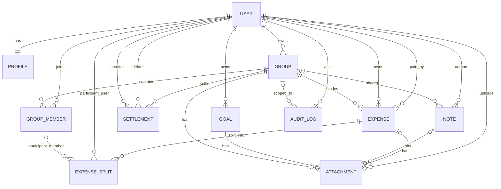
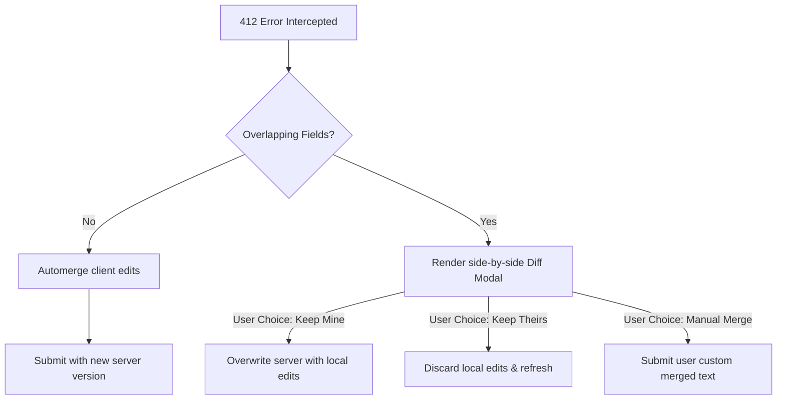
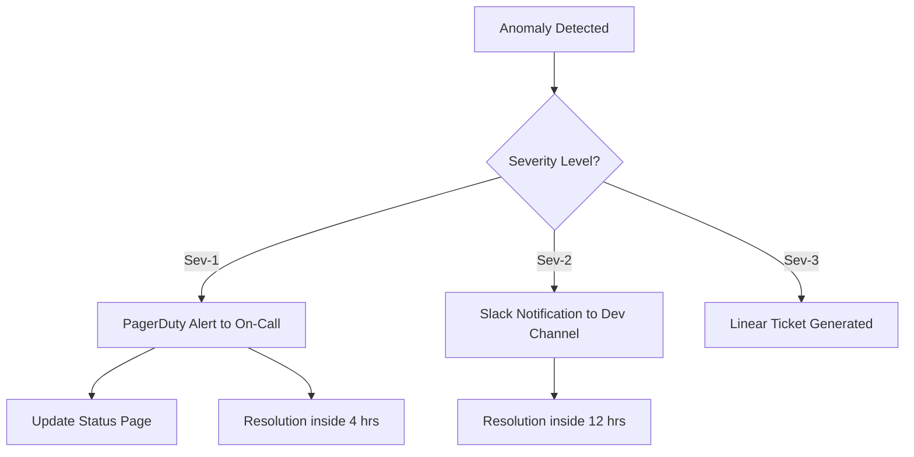

# 💰 FinMate — Personal Finance & Lifestyle Companion

## 🧩 Overview

**FinMate** is a comprehensive web and mobile application designed to manage, analyze, and share personal and group expenses. It also integrates notes, goals, and AI insights to make financial management intuitive, collaborative, and intelligent.

---

I've reviewed the suggestions against your current spec. Here's my assessment:

**Critical Gaps to Address (in priority order):**

1. **Data Model & ERD** — Required before backend development starts
2. **API Contracts** — Essential to prevent integration rework
3. **RBAC Matrix** — Authorization rules are vague; define role/permission pairs explicitly
4. **Settlement Algorithm** — Core feature is undefined; needs pseudo-code or formula
5. **Encryption Boundary Table** — Clarify what's encrypted vs. what the AI can access (zero-knowledge conflict)
6. **Real-time Conflict Resolution** — Define versioning/locking strategy for shared edits
7. **Error Model & Validation Standards** — Standardize error responses across API
8. **Import/Export Schemas** — CSV/XLSX format specs are missing

**Medium Priority:**

- Backup/RTO/RPO requirements
- Cost/dependency constraints (OpenAI, Supabase, Sentry limits)
- Offline key-management details

**Fair Concerns:**

- 200KB bundle target may be tight given scope; document MVP boundary
- "One-click setup" needs detailed scripting plan
- Zero-knowledge + AI analysis needs reconciliation

**Recommendation:**
Add a new section **"System Design Details"** after "Architecture & Tech Stack" covering:

- Domain Model (entities, relationships)
- RBAC Matrix (roles × permissions)
- Encryption Classification (per-data rules)
- API Error Taxonomy
- Settlement Logic (pseudocode)

Then add **"Operational Requirements"** section (RTO/RPO, backups, incident response).

Should I draft the replacement markdown for these sections?

| Layer                   | Technology                         | Notes                                  |
| ----------------------- | ---------------------------------- | -------------------------------------- |
| **Frontend**            | Angular 19 (Standalone Components) | Modular, scalable, SSR-ready           |
| **Backend**             | NestJS + Fastify                   | High-performance REST API, WebSockets  |
| **Database**            | PostgreSQL 16 + pgcrypto           | ACID compliance, encrypted storage     |
| **Cache Layer**         | Redis 7.x                          | Session store, rate limiting, caching  |
| **State Management**    | NGXS + RxJS                        | Predictable state, optimized selectors |
| **Deployment**          | Docker + Docker Compose            | One-click local & cloud deployment     |
| **AI Integration**      | OpenAI API (GPT-4)                 | Smart insights & chatbot               |
| **Auth**                | JWT + Argon2 + 2FA                 | Secure session, encryption, RBAC       |
| **Storage**             | Supabase Storage                   | Encrypted files, CDN delivery          |
| **CDN**                 | Cloudflare (Free)                  | Global edge caching, DDoS protection   |
| **Offline Support**     | PWA + Service Workers + IndexedDB  | Offline-first, encrypted local storage |
| **Performance Monitor** | Lighthouse CI + Web Vitals         | Continuous performance tracking        |

---

## 🧠 Core Features

### A. Expense Management

- Add/edit/delete categorized expenses.
- Monthly and yearly analytics.
- Group-based shared expense tracking.
- Balance carry-forward and debt simplification.
- Multi-user expense contribution tracking.
- **Personal/Group-less Expenses**: Supports personal expenses added from the dashboard and aggregated into a month-end monthly total.

### B. Shared Group Module

- Create or join expense groups (public/private).
- **Multi-Identifier Invites**: Add members by email, username, or phone number, displaying the user's full name to ensure clarity.
- **QR Code & Link Invites**: Join groups via secure invite links/QR codes, routing to a landing page with group info and a Join/Decline action.
- **Dashboard Invite Manager**: View and manage all pending invitations directly from the dashboard.
- **Invite Revocation**: Group owners/admins can revoke pending invitations.
- **Household Contribution Settings**: Set custom member contribution percentages month-by-month for household groups, with dashboard bar charts comparing expected target budgets to actual spending.
- **Carry-Forward Settings**: Expose a single toggle inside settings to specify whether monthly surplus/deficit contributions carry forward or reset.
- Shared ledger with smart settlement.
- **Export/Import (CSV, XLSX) Support**:
  Enables offline bulk editing and migrations. Exported files MUST align with the import schema, allowing zero-modification re-imports of the exact same records.

  For the detailed column layout, validators, and transaction rules, see the consolidated [expsnsis-module-plan.md (Import/Export schemas)](file:///g:/prvn/Projects/FinMate/expsnsis-module-plan.md#8-importexport-csv-xlsx-support).

- Collaborative notes inside groups.

### C. Notes & Content Integration

- Personal and shared notes.
- Import social media posts (Instagram, etc.).
- AI summarization and tagging.

### D. Goal & Saving Tracker

- Define financial goals (e.g., “Trip to Goa”).
- Track savings progress.
- Set reminders and targets.

### E. AI Assistant

- Smart insights and analysis.
- Automatic expense categorization.
- Summarization and reminders.

### F. Settings & Controls

- Enable/disable collaboration.
- Manage import/export permissions.
- Sync preferences.
- Theme selection.

---

## ⚙️ Technical Requirements

### 🎯 Performance Standards

- **First Contentful Paint (FCP):** < 1.5s
- **Time to Interactive (TTI):** < 3.0s
- **Lighthouse Score:** > 90 (all categories)
- **Bundle Size:** < 200KB (initial load, gzipped)
- **API Response Time:** < 200ms (p95)
- **Database Query Time:** < 50ms (indexed queries)

### 🏗️ Architecture Requirements

- Reusable UI components with OnPush change detection.
- Proper cleanup of observables (takeUntil pattern).
- Centralized error handling and logging.
- Environment configuration per stage.
- State persistence via encrypted IndexedDB.
- Lazy loading for all feature modules.
- Virtual scrolling for large lists.
- Image optimization (WebP, lazy loading, responsive).
- Tree-shaking enabled for minimal bundles.
- CI/CD pipeline for Web, iOS, and Android (via Capacitor).

---

## 🧱 System Design Details

### 1. Domain Model

#### Scope

Core entities finalized for schema design:

- User
- Profile
- Expense
- ExpenseSplit
- Group
- GroupMember
- Settlement
- Note
- Goal
- Attachment
- AuditLog

#### Naming Conventions (Final)

- Entity class names: singular PascalCase (`User`, `ExpenseSplit`).
- Table names: plural snake_case (`users`, `expense_splits`, `group_members`).
- Primary keys: UUID (`id uuid`).
- Foreign keys: `<entity>_id` (`user_id`, `group_id`, `expense_id`).
- Money: `decimal(12,2)` + `char(3)` currency code (ISO 4217).
- Timestamps: `created_at`, `updated_at` on mutable entities.
- Soft delete (optional later phase): `deleted_at`.
- Enum columns: snake_case values (`pending`, `settled`, `active`, `archived`).

#### Ownership and Sharing Boundaries

- Personal scope (owned by `User`): `Profile`, personal `Expense`, personal `Note`, personal `Goal`, related `Attachment`.
- Shared scope (owned by `Group`): shared `Expense`, `GroupMember`, group `Note`, `Settlement`, related `Attachment`.
- Split scope: `ExpenseSplit` can reference either a direct `User` context or a `GroupMember` context.
- Governance scope: `AuditLog` is append-only, immutable after insert, and retained indefinitely.

#### Entity Field List (Required)

##### User

- `id: uuid` (PK)
- `email: varchar(255)` (unique, required)
- `username: varchar(50)` (unique, nullable)
- `phone_number: varchar(20)` (unique, nullable)
- `password_hash: varchar(255)` (required)
- `display_name: varchar(120)` (nullable)
- `status: enum(active|disabled|invited)` (default `active`)
- `last_login_at: timestamptz` (nullable)
- `created_at: timestamptz` (required)
- `updated_at: timestamptz` (required)

##### Profile

- `id: uuid` (PK)
- `user_id: uuid` (FK -> users.id, unique, required)
- `avatar_url: text` (nullable)
- `locale: varchar(10)` (default `en-IN`)
- `timezone: varchar(64)` (default `Asia/Kolkata`)
- `default_currency: char(3)` (required)
- `monthly_budget: decimal(12,2)` (nullable)
- `monthly_income: decimal(12,2)` (nullable)
- `created_at: timestamptz` (required)
- `updated_at: timestamptz` (required)

##### Group

- `id: uuid` (PK)
- `name: varchar(120)` (required)
- `description: text` (nullable)
- `visibility: enum(private|invite_only|public_readonly)` (default `private`)
- `owner_user_id: uuid` (FK -> users.id, required)
- `invite_token: uuid` (unique, nullable)
- `is_archived: boolean` (default `false`)
- `created_at: timestamptz` (required)
- `updated_at: timestamptz` (required)

##### GroupMember

- `id: uuid` (PK)
- `group_id: uuid` (FK -> groups.id, required)
- `user_id: uuid` (FK -> users.id, required)
- `role: enum(owner|admin|member|viewer|spectator)` (required)
- `join_status: enum(invited|active|left|removed)` (required)
- `joined_at: timestamptz` (nullable)
- `left_at: timestamptz` (nullable)
- `created_at: timestamptz` (required)
- `updated_at: timestamptz` (required)
- Unique constraint: `(group_id, user_id)`

##### GroupMemberContribution

- `id: uuid` (PK)
- `group_member_id: uuid` (FK -> group_members.id, required)
- `ledger_month: char(7)` (required, format: YYYY-MM)
- `percentage: decimal(5,2)` (required)
- `created_at: timestamptz` (required)
- `updated_at: timestamptz` (required)
- Unique constraint: `(group_member_id, ledger_month)`

##### Expense

- `id: uuid` (PK)
- `title: varchar(160)` (required)
- `description: text` (nullable)
- `amount_total: decimal(12,2)` (required)
- `currency: char(3)` (required)
- `category: varchar(64)` (required)
- `paid_by_user_id: uuid` (FK -> users.id, required)
- `owner_user_id: uuid` (FK -> users.id, required)
- `group_id: uuid` (FK -> groups.id, nullable)
- `expense_date: date` (required)
- `status: enum(draft|posted|void)` (default `posted`)
- `created_at: timestamptz` (required)
- `updated_at: timestamptz` (required)

##### ExpenseSplit

- `id: uuid` (PK)
- `expense_id: uuid` (FK -> expenses.id, required)
- `participant_user_id: uuid` (FK -> users.id, nullable)
- `participant_group_member_id: uuid` (FK -> group_members.id, nullable)
- `split_type: enum(equal|fixed|percent|share)` (required)
- `share_value: decimal(12,4)` (required)
- `amount_owed: decimal(12,2)` (required)
- `is_settled: boolean` (default `false`)
- `settled_at: timestamptz` (nullable)
- `created_at: timestamptz` (required)
- `updated_at: timestamptz` (required)
- Check constraint: exactly one participant reference is non-null.

##### Settlement

- `id: uuid` (PK)
- `group_id: uuid` (FK -> groups.id, required)
- `from_user_id: uuid` (FK -> users.id, required)
- `to_user_id: uuid` (FK -> users.id, required)
- `amount: decimal(12,2)` (required)
- `currency: char(3)` (required)
- `status: enum(proposed|confirmed|cancelled)` (default `proposed`)
- `settled_on: date` (nullable)
- `note: text` (nullable)
- `created_at: timestamptz` (required)
- `updated_at: timestamptz` (required)

##### Note

- `id: uuid` (PK)
- `author_user_id: uuid` (FK -> users.id, required)
- `group_id: uuid` (FK -> groups.id, nullable)
- `title: varchar(160)` (required)
- `body: text` (required)
- `visibility: enum(private|group)` (required)
- `created_at: timestamptz` (required)
- `updated_at: timestamptz` (required)

##### Goal

- `id: uuid` (PK)
- `owner_user_id: uuid` (FK -> users.id, required)
- `title: varchar(160)` (required)
- `target_amount: decimal(12,2)` (required)
- `saved_amount: decimal(12,2)` (default `0`)
- `currency: char(3)` (required)
- `target_date: date` (nullable)
- `status: enum(active|achieved|paused|cancelled)` (default `active`)
- `created_at: timestamptz` (required)
- `updated_at: timestamptz` (required)

##### Attachment

- `id: uuid` (PK)
- `uploader_user_id: uuid` (FK -> users.id, required)
- `expense_id: uuid` (FK -> expenses.id, nullable)
- `note_id: uuid` (FK -> notes.id, nullable)
- `goal_id: uuid` (FK -> goals.id, nullable)
- `group_id: uuid` (FK -> groups.id, nullable)
- `storage_key: text` (required)
- `original_name: varchar(255)` (required)
- `mime_type: varchar(128)` (required)
- `size_bytes: bigint` (required)
- `checksum_sha256: char(64)` (nullable)
- `created_at: timestamptz` (required)
- Check constraint: attached to at least one parent context.

##### AuditLog

- `id: uuid` (PK)
- `actor_user_id: uuid` (FK -> users.id, nullable for system actions)
- `action: varchar(80)` (required)
- `entity_type: varchar(80)` (required)
- `entity_id: uuid` (required)
- `scope: enum(personal|group|system)` (required)
- `group_id: uuid` (FK -> groups.id, nullable)
- `request_id: varchar(64)` (nullable)
- `ip_hash: varchar(128)` (nullable)
- `metadata_json: jsonb` (nullable)
- `created_at: timestamptz` (required)
- Immutable rule: no update/delete operations at application layer.

#### Relationship Cardinality Definitions

- `User 1:1 Profile` (a user has one profile; a profile belongs to one user).
- `User 1:N Group (owner)` (one user can own many groups; each group has one owner).
- `User N:M Group` via `GroupMember`.
- `Group 1:N GroupMember`.
- `User 1:N GroupMember`.
- `User 1:N Expense` as payer (`paid_by_user_id`).
- `User 1:N Expense` as owner (`owner_user_id`).
- `Group 1:N Expense` (optional on expense for personal vs shared).
- `Expense 1:N ExpenseSplit`.
- `User 1:N ExpenseSplit` (optional participant path).
- `GroupMember 1:N ExpenseSplit` (optional participant path).
- `Group 1:N Settlement`.
- `User 1:N Settlement` as debtor (`from_user_id`).
- `User 1:N Settlement` as creditor (`to_user_id`).
- `User 1:N Note` as author.
- `Group 1:N Note` (optional for group notes).
- `User 1:N Goal`.
- `User 1:N Attachment` as uploader.
- `Expense 1:N Attachment` (optional).
- `Note 1:N Attachment` (optional).
- `Goal 1:N Attachment` (optional).
- `Group 1:N Attachment` (optional).
- `User 1:N AuditLog` as actor (optional for system).
- `Group 1:N AuditLog` (optional scoped logs).

#### ERD (Mermaid)



#### Lifecycle Notes

- User deactivation disables login and future writes, but historical records remain.
- Group archive blocks new shared writes; read-only access is preserved.
- Expense status `void` keeps auditability without hard deletion.
- Settlement moves `proposed -> confirmed/cancelled`; only confirmed updates split settlement flags.
- Audit logs are write-once records.

### 2. RBAC Matrix

Role-Based Access Control (RBAC) in FinMate is applied at the group level. A user's role within a group determines their authorization level for group-scoped resources. Personal resources (personal expenses, personal notes, saving goals, user profiles) are governed strictly by individual ownership (User Scope) and are zero-knowledge to other users.

#### 👥 Group Roles Definition

- **Owner**: The creator of the group. Holds absolute administrative power, including the ability to delete the group or manage Admin roles.
- **Admin**: Group administrators. Can manage general members and group settings, invite users, and moderate content.
- **Member**: General collaborators. Can create expenses, notes, and settlements, and edit/delete their own submissions.
- **Viewer**: Read-only access. Can view ledger and shared logs but cannot write or modify data.

#### 📊 Unified Permission Matrix (Shared Group Scope)

| Module            | Action                                 |       Owner        | Admin | Member | Viewer |
| :---------------- | :------------------------------------- | :----------------: | :---: | :----: | :----: |
| **Groups**        | View Group Metadata / Ledger           |         ✅         |  ✅   |   ✅   |   ✅   |
|                   | Edit Group Settings (Name, Desc)       |         ✅         |  ✅   |   ❌   |   ❌   |
|                   | Archive Group (Read-only status)       |         ✅         |  ✅   |   ❌   |   ❌   |
|                   | Delete Group                           |         ✅         |  ❌   |   ❌   |   ❌   |
| **Group Members** | View Member List                       |         ✅         |  ✅   |   ✅   |   ✅   |
|                   | Invite Member / Link Invite            |         ✅         |  ✅   |   ⚠️   |   ❌   |
|                   | Promote to Admin / Demote Admin        |         ✅         |  ❌   |   ❌   |   ❌   |
|                   | Promote to Member / Demote to Viewer   |         ✅         |  ✅   |   ❌   |   ❌   |
|                   | Remove Member (Admin/Owner)            |         ✅         |  ❌   |   ❌   |   ❌   |
|                   | Remove Member (Member/Viewer)          |         ✅         |  ✅   |   ❌   |   ❌   |
|                   | Leave Group                            | ✅ (Must transfer) |  ✅   |   ✅   |   ✅   |
| **Expenses**      | View Group Expenses                    |         ✅         |  ✅   |   ✅   |   ✅   |
|                   | Create Group Expense                   |         ✅         |  ✅   |   ✅   |   ❌   |
|                   | Update/Void Own Group Expense          |         ✅         |  ✅   |   ✅   |   ❌   |
|                   | Update/Void Other's Group Expense      |         ✅         |  ✅   |   ❌   |   ❌   |
| **Notes**         | View Group Notes                       |         ✅         |  ✅   |   ✅   |   ✅   |
|                   | Create Group Note                      |         ✅         |  ✅   |   ✅   |   ❌   |
|                   | Update/Delete Own Group Note           |         ✅         |  ✅   |   ✅   |   ❌   |
|                   | Update/Delete Other's Group Note       |         ✅         |  ✅   |   ❌   |   ❌   |
| **Settlements**   | View Group Settlements                 |         ✅         |  ✅   |   ✅   |   ✅   |
|                   | Propose Settlement (Own Debt)          |         ✅         |  ✅   |   ✅   |   ❌   |
|                   | Confirm Settlement (as Creditor only)  |         ✅         |  ✅   |   ✅   |   ❌   |
|                   | Cancel Settlement (as Debtor/Creditor) |         ✅         |  ✅   |   ✅   |   ❌   |
| **Import/Export** | Export Group Ledger                    |         ✅         |  ✅   |   ✅   |   ✅   |
|                   | Import Expenses to Group               |         ✅         |  ✅   |   ✅   |   ❌   |

- `⚠️` _Allowed for Members only if the group Owner has enabled "Allow Member Invites" in group settings (default: false)._

#### 🔑 Contextual Access Control Policy

- **Personal Context (User Scope)**:
  - Governed by ownership: `Owner User ID == Authenticated User ID`.
  - Applies to: Personal Expenses (`group_id` is null), Personal Notes (`visibility == 'private'`), saving Goals, user Profile, and personal Attachments.
  - No other user, regardless of role, can read, update, or delete these resources.
- **Shared Context (Group Scope)**:
  - Governed by the group membership role.
  - Applies to: Group Expenses, Group Notes, Settlements, Group Member Records, Group Attachments, and Group Audit Logs.
  - Viewers are strictly restricted from all mutative actions.
  - Members can only mutate resources they authored (`author_user_id == user_id` or `paid_by_user_id == user_id`).
- **Offline Actions vs. Cloud Sync**:
  - **Offline Allowed**: View ledger (cached in IndexedDB), draft new personal/group expenses, draft personal notes.
  - **Sync Required**: Inviting members, modifying member roles, archiving/deleting groups, proposing settlements, and exporting data.

### 3. Encryption Boundary Table

To enforce a Zero-Knowledge Architecture, user data containing transactional details, personal notes, and goal titles is encrypted client-side before submission. The backend server acts as a blind sync engine for these fields. Other fields needed for database querying, sorting, or settlements are stored in plaintext or server-side encrypted.

#### 🔐 Client-Side Encryption Key Boundaries

- **User Data Key (UDK)**: Used to encrypt personal-scope data (personal expenses, personal notes, goals, and user secrets). It is derived from the user's password using PBKDF2 (AES-256-GCM).
- **Group Key**: Each group owns a dedicated AES-256-GCM symmetric key. All collaborative data (group expenses, group notes, group attachments) is encrypted using this Group Key. Shared data is never encrypted using a personal UDK.
- **Key Cache & Refresh Behavior (Current Release)**:
  - **Temporary Key Cache**: The Master Key and wrapped Group Keys are primarily stored in a local **IndexedDB** cache as non-extractable `CryptoKey` objects via `ZkKeyVaultService` using the **Structured Clone** mechanism to persist across page refreshes.
  - **In-Memory Fallback**: If IndexedDB fails to initialize or write, keys are cached in memory (`fallbackMap`). In this state, encryption/decryption continue working, login succeeds, but page refresh clears keys and requires re-authentication.
  - **Cache Lifetime**: The cache (both IndexedDB and in-memory fallback) is strictly cleared on logout or session expiration.
- **Future Key Vault Architecture (Roadmap)**:
  - The temporary cache will be replaced in future releases with an **Encrypted IndexedDB Key Vault** protected by **WebAuthn** / Device Trust, **Biometric Unlock** (Fingerprint/FaceID via Capacitor native APIs), or **PIN Unlock**.
- **Password Changes**:
  - Changing the login password only requires re-wrapping the UDK with the new master key. It does **not** require re-encrypting existing expenses, notes, or attachments.
- **Group Membership & Ownership Rules**:
  - **Invitations**: When a new member joins, the existing Group Key is wrapped using the new member's public key (RSA-OAEP). No duplicate group keys are generated.
  - **Leaving Groups**: Members who leave a group retain access only to historical data they were authorized to see.
  - **Group Ownership**: A group owner is blocked from leaving the group until ownership is explicitly transferred to another member.
- **Encrypted Attachments (Roadmap)**:
  - File uploads are encrypted client-side using a random File Key (AES-256-GCM) prior to upload. The File Key is wrapped with the Group Key (or UDK for personal) and uploaded to Supabase Storage.
- **Offline Key Restoration**:
  - Offline mode restores wrapped keys from IndexedDB, allowing offline decryption.

#### 📊 Personal Dashboard Aggregation Rules

To avoid duplicate encrypted records and prevent synchronization overhead, the personal dashboard is built as follows:

- **Only One Record**: Every expense exists as a single record in the database.
- **Backend Aggregation**: The backend joins `expense_splits` with `expenses` to fetch the user's relevant shares. It aggregates:
  $$\text{Personal Expenses} + \text{User's Share from Group Expenses}$$
- **Frontend Decryption**: The frontend resolves the corresponding Group Key for group expenses or the UDK for personal expenses, decrypting the details on the fly. No duplicate encrypted entries are stored or synced.

#### 📊 Entity-Field Encryption & AI Access Matrix

| Entity           | Field Name                                     | Encryption Classification | AI Access Eligibility | Rationale                                            |
| :--------------- | :--------------------------------------------- | :------------------------ | :-------------------: | :--------------------------------------------------- |
| **User**         | `id`, `status`, `created_at`                   | Plaintext                 |          ❌           | Needed for joins, audits, and routing.               |
|                  | `email`, `password_hash`                       | SSE                       |          ❌           | Sensitive credentials, protected at rest.            |
| **Profile**      | `id`, `user_id`, `created_at`                  | Plaintext                 |          ❌           | Index keys.                                          |
|                  | `avatar_url`, `monthly_budget`                 | SSE                       |          ❌           | Personal financial settings, protected at rest.      |
|                  | `locale`, `timezone`, `default_currency`       | Plaintext                 |          ❌           | Used for localized formatting and server runs.       |
| **Group**        | `id`, `owner_user_id`, `is_archived`           | Plaintext                 |          ❌           | Used for routing and soft-deletes.                   |
|                  | `name`, `description`                          | SSE                       |          ❌           | Shared identifiers, accessible to group.             |
| **GroupMember**  | `id`, `group_id`, `user_id`                    | Plaintext                 |          ❌           | Unique constraints and indexing.                     |
|                  | `role`, `join_status`, `joined_at`             | Plaintext                 |          ❌           | Enforces RBAC permissions.                           |
| **Expense**      | `id`, `paid_by_user_id`, `group_id`            | Plaintext                 |          ❌           | Primary/foreign keys.                                |
|                  | `currency`, `expense_date`, `status`           | Plaintext                 |          ❌           | Indexing, sorting, and balance calculations.         |
|                  | `amount_total`                                 | Plaintext                 |     ⚠️ (Optional)     | Numeric totals for smart analytics (opt-in).         |
|                  | `category`                                     | Plaintext                 |     ⚠️ (Optional)     | Categorization tags for spending analysis.           |
|                  | `title`, `description`                         | Client-Side (ZK)          |   ⚠️ (Opt-In Only)    | Private transaction contents. Zero-knowledge.        |
| **ExpenseSplit** | `id`, `expense_id`, `split_type`               | Plaintext                 |          ❌           | Database constraints.                                |
|                  | `share_value`, `is_settled`                    | Plaintext                 |          ❌           | Settlement balance processing.                       |
|                  | `amount_owed`                                  | Plaintext                 |          ❌           | Owed amount calculations.                            |
| **Settlement**   | `id`, `group_id`, `from_user_id`, `to_user_id` | Plaintext                 |          ❌           | Core relation indicators.                            |
|                  | `amount`, `currency`, `status`                 | Plaintext                 |          ❌           | Ledger balance updates.                              |
|                  | `note`                                         | Client-Side (ZK)          |          ❌           | Personal payment notes. Zero-knowledge.              |
| **Note**         | `id`, `author_user_id`, `group_id`             | Plaintext                 |          ❌           | Index keys.                                          |
|                  | `visibility`                                   | Plaintext                 |          ❌           | Privacy boundaries control.                          |
|                  | `title`, `body`                                | Client-Side (ZK)          |   ⚠️ (Opt-In Only)    | Private contents. Zero-knowledge.                    |
| **Goal**         | `id`, `owner_user_id`, `currency`              | Plaintext                 |          ❌           | Core structure and parameters.                       |
|                  | `status`, `target_date`                        | Plaintext                 |          ❌           | Tracking status.                                     |
|                  | `target_amount`, `saved_amount`                | SSE                       |     ⚠️ (Optional)     | Target numbers.                                      |
|                  | `title`                                        | Client-Side (ZK)          |   ⚠️ (Opt-In Only)    | Goal identifier. Zero-knowledge.                     |
| **Attachment**   | `id`, `storage_key`, `mime_type`               | Plaintext                 |          ❌           | File retrieval references.                           |
|                  | `original_name`, `file_content`                | Client-Side (ZK)          |   ⚠️ (Opt-In Only)    | Personal files (PDFs, images) are encrypted locally. |

### 4. API Error Taxonomy

Standardize all error responses across FinMate REST APIs to maintain consistency, ease frontend debugging, and provide explicit instructions for client-side recovery.

#### Shared Error Response Schema

All error responses from any API endpoint (HTTP status code >= 400) MUST conform to the following standard JSON payload structure:

```json
{
  "statusCode": 400,
  "timestamp": "2026-06-09T17:15:00.000Z",
  "path": "/api/v1/expenses",
  "errorCode": "VAL_INVALID_INPUT",
  "message": "Input validation failed",
  "details": [
    {
      "field": "amountTotal",
      "issue": "must be a positive decimal number"
    }
  ],
  "retryable": false
}
```

##### TypeScript Client-Side Interface

To ensure reliable parsing and type safety in the Angular frontend, client-side deserialization models should implement the following interface:

```typescript
export interface FinMateErrorDetail {
  field: string;
  issue: string;
}

export interface FinMateErrorResponse {
  statusCode: number;
  timestamp: string;
  path: string;
  errorCode: string;
  message: string;
  details?: FinMateErrorDetail[];
  retryable: boolean;
}
```

- **Bulk File Import Validation Failure (`VAL_INVALID_INPUT`)**:
  When a file upload (CSV or XLSX) contains structural, relational, or mathematical errors, the API returns a structured list mapping rows and columns to their respective validation errors:
  ```json
  {
    "statusCode": 400,
    "timestamp": "2026-06-09T22:56:00.000Z",
    "path": "/api/v1/import/expenses",
    "errorCode": "VAL_INVALID_INPUT",
    "message": "File validation failed. No transactions were imported.",
    "details": [
      {
        "field": "Row 5: payer_email",
        "issue": "User 'unknown@example.com' is not a member of the group."
      },
      {
        "field": "Row 8: split_type",
        "issue": "Fixed split amounts sum up to $45.00, but amount is $50.00."
      }
    ],
    "retryable": false
  }
  ```

#### Field Glossary

- `statusCode` (integer): The HTTP status code matching the response headers.
- `timestamp` (string): ISO-8601 formatted timestamp of the event.
- `path` (string): The requested URI path.
- `errorCode` (string): A unique domain-specific alphanumeric code for client-side programmatic handling (e.g. error translation/routing).
- `message` (string): Human-readable summary message.
- `details` (array, optional): Specific parameter or input field issues.
- `retryable` (boolean): Flag indicating whether the client can retry the request immediately or after a cooldown.

#### Error Code Classification and HTTP Mappings

| HTTP Status                 | Error Code Range  | Description                                                                        | Example Error Code        | Retryable                                |
| :-------------------------- | :---------------- | :--------------------------------------------------------------------------------- | :------------------------ | :--------------------------------------- |
| **400 Bad Request**         | `VAL_*`           | Input verification or format validation errors.                                    | `VAL_INVALID_INPUT`       | No                                       |
| **401 Unauthorized**        | `AUTH_*`          | Missing, invalid, or expired authentication tokens.                                | `AUTH_TOKEN_EXPIRED`      | No (must refresh token/login)            |
| **403 Forbidden**           | `AUTH_*`, `RES_*` | Lack of permissions for resource context, or incomplete authentication step (MFA). | `RES_FORBIDDEN`           | No                                       |
| **404 Not Found**           | `RES_*`           | Requested resource or endpoint does not exist.                                     | `RES_NOT_FOUND`           | No                                       |
| **409 Conflict**            | `RES_*`, `CON_*`  | Duplicate unique identifiers or database constraint failures.                      | `RES_ALREADY_EXISTS`      | No                                       |
| **412 Precondition Failed** | `CON_*`           | State conflict or optimistic lock version mismatch (concurrency resolution).       | `CON_VERSION_CONFLICT`    | Yes (fetch state, merge, and retry)      |
| **429 Too Many Requests**   | `CON_*`           | Throttling limits hit. Includes `Retry-After` header.                              | `CON_LIMIT_EXCEEDED`      | Yes (after duration specified in header) |
| **500 Internal Error**      | `SYS_*`           | Unexpected errors within server context.                                           | `SYS_INTERNAL_ERROR`      | No (or retry with exponential backoff)   |
| **503 Service Unavailable** | `SYS_*`           | Downstream services, database, or dependencies down.                               | `SYS_SERVICE_UNAVAILABLE` | Yes (retry with exponential backoff)     |

#### Concurrency & Retry Guidance

- **Version Conflicts (`CON_VERSION_CONFLICT`)**: Triggered when the client attempts to update a shared entity (e.g., group notes, split details) using an outdated version ID. The client must retrieve the latest version from `GET /api/v1/.../{id}`, merge local edits, and submit again.
- **Network & Rate Limit Recoverability**: For status 429 and 503, the client must honor the `Retry-After` response header and implement exponential backoff (starting at 1000ms with a factor of 2, capped at 10 seconds, max 3 retries).

#### 🗂️ Detailed Error Code Catalog

The following catalog lists all programmatically parsed error codes generated by the API modules:

| Error Code                     | HTTP Status | Module Scope        | Description / Trigger Condition                                                  |  Retryable   |
| :----------------------------- | :---------: | :------------------ | :------------------------------------------------------------------------------- | :----------: |
| **`AUTH_MISSING_TOKEN`**       |     401     | Auth / Global       | The HTTP `Authorization` header is empty or missing.                             |      ❌      |
| **`AUTH_INVALID_TOKEN`**       |     401     | Auth / Global       | The JWT token signature is invalid or the payload is corrupt.                    |      ❌      |
| **`AUTH_TOKEN_EXPIRED`**       |     401     | Auth / Global       | The JWT access token lifespan check has failed.                                  | 🔄 (Refresh) |
| **`AUTH_INVALID_CREDENTIALS`** |     401     | Auth                | Email/password combination verification failed.                                  |      ❌      |
| **`AUTH_MFA_REQUIRED`**        |     403     | Auth                | Password is correct but account requires TOTP challenge verification.            |      ❌      |
| **`AUTH_MFA_INVALID`**         |     400     | Auth                | The provided 6-digit TOTP code failed verification.                              |      ❌      |
| **`VAL_INVALID_INPUT`**        |     400     | Global              | JSON request body values fail class-validator properties.                        |      ❌      |
| **`VAL_MISSING_FIELD`**        |     400     | Global              | A required column or JSON key was omitted from request.                          |      ❌      |
| **`VAL_INVALID_FILE`**         |     400     | Import              | Uploaded spreadsheet contains parse errors, bad mime, or size caps.              |      ❌      |
| **`RES_NOT_FOUND`**            |     404     | Global              | The target entity ID does not exist in active context.                           |      ❌      |
| **`RES_FORBIDDEN`**            |     403     | Global / RBAC       | RBAC validation failed (insufficient role privileges) or personal scope locked.  |      ❌      |
| **`RES_ALREADY_EXISTS`**       |     409     | Global / Group      | Violation of unique database keys (e.g. email in use or duplicate group member). |      ❌      |
| **`CON_VERSION_CONFLICT`**     |     412     | Global / Note / Exp | Optimistic locking match failed. Outdated version identifier.                    |      ✅      |
| **`CON_LIMIT_EXCEEDED`**       |     422     | Global / OpenAI     | Plan/usage thresholds exceeded (e.g. OpenAI rate caps or Supabase bytes).        |      ❌      |
| **`CON_LIMIT_RATE`**           |     429     | Global / Redis      | Throttling limits hit. Client must wait specified seconds.                       |      ✅      |
| **`SYS_INTERNAL_ERROR`**       |     500     | System              | An unhandled exception occurred in-memory.                                       |      ❌      |
| **`SYS_SERVICE_UNAVAILABLE`**  |     503     | System / Database   | DB pool exhausted, Redis server down, or Supabase offline.                       |      ✅      |
| **`SYS_TIMEOUT`**              |     504     | System              | Downstream processes took longer than the server limit to process.               |      ✅      |

### 5. Settlement Logic

A user's net balance within a group is calculated as the sum of all their paid expenses minus the sum of their owes from splits, and adjusted by confirmed settlements. The debt simplification algorithm uses a deterministic greedy matching approach to reduce the number of transactions required to settle all debts.

For detailed mathematical formulas, rounding behavior, tie-breaking ordering rules, greedy matching pseudocode, and worked scenarios, see the consolidated [expsnsis-module-plan.md (Settlement Simplification Logic)](file:///g:/prvn/Projects/FinMate/expsnsis-module-plan.md#9-settlement-simplification-logic).

### 6. Conflict Resolution

To maintain data integrity in collaborative, offline-first environments, FinMate enforces version-based optimistic concurrency controls on all mutable shared entities.

#### 🔄 1. Version-Based Concurrency Control (Optimistic Locking)

1.  **Schema Support**: Every mutable shared database entity (e.g. `Group`, `Expense`, `Note`, `Goal`, `Settlement`) contains a `version: integer` column, initialized to `1` on creation.
2.  **API Read Contract**: Read endpoints (e.g., `GET /api/v1/notes/{id}`) return the resource's current `version`.
3.  **API Write Contract**: All mutative endpoints (e.g., `PATCH /api/v1/notes/{id}`) require the expected version parameter in the request payload. Example JSON:
    ```json
    {
      "title": "Updated Trip Notes",
      "body": "Day 3 plans...",
      "version": 4
    }
    ```
4.  **Database Concurrency Verification**:
    Update statements verify version matches in the SQL `WHERE` clause:
    ```sql
    UPDATE notes
    SET title = $1, body = $2, version = version + 1, updated_at = NOW()
    WHERE id = $3 AND version = $4;
    ```
    If the update statement returns `0` affected rows, the transaction rolls back, and the server rejects the request.

#### ❌ 2. Conflict Response & API Behavior

When a version mismatch is detected, the API immediately throws a `412 Precondition Failed` error with code `CON_VERSION_CONFLICT`.

- **Payload**:
  ```json
  {
    "statusCode": 412,
    "timestamp": "2026-06-09T23:08:00.000Z",
    "path": "/api/v1/notes/ca8b3de3-d144-4822-ba30-dcbbf11ab9c2",
    "errorCode": "CON_VERSION_CONFLICT",
    "message": "Resource version conflict. The note has been modified by another user.",
    "details": [
      {
        "field": "version",
        "issue": "Submitted version 4, but current database version is 5."
      }
    ],
    "retryable": true
  }
  ```

#### 🤝 3. Client-Side Conflict Resolution & Merge Policy

Upon intercepting a `412` error, the client (Angular) handles the conflict based on field overlap:



1.  **Automatic Non-Overlapping Merge (Automerge)**:
    If the fields modified by the local edits do not overlap with the changes made on the server (e.g., local edit modified the note `title` while the server update modified the note `body`), the client automatically merges the two sets of changes, retrieves the current database `version`, and re-submits.
2.  **Interactive User Resolution (Manual Diff)**:
    If there are overlapping changes (e.g., both local and server edits modified the note `body` text), the client blocks automated submits and displays a conflict resolution modal:
    - **Side-by-Side Diff**: Displays the user's local version, the current server version, and a proposed merge.
    - **Resolution Choices**:
      - _Keep Mine_: Overwrite the server's changes with the user's local edits (submitting the new server version).
      - _Keep Theirs_: Discard the user's local edits and accept the server's version.
      - _Merge Manually_: Present a rich-text editor for the user to combine the two files and submit.

#### 📝 4. Concurrency worked scenarios

##### Scenario A: Non-Overlapping Automerge (Expense Update)

See the consolidated [expsnsis-module-plan.md (Concurrency Worked Scenario)](file:///g:/prvn/Projects/FinMate/expsnsis-module-plan.md#11-concurrency-worked-scenario).

##### Scenario B: Overlapping Manual Resolve (Collaborative Note Edit)

1.  `Note_1` is created (Version = 5, `body = "Bring sunscreen"`).
2.  **User A** edits `body` locally to `"Bring sunscreen and hats"`.
3.  **User B** concurrently edits `body` locally to `"Bring sunscreen and umbrellas"`.
4.  User B submits their request (`"version": 5`). The database updates successfully; state becomes `version = 6`, `body = "Bring sunscreen and umbrellas"`.
5.  User A submits their request (`"version": 5`).
6.  The server rejects User A's update since version in database (6) != version submitted (5), returning `412`.
7.  User A's client intercepts the `412` error, fetches `Note_1` latest copy, detects overlapping edits on `body`, and opens the **Conflict Resolution Modal**.
8.  User A reviews the diff and chooses _Keep Mine_.
9.  The client sets the note `body` to `"Bring sunscreen and hats"`, sets `"version": 6`, and submits. The database updates successfully to Version 7.

## 📦 Deployment & Infrastructure

**Single Boot Setup (`npm run setup`):**

1. Initialize DB schema.
2. Seed configuration.
3. Start backend & frontend.

**Environment Files:**

- `dev.env`
- `staging.env`
- `prod.env`

**Monitoring Tools:**

- Sentry / Elastic APM

## 🧰 Operational Requirements

Operational policies and targets to ensure high availability, data durability, and fast incident response in production.

### 1. Ops Baseline Matrix (RTO & RPO Targets)

The Recovery Time Objective (RTO) and Recovery Point Objective (RPO) targets vary by data classification and system criticality:

| Service Category            | Critical Path | RTO Target  |   RPO Target    | Recovery Strategy                                            |
| :-------------------------- | :-----------: | :---------: | :-------------: | :----------------------------------------------------------- |
| **User Identity & Auth**    |      Yes      |   4 Hours   |     1 Hour      | JWT token caching, active replicas, WAL backups.             |
| **Ledger & Balances (DB)**  |      Yes      |   4 Hours   |     1 Hour      | Point-in-Time Recovery (PITR) via Write-Ahead Logging (WAL). |
| **File Storage (Receipts)** |      No       |  12 Hours   |     6 Hours     | Supabase storage replication & cold-bucket backups.          |
| **AI Insights / Chat**      |      No       |  24 Hours   | N/A (Stateless) | API key rotation and model fallbacks.                        |
| **Offline Local Storage**   |      No       | 0 (Instant) |   0 (Instant)   | Local client-side IndexedDB caching. Sync upon reconnect.    |

### 2. Backups & Restore Drills

- **Backup Automation**:
  - **Full Backups**: Captured automatically every 24 hours at 02:00 UTC during low-traffic windows.
  - **Differential Log Backups**: WAL archives streamed continuously (every 5 minutes) to secure off-site object storage.
- **Encryption**:
  - All backup archives MUST be encrypted before transit using AES-256.
  - Encryption keys are managed via AWS KMS / GCP KMS, separate from the primary application server database credentials.
- **Retention Policy**: Daily backups retained for 30 days; weekly backups retained for 90 days; monthly backups archived for 1 year.
- **Testing and Restore Drills**:
  - **Automated Integrity Check (Weekly)**: An automated script provisions an ephemeral sandbox database, restores the latest backup, runs test queries, and outputs validation reports.
  - **Manual Disaster Recovery Drill (Quarterly)**: Engineering team executes a simulated total service recovery to verify RTO compliance.

### 3. Incident Severity & Alerting Path

Incidents are classified into three severity tiers, triggering unique alerting and communication paths:



#### 🚨 Severity Level Mappings & Alert Routing

- **Sev-1 (Critical Outage)**:
  - _Triggers_: Database connection failures, Auth endpoint down, major latency (> 5s for > 5% of users).
  - _Alerting Route_: Automated Sentry/Prometheus trigger -> PagerDuty notification to On-Call Engineer. Auto-escalates to Lead Architect if unacknowledged within 15 minutes.
  - _Communication_: Auto-updates public status page (e.g. status.finmate.com) via API heartbeats.
  - _SLA_: Resolution or mitigation within **4 hours**.
- **Sev-2 (Degraded Operations)**:
  - _Triggers_: AI API failing, CSV imports timing out, elevated error rates (2xx/3xx latency > 1s).
  - _Alerting Route_: Slack bot notification posted to `#alerts-finmate-prod` channel. Handled by the active engineering team on a priority queue.
  - _SLA_: Resolution or hotfix deployed within **12 hours**.
  - _Communication_: Banner added to user dashboard indicating feature degradation.
- **Sev-3 (Minor Issues)**:
  - _Triggers_: Minor CSS layout alignment bugs, static page warnings, non-blocking UI exceptions.
  - _Alerting Route_: Automatically creates a card in Linear backlog tagged `bug:minor`.
  - _SLA_: Prioritized and resolved in subsequent sprint cycles.

### 4. Dependency Constraints & Cost Controls

- OpenAI API: Rates limited at client level; auto-fallback to cache for repeating smart forecast questions.
- Supabase storage caps: Active alerts when total storage utilization reaches 80% of current subscription tier.

---

## 🔐 Security & Privacy

### 🛡️ Security Architecture

- **End-to-end encryption** (AES-256-GCM).
- **Database encryption** (PostgreSQL pgcrypto, encrypted columns).
- **Password hashing** (Argon2 - memory-hard algorithm).
- **2FA/MFA support** (TOTP - Google Authenticator).
- **JWT authentication** (15min expiry + refresh tokens).
- **File attachment security** (ClamAV virus scanning, encrypted storage).
- **Client-side encryption** before upload/storage.
- **Zero-knowledge architecture** (server can't read user data).
- **Rate limiting** (Redis-based throttling).
- **Security headers** (Helmet.js, CSP, HSTS).
- **Input validation** (class-validator, DOMPurify).
- **SQL injection prevention** (parameterized queries, ORM).
- **XSS/CSRF protection** (built-in NestJS guards).
- **Audit logging** (all financial operations tracked).
- **Session management** (device tracking, remote logout).

### 🛡️ Authorization Behavior

The authorization layer enforces the rules defined in the [RBAC Matrix](#2-rbac-matrix). If a user attempts to perform an action for which they lack permissions, the API MUST reject the request immediately.

#### ❌ Unauthorized Action Responses (HTTP Status Code & Error Payload)

- **Error Type: Resource Access Forbidden (`RES_FORBIDDEN`)**
  When an authenticated user requests a resource belonging to a different personal scope or a group they are not a member of:
  - **HTTP Status**: `403 Forbidden`
  - **Payload**:
    ```json
    {
      "statusCode": 403,
      "timestamp": "2026-06-09T22:49:00.000Z",
      "path": "/api/v1/groups/2ab72e81-b20f-488f-a9cb-b2f5cf111818/members",
      "errorCode": "RES_FORBIDDEN",
      "message": "You do not have access to view this group.",
      "retryable": false
    }
    ```

- **Error Type: Action Not Allowed (`RES_FORBIDDEN`)**
  When a user is a member of the group but does not have the required role privileges (e.g. a `Viewer` attempting to invite a member, or a `Member` attempting to update an expense created by another member):
  - **HTTP Status**: `403 Forbidden`
  - **Payload**:
    ```json
    {
      "statusCode": 403,
      "timestamp": "2026-06-09T22:49:00.000Z",
      "path": "/api/v1/groups/2ab72e81-b20f-488f-a9cb-b2f5cf111818/members",
      "errorCode": "RES_FORBIDDEN",
      "message": "You do not have permission to perform this action.",
      "retryable": false
    }
    ```

#### 🛡️ Explicit Conflict Resolution & Boundary Safeguards

- **No Ambiguous Admin Promotions**: Admins cannot promote other members to `Admin` or demote current `Admins`. This prevents admin privilege escalation. Only the group `Owner` can manage Admin status.
- **Settlement Approvals Safeguard**: A settlement can ONLY be confirmed by the creditor (the user receiving the money). Group Owners, Admins, and standard members cannot confirm a settlement on behalf of others or confirm a settlement where they are the debtor (paying). Attempting to do so returns `RES_FORBIDDEN`.
- **Member Invites Settings**: Standard members can only invite other members if the group settings (managed by the Owner) permit member invites. If this setting is disabled, attempts by standard members to invite others return `RES_FORBIDDEN`.
- **Personal Scope Lock**: No group owner or admin can read or write another member's personal expenses or private notes. The authorization logic verifies `group_id` presence; if null, it resolves purely to individual user ownership checks.

### 🔒 Privacy Compliance

- No tracking/ads.
- GDPR and Indian IT Act compliant.
- User-controlled data export/delete.
- Anonymous analytics (no PII).
- Minimal data collection.
- Privacy by design.

### 🤖 AI Data Access & Handling Rules

To reconcile zero-knowledge encryption with intelligent AI features, FinMate adheres to strict data handling constraints:

1.  **Strict Ephemeral Processing**:
    - Plaintext data sent for AI processing (such as expense receipt OCR or note summarization) is **never written to persistent database storage** on the backend.
    - Plaintext exists only in-memory in server execution space and is discarded immediately after transmitting to/from the AI provider.
2.  **Explicit User Opt-In Settings**:
    - By default, all AI capabilities are disabled.
    - Users must explicitly opt-in via account settings (`ai_opt_in = true`) to enable features requiring remote AI orchestration.
    - Users can revoke this consent at any time, which instantly sweeps any client-side cached suggestions.
3.  **Local Decryption & Secure Transit**:
    - Since transactional data is client-side encrypted, the client device decrypts the target fields locally using the local keys.
    - The client sends the plaintext payload of only the specific active transaction (e.g. the active note body or receipt file binary) to the server via TLS.
4.  **Zero-Retention AI Integration**:
    - The backend proxy routes AI calls strictly to enterprise API endpoints (e.g., OpenAI API) governed by strict data privacy agreements:
      - **Zero-Data-Retention (ZDR)**: The AI partner does not retain files or prompt contents.
      - **No Training**: The AI partner is contractually blocked from training future LLMs or models using FinMate API prompts or contents.
5.  **Anonymization Boundaries**:
    - Before sending prompts, the backend sweeps any metadata headers to exclude internal database keys (e.g. `user_id`, `group_id`). Only the raw contextual plaintext (the note text or receipt metadata) is sent.

---

## 💡 Future Enhancements

- AI-driven spending forecasts.
- Bank API integration.
- Family goal planning.
- Subscription tracker.
- Expense reminder notifications.

---

## 🧩 Pros and Cons

| Pros                     | Cons                      |
| ------------------------ | ------------------------- |
| Scalable, modular design | Slightly complex setup    |
| Hybrid web & mobile app  | PWA optimization required |
| AI-driven features       | AI tuning effort          |
| Offline-first design     | Initial dev cycle longer  |

---

## 🧾 Developer Documentation

**Include:**

- Folder structure & naming conventions.
- **API Contracts**: Detailed endpoint request/response specifications are documented in [API.md](file:///d:/prvn/Projects/FinMate/API.md), with a full OpenAPI 3.0 draft in [openapi.yaml](file:///d:/prvn/Projects/FinMate/openapi.yaml).
- DFD & ERD diagrams.
- Domain Model ERD source of truth: System Design Details -> Domain Model -> ERD (Mermaid).
- DFD must map data movement across personal scope, shared group scope, sync engine, and AI boundary.
- Setup & deployment guide.

---

## ⚡ Performance Optimization Strategy

### 🚀 Frontend Optimization

1. **Angular 19 Features**
   - Standalone components (reduced bundle size)
   - OnPush change detection (fewer renders)
   - Signal-based reactivity (better performance)
   - Deferred loading (@defer) for below-fold content
   - Built-in hydration for SSR

2. **Bundle Optimization**
   - Tree-shaking + dead code elimination
   - Code splitting by routes
   - Lazy loading for all feature modules
   - Dynamic imports for heavy libraries
   - Target bundle: < 200KB initial (gzipped)

3. **Rendering Performance**
   - Virtual scrolling (CDK) for large lists
   - trackBy functions for ngFor loops
   - Memoization for expensive computations
   - Web Workers for heavy calculations
   - Avoid unnecessary re-renders

4. **Asset Optimization**
   - WebP images with fallbacks
   - Responsive images (srcset)
   - Lazy loading images (native + IntersectionObserver)
   - SVG icons (instead of icon fonts)
   - Compress images (TinyPNG/Squoosh)
   - CDN delivery (Cloudflare)

5. **Network Optimization**
   - HTTP/2 server push
   - Resource hints (preload, prefetch, preconnect)
   - Service Worker caching strategies
   - Compression (Brotli > Gzip)
   - API response caching

### ⚙️ Backend Optimization

1. **NestJS + Fastify**
   - Fastify (2x faster than Express)
   - Connection pooling (PostgreSQL)
   - Redis caching layer
   - Compression middleware (Brotli)

2. **Database Optimization**
   - Proper indexing (B-tree, GiST)
   - Query optimization (EXPLAIN ANALYZE)
   - Connection pooling (pgBouncer)
   - Read replicas for analytics
   - Materialized views for reports
   - Pagination (cursor-based)

3. **Caching Strategy**
   - **L1:** In-memory cache (Node.js)
   - **L2:** Redis (shared cache)
   - **L3:** CDN edge cache (Cloudflare)
   - Cache invalidation patterns
   - TTL-based expiry

4. **API Optimization**
   - GraphQL (optional - reduce over-fetching)
   - Batch API requests
   - Field filtering (sparse fieldsets)
   - ETags for cache validation
   - Rate limiting (Redis)

### 📊 Monitoring & Analytics

- **Lighthouse CI** - Automated performance testing
- **Web Vitals** - Core metrics (LCP, FID, CLS)
- **Sentry** - Error tracking + performance monitoring
- **Winston** - Structured logging
- **PostgreSQL pg_stat_statements** - Query performance
- **Redis Monitor** - Cache hit rates
- **Custom metrics** - Business-specific KPIs

### 🎯 Performance Targets

| Metric                   | Target  | Tool                    |
| ------------------------ | ------- | ----------------------- |
| First Contentful Paint   | < 1.5s  | Lighthouse              |
| Time to Interactive      | < 3.0s  | Lighthouse              |
| Largest Contentful Paint | < 2.5s  | Web Vitals              |
| Cumulative Layout Shift  | < 0.1   | Web Vitals              |
| First Input Delay        | < 100ms | Web Vitals              |
| Bundle Size (initial)    | < 200KB | webpack-bundle-analyzer |
| API Response Time (p95)  | < 200ms | Sentry                  |
| Database Query Time      | < 50ms  | pg_stat_statements      |
| Lighthouse Score         | > 90    | Lighthouse CI           |

---

## 📘 Development Notes

### 🎓 Best Practices

- Use **latest stable versions** of all dependencies
- Avoid memory leaks (unsubscribe observables, cleanup listeners)
- Follow **SOLID principles** and clean code
- Write **unit tests** (80%+ coverage target)
- **E2E tests** for critical user flows
- **Performance budgets** enforced in CI/CD
- **Security audits** (npm audit, Snyk)
- **Accessibility** (WCAG 2.1 AA compliance)

### 🔗 Integration Goals

- Seamless OpenAI integration for smart insights
- Real-time collaboration (WebSockets)
- Offline-first architecture (PWA)
- Cross-platform (Web, iOS, Android)

### 🚀 Deployment Strategy

- One unified boot process (`npm run setup`)
- Docker + Docker Compose for consistency
- Environment-based configuration
- Health checks and graceful shutdown
- Zero-downtime deployments
- Automated backups (encrypted)

---

## 📚 Documentation Structure

- **README.md** - Quick start guide
- **ARCHITECTURE.md** - System design and diagrams
- **API.md** - API documentation (Swagger/OpenAPI)
- **SECURITY.md** - Security architecture and best practices
- **PERFORMANCE.md** - Optimization techniques and benchmarks
- **Progress Log (this file)** - Dated project decisions and execution record
- **CONVERSATIONS.md** - Archive of important decisions and discussions
- **DEVELOPMENT_NOTES.md** - Technical learnings and insights
- **CHANGELOG.md** - Version history and release notes
- **CONTRIBUTING.md** - Contribution guidelines
- **DATABASE.md** - Schema, migrations, and query optimization

---

## 🗂️ Progress Log

### Entry Template

- **Date:** YYYY-MM-DD
- **Summary:** 1-2 lines on what was done
- **Changes Made:**
  - Item 1
  - Item 2
- **Artifacts Updated:**
  - File/Module/Issue references
- **Decisions:**
  - Decision and rationale
- **Next Actions:**
  - Immediate next step

### 2026-06-20

- **Summary:** Fixed backend test harness regressions in the expenses controller and groups service specs.
- **Changes Made:**
  - Updated `backend/src/app/expenses/expenses.controller.spec.ts` to use explicit mock service bindings that Nest resolves reliably.
  - Extended `backend/src/app/groups/groups.service.spec.ts` transaction mocking to support the ownership-transfer path and imported the missing contribution entity.
- **Artifacts Updated:**
  - `backend/src/app/expenses/expenses.controller.spec.ts`
  - `backend/src/app/groups/groups.service.spec.ts`
  - `FinMate_Project_Specification.md`
- **Decisions:**
  - Kept the fix scoped to test setup instead of changing controller or service logic.
- **Next Actions:**
  - None.

### 2026-06-08

- **Summary:** Established Linear-first project coordination approach and consolidated the active planning record format.
- **Changes Made:**
  - Standardized project operating model to one team + one project (FinMate MVP) with epic grouping and dependency-driven execution.
  - Defined that ongoing progress and detail should be maintained in this specification file as the long-term record.
- **Artifacts Updated:**
  - TICKET_BACKLOG.md
  - FinMate_Project_Specification.md
- **Decisions:**
  - Keep tracking lightweight by using one Linear project during MVP planning.
  - Use this section for date-stamped progress entries instead of splitting history across multiple planning files.
- **Next Actions:**
  - Define encryption boundary classifications.

### 2026-06-09

- **Summary:** Froze API contracts, mapped RBAC, defined debt simplification, standardized import/export, defined encryption boundaries, AI policies, error taxonomies, finalized production reliability guardrails, defined collaborative concurrent edit conflict resolution strategies, built the shared validation DTO library, and implemented global NestJS exception filters for standardized error taxonomy.
- **Changes Made:**
  - Added standard error payload schema and mappings under `API Error Taxonomy`.
  - Created [API.md](file:///d:/prvn/Projects/FinMate/API.md) containing the endpoint directory and request/response examples.
  - Generated [openapi.yaml](file:///d:/prvn/Projects/FinMate/openapi.yaml) draft for the REST API.
  - Replaced the placeholder at `System Design Details -> 2. RBAC Matrix` with group roles definition, permission matrix table, and contextual policy constraints.
  - Added `Security & Privacy -> Authorization Behavior` with 403 error payload examples and boundary/conflict safeguards.
  - Replaced the placeholder at `System Design Details -> 5. Settlement Logic` with the mathematical balance formula, round-half-up remainder allocations, tie-breaking rules, greedy matching pseudocode, and three concrete worked examples.
  - Expanded `- Export/Import (CSV, XLSX) support.` under `Shared Group Module` to include explicit column layouts (CSV schema v1), split math validation rules, and transaction atomicity logic.
  - Updated `API Error Taxonomy` with the structured error response payload example for bulk file import validation failures.
  - Replaced the placeholder at `System Design Details -> 3. Encryption Boundary Table` with key tier definitions and the entity-field encryption matrix.
  - Added `Security & Privacy -> AI Data Access & Handling Rules` defining opt-in mechanics, local decryption rules, and zero-retention integration constraints.
  - Added TypeScript interfaces for client-side programmatic parsing of API errors and established the complete **Error Code Catalog** mapping all potential errors (`AUTH_`, `VAL_`, `RES_`, `CON_`, `SYS_`).
  - Replaced the placeholder bullet list under `## 🧰 Operational Requirements` with the Ops Baseline Matrix (RTO/RPO targets), backup automation rules, weekly/quarterly restore testing requirements, and Sev-1/Sev-2/Sev-3 incident alerting paths.
  - Added `System Design Details -> 6. Conflict Resolution` detailing optimistic locking (version-based concurrency), database update strategies, API conflict response structures (412), client-side automerge policies vs interactive manual diff modals, and two timeline worked scenarios.
  - Updated [openapi.yaml](file:///d:/prvn/Projects/FinMate/openapi.yaml) schemas and PATCH endpoints to require the `version` field for `Group`, `Expense`, `Settlement`, `Note`, and `Goal`.
  - Updated [API.md](file:///d:/prvn/Projects/FinMate/API.md) examples with the `version` field.
  - Created shared validation DTO classes in `shared/data-models/src/lib/dto/` for user preferences, authentication registrations, group invitations, settlements, expense recording, and notes CRUD.
  - Exported all validation classes from the `@finmate/data-models` shared library entry point index.ts.
  - Created NestJS global `HttpExceptionFilter` handling programmatic mapping of error status codes, validation formatting arrays, and database unique/foreign key constraint errors.
  - Registered the custom global exception filter and active validation pipes in `main.ts`, adjusting the path-based versioning global prefix to `api/v1`.
- **Artifacts Updated:**
  - FinMate_Project_Specification.md
  - API.md
  - openapi.yaml
  - shared/data-models/src/index.ts
  - backend/src/main.ts
  - backend/src/app/filters/http-exception.filter.ts
- **Decisions:**
  - Use URL-based versioning (`/api/v1`) for NestJS routing simplicity.
  - Maintain a standardized JSON error shape containing `errorCode` for ease of handling.
  - Allocate rounding discrepancies to the payer (or the lexicographically first participant if the payer is not in the split) to ensure split sum parity.
  - Enforce UUID string ascending as the ultimate tie-breaker during greedy matching debtor/creditor lists.
  - Process file imports atomically inside a single database transaction to prevent partial data corruption and duplicates.
  - Keep transaction titles and descriptions strictly client-side encrypted (zero-knowledge) by default, using ephemeral plaintext transmission for AI features only on explicit user opt-in.
  - Provide programmatically classifiable error codes (e.g. `AUTH_MFA_REQUIRED`, `CON_VERSION_CONFLICT`) to allow frontend clients to run localized translations and route users dynamically.
  - Target 4-hour RTO for critical paths (Auth, DB sync, REST API) and 1-hour RPO using Write-Ahead Logging PITR.
  - Use a request body-based `"version": integer` parameter on mutable shared resource updates to simplify payload validation.
  - Handle concurrency conflicts dynamically via client-side interception of 412 errors, executing silent automerges for non-overlapping fields or rendering interactive side-by-side diff modals for overlapping edits.
- **Next Actions:**
  - Implement User Registration and JWT Authentication Service (FIN-19).

### 2026-06-14

- **Summary:** Audited the current codebase status against the specification and updated agent guidelines.
- **Changes Made:**
  - Added Rule 6 to AGENT_RULES.md to enforce updating the Progress Log at the end of the project specification file for every task/update.
- **Artifacts Updated:**
  - AGENT_RULES.md
  - FinMate_Project_Specification.md
- **Decisions:**
  - Document all implementations and decisions directly in the spec Progress Log to ensure seamless project handovers and clarity for future updates.
- **Next Actions:**
  - Address Jest unit test failures in the frontend (mocking Web Crypto and correcting App component test config).
  - Implement backend endpoints for the Notes and Goals modules.

### 2026-06-15

- **Summary:** Added Rule 7 to AGENT_RULES.md to instruct the agent to ask the user to run terminal commands to save token expenses.
- **Changes Made:**
  - Appended Rule 7 to AGENT_RULES.md.
- **Artifacts Updated:**
  - AGENT_RULES.md
  - FinMate_Project_Specification.md
- **Decisions:**
  - Instruct the agent to prompt the user to execute heavy or verbose terminal commands rather than running them in the agent's sandbox, reducing token overhead.
- **Next Actions:**
  - Proceed with remaining backlog items in backend and frontend.

### 2026-06-15 (Part 2)

- **Summary:** Implemented all Backend and Frontend outstanding requirements for Expenses.
- **Changes Made:**
  - Implemented `calculateFriendsBalances` in `SettlementsService` and exposed `/friends` endpoint via `FriendsController` to aggregate group-wise debts with friends.
  - Exposed the deleted group expenses endpoint `/api/v1/groups/:id/expenses/deleted` in `GroupsController`.
  - Updated `ExpensesService.listExpenses` to filter for personal expenses (`groupId === 'personal'`).
  - Implemented JWT token refreshing in the frontend `jwtInterceptor` to handle token expirations silently.
  - Built a dedicated Friends Tab with aggregated lists and group-by-group breakdowns.
  - Designed a full Personal Expenses dashboard view and logging flow.
  - Enhanced the expense modal with Edit Mode, Personal Mode, spectator exclusions, and dynamic currency icon display.
  - Enhanced the Group Detail Component with edit/delete actions, collapsible history/trash panels, CSV/XLSX import/export, and household timelines with carry-forward display.
- **Artifacts Updated:**
  - backend/src/app/settlements/settlements.service.ts
  - backend/src/app/settlements/friends.controller.ts
  - backend/src/app/settlements/settlements.module.ts
  - backend/src/app/groups/groups.controller.ts
  - backend/src/app/expenses/expenses.service.ts
  - frontend/src/app/services/auth.service.ts
  - frontend/src/app/interceptors/jwt.interceptor.ts
  - frontend/src/app/app.routes.ts
  - frontend/src/app/components/friends/friends.component.ts
  - frontend/src/app/components/dashboard/dashboard.component.ts
  - frontend/src/app/components/dashboard/dashboard.component.html
  - frontend/src/app/components/groups/create-expense-modal.component.ts
  - frontend/src/app/components/groups/create-expense-modal.component.html
  - frontend/src/app/components/groups/group-detail.component.ts
- **Decisions:**
  - Aggregate group-by-group debts on the backend and return standard structures to keep the Friends screen simple and lightweight.
  - Handle JWT refreshes within the HttpClient interceptor to avoid session disruption on 15m expiration.
- **Next Actions:**
  - Verify code compiles and all Jest tests pass.

### 2026-06-15 (Part 3)

- **Summary:** Addressed and resolved all Jest unit test failures in both frontend and backend.
- **Changes Made:**
  - Fixed missing dependency injection (`AuditLogRepository`) in `GroupsService` and `ExpensesService` backend unit test suites.
  - Fixed outdated assertion in backend expenses service spec to check for soft deletion (`softRemove`) instead of entity save.
  - Resolved TS compile errors in backend `expenses.controller.spec.ts` by casting mock requests to `any`.
  - Corrected frontend `app.spec.ts` import from `App` to `AppComponent` and replaced welcome text assertions with verification of component instantiation.
  - Polyfilled `globalThis.crypto` and `subtle` with Node's native `webcrypto` in `encryption.service.spec.ts` for the JSDOM/Jest environment.
- **Artifacts Updated:**
  - backend/src/app/groups/groups.service.spec.ts
  - backend/src/app/expenses/expenses.service.spec.ts
  - backend/src/app/expenses/expenses.controller.spec.ts
  - frontend/src/app/app.spec.ts
  - frontend/src/app/services/encryption.service.spec.ts
  - FinMate_Project_Specification.md
- **Decisions:**
  - Standardize polyfilling SubtleCrypto in frontend crypto tests using Node's standard `webcrypto` module.
- **Next Actions:**
  - Implement the remaining database/service-level Server-Side Encryption (SSE) for expense amount columns as detailed in the Encryption Boundary Table.

### 2026-06-15 (Part 4)

- **Summary:** Implemented database/service-level Server-Side Encryption (SSE) at rest for expense amount columns (`amount_total` in `expenses` and `amount_owed` in `expense_splits`).
- **Changes Made:**
  - Created `EntityEncryptionHolder` and `encryptionTransformer` value transformer in `@finmate/data-models`.
  - Wired `EncryptionService` to register itself with the shared data-models holder on initialization.
  - Updated `Expense` and `ExpenseSplit` entities to apply `encryptionTransformer` on amount columns.
  - Refactored `getMonthlySummary`, `getYearlySummary`, and `getCategoryDistribution` in `ExpensesService` to perform in-memory decryption and grouping.
  - Added a new database migration to alter amount columns from `DECIMAL(12,2)` to `VARCHAR(255)`.
  - Added unit tests in `encryption.service.spec.ts` for the custom transformer.
- **Artifacts Updated:**
  - shared/data-models/src/lib/encryption.transformer.ts
  - shared/data-models/src/index.ts
  - shared/data-models/src/lib/expense.entity.ts
  - shared/data-models/src/lib/expense-split.entity.ts
  - backend/src/app/encryption/encryption.service.ts
  - backend/src/app/expenses/expenses.service.ts
  - backend/src/app/app.module.ts
  - backend/src/ormconfig.ts
  - backend/src/app/encryption/encryption.service.spec.ts
  - FinMate_Project_Specification.md
- **Decisions:**
  - Change database amount columns to `VARCHAR(255)` to accommodate base64 GCM ciphertexts.
  - Decrypt and aggregate values in memory for analytics to avoid breaking SQL numeric operations.
- **Next Actions:**
  - Verify application by executing tests.

---

**Version:** 2.15 (Server-Side Encryption for expense amounts implemented)  
**Author:** Prvn Sahni  
**Last Updated:** June 15, 2026  
**Status:** Implementation (Coding) Phase

### 2026-06-15 (Part 5)

- **Summary:** Completed frontend integrations, ledger features, zero-knowledge attachment uploads, dynamic category icons (Food, Travel, Utilities, Entertainment, Shopping, Housing, Others), and JWT rotation synchronization in NGXS state.
- **Changes Made:**
  - Coded state variables, pagination parameters, categories, and helpers in `GroupDetailComponent` to support the template ledger.
  - Implemented dynamic category icon rendering for `Shopping` and `Housing` categories with standard custom SVG icons in ledger views and dashboard.
  - Built zero-knowledge client-side encrypted file uploader simulation in `CreateExpenseModalComponent` and wired attachment list keys to creation/modification endpoints.
  - Designed a new `RefreshTokenSuccess` action and handler in NGXS `AuthState` to synchronize access token rotation in store state upon background JWT refresh.
- **Artifacts Updated:**
  - frontend/src/app/components/groups/group-detail.component.ts
  - frontend/src/app/components/groups/create-expense-modal.component.ts
  - frontend/src/app/components/groups/create-expense-modal.component.html
  - frontend/src/app/components/dashboard/dashboard.component.html
  - frontend/src/app/state/auth.state.ts
  - frontend/src/app/interceptors/jwt.interceptor.ts
  - FinMate_Project_Specification.md
- **Decisions:**
  - Propagate refreshed JWTs to the client global store synchronously to prevent stale requests from guards and auth selectors.
  - Extend standard categories dropdown to include `Shopping` and `Housing` to cover real-life household group ledger scenarios.
- **Next Actions:**
  - Verify production deployment.

---

**Version:** 2.16 (Expenses Module UX and State Alignment)  
**Author:** Prvn Sahni  
**Last Updated:** June 15, 2026  
**Status:** Verification Phase

### 2026-06-15 (Part 6)

- **Summary:** Added backend unit tests for Phase 5 verification rules (currency matching, spectator splits, household month lock, carry-forward, restore policies).
- **Changes Made:**
  - Appended unit test suite inside [expenses.service.spec.ts](file:///g:/prvn/Projects/FinMate/backend/src/app/expenses/expenses.service.spec.ts) to validate group currency mismatch, spectator split validation, household month lock logic, carry-forward summary math, and soft-delete restore windows.
- **Artifacts Updated:**
  - [expenses.service.spec.ts](file:///g:/prvn/Projects/FinMate/backend/src/app/expenses/expenses.service.spec.ts)
  - [FinMate_Project_Specification.md](file:///g:/prvn/Projects/FinMate/FinMate_Project_Specification.md)
- **Decisions:**
  - Locked down core business rules on the backend with Jest tests before proceeding to final rollout.
- **Next Actions:**
  - Prompt the user to run backend tests and verify the codebase.

---

### 2026-06-15 (Part 7)

- **Summary:** Resolved 500 internal server errors in group history, deleted expenses, and settlements endpoints.
- **Changes Made:**
  - Modified [groups.service.ts](file:///g:/prvn/Projects/FinMate/backend/src/app/groups/groups.service.ts) to query `log.group` instead of `log.group_id` and order by `log.createdAt` instead of `log.created_at` in `getGroupHistory`.
  - Modified [expenses.service.ts](file:///g:/prvn/Projects/FinMate/backend/src/app/expenses/expenses.service.ts) to query `group.id` instead of `expense.group_id` and query/order by `expense.deletedAt` instead of `expense.deleted_at` in `listDeletedExpenses`.
  - Modified [settlements.service.ts](file:///g:/prvn/Projects/FinMate/backend/src/app/settlements/settlements.service.ts) to query `settlement.group` instead of `settlement.group_id` in `listSettlements`.
- **Artifacts Updated:**
  - [groups.service.ts](file:///g:/prvn/Projects/FinMate/backend/src/app/groups/groups.service.ts)
  - [expenses.service.ts](file:///g:/prvn/Projects/FinMate/backend/src/app/expenses/expenses.service.ts)
  - [settlements.service.ts](file:///g:/prvn/Projects/FinMate/backend/src/app/settlements/settlements.service.ts)
  - [FinMate_Project_Specification.md](file:///g:/prvn/Projects/FinMate/FinMate_Project_Specification.md)
- **Decisions:**
  - Use TypeORM camelCase property names instead of database snake_case column names for both relation lookups and sorting conditions in QueryBuilder to prevent EntityPropertyNotFoundError.
- **Next Actions:**
  - Prompt the user to re-test the history and deleted expenses endpoints.

---

### 2026-06-15 (Part 8)

- **Summary:** Replaced browser's native `confirm()` alerts with a reusable custom confirmation modal component.
- **Changes Made:**
  - Created standalone [confirm-modal.component.ts](file:///g:/prvn/Projects/FinMate/frontend/src/app/components/common/confirm-modal.component.ts) with dynamic visual themes (danger, warning, info) and glassmorphism styling.
  - Refactored [dashboard.component.ts](file:///g:/prvn/Projects/FinMate/frontend/src/app/components/dashboard/dashboard.component.ts) and [dashboard.component.html](file:///g:/prvn/Projects/FinMate/frontend/src/app/components/dashboard/dashboard.component.html) to confirm personal expense deletions using the new modal.
  - Refactored [group-detail.component.ts](file:///g:/prvn/Projects/FinMate/frontend/src/app/components/groups/group-detail.component.ts) to confirm group expense deletions using the new modal.
- **Artifacts Updated:**
  - [confirm-modal.component.ts](file:///g:/prvn/Projects/FinMate/frontend/src/app/components/common/confirm-modal.component.ts)
  - [dashboard.component.ts](file:///g:/prvn/Projects/FinMate/frontend/src/app/components/dashboard/dashboard.component.ts)
  - [dashboard.component.html](file:///g:/prvn/Projects/FinMate/frontend/src/app/components/dashboard/dashboard.component.html)
  - [group-detail.component.ts](file:///g:/prvn/Projects/FinMate/frontend/src/app/components/groups/group-detail.component.ts)
  - [FinMate_Project_Specification.md](file:///g:/prvn/Projects/FinMate/FinMate_Project_Specification.md)
- **Decisions:**
  - Standardize delete alerts onto a common ConfirmModal Component for consistent aesthetics, matching dark/light glass themes.
- **Next Actions:**
  - Verify UI changes in local dev environment.

---

### 2026-06-15 (Part 9)

- **Summary:** Added Rule 8 to AGENT_RULES.md to instruct the agent to output full code files in chat and request the user to write/create them to avoid token write overheads.
- **Changes Made:**
  - Appended Rule 8 to [AGENT_RULES.md](file:///g:/prvn/Projects/FinMate/AGENT_RULES.md).
- **Artifacts Updated:**
  - [AGENT_RULES.md](file:///g:/prvn/Projects/FinMate/AGENT_RULES.md)
  - [FinMate_Project_Specification.md](file:///g:/prvn/Projects/FinMate/FinMate_Project_Specification.md)
- **Decisions:**
  - Avoid direct write_to_file calls for large files/components. Present complete code in chat with creation command instructions to manage token expenses.
- **Next Actions:**
  - Follow Rule 8 on all future component/file creations.

---

**Version:** 2.22 (Architecture Refactoring: Services, Slicing, Config, and Lazy Loading)  
**Author:** Antigravity AI  
**Last Updated:** June 16, 2026  
**Status:** Verification Phase

### 2026-06-16 (Part 1)

- **Summary:** Refactored the frontend architecture to isolate HTTP API calls, centralize common components, implement config-driven navigation, use lazy-loaded routes, and update rules.
- **Changes Made:**
  - Created dedicated services `GroupsService`, `ExpensesService`, and `FriendsService` in `frontend/src/app/services` to isolate all HTTP calls from components.
  - Built a reusable `SubmitButtonComponent` under `common/submit-button/` to consistently handle form submission loaders and states.
  - Centralized `ConflictDiffModalComponent` and `AnalyticsChartsComponent` under `common/` directories, updating imports and relative imports.
  - Refactored `DashboardComponent`, `GroupsListComponent`, `GroupDetailComponent`, `FriendsComponent`, `LoginComponent`, and `RegisterComponent` to consume the new service layer and submit buttons.
  - Dynamic nav items loop using `NAV_ITEMS` config introduced in `MainLayoutComponent` desktop/mobile views.
  - Lazy-loaded leaf components configured in `app.routes.ts` (`loadComponent`).
  - Added architectural decoupling, slicing, and lazy-loading rules to `AGENT_RULES.md`.
- **Artifacts Updated:**
  - `frontend/src/app/services/groups.service.ts`
  - `frontend/src/app/services/expenses.service.ts`
  - `frontend/src/app/services/friends.service.ts`
  - `frontend/src/app/components/common/submit-button/submit-button.component.ts`
  - `frontend/src/app/components/common/conflict-diff-modal/conflict-diff-modal.component.ts`
  - `frontend/src/app/components/common/conflict-diff-modal/conflict-diff-modal.component.html`
  - `frontend/src/app/components/common/conflict-diff-modal/conflict-diff-modal.component.spec.ts`
  - `frontend/src/app/components/common/analytics-charts/analytics-charts.component.ts`
  - `frontend/src/app/components/layouts/main-layout.component.ts`
  - `frontend/src/app/components/layouts/main-layout.component.html`
  - `frontend/src/app/app.routes.ts`
  - `frontend/src/app/components/dashboard/dashboard.component.ts`
  - `frontend/src/app/components/groups/groups-list.component.ts`
  - `frontend/src/app/components/groups/groups-list.component.html`
  - `frontend/src/app/components/groups/group-detail.component.ts`
  - `frontend/src/app/components/groups/create-expense-modal.component.ts`
  - `frontend/src/app/components/groups/create-expense-modal.component.html`
  - `frontend/src/app/components/friends/friends.component.ts`
  - `frontend/src/app/components/auth/register.component.ts`
  - `frontend/src/app/components/auth/register.component.html`
  - `frontend/src/app/components/auth/login.component.ts`
  - `frontend/src/app/components/auth/login.component.html`
  - `frontend/src/app/interceptors/conflict-modal.service.ts`
  - `AGENT_RULES.md`
  - `FinMate_Project_Specification.md`
- **Decisions:**
  - Leverage dynamic route loading to speed up initial bundle load.
  - Decouple all data retrieval onto thin services to facilitate offline-first logic/indexing updates in future.
- **Next Actions:**
  - Ask the user to run frontend test suite (`npx nx test frontend`) to verify the refactored code build.

---

### 2026-06-18 (Part 1)

- **Summary:** Updated Agent Working Rules to enforce requesting the user to run terminal commands for all use cases to save token expenses.
- **Changes Made:**
  - Modified Rule 7 in [AGENT_RULES.md](file:///g:/prvn/Projects/FinMate/AGENT_RULES.md) to require the agent to ask the user to execute all terminal commands rather than running them directly.
- **Artifacts Updated:**
  - [AGENT_RULES.md](file:///g:/prvn/Projects/FinMate/AGENT_RULES.md)
  - [FinMate_Project_Specification.md](file:///g:/prvn/Projects/FinMate/FinMate_Project_Specification.md)
- **Decisions:**
  - Enforced a stricter policy on command execution where all terminal commands must be run by the user.
- **Next Actions:**
  - Prompt the user to run commands as needed.

### 2026-06-18 (Part 2)

- **Summary:** Created consolidated Expenses Module plan and moved detailed CSV/XLSX schemas, Settlement Logic, and Concurrency scenarios out of the main specification file.
- **Changes Made:**
  - Created and populated [expsnsis-module-plan.md](file:///g:/prvn/Projects/FinMate/expsnsis-module-plan.md) with all entity schemas, DTO structures, calculations, and services.
  - Removed detailed CSV/XLSX export/import schema tables and rules from the main project specification file, replacing them with a hyperlink reference to the new consolidated plan.
  - Migrated detailed Settlement Logic (balance math, rounding behavior, tie-breakers, greedy debt matching pseudocode, and worked examples) to the module plan, leaving a summary link in the main spec.
  - Migrated detailed Expense Concurrency (non-overlapping automerge worked scenario) to the module plan, leaving a reference link in the main spec.
- **Artifacts Updated:**
  - [expsnsis-module-plan.md](file:///g:/prvn/Projects/FinMate/expsnsis-module-plan.md)
  - [FinMate_Project_Specification.md](file:///g:/prvn/Projects/FinMate/FinMate_Project_Specification.md)
- **Decisions:**
  - Keep the main project specification file high-level by moving all detailed expenses and settlement specs into the module plan file.
- **Next Actions:**
  - Review the planned Group Member Invitation flow on the frontend.

---

### 2026-06-18 (Part 3)

- **Summary:** Updated specification domain models and core features to include group updates, lookup invitations, QR links, dashboard personal expenses, and household contribution features.
- **Changes Made:**
  - Updated `User` domain model in spec to include `username` and `phone_number`.
  - Updated `Group` domain model in spec to include `invite_token`.
  - Added new `GroupMemberContribution` domain model in spec.
  - Added Core Features for multi-identifier invites, QR codes, invite dashboard manager, and household monthly contributions/carry-forward setting.
- **Artifacts Updated:**
  - [FinMate_Project_Specification.md](file:///g:/prvn/Projects/FinMate/FinMate_Project_Specification.md)
- **Decisions:**
  - Expose carry-forward option as a single ON/OFF toggle in settings. Add a progress chart comparison widget to the main Group Dashboard.
- **Next Actions:**
  - Update `expsnsis-module-plan.md` with technical business logic and mathematical descriptions for household contributions and bar graphs.

### 2026-06-18 (Part 4)

- **Summary:** Implemented group member staged invitations queue, centralized application name, and added optional displayName to backend invite member process.
- **Changes Made:**
  - Created [app.constants.ts](file:///g:/prvn/Projects/FinMate/frontend/src/app/core/constants/app.constants.ts) to define central app name variable.
  - Updated [MainLayoutComponent](file:///g:/prvn/Projects/FinMate/frontend/src/app/shared/layouts/main-layout.component.ts) and [AuthLayoutComponent](file:///g:/prvn/Projects/FinMate/frontend/src/app/shared/layouts/auth-layout.component.ts) to bind dynamic app name properties to their respective templates.
  - Updated `InviteMemberDto` in [group.dto.ts](file:///g:/prvn/Projects/FinMate/shared/data-models/src/lib/dto/group.dto.ts) to support an optional `displayName`.
  - Updated [groups.service.ts](file:///g:/prvn/Projects/FinMate/backend/src/app/groups/groups.service.ts) to save `displayName` on placeholder invited user creation.
  - Refactored [GroupMembersComponent](file:///g:/prvn/Projects/FinMate/frontend/src/app/features/groups/components/group-members/group-members.component.ts) and [group-members.component.html](file:///g:/prvn/Projects/FinMate/frontend/src/app/features/groups/components/group-members/group-members.component.html) to stage invitations in a local queue, support custom search dropdown choices, include an inline "Add New Contact" modal, and bulk submit via `forkJoin`.
- **Artifacts Updated:**
  - [app.constants.ts](file:///g:/prvn/Projects/FinMate/frontend/src/app/core/constants/app.constants.ts)
  - [main-layout.component.ts](file:///g:/prvn/Projects/FinMate/frontend/src/app/shared/layouts/main-layout.component.ts)
  - [main-layout.component.html](file:///g:/prvn/Projects/FinMate/frontend/src/app/shared/layouts/main-layout.component.html)
  - [auth-layout.component.ts](file:///g:/prvn/Projects/FinMate/frontend/src/app/shared/layouts/auth-layout.component.ts)
  - [auth-layout.component.html](file:///g:/prvn/Projects/FinMate/frontend/src/app/shared/layouts/auth-layout.component.html)
  - [group.dto.ts](file:///g:/prvn/Projects/FinMate/shared/data-models/src/lib/dto/group.dto.ts)
  - [groups.service.ts](file:///g:/prvn/Projects/FinMate/backend/src/app/groups/groups.service.ts)
  - [group-members.component.ts](file:///g:/prvn/Projects/FinMate/frontend/src/app/features/groups/components/group-members/group-members.component.ts)
  - [group-members.component.html](file:///g:/prvn/Projects/FinMate/frontend/src/app/features/groups/components/group-members/group-members.component.html)
  - [FinMate_Project_Specification.md](file:///g:/prvn/Projects/FinMate/FinMate_Project_Specification.md)
- **Decisions:**
  - Centralize app name for ease of rebranding.
  - Enforce a staging phase for bulk invitations before calling backend APIs.
- **Next Actions:**
  - Prompt the user to run backend and frontend test suites.

### 2026-06-19

- **Summary:** Added members list display to group invitations and pending dashboard invitations, and fixed groups service unit tests.
- **Changes Made:**
  - Modified `getInviteDetails` and `getPendingInvitations` in `groups.service.ts` to retrieve the active/invited group members list (mapping display names, clean emails, phone numbers, roles, and join status).
  - Rendered the group members list on the frontend join group landing page (`join-group.component.html`) and inside the dashboard pending invitations banner (`dashboard.component.html`).
  - Fixed `groups.service.spec.ts` unit tests by adding mock `user` objects to mock group members, preventing TypeError exceptions on `displayName` property checks.
- **Artifacts Updated:**
  - [groups.service.ts](file:///g:/prvn/Projects/FinMate/backend/src/app/groups/groups.service.ts)
  - [groups.service.spec.ts](file:///g:/prvn/Projects/FinMate/backend/src/app/groups/groups.service.spec.ts)
  - [join-group.component.html](file:///g:/prvn/Projects/FinMate/frontend/src/app/features/groups/pages/join-group/join-group.component.html)
  - [dashboard.component.html](file:///g:/prvn/Projects/FinMate/frontend/src/app/features/dashboard/pages/dashboard/dashboard.component.html)
  - [FinMate_Project_Specification.md](file:///g:/prvn/Projects/FinMate/FinMate_Project_Specification.md)
- **Decisions:**
  - Retrieve basic group member details (hiding dummy/placeholder email prefixes to ensure user privacy) so that invitees can review existing group members before deciding to accept.
  - Standardize invitation details on both the direct link joining screen and the user's home dashboard banner.
- **Next Actions:**
  - Ask the user to run backend tests again and check if everything passes.

### 2026-06-19 (Part 2)

- **Summary:** Switched Household Target Contributions inputs to direct amounts (auto-calculating percentages with rounding adjustment) and added member role management settings.
- **Changes Made:**
  - Modified [group-detail.component.ts](file:///g:/prvn/Projects/FinMate/frontend/src/app/features/groups/pages/group-detail/group-detail.component.ts) to display target monthly contribution amount inputs instead of percentage inputs, and implemented `calculatePercentagesFromAmounts` to dynamically compute percentages and distribute the rounding remainder so that they sum to exactly 100.00%.
  - Updated [group-members.component.ts](file:///g:/prvn/Projects/FinMate/frontend/src/app/features/groups/components/group-members/group-members.component.ts) to decode current user JWT and implement privilege checking helper methods (`canChangeRole`, `canRemoveMember`).
  - Modified [group-members.component.html](file:///g:/prvn/Projects/FinMate/frontend/src/app/features/groups/components/group-members/group-members.component.html) to render `<select>` dropdowns for changing roles or transferring ownership, and restricted member kicking to authorized users only.
- **Artifacts Updated:**
  - [group-detail.component.ts](file:///g:/prvn/Projects/FinMate/frontend/src/app/features/groups/pages/group-detail/group-detail.component.ts)
  - [group-members.component.ts](file:///g:/prvn/Projects/FinMate/frontend/src/app/features/groups/components/group-members/group-members.component.ts)
  - [group-members.component.html](file:///g:/prvn/Projects/FinMate/frontend/src/app/features/groups/components/group-members/group-members.component.html)
  - [FinMate_Project_Specification.md](file:///g:/prvn/Projects/FinMate/FinMate_Project_Specification.md)
- **Decisions:**
  - Target monthly contributions are entered as money amounts in settings, but are calculated and stored as percentages summing to 100.00%.
  - Role updates (Admin, Contributor/Member, Spectator, Viewer) and kick permissions are checked against standard member hierarchies (Admins cannot modify other Admins/Owners).
- **Next Actions:**
  - Ask the user to run frontend build commands to verify build health.

### 2026-06-20

- **Summary:** Consolidated project agent instructions into a single repository rule file.
- **Changes Made:**
  - Merged the existing project-specific agent rules with token-efficiency and information-first guidance.
  - Resolved conflicting terminal-command guidance by allowing targeted command execution while preferring user-provided minimal output when information is missing.
  - Preserved project-specific technology stack, coding standards, planning approval workflow, dependency verification, progress log, and verification requirements.
- **Artifacts Updated:**
  - [agent_rules.md](file:///g:/prvn/Projects/FinMate/agent_rules.md)
  - [FinMate_Project_Specification.md](file:///g:/prvn/Projects/FinMate/FinMate_Project_Specification.md)
- **Decisions:**
  - Use `agent_rules.md` as the single source of truth for AI agent behavior across Codex, Claude Code, Cursor, Roo Code, Cline, OpenHands, Copilot, and similar tools.
  - Remove duplicate root rule files to avoid conflicting instructions.
- **Next Actions:**
  - Use `agent_rules.md` for future agent workflow, planning, implementation, and verification decisions.

### 2026-06-20 (Part 2)

- **Summary:** Completed architecture remediation cleanup items from `task.md` for Angular module imports, frontend service typing, backend auth typing, and expense-service import hygiene.
- **Changes Made:**
  - Replaced production `CommonModule` imports with specific Angular imports in standalone frontend components.
  - Added shared API response contracts in `@finmate/data-models` and applied them to auth, friends, groups, expenses, dashboard, group detail, invite, and conflict-resolution flows.
  - Added backend `RequestWithUser` and `JwtPayload` interfaces and removed `any` typing from backend auth controller, strategy, guard, and token handling.
  - Removed JWT fallback secrets from auth startup paths and replaced the expense service runtime `require()` with a top-level import.
  - Deleted the stale `frontend/src/app/nx-welcome.ts` component.
- **Artifacts Updated:**
  - [api-responses.ts](file:///d:/prvn/Projects/FinMate/shared/data-models/src/lib/api-responses.ts)
  - [index.ts](file:///d:/prvn/Projects/FinMate/shared/data-models/src/index.ts)
  - [auth.service.ts](file:///d:/prvn/Projects/FinMate/backend/src/app/auth/auth.service.ts)
  - [auth.controller.ts](file:///d:/prvn/Projects/FinMate/backend/src/app/auth/auth.controller.ts)
  - [jwt.strategy.ts](file:///d:/prvn/Projects/FinMate/backend/src/app/auth/strategies/jwt.strategy.ts)
  - [jwt-auth.guard.ts](file:///d:/prvn/Projects/FinMate/backend/src/app/auth/guards/jwt-auth.guard.ts)
  - [request-with-user.interface.ts](file:///d:/prvn/Projects/FinMate/backend/src/app/common/interfaces/request-with-user.interface.ts)
  - [jwt-payload.interface.ts](file:///d:/prvn/Projects/FinMate/backend/src/app/common/interfaces/jwt-payload.interface.ts)
  - [expenses.service.ts](file:///d:/prvn/Projects/FinMate/backend/src/app/expenses/expenses.service.ts)
  - [task.md](file:///d:/prvn/Projects/FinMate/task.md)
- **Decisions:**
  - Treat full `ExpensesService` and `GroupsService` decomposition as a separate architecture refactor because it is larger than the focused cleanup pass.
  - Leave remaining test mock casts for a separate test-hardening pass since production type-safety targets are clean.
- **Next Actions:**
  - Implement Phase 3 service decomposition and frontend `ErrorInterceptor` in a dedicated approved task.

### 2026-06-20 (Part 3)

- **Summary:** Implemented the remaining Phase 3 architecture remediation tasks from `task.md`.
- **Changes Made:**
  - Added focused expense services for CRUD, analytics, carry-forward/deleted-expense access, and access helpers, then wired expense controllers to the focused services.
  - Added focused group services for CRUD, membership/invites, audit history, and household contributions, then wired group controllers to those services.
  - Added a backend groups `dto/` barrel for local controller DTO imports.
  - Added a global Angular `errorInterceptor`, registered it in `app.config.ts`, and added a focused unit test for structured API error events.
  - Persisted the main layout theme preference in `localStorage`.
  - Added a reusable `IconComponent` and moved main layout navigation/theme SVG path rendering through it.
  - Marked the remaining Phase 3 tasks complete in `task.md`.
- **Artifacts Updated:**
  - [expenses/services](file:///d:/prvn/Projects/FinMate/backend/src/app/expenses/services)
  - [groups/services](file:///d:/prvn/Projects/FinMate/backend/src/app/groups/services)
  - [groups/dto/index.ts](file:///d:/prvn/Projects/FinMate/backend/src/app/groups/dto/index.ts)
  - [error.interceptor.ts](file:///d:/prvn/Projects/FinMate/frontend/src/app/core/interceptors/error.interceptor.ts)
  - [error.interceptor.spec.ts](file:///d:/prvn/Projects/FinMate/frontend/src/app/core/interceptors/error.interceptor.spec.ts)
  - [icon.component.ts](file:///d:/prvn/Projects/FinMate/frontend/src/app/shared/components/icon/icon.component.ts)
  - [main-layout.component.ts](file:///d:/prvn/Projects/FinMate/frontend/src/app/shared/layouts/main-layout.component.ts)
  - [main-layout.component.html](file:///d:/prvn/Projects/FinMate/frontend/src/app/shared/layouts/main-layout.component.html)
  - [task.md](file:///d:/prvn/Projects/FinMate/task.md)
- **Decisions:**
  - Preserve the existing broad backend service APIs as compatibility facades while routing controllers through focused services to reduce route-level responsibility coupling safely.
  - Emit normalized frontend HTTP errors as a browser event so UI notification handling can subscribe without coupling the interceptor to a specific toast implementation.
- **Next Actions:**
  - Continue migrating internal logic from the compatibility facades into the focused backend services in smaller follow-up changes if deeper service-size reduction is required.

### 2026-06-20 (Part 4)

- **Summary:** Updated repository agent rules with explicit efficiency, approval, exploration, and scope-control guidance.
- **Changes Made:**
  - Added a dedicated approval requirements section covering package installs, dependencies, migrations, deletions, renames, architecture changes, large edits, boilerplate, and new frameworks.
  - Added a dedicated repository exploration section requiring targeted file reads with clear task relevance.
  - Removed duplicate exploration bullets from token-efficiency guidance and tightened dependency approval wording.
- **Artifacts Updated:**
  - [agent_rules.md](file:///d:/prvn/Projects/FinMate/agent_rules.md)
  - [FinMate_Project_Specification.md](file:///d:/prvn/Projects/FinMate/FinMate_Project_Specification.md)
- **Decisions:**
  - Preserve existing FinMate stack, coding standards, architecture decisions, implementation approval workflow, and progress-log requirements.
  - Keep project-specific workflow rules higher priority than generic efficiency guidance.
- **Next Actions:**
  - Use `agent_rules.md` as the authoritative source for future agent behavior.

### 2026-06-20 (Part 5)

- **Summary:** Fixed the dashboard greeting to prefer the authenticated user's display name over the email prefix.
- **Changes Made:**
  - Updated `DashboardComponent` to set `userName` from `user.displayName` when available, falling back to the email local-part only when no display name exists.
- **Artifacts Updated:**
  - [frontend/src/app/features/dashboard/pages/dashboard/dashboard.component.ts](file:///d:/prvn/Projects/FinMate/frontend/src/app/features/dashboard/pages/dashboard/dashboard.component.ts)
  - [FinMate_Project_Specification.md](file:///d:/prvn/Projects/FinMate/FinMate_Project_Specification.md)
- **Decisions:**
  - Keep the change localized to the dashboard instead of broadening auth state or test data shapes.
- **Next Actions:**
  - Re-run the focused dashboard unit test to confirm the expectation now matches the component behavior.

### 2026-06-20 (Part 6)

- **Summary:** Restored backend test compatibility after the expenses service split and groups transaction refactor.
- **Changes Made:**
  - Updated `ExpensesController` unit test providers to mock `ExpensesCrudService` and `ExpensesAnalyticsService` instead of the pre-split aggregate service.
  - Added a `getRepository()` stub to the mocked TypeORM transaction manager used by the groups service ownership-transfer test.
- **Artifacts Updated:**
  - [backend/src/app/expenses/expenses.controller.spec.ts](file:///d:/prvn/Projects/FinMate/backend/src/app/expenses/expenses.controller.spec.ts)
  - [backend/src/app/groups/groups.service.spec.ts](file:///d:/prvn/Projects/FinMate/backend/src/app/groups/groups.service.spec.ts)
  - [FinMate_Project_Specification.md](file:///d:/prvn/Projects/FinMate/FinMate_Project_Specification.md)
- **Decisions:**
  - Keep the fix confined to test scaffolding rather than changing controller/service behavior.
- **Next Actions:**
  - Re-run `npx.cmd nx test backend` to verify both previously failing suites pass.

---

### 2026-06-21 (Part 1)

- **Summary:** Updated repository agent rules with UI component reuse guidelines (Rule of Three & Card layouts) and corrected the shared components directory path.
- **Changes Made:**
  - Updated component reuse guidelines under Angular coding standards in [AGENT_RULES.md](file:///d:/prvn/Projects/FinMate/AGENT_RULES.md) to explicitly require common shared components when any card layout is repeated 3 or more times across different components.
- **Artifacts Updated:**
  - [AGENT_RULES.md](file:///d:/prvn/Projects/FinMate/AGENT_RULES.md)
  - [FinMate_Project_Specification.md](file:///d:/prvn/Projects/FinMate/FinMate_Project_Specification.md)
- **Decisions:**
  - Enforce the "Rule of Three" and card layout replication threshold of 3+ times to guarantee visual/behavioral consistency across different pages/features.
- **Next Actions:**
  - Adhere to the updated component and card reuse rules in future UI implementations.

---

### 2026-06-21 (Part 2)

- **Summary:** Extracted repeated statistics card elements into a reusable shared component, split into separate TS/HTML/Spec files, fixed dashboard unit tests, added form controls reuse guidelines, and updated PWA meta capability tags in index.html.
- **Changes Made:**
  - Created standalone [StatsCardComponent](file:///d:/prvn/Projects/FinMate/frontend/src/app/shared/components/stats-card/stats-card.component.ts) leveraging Signal inputs, separating its template into [stats-card.component.html](file:///d:/prvn/Projects/FinMate/frontend/src/app/shared/components/stats-card/stats-card.component.html) and adding unit tests in [stats-card.component.spec.ts](file:///d:/prvn/Projects/FinMate/frontend/src/app/shared/components/stats-card/stats-card.component.spec.ts).
  - Refactored [DashboardComponent](file:///d:/prvn/Projects/FinMate/frontend/src/app/features/dashboard/pages/dashboard/dashboard.component.ts) and [dashboard.component.html](file:///d:/prvn/Projects/FinMate/frontend/src/app/features/dashboard/pages/dashboard/dashboard.component.html) to bind stats cards to `<app-stats-card>`.
  - Refactored [FriendsComponent](file:///d:/prvn/Projects/FinMate/frontend/src/app/features/friends/pages/friends/friends.component.ts) to bind summary cards to `<app-stats-card>`.
  - Updated [dashboard.component.spec.ts](file:///d:/prvn/Projects/FinMate/frontend/src/app/features/dashboard/pages/dashboard/dashboard.component.spec.ts) to mock `activeTab`, `showCreateExpenseModal`, and `expenseCreated$` to fix unit test failures.
  - Appended mobile web-app capability `<meta>` tag to [index.html](file:///d:/prvn/Projects/FinMate/frontend/src/index.html).
  - Added guidelines for form controls reuse (button, input, select) to [AGENT_RULES.md](file:///d:/prvn/Projects/FinMate/AGENT_RULES.md).
- **Artifacts Updated:**
  - [StatsCardComponent](file:///d:/prvn/Projects/FinMate/frontend/src/app/shared/components/stats-card/stats-card.component.ts) [NEW]
  - [stats-card.component.html](file:///d:/prvn/Projects/FinMate/frontend/src/app/shared/components/stats-card/stats-card.component.html) [NEW]
  - [stats-card.component.spec.ts](file:///d:/prvn/Projects/FinMate/frontend/src/app/shared/components/stats-card/stats-card.component.spec.ts) [NEW]
  - [dashboard.component.ts](file:///d:/prvn/Projects/FinMate/frontend/src/app/features/dashboard/pages/dashboard/dashboard.component.ts)
  - [dashboard.component.html](file:///d:/prvn/Projects/FinMate/frontend/src/app/features/dashboard/pages/dashboard/dashboard.component.html)
  - [dashboard.component.spec.ts](file:///d:/prvn/Projects/FinMate/frontend/src/app/features/dashboard/pages/dashboard/dashboard.component.spec.ts)
  - [friends.component.ts](file:///d:/prvn/Projects/FinMate/frontend/src/app/features/friends/pages/friends/friends.component.ts)
  - [index.html](file:///d:/prvn/Projects/FinMate/frontend/src/index.html)
  - [AGENT_RULES.md](file:///d:/prvn/Projects/FinMate/AGENT_RULES.md)
  - [FinMate_Project_Specification.md](file:///d:/prvn/Projects/FinMate/FinMate_Project_Specification.md)
- **Decisions:**
  - Standardize summary metrics onto `StatsCardComponent` to keep styling and layouts uniform.
  - Separate component code templates and require testing `.spec.ts` files to ensure robust testing coverage in the frontend suite.
  - Restrict custom form component wrappers to complex dropdowns and status-aware buttons, preferring CSS classes/Tailwind on native inputs to avoid ControlValueAccessor boilerplate.
- **Next Actions:**
  - Verify frontend build and run frontend tests.

---

### 2026-06-21 (Part 3)

- **Summary:** Integrated zero-knowledge client-side encryption into the Expenses Module. Transaction titles and descriptions are now encrypted locally before transmission and decrypted locally on retrieval, keeping them private from the backend.
- **Changes Made:**
  - Added key caching (`deriveAndStoreKey`, `loadKey`, `clearKey`, `getKey`) via `ZkKeyVaultService` with `IndexedDB` persistence as non-extractable `CryptoKey` to [encryption.service.ts](file:///d:/prvn/Projects/FinMate/frontend/src/app/core/services/encryption.service.ts).
  - Set derived key `extractable: false` for secure caching across page refreshes.
  - Integrated master key derivation on login and clearance on logout in [auth.state.ts](file:///d:/prvn/Projects/FinMate/frontend/src/app/core/auth/auth.state.ts).
  - Added `encryptPayload` helper and transparent encrypt/decrypt in `createExpense`, `updateExpense`, `getExpenses`, and `restoreExpense` in [expenses.service.ts](file:///d:/prvn/Projects/FinMate/frontend/src/app/features/groups/services/expenses.service.ts).
  - Fixed relative import paths in `expenses.service.ts` (4-level → 3-level for `core/` imports).
  - Added unit tests for key caching lifecycle in [encryption.service.spec.ts](file:///d:/prvn/Projects/FinMate/frontend/src/app/core/services/encryption.service.spec.ts).
- **Artifacts Updated:**
  - [encryption.service.ts](file:///d:/prvn/Projects/FinMate/frontend/src/app/core/services/encryption.service.ts)
  - [encryption.service.spec.ts](file:///d:/prvn/Projects/FinMate/frontend/src/app/core/services/encryption.service.spec.ts)
  - [auth.state.ts](file:///d:/prvn/Projects/FinMate/frontend/src/app/core/auth/auth.state.ts)
  - [expenses.service.ts](file:///d:/prvn/Projects/FinMate/frontend/src/app/features/groups/services/expenses.service.ts)
  - [FinMate_Project_Specification.md](file:///d:/prvn/Projects/FinMate/FinMate_Project_Specification.md)
- **Decisions:**
  - Store derived key in `IndexedDB` as a non-extractable `CryptoKey` (via `ZkKeyVaultService`) to survive page refreshes within a tab session securely.
  - Encryption failures in `getExpenses` gracefully substitute a generic placeholder (`DECRYPTION_FAILED_PLACEHOLDER`) to avoid exposing technical details or ciphertexts in the UI.
- **Next Actions:**
  - Manual verification: login, create expense, confirm encrypted payloads in Network tab, and verify decrypted display in UI.

---

### 2026-06-22 (Part 1)

- **Summary:** Installed and configured Swagger on the Nest.js backend with Helmet Content Security Policy compatibility.
- **Changes Made:**
  - Installed `@nestjs/swagger` and `swagger-ui-express` dependencies in root [package.json](file:///d:/prvn/Projects/FinMate/package.json).
  - Configured Swagger DocumentBuilder and initialization on path `/docs` in [main.ts](file:///d:/prvn/Projects/FinMate/backend/src/main.ts).
  - Modified Helmet security headers configuration in [main.ts](file:///d:/prvn/Projects/FinMate/backend/src/main.ts) to adjust CSP directives (adding `'unsafe-inline'` to `styleSrc` and `scriptSrc`, and updating `imgSrc`) so Swagger UI inline resources load successfully.
- **Artifacts Updated:**
  - [package.json](file:///d:/prvn/Projects/FinMate/package.json)
  - [main.ts](file:///d:/prvn/Projects/FinMate/backend/src/main.ts)
  - [FinMate_Project_Specification.md](file:///d:/prvn/Projects/FinMate/FinMate_Project_Specification.md)
- **Decisions:**
  - Customize Helmet's global Content Security Policy directives to support Swagger UI's inline styles and scripts rather than disabling CSP completely, preserving API security.
- **Next Actions:**
  - Run the backend service and test the `/docs` UI.

---

### 2026-07-01

- **Summary:** Fixed authenticated dashboard freeze after login or refresh with a valid token.
- **Changes Made:**
  - Removed the impure async `decrypt` pipe from the dashboard expense title binding because expense titles are already decrypted by `ExpensesService`.
  - Reworked personal expense list decryption in `ExpensesService.getExpenses()` to await decryption directly instead of wrapping an Observable subscription inside a Promise.
  - Batched expense decryption and limited the dashboard recent-expenses query to 25 rows to prevent authenticated dashboard startup from blocking the UI thread.
- **Artifacts Updated:**
  - [dashboard-home.component.ts](file:///d:/prvn/Projects/FinMate/frontend/src/app/features/dashboard/components/dashboard-home/dashboard-home.component.ts)
  - [dashboard-home.component.html](file:///d:/prvn/Projects/FinMate/frontend/src/app/features/dashboard/components/dashboard-home/dashboard-home.component.html)
  - [expenses.service.ts](file:///d:/prvn/Projects/FinMate/frontend/src/app/features/groups/services/expenses.service.ts)
  - [FinMate_Project_Specification.md](file:///d:/prvn/Projects/FinMate/FinMate_Project_Specification.md)
- **Decisions:**
  - Keep decryption centralized in `ExpensesService` for fetched expenses and avoid async work in impure template pipes.
- **Next Actions:**
  - Verify login, direct dashboard refresh with a valid token, and personal expense list rendering.

---

### 2026-07-01 (Part 2)

- **Summary:** Added a logout button to the Profile tab.
- **Changes Made:**
  - Added a disabled signing-out state and logout event to [DashboardProfileComponent](file:///d:/prvn/Projects/FinMate/frontend/src/app/features/dashboard/components/dashboard-profile/dashboard-profile.component.ts).
  - Added the Profile logout button in [dashboard-profile.component.html](file:///d:/prvn/Projects/FinMate/frontend/src/app/features/dashboard/components/dashboard-profile/dashboard-profile.component.html).
  - Wired Dashboard to dispatch the existing NGXS `Logout` action and route to `/auth/login` after logout cleanup in [dashboard.component.ts](file:///d:/prvn/Projects/FinMate/frontend/src/app/features/dashboard/pages/dashboard/dashboard.component.ts).
  - Bound Profile logout inputs/events in [dashboard.component.html](file:///d:/prvn/Projects/FinMate/frontend/src/app/features/dashboard/pages/dashboard/dashboard.component.html).
- **Artifacts Updated:**
  - [dashboard-profile.component.ts](file:///d:/prvn/Projects/FinMate/frontend/src/app/features/dashboard/components/dashboard-profile/dashboard-profile.component.ts)
  - [dashboard-profile.component.html](file:///d:/prvn/Projects/FinMate/frontend/src/app/features/dashboard/components/dashboard-profile/dashboard-profile.component.html)
  - [dashboard.component.ts](file:///d:/prvn/Projects/FinMate/frontend/src/app/features/dashboard/pages/dashboard/dashboard.component.ts)
  - [dashboard.component.html](file:///d:/prvn/Projects/FinMate/frontend/src/app/features/dashboard/pages/dashboard/dashboard.component.html)
  - [FinMate_Project_Specification.md](file:///d:/prvn/Projects/FinMate/FinMate_Project_Specification.md)
- **Decisions:**
  - Reuse the existing centralized auth logout action so API logout, token cleanup, auth state reset, and encryption-key cleanup stay in one flow.
- **Next Actions:**
  - Verify that clicking Logout from Profile clears auth data, calls `/auth/logout`, and redirects to `/auth/login`.

---

### 2026-07-01 (Part 3)

- **Summary:** Fixed the Create Expense Modal friend-search unit test.
- **Changes Made:**
  - Updated the friend search spec to advance Jest fake timers through the component's 250ms debounce before asserting `FriendsService.searchUsers`.
- **Artifacts Updated:**
  - [create-expense-modal.component.spec.ts](file:///d:/prvn/Projects/FinMate/frontend/src/app/features/groups/components/create-expense-modal/create-expense-modal.component.spec.ts)
  - [FinMate_Project_Specification.md](file:///d:/prvn/Projects/FinMate/FinMate_Project_Specification.md)
- **Decisions:**
  - Keep the production debounce behavior and align the test with the existing async timing.
- **Next Actions:**
  - Run the full frontend test suite to confirm no additional failures.

---

### 2026-07-01 (Part 4)

- **Summary:** Made expense descriptions truly optional in backend expense DTO validation.
- **Changes Made:**
  - Updated [create-expense.dto.ts](file:///d:/prvn/Projects/FinMate/backend/src/app/expenses/dto/create-expense.dto.ts) to transform empty or whitespace-only descriptions to `undefined` before optional ciphertext validation.
  - Updated [update-expense.dto.ts](file:///d:/prvn/Projects/FinMate/backend/src/app/expenses/dto/update-expense.dto.ts) with the same optional description handling.
  - Added DTO tests covering omitted and empty descriptions in [expenses.dto.spec.ts](file:///d:/prvn/Projects/FinMate/backend/src/app/expenses/dto/expenses.dto.spec.ts).
- **Artifacts Updated:**
  - [create-expense.dto.ts](file:///d:/prvn/Projects/FinMate/backend/src/app/expenses/dto/create-expense.dto.ts)
  - [update-expense.dto.ts](file:///d:/prvn/Projects/FinMate/backend/src/app/expenses/dto/update-expense.dto.ts)
  - [expenses.dto.spec.ts](file:///d:/prvn/Projects/FinMate/backend/src/app/expenses/dto/expenses.dto.spec.ts)
  - [FinMate_Project_Specification.md](file:///d:/prvn/Projects/FinMate/FinMate_Project_Specification.md)
- **Decisions:**
  - Preserve ciphertext validation for non-empty descriptions while treating blank user input as skipped optional data.
- **Next Actions:**
  - Verify create and update expense flows from the UI with description left blank.

---

### 2026-07-01 (Part 5)

- **Summary:** Replaced technical encrypted-field validation messages with user-friendly wording.
- **Changes Made:**
  - Updated backend ciphertext validator default messages to avoid exposing encryption format details.
  - Updated expense DTO title/description validation messages to say the field could not be processed securely.
  - Updated shared note and recurring expense encrypted-field validation messages with the same friendly wording.
  - Updated backend validator tests for the new message.
- **Artifacts Updated:**
  - [is-ciphertext.decorator.ts](file:///d:/prvn/Projects/FinMate/backend/src/app/common/decorators/is-ciphertext.decorator.ts)
  - [is-ciphertext.decorator.spec.ts](file:///d:/prvn/Projects/FinMate/backend/src/app/common/decorators/is-ciphertext.decorator.spec.ts)
  - [create-expense.dto.ts](file:///d:/prvn/Projects/FinMate/backend/src/app/expenses/dto/create-expense.dto.ts)
  - [update-expense.dto.ts](file:///d:/prvn/Projects/FinMate/backend/src/app/expenses/dto/update-expense.dto.ts)
  - [is-ciphertext.decorator.ts](file:///d:/prvn/Projects/FinMate/shared/data-models/src/lib/dto/is-ciphertext.decorator.ts)
  - [note.dto.ts](file:///d:/prvn/Projects/FinMate/shared/data-models/src/lib/dto/note.dto.ts)
  - [recurring-expense.dto.ts](file:///d:/prvn/Projects/FinMate/shared/data-models/src/lib/dto/recurring-expense.dto.ts)
  - [FinMate_Project_Specification.md](file:///d:/prvn/Projects/FinMate/FinMate_Project_Specification.md)
- **Decisions:**
  - Keep validation strict, but present failures as friendly secure-processing errors instead of mentioning ciphertext or internal encryption formats.
- **Next Actions:**
  - Verify frontend error display shows the friendly secure-processing message if encrypted payload validation fails.

## 2026-07-02 - P0 E2EE Key Lifecycle Stabilization (Planning-Approved)

- **Summary:** Implemented P0 hardening for E2EE key/invite lifecycle without redesigning architecture. Enforced invite expiry checks, unified active key-sharing flows on JWK, fixed join self-key provisioning identity mapping, hardened logout key cleanup, and aligned shared-expense policy to GK-only for new writes.
- **Changes Made:**
  - Added invite-hash support (`inviteKeyHash`) to invite payload DTO for secure TIK fragment delivery.
  - Enforced invite expiry in backend invite detail and join-token flows; expired pending invites are marked `expired` and rejected.
  - Updated invite email link construction to append sanitized `#inviteKeyHash` when provided.
  - Standardized invite flow public-key import path in frontend member invites to JWK.
  - Fixed self key-provisioning user-id fallback (`user.userId ?? user.id`) in join and group key provisioning flows.
  - Hardened logout by clearing in-memory key caches and IndexedDB vault contents.
  - Enforced GK-only for new shared expense writes by rejecting `direct_shared` write path client and server side.
  - Synchronized API docs and OpenAPI with E2EE key/invite endpoints and updated invite member payload schema.
  - Added `implementation_plan.md` for approved non-trivial execution tracking.
- **Artifacts Updated:**
  - `implementation_plan.md`
  - `shared/data-models/src/lib/dto/group.dto.ts`
  - `backend/src/app/groups/groups.service.ts`
  - `backend/src/app/expenses/expenses.service.ts`
  - `frontend/src/app/features/groups/components/group-members/group-members.component.ts`
  - `frontend/src/app/features/groups/services/groups.service.ts`
  - `frontend/src/app/core/services/group-key.service.ts`
  - `frontend/src/app/core/auth/auth.state.ts`
  - `frontend/src/app/features/groups/pages/join-group/join-group.component.ts`
  - `frontend/src/app/features/groups/services/expenses.service.ts`
  - `API_SPECIFICATION.md`
  - `openapi.yaml`
  - `FinMate_Project_Specification.md`
- **Decisions:**
  - Shared data writes are GK-only; `direct_shared` remains backward-readable but blocked for new writes.
  - Canonical key-sharing format in active flows is JWK.
  - Invite emails may include URL hash fragment via `inviteKeyHash` for unregistered invite flow.
  - User deletion lifecycle remains deferred to a dedicated task.
- **Next Actions:**
  - Add unit/integration tests for invite-expiry and GK-only rejection paths.
  - Implement key versioning + rotation phase after this stabilization baseline.

## 2026-07-02 - P0 Follow-up Test Coverage (Invite Expiry + GK-only)

- **Summary:** Continued to the next approved plan step by adding focused backend unit coverage for P0 security hardening paths.
- **Changes Made:**
  - Added group-service tests to verify expired pending invites are marked `expired` and rejected in:
    - invite link detail lookup
    - join-by-invite flow
  - Added expense-service tests to verify GK-only shared policy enforcement by rejecting:
    - `direct_shared` encryption scope writes
    - personal (non-group) shared writes with multiple participants
- **Artifacts Updated:**
  - `backend/src/app/groups/groups.service.spec.ts`
  - `backend/src/app/expenses/expenses.service.spec.ts`
  - `FinMate_Project_Specification.md`
- **Decisions:**
  - No architecture changes.
  - No dependency changes.
  - Kept edits limited to existing spec files.
- **Next Actions:**
  - Run targeted specs and share first failing block if any regression appears.
  - Continue with key versioning and rotation phase after verification.

## 2026-07-02 - Test Infrastructure Fix (ExpensesService DI)

- **Summary:** Resolved backend test bootstrap failure caused by a missing repository provider in `ExpensesService` unit test module setup.
- **Changes Made:**
  - Added `EncryptedExpenseKey` test repository mock.
  - Registered `getRepositoryToken(EncryptedExpenseKey)` in test module providers.
  - Wired transaction/entity-manager repository resolution for `EncryptedExpenseKey` in spec setup.
- **Artifacts Updated:**
  - `backend/src/app/expenses/expenses.service.spec.ts`
  - `FinMate_Project_Specification.md`
- **Decisions:**
  - No architecture change.
  - Keep fix strictly limited to test dependency wiring.
- **Next Actions:**
  - Re-run targeted test command and confirm `ExpensesService` suite executes test logic (not DI bootstrap failures).

## 2026-07-02 - Test Follow-up Fix (EncryptedExpenseKey find mock)

- **Summary:** Fixed remaining ExpensesService spec failures after DI wiring by stabilizing the encrypted expense key repository mock behavior.
- **Changes Made:**
  - Updated `mockEncryptedExpenseKeyRepository.find` to return an empty array by default.
  - Prevented `keys.map(...)` runtime failure in `ExpensesService.getWrappedContentKeys` unit tests.
- **Artifacts Updated:**
  - `backend/src/app/expenses/expenses.service.spec.ts`
  - `FinMate_Project_Specification.md`
- **Decisions:**
  - No architecture changes.
  - Keep this fix isolated to test mock behavior.
- **Next Actions:**
  - Re-run targeted backend test command and confirm full pass for `expenses.service.spec.ts`.

## 2026-07-02 - Verification Pass (ExpensesService Targeted Suite)

- **Summary:** Verified backend targeted suite after test harness fixes; all backend test suites passed in the run output and `expenses.service.spec.ts` is now green.
- **Changes Made:**
  - No additional code changes.
  - Validation run confirmed previous DI/mock fixes are effective.
- **Artifacts Updated:**
  - `FinMate_Project_Specification.md`
- **Decisions:**
  - Keep current test setup as baseline for next phase.
- **Next Actions:**
  - Proceed to next planned phase: key versioning and rotation design/implementation.

## 2026-07-02 - P1 Option 2 Group Key Versioning + Rotation

- **Summary:** Implemented approved Option 2 architecture with immutable group key versions, per-version member wrapped keys, and version-aware key APIs while preserving backward compatibility for existing endpoints.
- **Changes Made:**
  - Added new entities:
    - `group_key_versions`
    - `member_wrapped_group_keys`
  - Added version-reference relations on encrypted group resources (`expenses`, `notes`, `attachments`) and invite records.
  - Added migration `1719000000000-AddGroupKeyVersioningModel.ts`:
    - Creates Option 2 tables, constraints, indexes, and one-active-per-group partial unique index.
    - Adds `group_key_version_id` foreign keys for `group_invites`, `expenses`, `notes`, and `attachments`.
  - Refactored group key flows to service-managed version-aware logic:
    - `POST /groups/:id/keys` now provisions against ACTIVE key version.
    - `GET /groups/:id/keys/me` returns wrapped key with key-version metadata.
    - `GET /groups/:id/keys/missing` computes missing users for ACTIVE key version.
    - Added `POST /groups/:id/keys/rotate` to rotate and activate next key version.
  - Kept compatibility by preserving existing endpoint paths and request shapes where possible.
  - Updated expenses service to stamp group expenses with `groupKeyVersion` and include it in response payloads.
  - Updated architecture, API, OpenAPI, DB schema, and project decision docs to reflect approved model.
- **Artifacts Updated:**
  - `implementation_plan.md`
  - `shared/data-models/src/lib/group-key-version.entity.ts`
  - `shared/data-models/src/lib/member-wrapped-group-key.entity.ts`
  - `shared/data-models/src/lib/group-invite.entity.ts`
  - `shared/data-models/src/lib/expense.entity.ts`
  - `shared/data-models/src/lib/note.entity.ts`
  - `shared/data-models/src/lib/attachment.entity.ts`
  - `shared/data-models/src/lib/dto/group-key.dto.ts`
  - `shared/data-models/src/index.ts`
  - `backend/src/migrations/1719000000000-AddGroupKeyVersioningModel.ts`
  - `backend/src/migrations/index.ts`
  - `backend/src/app/groups/groups.module.ts`
  - `backend/src/app/groups/groups.controller.ts`
  - `backend/src/app/groups/groups.service.ts`
  - `backend/src/app/groups/services/groups-membership.service.ts`
  - `backend/src/app/groups/groups.service.spec.ts`
  - `backend/src/app/expenses/expenses.service.ts`
  - `ARCHITECTURE.md`
  - `DATABASE_SCHEMA.md`
  - `API_SPECIFICATION.md`
  - `openapi.yaml`
  - `docs/PROJECT_DECISIONS.md`
  - `FinMate_Project_Specification.md`
- **Decisions:**
  - No new architecture decisions beyond already approved Option 2.
  - Legacy `encrypted_group_keys` is retained for transition compatibility; active runtime writes now use versioned tables.
- **Next Actions:**
  - Run targeted backend tests for groups/expenses key flows.
  - Validate migration execution in controlled environment before production rollout.

## 2026-07-03 - P1 Final Verification + Remediation

- **Summary:** Completed Phase 1 verification pass and fixed discovered gaps before sign-off.
- **Verification Findings & Fixes:**
  - Found migration safety gap for re-runs on existing databases (unguarded FK creation).
    - Fixed by guarding FK creation with `DO $$ ... IF NOT EXISTS ... $$` checks.
  - Found existing-user access migration gap from legacy wrapped keys.
    - Fixed by backfilling:
      - `group_key_versions` ACTIVE v1 rows from `encrypted_group_keys`
      - `member_wrapped_group_keys` from legacy wrapped keys
      - `group_key_version_id` on existing group-scoped encrypted resources where null.
  - Found wrapped-key immutability gap (overwrite on provision path).
    - Fixed by making provision/join-path insertion immutable per `(group_key_version_id, user_id)` row.
  - Added new test coverage for:
    - immutable wrapped-key provisioning behavior
    - rotation lifecycle (supersede old active + create new active version)
- **Artifacts Updated:**
  - `backend/src/migrations/1719000000000-AddGroupKeyVersioningModel.ts`
  - `backend/src/app/groups/groups.service.ts`
  - `backend/src/app/groups/groups.service.spec.ts`
  - `openapi.yaml`
  - `DATABASE_SCHEMA.md`
  - `PRD.md`
  - `FinMate_Project_Specification.md`
- **Verification Status:**
  - Backend test run reported by user: `18 passed, 18 total`.
  - Architecture drift check: PASS for approved Option 2 scope.
- **Next Actions:**
  - Execute migration against staging snapshot and validate key retrieval for pre-existing users.
  - Add integration test for migration backfill correctness in CI pipeline.

## 2026-07-03 - RC Verification Critical Security Fix

- **Summary:** During final Release Candidate audit, a critical auth mismatch was found and fixed before sign-off.
- **Issue Found:**
  - `GET /invite-links/:inviteToken` controller path was missing JWT guard in implementation while API contract required authentication.
  - This could allow unauthenticated retrieval of invite metadata and potential wrapped key exposure risk.
- **Fix Applied:**
  - Added `@UseGuards(JwtAuthGuard)` on invite metadata controller.
- **Artifacts Updated:**
  - `backend/src/app/groups/invite.controller.ts`
  - `FinMate_Project_Specification.md`
- **Verification Status:**
  - Static diagnostics pass on updated files.
- **Next Actions:**
  - Add explicit controller test asserting unauthenticated access is rejected for invite metadata endpoint.

## 2026-07-03 - Final Project Hardening Documentation Phase

- **Summary:** Completed documentation hardening for release and operations readiness without architecture changes.
- **Changes Made:**
  - Added production readiness checklist.
  - Added release runbook.
  - Added disaster recovery and rollback runbook.
  - Added operations runbook for rotation, emergency revocation, staging migration validation, and production deployment.
  - Added security verification checklist.
  - Added QA verification checklist.
  - Added maintenance checklist for future developers.
  - Ensured each document references approved architecture and decision artifacts.
- **Artifacts Updated:**
  - `docs/PRODUCTION_READINESS_CHECKLIST.md`
  - `docs/RELEASE_RUNBOOK.md`
  - `docs/DISASTER_RECOVERY_ROLLBACK_RUNBOOK.md`
  - `docs/OPERATIONS_RUNBOOK.md`
  - `docs/SECURITY_VERIFICATION_CHECKLIST.md`
  - `docs/QA_VERIFICATION_CHECKLIST.md`
  - `docs/MAINTENANCE_CHECKLIST.md`
  - `FinMate_Project_Specification.md`
- **Decisions:**
  - No architecture changes.
  - No new features introduced.
- **Next Actions:**
  - Execute staged operational rehearsal using the new runbooks before production release.

## 2026-08-08 - Forgot-Password + Account Recovery (Zero-Knowledge)

- **Summary:** Implemented the forgot-password flow end-to-end, preserving the
  user's end-to-end-encrypted data via a user-held recovery code, delivered over
  email through the existing Resend `EmailService.sendPasswordResetEmail`.
- **Changes Made:**
  - Recovery model: the private wrapping key JWK is wrapped a second time under a
    recovery-code-derived key (`recoveryWrappedKey`). Reset unwraps it with the
    recovery code and re-wraps under the new password's master key. Server never
    sees plaintext key material.
  - Backend: `ForgotPasswordDto` / `ResetPasswordDto`; `AuthService`
    `requestPasswordReset` (1h single-use Redis token `pwd_reset:*`,
    anti-enumeration), `getPasswordResetContext` (peek, non-consuming),
    `resetPassword` (GETDEL single-use, hash swap, store re-wrapped key, revoke
    all sessions, `auth.password_reset` audit); `AuthController` routes
    `POST /auth/forgot-password`, `GET /auth/reset-password`,
    `POST /auth/reset-password` on reserved `FORGOT_PASSWORD`/`RESET_PASSWORD`
    throttle profiles.
  - Frontend: `AuthService` `requestPasswordReset`/`getResetContext`/
    `resetPassword`; `recovery-code.util` (Crockford base32 generator +
    normalizer); `GroupKeyService.generateRecoveryBlob`; new lazy `forgot-password`
    and `reset-password` pages + routes; login "Forgot password?" link and
    post-reset success banner; new `recovery-setup` component mounted in the
    dashboard profile (setup was previously unbuilt — endpoints existed but had
    no UI). No-recovery-code accounts are blocked at reset with guidance (no
    silent data loss).
  - Tests: `auth.service.spec` (forgot/context/reset incl. GETDEL race);
    `recovery-code.util.spec` (format/normalize + setup→reset crypto round-trip
    and wrong-code rejection).
- **Artifacts Updated:**
  - `shared/data-models/src/lib/dto/auth.dto.ts`
  - `backend/src/app/auth/auth.controller.ts`, `auth.service.ts`, `auth.service.spec.ts`
  - `frontend/src/app/core/auth/auth.service.ts`
  - `frontend/src/app/core/services/recovery-code.util.ts` (+ spec)
  - `frontend/src/app/core/services/group-key.service.ts`
  - `frontend/src/app/features/auth/auth.routes.ts`
  - `frontend/src/app/features/auth/pages/forgot-password/*`, `pages/reset-password/*`
  - `frontend/src/app/features/auth/pages/login/login.component.{ts,html}`
  - `frontend/src/app/features/dashboard/components/recovery-setup/*`
  - `frontend/src/app/features/dashboard/components/dashboard-profile/dashboard-profile.component.{ts,html}`
  - `docs/plans/forgot-password-recovery-plan.md`
- **Decisions:**
  - Recovery-code model preserves data (chosen over data-wipe/hybrid).
  - No-recovery-code reset is blocked with guidance; no server-side key escrow.
  - `recoveryWrappedKey` is unchanged on reset (same code + same private key).
  - No new env vars — reuses `RESEND_API_KEY` and `FRONTEND_URL`.
- **Verification Status:**
  - Pending user run: `npx nx test backend` and `npx nx test frontend`, plus a
    manual end-to-end pass (setup code → forgot → reset → login).
  - Architecture drift: PASS (uses pre-provisioned recovery columns, throttle
    profiles, and email template; no architecture changes).
- **Next Actions:**
  - User to run affected test targets and manual E2E.
  - Consider follow-ups: recovery-code download/print affordance, and
    re-wrapping `recoveryWrappedKey` on normal password change so the code
    survives a change-password (currently only change-password with an explicit
    recovery blob updates it).

### 2026-08-08

- **Summary:** End-to-end audit of the account-recovery / password-reset flow.
  Fixed the reset-link loading hang and closed a critical data-recoverability
  gap where an owner's group key was rooted in the (password-derived) master key
  and thus orphaned by a reset. Added the requested test coverage.
- **Changes Made:**
  - Fixed reset page hanging on "Checking your reset link…": `getResetContext`
    read `res.data`, but `responseInterceptor` already unwraps the `{success,data}`
    envelope, so the access threw synchronously inside the `next` callback and the
    view never left `loading`. Retyped the service method and read the unwrapped
    shape directly (`auth.service.ts`, `reset-password.component.ts`).
  - Group-key wrapping now roots the caller's own copy in their RSA public
    wrapping key instead of the master key, so it survives a password reset (the
    recovery flow restores the RSA private key, never the old master key):
    `createGroupKey` and the self-copy in `rotateGroupKey`.
  - Added a best-effort lazy migration: on fetch, a legacy master-key-wrapped
    self key is unwrapped (extractable) and re-wrapped under the RSA public key,
    then posted back (`GroupKeyService.migrateSelfKeyToAsymmetric`).
  - Backend `GroupsService.provisionGroupKeys` now lets a member replace their
    OWN wrapped copy (insert-only preserved for other members) so the migration
    and self re-provision actually persist.
  - Tests: new `reset-password.component.spec.ts` (recovery key present → ready;
    missing → blocked; missing/expired token → invalid; wrong recovery code →
    friendly error, no submit; success → re-wrap + navigate). Extended
    `recovery-code.util.spec.ts` with a full generate→reset→re-login E2E proving
    encrypted data stays recoverable via the RSA-wrapped group key, plus a
    regression guard that a master-key-wrapped key is NOT recoverable. Extended
    `group-key.service.spec.ts` (self key wrapped under RSA; legacy migration on
    fetch) and `groups.service.spec.ts` (self-overwrite allowed).
- **Artifacts Updated:**
  - `frontend/src/app/core/auth/auth.service.ts`,
    `frontend/src/app/features/auth/pages/reset-password/reset-password.component.ts`,
    `frontend/src/app/core/services/group-key.service.ts`,
    `backend/src/app/groups/groups.service.ts`.
  - Specs: `reset-password.component.spec.ts` (new), `recovery-code.util.spec.ts`,
    `group-key.service.spec.ts`, `groups.service.spec.ts`.
- **Decisions:**
  - The RSA wrapping keypair is the single recoverable root of trust; nothing a
    user must recover may be wrapped directly under the master key. Approved with
    the user before changing core crypto.
  - Self-overwrite of a member's own wrapped key is safe under the zero-knowledge
    model (the caller already holds the key); provisioning for other members
    stays insert-only.
- **Verification Status:**
  - `npx nx test frontend` → all suites pass (incl. new/updated recovery specs).
  - `npx nx test backend` for `auth.service`, `groups.service`, `users.service`
    → pass. `npx nx build backend` and `npx nx build frontend` → success.
  - Pre-existing, unrelated: 8 date-sensitive `expenses.service.spec.ts`
    "closed month" failures (grace window elapsed as of 2026-08-08) — untouched
    by this work.
  - Architecture drift: PASS (RSA-root change approved; no new env vars/endpoints;
    DTOs/entities unchanged).
- **Next Actions:**
  - Manual E2E on a real account: create a solo group + data, set a recovery
    code, reset password, log in, confirm data decrypts.
  - Consider a one-shot login-time sweep to migrate all legacy symmetric group
    keys (current migration is lazy, per-group on first fetch).

### 2026-08-08 (Part 2 — production-safety verification)

- **Summary:** Ran a live end-to-end verification of the recovery flow against
  the running backend + real Postgres + Redis (not mocks). 32/32 checks passed.
- **Changes Made:** None (verification only).
- **Verification Status:**
  - Live E2E (API + DB + Redis, crypto mirrored from `encryption.service.ts`):
    generate→recovery-setup→forgot→reset→re-login recovers RSA-wrapped group data;
    legacy master-key-wrapped key migrated to RSA via self-overwrite (one row, no
    duplicate); used token & bogus token rejected (400); wrong recovery code
    cannot unwrap; old password rejected (401); no-recovery-key account reports
    `hasRecoveryKey:false`. DB: `recovery_wrapped_key` persisted,
    `encrypted_private_wrapping_key` updated, self key rows asymmetric & single.
    No-plaintext audit: recovery code / private key / group keys never sent;
    password only to auth register/login/reset.
  - `npx nx test frontend` 460/460 pass. Backend affected specs pass; expenses
    still exactly 8 pre-existing date-sensitive "closed month" failures
    (unchanged). `npx nx build backend` + `npx nx build frontend` succeed.
- **Decisions:**
  - "No recovery key" and "invalid recovery code" are necessarily CLIENT-side
    gates: zero-knowledge means the server never sees the code and cannot validate
    it. The server-side guarantee is confidentiality (cannot decrypt others'
    data), not "cannot reset your own password". Confirmed acceptable.
- **Next Actions:**
  - Not committed yet (per request). Browser-UI click-path and multi-member
    "other members' keys unchanged" remain covered by unit tests, not the live run.

### 2026-08-08 (Part 3 — household personal-spending semantics)

- **Summary:** Fixed household expenses being divided between members on the
  Personal Dashboard. Household = contribution tracking: the member's personal
  spending is the amount they actually PAID, never an equal-split share.
- **Root cause:** Household expenses are stored like normal shared expenses —
  the Add-Expense modal auto-selects all members and builds equal splits, so a
  ₹1,000 household expense persists as two ₹500 `ExpenseSplit` rows. Three
  personal read paths attributed spending by `split.amountOwed` (₹500) instead
  of by payer/paid amount. The household balance/contribution/carry-forward
  views were already correct (paid-based); settlements are not surfaced for
  household (UI uses the contribution model).
- **Changes Made (approach: read-query fix, no migration):**
  - `ExpensesService.listMyExpenses` (`GET /expenses/me`): exclude household from
    the split branch; add a payer-attributed household branch (myShare = full
    amount; non-payers get nothing).
  - `ExpensesService.getCombinedMonthlyAnalytics` (`GET /analytics/all-monthly`):
    exclude household splits; add household expenses the user paid at full amount
    (refunds net via `signedAmount`).
  - `ExpenseExportQueryService`: exclude household from the group-split export;
    add `buildHouseholdPaidQuery` so the caller's export line is the full paid
    amount (no settlement concept, like personal).
  - Normal groups and direct-friend splits are unchanged.
- **Migration:** NOT needed — existing rows already carry the correct
  `paidBy*` + `amountTotal`; the fix reads those, so historical household
  expenses are correct immediately. The equal-split rows remain but are ignored
  for household personal spending (already ignored by the balance/contribution
  views).
- **Tests:** `expenses.service.spec.ts` — household payer gets full amount
  (Case 1), non-payer gets ₹0, combined-analytics household full amount, and a
  household refund nets down (Case 4). Normal-group `myShare = amountOwed`
  regression retained (Case 3). Historical rows (Case 5) covered by the same
  read paths with no data change.
- **Verification Status:**
  - Backend expenses/export specs pass (+4 new tests); expenses still exactly 8
    pre-existing date-sensitive "closed month" failures (unchanged). Frontend
    460/460. `npx nx build backend` + `npx nx build frontend` succeed.
  - Architecture drift: PASS — no data-model change, no migration, no
    normal-group accounting change.
- **Next Actions (not done — proposed):**
  - UX: the household Add-Expense form still shows the shared-group "split"
    affordance. Propose relabeling for household to "Paid by" + "Household
    contribution: <amount>" (no "₹500 + ₹500" implication); keep normal-group
    wording. Optionally normalize the household write path to store a single
    payer-owes-full split so the settlement engine also nets to zero.
  - Not committed (no commit requested).

### 2026-08-08 (Part 4 — household Add-Expense UX)

- **Summary:** Add-Expense modal now presents household expenses as a
  contribution record (Paid By + Household Contribution + helper text) instead
  of the shared-group split editor. Frontend-only; normal groups unchanged.
- **Changes Made:**
  - `CreateExpenseModalComponent`: new `@Input() groupType`; `isHousehold()` and
    `householdPayerName()` helpers.
  - Template: the "Split With" editor (mode toggle + participant list + split
    validation) is wrapped in `@if (!isHousehold())`; the household `@else`
    branch shows a compact "Household Contribution" card (full amount, currency-
    formatted) with helper text: "This expense is recorded as paid by <payer>
    and is not split between household members" ("received by" for refunds).
    "Paid by" remains the source of truth for both.
  - `group-detail.component.html`: passes `[groupType]="group()!.groupType"`.
  - The submit/write path is unchanged — `selectedUserIds` still auto-populates,
    so household expenses continue to persist their (ignored) equal-split rows.
    No backend, read-query, settlement, migration, refund, validation, or
    duplicate-detection changes.
- **Tests:** `create-expense-modal.component.spec.ts` — new household describe:
  new-expense (split editor hidden, contribution card shown), payer named + full
  amount, edit mode (existing payer/amount), refund ("received by"), normal-group
  regression (split editor present, household UI absent), and mobile/compact
  (no wide `max-h-52` split scroller).
- **Verification Status:**
  - `npx nx test frontend` 466/466 pass (+6). Prettier clean on changed files.
    `npx nx lint frontend` 0 errors (pre-existing `any` warnings only).
    `npx nx build frontend` (AOT production) succeeds.
- **Next Actions:**
  - Optional: normalize the household write path to a single payer-owes-full
    split so the latent (non-surfaced) settlement debt is also zeroed at the
    data level. Not committed (no commit requested).

### 2026-08-08 (Part 5 — household group-ledger export)

- **Summary:** Read-path audit confirmed the personal dashboard/analytics/
  personal-export/settlement surfaces are correct for household. One remaining
  household-reachable export surface was folded in: the per-group ledger export.
- **Changes Made:**
  - `ExpenseExportQueryService.buildGroupLedgerRows`: when the exported group is
    household, `myShare` is the full `amountTotal` if the caller is the payer,
    else 0 (never the equal-split share); `splitType`/`isSettled` are neutralized.
    Normal-group ledger export is unchanged (caller's split share).
  - Test: `expenses-export-query.service.spec.ts` — household ledger export
    ignores the equal-split rows (payer → full amount, non-payer → 0).
- **Audit result (read-only):** Correct/protected — `listMyExpenses`,
  `getCombinedMonthlyAnalytics`, per-caller export, dashboard list/total/category
  chart/search-filter, and settlements (household uses the contribution model,
  not the split engine). Remaining, deliberately deferred: (B) group-detail
  ledger list `shareAmount` display (group-scoped, cosmetic); (C) carry-forward
  rollover rows are not excluded from household personal spending (pre-existing
  edge case, only after a month-close).
- **Verification Status:**
  - Backend export spec passes (+1 test); expenses still exactly 8 pre-existing
    date-sensitive failures. `nx lint backend` 0 errors; `nx build backend`
    succeeds. Prettier clean on changed files.
- **Next Actions:**
  - Optional follow-ups B and C above. Not committed (no commit requested).

## 2026-08-11 — Person-to-Person (Splitwise) Balances: Backend Phase 1

- **Summary:** Added the backend for Splitwise-style person-to-person balances
  (People) plus multi-payer expenses. Read-model derives "who owes whom" from
  normal-group expenses, direct lend/borrow, and settlements; household groups
  are excluded from person-to-person debt. Frontend intentionally deferred to a
  later phase (backend-first, per approved plan).
- **Changes Made:**
  - New entities `ExpensePayment` (multi-payer, one row per payer) and
    `DirectLedgerEntry` (group-less lend/borrow/settlement between users).
  - Migration `1719900000000-AddExpensePaymentsAndDirectLedger` creates both
    tables and **backfills one payment per existing expense** from its primary
    `paid_by_*` + `amount_total` (additive, reversible). **Not yet run** — user
    to run `nx run backend:migration:run` (or equivalent).
  - `computeBalancesCore` now attributes payments per payer, with a single-payer
    fallback to `expenses.paid_by_*` so all existing balances are unchanged.
  - `createExpense`/`updateExpense` accept an optional `payments[]` (sum must
    equal `amountTotal`; primary payer must be included; group-only). Omitting it
    is 100% backward-compatible.
  - New `people` module: `PersonLedgerService` (per-expense pairwise extraction
    via `simplifyLedgerDebts` scoped to one expense — no cross-obligation chain
    simplification) + `PeopleController` (`GET /people`, `GET /people/:userId`,
    `POST /people/:userId/transactions`, `POST /people/:userId/settlements`,
    `PATCH/DELETE /people/transactions/:id`). Over-settlement rejected.
  - Household leak fixed: `calculateFriendsBalances` now filters to
    `groupType='normal'`.
  - Shared DTOs (`direct-transaction.dto.ts`) + response interfaces
    (`PersonSummaryResponse`, `PeopleOverviewResponse`, `PersonDetailResponse`,
    `PersonBalanceBreakdown`, `PersonHistoryItem`).
- **Artifacts Updated:** entities barrel + `ormconfig.ts`; expenses/settlements/
  people modules; `DATABASE_SCHEMA.md`; `API_SPECIFICATION.md`;
  `docs/plans/person-to-person-balances-plan.md`.
- **Decisions:** Multi-payer via child table (backfilled) with legacy columns as
  primary payer; `/friends` to be superseded by `/people`; registered-users-only
  for V1 cross-context identity; per-expense (not global) pairwise to preserve
  source + avoid chain simplification.
- **Verification:** `nx build backend` succeeds; `nx test backend` **515 passed,
  34 suites, 0 failed** (includes new `person-ledger.service.spec` covering
  direct lend/borrow, over-settlement rejection, ordering/limit, household
  exclusion, single-payer pairwise, and the §7 multi-payer case). Migration not
  run (awaiting user); openapi.yaml paths pending frontend phase.
- **Next Actions:** Run the migration; build the `features/people/` frontend
  (dashboard, person detail, add-transaction/return modals, nav, `/friends`→
  `/people` redirect); add openapi.yaml paths.

## 2026-08-11 — Person-to-Person (Splitwise) Balances: Frontend Phase 2

- **Summary:** Built the Splitwise-style People experience on the existing
  `/people` API. The frontend only presents backend-computed values and submits
  actions — it never recalculates balances, direction, breakdown, or settlement
  results. Backend remains the single source of financial truth.
- **Changes Made:**
  - New `features/people/` Angular feature: `PeopleService`, dashboard, list
    ("View all"), person detail, and Add-Transaction / Return modals. Standalone
    components, signals for local state, RxJS for HTTP, separate `.html` templates.
  - Dashboard shows the two totals + up to 5 people (`GET /people?limit=5`);
    "View all" uses `GET /people`. Direction/balance rendered from the API's
    `netBalance`/`direction`.
  - Person detail: header (net + direction), per-currency breakdown, chronological
    history with human labels (Group expense / Lent / Borrowed / Settlement), and
    source group/expense references (link to `/groups/:id`). Group-expense titles
    are E2EE — decrypted by **reusing** `ExpenseDecryptionService` (no new crypto).
  - Lend/Borrow and Return flows re-fetch the person detail after every mutation.
    Return prefills the outstanding amount; over-settlement is blocked client-side
    for UX and the backend rejection message is surfaced (backend authoritative).
  - Direct/settlement history lines can be deleted (soft-delete); group-derived
    lines cannot.
  - `/friends` → `/people` redirect added; `People` added to the primary nav.
    `FriendsService` kept (still used by group-members user search).
  - Minimal backend enrichment: `PersonHistoryItem` now carries `encryptionScope`
    - `groupKeyVersionId` so the client can reuse the standard expense decryptor.
  - `openapi.yaml`: added `/people` paths + `PersonSummary` / `PersonHistoryItem`
    schemas.
- **Artifacts Updated:** `app.routes.ts`, `main-layout.component.ts` (nav +
  active-tab), `api-responses.ts`, `person-ledger.service.ts`, `openapi.yaml`.
- **Decisions:** Backdrop click-to-close omitted (explicit close button only) to
  satisfy the a11y lint rules, matching the existing expense modal. Edit-in-place
  of direct entries deferred (needs entry `version`, not exposed in history) —
  delete provided instead. Multi-currency totals use the dominant currency (a
  documented V1 simplification carried over from Friends).
- **Verification:** `nx build frontend` ✓, `nx test frontend` **498 passed / 56
  suites / 0 fail** (new People specs: service, dashboard, list, detail, both
  modals, navigation), `nx lint frontend` **0 errors**. Backend regression: `nx
test backend` **515 pass / 34 suites**, `nx build backend` ✓. Production
  migration NOT run (per instruction).
- **Next Actions:** Optional — "start a new relationship" via user search on the
  People list; edit-in-place for direct entries; retire the now-unreachable
  Friends page once confident.

## 2026-08-11 — Person-to-Person (Splitwise) Balances: Phase 3 UAT + Readiness

- **Summary:** End-to-end UAT of the People/P2P flow on the local Postgres
  environment (production/Neon untouched), plus three small closing items:
  new-relationship user search, direction-aware settlement wording, and
  multi-currency total safety. All UAT scenarios and the full regression suite
  pass. Production migration deliberately NOT run.
- **UAT:** `backend/uat-p2p.ts` (local-DB harness) exercises the real services:
  direct lend ₹1+₹3 → ₹4, partial return ₹2 → ₹2, full return → settled (history
  preserved, originals never mutated), reverse borrow ₹500 → settle ₹200 → ₹300,
  group equal multi-payer (A owes C ₹1, no A↔B debt), unequal shares (B owes A
  ₹3 / C owes A ₹5, A owed ₹8), §7 multi-payer (C owes A ₹2 / C owes B ₹3),
  household exclusion (+control), refund interaction (B owes A ₹50 → ₹30; group
  balance intact), group source refs + decryption hints, overview totals /
  dominant currency / `hasMultipleCurrencies` / limit. **30/30 passed.**
- **Changes Made:**
  - Currency safety: `getOverview` totals now come from the **dominant currency
    only** (never a mixed-currency sum); added `hasMultipleCurrencies` to the
    response; dashboard shows a caveat when set.
  - Item 13: `PersonSearchModalComponent` + a "New" action on the dashboard —
    search a user (reusing `FriendsService.searchUsers` / `/users/search`,
    self excluded) and open their detail to lend/borrow.
  - Item 14: direction-aware settlement wording — "Record return" when they owe
    you, "Settle up" / "Confirm payment" when you owe them (button + modal).
  - OpenAPI overview schema updated with `hasMultipleCurrencies`.
- **Artifacts Updated:** `person-ledger.service.ts`, `api-responses.ts`,
  `people-dashboard` (+ spec), `return-modal` (+ wording), new
  `person-search-modal` (+ spec), `openapi.yaml`,
  `docs/plans/people-api-contracts.md` (currency section).
- **Verification (Phase 3, all green):** `nx test backend` 515, `nx test
frontend` 501, `nx build backend` ✓, `nx build frontend` ✓, `nx lint backend`
  0 errors, `nx lint frontend` 0 errors. UAT harness 30/30.
- **Bugs found:** none in product code. One harness-only gap (raw-seeded expense
  lacked a `GroupKeyVersion`, so the decryption-hint assertion initially failed);
  fixed by seeding a key version — the real `createExpense` always assigns one.
- **Next Actions:** Production migration remains pending (run per checklist when
  ready). Optional future: full multi-currency totals; edit-in-place for direct
  entries; retire the unreachable Friends page.

## 2026-08-11 — People / P2P: Production Deployment Runbook (readiness)

- **Summary:** Prepared the production rollout runbook for the People/P2P feature.
  No application code changed; **production migration NOT run** (awaiting explicit
  "Run production migration"). Working tree reviewed — only P2P Phase 1–3 changes,
  nothing unrelated.
- **Changes Made:** Added `docs/deployment/people-p2p-production-runbook.md` —
  backup + target verification, backend-first deploy order, gated
  `npm run db:migrate`, post-migration invariants (orphan_expenses/sum_mismatches/
  duplicate-backfill), balance-parity procedure via backend services, People API
  - app smoke tests, frontend deploy, two-tier rollback (app rollback keeps tables;
    DB revert only under approved recovery), monitoring, checklist, and stop
    conditions. Reinforces: never print DATABASE_URL/secrets, never revert as routine
    rollback, keep `verify-p2p-migration.ts` + `uat-p2p.ts`, `npm run db:down` to stop
    local DB.
- **Readiness verified:** migration present/registered; `/people` API present;
  `/friends`→`/people` redirect; frontend calls `/people`; single-payer fallback
  intact. Prior results: UAT 30/30, backend 515, frontend 501, builds ✓, lint 0
  errors.
- **Next Actions:** Await explicit authorisation to run the production migration,
  then execute the runbook steps in order.

## 2026-08-12 — Security/Privacy/Product Architecture Documentation Programme (docs only, no code)

- **Summary:** Completed a multi-round discovery → decision → adversarial-review →
  documentation programme establishing FinMate's target security, privacy, data,
  AI, and product architecture. **Documentation only — no source code, database,
  schema, migration, API, authentication, encryption, AI, frontend, mobile, or
  production change was made.** Existing production functionality treated as a
  protected baseline throughout ("secure the existing product without unnecessarily
  breaking it").
- **Changes Made (new documents under `docs/`):**
  - `docs/architecture/FINMATE_DECISION_LEDGER.md` — frozen source-of-truth decisions
    (79 items + §16 back-port addendum PRIN-1, FLD-1..FLD-7).
  - `docs/architecture/FINMATE_DATA_CLASSIFICATION_ENCRYPTION_MATRIX.md` — B-3 field
    inventory + classification (FROZEN).
  - `docs/architecture/FINMATE_SECURITY_PRIVACY_ARCHITECTURE.md`,
    `FINMATE_KEY_MANAGEMENT_ARCHITECTURE.md`,
    `FINMATE_AI_DATA_ACCESS_PRIVACY_FIREWALL.md`,
    `FINMATE_IP_AI_CONFIDENTIALITY_POLICY.md`, `FINMATE_THREAT_MODEL.md`,
    `FINMATE_PROCESSING_ACTIVITIES_REGISTER.md` (all FROZEN).
  - `docs/architecture/FINMATE_CURRENT_SYSTEM_FUNCTIONALITY_BASELINE.md` — verified
    current-system reality (CURRENT/PARTIAL/PLACEHOLDER/TARGET labels).
  - `docs/architecture/FINMATE_SRS.md` — master requirements (~160), adversarially
    reviewed (F-01..F-18 corrected, R1) then **FROZEN v1.0**; plus
    `FINMATE_SRS_ADVERSARIAL_REVIEW.md`.
  - `docs/architecture/adr/ADR-001..ADR-024` + `docs/architecture/ADR_INDEX.md` —
    24 ADRs, each reflecting an already-frozen decision (no invented decisions).
  - `docs/product/FINMATE_COMPETITIVE_LESSONS_PRODUCT_FAILURE_ANALYSIS.md`,
    `FINMATE_PRODUCT_PRINCIPLES_AND_DIFFERENTIATORS.md`,
    `FINMATE_USER_EXPERIENCE_AND_USER_JOURNEY_SPECIFICATION.md`.
- **Artifacts Updated:** documentation set above only; no blueprint/DB/API contract
  changed. This Progress Log entry.
- **Decisions:** Two encryption classes (Class-A E2EE random-wrapped keys — no HKDF;
  Class-B server-managed); zones 1a/1b/2/3 + PRIN-1 least-protective-mechanism;
  single AI privacy firewall (numeric/enum-only projections); per-domain DB
  principals with INTELLIGENCE holding no raw FKs; dual-transport auth (web
  SameSite=Lax host-only cookie / native Keychain-Keystore) with sunset-gated
  removal of the legacy body token; account deletion = personal erase + shared
  anonymize-in-place; V1 = Helpful+Proactive (Personalized→V2); V1 in-app ranked
  notifications (OS push deferred).
- **Open security workstream (unchanged, still OPEN — not implemented):** P0 SEC-W1
  (git-history blobs + secret scanning), SEC-W2 (tokens/email in logs), SEC-W3
  (refresh token in body); P1 SEC-W6c, SEC-W7, OPS-1; P2 SEC-W5, SEC-W9, SEC-KI1.
- **Next Actions:** Product-owner to resolve open questions (retention SLA, DPIA
  timing, vendor transfers, AUTH-005 sunset date, bank-aggregation, etc.); then
  module/data-ownership map, API/data contracts, migration plan, and implementation
  roadmap. No implementation until approved.

## 2026-08-13 — Module & Data Ownership Map (Document #15, docs only, no code)

- **Summary:** Authored `docs/architecture/FINMATE_MODULE_DATA_OWNERSHIP_MAP.md`,
  bridging CURRENT repository → CURRENT module ownership → TARGET domain ownership →
  database/API/AI ownership → future implementation boundary. Ownership was **read
  from the repository first** (not designed from scratch), then mapped CURRENT→TARGET
  against the frozen SRS/architecture. **Read-only discovery + documentation — no
  code, schema, migration, API, encryption, auth, frontend, mobile, config, or frozen
  decision was changed.**
- **Changes Made:** 1 new document (13 parts + reconciliation + final report):
  Part 1 current module inventory (17 backend areas, 5 frontend features, entities in
  `shared/data-models/src/lib/*`); Part 2 per-entity ownership (27 entities); Part 3
  current ownership diagram; Part 4 eight target domains (CORE/FINANCE/GOALS/PRIVATE/
  WELLBEING/WARDROBE/OPPORTUNITIES/INTELLIGENCE); Part 5 cross-domain ALLOW/DENY/
  CONDITIONAL matrix; Part 6 DB isolation (schema ≠ isolation; role is the boundary);
  Part 7 API ownership; Part 8 AI/INTELLIGENCE boundaries; Part 9 security-operation
  ownership; Part 10 backward-compatibility; Part 11 student-level "who owns what";
  Part 12 13 CURRENT-RISK red flags; Part 13 implementation boundary (may-build-now
  vs must-wait).
- **Artifacts Updated:** the new ownership map + this Progress Log entry. No blueprint,
  DB, API contract, or frozen document modified.
- **Decisions:** none new — restates frozen ISO-1/2/3/4, K-1..4, AI-1..5, INT, FLD-1..7,
  DEL-1, AU-1/4, ADR-007/008/009/010/016/019; all TARGET domains/roles labelled TARGET;
  CORE/FINANCE stay in `public`.
- **Reconciliation:** no contradiction requiring STOP-and-report; the six known
  CURRENT↔TARGET gaps (CONFLICT-1..6 from the Baseline) restated as intended future
  work, not errors.
- **Next Actions:** Per Doc #15 boundary — API/data contracts and migration plan next;
  no implementation until approved.

## 2026-08-13 — API & Data Contracts (Document #16, docs only, no code)

- **Summary:** Authored `docs/architecture/FINMATE_API_DATA_CONTRACTS.md` +
  `docs/architecture/API_CONTRACT_INDEX.md`. Defined how existing and future modules
  communicate while preserving production behaviour, per the principle "define
  contracts around the existing product before changing the implementation." CURRENT
  contracts were **read from the repository** (routes, error filter, auth/expense/people
  DTOs, throttle profiles); TARGET contracts mapped from the frozen SRS/architecture as
  **additive/transition**, never breaking replacements. **Read-only — no code, entity,
  controller, service, DB, migration, auth, encryption, AI, Angular, Capacitor, config,
  package, or production change.**
- **Changes Made:** 2 new documents (25-section contract spec + index). Covered: current
  API inventory (~88 routes/15 controllers); protected APIs (auth, expenses, groups,
  settlements, People/P2P, recurring, import/export, AI); financial contracts (FIN-002
  preserved — deterministic/validation/concurrency/refund/idempotency); encrypted-field
  contracts (plaintext/server-encrypted/E2EE); auth transport CURRENT→TRANSITION→TARGET
  (body → cookie/header + CSRF, dual-emit); error contract (repo-verified envelope +
  code catalogue); authorization/IDOR; AI firewall + intelligence contracts; import/export;
  pagination; idempotency; rate-limiting; versioning; response minimization; mobile/web;
  migration-sensitive fields; TARGET future domains; 10 Mermaid diagrams; traceability;
  backward-compat; adversarial review (20 probes).
- **Repository findings (spec drift, recorded not fixed):** `openapi.yaml` documents
  `/notes` + `/goals` CRUD though **no controllers exist** (PLACEHOLDER, matches Baseline);
  `openapi` `POST /expenses` omits `payments[]`/`transactionType` present in the code DTO;
  `/friends` missing from `openapi`; `openapi` error schema lacks the real
  `{success,data,errorId}` envelope. Code is authoritative; regenerate openapi before GA.
- **Artifacts Updated:** the two new contract docs + this Progress Log entry. No blueprint,
  DB, API contract, or frozen document modified.
- **Decisions:** none new — restates FIN-002/ADR-017, AU-1/4/ADR-013-015, K-1/3/FLD-1/2,
  B-1/2, AI-1..5/ADR-009-011/023, ISO-2/INT/ADR-008/018, ADR-016, DEL-1/ADR-019, NOT-1/
  ADR-021. Error contract, throttle profiles, and E2EE-field opacity documented from repo.
- **Open engineering parameters:** exact throttle limits per profile; idempotency key
  header + window; dedicated AI throttle; auth sunset date (AU-4); sort defaults.
- **Reconciliation / adversarial:** no contradiction with frozen docs; no STOP-and-report;
  20 adversarial probes all stopped by an existing/TARGET contract; 3 known gaps
  (create idempotency, IDOR test coverage, AI throttle) already TARGET — no new product
  decision required.
- **Next Actions:** Migration plan next (Document #17). No implementation, no migrations,
  no tickets until approved.

## 2026-08-13 — Backward Compatibility & Migration Plan (Document #17, docs only, no code)

- **Summary:** Authored `docs/architecture/FINMATE_BACKWARD_COMPATIBILITY_MIGRATION_PLAN.md`
  + `docs/architecture/MIGRATION_PLAN_INDEX.md`. Defines **how** migration should eventually
  happen (not performing it) under the rule "secure and improve the existing product without
  unnecessarily breaking it." CURRENT state read from the repository; TARGET from frozen
  SRS/architecture. **Read-only — no code, entity, controller, service, DB, migration file,
  migration execution, auth, encryption, frontend, mobile, config, package, deployment,
  production change, or implementation ticket.**
- **Changes Made:** 2 new documents (28-section plan + index). Covered: current→target master
  map; production-data inventory (KNOWN/UNKNOWN/REQUIRES-PROD-VERIFICATION); 10-question safety
  rule; 8-phase model; **E2EE mixed-state** migrations (P2P/settlement notes, group.description —
  additive marker + client backfill, server never key-holds); auth transition (dual-emit → cookie/
  header + CSRF); attachment/originalName (SEC-W6c); invited-email retention (FLD-7); DB isolation
  (new domains only, CORE/FINANCE stay in public); AI proxy→firewall (flagged); import/export
  round-trip; mobile; **financial-correctness gate (FIN-002 golden fixtures before/after)**;
  backup/restore + tombstone replay; feature flags; observability (no secrets/plaintext logged);
  rollback classes (Safe / Roll-forward-only / Irreversible-after-checkpoint); dependency-aware
  order (P0 security first); rollout pipeline; user impact; 15-row migration matrix (M-AUTH …
  M-DOMAINS); 10 Mermaid diagrams; adversarial review (20 probes); traceability; reconciliation.
- **⚠️ Contradiction found (STOP-and-report, frozen docs NOT modified):** the repository already
  **honors the group-key `versionId` end-to-end** — `groups.service.getMyGroupKey` returns the
  per-version wrapped key (rejects REVOKED); the frontend caches keys per `groupId:versionId`
  and passes `expense.groupKeyVersionId` on decrypt. This **contradicts** the frozen Baseline/
  Security/Matrix which list **SEC-KI1 ("versionId ignored")** as OPEN. Reclassified as
  **VERIFY-only (M-KEYVER)** — no historical re-encryption. Residual open item: behaviour when a
  version is **REVOKED** (throws NotFound) — is that intended crypto-shred (ROT-1) or a residual?
  **[PRODUCT/SECURITY DECISION REQUIRED]** + recommended status back-port to the frozen docs
  (same mechanism as the pending PRIN-1/FLD-1..7 back-port). Surfaced, not silently resolved.
- **Artifacts Updated:** the two new migration docs + this Progress Log entry. No blueprint, DB,
  API contract, or frozen document modified.
- **Decisions:** none new — restates ADR-013-016/007/009-011/019/023, FIN-002/ADR-017, AU-1/4,
  B-2/FLD-1/2, ISO-1/2, K-4/DEL-1..3, NOT-1, ROT-1.
- **Adversarial:** 20 probes; all stopped by an existing/TARGET clause; hardened atomicity of
  marker+ciphertext, concurrent backfill (optimistic lock), rollback-after-partial, and the
  no-history-re-encrypt rule. Only decision-requiring finding = the SEC-KI1 discrepancy above.
- **Next Actions:** Reconcile SEC-KI1 (verify + back-port); then, only after approval, an
  implementation roadmap. No implementation, migrations, schema, production change, or tickets.

## 2026-08-13 — SEC-KI1 Discrepancy Verification (read-only, no code change)

- **Summary:** Verified the SEC-KI1 contradiction raised in Document #17 by tracing the full
  group-key flow in the repository (creation → rotation → version storage → expense stamping →
  `getMyGroupKey(versionId)` → client cache → decryption) and checking tests. **Findings recorded
  in `docs/architecture/FINMATE_SEC_KI1_VERIFICATION.md` (additive; no frozen doc or code touched).**
- **Status = B (PARTIALLY VALID, dangerous interpretation RESOLVED):** the literal SEC-KI1 claim
  ("versionId ignored → rotated historical expense data undecryptable") is **OBSOLETE for the
  primary path** — versionId is honored end-to-end and normal rotation does not orphan expense
  data. **Fixed 2026-07-17** (branch `Expense-module0a`; `gap-tracker.md` ENC-002/EXP-002/EXP-003 =
  Done). Rotation marks old versions **SUPERSEDED** (still served), preserves old wrapped keys, and
  the write path stamps the **declared** version (defends rotation-racing-write). Unit tests exist
  (`groups.service.spec.ts:1289/1210/1335/1344`).
- **Residuals (distinct, pre-existing, NOT data-loss):** GRP-007 (Low, Pending) — group history log
  renders ciphertext titles from `audit_logs.metadataJson` with no version stamp → post-rotation
  entries show a placeholder (display-only; canonical expense still decryptable). GRP-005 (Medium,
  Pending) — leaver retains cached wrapped key; revocation semantics undefined. Case L (UNKNOWN) —
  legacy NULL-`groupKeyVersionId` group expenses; REQUIRES PRODUCTION VERIFICATION.
- **REVOKED:** never set by any code path (only SUPERSEDED on rotation); NotFound-on-REVOKED is
  consistent with intentional crypto-shred (K-4), not a rotation bug — **[PRODUCT/SECURITY DECISION
  REQUIRED]** if REVOKED is ever used (e.g. on member leave, GRP-005).
- **Consequence:** M-KEYVER → VERIFY-ONLY, verification complete; **no code change and no
  historical re-encryption warranted.** Recommended additive dated status correction to the frozen
  docs (Ledger, Matrix, Security, Baseline, Key Mgmt, Threat, Register, SRS, plus #15/#16/#17) —
  NOT edited in this task (governance action).
- **Confirmation:** NO CODE changed; read-only verification only.

## 2026-08-13 — SEC-KI1 Governance Back-Port (docs only, no code, no migration)

- **Summary:** Applied the recommended **additive dated status corrections** for SEC-KI1 across the
  frozen documentation stack and my planning docs, preserving all historical statements (no
  rewrite/deletion). Distinguishes HISTORICAL FINDING → IMPLEMENTATION VERIFICATION → CURRENT STATUS.
  **This is a status correction, not a new architecture decision. NO code, entity, migration,
  production, encryption, API, or frontend change.**
- **Verified status recorded:** SEC-KI1 canonical `versionId` path = **MITIGATED/VERIFIED** (fixed
  2026-07-17; `getMyGroupKey` honors versionId, SUPERSEDED served, REVOKED rejected, caller-scoped
  wrapped keys; historical expenses decrypt after normal rotation). **M-KEYVER = VERIFY-ONLY,
  COMPLETE, no migration / no re-encryption / no rollback.** Invariant "historical encrypted data
  must remain decryptable after normal rotation" remains REQUIRED and is satisfied.
- **Documents modified (additive dated notes; historical text preserved):** Decision Ledger (SEC-KI1
  entry + ROT-1 pointer), Data Classification Matrix (§17/§18), Security & Privacy Architecture (§18),
  Key Management (§6 prerequisite), Threat Model (SEC-KI1/T-28 status row + note), Processing Register,
  Current System Baseline (§25 "no remediation in repo" superseded), SRS (SEC-009 OPEN→VERIFIED;
  KEY-005 →PARTIAL versionId VERIFIED; invariant preserved), Migration Plan #17 (§8 resolved,
  M-KEYVER COMPLETE), Migration Plan Index, Ownership Map #15 (RF-3 + Part 9 row), API Contracts #16
  (§3/§18/§22 rows) + API Contract Index (CT-GRP-05), ADR-016 (status note; rationale unchanged).
- **Not decided (left open, as required):** (A) whether REVOKED should be used for member departure;
  (B) whether GRP-007 history entries should become decryptable; (C) whether legacy NULL-`versionId`
  records exist in production — all **[PRODUCT/SECURITY DECISION REQUIRED]** / REQUIRES PRODUCTION
  VERIFICATION. GRP-005 and GRP-007 remain distinct tracked issues; GRP-007 is display-only, not
  canonical data loss.
- **ADR check:** only ADR-016 references SEC-KI1 (as related context, not a fix ADR) → status note
  added, original rationale preserved. No other ADR required correction.
- **Reconciliation:** all 14 target docs carry a 2026-08-13 correction marker; remaining "ignored/
  undecryptable" strings are either explicitly labelled historical (with a same-doc correction) or in
  the out-of-scope pre-ADR roadmap (`implementation-roadmap-pre-adr.md`, historical) / already-correct
  `ARCHITECTURE.md:88`. No stale statement asserts that normal rotation *currently* makes canonical
  historical expenses undecryptable. `gap-tracker.md` already recorded the 2026-07-17 fix (Done).
- **Confirmation:** NO CODE changed; NO migration created or executed.

## 2026-08-13 — Implementation Roadmap & Work Breakdown (Document #18, docs only, no code)

- **Summary:** Authored `docs/architecture/FINMATE_IMPLEMENTATION_ROADMAP.md` +
  `docs/architecture/IMPLEMENTATION_ROADMAP_INDEX.md` — the bridge from the frozen SRS/architecture to
  future implementation. Dependency- and risk-ordered (security/legal > existing critical functionality
  > backward compat > new architecture > convenience); explicitly **not** a clean-slate rewrite.
  **Read-only — no source, entity, controller, service, DB, migration, API, encryption, package,
  production, or deployment change, and no implementation tickets.**
- **Changes Made:** 2 new documents (27-section roadmap + index). 9 phases (0 security → 8 future
  domains); 11 workstreams (WS-SEC/PLAT/AUTH/ENC/ISO/FIN/GOAL/NOT/AI/INT/MOB/DOM); ~45 concrete,
  independently reviewable units (W-SEC-01…W-DOM-04, no tickets); Phase-0 security table (SEC-W1/W2/W3/
  W6c/W7/W5/W9/OPS-1 all OPEN — none claimed fixed); auth transition; E2EE mixed-state migrations;
  DB isolation (new domains only, CORE/FINANCE stay in public); **financial-core protection (golden-
  fixture parity, SAME INPUT = SAME RESULT)**; V1 product (capture/dashboard/goals/notifications;
  Personalized=V2, push=TARGET, bank-aggregation not V1); AI firewall (incremental, no more data than
  proxy without security review); V2 intelligence (no raw FK, three states, suppression survives);
  mobile (native features TARGET, not claimed present); observability; testing roadmap; feature flags
  ([PROPOSED FLAG]); dependency graph; releases R0–R7 (no dates); risk-based STOP conditions;
  traceability; 9 Mermaid diagrams; adversarial review (17 probes).
- **SEC-KI1 handling:** recorded as **MITIGATED/VERIFIED**, **M-KEYVER = COMPLETE/VERIFY-ONLY, no
  migration/no re-encryption**; appears only as a met prerequisite + regression-test guard. GRP-007
  (display-only, ENG), GRP-005 (PRODUCT/SEC), legacy NULL-versionId (VERIFICATION), REVOKED semantics
  (PRODUCT/SEC) kept distinct — must not become a group-key rewrite.
- **Decisions:** none new — restates FIN-002/ADR-017, AU-1/4/ADR-013-015, ADR-016, ISO-1/2/ADR-007/008,
  AI-1..5/ADR-009-011/023, INT/ADR-018, NOT-1/ADR-021, ADR-020 (Personalized→V2).
- **Unresolved (carried, tagged):** RET-1, AUTH-005 sunset, OQ-11, CNT-1, DEL-3, VEN-1, DPIA-1,
  AI-memory retention, investment-AI, perf baselines, SCA tooling, legacy NULL-versionId, REVOKED,
  GRP-005, GRP-007, bank aggregation.
- **Adversarial:** 17 probes; all stopped by an existing clause (out-of-order phases, finance-calc
  change, old-mobile break, firewall bypass, cross-domain raw read, SEC-KI1 re-encryption, clean-slate
  rewrite); no new decision required; no contradiction. No frozen document modified.
- **Confirmation:** NO CODE changed; no migrations/tickets/production change.

## 2026-08-13 — Pre-Implementation Execution Plan (Document #19, read-only verification, no code)

- **Summary:** Authored `docs/architecture/FINMATE_PRE_IMPLEMENTATION_EXECUTION_PLAN.md` +
  `docs/architecture/PRE_IMPLEMENTATION_EXECUTION_INDEX.md`. **Verified every roadmap work item against
  the actual repository** and classified READY/BLOCKED/etc., converted the roadmap into 16 batches
  behind 11 hard gates, and listed production-only unknowns. **Read-only — no source, entity, DB,
  migration (created or executed), production, API, encryption, package, frontend, or mobile change;
  no tickets/commits/pushes.**
- **Repository-verified findings (exact files):** SEC-W2 `logging.interceptor.ts:39-44` (full URL +
  raw IP); SEC-W5 `main.ts:22-28` CSP `unsafe-inline` + `:74` Swagger `/docs` ungated; SEC-W9
  `main.ts:46` trust-proxy unconditional; SEC-W1 `ci.yml` no secret scanning + 4 root blobs; SEC-W7
  `auth.service.ts:82` `metadataJson: meta`; SEC-W3 `frontend/core/auth/auth.state.ts:56-58` **both
  tokens in localStorage**; auth CORS `credentials:true` but **no CSRF/cookie**; **no encryption-marker
  columns** on note/description entities; **finance unit tests exist but NO golden-fixture parity
  harness**; AI `ai.service.ts` thin proxy (client prompt+**model**, `redactUuids` only, no projection/
  consent-ledger/ZDR/validation); mobile only `@capacitor/core`+`cli` (no native plugins). All SEC
  gaps remain **OPEN**; **SEC-KI1 ALREADY-IMPLEMENTED (no work)**.
- **Batches & gates:** 16 batches (BATCH-01…16); 11 gates (GATE-FIN/SEC/E2EE/AUTH/AUTHZ/AI/MIG/DEL/
  MOBILE/PROD). Ready: BATCH-01/02/03/04/05/11/12. Blocked: 07/08 (parity+REC-1+prod-rows), 10 (infra),
  13 (projections+consent), 14/15/16 (native/V2/future).
- **Reported order discrepancy (roadmap NOT modified):** finance parity harness (W-FIN-02/BATCH-05)
  must run **before** any finance-touching batch (incl. Phase-2 settlement-note E2EE) — earlier than
  Roadmap #18's Phase 4. Reported per instruction; roadmap unchanged.
- **Production unknowns (no guessing):** prod CORS, deployed refresh storage, attachment/notes/recurring
  row counts, legacy NULL-versionId, SW cache groups, IDOR coverage, prod config, perf baselines.
- **SEC-KI1:** MITIGATED/VERIFIED; M-KEYVER COMPLETE/VERIFY-ONLY; GRP-007/GRP-005/NULL-versionId/REVOKED
  kept separate — not a group-key rewrite.
- **Adversarial:** 14 probes; all stopped by a gate/classification; plan hardened on parity-first
  ordering; no new decision; no contradiction.
- **Confirmation:** NO CODE / DB / MIGRATION (created or executed) / PRODUCTION change; NO packages,
  tickets, commits, or pushes.

## 2026-08-13 — BATCH-01: Security/Logging Foundation (SEC-W2 + SEC-W7) — CODE CHANGE

- **Summary:** First controlled implementation batch. Scoped strictly to the two repository-verified
  log-hygiene issues (SEC-W2 log redaction, SEC-W7 auth audit metadata). Smallest additive/backward-
  compatible change; no API/schema/migration/auth-behaviour change.
- **Root cause:** (SEC-W2) `logging.interceptor.ts` logged `req.originalUrl` (query strings → reset/
  verify tokens, `?email=`) and raw IP; the exception filter logged `request.url`/IP too. (SEC-W7)
  `auth.service.ts` login-success wrote `metadata: { email: user.email }` into `audit_logs.metadataJson`.
- **Files changed:** NEW `backend/src/app/common/log-redaction.util.ts` (`redactUrl` — name-based
  query-value redaction; `redactSensitiveKeys` — audit-key minimization; `hashIp` — SHA-256 matching
  existing `audit_logs.ipHash`) + spec; EDIT `interceptors/logging.interceptor.ts` (redact URL + hash
  IP); EDIT `filters/http-exception.filter.ts` (redact URL in the two **logged** paths; client-facing
  error `path` left unchanged for API compat); EDIT `auth/auth.service.ts` (`redactSensitiveKeys` guard
  in `writeAuditLog` + removed redundant `email` from login audit) + spec assertion; NEW
  `interceptors/logging.interceptor.spec.ts`.
- **Scoping decision (reported):** URL query-value redaction applied to all logged paths; IP hashed in
  the always-on request-logging interceptor. The exception-filter rate-limit log's **raw IP left as-is**
  (targeted security-abuse log); full IP-source/trust policy belongs to **SEC-W9 / BATCH-03** and was
  deliberately not pulled in. SEC-W1/W3/W5/W9/OPS-1 untouched.
- **Verification:** `npx nx test backend` → **36 suites / 538 tests pass** (incl. 2 new specs +
  extended auth spec); changed files lint clean (`npx eslint` exit 0); the 3 initial lint errors were
  in the new interceptor spec and were fixed. Git diff = 4 code files edited + 3 new; **migrations dir
  untouched; no config/production change.**
- **Compatibility:** login/refresh/reset/verify/2FA/expenses/groups/P2P/settlements/recurring/import-
  export/E2EE all unaffected; no API contract or DB schema change. **Rollback:** revert the 3 edits +
  delete the util (log format keys preserved; behaviour reverts to raw URL/IP + email-in-metadata).
- **SEC-KI1 untouched** (group-key rotation not modified; no migration; no re-encryption).
- **Confirmation:** CODE CHANGED: YES (scoped). DATABASE: NO. MIGRATION CREATED/EXECUTED: NO.
  PRODUCTION: NO. PACKAGES: NO. COMMIT: NO. PUSH: NO.

## 2026-08-13 — BATCH-02: Repository Secret / History Security (SEC-W1) — CODE CHANGE (no packages)

- **Summary:** Investigated repository secret exposure and added a dependency-free, high-precision,
  fail-closed secret scanner + CI workflow. No secret values were ever printed. No package installed.
- **Assessment (classified; no values shown):**
  - `.env` — **NOT tracked** and **gitignored** (`.gitignore:42`). Only `.env.example` tracked, values
    are **PLACEHOLDERS** (TEST/SAMPLE).
  - `docker-compose.yml`, `backend/uat-p2p.ts`, `backend/verify-p2p-migration.ts` — **local-dev default
    credentials** (`finmate_user:finmate_password`, dev JWT secrets), explicitly localhost-only.
    Classification **TEST/SAMPLE**; **not live production secrets → no rotation required.** Hygiene note:
    avoid hardcoding even dev JWT secrets long-term.
  - Tracked-file scan for private keys / AWS / GitHub / Slack / Google / Stripe / OpenAI / Resend
    tokens → **0 findings.** No live production credential discovered.
  - **4 root `.jpg` blobs** — filenames are **JWE compact tokens** (`{"alg":"dir","enc":"A256GCM"}`),
    i.e. **ENCRYPTED/CIPHERTEXT** artifacts; **orphaned** (no code reference); added accidentally in
    commit `940d024` (an unrelated frontend style commit). **Content = UNKNOWN** (decryption not
    attempted; no direct key found in tracked files). **Belongs in git = No.**
- **Files added:** `scripts/secret-scan.mjs` (Node built-ins only; scans tracked text files; never
  prints values; documented path allowlist for templates/binaries/the JWE fixtures/lockfiles),
  `scripts/secret-scan.test.mjs` (8 `node:test` cases), `.github/workflows/secret-scan.yml` (runs
  self-tests + scan on push/PR; installs nothing).
- **Verification:** scanner self-tests 8/8 pass; full scan **646 tracked files, 0 findings, exit 0**;
  backend suite **36/538 still pass**. Adversarial: detects dummy secret in a new file / private key /
  PAT / Stripe key; does NOT flag placeholder env, dev-default creds, token-shaped identifiers, or the
  encrypted fixtures. Acknowledged limitation: high-precision patterns won't catch obfuscated/encoded
  secrets or deep history — deeper history scanning (gitleaks/trufflehog) recommended but **requires a
  new dependency → NOT added (pending approval).**
- **STOP-and-report items (NOT auto-remediated):** (1) purging the 4 orphaned JWE blobs requires a
  **git-history rewrite** — needs explicit approval + force-push coordination; their content is UNKNOWN
  so they must not be blindly deleted. (2) Deeper history scanner (gitleaks) = new dependency, awaiting
  approval.
- **Production impact:** none. **Rotation required:** none (no live secret found). **SEC-KI1 untouched.**
- **Confirmation:** CODE CHANGED: YES (scripts/CI only). DATABASE: NO. MIGRATION CREATED/EXECUTED: NO.
  PRODUCTION: NO. PACKAGES INSTALLED: NO. COMMIT: (this iteration — see below). PUSH: NO.

## 2026-08-13 — BATCH-03: Web Security / Proxy Foundation (SEC-W5 + SEC-W9) — CODE CHANGE (no packages)

- **Summary:** Hardened `main.ts` bootstrap security without touching business logic. Extracted pure,
  tested helpers. Backend confirmed **API-only** (no `ServeStatic`/SPA serving) → the CSP `unsafe-inline`
  existed solely for Swagger UI, so removing it where Swagger is gated off is safe.
- **SEC-W5 (CSP):** `buildCspDirectives(swaggerEnabled)` — production (Swagger off) now emits a **strict
  CSP with NO `unsafe-inline`** in `scriptSrc`/`styleSrc`; the looser Swagger-compatible CSP is used only
  when Swagger is mounted (non-prod). CURRENT: unconditional `unsafe-inline`. TARGET: strict in prod.
- **SEC-W5 (Swagger):** `isSwaggerEnabled(env)` — `/docs` is mounted only when `NODE_ENV != production`
  (or explicit `ENABLE_SWAGGER=true` for a locked UAT). No new auth system. CURRENT: `/docs` ungated.
- **SEC-W9 (trust proxy):** `parseTrustProxy(TRUST_PROXY)` replaces the unconditional `true`. **Default
  when unset = `1`** (trust exactly one hop — a client can no longer spoof its IP via `X-Forwarded-For`).
  Accepts `false|true|<int hops>|<CSV of IP/CIDR>`. Satisfies the invariant "client cannot spoof source
  IP by supplying forwarding headers" by default.
- **Files:** EDIT `backend/src/main.ts`; NEW `backend/src/app/common/security-config.util.ts` (+spec, 11
  cases); EDIT `.env.example` (documented `TRUST_PROXY`, `ENABLE_SWAGGER`).
- **Verification:** backend suite **37 suites / 549 tests pass** (+1 suite, +11 tests); `nx build backend`
  typecheck **passes** (fixed a `SwaggerEnv` index-signature typing so `process.env` is accepted); changed
  files lint clean (0 errors; 4 pre-existing `any`/unused-`err` warnings in main.ts left untouched).
- **Compatibility:** CORS (`credentials:true`, origin) unchanged; auth/CSRF/E2EE/group-keys/finance/import-
  export/AI/mobile unchanged; BATCH-01 log redaction unchanged; SEC-KI1 untouched. No API/schema change.
- **Production impact (honest):** **NONE** — no production config was changed. Prod hardening takes effect
  only on the next deploy of this build, and full SEC-W9 closure requires ops to set `TRUST_PROXY` to the
  real proxy chain's hop count/CIDR (unresolved infra parameter — reported, not guessed).
- **Rollback:** revert `main.ts` + delete the util (restores unconditional CSP `unsafe-inline`, ungated
  Swagger, `trust proxy = true`).
- **Unresolved parameters (no guessing):** exact prod `TRUST_PROXY` value (proxy topology); prod
  `ENABLE_SWAGGER` policy; SW-cache exclusion (SEC-W5 frontend `ngsw-config`, groups UNKNOWN) is a
  separate frontend concern, not in this backend batch.
- **Confirmation:** CODE CHANGED: YES. DATABASE: NO. MIGRATION CREATED/EXECUTED: NO. PRODUCTION: NO.
  PACKAGES INSTALLED: NO. COMMIT: (this iteration — see git). PUSH: NO.

## 2026-08-13 — BATCH-05: Financial Golden-Fixture Parity Harness (FIN-002/013/014) — TESTS ONLY

- **Summary:** Built the mandatory reusable finance regression gate. It exercises the **REAL production
  calculation code** against **independently hand-computed** golden expectations in **integer cents** —
  no reinvented calculator, no tolerance, no new rounding policy. **No production code changed** (only
  test files + fixtures + a README were added).
- **Real code under test (authoritative CURRENT path):** `calculateDeterministicSplits` (`@finmate/utils`
  via `expenses/split-calculator.util`), `simplifyLedgerDebts` (`@finmate/data-models` via
  `common/ledger-debt-simplifier`), `ExpenseEditPolicyService` (clock-injected). Refund net = split
  calculator + the documented `signedAmount` (`refund ? -value : value`) sign rule.
- **Files created (all under `backend/src/app/expenses/finance-golden/`):** `golden-fixtures.ts`,
  `split-parity.spec.ts`, `settlement-parity.spec.ts`, `refund-parity.spec.ts`,
  `month-lock-parity.spec.ts`, `spectator-invariant.spec.ts`, `README.md` (the gate doc).
- **Coverage:** 23 data fixtures + cases — splits (equal/fixed/percent/share, multi-payer remainder
  priority, fractional-cent rounding, percent-remainder), 5 invalid-input rejections, settlements +
  P2P netting + tie-breaks + zero-tolerance, multi-currency (independent per-currency, no FX), refunds
  (full/partial/composed, unrelated-participant isolation), FIN-013 month-lock (current/prev-grace/
  post-grace/older/rollover/adminOverride/lockedBefore/boundary-flip), FIN-014 spectator (calc is
  participant-driven; service enforces `EXP_SPECTATOR_SPLIT`). Adversarial probes in each suite prove
  the gate FAILS on changed payer/amount/split/refund/currency/participant, and a deliberately-wrong
  expectation is asserted to NOT match (independent oracle).
- **Money representation:** compared in cents via `toCents = Math.round((x+EPSILON)*100)` (app-faithful);
  exact equality; splits asserted to reconcile exactly to the total.
- **Harness caught real behaviour (not a bug):** the backend `split-calculator.util` wraps the shared
  `SplitCalculationError` as a NestJS `BadRequestException({errorCode:'VAL_INVALID_INPUT', message})`;
  the invalid-input assertions were aligned to that actual production throw.
- **Verification:** `nx test backend` → **42 suites / 594 tests pass** (+5 suites, +45 tests); new files
  lint clean (0 issues); `nx build backend` typecheck passes. Git status: only the new `finance-golden/`
  dir — no production/service/entity/shared/migration change.
- **No existing financial bug discovered.** No STOP condition triggered. **Unsupported scenarios** were
  labelled as invalid-input rejections, not invented. SEC-KI1 untouched.
- **Compatibility/DB/migration/production impact:** NONE (test infrastructure only).
- **Run the gate:** `npx nx test backend --testPathPattern=finance-golden` (or the full `nx test backend`).
- **Confirmation:** CODE CHANGED: YES (tests only). PRODUCTION CODE CHANGED: NO. DATABASE: NO. MIGRATION
  CREATED/EXECUTED: NO. PRODUCTION: NO. PACKAGES INSTALLED: NO. COMMIT: (this iteration). PUSH: NO.

## 2026-08-13 — BATCH-04: Platform Foundation — feature flags + observability (W-PLAT-01/02) — CODE CHANGE (no packages)

- **Scope (from the execution plan, not the batch number):** BATCH-04 = **W-PLAT-01 feature-flag
  framework** + **W-PLAT-02 migration/observability (secret-free)** — a new module, greenfield/additive,
  GATE-SEC, traceability GOV-2 + SEC-W2. Repository verification: **no prior flag/observability code
  existed → both items OPEN** (now implemented). The prompt's conditional Steps 4–7 (auth transport,
  auth security, IDOR, DB isolation) are **NOT in BATCH-04** (they belong to BATCH-06 / BATCH-10) and
  were not touched.
- **W-PLAT-01:** `FeatureFlagsService.isEnabled(flag)` + a typed registry (`feature-flags.constants.ts`)
  of the 11 roadmap flags (`auth.dualTransport`, `enc.*`, `dbIsolation`, `ai.firewall`, `feature.goals`,
  `notifications.inApp`, `mobile.*`, `domain.intelligence`), each env-overridable (`FEATURE_*`) with a
  **safe OFF default**. Nothing reads them yet → **zero current behavioural effect**; they exist for
  later batches to gate rollout.
- **W-PLAT-02:** `ObservabilityService.record(event, metadata, level)` — one structured JSON line per
  event via NestJS Logger, **metadata sanitized through BATCH-01's `redactSensitiveKeys`** (SEC-W2/W7,
  so email/tokens/secrets can never enter a signal). No new package; the external metrics/dashboard
  **backend choice is a deferred infra decision** (not built here).
- **Files:** NEW `backend/src/app/platform/` — `feature-flags.constants.ts`, `feature-flags.service.ts`
  (+spec), `observability.service.ts` (+spec), `platform.module.ts` (`@Global`); EDIT `app.module.ts`
  (2 additive lines: import + register); EDIT `.env.example` (FEATURE_* convention).
- **Verification:** `nx test backend` → **44 suites / 605 tests pass** (+2 suites, +11 tests);
  `nx build backend` typecheck passes; platform files lint clean (the one remaining warning is a
  pre-existing `any` in `app.module.ts:70` throttler config, untouched).
- **Compatibility/DB/migration/production impact:** NONE. Adding a `@Global` module with side-effect-free
  providers that nothing consumes yet changes no existing behaviour, API, or schema. **Rollback:** remove
  `PlatformModule` import + the `platform/` dir.
- **SEC-KI1 untouched.** No new contradiction. **BATCH-04 = COMPLETE.**
- **Confirmation:** CODE CHANGED: YES. PRODUCTION CODE CHANGED: NO (additive infra only; no existing
  behaviour changed). DATABASE: NO. MIGRATION CREATED/EXECUTED: NO. PRODUCTION: NO. PACKAGES: NO.
  COMMIT: (this iteration). PUSH: NO.
