# FinMate — AI Data Access & Privacy Firewall Specification

**Governing (frozen) sources:** [FINMATE_DECISION_LEDGER.md](FINMATE_DECISION_LEDGER.md) · [FINMATE_DATA_CLASSIFICATION_ENCRYPTION_MATRIX.md](FINMATE_DATA_CLASSIFICATION_ENCRYPTION_MATRIX.md) · [FINMATE_SECURITY_PRIVACY_ARCHITECTURE.md](FINMATE_SECURITY_PRIVACY_ARCHITECTURE.md) · [FINMATE_KEY_MANAGEMENT_ARCHITECTURE.md](FINMATE_KEY_MANAGEMENT_ARCHITECTURE.md)
**Nature:** Architecture / policy / specification only. Authorises **no** code, schema, migration, API change, AI-provider configuration, or sending of production data to AI. No locked decision is altered.
**Fundamental rule:** **"External AI does not receive FinMate's database."** AI receives only the minimum information required for one approved task.
**Reading model:** each major concept is written **Simple** first, then **Technical**. Diagram IDs AI-01..AI-12 are local to this document. Where the frozen sources do not define an answer it is marked **[ENG-UNKNOWN]** — never invented.

> **CURRENT vs TARGET.** CURRENT: a single opt-in `POST /ai/proxy` forwarding a prompt to OpenAI with UUID redaction; the projection firewall does **not** exist yet. TARGET: everything in this document (firewall, projections, intent-based access, per-signal consent). This is a specification for the target; nothing here is implemented.

---

## 1. FinMate AI Privacy Explained in 5 Minutes

### Simple explanation
Imagine FinMate keeps your information in a big locked cupboard. The AI is **never** given the cupboard key. Instead, when you ask for AI help, FinMate:

```
Your information
    ↓
FinMate checks what you asked for
    ↓
FinMate takes out only what's needed
    ↓
FinMate removes anything unnecessary
    ↓
The privacy firewall double-checks it
    ↓
A small, safe package (mostly numbers)
    ↓
Approved AI
    ↓
Answer
    ↓
FinMate shows you
```
So the AI might learn "food spending is 18% above normal" — but never your bank records, your journal, your friends' details, or your photos.

### Technical explanation
All external-AI access is mediated by a single **AI Privacy Firewall** (AI-1). Domains never send raw entities; they emit **task-specific numeric/enum projections** (AI-2) built server-side, gated by consent (AI-5) and provider policy (VEN-1). The user's question is treated as untrusted input (AI-3). The AI receives a minimized projection, returns a validated response, and no raw user data crosses the boundary.

---

## 2. AI trust model

| Component | Trust level | Notes |
|---|---|---|
| User | TRUSTED (data owner) | authorizes their own data use |
| FinMate application (client) | TRUSTED | holds user keys; builds requests |
| FinMate backend / domain services | CONTROLLED | least-privilege; purpose-limited |
| INTELLIGENCE | LIMITED | signals + provenance only; **no raw domain access/keys** |
| Internal AI (future self-hosted) | CONTROLLED | still passes the firewall (F-2); not built in V1 |
| **External AI provider** | **UNTRUSTED** | untrusted processing boundary even with contracts/ZDR |
| AI response | UNTRUSTED | validated before use (§18) |

**[REQUIREMENT]** External AI is an **untrusted processing boundary** even with contractual privacy controls. **"No training" ≠ "no processing"** — the provider still receives, processes, and may transiently retain what is sent (VEN-1). Treat every projection as if the provider could be compromised.

---

## 3. AI egress gate (single chokepoint)

### Simple explanation
There's exactly **one door** out to any AI. Every request must walk through the same checkpoints; no part of the app is allowed a side door.

### Technical explanation (AI-1, mandatory pipeline)
```
REQUEST → IDENTITY → PURPOSE → LEGAL-BASIS/CONSENT → DATA CLASSIFICATION →
MINIMIZATION → PROJECTION → SENSITIVE-DATA CHECK → PROVIDER POLICY CHECK →
AI REQUEST → VALIDATE RESPONSE → RETURN RESULT
```
**[REQUIREMENT]** No application module may send arbitrary user data directly to an external AI provider. The current `POST /ai/proxy` (client-supplied prompt/model) is superseded by this gate in the TARGET architecture (G-1: client sends intent + parameters; server owns model + prompt).

**AI-02 — Privacy firewall pipeline**
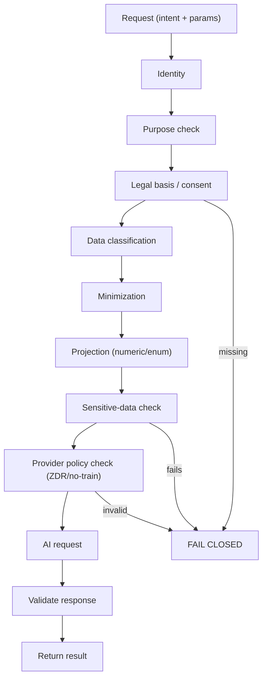
*Simple:* one guarded door with many checks; if any check fails, nothing is sent. *Technical:* a mandatory ordered gate; failure at any stage → fail-closed (§21).

---

## 4. Allow / Deny model (derived from Documents #1–#4)

**Internal AI** = a future self-hosted model (not built in V1); it still passes the firewall (F-2). **External AI** = approved third-party provider. Consent = external-AI consent toggle (AI-5) unless noted. All external "ALLOW" is really CONDITIONAL on the firewall + consent + ZDR provider.

| Data | Internal AI | External AI | Consent | Transformation | Retention | Reason / source |
|---|---|---|---|---|---|---|
| Expense amounts | CONDITIONAL | CONDITIONAL | external-AI | numeric projection | none stored; ZDR | AI-2, spending analysis |
| Expense categories | CONDITIONAL | CONDITIONAL | external-AI | **controlled enum only** (custom mapped first) | ZDR | AI-4 |
| Merchant names | DENY | **DENY** | — | — | — | AI-4 (merchant-level AI out of V1) |
| Expense descriptions | DENY | DENY | — | — | — | E2EE, AI-2 numeric-only |
| Group names (FLD-3) | CONDITIONAL | **DENY by default** | — | — | — | FLD-3 (no external AI unless specifically permitted) |
| Group descriptions (FLD-2) | DENY | DENY | — | — | — | E2EE free-text |
| Settlement notes (FLD-1) | DENY | DENY | — | — | — | E2EE free-text |
| P2P notes (B-2) | DENY | DENY | — | — | — | E2EE free-text |
| Income (FLD-5) | CONDITIONAL | CONDITIONAL | external-AI | **minimum derived projection only; raw never** | ZDR | FLD-5 |
| Budget | CONDITIONAL | CONDITIONAL | external-AI | derived projection | ZDR | FLD-5-class |
| Goals (free-text) | DENY | DENY | — | — | — | B-1 E2EE |
| Goals (progress numbers) | CONDITIONAL | CONDITIONAL | external-AI | numeric projection | ZDR | Zone 2 |
| Journal | DENY | DENY | — | explicit workflow only | — | Zone 1a E2EE |
| Mood / wellbeing | CONDITIONAL (post-DPIA) | **DENY by default** | explicit (Art.9) | numeric score, gated | — | A3, INT-3/DPIA-1 |
| Wardrobe images | CONDITIONAL | **CONDITIONAL (approved provider only)** | wardrobe-vision | minimized image; fail-closed | ZDR | WARD-1 |
| Contacts / non-users | **DENY** | **DENY** | — | — | — | CNT-1 |
| Authentication data | DENY | DENY | — | — | — | never (security secret) |
| Card data (CVV/PIN/PAN) | DENY | DENY | — | never stored | — | CARD-1 |
| Card metadata (last4/issuer) | CONDITIONAL | CONDITIONAL | external-AI | minimal projection | ZDR | CARD-1 minimization |
| Uploaded statements (raw) | DENY | DENY | — | extract then delete original | — | CARD-1 |
| Statement-derived transactions | CONDITIONAL | CONDITIONAL | external-AI | numeric projection | ZDR | treated as finance |
| Investment information | DENY (raw) | DENY (raw) | — | **[ENG-UNKNOWN]** projection policy undefined | — | no locked AI policy → ENG-UNKNOWN |
| Derived intelligence | CONDITIONAL | CONDITIONAL | tiered | provenance-free projection | per policy | INT-2, AI-1 |

**[REQUIREMENT]** No access rule was invented; each traces to a frozen decision. Undefined cases (e.g., investment projections, internal-AI specifics) are **[ENG-UNKNOWN]**, not defaulted to ALLOW.

---

## 5. Projection model

### Simple explanation
Instead of handing the AI a pile of receipts, FinMate hands it one sentence of maths. "You spent ₹18,420 at Merchant X" becomes "Food spending this month is 18% above your normal range." The AI gets the useful shape, not your life.

### Technical explanation
**AI-03 — Data projection**
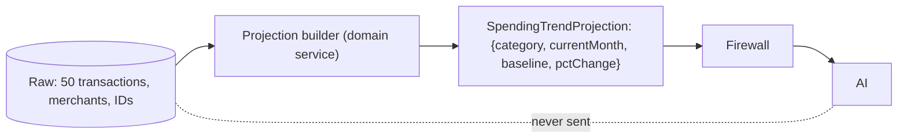
**Never** auto-send: names, IDs, descriptions, account/card numbers, exact transaction lists, unrelated transactions. AI receives the projection whenever it is sufficient for the task (which, for V1, is always — AI-2).

---

## 6. Numeric / enum projection (F-1 / F-2 / G-1)

- **F-1:** V1 external projections use **numeric values, controlled enums, safe derived statistics, minimum context** — **no stored user free-text**.
- **F-2:** all AI (incl. future self-hosted) passes the single firewall.
- **G-1:** server owns the model + system prompt; the client sends **intent + parameters**, not a prompt/model.
- **Category rule (AI-4):** a user-customizable free-text category is **not** silently treated as a safe enum — it must be **mapped to a controlled enum before egress**, or excluded.
- **Merchant-level AI:** restricted / out of V1 scope.

---

## 7. AI consent (AI-5)

### Simple explanation
Agreeing to use FinMate does **not** mean agreeing to send your data to an outside AI. That's a separate, explicit yes — and you can take it back.

### Technical explanation
| Attribute | Behaviour |
|---|---|
| Consent state | separate **external-AI** toggle (consent ledger, CON-3) |
| Purpose | recorded per consent |
| Provider | recorded (VEN-1 register) |
| Scope | which data classes / features |
| Timestamp / version | policy version stamped |
| Withdrawal | stops future external-AI processing; invalidates dependent derived data (CON-1) |
| Effect | no external-AI egress without an active matching consent |

**[REQUIREMENT]** General app consent never implies external-AI consent (GOV-5).

---

## 8. Legal basis / consent scope (ISO-4)

### Simple explanation
Every little hint FinMate sends toward its "tips brain" carries a label saying where it came from and what you allowed. If combining two hints would go beyond what you agreed to, FinMate refuses to combine them.

### Technical explanation
**AI-04 — Consent / legal-basis flow**
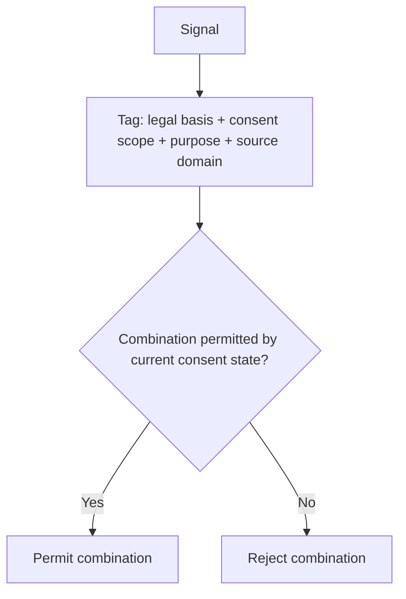
**[REQUIREMENT]** Consent/legal-basis is checked at the **point of combination**, not only at collection. Legitimate interest cannot cover Art. 9 (wellbeing) — those require explicit consent. **[COUNSEL]** legal bases.

---

## 9. INTELLIGENCE firewall (INT-1/INT-2)

**INTELLIGENCE receives:** small signals + provenance (source domain + opaque source IDs) + confidence + date + reason + legal-basis/consent scope.
**INTELLIGENCE must NOT receive:** raw copies of the finance database, journal, wellbeing records, wardrobe images, contacts, or any private-domain data; **no raw cross-domain foreign keys** (ISO-2); no raw domain encryption keys (Key doc §7).

**AI-05 — Intelligence signal flow**
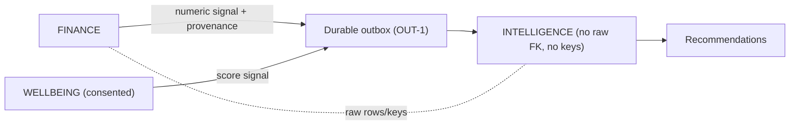
*Simple:* the brain gets labelled hints, never the databases. *Technical:* signals travel via the durable outbox with consent tags; INTELLIGENCE stores derived facts under its own server-managed key, never raw source data.

---

## 10. AI memory (Q3 / RGT-3)

### Simple explanation
FinMate can remember a few useful facts about your preferences (so tips get better), and you can see, delete, or switch that off. It does **not** keep a diary of your chats.

### Technical explanation
| | Conversation | Structured personalization memory |
|---|---|---|
| V1 | **not retained** (assistant_qa stateless) | limited, structured only |
| User control | n/a (nothing stored) | inspect / delete / disable |
| Storage | none | INTELLIGENCE (Class-B key, provenance) |

**[REQUIREMENT]** No long-term conversational memory in V1; structured memory is a governed view of INTELLIGENCE, user-controllable.

---

## 11. `assistant_qa` (G-1 / AI-3)

### Simple explanation
When you type a question to the assistant, FinMate treats your words as *just a question* — never as secret commands. The assistant only sees a small number summary plus your question, and it can't reach into anything else.

### Technical explanation
- The question is **UNTRUSTED INPUT** and may contain prompt injection.
- Therefore the assistant must **not**: treat user text as system instructions; expose secrets, system prompts, encryption keys, or raw DB records; bypass the firewall.
- It receives only a **fixed, capped numeric projection + the question**; it is **stateless** (no transcript retention).

**AI-09 — assistant_qa**
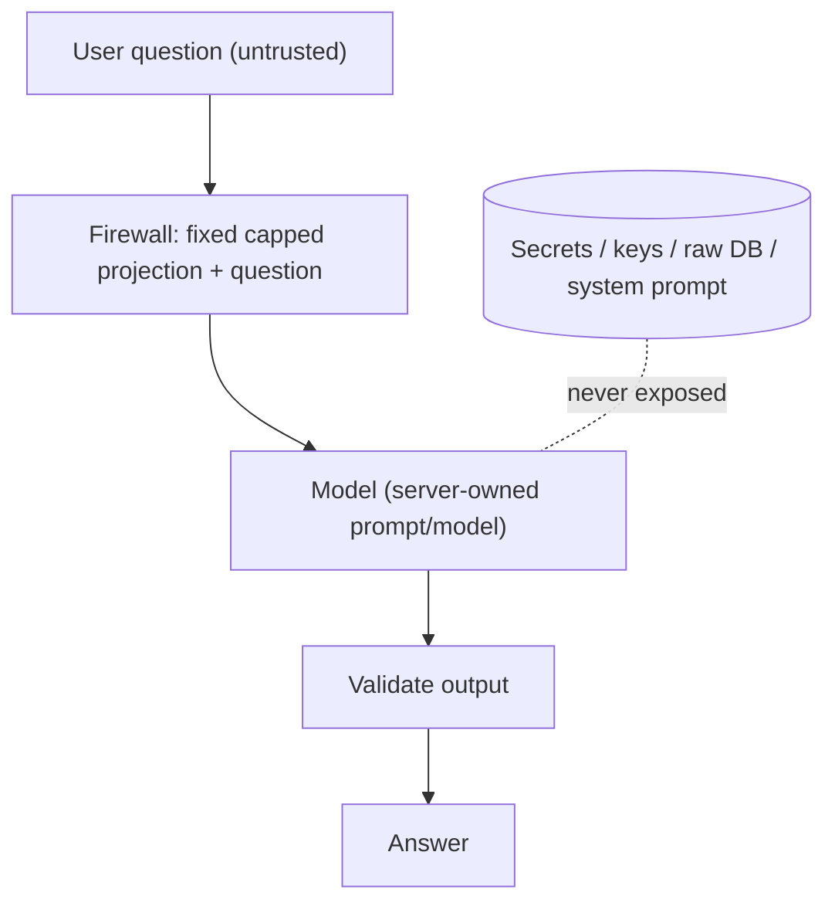
**Worst case:** a crafted question can, at most, elicit the numeric projection already permitted + attempt to reveal the system prompt — mitigated by a minimal server-owned prompt (containing no secrets) and output validation. No DB/key/raw access is reachable.

---

## 12. Wardrobe AI (WARD-1)

### Simple explanation
For outfit tips, a clothing photo may go to an **approved** AI only. FinMate never recognises faces or people. It tries to crop faces/backgrounds, but that cropping is a bonus — not the thing that decides where the photo may go. No approved path → the photo simply isn't sent.

### Technical explanation
**AI-08 — Wardrobe AI (fail-closed)**
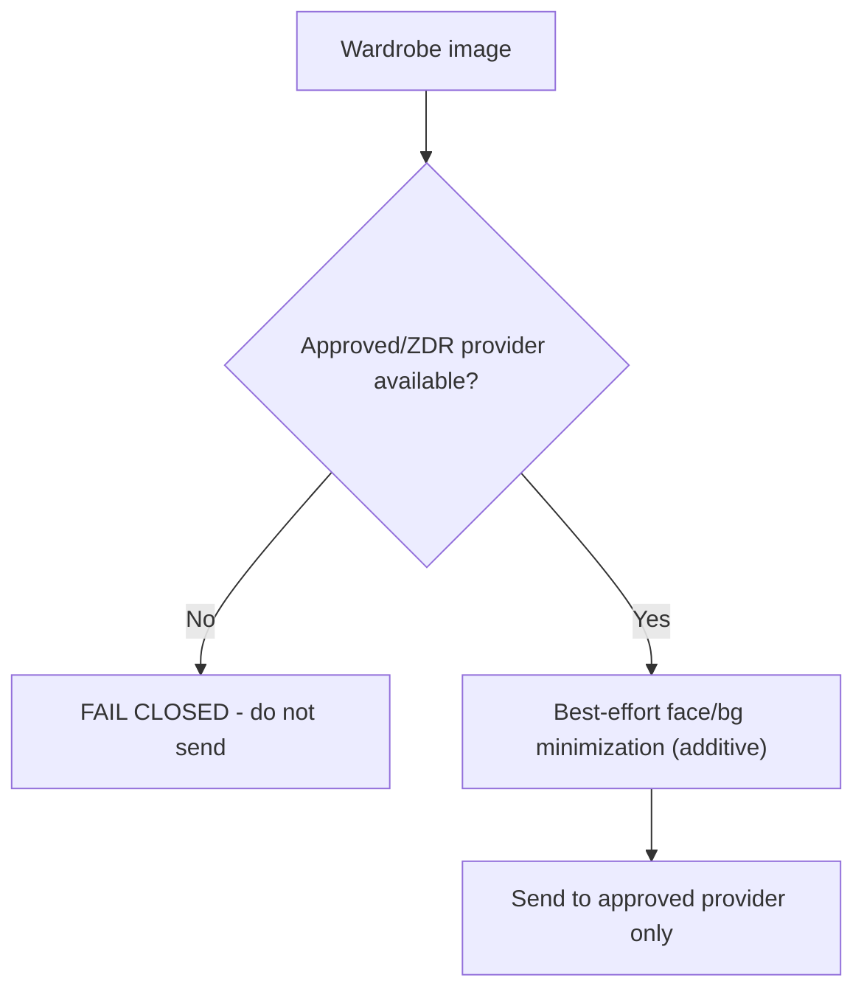
- **Baseline:** approved/ZDR provider configuration.
- **Additional:** best-effort face/background minimization — **never** the condition that decides whether an **unapproved** provider may receive an image (face detection can false-negative → fail-open).
- **Hard prohibitions:** facial recognition, identity recognition, biometric profiling, sensitive-trait inference, intentional face/background analysis.
- **If approved config unavailable: FAIL CLOSED.**

---

## 13. Wellbeing AI (A3)

### Simple explanation
Mood data is sensitive. The AI only touches it if you turned wellbeing analysis on, and even then only a tiny score, for that one purpose. Detailed medical data isn't in scope yet.

### Technical explanation
- Wellbeing mood metrics are **server-managed encrypted** (Class B).
- AI access is **purpose-limited, consent-gated, minimized, auditable**; **no external AI by default**.
- Analysis stays **flag-OFF until DPIA sign-off** (INT-3/DPIA-1).
- Detailed health beyond V1-minimal remains **deferred**.

**AI-07 — Wellbeing AI**
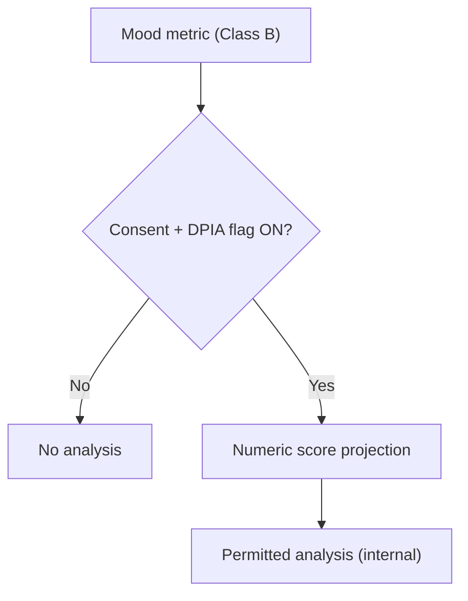
**[COUNSEL]** likely Art. 9 special-category; **no GDPR compliance claim is made.**

---

## 14. Financial AI

### Simple explanation
FinMate can give smart money tips without ever handing the AI your bank records. It turns 50 transactions into one safe fact like "dining is up 22% vs your 3-month average."

### Technical explanation
**AI-06 — Financial AI**
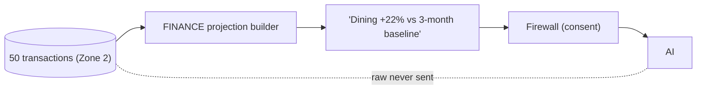
Supported safe projections: spending trends, budget deviations, savings progress, category trends (controlled enum), other safe derived metrics. **Raw financial records are not exposed** unless a locked requirement explicitly allows it (none does in V1).

---

## 15. Card / statement analysis (CARD-1)

### Simple explanation
FinMate never stores your CVV, PIN, or full card number. Uploaded statements are read to pull out the transactions, then the original is deleted unless you choose to keep it. Any tool that reads documents must pass a security review first.

### Technical explanation
- **Never store:** CVV, PIN, full PAN. Store only necessary card metadata (last4, issuer, type, transactions, charges, rewards).
- **Statements:** `extract → analyze → delete original by default`; retention requires explicit user choice; raw statement = Zone 1a E2EE.
- **OCR/document vendor:** security/vendor review before use (VEN-1); the raw statement is the most sensitive input → ZDR + consent + minimal.
- **AI access:** same minimization + consent rules; extracted transactions follow Financial-AI projection rules.

---

## 16. Contacts / non-users (CNT-1 / CNT-2)

- Contacts/non-users are **minimized**, retained minimally, and **excluded from AI, personalization, INTELLIGENCE, and profiling**.
- **CNT-2:** when a contact becomes a registered user, **do not** retroactively import historical contact PII into personalization; personalization starts **prospectively** after appropriate consent/state.
- **[COUNSEL]** legal basis + non-user rights.

---

## 17. Provider security (VEN-1)

Before using any external AI provider, verify: no-training configuration (where applicable), retention policy, deletion behaviour, sub-processors, data location, international transfers, encryption, access controls, incident handling, contractual protections. **Never rely on a marketing statement alone** ("no training" ≠ "no processing").

**No provider receives:** production credentials, encryption keys, database passwords, database dumps, unrelated roadmap, unrelated proprietary algorithms, or unnecessary user data.

**AI-10 — External provider boundary**
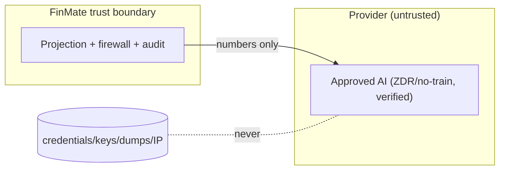

---

## 18. AI response security

The AI response is **untrusted**. Validate: output format, allowed content, injection attempts, unexpected data, unauthorized actions, sensitive-information leakage.

**AI must not directly:** modify financial records, execute payments, change security settings, delete data, or modify encryption keys — unless an explicitly authorized future architecture exists (none in V1). AI output is advisory; state-changing actions require the normal authorized application paths with user confirmation.

---

## 19. AI logging

**Do NOT log:** raw prompts containing sensitive data, raw financial records, journal, health/mood data, encryption keys, provider secrets, or `assistant_qa` question/response content.
**Where logging is necessary, log:** request ID, policy decision, purpose, provider, policy version, safe metadata (token counts, latency). Cross-references: SEC-W2 (no tokens/PII in logs), OPS-1. `assistant_qa` remains stateless.

---

## 20. AI data retention

| Item | Retention |
|---|---|
| Request (projection) | not persisted beyond the call; provider ZDR (VEN-1) |
| Response | not persisted (assistant_qa stateless) |
| Structured memory | governed; user-deletable (RGT-3); period **[ENG-UNKNOWN]** |
| Provider retention | per verified provider config (VEN-1); ZDR target |
| Deletion | structured memory follows account/consent deletion (DEL-1, CON-1) |
| Consent withdrawal | stops future processing + invalidates dependent derived data |

**[REQUIREMENT]** No retention number is invented; the erasure window is **RET-1 (parametric)** and structured-memory retention is **[ENG-UNKNOWN]** pending a decision.

---

## 21. AI failure modes — default FAIL CLOSED

**AI-11 — AI failure / deny flow**
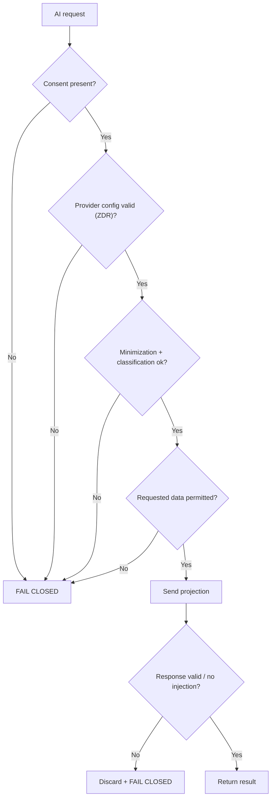
| Failure | Behaviour |
|---|---|
| Consent missing | fail closed |
| Provider unavailable | fail closed (no fallback to unapproved provider) |
| Policy unavailable | fail closed |
| Minimization fails | fail closed |
| Classification fails | fail closed |
| Provider config invalid | fail closed |
| User requests prohibited data | deny |
| Prompt injection attempt | ignore instructions; no secret/raw exposure |
| Malicious AI output | discard; do not act on it |

---

## 22. AI threat model summary (full model = later Document #7)

| Threat | Mitigation |
|---|---|
| Prompt injection | untrusted question; server-owned prompt; no raw/keys reachable (AI-3) |
| Data exfiltration | numeric-only projections; firewall single egress |
| Malicious / compromised provider | only projections sent; ZDR; untrusted boundary |
| Excessive projection | minimization + sensitive-data check (fail-closed) |
| Model memorization | no raw data / no free-text sent (AI-2) |
| Logging leakage | no sensitive AI logging (§19, SEC-W2) |
| Cross-domain leakage | deny-by-default; signals + provenance only (ISO-2/4) |
| Consent laundering | consent checked at point of combination (ISO-4) |
| Unauthorized AI memory | structured-only, user-controllable, no transcripts (RGT-3) |
| Malicious AI output | response validated; no direct state changes (§18) |

Full analysis deferred to the Threat Model document.

---

## 23. Diagrams (index)

| ID | Name | Location |
|---|---|---|
| AI-01 | Overall AI architecture | below |
| AI-02 | Privacy firewall pipeline | §3 |
| AI-03 | Data projection | §5 |
| AI-04 | Consent / legal-basis flow | §8 |
| AI-05 | Intelligence signal flow | §9 |
| AI-06 | Financial AI | §14 |
| AI-07 | Wellbeing AI | §13 |
| AI-08 | Wardrobe AI (fail-closed) | §12 |
| AI-09 | assistant_qa | §11 |
| AI-10 | External provider boundary | §17 |
| AI-11 | AI failure / deny flow | §21 |
| AI-12 | AI data lifecycle | below |

**AI-01 — Overall AI architecture**
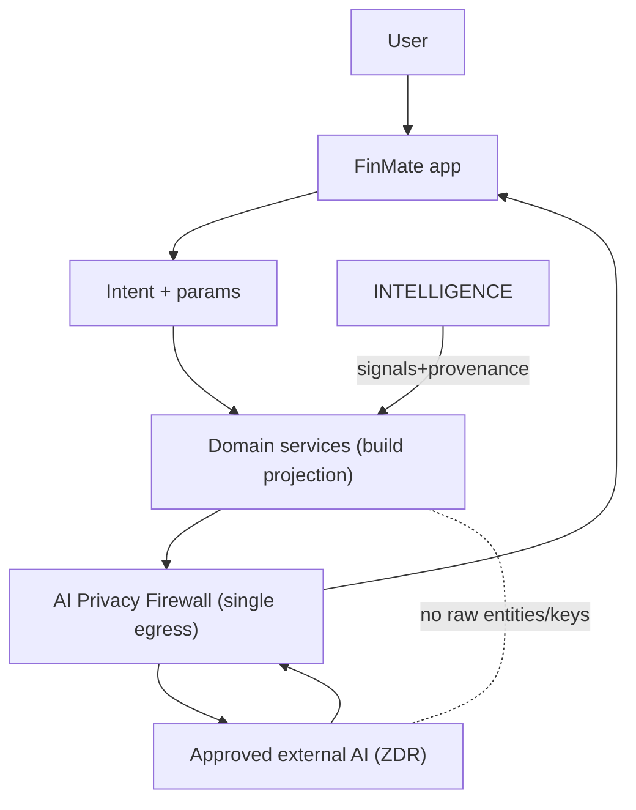
*Simple:* one guarded door between your data and any AI. *Technical:* intent-driven, projection-only egress through a single audited firewall.

**AI-12 — AI data lifecycle**
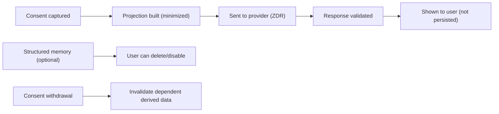

---

## 24. Backward compatibility

The AI architecture is **additive** and must not break existing: expense calculations, settlements, People/P2P, authentication, group behaviour, or existing Web/mobile functionality.

- **Current chatbot rework:** the existing opt-in `POST /ai/proxy` (client prompt/model) is replaced by the firewall/intent model — an opt-in feature change, not a core-functionality change; old behaviour is feature-flaggable off.
- **Data needed differently:** if a future AI feature needs data stored differently, add an **additive compatibility layer / projection builder** — never redesign existing storage or functionality (GOV-1). Encrypted free-text stays out of AI (AI-2), so no decryption pathway is added.

---

## 25. Reconciliation

Checked against Documents #1–#4:

- **No decision changed.** Restates AI-1..5, INT-1..4, DER-1, OUT-1, VEN-1, F-1/F-2, G-1, WARD-1, A3, RGT-3, CNT-1/2, CARD-1, DPIA-1, GOV-5, FLD-1..7.
- **No encryption decision changed** — E2EE free-text stays out of AI; Zone-2 only via projection.
- **No AI policy invented contrary to the ledger** — undefined cases marked **[ENG-UNKNOWN]** (investment projections, internal-AI specifics, structured-memory retention).
- **No raw-domain access introduced** — INTELLIGENCE gets signals + provenance only; no raw FKs/keys.
- **No new legal claim** — Art. 9 / bases / transfers marked **[COUNSEL]**.
- **Counsel items remain marked:** wellbeing Art. 9, CNT-1 basis/rights, VEN-1 transfers, DPIA-1, legal bases (ISO-4/CON-3).
- **ENG-UNKNOWN remain marked:** investment AI policy, internal-AI specifics, structured-memory retention.
- **P0/P1 referenced:** SEC-W2 (AI logging), SEC-W3, OPS-1 (Zone-2 read), plus the AI-proxy rework (current `POST /ai/proxy` divergence).
- **Backward compatibility preserved** — additive; existing finance/auth/group behaviour untouched.
- **Contradictions:** **NONE** — no STOP-and-report condition; Documents #1–#4 not modified.

---

## DOCUMENT STATUS: **FROZEN** ✅

Complete AI Data Access & Privacy Firewall specification, dual-leveled, 12 diagrams (AI-01..AI-12), consistent with the frozen ledger/matrix/security/key documents. No code, schema, migration, API, provider configuration, or production data-flow was created or changed.

*End of Document #5 (FROZEN). STOP — not proceeding to the Threat Model or the SRS.*
