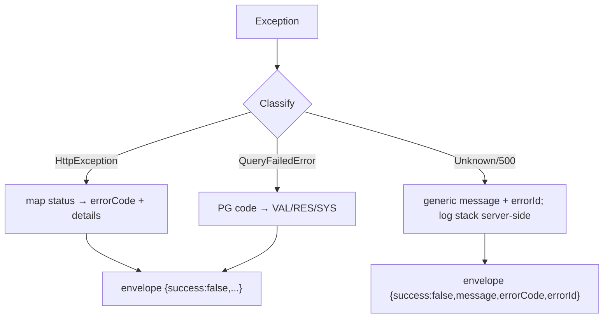
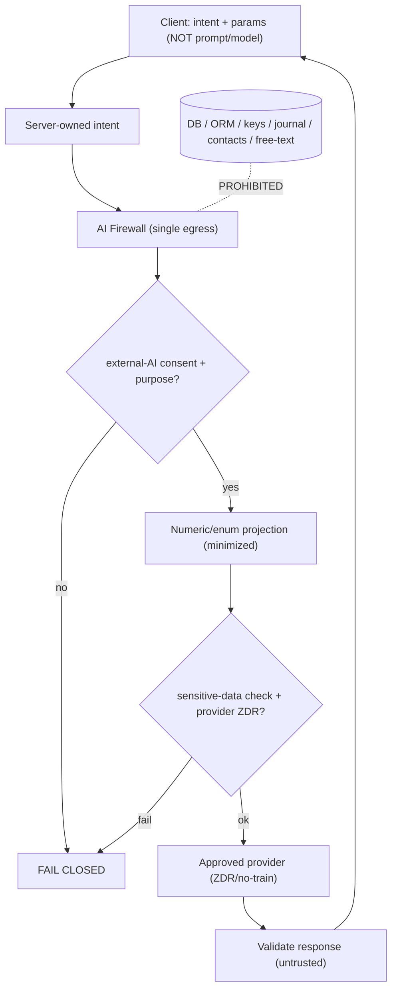
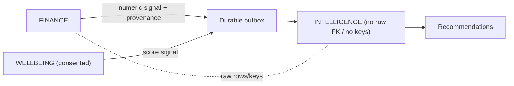
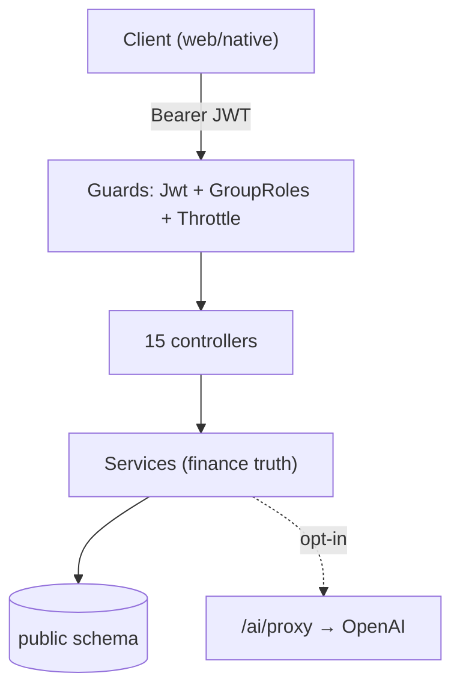
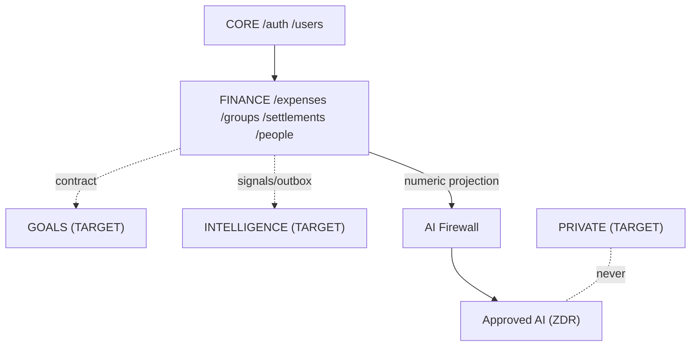
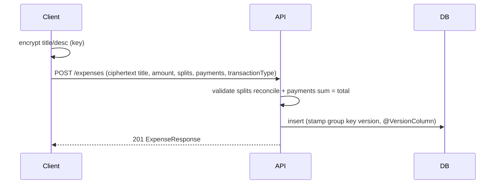
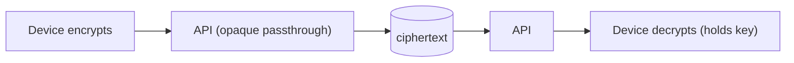
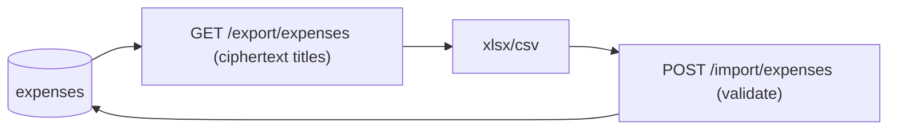

# FinMate — API & Data Contracts (Document #16)

**Nature:** contract-design / documentation only. Authorises **no** code, entity, controller, service, database, migration, auth, encryption, AI, Angular, Capacitor, config, package, or production change. **Read-only.** No frozen decision is altered.

**Central principle:** *"Define contracts around the existing product before changing the implementation."* A working API is **not** redesigned merely because a different style looks cleaner (GOV-1/GOV-2, ADR-001).

**Governing (frozen) sources:** Decision Ledger · Data Classification & Encryption Matrix · Security & Privacy Architecture · Key Management · AI Data Access & Privacy Firewall · IP/AI Confidentiality Policy · Threat Model · Processing Register · Current System Baseline · UX Specification · **SRS v1.0** · ADR_INDEX + all ADRs · **Module & Data Ownership Map (#15)**.

**Authority rule:** the **repository** is authoritative for CURRENT contracts; the frozen **SRS/architecture** are authoritative for TARGET. Where a spec artefact (e.g. `openapi.yaml`) disagrees with code, the **code wins** and the drift is recorded (§2.4), never silently reconciled.

**Labels:** **CURRENT** (verified in repo) · **PARTIAL** · **PLACEHOLDER** (spec/schema exists, no working feature) · **TRANSITION** (dual-behaviour compatibility window) · **TARGET** (planned, not built) · **[ENGINEERING PARAMETER]** · **[PRODUCT DECISION REQUIRED]** · **[COUNSEL]** · **[ENG-UNKNOWN]**.

**Companion:** [API_CONTRACT_INDEX.md](API_CONTRACT_INDEX.md) — one-line-per-contract index with IDs, sensitivity, and traceability.

---

# 1. FinMate API Contracts in 5 Minutes

### Simple explanation
An **API contract** is a promise between the app on your phone/browser (the *frontend*) and FinMate's server (the *backend*): *"if you send me exactly this, I will send you back exactly that."* FinMate needs written promises because:
- People already use the app — if a promise changes suddenly, their app breaks.
- Some data is **locked with your key** (the server must never see it), so the contract has to say *"this field is a locked box — don't try to open it."*
- Money maths must always come out the same, so the contract pins down how numbers are sent and returned.

**What the frontend sends:** your login details, a new expense (with the *words* already locked), who paid, how to split, and so on.
**What the backend returns:** the saved record, the totals it calculated, and who owes whom.
**What the backend must NEVER return:** your password, encryption keys, another person's private data, database errors, or stack traces.
**How old apps stay working:** new locks and new fields are **added**; the old shape keeps working until everyone has updated (dual-behaviour "transition" windows).
**How privacy is enforced:** every request is checked for *who you are* (auth), *what you're allowed to touch* (authorization), and — for AI — *what tiny summary may leave the building* (the firewall).

### Technical explanation
FinMate exposes a single versioned REST surface at **`/api/v1`** (NestJS + Fastify-style response). Contracts are **defined around the existing production surface first**. This document: (a) inventories CURRENT routes/DTOs/errors from the repository; (b) freezes the behaviour-compatible promises for protected APIs; (c) specifies TARGET contracts for future domains and the AI firewall as **additive / transition**, never breaking replacements. Every contract traces to SRS/ADR/Ledger/Threat/Matrix/Ownership items (§21).

---

# 2. Current API Inventory (CURRENT)

### Simple explanation
This is the real list of doors that exist **today**, read from the code — not a wish list.

### Technical explanation
**Base path:** `/api/v1`. **Auth scheme:** `bearerAuth` (JWT in `Authorization: Bearer`). **~88 routes across 15 controllers** (matches Baseline §13). All entities live in `shared/data-models/src/lib/*`; one TypeORM datasource.

## 2.1 Route inventory (repository-verified)

| Controller | Base | Routes | Auth | Status | Sensitive fields | Encryption |
|---|---|---|---|---|---|---|
| `auth.controller` | `/auth` | register, login, refresh, logout, 2fa/enable, 2fa/verify, 2fa/disable, reset-password (GET+POST), verify-email (GET) | mixed (public + guarded) | CURRENT | password, tokens, 2FA secret | argon2; server AES-GCM 2FA; **refresh token in body (SEC-W3)** |
| `users.controller` | `/users` | me (GET/PATCH/DELETE), lookup (GET), me/keys (GET/POST), {id}/public-key (GET) | `JwtAuthGuard` | CURRENT | email, wrapped keys | avatar server AES-GCM; keys E2EE |
| `contacts.controller` | `/contacts` | 4 (list/create/claim/merge) | `JwtAuthGuard` | CURRENT | 3rd-party PII | none |
| `expenses.controller` | `/expenses` | create, list, get, patch, put, delete (+ group deleted list) | `JwtAuthGuard` (+group role) | CURRENT | title/desc (E2EE), amounts | E2EE title/desc; Zone-2 amounts |
| `recurring-expenses.controller` | `/recurring-expenses` | create, list, get, patch, delete (+run) | `JwtAuthGuard` | CURRENT (beta) | title/desc | E2EE title/desc |
| `groups.controller` | `/groups` | create, list, get, patch, close-month, carry-forward, contributions (GET/POST), keys (POST), keys/me (GET), keys/missing (GET), keys/rotate (POST), expenses/deleted | `JwtAuthGuard` + `GroupRolesGuard` | CURRENT | group keys, description | wrapped keys E2EE; **description plaintext** |
| `members.controller` | `/groups/{id}/members` | create, list, patch, delete | guarded (roles) | CURRENT | nickname | plaintext |
| `invite.controller` | `/invite-links`, `/groups/{id}/invites`, `/groups/join/{token}` | preview, create, join | mixed | CURRENT | invitedEmail, wrapped key | E2EE wrapped key; email plaintext |
| `settlements.controller` | `/groups/{groupId}/settlements` | create, list, balances, patch | guarded | CURRENT | **note (plaintext)** | note plaintext |
| `friends.controller` | `/friends` | list (derived balances) | `JwtAuthGuard` | CURRENT | — | derived |
| `people.controller` | `/people` | list, get {userId}, transactions (POST), settlements (POST), transactions/{id} (PATCH/DELETE) | `JwtAuthGuard` | CURRENT | **note (plaintext)** | note plaintext |
| `import.controller` | `/import/expenses` | POST | `JwtAuthGuard` + `IMPORT` throttle | CURRENT/Partial | expense fields | E2EE round-trip |
| `export.controller` | `/export/expenses` | GET | `JwtAuthGuard` + `EXPORT` throttle | CURRENT/Partial | expense fields | E2EE round-trip |
| `ai.controller` | `/ai/proxy` | POST | `JwtAuthGuard` + `aiOptIn` gate | **PARTIAL** | prompt | `redactUuids()` only |
| `app.controller` | `/` | health, root | public | CURRENT | — | — |

## 2.2 CURRENT request/response shapes (repository-verified samples)

- **`POST /auth/login`** → req `{ email, password, deviceId? }` → **200** `{ accessToken, refreshToken, user }` **(both tokens in body — CURRENT/SEC-W3)**.
- **`POST /auth/refresh`** → req `{ refreshToken }` → **200** `{ accessToken, refreshToken }` (rotation; Redis argon2 session hash).
- **`POST /expenses`** → req `{ title (E2EE ciphertext), description? (E2EE), amountTotal, currency, category, paidByUserId, groupId?, expenseDate, status?, transactionType? ('expense'|'refund'), splits[], payments[] (multi-payer), attachmentKeys[]? }` → **201** `ExpenseResponse`. Optimistic lock via `@VersionColumn`.
- **`GET /people`** → `PersonSummary[]` `{ counterpartyUserId, displayName, email, currency, netBalance (signed, >0 ⇒ they owe you), direction ('owes_you'|'you_owe'|'settled') }`.
- **`GET /people/{userId}`** → history of `PersonHistoryItem` `{ id, source ('group_expense'|'direct'|'settlement'), entryType?, amount (signed), currency, date, note (plaintext CURRENT), groupId?, groupName?, expenseId?, title (E2EE ciphertext — decrypt client-side) }`.

## 2.3 Pagination / filtering (CURRENT, from repo + `openapi.yaml`)
- Query params `page` (1-indexed, default 1), `limit` (default 20, max 100); **cursor-based** for rapidly-updated lists (expenses, audit). Exact per-list defaults beyond this = **[ENGINEERING PARAMETER]** (see §12).

## 2.4 Spec-vs-code drift findings (record, do NOT fix here)
`openapi.yaml` is a **spec artefact, not a frozen source**; the code is authoritative. Recorded drifts:

| # | Drift | Reality (repo) | Action (future, not now) |
|---|---|---|---|
| D-1 | `openapi.yaml` documents `/notes` and `/goals` full CRUD | **No notes/goals controller or service exists** → PLACEHOLDER (matches Baseline §5) | keep marked PLACEHOLDER until built (goals-v2 B-1) |
| D-2 | `openapi.yaml` `POST /expenses` body omits `payments[]` and `transactionType` | Code DTO has **multi-payer `payments[]`** and **`transactionType` refund** | regenerate openapi from code before any GA |
| D-3 | `/friends` route present in code, absent in `openapi.yaml` | `friends.controller` exists | regenerate openapi |
| D-4 | `openapi.yaml` error examples show `{ statusCode, timestamp, path, errorCode, message, details, retryable }` | Actual filter also wraps with **`success:false`, `data:null`** (and `errorId` on 500) | align openapi to the real envelope (§7) |

**These drifts do not contradict any frozen document** — the Baseline already classifies notes/goals as PLACEHOLDER. They are documentation-hygiene items, tracked, not resolved here.

---

# 3. Protected Current APIs (behaviour-compatible)

### Simple explanation
These doors must keep behaving the same. We write down today's promise, tomorrow's target, and exactly how we get from one to the other without breaking anyone.

### Technical explanation
For each protected group: **CURRENT contract → TARGET contract → compatibility rule → migration → rollback → user impact.** Financial calculation semantics are **frozen** (FIN-002, ADR-017) — contracts constrain the wire, never the maths.

| Area | CURRENT contract | TARGET contract | Compatibility rule | Migration | Rollback | User impact |
|---|---|---|---|---|---|---|
| **Auth login/refresh** | tokens in **body** | web: refresh in HttpOnly Lax host-only cookie + CSRF; native: secure-storage + header | **dual-emit** both until min-version sunset (AU-4) | additive; capability-detected transport | re-enable body emit | none if phased (§6) |
| **Auth logout/2FA/reset/verify** | Redis single-use tokens; ZK reset; TOTP | unchanged semantics | no contract change | none | n/a | none |
| **Expense create/update/delete** | body incl. multi-payer `payments[]`, `transactionType`, splits; optimistic lock; 7-day soft-delete restore | unchanged core + low-friction capture (additive fields) | additive only; never change calc semantics (FIN-002) | none for core | n/a | none |
| **Refunds** | `transactionType='refund'` = signed-negative expense | unchanged | additive | none | n/a | none |
| **Splits / multi-payer** | equal/fixed/percent/share; `payments[]` sum = `amountTotal` | unchanged | server rejects invalid split/sum | none | n/a | none |
| **Household / carry-forward** | `ledgerMonth`, `close-month`, `contributions` | unchanged | month-close locks prior months | none | n/a | none |
| **History / versioning** | `expense_versions`, `settlement_versions` snapshots | unchanged; version stamp fix (SEC-KI1 for keys) | additive | none | n/a | none |
| **Groups create/members/roles/invites** | roles owner/admin/member/viewer/spectator; TIK/RSA invites | + E2EE `description` (FLD-2) | additive marker; **pre-join display [ENG-UNKNOWN]** must degrade | additive discriminator + client backfill | plaintext branch | none |
| **Group keys / rotation** | wrapped-key endpoints; `keys/me` **honors `versionId`** (SEC-KI1 **VERIFIED 2026-08-13**, fixed 2026-07-17) | unchanged (already serves requested `versionId`) | none (verified in repo) | none | n/a | already decrypts rotated history; residual GRP-007 display-only |
| **Contributions** | percentage per `ledgerMonth` | unchanged | additive | none | n/a | none |
| **Settlements** | derived balances; `note` **plaintext** | + E2EE `note` (FLD-1) | additive marker + client backfill | mixed-state | plaintext branch | none |
| **People / P2P** | lend/borrow/settle; `note` **plaintext**; immutable (soft-delete) | + E2EE `note` `direct_shared` (B-2) | additive marker + client backfill | mixed-state | plaintext branch | none |
| **Recurring** | scheduler; E2EE title/desc | unchanged | additive | none | n/a | none |
| **Import/Export** | xlsx; E2EE round-trip | unchanged; optional versioned format (§11) | round-trip fidelity preserved | version marker if added | read V1 | none |
| **AI** | thin `/ai/proxy` (client prompt/model) | firewall: `intent + params`, server prompt, numeric projection | **flaggable off**; not a core-functionality change | additive firewall path | old proxy off | chatbot behaviour change |

---

# 4. Financial API Contracts (critical)

### Simple explanation
Money maths must always come out the same. The contract locks down *how* numbers travel and *what the server checks* — it does **not** rewrite the calculations.

### Technical explanation — **FIN-002 remains the source of truth (ADR-017).** No calculation is redefined here.

**Contract-level requirements (all CURRENT unless labelled):**

| Requirement | Rule | Source |
|---|---|---|
| **Deterministic calculation** | server is the single source of financial truth; balances/settlements are **derived**, never client-supplied; identical inputs ⇒ identical outputs | FIN-002, Baseline §7, Ownership #15 |
| **Server-side computation** | amounts are Zone-2 (server-readable); all totalling/settling on the backend | Z-2 |
| **Validation** | reject invalid split type; **splits must reconcile to `amountTotal`**; `payments[]` must **sum to `amountTotal`**; currency required | `split-payload.validator.ts`, DTO |
| **Concurrency** | optimistic lock via `@VersionColumn`; mismatch ⇒ **412 `CON_VERSION_CONFLICT` (retryable)**; client refetches + retries | filter, §13 |
| **Currency** | per-entry `currency` (char3); balances netted **per counterparty per currency**; no implicit FX | People/settlement contract |
| **Refund correctness** | `transactionType='refund'` behaves as **signed-negative** expense across balances/settlements/export | Memory refund-net; DTO |
| **Spectator exclusion** | spectator role excluded from splits/obligations | Baseline §8 |
| **Household** | `ledgerMonth` scoping; month-close carry-forward; prior months locked | Baseline §7 |
| **Idempotency** | **CURRENT: not enforced by an idempotency key** → **TARGET** for create/refund/settlement/P2P/import (§13) | [ENGINEERING PARAMETER] |

**MUST NOT (contract invariants):** recompute financial results on the client; accept client-supplied balances; allow `payments[]` sum ≠ `amountTotal`; allow splits not reconciling to total; silently coerce currency; double-apply a refund (§13/§23).

---

# 5. Encrypted-Field Contracts

### Simple explanation
Three kinds of fields: **plaintext** (server reads, e.g. amounts), **server-encrypted** (server can unlock under rules, e.g. 2FA secret), and **E2EE** (only *you* can unlock — the server holds a locked box). The contract must label each field so nobody accidentally tries to read a locked box.

### Technical explanation — from the frozen Matrix (§5/§6). **Existing E2EE wire formats MUST NOT be silently replaced (K-3).**

| Field | Class | Who encrypts | Who decrypts | Backend can read? | Wire representation | Key ref/version | Migration | Status |
|---|---|---|---|---|---|---|---|---|
| expense/recurring **title, description** | **E2EE** | client | client (key-holder) | **NO** | ciphertext string (`text`) | personal master or group key `groupKeyVersion` | none (K-3) | CURRENT |
| notes **title, body** | **E2EE** | client | client | **NO** | ciphertext | key domain | n/a (PLACEHOLDER) | PLACEHOLDER |
| **P2P `note`** | plaintext → **E2EE** | client (TARGET) | both registered users | CURRENT: **YES**; TARGET: NO | plaintext (CURRENT) → ciphertext + `marker` | per-entry `direct_shared` content key | additive marker + client backfill, mixed-state | TRANSITION (B-2) |
| **settlement `note`** | plaintext → **E2EE** | client (TARGET) | group key-holders | CURRENT: YES; TARGET: NO | plaintext → ciphertext + `marker` | group data key | mixed-state | TRANSITION (FLD-1) |
| **group `description`** | plaintext → **E2EE** | client (TARGET) | group members | CURRENT: YES; TARGET: NO | plaintext → ciphertext + `marker` | group data key | mixed-state | TRANSITION (FLD-2) |
| **goal free-text** | **E2EE (born)** | client | owner | NO | ciphertext (`text`, widened) | GOALS domain key | clean (empty table) | TARGET (B-1) |
| attachment `encryptedFileKey` / `encryptedOriginalName` | **E2EE** | client | owner | NO | ciphertext | scope-wrapped | — | TARGET (SEC-W6c: drop plaintext `originalName`) |
| group/expense **wrapped keys** | **E2EE (ZK)** | client | key-holders | NO | `iv_b64:ct_b64` | versioned | none | CURRENT |
| **2FA secret, avatarUrl** | **server-encrypted** | server | server | YES (gated) | `iv:ct:tag` | global `ENCRYPTION_KEY` | none | CURRENT |
| amounts, splits, dates, category, group.name, nickname, income, invitedEmail | **plaintext-but-protected (Zone 2)** | — | — | YES | plaintext | — | none (FLD-3/4/5/7) | CURRENT |

**Contract rule:** any field marked E2EE is **opaque** on the wire — the API contract carries ciphertext through unchanged; no endpoint may require, log, or return its plaintext. Mixed-state fields carry a **`marker`** (`legacy_plaintext` | `encrypted`); readers branch on the marker (ADR-016).

---

# 6. Auth Contract (CURRENT → TRANSITION → TARGET)

### Simple explanation
Two tokens keep you logged in. Today both come back in the response body. Tomorrow the "keep me logged in" token lives in a locked browser cookie (web) or the phone's secure vault (native), so a bad script can't steal it. Old phone apps keep working until everyone updates.

### Technical explanation (AU-1/AU-2/AU-2a/AU-4; ADR-013/014/015)

| Aspect | CURRENT | TARGET (web) | TARGET (native) |
|---|---|---|---|
| Access token | body → memory | memory | memory |
| Refresh token | **body** (SEC-W3) | **HttpOnly + Secure + SameSite=Lax + host-only cookie**, path-scoped to `/api/v1/auth/refresh` | iOS Keychain / Android Keystore, **header** transport |
| CSRF | n/a | **double-submit token required** on cookie-authed refresh | header path **never** cookie-satisfiable |
| CORS | present | **exact origin** (`https://finmate.prvnsahni.com`), credentials, never `*` | n/a |
| 2FA | `x-mfa-code` header on login | unchanged | unchanged |

**Transition rule (AU-4):** **dual-emit** — server keeps returning the body token **and** sets the cookie/accepts the header — until a **minimum-supported-version** sunset. Sunset date = **[ENGINEERING PARAMETER]** (do not invent; ADR-015/OQ-17).

**Hard contract invariants:** the refresh endpoint MUST distinguish **cookie transport** vs **header transport** by capability, never `if(iOS)`. A **cookie-presented refresh always requires CSRF**; the header path is **never** satisfiable by an ambient cookie. Rotation + Redis argon2 session hashing retained.

```mermaid
sequenceDiagram
  participant C as Client (web/native)
  participant A as API
  participant R as Redis
  C->>A: POST /auth/login
  A->>R: store argon2(refreshId)
  A-->>C: access (body/memory) + [CURRENT: refresh in body] [TARGET web: refresh cookie / native: header]
  C->>A: POST /api/v1/auth/refresh (TARGET web: cookie + CSRF / native: header)
  A->>A: distinguish transport; cookie ⇒ require CSRF
  A->>R: verify + rotate
  A-->>C: new access + rotated refresh (same transport)
```

---

# 7. Error Contract

### Simple explanation
When something goes wrong, the app should get a clear, safe message with a code it can act on — never the server's secrets or its inner workings.

### Technical explanation — **CURRENT (repository-verified, `http-exception.filter.ts`).**

**Success/handled-error envelope (non-500):**
```json
{ "success": false, "message": "…", "errorCode": "…", "data": null,
  "statusCode": 4xx, "timestamp": "ISO", "path": "/api/v1/…",
  "details": [{ "field": "…", "issue": "…" }] , "retryable": true|false }
```
**500 envelope (no internals leaked):**
```json
{ "success": false, "message": "An unexpected error occurred. Please try again later.",
  "errorCode": "SYS_INTERNAL_ERROR", "errorId": "uuid" }
```
Stack trace + correlationId are **logged server-side only**.

**Error-code catalogue (CURRENT):**

| Class | HTTP | errorCode | retryable | Notes |
|---|---|---|---|---|
| Validation | 400 | `VAL_INVALID_INPUT` | no | `details[]` per field; class-validator array parsed |
| Auth | 401 | `AUTH_TOKEN_EXPIRED` / `AUTH_MISSING_TOKEN` / `AUTH_INVALID_TOKEN` | no | message-derived |
| Forbidden | 403 | `RES_FORBIDDEN` | no | authz/IDOR |
| Not found | 404 | `RES_NOT_FOUND` | no | |
| Conflict | 409 | `RES_ALREADY_EXISTS` | no | unique-constraint (PG 23505) mapped |
| Version | 412 | `CON_VERSION_CONFLICT` | **yes** | optimistic lock |
| Rate limit | 429 | `CON_LIMIT_RATE` | **yes** | sanitized message + `Retry-After`, `X-RateLimit-*` headers, `retryAfter` |
| Unavailable | 503 | `SYS_SERVICE_UNAVAILABLE` | **yes** | DB connectivity |
| Timeout | 504 | `SYS_TIMEOUT` | **yes** | |
| Internal | 500 | `SYS_INTERNAL_ERROR` | no | `errorId` only |

**MUST NOT expose:** encryption keys, stack traces, DB credentials, SQL, secret material, unnecessary PII, AI-provider credentials, internal architecture. **CURRENT satisfies these** (500 sanitized; throttle message sanitized).

**TARGET-consistency (additive, do not silently change existing shapes):** consent failure → **`CON_CONSENT_REQUIRED` (403)**; AI firewall denial → **`AI_FIREWALL_DENIED` (403)**; provider failure → **`AI_PROVIDER_UNAVAILABLE` (503)**; encryption/key error → **`ENC_KEY_UNAVAILABLE` (409/412)**; migration/legacy-state → **`MIG_STATE_UNSUPPORTED` (409)**. These are **new codes for new features only**; existing responses unchanged.



---

# 8. Authorization Contract

### Simple explanation
Being able to *see* a button is not permission. The **server** decides who may read, change, delete, or export each thing — never the frontend hiding it.

### Technical explanation — server-enforced (`JwtAuthGuard`, `GroupRolesGuard`, `MfaGuard`; ownership checks in services). Deny-by-default.

| Resource | Principal | Read | Write | Delete | Export |
|---|---|---|---|---|---|
| User/profile | owner | ✔ | ✔ | ✔ (account delete → tombstone) | ✔ |
| Expense (personal) | owner | ✔ | ✔ | ✔ (soft) | ✔ |
| Expense (group) | group member (role) | ✔ | admin/owner or creator | admin/owner or creator | member |
| Group | member | ✔ | admin/owner | owner | member |
| Group keys | key-holding member | ✔ (own wrapped) | rotate: admin/owner | — | — |
| Settlement | group member | ✔ | party/admin | immutable (void=soft) | member |
| **P2P entry** | **the two counterparties only** | ✔ | creator | soft-delete (creator) | party |
| Attachment (TARGET) | owner/authorized scope | ✔ | owner | owner | owner |
| Goals (TARGET) | owner | ✔ | owner | owner | owner |
| Private/journal (TARGET) | owner (client-only) | ✔ | owner | owner | owner |
| AI projection | AI firewall (system) | derived only | — | — | — |

**IDOR contract (Threat T-17):** every `/{id}` route MUST verify the caller's ownership/membership **server-side** before returning or mutating — never trust a client-supplied id alone. **CURRENT coverage of IDOR/ownership tests = [ENG-UNKNOWN]** → TARGET: systematic ownership tests. P2P counterparty scoping and group membership are the highest-risk surfaces.

---

# 9. AI API Contract

### Simple explanation
The AI never gets the database key. You state an **intent** ("how's my food spending?"); FinMate builds a tiny **number summary**, checks you agreed, sends only that to an approved AI, checks the answer, and shows it to you.

### Technical explanation (AI-1..5, INT, VEN-1, G-1; ADR-009/010/011/023)



| Aspect | CURRENT (`/ai/proxy`, PARTIAL) | TARGET contract |
|---|---|---|
| Request | client `prompt` + `systemInstruction?` + `model?` | **`intent + parameters`**; server owns model + system prompt (G-1) |
| Allowed data | client-controlled | **numeric/enum/aggregate projections only** (AI-2/F-1); custom category → controlled enum (AI-4) |
| Forbidden | UUID redaction only | raw entities, free-text, journal, contacts, keys, DB, dumps (INT-1/CNT-1) |
| Consent | `aiOptIn` bool gate | **separate external-AI consent** (AI-5), checked at point of combination (ISO-4) |
| Provider | OpenAI gpt-4, non-ZDR | **verified ZDR/no-train** (VEN-1) |
| Rate limit | (JwtAuthGuard + opt-in) | dedicated AI throttle profile — **[ENGINEERING PARAMETER]** |
| Response | passthrough | **validated** (format/injection/leakage); advisory only, no state changes (§18 AI doc) |
| Logging | none persisted | request-id/decision/purpose/provider only; **never** prompt/response/raw (§19 AI doc) |
| `assistant_qa` | n/a | **stateless**; question = untrusted input; fixed capped projection + question |
| Failure | — | **fail-closed** at every gate |

**Transition rule:** the current thin proxy is **superseded, not extended** — it must be flaggable off; it **must not** become a side-door that bypasses the firewall. **CURRENT → TRANSITION (firewall behind flag, proxy retained) → TARGET (proxy off).**

---

# 10. Intelligence Contract (internal, TARGET)

### Simple explanation
The "tips brain" only ever gets small labelled hints — never your actual data or keys.

### Technical explanation (ISO-2, INT-1..4, OUT-1; ADR-008) — **TARGET, not built.**

**INTELLIGENCE MAY receive:** approved **signals** · numeric/enum projections · **provenance** (source domain + **opaque** source IDs) · confidence · date · **legal-basis/consent scope**.
**INTELLIGENCE MUST NOT receive:** raw domain tables · raw foreign keys · domain encryption keys · journal content · arbitrary free-text · contacts/non-user data.

**Contract rules:** signals travel on the **durable outbox** (OUT-1); consent/legal-basis metadata **travels with every signal**; cross-domain combination is checked **at point of use** (ISO-4); a rejected inference must **not regenerate** after recompute (INT-4, ADR-018). Correctness-critical reads (GOALS←FINANCE) use a **synchronous projection-pull contract**, not a raw read.



---

# 11. Import / Export Contract

### Simple explanation
Your data must survive a round-trip: export then re-import and nothing is lost or scrambled — including the locked words, which only your device can unlock.

### Technical explanation (CURRENT: SheetJS `xlsx`; E2EE round-trip; refund-net corrected — Memory refund-net).

| Property | CURRENT | Rule |
|---|---|---|
| Import | `POST /import/expenses` (throttle `IMPORT`) | validate rows; reject malformed; E2EE fields stay client-managed |
| Export | `GET /export/expenses` (throttle `EXPORT`) | E2EE titles exported as ciphertext; client decrypts; refunds signed-negative |
| Round-trip fidelity | preserved | export→import must reproduce balances (refund-net invariant) |
| Format | xlsx (+csv download) | **do not replace format without a migration plan** |

**If a versioned format is later required (TARGET):** embed a **`formatVersion` marker**; readers support **backward read** of V1; forward-compatible additive columns; migration + rollback (read old, write new) documented before rollout. No format change is authorised here.

---

# 12. Pagination / Filtering / Sorting

### Simple explanation
Long lists come in pages. We write down the page rules that exist and mark the ones that aren't pinned down yet.

### Technical explanation
- **CURRENT:** `page` (default 1), `limit` (default 20, max 100); **cursor** pagination for expenses/audit (rapid lists). Filters exist on expense list/export (`transactionType`, dates, category — from DTOs).
- **Sort order** and per-list defaults beyond the above = **[ENGINEERING PARAMETER]** (not invented).
- **TARGET rule:** future list APIs MUST define **deterministic** pagination + stable sort keys (avoid offset drift on rapidly-updated lists → prefer cursor).

---

# 13. Idempotency / Concurrency

### Simple explanation
If your phone sends the same "create expense" twice (bad network), you must not end up paying twice.

### Technical explanation

| API | CURRENT protection | Gap → TARGET |
|---|---|---|
| Expense create | optimistic lock on update; **no create idempotency key** | **TARGET** idempotency key for create/refund |
| Refund | signed-negative expense; no dedupe key | **TARGET** idempotency (prevent double-refund) |
| Settlement | derived; version on patch | **TARGET** idempotency on create |
| P2P entry | immutable + soft-delete | **TARGET** idempotency on create |
| Import | row validation | **TARGET** batch idempotency (re-upload safety) |
| Migration/backfill | client-side, mixed-state marker | idempotent by marker (re-run safe) — TARGET contract |
| Notifications (TARGET) | n/a | dedupe key |

**Contract:** where duplicate requests could cause **financial corruption**, an **idempotency key** (client-generated, server-deduplicated within a window) is **TARGET** — documented as required, **not** claimed to exist. Concurrency today = `@VersionColumn` → `412 CON_VERSION_CONFLICT` (retryable). **[ENGINEERING PARAMETER]:** idempotency key header name + retention window.

---

# 14. Rate Limiting / Abuse

### Simple explanation
The app limits how often you can hammer sensitive doors (login, AI, import) so attackers and mistakes can't overwhelm it.

### Technical explanation — **CURRENT** (repository-verified profiles in `throttler/throttle.constants.ts`; applied via `@ThrottleAs`, enforced by `UserThrottlerGuard`/`ConditionalThrottleGuard`; 429 → `CON_LIMIT_RATE` + `Retry-After`/`X-RateLimit-*`).

**Registered profiles:** `DEFAULT, LOGIN, REGISTER, FORGOT_PASSWORD, RESET_PASSWORD, OTP, REFRESH, IMPORT, EXPORT, INVITE`.

| Surface | Profile | Exact limit |
|---|---|---|
| Login / register / reset / OTP / refresh | LOGIN/REGISTER/FORGOT_PASSWORD/RESET_PASSWORD/OTP/REFRESH | **[ENGINEERING PARAMETER]** (configured per-profile in `app.module.ts`, env-tunable) |
| Import / export | IMPORT / EXPORT | [ENGINEERING PARAMETER] |
| Invites | INVITE | [ENGINEERING PARAMETER] |
| **AI** | *none dedicated today* | **TARGET** dedicated AI profile |

**Contract:** **do not remove existing throttling.** New expensive/AI endpoints MUST declare a profile. `trust proxy` currently unconditional (SEC-W9) → TARGET: condition on trusted proxy so throttle keys aren't spoofable.

---

# 15. Versioning

### Simple explanation
All doors start with `/api/v1`. We don't make a `/v2` just to look tidy — only if there is a real reason we can't stay compatible.

### Technical explanation
- **CURRENT base path:** `/api/v1` (URL-based versioning).
- **Rule:** prefer **additive, backward-compatible** changes to `/api/v1`. A new major version requires a **concrete compatibility reason** (a change that cannot be made additively) — **[PRODUCT DECISION REQUIRED]** if ever proposed. "Clean architecture" alone is **not** a reason (GOV-1, ADR-001).

---

# 16. Sensitive Response Minimization

### Simple explanation
Every response should carry the **minimum** the app needs — nothing extra that could leak.

### Technical explanation

**MUST NOT be returned by any endpoint:** `passwordHash`, `twoFactorSecret` (plaintext), server encryption keys, another user's wrapped private key, raw stack traces, DB internals, AI-provider secrets, audit `metadataJson` email (SEC-W7), plaintext `attachment.originalName` (SEC-W6c).
**Returned only to authorized principals:** wrapped keys (own), group keys (members), P2P entries (counterparties), income/budget (owner + FINANCE).
**Server-only (never on the wire):** internal DB ids where an opaque id suffices, `deletedAt` internals, raw version rows unless requested.

**Contract-boundary rule:** endpoints expose **response contracts (DTOs)**, not raw TypeORM entities. **This phase does NOT perform a mass DTO rewrite** — it records the boundary and flags any endpoint currently serializing an entity directly as a **TARGET tightening** (verify per-endpoint before GA). E2EE fields cross as opaque ciphertext.

---

# 17. Mobile / Web Contract

### Simple explanation
The *logic* of every door is the same on web, iOS, and Android. Only *how the login token is stored/sent* differs.

### Technical explanation

| Concern | Web/PWA | iOS/Android (Capacitor) |
|---|---|---|
| Logical API contract | identical `/api/v1` | identical |
| Access token | memory | memory |
| Refresh token | CURRENT: body → TARGET: HttpOnly Lax cookie | CURRENT: body → TARGET: Keychain/Keystore + header |
| Offline / retry / sync | SW cache (exclude sensitive, SEC-W5) | **TARGET** (not built) |
| Deep links | n/a | **TARGET** (Universal/App Links hardening) |
| Min-supported-version | dual-emit window | dual-emit until sunset (AU-4) |

**Contract rule:** only transport/security mechanics differ; **no logical contract may be web-only** (Security §17). **Do not claim native capabilities the current app lacks** — secure storage, push, deep links, offline sync are **TARGET** (Baseline §15).

```mermaid
flowchart LR
  subgraph Same["Identical logical /api/v1 contract"]
    W["Web/PWA"]
    I["iOS"]
    A["Android"]
  end
  W -->|refresh: cookie (TARGET)| API["Backend (capability-detected transport)"]
  I -->|refresh: header (TARGET)| API
  A -->|refresh: header (TARGET)| API
```

---

# 18. Migration-Sensitive Contracts

### Simple explanation
Some live fields will get locked later. The rule: add a little label ("this one is locked, this one is old plaintext"); **the client decides how to unlock**; the **server never needs to read the plaintext** to migrate.

### Technical explanation (ADR-016 mixed-state; server never key-holds)

| Field | CURRENT | TARGET | Contract mechanism |
|---|---|---|---|
| `direct_ledger.note` (B-2) | plaintext (prod) | E2EE `direct_shared` | additive `marker` (`legacy_plaintext`\|`encrypted`); **client** backfill on next key-holding session; readers branch |
| `settlement.note` (FLD-1) | plaintext (prod) | E2EE (group key) | same marker pattern |
| `group.description` (FLD-2) | plaintext (prod) | E2EE (group key) | same; **pre-join display [ENG-UNKNOWN]** must degrade (hide pre-join) |
| Auth refresh transport (AU-1) | body | cookie/header | dual-emit + min-version (§6) |
| `attachment.originalName` (FLD-6/SEC-W6c) | plaintext + encrypted dup | drop plaintext for new | stop populating plaintext; keep reading existing |
| `invitedEmail` (FLD-7) | plaintext | plaintext + retention | additive purge job |
| group-key `versionId` (SEC-KI1) | **honored on `keys/me`** (VERIFIED 2026-08-13; fixed 2026-07-17) | already serves requested | **no change — verified in repo**; residual GRP-007 display-only |

**Invariant:** encrypting any prod-data field uses **additive marker + client backfill + permanent mixed-state**; **server MUST NOT require plaintext access to migrate** (ADR-016). No forced/destructive conversion.

---

# 19. Future Domain Contracts (TARGET only)

### Simple explanation
New rooms get their own doors later. Here's the shape they'll take — **none exist yet.**

### Technical explanation — **TARGET, labelled, not implemented** (Ownership #15, Security §3).

| Domain | API base (TARGET) | Owns | Encryption | AI boundary | Notes |
|---|---|---|---|---|---|
| **GOALS** | `/goals` (**PLACEHOLDER in openapi, no controller**) | goals-v2 | E2EE free-text (born, B-1); progress Zone-2 | progress numeric only | reads FINANCE via projection-pull contract |
| **PRIVATE** | `/private` / journal | journal | E2EE (client-only) | **DENY external AI** | server holds ciphertext only |
| **WELLBEING** | `/wellbeing` | mood metrics | server-managed Class-B key | consent + DPIA-gated numeric only | off by default |
| **WARDROBE** | `/wardrobe` | inventory + photos | Zone-3 + E2EE photos | approved-provider vision, fail-closed | object bucket |
| **OPPORTUNITIES** | `/opportunities` | public data | public | one-way in; egress allowlist | separate low-trust service |
| **INTELLIGENCE** | `/intelligence` | signals + derived | Class-B; no raw FK | projection only | §10 |
| **NOTIFICATIONS** | `/notifications` | in-app ranked (V1) | content-free payloads (NOT-1) | — | push deferred (ADR-021) |

**Do not implement.** Each = new DB principal + new schema + new key store (ISO-1, §13 Ownership).

---

# 20. Contract Diagrams

Each diagram: **Simple** = one line; **Technical** = the rule.

**API-01 — Current API architecture.** *Simple:* one app, one door-wall, one DB. *Technical:* 15 controllers → services → single datasource; guards = auth + group-role; E2EE free-text opaque.


**API-02 — Target domain API architecture.** *Simple:* separate rooms, own logins. *Technical:* per-domain API + DB principal; INTELLIGENCE via outbox signals; AI via firewall.


**API-03 — Auth transport.** See §6 diagram (cookie web / header native; CSRF on cookie).

**API-04 — Expense request flow.** *Simple:* lock words, send numbers, server does maths. *Technical:* client encrypts title/desc; server validates split/payment sums; optimistic lock.


**API-05 — E2EE field flow.** *Simple:* server carries a locked box. *Technical:* ciphertext in, ciphertext stored, ciphertext out; server has no decrypt path (K-3).


**API-06 — AI firewall API flow.** See §9 diagram.

**API-07 — Intelligence signal flow.** See §10 diagram.

**API-08 — Error flow.** See §7 diagram.

**API-09 — Import/export.** *Simple:* out and back with nothing lost. *Technical:* xlsx; E2EE ciphertext round-trips; refunds signed-negative.


**API-10 — Web/iOS/Android contract.** See §17 diagram.

---

# 21. Traceability

| Contract | SRS | ADR | Ledger | Threat | Matrix | Ownership #15 |
|---|---|---|---|---|---|---|
| Protect existing APIs | GOV/COMP/FIN | 001, 017 | GOV-1/2 | — | — | Part 10/13 |
| Auth transport | AUTH-002/003/004/005 | 013/014/015 | AU-1/2/2a/4 | T-02 | §13 | Part 9/10 |
| Financial contracts | FIN-002/007/013/014 | 017, 024 | Z-2 | — | §5.3-5.8 | Part 2 |
| E2EE fields | ENC-001, KEY-001/002 | 002/003/004 | K-1/3, FLD-1/2, B-1/2 | T-DB | §5/§6 | Part 2 |
| Error contract | (cross-cutting) | — | SEC-W2 (no leak) | T-29 | §16 | Part 9 |
| Authorization/IDOR | SEC-ISO-001/002 | 007 | ISO-1 | T-17 | §7 | Part 5/9 |
| AI firewall | AI-001..009 | 009/010/011/023 | AI-1..5, VEN-1 | T-08/T-13 | §11 | Part 8 |
| Intelligence | INT-001..005 | 008/018 | ISO-2, INT-1..4 | cross-domain | §12 | Part 5/8 |
| Deletion/export | DEL-001..006 | 019 | DEL-1..3 | — | §15 | Part 9 |
| Migration-sensitive | MIG-001..003/008 | 016 | B-2, FLD-1/2 | — | §13 | Part 10 |
| Notifications | NOT-001..007 | 021 | NOT-1 | — | — | Part 4 |
| Consent | PRIV-004..006 | 011 | CON-1..3 | consent-laundering | — | Part 9 |

**Orphaned requirements check:** none found unmapped for API-relevant SRS items. Non-API SRS items (e.g. pure UX-005 personalization deferral) are intentionally out of contract scope.

---

# 22. Backward Compatibility

**Priority order (never violated):** SECURITY/LEGAL > EXISTING CRITICAL FUNCTIONALITY > BACKWARD COMPATIBILITY > NEW ARCHITECTURE > CONVENIENCE. **"Clean architecture" alone is never a reason to break an API** (ADR-001).

| Change | CURRENT | TARGET | Compat impact | Migration | Rollback | User impact | Risk |
|---|---|---|---|---|---|---|---|
| Auth refresh transport | body | cookie/header + CSRF | breaks on hard cutover | dual-emit + min-version | re-enable body | none if phased | Med |
| P2P/settlement/group-desc note | plaintext | E2EE + marker | readers branch | client backfill, mixed-state | plaintext branch | none | Med |
| AI proxy → firewall | client prompt/model | intent + projection | chatbot rework | additive, flag | proxy off | chatbot change | Med |
| group-key versionId | **honored (VERIFIED 2026-08-13)** | served | already fixes history | none (verified in repo) | n/a | positive | Low |
| Error codes (new features) | n/a | AI/consent/enc codes | additive | none | n/a | none | Low |
| Idempotency keys | none | required on financial creates | additive header | none | ignore header | none | Low |
| New domains/APIs | none | additive | none | new schemas/roles | drop | none | Low |

---

# 23. Final Adversarial Review

*Acting as a careless/hostile developer trying to break the contracts. Each successful attack is fixed in this document (not in code).*

| # | Attack | Does a contract stop it? | Fix / clause |
|---|---|---|---|
| A1 | Client posts its own computed balance | Yes — server is sole financial truth; balances derived, never accepted from client | §4 invariant |
| A2 | Double-create expense (retry) | **Gap today** — no create idempotency | §13 marks idempotency **TARGET**, documented as required (not claimed present) |
| A3 | Double-apply refund | **Gap today** | §13 TARGET idempotency; §4 refund invariant |
| A4 | `payments[]` sum ≠ `amountTotal` | Yes — server rejects (validator) | §4 validation |
| A5 | Read another user's expense by id (IDOR) | Server ownership check required; **CURRENT test coverage [ENG-UNKNOWN]** | §8 IDOR contract → TARGET systematic tests |
| A6 | Read a P2P entry you're not party to | Counterparty scoping | §8 P2P row |
| A7 | Get plaintext of an E2EE title from the API | No endpoint returns/logs E2EE plaintext; server has no key | §5, §16 |
| A8 | Bypass CSRF by presenting the refresh cookie | Cookie path **always** requires CSRF; header path not cookie-satisfiable | §6 invariant |
| A9 | Break old mobile by removing body token | Dual-emit until min-version sunset | §6, §22 |
| A10 | Leak PII in errors / logs | 500 sanitized (errorId only); throttle message sanitized; **audit email (SEC-W7) flagged** | §7, §16 |
| A11 | Send raw transactions to AI | Firewall: numeric/enum projection only; raw prohibited | §9 |
| A12 | Bypass AI consent | External-AI consent gate, checked at point of combination; fail-closed | §9 |
| A13 | Hammer login / AI | Throttle profiles enforced; AI dedicated profile = TARGET | §14 |
| A14 | Corrupt import round-trip | Validation + E2EE round-trip + refund-net invariant | §11 |
| A15 | Expose DB structure via entity serialization | Contract = DTO boundary; direct-entity endpoints flagged TARGET-tighten | §16 |
| A16 | Create cross-domain raw access | Deny-by-default; contracts/projections only | §8/§10, Ownership Part 5 |
| A17 | Feed raw data / FK to INTELLIGENCE | Signals + provenance only; no raw FK/keys | §10 |
| A18 | Turn on a future domain in V1 | All future domains labelled TARGET; goals/notes = PLACEHOLDER (no controller) | §2.4, §19 |
| A19 | Use `/ai/proxy` as a firewall side-door | Proxy superseded + flaggable off; must not bypass firewall | §9 transition rule |
| A20 | Break offline sync assumptions | Native offline/sync = TARGET, not claimed present | §17 |

**Findings requiring a NEW product decision:** **none.** All gaps (A2/A3 idempotency, A5 IDOR coverage, A13 AI throttle) are already TARGET items with owning decisions (FIN-002/ADR-017, T-17, AI-1). **No STOP-and-report condition triggered.** Adversarial pass hardened §13, §8, §9, §16 wording; no implementation changed.

---

# 24. Document Quality

Two levels throughout: **Level 1** (school-student "Simple explanation") and **Level 2** (developer/architect "Technical explanation"). Uses tables, examples, Mermaid, and explicit **CURRENT/TRANSITION/TARGET** labels. Compatibility and security invariants are stated as **bold rules**, not buried in prose.

---

# 25. Final Reconciliation

Checked against: Decision Ledger · Data Classification Matrix · Security & Privacy Architecture · Key Management · AI Firewall · IP/AI Policy · Threat Model · Processing Register · Current System Baseline · UX Specification · SRS v1.0 · ADRs · Module & Data Ownership Map.

- **Contradictions with frozen docs:** **NONE.** The `openapi.yaml` drifts (D-1..D-4, §2.4) are code-vs-spec hygiene, consistent with the Baseline (notes/goals already PLACEHOLDER); the code is treated as authoritative.
- **Invented behaviour:** none — every CURRENT contract read from repo; undefined values marked `[ENGINEERING PARAMETER]` / `[PRODUCT DECISION REQUIRED]`.
- **CURRENT/TARGET mistakes:** none — auth body-token, plaintext notes, thin AI proxy all labelled CURRENT; cookie/header, E2EE notes, firewall labelled TARGET/TRANSITION.
- **Missing API / unauthorized data flow / encryption mistakes:** none — E2EE preserved (K-3); AI numeric-only; INTELLIGENCE no raw FK.
- **Missing compatibility/migration/error/authorization/traceability:** covered in §3/§6/§7/§8/§18/§21.
- **STOP condition:** not triggered. No frozen document modified.

---

# Final Report

- **Current endpoints inspected:** ~88 routes across 15 controllers (repo-verified), plus error filter, throttle profiles, auth/expense/people DTOs and the `openapi.yaml` spec.
- **Contracts documented:** protected-API set (auth, expenses, groups, settlements, people, recurring, import/export, AI) + cross-cutting contracts (error, auth-transport, E2EE-field, authorization/IDOR, AI firewall, intelligence, migration-sensitive fields, pagination, idempotency, rate-limit, versioning, minimization, mobile/web) + TARGET future-domain contracts.
- **Protected APIs:** auth, expenses (create/update/delete/refund/split/multi-payer/household/carry-forward/history), groups (+members/roles/invites/keys/contributions), settlements, People/P2P, recurring, import/export.
- **Target APIs:** goals, private/journal, wellbeing, wardrobe, opportunities, intelligence, notifications, AI firewall (intent-based).
- **Migration-sensitive APIs:** `direct_ledger.note` (B-2), `settlement.note` (FLD-1), `group.description` (FLD-2), auth transport (AU-1/4), `attachment.originalName` (FLD-6), `invitedEmail` (FLD-7), group-key `versionId` (SEC-KI1).
- **Security-sensitive contracts:** auth transport/CSRF, E2EE-field opacity, authorization/IDOR, AI firewall, error minimization, response minimization, rate-limiting.
- **Unresolved engineering parameters:** exact throttle limits per profile; idempotency key header + window; AI throttle profile; auth sunset date (AU-4); sort defaults; cursor internals.
- **Counsel items:** GDPR classification of note/description/name/income (FLD-1..7); contacts non-user basis (CNT-1); deletion/departed free-text (DEL-3); vendor transfers (VEN-1). Carried, not resolved.
- **Contradictions:** none requiring STOP-and-report.
- **Adversarial findings:** 20 probes; all stopped by an existing/TARGET contract; 3 known gaps (idempotency, IDOR test coverage, AI throttle) already TARGET; document wording hardened; no new product decision required.
- **Files created:** `docs/architecture/FINMATE_API_DATA_CONTRACTS.md`, `docs/architecture/API_CONTRACT_INDEX.md`.
- **Files modified:** `FinMate_Project_Specification.md` (Progress Log entry only).
- **Confirmation:** **NO CODE was changed.** Read-only contract-design/documentation. No source, entity, controller, service, database, migration, auth, encryption, AI, Angular, Capacitor, config, package, or production change.

*End of Document #16 (API & Data Contracts). STOP — no migrations, no implementation, no tickets.*
