# FinMate — Backward Compatibility & Migration Plan (Document #17)

**Nature:** migration **planning** / documentation only. Authorises **no** code, entity, controller, service, database, migration file, migration execution, auth, encryption, frontend, mobile, config, package, deployment, or production change, and **no** implementation tickets. **Read-only.** This document defines **HOW** migration should eventually happen — it does **not** perform migration.

**Critical principle:** _"Secure and improve the existing product without unnecessarily breaking the product."_ FinMate is a **live production application**; existing production data **must be assumed to exist**. **Never** a destructive clean-slate migration for architectural cleanliness alone (GOV-1/GOV-2, ADR-001).

**Priority (never violated):** **SECURITY/LEGAL > EXISTING CRITICAL FUNCTIONALITY > BACKWARD COMPATIBILITY > NEW ARCHITECTURE > CONVENIENCE.**

**Governing (frozen) sources:** Decision Ledger · Data Classification Matrix · Security & Privacy Architecture · Key Management · AI Firewall · IP/AI Policy · Threat Model · Processing Register · Current System Baseline · UX Spec · **SRS v1.0** · SRS Adversarial Review · all ADRs · **Module & Data Ownership Map (#15)** · **API & Data Contracts (#16)** · API Contract Index.

**Authority rule:** the **repository** is authoritative for CURRENT; the frozen SRS/architecture are authoritative for TARGET. Where they disagree it is **flagged, not silently resolved** (see §8 and §27).

**Labels:** CURRENT · TRANSITION · TARGET · [ENGINEERING PARAMETER] · [PRODUCT DECISION REQUIRED] · [COUNSEL] · [ENG-UNKNOWN] · [OWNER TO ASSIGN].

**Companion:** [MIGRATION_PLAN_INDEX.md](MIGRATION_PLAN_INDEX.md).

> ⚠️ **STOP-AND-REPORT discrepancy discovered (see §8) — ✅ RESOLVED 2026-08-13:** the repository already **honors** the group-key `versionId` end-to-end, contradicting the frozen docs that listed **SEC-KI1** ("versionId ignored") as OPEN. This was surfaced (not silently reconciled), then **verified** ([FINMATE_SEC_KI1_VERIFICATION.md](FINMATE_SEC_KI1_VERIFICATION.md)) and back-ported to the frozen docs as **additive dated status corrections** on 2026-08-13 (historical statements preserved). **M-KEYVER = VERIFY-ONLY, complete, no migration.**

---

# 1. FinMate Migration in 5 Minutes

### Simple explanation

**Migration** means changing how the app stores or protects data **without breaking the app people already use.** FinMate already has real users with real money records, so we cannot "start fresh."

- **Why existing users matter:** their expenses, groups, debts and logins must keep working every single day, even mid-change.
- **Why we don't delete the old system:** deleting or rewriting live data can corrupt someone's balance or lock them out. That is never acceptable.
- **"Mixed state":** for a while, some records are old (plaintext) and some are new (locked). The app must happily read **both** at once. Old records are simply labelled "old."
- **"Rollback":** an undo button. If a change goes wrong, we switch back to the old behaviour. Some changes (like destroying a key) **cannot** be undone — we say so honestly.
- **Why several releases:** we add the new ability first, let old and new live side by side, slowly convert data on the user's own device, check everything matches, and only much later remove the old path — after old apps have updated.

### Technical explanation

Every FinMate migration is **additive-first, mixed-state, client-backfilled where E2EE is involved, and reversible unless a checkpoint makes it irreversible (crypto-shred, deletion).** Financial semantics are **frozen** (FIN-002, ADR-017) — no migration may change a balance. Migrations proceed through a staged phase model (§5) with feature flags (§17), observability (§18), and an explicit rollback class (§19). Security-prerequisite work (P0 SEC-W1/W2/W3) is sequenced **before** dependent migrations (§20).

---

# 2. Current → Target Master Map

### Simple explanation

One table: where each area is today, where it's going, how risky the move is, and whether we can undo it.

### Technical explanation

**CURRENT** = in the repo today · **TRANSITION** = dual-behaviour window · **TARGET** = planned, not built. TARGET is never described as existing.

| Area                                                          | CURRENT                                         | TARGET                                                | Migration type                    | Risk | Compatibility                                   | Rollback                   | Status                                           |
| ------------------------------------------------------------- | ----------------------------------------------- | ----------------------------------------------------- | --------------------------------- | ---- | ----------------------------------------------- | -------------------------- | ------------------------------------------------ |
| **AUTH transport**                                            | refresh token in body                           | web cookie / native secure-storage + CSRF             | additive dual-emit                | Med  | dual-emit until min-version                     | Safe (re-enable body)      | TRANSITION                                       |
| **E2EE notes (feature)**                                      | PLACEHOLDER (no controller)                     | E2EE notes                                            | new feature                       | Low  | additive                                        | drop feature               | TARGET                                           |
| **P2P `note`**                                                | plaintext (prod)                                | E2EE `direct_shared`                                  | additive marker + client backfill | Med  | mixed-state permanent                           | Safe (keep plaintext path) | TRANSITION (B-2)                                 |
| **Settlement `note`**                                         | plaintext (prod)                                | E2EE (group key)                                      | additive marker + client backfill | Med  | mixed-state                                     | Safe                       | TRANSITION (FLD-1)                               |
| **Group `description`**                                       | plaintext (prod)                                | E2EE (group key)                                      | additive marker + client backfill | Med  | mixed-state; **pre-join display [ENG-UNKNOWN]** | Safe                       | TRANSITION (FLD-2)                               |
| **Attachments `originalName`**                                | plaintext + encrypted dup (upload path roadmap) | drop plaintext for new; encrypted name                | additive (stop-populate)          | Low  | existing rows readable                          | Safe                       | TARGET (SEC-W6c)                                 |
| **Invited email**                                             | plaintext (prod)                                | plaintext + retention purge                           | additive purge job                | Low  | none                                            | Safe (disable purge)       | TARGET (FLD-7)                                   |
| **Group key version**                                         | **repo honors `versionId`** (see §8)            | confirmed                                             | **VERIFY-ONLY**                   | Low  | none                                            | n/a                        | **VERIFIED 2026-08-13 (COMPLETE, no migration)** |
| **DB isolation**                                              | single `public` schema, one datasource          | per-domain schemas + real principals                  | additive (new domains only)       | Med  | CORE/FINANCE stay in `public`                   | Safe (revert grants)       | TARGET (ISO-1)                                   |
| **AI**                                                        | thin `/ai/proxy` (client prompt/model)          | firewall: intent→projection→consent→provider→validate | additive behind flag              | Med  | flaggable off                                   | Safe (proxy off)           | TRANSITION (AI-1)                                |
| **Goals**                                                     | PLACEHOLDER (empty table)                       | goals-v2 born-E2EE                                    | new feature (clean)               | Low  | none                                            | drop feature               | TARGET (B-1)                                     |
| **Notifications**                                             | none                                            | in-app ranked V1; push deferred                       | new feature                       | Low  | additive                                        | disable                    | TARGET (NOT-1/ADR-021)                           |
| **Native mobile**                                             | Capacitor wrap, body token                      | secure storage + push + deep links + offline          | additive, capability-gated        | Med  | old apps keep working                           | Safe (fall back to wrap)   | TARGET                                           |
| **Import/Export**                                             | xlsx, E2EE round-trip                           | unchanged; optional versioned format                  | additive version marker           | Low  | round-trip preserved                            | Safe (read V1)             | CURRENT/TARGET                                   |
| **Intelligence**                                              | none                                            | signals + provenance (no raw FK)                      | new domain                        | Low  | additive                                        | drop                       | TARGET (ISO-2)                                   |
| **Future domains** (PRIVATE/WELLBEING/WARDROBE/OPPORTUNITIES) | none                                            | isolated schemas + keys                               | new domains                       | Low  | additive                                        | drop                       | TARGET                                           |

---

# 3. Production Data Inventory (repository-verified)

### Simple explanation

Before moving anything, we list what actually exists in the code today — and mark honestly what we can't know without looking at the real production database.

### Technical explanation

Verified from `shared/data-models/src/lib/*` entities, `backend/src/migrations/*` (21 migrations, `InitialSchema` → `AddExpensePaymentsAndDirectLedger`), DTOs, and services (this task + #15/#16).

| Data                                                                                                      | Where                                   | Prod data?         | Migration relevance                                        | Status                           |
| --------------------------------------------------------------------------------------------------------- | --------------------------------------- | ------------------ | ---------------------------------------------------------- | -------------------------------- |
| `direct_ledger_entries.note`                                                                              | entity `text`, nullable (verified)      | **Yes** (P2P live) | E2EE backfill (B-2)                                        | KNOWN                            |
| `settlements.note`                                                                                        | entity `text`, nullable                 | **Yes**            | E2EE backfill (FLD-1)                                      | KNOWN                            |
| `groups.description`                                                                                      | entity `text`, nullable                 | **Yes**            | E2EE backfill (FLD-2)                                      | KNOWN                            |
| `groups.name`, `group_members.nickname`, `profiles.monthlyIncome/Budget`, `group_invites.invitedEmail`    | plaintext Zone-2/PERSONAL               | Yes                | **no data migration** (FLD-3/4/5) / retention only (FLD-7) | KNOWN                            |
| expense/recurring `title`/`description`                                                                   | **E2EE (client)**                       | Yes                | **no change (K-3)**                                        | KNOWN                            |
| `expenses.groupKeyVersionId`, `group_key_versions`, `member_wrapped_group_keys`, `encrypted_expense_keys` | versioned key material                  | Yes                | version path (§8)                                          | KNOWN                            |
| `expenses.encryptionScope` (`personal`/`group`/`direct_shared`)                                           | enum, plaintext                         | Yes                | reused as scope discriminator                              | KNOWN                            |
| `goals` table                                                                                             | deployed, **no write path**             | **No (empty)**     | born-E2EE clean (B-1)                                      | KNOWN                            |
| `notes` table                                                                                             | E2EE fields, **no controller**          | [ENG-UNKNOWN]      | feature status unverified                                  | UNKNOWN                          |
| `attachments.originalName` + `encryptedOriginalName`                                                      | both columns exist; upload path roadmap | [ENG-UNKNOWN] rows | drop plaintext for new (SEC-W6c)                           | REQUIRES PRODUCTION VERIFICATION |
| `recurring_expenses`/`*_versions` exact columns                                                           | inherit parent classification           | [ENG-UNKNOWN]      | classify before freeze                                     | UNKNOWN                          |
| 2FA secret, avatarUrl                                                                                     | server AES-GCM (global key)             | Yes                | no change                                                  | KNOWN                            |
| Redis sessions                                                                                            | argon2 hashes, TTL                      | live               | deletion must purge                                        | KNOWN                            |
| Refresh token transport                                                                                   | **in body** (SEC-W3)                    | live sessions      | auth transition (§7)                                       | KNOWN                            |

**Requires production verification (do not invent):** row counts for P2P/settlement/group notes, attachments, recurring, goals; deployed refresh-token storage (localStorage vs memory); `ngsw-config.json` cache groups; prod `CORS_ORIGINS`. Recorded as [ENG-UNKNOWN] / REQUIRES PRODUCTION VERIFICATION — **no answer fabricated.**

---

# 4. Migration Safety Rule (the 10 questions)

Every migration in this plan answers all ten; unknowns are marked, never guessed.

1. What exists today? 2. What changes? 3. Why necessary? 4. Who/what is affected? 5. Can it be additive? 6. Can old clients keep working? 7. How is existing data handled? 8. How is failure detected? 9. How is rollback performed? 10. When can the old path be removed?

**Rule:** if any answer is unknown → mark **[ENG-UNKNOWN]** and block the migration on that answer. A migration with an unknown safety answer does **not** proceed.

---

# 5. Migration Phase Model

### Simple explanation

Big moves happen in small steps, and not every move needs every step.

### Technical explanation

| Phase | Name                           | Purpose                                                |
| ----- | ------------------------------ | ------------------------------------------------------ |
| 0     | Observe / inventory            | measure current state, counts, prod verification       |
| 1     | Additive schema/API capability | add columns/markers/endpoints — nothing reads them yet |
| 2     | Dual-read / dual-write         | app handles old **and** new representation             |
| 3     | Backfill                       | convert existing data (client-side for E2EE)           |
| 4     | Verification                   | parity checks, counts, failure metrics                 |
| 5     | New-client adoption            | ship updated clients; monitor adoption                 |
| 6     | Minimum-version enforcement    | only if legacy path must be retired                    |
| 7     | Retire legacy path             | remove old behaviour after sunset                      |

**Phase applicability per migration:**

| Migration                       | 0   | 1   | 2        | 3               | 4   | 5   | 6                                  | 7             |
| ------------------------------- | --- | --- | -------- | --------------- | --- | --- | ---------------------------------- | ------------- |
| Auth transport                  | ✓   | ✓   | ✓        | —               | ✓   | ✓   | ✓                                  | ✓             |
| P2P/settlement/group-desc E2EE  | ✓   | ✓   | ✓        | ✓ (client)      | ✓   | ✓   | (permanent mixed-state — **no 7**) | ✗             |
| Attachment originalName         | ✓   | ✓   | ✓        | (existing kept) | ✓   | —   | —                                  | optional      |
| Invited email retention         | ✓   | ✓   | —        | ✓ (purge)       | ✓   | —   | —                                  | —             |
| DB isolation (new domains)      | ✓   | ✓   | ✓        | —               | ✓   | —   | —                                  | —             |
| AI firewall                     | ✓   | ✓   | ✓ (flag) | —               | ✓   | ✓   | —                                  | ✓ (proxy off) |
| Goals / notifications / domains | ✓   | ✓   | —        | —               | ✓   | ✓   | —                                  | —             |

**E2EE mixed-state migrations never reach Phase 7** — legacy plaintext records for users who never return **stay** (permanent mixed-state, ADR-016).

---

# 6. E2EE Mixed-State Migrations (most important)

### Simple explanation

Old notes are plaintext; new ones will be locked. The app must read both. Only **your device** can lock the old ones — the server never reads or encrypts your plaintext for you. Each record wears a label saying "old plaintext" or "locked."

### Technical explanation (ADR-016; K-1/K-3; server never key-holds)

Covers **`direct_ledger.note` (B-2)**, **`settlement.note` (FLD-1)**, **`group.description` (FLD-2)**.

| Element               | Rule                                                                                                                                                                                                      |
| --------------------- | --------------------------------------------------------------------------------------------------------------------------------------------------------------------------------------------------------- |
| Legacy record         | existing plaintext row, unchanged                                                                                                                                                                         |
| Encryption marker     | additive nullable discriminator (proposed `encMarker` = `legacy_plaintext` \| `encrypted`); **[ENGINEERING PARAMETER]** column name; may reuse `encryptionScope` pattern for P2P (`direct_shared`)        |
| Key version           | P2P/settlement per-entry `direct_shared` content key (K-1); group.description uses the **group's versioned data key**                                                                                     |
| Client read           | reader branches on marker: plaintext shown as-is; encrypted decrypted with the appropriate key                                                                                                            |
| Client backfill       | on next **key-holding** session the client opportunistically re-encrypts legacy rows it can key; **server never decrypts/encrypts**                                                                       |
| Mixed-state operation | list/detail/export/deletion all handle both states simultaneously                                                                                                                                         |
| New record            | always written `encrypted` with marker                                                                                                                                                                    |
| Verification          | counts of `legacy_plaintext` vs `encrypted`; decryption-failure metric; export round-trip parity                                                                                                          |
| Failure               | if marker write and ciphertext write are not atomic → **must both be in one transaction** (see adversarial A-6/A-7); on partial failure the row stays consistent (either fully legacy or fully encrypted) |
| Rollback              | **Safe** — stop writing encrypted; readers keep the plaintext branch permanently                                                                                                                          |

**Invariants:** do **not** silently replace the existing E2EE format (`iv:ct:tag` server / `iv_b64:ct_b64` wrapped — K-3); do **not** invent a new crypto format; the **server must safely handle old plaintext AND new encrypted rows** throughout.

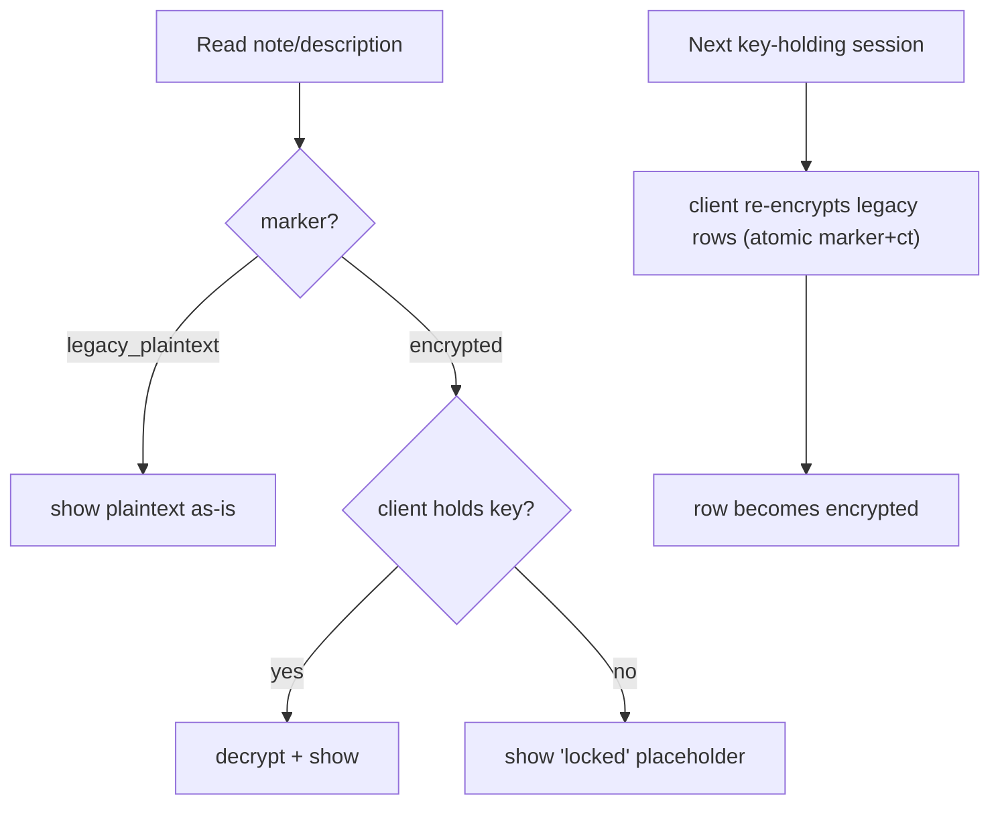

---

# 7. Auth Migration

### Simple explanation

Today the "keep me logged in" token comes back in the response. Tomorrow it lives in a locked cookie (web) or the phone's vault (native). Old phone apps keep working until everyone has updated.

### Technical explanation (AU-1/2/2a/4; ADR-013/014/015; contract §6 of #16)

| Stage           | Behaviour                                                                                                                                                                                                                           |
| --------------- | ----------------------------------------------------------------------------------------------------------------------------------------------------------------------------------------------------------------------------------- |
| CURRENT         | refresh token in response **body** (SEC-W3)                                                                                                                                                                                         |
| TRANSITION      | **dual-emit**: server returns body token **and** sets HttpOnly Lax host-only cookie (web) / accepts Keychain-Keystore header (native); refresh endpoint distinguishes transport by capability; cookie path **always** requires CSRF |
| TARGET (web)    | HttpOnly + Secure + SameSite=Lax + host-only cookie, path-scoped `/api/v1/auth/refresh`, exact CORS, CSRF double-submit                                                                                                             |
| TARGET (native) | secure-storage refresh + header transport; no WebView cookie reliance                                                                                                                                                               |

**Old mobile clients keep working until:** (1) a minimum-supported-version exists, (2) telemetry confirms adoption, (3) the sunset condition is met. **Sunset date = [ENGINEERING PARAMETER]** (ADR-015/OQ-17 — not invented). **Rollback:** Safe — re-enable body emit. **Never break `/api/v1` for cleanliness** (§15 of #16).

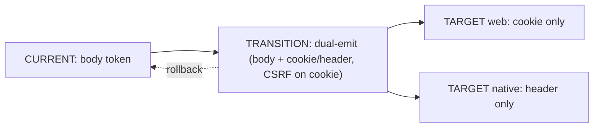

---

# 8. Group Key Version — ✅ VERIFIED (discrepancy resolved 2026-08-13)

> **⟳ RESOLUTION — 2026-08-13 (additive; the analysis below is preserved as written during Document #17).** The discrepancy flagged here was subsequently **verified** ([FINMATE_SEC_KI1_VERIFICATION.md](FINMATE_SEC_KI1_VERIFICATION.md)): the canonical group-key `versionId` path is **honored end-to-end** (fixed 2026-07-17; SUPERSEDED served, REVOKED rejected, caller-scoped wrapped keys, write path stamps the client-declared version; unit-tested). **Historical canonical expenses remain decryptable after normal rotation.** **M-KEYVER = VERIFY-ONLY, STATUS = COMPLETE / NO MIGRATION** — no schema migration, no historical re-encryption, no production data change, no key rotation, **no rollback required (nothing changes)**. **Residual (display-only, tracked separately, NOT canonical data loss):** GRP-007. **Separate open items:** GRP-005 (leaver-key), legacy NULL-`versionId` (REQUIRES PRODUCTION VERIFICATION), REVOKED semantics — [PRODUCT/SECURITY DECISION REQUIRED]. The frozen docs received additive dated status corrections on 2026-08-13; historical statements preserved.

### Simple explanation

The frozen documents say there is a bug: when the app asks for an old version of a group's key, the server ignores which version was asked for — so old messages can't be unlocked. **But the actual code today does the opposite: it honours the version.** So either the bug was already fixed, or the frozen docs are describing something more specific. We must **check**, not guess — and we must **not** re-encrypt everyone's history.

### Technical explanation — **repository-verified CURRENT behaviour**

- `groups.controller.ts:393` `GET :id/keys/me` accepts `@Query('versionId', ParseUUIDPipe optional)`.
- `groups.service.ts:1439` `getMyGroupKey(userId, groupId, versionId?)`:
  - if `versionId` given → loads **that** `GroupKeyVersion` (scoped to group); **throws `NotFound` if missing or `REVOKED`**;
  - else → active version;
  - returns the caller's **`member_wrapped_group_keys`** row **for that version**.
- Frontend: `group-key.service.ts` caches keys **keyed by `${groupId}:${versionId}`**, requests a specific `versionId`; `expense-decryption.service.ts:215` passes `expense.groupKeyVersionId`; expenses store/stamp `groupKeyVersionId`.

**Conclusion:** the **versioned group-key decryption path is implemented end-to-end** in the current repository. This **contradicts** the frozen Baseline §11 / Security §18 / Matrix §17, which list **SEC-KI1 ("group-key `?versionId=` ignored → rotated history undecryptable")** as an OPEN gap.

**Residual question (the only real open item):** when a version is **`REVOKED`**, `getMyGroupKey` throws `NotFound`, so data encrypted under a revoked version is not retrievable via this path. Whether that is (a) intended crypto-shred/rotation behaviour (ROT-1) or (b) a real "rotated history undecryptable" residual is **[ENG-UNKNOWN]** and needs confirmation.

**Migration classification: VERIFY-ONLY (`M-KEYVER`).** CURRENT behaviour honours `versionId`; **no historical re-encryption is proposed or permitted.** Existing groups, existing encrypted data, and new groups are unaffected. **Rollback: n/a** (no change).

> **STOP-AND-REPORT (per §27):** frozen docs (Baseline/Security/Matrix) list SEC-KI1 as OPEN "versionId ignored"; the repository shows it **honored**. This document does **not** silently resolve the contradiction and does **not** modify the frozen docs. **Recommended governance action:** verify SEC-KI1 status against the deployed backend + the REVOKED-version behaviour, then **back-port a status correction** to the frozen Baseline/Security/Matrix (same pending-back-port mechanism used for PRIN-1/FLD-1..7). **[PRODUCT/SECURITY DECISION: confirm SEC-KI1 status + REVOKED-version policy.]**

---

# 9. Attachment Migration (`attachments.originalName`, SEC-W6c)

### Simple explanation

A file's name can leak what's inside it. Today the code has **both** a plaintext name and a locked name — the plaintext one defeats the locked one. We stop saving new plaintext names; existing ones stay readable so nothing breaks.

### Technical explanation

- **From repo/matrix:** `attachments` entity has `originalName` (plaintext, NOT NULL) **and** `encryptedOriginalName` (E2EE) + `storageKey` + `encryptedFileKey`. Backend **upload path is not implemented** → **prod rows = [ENG-UNKNOWN] / REQUIRES PRODUCTION VERIFICATION.**
- **Whether clients depend on plaintext name:** [ENG-UNKNOWN] — the owner-visible name can come from `encryptedOriginalName`.
- **Migration (additive, reversible):** Phase 1 stop-populating plaintext `originalName` for **new** uploads; keep reading existing plaintext during transition; resolve the duplication before attachments GA (SEC-W6c). **Rollback:** Safe — re-enable plaintext population. **Never log `originalName`.**

---

# 10. Invited-Email Retention (`group_invites.invitedEmail`, FLD-7)

### Simple explanation

We keep an invite email only as long as the invite is useful, then tidy it away — without ever deleting an invite people still need.

### Technical explanation

- CURRENT: `invitedEmail` plaintext, prod data, server-readable for invite delivery/lookup. TARGET: plaintext-but-protected + **retention purge**.
- **Retention triggers:** purge on **accepted** invite (membership established) and on **expired** invite; **rejected** invite → purge; **[PRODUCT DECISION REQUIRED]** exact retention window. **Never purge an active/pending invite.**
- **Migration:** additive purge job (Phase 1/3). **Rollback/audit:** Safe — disable purge job; purge actions auditable (no email in audit metadata — SEC-W7). **Deletion:** ties to account deletion (DEL-1).

---

# 11. DB Isolation Migration

### Simple explanation

Putting data in different folders is not security; each area needs its **own login**. We build the walls **only for new rooms** and never touch the live money rooms.

### Technical explanation (ISO-1; ADR-007; §6 of #15)

**CURRENT:** single `public` schema, one datasource. **TARGET:** new sensitive domains get dedicated schemas **plus real, separate DB principals**; **CORE/FINANCE stay in `public`** (no reshuffle of live finance data).

**Order before any split:** define ownership → reads → writes → cross-domain contracts (projection-pull / outbox signals) → transaction boundaries → failure handling → rollback → data migration order. **New domains are greenfield** (no data to migrate); the migration is **granting roles + creating schemas**, not moving finance data.

**Absolute invariant:** a domain-isolation change **MUST NOT change financial calculations** (§15). Existing expense/settlement/P2P behaviour must remain **identical**. **Rollback:** Safe — revert grants/roles (new domains only).

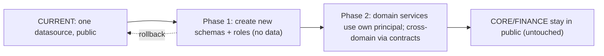

---

# 12. AI Migration

### Simple explanation

Today a thin relay forwards your typed prompt to an outside AI. Tomorrow a guarded door sends only a tiny number summary, and only if you agreed. The old relay must **not** quietly turn into the new door, and must **not** start sending more of your data.

### Technical explanation (AI-1..5; ADR-009/010/011/023; §9 of #16)

| Stage      | Behaviour                                                                                                                                 |
| ---------- | ----------------------------------------------------------------------------------------------------------------------------------------- |
| CURRENT    | `/ai/proxy` — client-supplied prompt + model, `redactUuids()` only, opt-in `aiOptIn`                                                      |
| TRANSITION | firewall path built **behind a feature flag** (default OFF); proxy retained but flaggable off; **no change to what data the proxy sends** |
| TARGET     | intent → firewall → numeric/enum projection → external-AI consent → verified ZDR provider → response validation; proxy retired (Phase 7)  |

**Invariants:** the current proxy is **not** automatically equivalent to the firewall; existing AI behaviour must **not silently start receiving more user data**; enabling the firewall requires the separate external-AI consent (AI-5). **Rollback:** Safe — flag off → firewall disabled, proxy behaviour unchanged (or proxy off entirely).

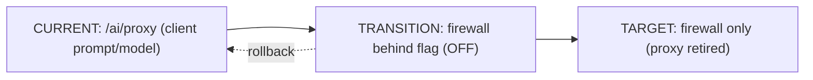

---

# 13. Import / Export Compatibility

### Simple explanation

Export then re-import must lose nothing — including the locked words only your device can open, and refunds counted correctly.

### Technical explanation (CURRENT: SheetJS xlsx; E2EE ciphertext round-trip; refund signed-negative — Memory refund-net)

- Old export format stays readable. If a **new format** is ever required: embed `formatVersion`; new clients read V1 **and** V2; old clients read V1; E2EE fields remain client-decrypted ciphertext.
- **Round-trip tests (mandatory):** export→import reproduces balances incl. refunds/multi-currency (§15). **Rollback:** Safe — read V1. **Never make existing exports unreadable without a deliberate migration.**

---

# 14. Mobile Compatibility

### Simple explanation

The phone app today is basically the website in a native shell. We must not pretend it has phone-only powers it doesn't have yet, and we can't assume everyone updates instantly.

### Technical explanation (Baseline §15)

| Concern               | Web                          | iOS                        | Android            |
| --------------------- | ---------------------------- | -------------------------- | ------------------ |
| Old app               | works on `/api/v1`           | Capacitor wrap, body token | same               |
| New app               | cookie refresh               | Keychain + header          | Keystore + header  |
| API compatibility     | dual-emit                    | dual-emit                  | dual-emit          |
| Min supported version | policy [ENG-PARAM]           | policy [ENG-PARAM]         | policy [ENG-PARAM] |
| Forced update         | avoid; only at sunset        | avoid                      | avoid              |
| Offline / sync        | SW cache (exclude sensitive) | **TARGET** (not built)     | **TARGET**         |
| Rollback              | re-enable body               | re-enable body             | re-enable body     |

**Do not claim native secure storage / push / deep links / offline sync before they exist (TARGET).** Never assume mobile users can instantly update — dual-emit until sunset (AU-4).

---

# 15. Financial Correctness (mandatory)

### Simple explanation

No migration is allowed to change anyone's balance. Same inputs must always give the same money answer — proven before and after.

### Technical explanation (FIN-002; ADR-017 golden fixtures)

Any migration touching expenses / refunds / splits / payments / household / carry-forward / settlements / P2P MUST prove **same input ⇒ same financial result** using the **golden fixtures**, run **before and after**.

**Mandatory fixture coverage:** multi-payer; all split types (equal/fixed/percent/share); refunds (signed-negative); household ledger + carry-forward; spectator exclusion; multi-currency (per-currency netting, no implicit FX); settlements (derived); P2P lend/borrow/settle. **No migration may silently alter financial meaning** — parity failure = **hard rollback trigger** (§18/§19).

---

# 16. Backup / Restore

### Simple explanation

A change can't un-write old backups. So we back up first, and we're honest that some things (like destroying a key) can't be undone from a backup.

### Technical explanation (K-4; DEL-2; RET-1)

- **Before migration:** full backup + recorded migration markers.
- **Verification:** post-migration counts + parity (§15/§18).
- **Restore testing:** restore into staging; confirm mixed-state readers still work; confirm **deletion/withdrawal tombstones replay** so restore does **not resurrect** deleted records (DEL-2, adversarial A-8).
- **Crypto-shred implications:** wrapped keys also live in backups → true erasure only after device-cache clear **and** backup rotation (K-4); **do not market instant shred.**
- **Rollback limitation:** if backups contain a state incompatible with a shipped irreversible checkpoint (crypto-shred/deletion), rollback is **not** possible — stated honestly (§19).

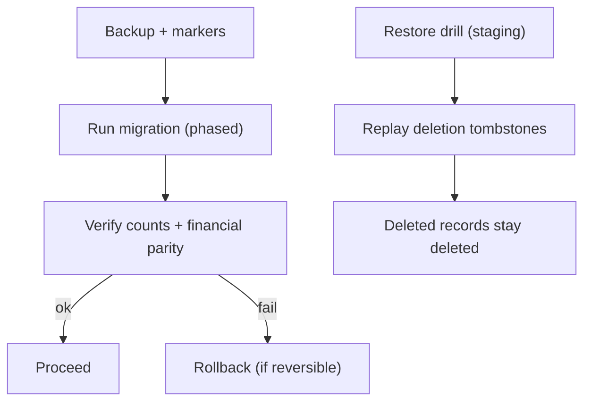

---

# 17. Feature Flags

### Simple explanation

Each risky change hides behind a switch we can flip off instantly.

### Technical explanation — proposed names marked **TARGET** (implementation naming unknown; do not invent as if existing).

| Flag (proposed, TARGET)                                                | Default               | Who enables | Rollback                  | Data safety      |
| ---------------------------------------------------------------------- | --------------------- | ----------- | ------------------------- | ---------------- |
| `auth.dualTransport`                                                   | dual-emit ON          | platform    | re-enable body            | no data change   |
| `enc.p2pNoteE2EE` / `enc.settlementNoteE2EE` / `enc.groupDescE2EE`     | OFF (write encrypted) | platform    | plaintext reader retained | mixed-state safe |
| `dbIsolation.<domain>`                                                 | OFF                   | platform    | revert grants             | new domains only |
| `ai.firewall`                                                          | OFF                   | platform    | proxy unchanged           | no extra egress  |
| `notifications.inApp`                                                  | OFF                   | platform    | disable                   | additive         |
| `mobile.secureStorage` / `mobile.push`                                 | OFF                   | platform    | fall back to wrap         | additive         |
| `domain.<goals/private/wellbeing/wardrobe/opportunities/intelligence>` | OFF                   | platform    | drop                      | greenfield       |

**Rule:** every migration with a compatibility or security edge is flag-gated; flags default to the **safe** state.

---

# 18. Observability

### Simple explanation

Every migration shows a dashboard of "is this going okay?" — and it never logs your secrets.

### Technical explanation — required signals per migration:

migration progress; failure count; old-state vs new-state counts; **decryption failures**; authorization failures; **financial-parity failures**; auth failures; mobile-compatibility failures; rollback triggers.

**Never log** (SEC-W2/W7): secrets, refresh tokens, E2EE plaintext, sensitive free-text, unnecessary PII, AI-provider credentials. Log safe metadata only (request id, decision, counts). **Financial-parity failure or a spike in decryption failures → automatic rollback trigger.**

---

# 19. Rollback Strategy

### Simple explanation

For each change we say plainly: can we undo it, can we only go forward, or is there a point of no return?

### Technical explanation

| Migration                                 | Rollback class                    | Why                                                                                                                                      |
| ----------------------------------------- | --------------------------------- | ---------------------------------------------------------------------------------------------------------------------------------------- |
| Auth transport                            | **SAFE ROLLBACK**                 | re-enable body emit; no data change                                                                                                      |
| P2P/settlement/group-desc E2EE            | **SAFE ROLLBACK** (write side)    | stop writing encrypted; plaintext reader permanent. **Note:** rows already client-encrypted stay encrypted (ROLL-FORWARD for those rows) |
| Attachment originalName                   | SAFE ROLLBACK                     | re-enable plaintext population                                                                                                           |
| Invited-email retention                   | SAFE ROLLBACK                     | disable purge; **purged rows are gone (roll-forward once purged)**                                                                       |
| Group-key version (M-KEYVER)              | n/a                               | verify-only, no change                                                                                                                   |
| DB isolation (new domains)                | SAFE ROLLBACK                     | revert grants/schemas (greenfield)                                                                                                       |
| AI firewall                               | SAFE ROLLBACK                     | flag off                                                                                                                                 |
| **Account deletion / crypto-shred**       | **IRREVERSIBLE AFTER CHECKPOINT** | destroyed keys / erased personal data cannot be restored (K-4, DEL-1)                                                                    |
| Consent withdrawal → derived invalidation | ROLL-FORWARD ONLY                 | invalidated derived data recomputed, not restored                                                                                        |

**Do not pretend destructive operations are reversible.** Crypto-shred, deletion, and post-purge states are explicitly one-way.

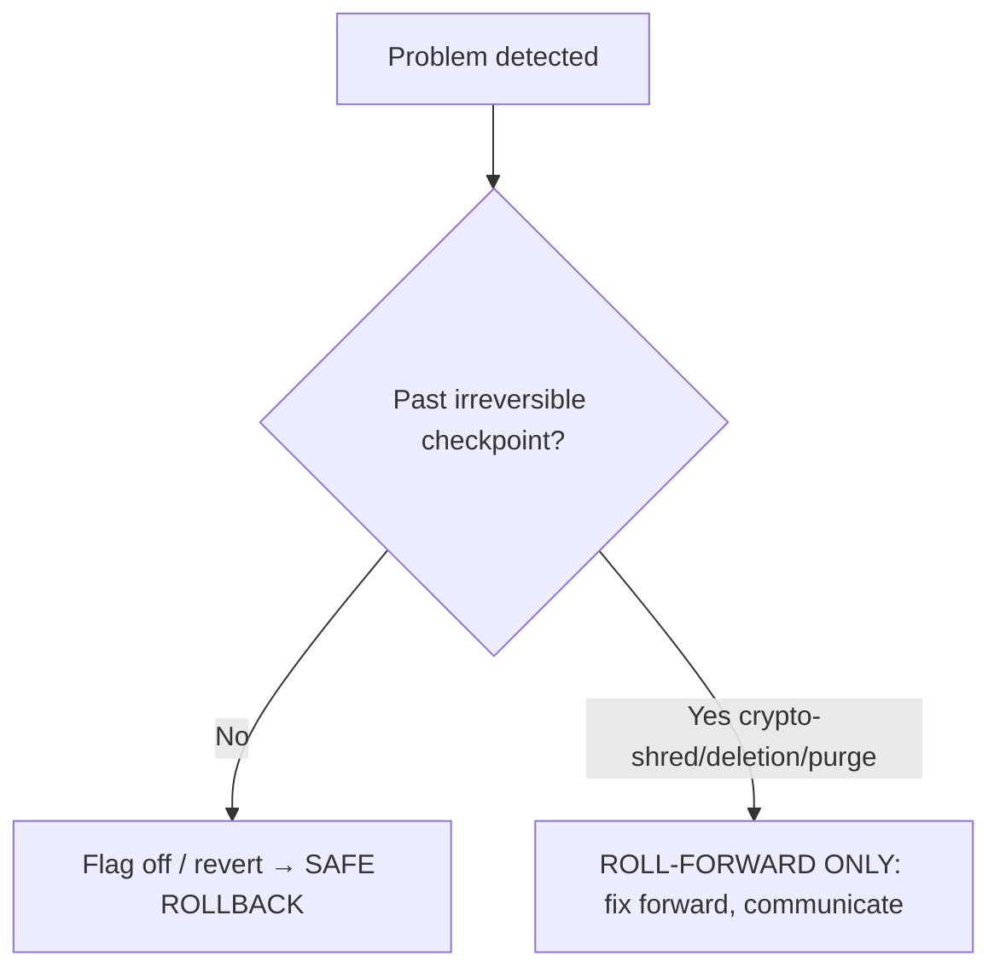

---

# 20. Migration Order (dependency-aware, not speed-optimized)

### Simple explanation

Do security basics first, foundations next, risky compatibility changes carefully, then new features — never all at once.

### Technical explanation

1. **P0 security prerequisites (do first):** SEC-W1 (git-history blobs + secret scanning), SEC-W2 (stop logging tokens/email/IP), SEC-W3 groundwork. _These gate anything that ships new auth/log surfaces._
2. **Foundational:** confirm SEC-KI1 status (§8, verify-only); log redaction; audit email removal (SEC-W7).
3. **Compatibility-sensitive:** auth dual-transport (AU-1/4); E2EE mixed-state notes/description (B-2/FLD-1/FLD-2).
4. **Isolation infrastructure:** new-domain schemas + principals (ISO-1) — greenfield, before any new domain feature.
5. **V1 features:** goals-v2 (born-E2EE); in-app notifications; AI firewall (flagged).
6. **V2 / future domains:** PRIVATE/WELLBEING/WARDROBE/OPPORTUNITIES/INTELLIGENCE.

**Security-before-migration rule:** logging redaction (SEC-W2) must land **before** the auth transition (so transition telemetry can't leak tokens); DB principals must exist **before** any new-domain data write.

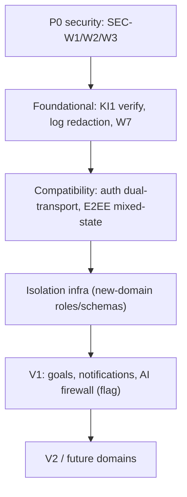

---

# 21. Production Rollout

### Simple explanation

Every change walks through dev → test → staging → a tiny slice of real users (canary) → everyone, with checks and an escape hatch at each step.

### Technical explanation

| Stage       | Entry criteria                              | Verification                                               | Rollback                        | Exit criteria                                 |
| ----------- | ------------------------------------------- | ---------------------------------------------------------- | ------------------------------- | --------------------------------------------- |
| Development | flag OFF; unit tests                        | golden fixtures pass (§15)                                 | n/a                             | merged                                        |
| Test        | migration dry-run on seed data              | mixed-state read/write; parity                             | reset seed                      | green                                         |
| Staging     | prod-like data shape; backup drill          | restore + tombstone replay; parity; decryption-failure = 0 | revert flag                     | signed off                                    |
| Canary      | small user slice; observability live        | live parity, failure counts within threshold               | flag off for slice              | thresholds held N days                        |
| Production  | canary clean; adoption telemetry (for auth) | full dashboards (§18)                                      | flag off / roll-forward per §19 | steady-state; legacy retire only after sunset |

**Do not claim a migration is safe merely because tests pass** — staging restore + canary parity are required for anything touching money or E2EE.

---

# 22. User Impact

| Migration                       | Impact               | User notices?                      | Action required?           | Old app works?  | Temporary mixed-state? |
| ------------------------------- | -------------------- | ---------------------------------- | -------------------------- | --------------- | ---------------------- |
| Auth transport                  | INVISIBLE            | no (if phased)                     | no                         | yes (dual-emit) | n/a                    |
| P2P/settlement/group-desc E2EE  | INVISIBLE→MINOR      | maybe "locked" placeholder pre-key | no                         | yes (marker)    | **yes**                |
| Attachment originalName         | NONE                 | no                                 | no                         | yes             | n/a                    |
| Invited-email retention         | NONE                 | no                                 | no                         | yes             | n/a                    |
| Group-key version (verify)      | NONE                 | no                                 | no                         | yes             | n/a                    |
| DB isolation                    | NONE                 | no                                 | no                         | yes             | n/a                    |
| AI firewall                     | VISIBLE              | yes (chatbot behaviour)            | re-consent for external AI | yes (flag)      | n/a                    |
| Goals / notifications / domains | VISIBLE (new)        | yes (new feature)                  | opt-in                     | yes             | n/a                    |
| Auth sunset (far future)        | POTENTIALLY BREAKING | only un-updated old apps           | **update required**        | no after sunset | n/a                    |

---

# 23. Migration Matrix

| ID         | Area                                     | Current             | Target                                | Data affected         | Compat risk | Strategy                                   | Rollback                | Flag (TARGET)            | Verification                              | Owner             | Status                                            |
| ---------- | ---------------------------------------- | ------------------- | ------------------------------------- | --------------------- | ----------- | ------------------------------------------ | ----------------------- | ------------------------ | ----------------------------------------- | ----------------- | ------------------------------------------------- |
| M-AUTH     | Auth transport                           | body token          | cookie/header + CSRF                  | live sessions         | Med         | dual-emit + min-version                    | Safe                    | `auth.dualTransport`     | adoption telemetry; auth-fail count       | [OWNER TO ASSIGN] | TRANSITION                                        |
| M-NOTE-P2P | `direct_ledger.note`                     | plaintext           | E2EE `direct_shared`                  | prod P2P notes        | Med         | marker + client backfill                   | Safe (plaintext reader) | `enc.p2pNoteE2EE`        | state counts; decrypt-fail; export parity | [OWNER TO ASSIGN] | TRANSITION (B-2)                                  |
| M-NOTE-SET | `settlement.note`                        | plaintext           | E2EE (group key)                      | prod settlement notes | Med         | marker + client backfill                   | Safe                    | `enc.settlementNoteE2EE` | as above                                  | [OWNER TO ASSIGN] | TRANSITION (FLD-1)                                |
| M-DESC-GRP | `group.description`                      | plaintext           | E2EE (group key)                      | prod descriptions     | Med         | marker + client backfill; pre-join degrade | Safe                    | `enc.groupDescE2EE`      | as above + pre-join display check         | [OWNER TO ASSIGN] | TRANSITION (FLD-2)                                |
| M-ATTACH   | `attachment.originalName`                | plaintext + enc dup | drop plaintext (new)                  | [ENG-UNKNOWN] rows    | Low         | stop-populate; keep read                   | Safe                    | —                        | dup resolved; no plaintext logged         | [OWNER TO ASSIGN] | TARGET (SEC-W6c)                                  |
| M-INVEMAIL | `invitedEmail`                           | plaintext           | + retention purge                     | prod invites          | Low         | additive purge job                         | Safe (pre-purge)        | —                        | active invites never purged               | [OWNER TO ASSIGN] | TARGET (FLD-7)                                    |
| M-KEYVER   | Group-key version                        | **honored (repo)**  | verify vs SEC-KI1                     | none                  | Low         | **VERIFY-ONLY**; no re-encryption          | n/a                     | —                        | confirm endpoint + REVOKED behaviour      | [OWNER TO ASSIGN] | **VERIFIED 2026-08-13 · COMPLETE / NO MIGRATION** |
| M-DBISO    | DB isolation                             | single schema       | per-domain principals                 | new domains only      | Med         | additive schemas/roles                     | Safe                    | `dbIsolation.*`          | financial parity unchanged                | [OWNER TO ASSIGN] | TARGET (ISO-1)                                    |
| M-AI       | AI proxy → firewall                      | thin proxy          | intent+projection                     | none (additive)       | Med         | flag; proxy retained                       | Safe (flag off)         | `ai.firewall`            | no extra egress; consent gate             | [OWNER TO ASSIGN] | TRANSITION (AI-1)                                 |
| M-GOALS    | Goals                                    | empty table         | born-E2EE                             | none (empty)          | Low         | new feature                                | drop                    | `domain.goals`           | born-encrypted                            | [OWNER TO ASSIGN] | TARGET (B-1)                                      |
| M-NOTIF    | Notifications                            | none                | in-app ranked                         | none                  | Low         | new feature                                | disable                 | `notifications.inApp`    | content-free payloads                     | [OWNER TO ASSIGN] | TARGET (NOT-1)                                    |
| M-MOBILE   | Native capabilities                      | wrap                | secure storage/push/deep-link/offline | none                  | Med         | additive, capability-gated                 | Safe                    | `mobile.*`               | capability checks                         | [OWNER TO ASSIGN] | TARGET                                            |
| M-IMPEXP   | Import/export format                     | xlsx V1             | optional versioned                    | user exports          | Low         | version marker                             | Safe (read V1)          | —                        | round-trip parity                         | [OWNER TO ASSIGN] | CURRENT/TARGET                                    |
| M-INTEL    | Intelligence                             | none                | signals + provenance                  | none                  | Low         | new domain (no raw FK)                     | drop                    | `domain.intelligence`    | no raw FK/keys                            | [OWNER TO ASSIGN] | TARGET (ISO-2)                                    |
| M-DOMAINS  | PRIVATE/WELLBEING/WARDROBE/OPPORTUNITIES | none                | isolated schemas + keys               | none                  | Low         | new domains                                | drop                    | `domain.*`               | isolation + key stores                    | [OWNER TO ASSIGN] | TARGET                                            |

---

# 24. Diagrams

**MIG-01 — Overall migration strategy.** _Simple:_ add first, run old+new together, convert on-device, verify, retire last. _Technical:_ additive-first, mixed-state, client-backfill, flag-gated, security-sequenced.

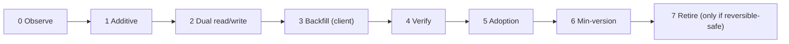

**MIG-02 — E2EE mixed-state.** See §6 diagram. _Simple:_ labels tell old from locked. _Technical:_ marker branch + client backfill; atomic marker+ciphertext.

**MIG-03 — Auth transition.** See §7 diagram.

**MIG-04 — DB isolation transition.** See §11 diagram.

**MIG-05 — AI transition.** See §12 diagram.

**MIG-06 — Group-key verify.** _Simple:_ check the version handling; don't re-encrypt history. _Technical:_ confirm endpoint honors `versionId` + define REVOKED-version policy.

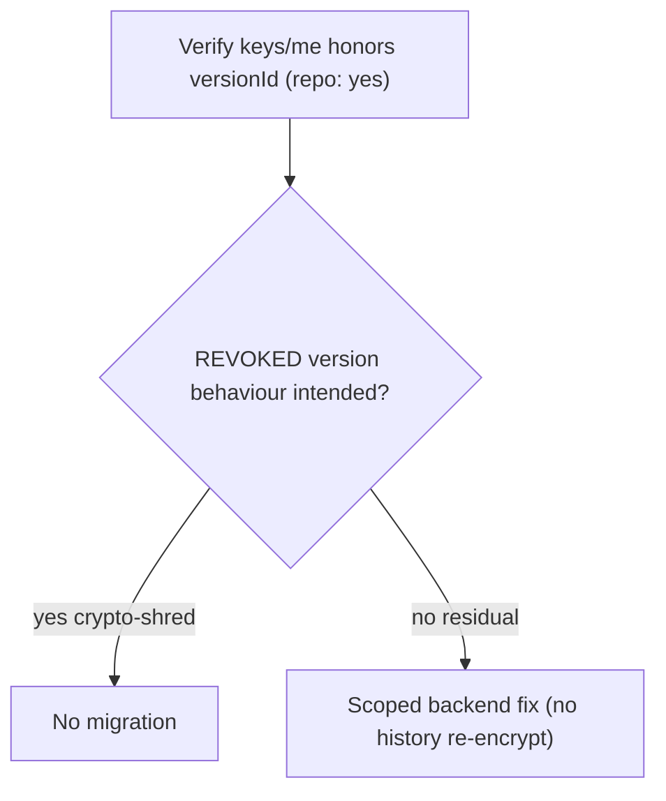

**MIG-07 — Attachment migration.** _Simple:_ stop saving new plaintext names. _Technical:_ additive stop-populate; keep reading existing.

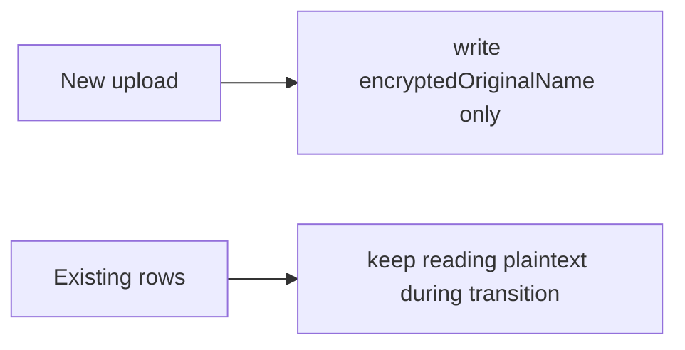

**MIG-08 — Backup/restore.** See §16 diagram.

**MIG-09 — Rollout pipeline.** _Simple:_ dev→test→staging→canary→prod, checks each step. _Technical:_ entry/verify/rollback/exit per stage (§21).

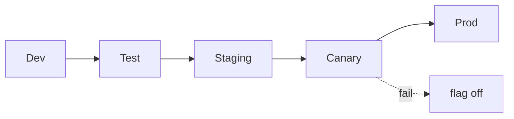

**MIG-10 — Rollback decision tree.** See §19 diagram.

---

# 25. Adversarial Migration Review

_Acting as a careless/hostile developer. Each successful attack strengthens the document; none changes code._

| #    | Attack                                                | Stopped by                                                                                                          | Clause      |
| ---- | ----------------------------------------------------- | ------------------------------------------------------------------------------------------------------------------- | ----------- |
| A-1  | Change a balance during migration                     | financial parity fixtures before/after; parity fail = rollback                                                      | §15/§18     |
| A-2  | Double-run the migration                              | migrations idempotent by marker/version; re-run is a no-op                                                          | §6, §23     |
| A-3  | Client crashes halfway through backfill               | backfill is per-row + atomic (marker+ciphertext in one tx); crash leaves rows consistent, resumes next session      | §6          |
| A-4  | Encryption succeeds but **marker write fails**        | **atomic**: marker+ciphertext committed together or neither → row stays legacy                                      | §6          |
| A-5  | Marker writes but **encryption fails**                | same atomic rule → no "encrypted" marker without ciphertext                                                         | §6          |
| A-6  | Two clients backfill the same row simultaneously      | optimistic lock (`@VersionColumn`) → one wins, other gets `412`, refetches; result identical (idempotent)           | §6, #16 §13 |
| A-7  | Old mobile app after transition                       | dual-emit body token until min-version sunset                                                                       | §7/§14      |
| A-8  | Backup restore resurrects deleted records             | tombstone replay after restore (DEL-2)                                                                              | §16         |
| A-9  | Rollback after some users migrated                    | E2EE rollback keeps plaintext reader; already-encrypted rows stay encrypted (roll-forward for those) — no data loss | §19         |
| A-10 | Group key has an old version                          | **repo honors `versionId`**; client requests correct version; **do not re-encrypt history**                         | §8          |
| A-11 | Re-encrypt everyone's history "to be safe"            | **prohibited** — no historical re-encryption; permanent mixed-state                                                 | §6/§8       |
| A-12 | Split the finance DB to "isolate"                     | **prohibited** — CORE/FINANCE stay in `public`; isolation only for new domains; no calc change                      | §11/§15     |
| A-13 | AI proxy silently upgraded to send more data          | firewall is separate, flag-gated, consent-gated; proxy egress unchanged until retired                               | §12         |
| A-14 | Purge an active invite                                | retention triggers only on accepted/expired/rejected; active never purged                                           | §10         |
| A-15 | Log a refresh token / E2EE plaintext during migration | observability forbids secrets/plaintext (SEC-W2/W7)                                                                 | §18         |
| A-16 | Break import round-trip / refunds                     | round-trip parity incl. refund-net; version marker for format                                                       | §13/§15     |
| A-17 | Enable a future domain in V1                          | all domains flag-OFF; goals/notes PLACEHOLDER                                                                       | §17/§2      |
| A-18 | Claim crypto-shred is instant / reversible            | K-4 honesty; irreversible-after-checkpoint                                                                          | §16/§19     |
| A-19 | Financial record edited mid-migration                 | migrations don't mutate finance rows; optimistic lock guards concurrent edits                                       | §11/§15     |
| A-20 | Cross-domain raw read introduced by isolation work    | deny-by-default; contracts/projections only                                                                         | §11, #15    |

**Findings requiring a decision:** **one — the SEC-KI1 discrepancy (§8)** requires confirming SEC-KI1 status + the REVOKED-version policy → **[PRODUCT/SECURITY DECISION]** + a frozen-doc status back-port. All other gaps are already TARGET items with owning decisions. **No destructive migration was introduced; no financial semantic changed.**

---

# 26. Traceability

| Migration                  | SRS                    | ADR             | Ledger         | Threat       | Matrix | Contract (#16)          | Ownership (#15) |
| -------------------------- | ---------------------- | --------------- | -------------- | ------------ | ------ | ----------------------- | --------------- |
| M-AUTH                     | AUTH-002/004/005       | 013/014/015     | AU-1/2/4       | T-02         | §13    | CT-AUTH-02              | Part 9/10       |
| M-NOTE-P2P/SET, M-DESC-GRP | MIG-001/002/003        | 016             | B-2, FLD-1/2   | T-DB         | §5/§13 | CT-P2P-04/SET-02/GRP-02 | Part 10         |
| M-ATTACH                   | MIG-008                | 016             | FLD-6, SEC-W6c | —            | §5.16  | CT-X-E2EE               | Part 2          |
| M-INVEMAIL                 | —                      | 019             | FLD-7          | —            | §5.12  | CT-GRP-04               | Part 2          |
| M-KEYVER                   | KEY-005                | 004             | ROT-1, SEC-KI1 | —            | §17    | CT-GRP-05               | Part 12         |
| M-DBISO                    | SEC-ISO-001/002        | 007             | ISO-1          | T-09         | §10    | CT-X-AUTHZ              | Part 6          |
| M-AI                       | AI-001..009            | 009/010/011/023 | AI-1..5        | T-08/T-13    | §11    | CT-AI-02                | Part 8          |
| M-GOALS                    | FUT-001                | 003             | B-1            | —            | §5.15  | CT-GOAL-01              | Part 4          |
| M-NOTIF                    | NOT-001..007           | 021             | NOT-1          | —            | —      | CT-NOT-01               | Part 4          |
| M-MOBILE                   | AUTH-002/004           | 013             | AU-1           | —            | —      | CT-X-MOBILE             | Part 4/10       |
| M-IMPEXP                   | DEL-004                | 019             | —              | —            | §13    | CT-IMP-01               | Part 7          |
| M-INTEL, M-DOMAINS         | INT-001..005 / FUT-002 | 008/012/018     | ISO-2          | cross-domain | §10    | CT-INT-01               | Part 4/5        |

**Orphans:** none found for migration-relevant items. **Orphaned risk highlighted:** SEC-KI1 status (frozen=OPEN vs repo=implemented) — §8.

---

# 27. Final Reconciliation

Checked against all frozen documents (Ledger, Matrix, Security, Key, AI, IP, Threat, Register, Baseline, UX, SRS, SRS-Adversarial, ADRs, Ownership #15, Contracts #16).

- **No destructive migration introduced.** All are additive/mixed-state; no historical re-encryption; CORE/FINANCE untouched.
- **No current behaviour rewritten; no E2EE downgrade; no financial semantic change** (FIN-002 fixtures gate everything).
- **No auth break** (dual-emit + sunset); **no mobile break** (dual-emit); **no undocumented data loss** (purge/shred/deletion explicitly one-way).
- **No AI privacy bypass** (firewall separate, flagged, consent-gated); **no rollback lie** (irreversible operations named).
- **No CURRENT/TARGET confusion** — every TARGET labelled; PLACEHOLDER (goals/notes) not described as working.
- **Contradiction found:** **ONE — SEC-KI1 (§8):** frozen docs listed "versionId ignored" OPEN; repository **honors** `versionId` end-to-end. **Surfaced, NOT silently resolved.** **Update 2026-08-13:** verified ([FINMATE_SEC_KI1_VERIFICATION.md](FINMATE_SEC_KI1_VERIFICATION.md)) and **back-ported** as additive dated status corrections to the frozen docs (historical statements preserved). **RESOLVED — M-KEYVER VERIFY-ONLY, complete.**

---

# Final Report

- **Repository areas inspected:** entities (`shared/data-models/*`), 21 migrations, expense/auth DTOs, `groups.service.getMyGroupKey` + `groups.controller` keys/me, frontend `group-key.service`/`expense-decryption.service`/`crypto-session-manager`, `http-exception.filter`, throttle constants (this task + #15/#16).
- **Migrations identified:** 15 (M-AUTH, M-NOTE-P2P, M-NOTE-SET, M-DESC-GRP, M-ATTACH, M-INVEMAIL, M-KEYVER, M-DBISO, M-AI, M-GOALS, M-NOTIF, M-MOBILE, M-IMPEXP, M-INTEL, M-DOMAINS).
- **Production-data assumptions:** existing prod data assumed for P2P/settlement/group notes, group.name/nickname/income, invitedEmail, E2EE expense fields, key material; goals empty; attachments/notes rows [ENG-UNKNOWN]. No counts fabricated.
- **Compatibility-sensitive areas:** auth transport, E2EE mixed-state notes/description, AI proxy→firewall, mobile transport, import/export format.
- **Migration-sensitive fields:** direct_ledger.note, settlement.note, group.description, attachment.originalName, invitedEmail, refresh transport, group-key version.
- **Security prerequisites (sequenced first):** SEC-W1, SEC-W2, SEC-W3 groundwork; SEC-W7 audit-email; log redaction before auth transition.
- **Unresolved engineering parameters:** auth sunset date; marker column name; invited-email retention window; idempotency key/window; AI throttle; min-supported-version policy.
- **Counsel items:** GDPR classification (FLD-1..7); contacts non-user basis (CNT-1); deletion retention + departed free-text (DEL-1/DEL-3); vendor transfers (VEN-1).
- **Adversarial findings:** 20 probes; all stopped by an existing/TARGET clause; wording hardened on atomicity (A-4/A-5), concurrent backfill (A-6), rollback-after-partial (A-9), no-history-re-encrypt (A-10/A-11).
- **Contradictions:** **ONE — SEC-KI1 (§8)**, surfaced and reported, frozen docs unmodified; requires a [PRODUCT/SECURITY DECISION] + status back-port.
- **Files created:** `docs/architecture/FINMATE_BACKWARD_COMPATIBILITY_MIGRATION_PLAN.md`, `docs/architecture/MIGRATION_PLAN_INDEX.md`.
- **Files modified:** `FinMate_Project_Specification.md` (Progress Log entry only).
- **Confirmation:** **NO CODE was changed.** No source, entity, controller, service, database, migration file, migration execution, auth, encryption, frontend, mobile, config, package, deployment, production change, or implementation ticket.

_End of Document #17 (Backward Compatibility & Migration Plan). STOP — no migrations created or executed, no schema/production change, no implementation tickets._
