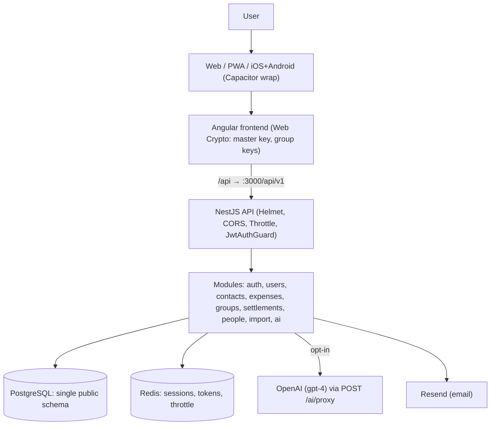
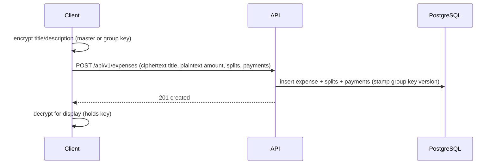
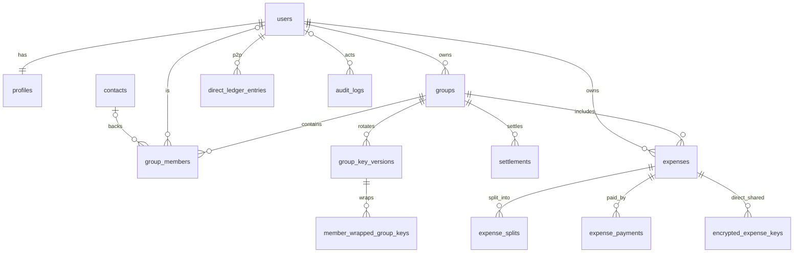

# FinMate — Current System & Existing Functionality Baseline

**Purpose:** the **compatibility baseline** for the future SRS. *"Current system reality must be known before target system requirements are written."* Describes what **actually exists today**, verified from the repository — not what the frozen architecture documents *plan*.
**Nature:** documentation/discovery only. No code, DB, migration, API, encryption, auth, frontend, mobile, deployment, config, or frozen document changed.
**Status labels:** **CURRENT** (verified in repo) · **PARTIAL** (some implementation) · **PLACEHOLDER** (UI/schema exists, feature not functional) · **TARGET** (planned, not implemented) · **UNKNOWN** (insufficient evidence).
**Rule:** repository facts win over architecture-document targets; mismatches are recorded in §23, never silently reconciled.

**Glossary:** *E2EE* = end-to-end encrypted (only the user can read). *Zone 2* = server-readable, protected. *ZK* = zero-knowledge (server can't read). *TIK* = temporary invite key. *PWK* = public wrapping key.

---

## 3. FinMate in 5 minutes

### Simple explanation
Today FinMate is a **working money app for tracking and splitting expenses**. You sign up, log in (with optional 2FA), add expenses (alone or in a group), split them with friends, settle who owes whom, and track person-to-person lending. Your **expense titles and notes are locked so only you (and group members) can read them**; the amounts are readable by the app so it can do the maths. There's a basic AI chat you can opt into. That's what exists. **Journals, mood/wellbeing, wardrobe, goals-as-a-feature, notifications, statement import, and the AI "privacy firewall" do NOT exist yet** — they're planned.

### Technical explanation
FinMate is an Nx monorepo: Angular (Web + PWA, wrapped by Capacitor for iOS/Android) → NestJS REST API (`/api/v1`) → PostgreSQL (single `public` schema) + Redis (sessions/throttle). Shipped modules: **auth, users/profile, contacts, expenses (+recurring), groups (+invites, members), settlements/friends, people/P2P, import/export, ai (thin proxy)**. Security today: client-side E2EE for free-text expense/note fields + group-key versioning; server-side global-key encryption for 2FA/avatar only; Argon2 + JWT + Redis sessions. **Domain isolation, per-domain keys, the AI firewall, and all new life-domains are TARGET, not built.**

---

## 4. System architecture today

### Simple explanation
One app, one server, one database. The phone apps are the same web app wrapped in a native shell.

### Technical detail — **CURRENT**

- **CURRENT:** single TypeORM datasource (`backend/src/ormconfig.ts`); no object storage in use (attachment upload path not implemented); Swagger at `/docs`.
- **TARGET (not shown):** per-domain schemas/roles, AI firewall, object storage, new domains.

---

## 5. Module inventory

| Module | Status | Backend | Frontend | DB | API | Mobile | Prod-used? | Security sensitivity | Deps | Notes |
|---|---|---|---|---|---|---|---|---|---|---|
| Authentication | **CURRENT** | ✅ auth | ✅ auth routes | users | 12 | wrap | Yes | High | Redis, encryption, email | Argon2, JWT, 2FA, ZK reset |
| Users/Profile | **CURRENT** | ✅ users | ✅ | users, profiles | 10 | wrap | Yes | High | auth | avatar server-encrypted |
| Contacts | **CURRENT** | ✅ contacts | via people/groups | contacts | 4 | wrap | Yes | High (3rd-party PII) | groups | claim flow |
| Expenses | **CURRENT** | ✅ expenses | ✅ groups/dashboard | expenses, splits, payments, versions | 15 | wrap | Yes | High | groups, encryption | E2EE title/desc |
| Recurring expenses | **CURRENT** | ✅ recurring-expenses | ✅ | recurring_expenses(+splits) | 6 | wrap | Yes | Med | expenses | beta |
| Groups | **CURRENT** | ✅ groups | ✅ groups routes | groups, members, contributions, keys | 20 | wrap | Yes | High | expenses, keys | key versioning |
| Group members/invites | **CURRENT** | ✅ members, invite | ✅ | group_members, group_invites | 4 + 1 | wrap | Yes | High | contacts, keys | TIK/RSA invites |
| Settlements | **CURRENT** | ✅ settlements, friends | ✅ friends routes | settlements, versions | 4 + 1 | wrap | Yes | High | groups | note plaintext |
| People/P2P | **CURRENT** | ✅ people | ✅ people routes | direct_ledger_entries | 6 | wrap | Yes | High | users | note plaintext |
| Import/Export | **CURRENT** | ✅ import, export | ✅ export modal | expenses | 1 + 1 | wrap | Partial | High | expenses, encryption | xlsx |
| AI | **PARTIAL** | ✅ ai (proxy) | ✅ dashboard chatbot | none | 1 | wrap | opt-in | High | users (aiOptIn) | thin proxy, **no firewall** |
| Encryption (server) | **CURRENT** | ✅ encryption | Web Crypto | 2FA, avatar | n/a | wrap | Yes | Critical | config | global key |
| Key management (client) | **CURRENT** | keys endpoints in groups | ✅ zk-key-vault, group-key | encrypted_group_keys, member_wrapped_group_keys, group_key_versions, encrypted_expense_keys | via groups | wrap | Yes | Critical | groups | ZK |
| Redis/session | **CURRENT** | ✅ redis | n/a | Redis | n/a | wrap | Yes | High | auth, throttler | argon2 sessions |
| Audit/logging | **CURRENT** | ✅ interceptor, audit_logs | n/a | audit_logs | n/a | wrap | Yes | High | — | SEC-W2/W7 |
| Dashboard | **CURRENT (aggregation)** | via expenses/settlements | ✅ dashboard | reads existing | reuses | wrap | Yes | Med | expenses | no own API |
| **Goals** | **PLACEHOLDER** | ❌ no module/service/controller | ⚠ dashboard-goals component | goals table (empty) | 0 | wrap | No | — | — | table from InitialSchema, no write path |
| **Notes** | **PLACEHOLDER/UNKNOWN** | ❌ no controller found | UNKNOWN | notes table | 0 | wrap | UNKNOWN | High (E2EE fields) | groups | schema-only |
| **Attachments** | **TARGET** | ❌ no storage service | ❌ | attachments table | 0 | — | No | High | — | upload path unbuilt |
| **Notifications** | **TARGET** | ❌ none | ❌ | none | 0 | — | No | Med | — | not implemented |
| Wellbeing / Wardrobe / Opportunities / Intelligence | **TARGET** | ❌ | ❌ | none | 0 | — | No | High | — | not implemented |
| AI Privacy Firewall / domain isolation / per-domain keys | **TARGET** | ❌ | ❌ | single schema | — | — | No | Critical | — | frozen design, unbuilt |

**Verified:** no backend directory for goals/notes/notifications/dashboard/wellbeing/wardrobe (filesystem check). Goals table exists (InitialSchema) with **no** controller/service → PLACEHOLDER.

---

## 6. Existing user flows

Statuses of the requested flows (A–T):

| Flow | Status | Frontend | API (base) | Service | Entities | Encryption | Notes |
|---|---|---|---|---|---|---|---|
| A Registration | CURRENT | /auth | POST /auth/register | AuthService | users | password argon2 | email best-effort |
| B Login | CURRENT | /auth | POST /auth/login | AuthService | users | argon2 verify; 2FA | tokens in body |
| C Logout | CURRENT | — | POST /auth/logout | AuthService | Redis | — | deletes session |
| D Password reset | CURRENT | /auth/reset-password | GET+POST /auth/reset-password | AuthService | users, Redis | **ZK re-wrap** | needs recovery key |
| E Email verification | CURRENT | /auth/verify-email | GET /auth/verify-email | AuthService | users, Redis | — | gates contact-claim only |
| F 2FA | CURRENT | dashboard | POST /auth/2fa/* | AuthService | users | server AES-GCM secret | TOTP |
| G Expense create | CURRENT | groups/dashboard | POST /expenses | ExpensesService | expenses, splits, payments | E2EE title/desc | multi-payer |
| H Expense edit | CURRENT | groups | PATCH/PUT /expenses/:id | ExpensesService | +versions | E2EE | optimistic lock |
| I Expense delete | CURRENT | groups | DELETE /expenses/:id | ExpensesService | soft-delete | — | 7-day restore |
| J Expense split | CURRENT | create modal | via /expenses | ExpensesService | expense_splits | — | equal/fixed/percent/share |
| K Group create | CURRENT | /groups | POST /groups | GroupsService | groups | — | key version created |
| L Group member mgmt | CURRENT | group detail | /groups/:id/members | MembersService | group_members, contacts | — | roles |
| M Settlement | CURRENT | friends/group | /groups/:groupId/settlements | SettlementsService | settlements | note plaintext | derived balances |
| N People/P2P | CURRENT | /people | /people | PersonLedgerService | direct_ledger_entries | note plaintext | both registered |
| O Recurring | CURRENT | groups | /recurring-expenses | RecurringExpensesService | recurring_expenses | E2EE title/desc | scheduler |
| P Attachments | **TARGET** | — | — | — | attachments | (planned E2EE) | not functional |
| Q Dashboard | CURRENT | /dashboard | reuses expenses/settlements | aggregation | reads | client decrypt | no own endpoint |
| R Notifications | **TARGET** | — | — | — | — | — | not implemented |
| S Mobile auth | PARTIAL | Capacitor wrap | same as web | AuthService | — | **same as web (cookieless body token)** | no native secure storage yet |
| T Web auth | CURRENT | web | /auth/* | AuthService | Redis | token in body | SEC-W3 |

**AUTH-01 — Current login flow (CURRENT)**
```mermaid
sequenceDiagram
  participant C as Client (web/native)
  participant A as API
  participant R as Redis
  C->>A: POST /api/v1/auth/login (email, password, x-mfa-code?)
  A->>A: argon2.verify; if 2FA, verify TOTP
  A->>R: store argon2(refreshId), 7d TTL
  A-->>C: { accessToken, refreshToken, user }  (both in body)
  C->>A: POST /auth/refresh { refreshToken }
  A->>R: verify + rotate
  A-->>C: { accessToken, refreshToken }
```

**EXP-01 — Current expense create (CURRENT)**


---

## 7. Expense system — protected baseline

### Simple explanation
FinMate's heart is expenses: what was spent, by whom, split how, and who owes whom. The **numbers** are readable by the server (so it can total and settle); the **words** (title/description) are locked.

### Technical detail — **CURRENT** (do not redesign)
- **Fields:** `amountTotal` (decimal, plaintext), `currency`, `category` (plaintext), `title`/`description` (**E2EE**), `transactionType` (`expense`/`refund`), `expenseDate`, `status`, `ledgerMonth` (household), `isCarryForward`, `encryptionScope` (`personal`/`group`/`direct_shared`), `@VersionColumn`, soft-delete.
- **Multi-payer:** `expense_payments` (one row per payer; sum = amountTotal); `Expense.paidByUser/paidByGroupMember` kept as primary payer.
- **Splits:** `expense_splits` (equal/fixed/percent/share; `shareValue`, `amountOwed`).
- **Refunds:** `transactionType='refund'` behaves as a **negative** expense (same payer/splits model, inverted contribution to balances/settlements).
- **Household:** `ledgerMonth`, `carryForwardEnabled`, month-close carry-forward; previous months lock.
- **Where calculations happen:** **backend, server-side** (amounts are Zone 2). Balances/settlements are **derived** (not stored aggregates). Optimistic locking via `@VersionColumn` → `CON_VERSION_CONFLICT`.
- **Version history:** `expense_versions`, `expense_split_versions`, `settlement_versions` (snapshots).
- **CURRENT OBSERVATION (not a proposal):** amounts were once encrypted then **reverted** (migrations `1718300000000-EncryptExpenseAmounts` → `1718600000000-RevertExpenseAmountsEncryption`) — confirming the "amounts must be server-readable for computation" reality (Zone 2). Titles moved to `text` (`1718700000000-ChangeTitlesToText`) to hold ciphertext.

---

## 8. Groups — **CURRENT**

- Create/edit groups (`name` plaintext, `description` plaintext, `visibility`, `currency`, `groupType` normal/household, `carryForwardEnabled`, `inviteToken`).
- Members via `group_members` (User or Contact; roles owner/admin/member/viewer/spectator; `nickname` plaintext; `joinStatus`).
- Invitations: `group_invites` (TIK symmetric via URL hash, or RSA-OAEP direct); `invitedEmail` plaintext.
- Group expenses/balances/settlements as above; **per-group AES-256-GCM data key**, versioned (`group_key_versions`), wrapped per member (`member_wrapped_group_keys`, legacy `encrypted_group_keys`).
- **Cross-module deps:** groups ↔ expenses ↔ settlements ↔ contacts ↔ keys — all in one schema, one datasource.
- **Compatibility note:** `name`/`description`/`nickname` are **plaintext today** (frozen FLD-2/3/4 assign future targets; unbuilt).

---

## 9. People / P2P — **CURRENT** (special attention)

- **Person creation:** P2P entries are between **two registered Users** (`direct_ledger_entries.fromUser`/`toUser`/`createdByUser` all NOT-NULL User FKs). Non-registered people are handled as **Contacts** in the group context, not in direct P2P.
- **Entries:** `entryType` (`lend`/`borrow`/`settlement`), `amount` (decimal, plaintext), `currency`, **`note` (text, plaintext)**, `occurredOn`, `@VersionColumn`, soft-delete (immutable history — edits/voids soft-delete, never mutate).
- **Balances:** **derived** by netting entries per counterparty per currency alongside group-derived obligations — never stored as an aggregate. Household expenses excluded from P2P.
- **Sharing/encryption:** `note` is **plaintext today**.
- **Invite/claim:** via Contacts claim flow (email verification links a Contact's GroupMember rows to the new User).
- **Production status:** **live** (migration `1719900000000-AddExpensePaymentsAndDirectLedger`; production runbook exists).
- **CONFLICT-relevant:** frozen **B-2/FLD-1** require future E2EE + mixed-state backfill for `direct_ledger.note` (and `settlement.note`). **CURRENT = plaintext.** Not implemented here (§23).

---

## 10. Authentication baseline — **CURRENT**

- **Access token:** JWT HS256, 15 min, returned **in response body**, held in client memory.
- **Refresh token:** JWT HS256, 7 days, **returned in response body** (not an HttpOnly cookie). Redis stores `refresh_token:{userId}:{sha256(refreshId)}` → **argon2 hash** of refreshId; **rotation on refresh**; `revokeAllSessions` via SCAN.
- **Cookies/headers:** MFA via `x-mfa-code` header on login; **no auth cookie today**.
- **Password reset:** single-use Redis token (1h), **zero-knowledge** (client re-wraps private key), revokes all sessions.
- **Email verification:** single-use Redis token (24h), gates contact-claim only.
- **2FA:** TOTP; secret encrypted with server global key.
- **Mobile:** currently the **same body-token flow** as web (no native secure storage / cookie yet).
- **API response contract (CURRENT):** `login`/`refresh` return `{ accessToken, refreshToken, ... }`.
- **Affected by TARGET AU-1/AU-2/AU-2a/AU-4:** moving refresh to HttpOnly Lax cookie (web) + Keychain/Keystore header (native) + CSRF + dual-emit is **TARGET**; today's body-token is the baseline (**SEC-W3**). ARCHITECTURE.md's "HTTP-only secure refresh cookie" statement describes the target, **not** current code (§23 CONFLICT-1).

---

## 11. Encryption baseline

### Simple explanation
Two systems today: (1) your device locks expense/note words so the server can't read them; (2) the server has one key it uses only for 2FA secrets and avatars.

### Technical detail — **CURRENT** vs **TARGET**
| Aspect | CURRENT | TARGET |
|---|---|---|
| E2EE fields | expense/note/recurring **title + description** | + goal/journal/P2P/settlement/group-desc/wardrobe (FLD/B-1/B-2) |
| Personal key | PBKDF2 master key used **directly** | (docs describe derived UDK — drift only) |
| Group key | per-group AES-256-GCM, **versioned**, wrapped per member (RSA-OAEP direct / TIK symmetric) | unchanged |
| Direct-shared | `encrypted_expense_keys` per participant | + P2P/settlement per-entry (B-2/FLD-1) |
| Server encryption | global `ENCRYPTION_KEY` (SHA-256) → **2FA + avatar only** | + per-user Class-B WELLBEING/INTELLIGENCE keys |
| Recovery | `recoveryWrappedKey` (optional today) | mandatory before E2EE store (REC-1) |
| Ciphertext formats | `iv:ct:tag` (server), `iv_b64:ct_b64` (wrapped keys) | unchanged |
| Key vault | IndexedDB (master, non-extractable) + memory; group keys memory-only | + secure device storage (native) |
| Known gap | group-key `?versionId=` ignored (SEC-KI1) | fix required |

**Do not modify existing encryption.** All existing E2EE is preserved by the frozen K-3 decision.

---

## 12. Database baseline

### Simple explanation
One database, ~27 tables, all in one shared area. Money tables reference users and groups.

### Technical detail — **CURRENT** entities (27): users, profiles, groups, group_members, group_member_contributions, group_invites, contacts, expenses, expense_splits, expense_payments, expense_versions, expense_split_versions, settlements, settlement_versions, recurring_expenses, recurring_expense_splits, direct_ledger_entries, notes, goals, attachments, attachment_versions, receipt_versions, audit_logs, encrypted_group_keys, member_wrapped_group_keys, group_key_versions, encrypted_expense_keys. (Field-level sensitivity in the frozen Data Classification Matrix.)

**ER-01 — Current core relationships (CURRENT, simplified)**

`notes`, `goals`, `attachments` tables exist but have **no functional feature/API** (PLACEHOLDER/TARGET). Do not redesign; TARGET schemas/roles are a separate future diagram (not drawn here to avoid mixing).

---

## 13. API baseline

### Simple explanation
About 88 endpoints, all under `/api/v1`, grouped by feature; most require login.

### Technical detail — **CURRENT** controllers (route counts):
| Controller | Base path | Routes | Auth | Sensitivity |
|---|---|---|---|---|
| auth | `/auth` | 12 | mixed (public + guarded) | High (SEC-W2/W3) |
| users | `/users` | 10 | JwtAuthGuard | High (lookup email) |
| contacts | `/contacts` | 4 | JwtAuthGuard | High (3rd-party PII) |
| expenses | `/expenses` | 15 | JwtAuthGuard | High |
| recurring-expenses | `/recurring-expenses` | 6 | JwtAuthGuard | Med |
| groups | `/groups` | 20 | JwtAuthGuard + group-roles | High (keys) |
| members | `/groups/:id/members` | 4 | guarded | High |
| invite-links | `/invite-links` | 1 | mixed | High |
| settlements | `/groups/:groupId/settlements` | 4 | guarded | High |
| friends | `/friends` | 1 | JwtAuthGuard | High |
| people | `/people` | 6 | JwtAuthGuard | High |
| import | `/import` | 1 | JwtAuthGuard + throttle | High |
| export | `/export` | 1 | JwtAuthGuard + throttle | High |
| ai | `/ai` | 1 (`POST /ai/proxy`) | JwtAuthGuard + aiOptIn | High |
| app | `/` | 2 (health, root) | public | Low |

**Compatibility-sensitive routes (future evolution):** `/auth/login`,`/auth/refresh` (AU-1/2/4 — response contract changes), `/ai/proxy` (TARGET firewall/intent), `/groups/:id/keys/me` (SEC-KI1 versionId). **Do not change contracts** — flagged for the SRS/migration plan.

---

## 14. Frontend baseline — **CURRENT**

- **Route files:** `app.routes.ts`, `auth.routes.ts`, `dashboard.routes.ts`, `friends.routes.ts`, `groups.routes.ts`, `people.routes.ts` (lazy-loaded).
- **Working (CURRENT):** auth pages, dashboard (aggregation + AI chatbot), groups (detail, create-expense modal, history log), friends (group-derived balances), people (P2P), export modal, crypto-recovery panel.
- **Encryption handling:** `ZkKeyVaultService` (IndexedDB master key), `GroupKeyService` (session group keys), `ExpenseDecryptionService`/coordinator, `RecoveryCodeUtil`.
- **Auth handling:** `AuthService`/`AuthState` (NGXS), `jwt.interceptor`, `token-refresh.service` — access token in memory, **refresh token from response body** (SEC-W3).
- **State:** Signals + RxJS + NGXS.
- **PWA/SW:** PWA configured (`ngsw-config.json`); **[UNKNOWN]** exact sensitive-endpoint cache groups (SEC-W5).
- **PLACEHOLDER:** `dashboard-goals` component (no goals API). **UNUSED/UNKNOWN:** notes UI.

---

## 15. Mobile baseline — **CURRENT / PARTIAL**

### Simple explanation
The phone app is the website in a native wrapper. It works, but the mobile-specific security features aren't built yet.

### Technical detail
- **Capacitor config (`capacitor.config.ts`):** `appId: app.finmate.app`, `appName: FinMate`, `webDir: dist/frontend/browser`. **No plugins configured** (no secure-storage/push/deep-link config present).
- **Authentication:** **same web body-token flow** — **no** Keychain/Keystore secure storage yet (TARGET AU-1).
- **Secure storage / push / deep links / universal-app-links / offline:** **TARGET** (not implemented).
- **WebView / API:** same origin behaviour as web via the wrapped build.
- **[REQUIREMENT recorded]** do **not** assume web auth/cookie behaviour transfers to native — the dual-transport (AU-1/AU-4) is unbuilt; today native relies on the body token.

---

## 16. AI baseline — **PARTIAL** (CURRENT ≠ TARGET firewall)

### Simple explanation
There's a simple AI chat you opt into. It sends your question and some summary numbers to OpenAI. The fancy "privacy firewall" described in the architecture docs does **not** exist yet.

### Technical detail — **CURRENT**
- **Endpoint:** `POST /api/v1/ai/proxy` (`ai.controller.ts`, 1 route).
- **Provider/model:** OpenAI `gpt-4` (default), standard `api.openai.com` (non-ZDR).
- **Data sent:** client-supplied `prompt` + optional `systemInstruction` + optional `model`; the dashboard chatbot sends aggregates + userName.
- **Minimization:** only `redactUuids()` server-side.
- **Consent:** **enforced** — `aiOptIn` server gate (`ai.controller.ts:44-52`).
- **Logging:** no prompt/response persisted (in-memory).
- **Limitations vs TARGET:** no projection/firewall, client controls prompt/model, no numeric-only enforcement, no dedicated AI rate limit, non-ZDR endpoint. **AI-1..5 / INT / firewall = TARGET, not built.**

---

## 17. Logging / audit / telemetry — **CURRENT**

| Sink | Current behaviour | Risk |
|---|---|---|
| Request logs (`logging.interceptor.ts`) | logs method, **full URL (query strings)**, userId, **raw IP**, status | **SEC-W2**, raw-IP |
| Audit logs (`audit_logs`) | `ipHash` (SHA-256), `metadataJson` incl. **plaintext email** on login | **SEC-W7** |
| Query-string tokens | `verify-email?token=`, `reset-password?token=`, `users/lookup?email=` on GET | **SEC-W2** |
| Redis | argon2 session hashes, TTL'd tokens | OK |
| Frontend storage | master key in IndexedDB; **refresh token in body/localStorage** | **SEC-W3**, SEC-W5 |
| AI logging | none persisted | OK (current) |
| Git history | 4 committed encrypted-image blobs; no secret scanning | **SEC-W1** |
| Attachments | plaintext `originalName` + encrypted duplicate (schema) | **SEC-W6c** |
| Monitoring | `/api/v1/health` (Postgres+Redis) | — |

**None of these SEC items is fixed** — all remain OPEN (repository shows no remediation).

---

## 18. Current security posture

| Area | Current protection | Current weakness | Risk ID | Target requirement | Compatibility concern |
|---|---|---|---|---|---|
| Authentication | Argon2, JWT, 2FA, rotation, Redis argon2 | refresh in body | SEC-W3 | HttpOnly cookie/secure storage (AU-1) | old clients (AU-4) |
| Authorization | JwtAuthGuard, group-roles guard | IDOR coverage UNKNOWN | T-17 | systematic ownership tests | none |
| Encryption | client E2EE free-text; group key versioning | versionId ignored | SEC-KI1 | fix + per-domain keys | none (additive) |
| Key management | ZK, wrapped keys, recovery(optional) | recovery optional | REC-1 | mandatory recovery | onboarding |
| DB access | single datasource, `public` | no role isolation; DBA reads Zone-2 | OPS-1, T-09 | per-domain roles (ISO-1) | additive |
| Logging | audit ipHash | tokens/email/IP in logs | SEC-W2/W7 | redaction | none |
| AI | opt-in gate | client prompt/model, non-ZDR | AI firewall gap | firewall (AI-1..5) | chatbot rework |
| Secrets | env, gitignored | blobs in history, no scanning | SEC-W1 | secret scan + purge | dev workflow |
| Storage | none in use | attachment path unbuilt | SEC-W6c | E2EE attachments | roadmap |
| Mobile | Capacitor wrap | no secure storage/push | — | native hardening (AU-1) | none |
| Web | Helmet, CORS, throttle | Swagger open, unsafe-inline CSP | SEC-W5 | CSP/Swagger gating | inline refactor |
| Dependencies | lockfile | no SCA/scanning | T-20 | scanning (ENG-UNKNOWN) | none |
| Production access | — | policy-only insider read | OPS-1 | least-privilege + audit | none |

---

## 19. Production data (schema evidence only — no real records accessed)

| Field/data | Prod data likely? | Migration class |
|---|---|---|
| direct_ledger.note | **Yes** (P2P live) | **BACKFILL REQUIRED** (B-2, future) |
| settlement.note | Yes | **BACKFILL REQUIRED** (FLD-1, future) |
| group.description | Yes | **BACKFILL REQUIRED** (FLD-2, future) |
| group.name | Yes | **NO MIGRATION** (stays plaintext, FLD-3) |
| group_member.nickname | Yes | **NO MIGRATION** (FLD-4) |
| profile.monthlyIncome | Yes | **NO MIGRATION** (FLD-5) |
| invitedEmail | Yes | **MIGRATION POSSIBLE** (retention purge, FLD-7) |
| attachment.originalName | **UNKNOWN** (upload unbuilt) | **MIGRATION POSSIBLE** (drop plaintext, SEC-W6c) |
| existing E2EE expense/note fields | Yes | **NO MIGRATION** (K-3) |
| auth tokens (refresh in body) | in-flight | **MIGRATION POSSIBLE** (dual-emit, AU-1/W3) |
| goals.title | **No** (empty, no write path) | **NO MIGRATION** (born encrypted, B-1) |

---

## 20. Compatibility baseline

### Protected existing functionality (must keep working)
Expense create/edit/delete/split; multi-payer payments; refunds; household ledger + carry-forward; group create/members/invites/roles; settlements + derived balances; People/P2P lend/borrow/settle; recurring expenses; import/export; authentication (register/login/logout/reset/verify/2FA); existing E2EE for expense/note/recurring free-text; group-key versioning; Web + Capacitor wrap.

### Compatibility-sensitive changes (each = future, additive)
| Change | Current | Target | Threat mitigated | API | DB | Enc | Mobile | Web | Prod-data | Migration | Rollback | User | Risk |
|---|---|---|---|---|---|---|---|---|---|---|---|---|---|
| Refresh transport | body token | cookie/secure-storage | T-02 XSS token theft | login/refresh contract | none | none | native storage | cookie | in-flight | dual-emit + min-version | re-enable body | none | med |
| P2P/settlement/group-desc E2EE | plaintext | E2EE + marker | server plaintext exposure | none | +marker col | +keys | none | none | backfill | client backfill, mixed-state | plaintext branch | none | med |
| Domain isolation | single schema | schemas + roles | T-09 isolation bypass | none | additive schemas | none | none | none | none | additive | revert grants | none | med |
| Log redaction | tokens/IP logged | redacted | T-29 log leakage | none | none | none | none | none | none | additive | revert | none | low |
| AI firewall | thin proxy | projection firewall | T-08/T-13 AI exposure | /ai/proxy → intent | none | none | none | none | none | additive, flag | old proxy off | chatbot change | med |
| Group-key versionId | ignored | serve requested | SEC-KI1 rotated-history | keys/me query | none | none | none | none | none | backend fix | revert | fixes history | low |

**Priority order:** P0 security (SEC-W1/W2/W3) → existing critical functionality → backward compatibility → new architecture → convenience. Each security change names its concrete threat (no vague "security").

---

## 21. CURRENT vs TARGET master table

| Capability | CURRENT | TARGET | Status | Migration? | Breaking? | Notes |
|---|---|---|---|---|---|---|
| Expenses | ✅ full | unchanged core + low-friction capture | CURRENT | additive | No | protected |
| Groups | ✅ full | + E2EE description (FLD-2) | CURRENT | backfill (desc) | No | name stays plaintext |
| People/P2P | ✅ full | + E2EE note (B-2) | CURRENT | backfill | No | plaintext today |
| Settlements | ✅ full | + E2EE note (FLD-1) | CURRENT | backfill | No | plaintext today |
| Recurring | ✅ full | unchanged | CURRENT | none | No | beta |
| Goals | ⚠ placeholder (empty table) | goals-v2 E2EE free-text | TARGET | none (empty) | No | no write path today |
| Encryption | ✅ E2EE free-text + group keys | + per-domain keys, fix versionId | CURRENT/TARGET | additive | No | K-3 preserved |
| Authentication | ✅ body token | cookie/secure-storage + CSRF | CURRENT/TARGET | dual-emit | **potential** | phase with AU-4 |
| AI | ⚠ thin proxy (opt-in) | privacy firewall, projections | PARTIAL/TARGET | additive | chatbot changes | non-ZDR today |
| Wellbeing | ❌ | Class-B server-managed, DPIA-gated | TARGET | new domain | No | not built |
| Wardrobe | ❌ | isolated + approved-provider vision | TARGET | new domain | No | not built |
| Opportunities | ❌ | separate low-trust service | TARGET | new service | No | not built |
| Intelligence | ❌ | signals + provenance, no raw FK | TARGET | new domain | No | not built |
| Notifications | ❌ | ranked L1-L5, quiet default | TARGET | additive | No | not built |
| Statement import | ❌ | extract→delete-original | TARGET | new pipeline | No | not built |
| Investment support | ❌ | inform/compare/explain | TARGET | new | No | not built |
| Domain isolation | ❌ single schema | schemas + roles | TARGET | additive | No | ISO-1 |
| Attachments | ⚠ schema-only | E2EE upload | TARGET | none yet | No | no storage svc |
| Notes | ⚠ schema-only | E2EE notes feature | TARGET/UNKNOWN | UNKNOWN | No | no controller |

---

## 22. Unknown / needs verification

| Unknown | Why it matters | How to verify | Who | Impact |
|---|---|---|---|---|
| Notes feature functional? | E2EE fields exist; no controller found | search services/routes for notes | eng | classification |
| Recurring/attachments prod rows | migration/backfill planning | inspect prod schema counts (no data access) | eng/DBA | migration scope |
| Exact frontend component working vs placeholder | frontend baseline accuracy | UI/route walkthrough | eng | UX baseline |
| `ngsw-config.json` sensitive cache groups | SEC-W5 (SW caching) | read ngsw-config | eng | privacy |
| Prod `CORS_ORIGINS` value | AU-2a correctness | check deployment env | ops | auth topology |
| Deployed refresh-token client storage | SEC-W3 blast radius | inspect deployed FE | eng | security |
| IDOR/ownership coverage | T-17 | authz test audit | eng/sec | security |
| Version/recurring-split table columns | matrix completeness | read those entities | eng | classification |
| Investment-AI projection policy | AI scope | product+eng decision | PO | AI scope |
| Structured AI-memory retention | retention | product decision | PO | privacy |

---

## 23. Conflict detection (repository vs frozen Documents #1–#10)

No **new** contradiction requiring a frozen-doc change. Known discrepancies (already tracked as SEC/TARGET), recorded here for the SRS:

| ID | Current repo behaviour | Target decision | Affected doc | Impact | Recommended resolution | PO? | ADR? |
|---|---|---|---|---|---|---|---|
| CONFLICT-1 | refresh token in **body**; ARCHITECTURE.md text says "HTTP-only secure cookie" | AU-1/AU-2a cookie/secure-storage | Security Arch, Ledger AU-1 | XSS token theft (SEC-W3/T-02) | implement AU-1 dual-transport; treat ARCHITECTURE.md line as target | No (already decided) | No |
| CONFLICT-2 | `direct_ledger.note`/`settlement.note`/`group.description` **plaintext** | E2EE (B-2/FLD-1/FLD-2) | Matrix, Ledger | server plaintext exposure | additive backfill migration (future) | No | No |
| CONFLICT-3 | AI = thin `POST /ai/proxy`, client prompt/model, non-ZDR | AI firewall (AI-1..5) | AI Firewall doc | AI over-exposure | build firewall; supersede proxy | No | Maybe (ADR for firewall) |
| CONFLICT-4 | single `public` schema, one datasource | per-domain roles (ISO-1) | Security Arch, Ledger | isolation absent (T-09) | additive schemas/roles for new domains | No | Maybe |
| CONFLICT-5 | goals table exists, **no feature/API** | goals-v2 E2EE | Ledger B-1, Matrix | none (empty) | build goals-v2 born-encrypted | No | No |
| CONFLICT-6 | recovery key **optional** | mandatory pre-E2EE (REC-1) | Ledger REC-1 | data-loss risk | enforce at onboarding | No | No |

All are **CURRENT = baseline, TARGET = frozen decision** gaps — intended future work, not errors in the frozen docs. Frozen documents left unmodified.

---

## 24. Diagrams (all **CURRENT**)

Included above and labelled CURRENT: system architecture (§4), login flow AUTH-01 (§6), expense-create EXP-01 (§6), core ER-01 (§12). Web/mobile split (§15) and encryption boundary (§11) are described in tables. No TARGET architecture is mixed into these CURRENT diagrams.

---

## 25/26. Final reconciliation

1. **Modules inspected:** ~20 areas (17 shipped + goals/notes/attachments/notifications/new-domains as placeholder/target).
2. **Entities inspected:** 27.
3. **API routes inspected:** ~88 across 15 controllers.
4. **Frontend routes/components:** 6 route files + major feature components (auth, dashboard, groups, friends, people, export, recovery).
5. **Mobile capabilities:** Capacitor wrap verified; secure-storage/push/deep-links = TARGET.
6. **User flows documented:** 20 (A–T), with 2 sequence diagrams.
7. **Production-data migration candidates:** direct_ledger.note, settlement.note, group.description (backfill); invitedEmail, attachment.originalName, auth transport (possible); group.name/nickname/income, existing E2EE, goals.title (no migration).
8. **Compatibility-sensitive areas:** refresh transport, P2P/settlement/group-desc E2EE, domain isolation, AI firewall, log redaction, versionId fix.
9. **Security gaps confirmed OPEN:** SEC-W1, W2, W3, W6c, W7, W5, W9, KI-1, OPS-1 (no remediation in repo).
10. **ENG-UNKNOWN:** notes functional status, SW cache groups, prod CORS, deployed refresh storage, IDOR coverage, version/recurring-split columns, recurring/attachment prod rows, investment-AI policy, AI-memory retention.
11. **Conflicts with frozen docs:** 6 recorded (all CURRENT-vs-TARGET gaps; no frozen-doc change).
12. **New product questions:** none new (OQ-1 bank aggregation, OQ-2 proactivity carried from Doc #10).
13. **Could break existing functionality:** only the refresh-transport change (AU-1) has a **potential** breaking edge — mitigated by dual-emit + min-version (AU-4); everything else is additive.

**Confirmation:** nothing was implemented or modified — no code, database, migration, API, encryption, authentication, frontend, mobile, deployment, configuration, or frozen document. Repository was read-only.

*End of Document #11 (CURRENT baseline). STOP — the SRS is next, and must build on this verified reality.*
