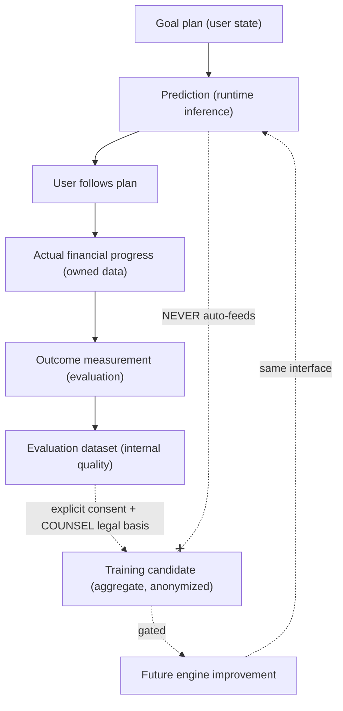
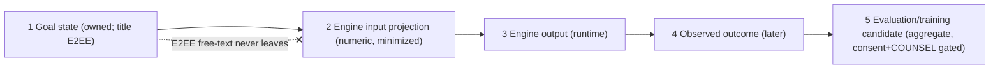
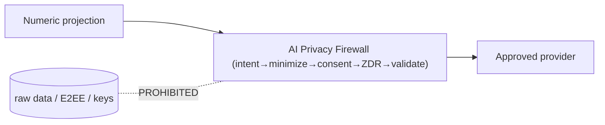

# FinMate — Goal Engine Architecture & Contract

**Nature:** design / contract documentation only. Authorises **no** code, schema, migration, API, ML model, training pipeline, package, external-AI provider, production, or user-data-collection change. No frozen decision (SRS / architecture / ADR) is altered.

**Governing (frozen) sources:** SRS v1.0 · Product Principles & Differentiators · UX & User-Journey Spec · Module & Data Ownership Map (#15) · API & Data Contracts (#16) · AI Data-Access & Privacy Firewall · IP/AI Confidentiality Policy · Threat Model · Implementation Roadmap · Pre-Implementation Execution Plan · ADRs (esp. ADR-008 INTELLIGENCE=signals-not-raw, ADR-009/010 AI firewall, ADR-020 Personalized→V2, ADR-024 Zone-2, ADR-011 external-AI consent, ADR-003 Class-A/B).

**Labels used throughout:** **CURRENT** (in repo today) · **V1** (deterministic, near-term) · **V2** (personalized/model-informed, later) · **FUTURE** (population-learning / portfolio) · **UNKNOWN / [DECISION]** (needs PRODUCT / ENGINEERING / COUNSEL).

**Companion:** [GOAL_ENGINE_CONTRACT_INDEX.md](GOAL_ENGINE_CONTRACT_INDEX.md).

> **The one rule that makes this document worth writing:** the Goal module depends on a **stable Goal Engine interface**, never on a specific algorithm, model, or provider. The engine behind the interface can be replaced (deterministic → population-informed) **without changing the Goal module, the API, or the frontend.**

---

# 1. FinMate Goal Engine in 5 Minutes

### Simple explanation

You tell FinMate a money goal ("save ₹200,000 for a trip by next June"). A small "goal helper" looks **only at numbers you already own** — how much you've saved, how fast you're adding to it — and gives you a **plain, honest** answer: _"At your current pace you'd reach it around August — about two months late. Adding ₹5,000/month would get you there on time."_ It **explains itself**, never shames you, never promises certainty, and never gives investment advice. Later, a smarter version could learn from **anonymous, aggregated** patterns across many users — but that's a separate, consented, legally-reviewed step, and it plugs into the **same doorway** so nothing else has to change.

### Technical explanation

The Goal Engine is a **replaceable component behind a stable contract**. The GOALS domain builds a **minimized numeric projection** (never free-text, keys, or raw rows), hands it to a `GoalEngine` implementation, and gets back a structured result (projection + confidence + explanation + provenance + failure state). **V1** is a deterministic, explainable projector. **V2/FUTURE** implementations (model-informed, population-informed) satisfy the identical interface and remain bound by the **AI Privacy Firewall**, the **Class-A/Class-B** boundaries, **INTELLIGENCE = signals-not-raw**, and the **IP policy**. **Runtime inference, evaluation, and training are three separate things** — runtime user data is **never** silently turned into training data.

---

# 2. Product Intent (CURRENT scope framing)

FinMate should eventually let a user: define a goal (target/date/priority where supported); understand whether it's achievable at the current pace; explore what-if scenarios; receive **explainable** suggestions; track actual progress; and improve the plan as new financial data arrives. Longer term, predictions may be informed by **aggregated historical outcomes** — which is exactly why the engine must be **replaceable behind an interface**, not designed around one model. _(This section restates intent; it decides nothing.)_

---

# 3. Current Goal Capability (CURRENT — repository-verified)

| Item                                | State                                     | Evidence                                                                                                                                                                                                                                                                    |
| ----------------------------------- | ----------------------------------------- | --------------------------------------------------------------------------------------------------------------------------------------------------------------------------------------------------------------------------------------------------------------------------- |
| `goals` table / `Goal` entity       | **CURRENT (PLACEHOLDER)**                 | `shared/data-models/src/lib/goal.entity.ts` — `ownerUser` (FK, NOT NULL), `title varchar(160)` **plaintext**, `targetAmount`/`savedAmount` decimal(12,2), `currency` char(3), `targetDate` date?, `status` (active/achieved/paused/cancelled), `@VersionColumn`, timestamps |
| Goals controller / service / module | **ABSENT**                                | no `GoalsService`/`GoalsController`/module in `backend/src` (verified)                                                                                                                                                                                                      |
| Frontend                            | **PLACEHOLDER**                           | `features/dashboard/components/dashboard-goals` (no goals API)                                                                                                                                                                                                              |
| Goal Engine                         | **does not exist**                        | —                                                                                                                                                                                                                                                                           |
| `title` protection                  | plaintext today → **B-1: born-E2EE (V1)** | needs `varchar(160)`→`text` widening (BATCH-11)                                                                                                                                                                                                                             |

**So:** there is **no** write path, no API, no engine today. This document designs the **contract**; the engine itself is future work (roadmap **BATCH-11**, gated on the E2EE key model / BATCH-07 and the finance parity harness / BATCH-05).

---

# 4. V1 Deterministic Engine (V1)

### Simple explanation

V1 does honest arithmetic on your own numbers. No AI, no guessing about you personally.

### Technical explanation

**Inputs V1 may use:** goal target amount, target date, current saved amount, contribution history **where authorized** (observed monthly rate / count / consistency, as numeric signals), recurring-contribution patterns **where available**, and **user-defined assumptions** (e.g. "I'll add ₹5,000/month"). Only **Zone-2 numeric/enum** data — **never** the E2EE goal title/free-text.

**Core V1 computations (deterministic):**

- `projectedCompletionDate` = date at which `savedAmount + rate × months ≥ targetAmount`.
- `onTrack` = `projectedCompletionDate ≤ targetDate` (when a target date exists).
- `requiredMonthlyContribution` = `(targetAmount − savedAmount) / monthsUntilTargetDate`.
- `projectedShortfall` at `targetDate` when the pace is insufficient.

**Explainability (mandatory):** every result carries the inputs used, the assumptions applied, the method (`deterministic`), and the engine version. Example phrasing:

> _"At your current contribution rate (~₹4,000/month over the last 5 months), the projected completion date is around **August 2027** — about 2 months after your target. Adding ~₹1,300/month would reach it by your target date."_

**Language rules (frozen product principles / UX):** plain and **explainable**; **no shame/guilt** ("AI predicts you will fail" is forbidden); **no financial-advice claims**; **no accuracy promises**; suggestions are optional and reversible; degrade gracefully when data is thin (§21).

---

# 5. Goal Engine Boundary (the stable contract)

### Simple explanation

One doorway between the Goal feature and whatever brain is behind it.

### Technical explanation

```
Goal Module (GOALS domain)
      ↓  builds minimized projection (numbers only)
Goal Engine Contract  ── GoalEngine interface (stable) ──►
      ↓
Goal Engine Implementation  (V1 deterministic | V2 model-informed | FUTURE population-informed)
      ↓  returns structured result (projection + confidence + explanation + provenance + failure)
Goal Module → API → Frontend
```

**The Goal module MUST NOT depend on:** a particular ML framework, a specific model, OpenAI or any external AI provider, training infrastructure, or a specific algorithm. It depends **only** on the interface below.

**Design sketch (illustrative TypeScript — NOT implemented):**

```ts
type EngineKind = 'deterministic' | 'model' | 'population';

interface GoalEngine {
  readonly name: string; // e.g. 'deterministic-v1'
  readonly version: string; // semver of THIS engine implementation
  readonly kind: EngineKind;
  readonly contractVersion: string; // version of the input/output schema it speaks

  project(input: GoalProjectionInput): Promise<GoalProjectionResult>;
  capabilities(): EngineCapabilities;
}

interface EngineCapabilities {
  supportedGoalTypes: string[]; // V1: ['savings']
  supportsScenarios: boolean;
  minContributionMonths: number; // [ENGINEERING PARAMETER]
  usesPopulationData: boolean; // V1: false
}
```

`kind` lets the UI truthfully say whether a result is **deterministic** or **model-based** (explainability §10).

---

# 6. Input Contract (`GoalProjectionInput`)

### Simple explanation

The engine gets a tidy packet of **numbers you own** — never your locked words, keys, or database.

### Technical explanation (design sketch — NOT implemented)

```ts
interface GoalProjectionInput {
  requestId: string;
  generatedAt: string; // ISO
  contractVersion: string;

  goal: {
    id: string; // opaque goal id (not a raw FK chain)
    currency: string; // ISO-4217
    targetAmount: number; // Zone-2
    savedAmount: number; // Zone-2
    targetDate?: string; // date
    status: 'active' | 'achieved' | 'paused' | 'cancelled';
    priority?: number; // V1 priority ordering (UX)
    // NOTE: NO title / free-text — the title is E2EE (Class A) and never leaves as plaintext.
  };

  contribution?: {
    // derived numeric signals only
    observedMonthlyRate?: number;
    observedCount?: number;
    windowMonths?: number;
    consistency?: number; // 0..1 (variance-derived)
  };

  assumptions?: {
    // explicit, user-defined
    userMonthlyContribution?: number;
    contributionStartDate?: string;
  };

  scenario?: ScenarioInput; // optional what-if (§8)

  consentScope: string; // which processing the user permitted (CON-3)
  engineVersionRequested?: string; // pin an engine version (optional)

  // FUTURE optional extension points (absent in V1) — the engine ignores unknown fields:
  portfolio?: PortfolioProjection; // §15 (numeric asset value only)
  populationContext?: never; // NEVER supplied by the module; the engine derives its own
}
```

**Invariants:** numeric/enum only; **no E2EE free-text, journal, contacts, auth data, encryption keys, raw dumps, or unnecessary PII**; built by the GOALS domain via a **FINANCE projection-pull contract** (ownership map: GOALS reads FINANCE via contract, not raw tables).

---

# 7. Output Contract (`GoalProjectionResult`)

### Technical explanation (design sketch — NOT implemented)

```ts
type EngineStatus = 'ok' | 'insufficient_data' | 'insufficient_history' | 'invalid_goal' | 'unsupported_goal_type' | 'stale_input' | 'engine_unavailable' | 'low_confidence';

interface GoalProjectionResult {
  requestId: string;
  generatedAt: string;
  engine: { name: string; version: string; kind: EngineKind; contractVersion: string };
  status: EngineStatus;

  projection?: {
    projectedCompletionDate?: string;
    onTrack?: boolean;
    requiredMonthlyContribution?: number;
    projectedShortfall?: number; // at targetDate, if any
  };

  confidence?: {
    // NOT a guarantee/probability claim in V1
    score: number; // 0..1
    band: 'low' | 'medium' | 'high';
    basis: 'data_sufficiency' | 'calibrated_model';
    calibrationVersion?: string; // model engines only
  };

  explanation: {
    summary: string; // plain, no shame, no advice claim
    method: 'deterministic' | 'model';
    inputsUsed: string[]; // e.g. ['savedAmount','observedMonthlyRate','targetDate']
    assumptionsUsed: string[];
    disclaimers: string[]; // "estimate, not a guarantee"
  };

  provenance: {
    sourceDomain: 'GOALS' | 'FINANCE';
    signalIds: string[]; // opaque signal references, no raw FKs (ISO-2)
    consentScope: string;
  };

  scenarios?: ScenarioResult[]; // §8

  evaluationMeta?: {
    // for FUTURE outcome measurement — NOT training
    predictionId: string;
    horizonDate?: string; // when this prediction becomes checkable
  };
}
```

**Response minimization:** the API exposes only presentation-safe fields; internal model parameters/algorithms are **never** returned (IP policy §18).

---

# 8. Scenario Contract (`ScenarioInput` / `ScenarioResult`)

### Simple explanation

"What if I add ₹3,000 more a month?" — the engine answers without changing your real goal.

### Technical explanation (design sketch — NOT implemented)

```ts
interface ScenarioInput {
  id: string;
  label?: string;
  overrides: {
    monthlyContribution?: number;
    targetAmount?: number;
    targetDate?: string;
    lumpSum?: { amount: number; onDate: string };
  };
}
interface ScenarioResult {
  id: string;
  projection: GoalProjectionResult['projection'];
  explanation: string; // "Adding ₹3,000/month → on track by <date>"
}
```

V1 recomputes scenarios **deterministically** from the same arithmetic. Scenarios are **read-only what-ifs** — they never mutate goal state or financial records.

---

# 9. Confidence / Uncertainty

- **V1 (deterministic):** confidence reflects **data sufficiency**, not a probabilistic claim — e.g. `high` with ≥ N months of consistent contributions, `low` when extrapolating from sparse history. It never asserts "you will/won't succeed."
- **V2/FUTURE (model):** `calibrated_model` confidence with a `calibrationVersion`; must be **calibrated** and evaluated (§13/§EVALUATION).
- Bands `low|medium|high` are UI-facing; the exact score→band cutoffs are **[ENGINEERING PARAMETER]**.

---

# 10. Explainability

Every result carries enough structured metadata to explain **what inputs influenced it, what assumptions were used, the engine/model version, confidence/uncertainty, when it was generated, and whether it is deterministic or model-based** (`explanation.method` + `engine.kind`). **Never** exposed: internal model weights, proprietary algorithms, training details, or provider internals (IP policy). Explanations use plain, non-shaming language (UX/product principles).

---

# 11. Runtime Inference

### Simple explanation

Answering your question right now, from your own numbers.

### Technical explanation

Runtime = a single `project(input)` call producing a `GoalProjectionResult` for immediate display. It is **stateless with respect to training** and reads only the minimized projection. A runtime call **does not** create a training record. If a runtime path ever needs an **external** provider (V2+), it passes the **AI Privacy Firewall** (numeric/enum projection, consent, ZDR) — never raw data (§17).

---

# 12. Future Population-Learning Architecture (FUTURE — boundary only)

### Simple explanation

A future engine could get better by learning from **anonymous, aggregate** patterns across many users. We build the **doorway** for that now; we do **not** decide the room behind it.

### Technical explanation

The `GoalEngine` interface is designed so a `PopulationInformedGoalEngine` can eventually consume **anonymized/approved aggregate** patterns such as: contribution frequency, contribution consistency, goal duration, target size, progress velocity, goal-completion outcomes, scenario outcomes. It satisfies the **same** `project()` contract and returns the **same** result shape (with `kind:'population'` and calibrated confidence).

**This task does NOT decide — each remains an explicit open decision:**
| Item | Owner |
|---|---|
| Exact training dataset composition | [PRODUCT / ENGINEERING] |
| Legal basis for any training use of user data | **[COUNSEL]** |
| Retention period of training/evaluation data | [ENGINEERING / COUNSEL] |
| Whether user data may be used for training at all | **[PRODUCT + COUNSEL + explicit consent]** |
| Differential-privacy implementation | [ENGINEERING] |
| Federated learning vs central aggregation | [ENGINEERING] |
| Model provider (internal/external) | [PRODUCT / VEN-1 review] |
| Investment-recommendation policy | **[PRODUCT DECISION REQUIRED]** (existing) |

**Invariant:** a population engine is still bound by the AI firewall, Class-A/B boundaries, and ISO-2 (INTELLIGENCE holds signals + provenance, never raw FKs/keys). It is **not** a backdoor around any privacy boundary (§16/§17).

---

# 13. Evaluation / Training Separation (design, not implementation)

### Simple explanation

Three different jobs, never mixed up: **answer now** (inference), **check later if the answer was right** (evaluation), **make a better brain from many checks** (training).

### Technical explanation

| Concept                | What it is                                                  | Data                                          | Consent/legal                                |
| ---------------------- | ----------------------------------------------------------- | --------------------------------------------- | -------------------------------------------- |
| **Runtime inference**  | one prediction for display                                  | minimized projection                          | first-party display (CON-2)                  |
| **Evaluation**         | compare a stored prediction to the **actual** later outcome | `evaluationMeta` + observed outcome (numeric) | first-party, internal quality                |
| **Training candidate** | anonymized aggregate derived from many outcomes             | aggregate signals only                        | **explicit consent + [COUNSEL] legal basis** |

**Hard rule:** the system **never silently turns runtime user data into training data.** Creating a training candidate is a distinct, consented, gated step — not a side effect of inference or evaluation.

---

# 14. Outcome Feedback Loop (FUTURE — designed, not built)



_Simple:_ the loop can make the helper smarter over time, but the jump from "measuring outcomes" to "training a model" is a **gated, consented** step, never automatic. _Technical:_ runtime→evaluation is internal quality; evaluation→training requires consent + legal basis (§12/§13).

---

# 15. Future Portfolio / Asset Integration (FUTURE — boundary only)

### Simple explanation

Later you might track assets/holdings; the goal helper could count their value toward a goal — but it will **never** tell you what to buy.

### Technical explanation

A future **Portfolio/Asset module** connects to the Goal Engine as **another numeric projection source** — e.g. an optional `portfolio?: PortfolioProjection` input field (asset value / contribution numbers only) or a registered projection provider — **without the Goal module knowing the implementation**. The engine may **project goal progress** including a portfolio's numeric value, but:

- **No portfolio/investment functionality is implemented in this task.**
- **Investment-specific recommendations remain OUT of V1/V2** and remain **[PRODUCT DECISION REQUIRED]** (existing policy; AI firewall marks investment projections `[ENG-UNKNOWN]`).

```ts
interface PortfolioProjection {
  totalValue: number;
  currency: string;
  expectedMonthlyContribution?: number;
} // FUTURE, numeric only
```

---

# 16. Privacy / Data Minimization

The engine receives a **minimized projection**, not database access. **Never** given to any engine (V1 or future): E2EE free-text (goal title, journal), contacts, authentication data, encryption keys, raw database dumps, or unnecessary PII (aligns with the frozen AI firewall data table and ownership map). The GOALS domain builds the projection via a **FINANCE projection-pull contract** (ISO-3), and any derived personalization is stored in **INTELLIGENCE as signals + provenance, never raw FKs/keys** (ISO-2 / ADR-008).

---

# 17. AI Firewall Compatibility

| Data                   | Rule (frozen firewall §4)                                      | Goal Engine handling                                   |
| ---------------------- | -------------------------------------------------------------- | ------------------------------------------------------ |
| Goal free-text (title) | **DENY** (internal & external AI)                              | never sent; E2EE Class-A, server never holds plaintext |
| Goal progress numbers  | **CONDITIONAL** (external-AI consent, numeric projection, ZDR) | only via minimized numeric projection + consent        |
| Investment info        | DENY raw; projection **[ENG-UNKNOWN]**                         | out of scope; no recommendations                       |

**V1 is internal & deterministic → no external AI, no firewall egress.** Any V2/FUTURE step that touches an **external** model routes through the **single AI egress firewall** (AI-1): intent → numeric/enum projection → consent → ZDR provider → validated response. The engine is **never** a side-door around the firewall.

---

# 18. IP / Confidentiality Boundary

- Engine **algorithms, models, thresholds, and population aggregates are FinMate-confidential** (IP-1/IP-2). They are **not** exposed in API responses, to external providers, or in explanations (only user-facing rationale is surfaced).
- No external AI provider receives credentials, keys, dumps, proprietary algorithms, or unnecessary user data (VEN-1). A future model provider is a **[VEN-1 review]**.

---

# 19. Security / Threat Considerations

| Threat                                                 | Mitigation in this design                                                    |
| ------------------------------------------------------ | ---------------------------------------------------------------------------- |
| Engine as a privacy backdoor                           | minimized projection only; no raw/E2EE/keys; firewall for any external step  |
| Cross-domain raw access                                | GOALS↔FINANCE via projection-pull contract; INTELLIGENCE no raw FK (ISO-2)  |
| Silent training on user data                           | inference/evaluation/training separated; training gated by consent + COUNSEL |
| Prompt injection / model exfil (future external model) | firewall numeric-only projection; response validation (AI-3)                 |
| IDOR / cross-user                                      | engine input is per-user projection; results scoped to owner                 |
| Fabricated predictions                                 | explicit failure states; graceful degradation (§21)                          |
| Shame/dark-pattern language                            | product principle: plain, non-shaming, optional, reversible                  |

---

# 20. Versioning / Model Replacement

- **Contract version** (`contractVersion`): the input/output schema version — additive, backward-compatible; consumers tolerate unknown fields.
- **Engine version** (`engine.version` + `kind`): the specific implementation; swapping deterministic→model→population bumps this **without** changing the contract.
- **Selection:** a `GoalEngine` provider (analogous to BATCH-12's provider pattern) resolves which engine handles a request; `engineVersionRequested` can pin a version for reproducibility/evaluation.
- Results are **self-describing** (engine name/version/kind/contractVersion) so stored predictions remain interpretable across upgrades.

---

# 21. Failure States (graceful degradation)

The engine returns an explicit `status` rather than fabricating a prediction:
| Status | Meaning | UX |
|---|---|---|
| `insufficient_data` | not enough inputs to project | "Add a target/date or a few contributions to see a projection." |
| `insufficient_history` | too little contribution history for a rate | show target vs saved only |
| `invalid_goal` | inconsistent inputs (e.g. target ≤ saved with future date) | ask to review the goal |
| `unsupported_goal_type` | goal type not handled by this engine | show basic tracking |
| `stale_input` | projection older than a freshness bound | prompt to refresh |
| `engine_unavailable` | engine down / not configured | fall back to plain tracking |
| `low_confidence` | result exists but weakly supported | show with a clear caveat |
**Rule:** degrade gracefully; never invent a number or imply certainty.

---

# 22. Testing Strategy (for the eventual implementation — not now)

- **Deterministic parity (V1):** golden fixtures — same inputs ⇒ same projection (mirrors the finance parity gate ethos); date/rate math exact.
- **Explainability:** every `ok` result has non-empty `inputsUsed` + `assumptionsUsed` + a non-shaming summary (assert forbidden phrases absent).
- **Failure states:** each status reachable and correct; no fabricated projection on insufficient data.
- **Privacy:** input builder emits **no** free-text/keys/PII; result exposes no model internals; assert projection is numeric-only.
- **Scenario:** what-ifs are read-only (no goal/finance mutation); deterministic.
- **Contract stability:** consumers tolerate added fields; engine swap doesn't break the API shape.
- **(Future) evaluation/calibration:** predicted vs actual; calibration; drift — thresholds `[ENGINEERING PARAMETER]`.

---

# 23. Open Questions — PRODUCT / ENGINEERING / COUNSEL

| #     | Question                                                                             | Type                                     |
| ----- | ------------------------------------------------------------------------------------ | ---------------------------------------- |
| GE-1  | Whether user data may ever be used for training                                      | **PRODUCT + COUNSEL + consent**          |
| GE-2  | Training dataset composition / retention                                             | ENGINEERING / COUNSEL                    |
| GE-3  | Legal basis for population learning                                                  | **COUNSEL**                              |
| GE-4  | Differential privacy / federated vs central                                          | ENGINEERING                              |
| GE-5  | Model provider (internal/external)                                                   | PRODUCT / VEN-1                          |
| GE-6  | Investment-recommendation policy                                                     | **PRODUCT DECISION REQUIRED** (existing) |
| GE-7  | Confidence score→band cutoffs; min-data (`minContributionMonths`); freshness bound   | ENGINEERING PARAMETER                    |
| GE-8  | Supported goal types beyond `savings` (V1)                                           | PRODUCT                                  |
| GE-9  | Goal priority ordering semantics                                                     | PRODUCT / UX (V1)                        |
| GE-10 | Accuracy/calibration/drift thresholds                                                | ENGINEERING PARAMETER                    |
| GE-11 | Where evaluation/prediction records live (INTELLIGENCE Class-B?) and their retention | ENGINEERING / COUNSEL                    |

**None are decided here.**

---

# 24. Architecture Diagrams

**GE-01 — Engine boundary (replaceable).**

```mermaid
flowchart TB
  Goal["GOALS module"] -->|GoalProjectionInput (numbers only)| Iface["GoalEngine contract"]
  Iface --> V1["DeterministicGoalEngine (V1)"]
  Iface -. same interface .-> V2["ModelInformedGoalEngine (V2)"]
  Iface -. same interface .-> Pop["PopulationInformedGoalEngine (FUTURE)"]
  V1 -->|GoalProjectionResult| Goal
  Fin[("FINANCE (Zone-2)")] -.projection-pull contract.-> Goal
  Ext["External model (FUTURE)"] -.only via AI firewall.- V2
  Keys[("E2EE title / keys / raw rows")] -. NEVER .- Iface
```

**GE-02 — Data separation (5 concepts).**



**GE-03 — External-step firewall (V2+).**



**GE-04 — Learning loop separation.** See §14 diagram.

---

# 25. Reconciliation with Frozen Documents

- **No frozen decision changed.** Restates, does not alter: AI firewall (goals free-text DENY / progress numeric CONDITIONAL), Class-A/B (ADR-003), INTELLIGENCE=signals-not-raw (ADR-008/ISO-2), external-AI consent (ADR-011), Zone-2 (ADR-024), Personalized→V2 (ADR-020), ownership map (GOALS reads FINANCE via contract), IP policy (VEN-1/IP-1/2), threat model, SRS (goals-v2 B-1 born-E2EE, priority ordering; FUT-005 detection ranked).
- **CURRENT reality consistent with docs:** goals = PLACEHOLDER (entity only; title plaintext today → B-1 born-E2EE target). No contradiction found.
- **Nothing invented:** every future capability marked V1/V2/FUTURE/UNKNOWN; every population-learning / investment / legal item left as an explicit [PRODUCT/ENGINEERING/COUNSEL] decision.
- **No STOP-and-report contradiction triggered.**

---

# Final Report

- **Files created:** `docs/architecture/FINMATE_GOAL_ENGINE_ARCHITECTURE.md`, `docs/architecture/GOAL_ENGINE_CONTRACT_INDEX.md`. **Files modified:** `FinMate_Project_Specification.md` (progress log).
- **Repository inspected:** `goal.entity.ts` (fields), absence of goals controller/service/module, `dashboard-goals` frontend placeholder, AI firewall goal rows.
- **Current Goal reality:** PLACEHOLDER — `goals` table/entity only, no service/API/engine; `title` plaintext (B-1 target = born-E2EE).
- **Engine boundary proposed:** stable `GoalEngine` interface (`project()` + `capabilities()`); Goal module depends only on it; engine replaceable (deterministic → model → population) without API/FE change; results self-describing (name/version/kind/contractVersion).
- **V1 vs future separation:** V1 = deterministic, explainable, numeric-only, no AI/no external. V2/FUTURE = model/population-informed behind the same interface, firewall-bound.
- **Population-learning boundary:** interface accepts future aggregate inputs; dataset/legal-basis/retention/DP/federated/provider **not decided** (GE-1..GE-5).
- **Portfolio integration boundary:** future Portfolio/Asset module plugs in as a numeric projection source; **no investment recommendations** (GE-6, PRODUCT DECISION REQUIRED).
- **Open decisions:** GE-1..GE-11 (PRODUCT/ENGINEERING/COUNSEL/PARAMETER) — enumerated, none resolved.
- **Security/privacy implications:** minimized projection only; no E2EE/keys/PII to any engine; firewall for external steps; INTELLIGENCE no raw FK; inference≠evaluation≠training; no silent training on runtime data.
- **Contradictions:** **none** found between the repository and frozen docs.
- **Confirmation:** **NO code, schema, database, migration, API, ML model, training pipeline, package, external-AI provider, production, or user-data-collection change was made.** Documentation/contract design only.

_End of Goal Engine Architecture & Contract. STOP — the engine is not implemented; no batch started._
