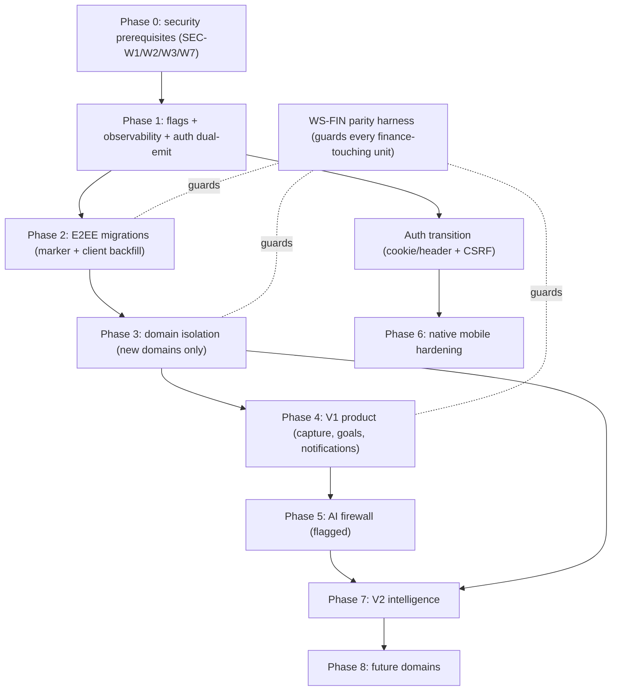
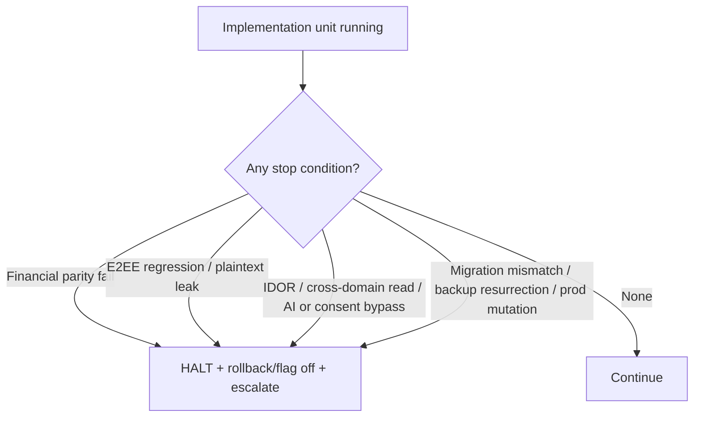
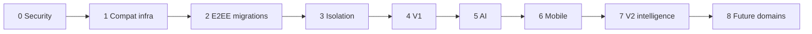
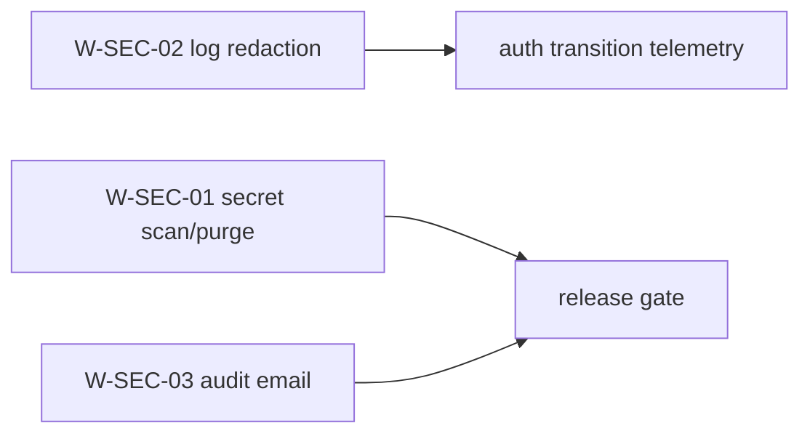
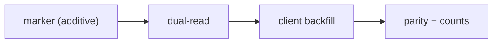
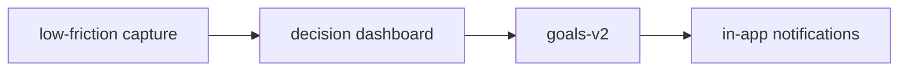
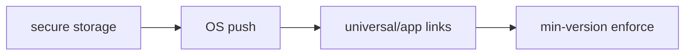
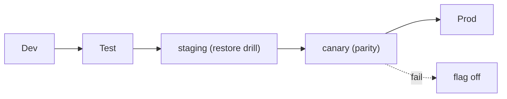

# FinMate — Implementation Roadmap & Work Breakdown (Document #18)

**Nature:** roadmap / documentation only. Authorises **no** source, entity, controller, service, database, migration, API, encryption, package, production, or deployment change, and **no** implementation tickets. **This is the bridge between the frozen SRS/architecture and future implementation work — it does not perform the work.**

**Governing (frozen) sources:** Decision Ledger · Data Classification Matrix · Security & Privacy Architecture · Key Management · AI Firewall · IP/AI Policy · Threat Model · Processing Register · Competitive Lessons · Product Principles · Current System Baseline · UX Spec · **SRS v1.0** · SRS Adversarial Review · all ADRs · **Ownership Map (#15)** · **API & Data Contracts (#16)** · **Migration Plan (#17)** · **SEC-KI1 Verification**.

**Critical rule (never violated):** **SECURITY/LEGAL > EXISTING CRITICAL FUNCTIONALITY > BACKWARD COMPATIBILITY > NEW ARCHITECTURE > CONVENIENCE.** *"Secure the existing product without unnecessarily breaking the product."* **No clean-slate rewrite. Working modules are not rewritten because the target looks cleaner** (GOV-1/2, ADR-001).

**Labels:** CURRENT · TRANSITION · TARGET · [ENGINEERING PARAMETER] · [PRODUCT DECISION REQUIRED] · [COUNSEL] · [ENG-UNKNOWN] · [OWNER TO ASSIGN] · [PROPOSED FLAG].

**Companion:** [IMPLEMENTATION_ROADMAP_INDEX.md](IMPLEMENTATION_ROADMAP_INDEX.md).

> **SEC-KI1 is MITIGATED/VERIFIED; M-KEYVER is COMPLETE / VERIFY-ONLY — no migration, no historical re-encryption.** It appears in this roadmap **only** as a verified prerequisite already met (§21), never as active work. GRP-007, GRP-005, legacy NULL-`versionId`, and REVOKED semantics are **separate** items and must not become a group-key rewrite.

---

# 1. FinMate Implementation in 5 Minutes

### Simple explanation
**What are we building?** We are making an app that already works safer and a bit smarter — adding locks to a few pieces of text, giving new features their own private rooms, and adding a careful "one door" for the AI — **without breaking anyone's money records or logging anyone out.**

**What must never break?** Your balances, who-owes-whom, splitting, refunds, groups, People/P2P, logging in, and the words already locked with your key. These are the "protected baseline."

**What happens first?** **Safety basics** — stop leaking secrets into logs, protect the "keep me logged in" token, clean up old files. Boring but foundational.

**Why security before features?** Because a shiny new feature built on a leaky foundation just leaks faster. We fix the floor before adding furniture.

**Why stage migrations?** Because millions of existing records can't all change at once. We add the new way, run old and new side by side, convert gently on your own device, check every balance still matches, and only much later retire the old way.

### Technical explanation
The roadmap is **dependency- and risk-ordered**, not feature-popularity-ordered. Phase 0 lands P0/P1 security prerequisites (SEC-W1/W2/W3/W6c/W7/OPS-1) and log-hygiene needed by later telemetry. Phase 1 builds compatibility infrastructure (auth dual-transport scaffolding, feature-flag + observability plumbing). Phase 2 executes additive, mixed-state, client-backfilled E2EE migrations (P2P/settlement/group-desc). Phase 3 stands up domain-isolation foundations for **new** domains only (CORE/FINANCE stay in `public`). Phases 4–8 add V1 product, the bounded AI firewall, native mobile hardening, V2 intelligence, and future domains. **Every finance-touching change passes the golden-fixture parity suite (FIN-002/ADR-017): same input ⇒ same financial result.**

---

# 2. Current → Target Master Roadmap

### Simple explanation
One big table: each stream of work, where it is now, where it's going, why, what it needs first, and how risky it is.

### Technical explanation

| ID | Workstream | Current state | Target state | Why | Dependencies | Risk | Compat | Priority | Status |
|---|---|---|---|---|---|---|---|---|---|
| WS-SEC | Security foundation | SEC-W1/W2/W3/W6c/W7/W5/W9/OPS-1 **OPEN**; SEC-KI1 **VERIFIED** | logs redacted, secrets scanned, refresh hardened, least-privilege | P0/P1 threats (T-02/T-29…) | — | Med | additive | **P0** | TARGET |
| WS-PLAT | Platform/infra (flags, observability) | ad-hoc | flag framework + migration dashboards | enables safe staged rollout | WS-SEC (log hygiene) | Low | additive | **P0/P1** | TARGET |
| WS-AUTH | Auth transport | refresh in body | cookie(web)/header(native)+CSRF, dual-emit | XSS token theft (T-02/SEC-W3) | WS-SEC (W2) | Med | dual-emit sunset | **P1** | TRANSITION |
| WS-ENC | E2EE data migrations | P2P/settlement/group-desc notes plaintext | E2EE + marker, client backfill | server plaintext exposure | WS-PLAT (flags), recovery (REC-1) | Med | permanent mixed-state | **P1** | TRANSITION |
| WS-ISO | DB domain isolation | single `public` schema | per-domain schemas + real principals (**new domains only**) | isolation absent (T-09/ISO-1) | WS-PLAT | Med | CORE/FINANCE untouched | **P2** | TARGET |
| WS-FIN | Finance core protection | full, working | unchanged core + parity harness + low-friction capture | protected baseline (FIN-002) | golden fixtures (ADR-017) | **High if mishandled** | must stay identical | **P1 (guard)** | CURRENT |
| WS-GOAL | Goals | PLACEHOLDER (empty table) | goals-v2 born-E2EE + priority | V1 product (B-1/FUT-001) | WS-ENC (key model), WS-ISO (optional) | Low | additive | **P2** | TARGET |
| WS-NOT | Notifications | none | in-app ranked V1 (push deferred) | V1 product (NOT-1/ADR-021) | WS-PLAT | Low | additive | **P3** | TARGET |
| WS-AI | AI firewall | thin `/ai/proxy` | intent→projection→consent→provider→validate | AI over-exposure (T-08/T-13) | WS-SEC, consent ledger | Med | flag; proxy retained | **P3** | TRANSITION |
| WS-INT | Intelligence | none | signals + provenance, no raw FK | V2 personalization (INT-1..5) | WS-AI, WS-ISO, consent | Med | additive | **P4 (V2)** | TARGET |
| WS-MOB | Native mobile hardening | Capacitor wrap, body token | secure storage/push/deep-links/offline | native security (AU-1) | WS-AUTH | Med | old apps keep working | **P3** | TARGET |
| WS-DOM | Future domains (PRIVATE/WELLBEING/WARDROBE/OPPORTUNITIES) | none | isolated schemas + keys | V2+ scope | WS-ISO, WS-AI, DPIA (wellbeing) | Low–High | additive | **P4+** | TARGET |

---

# 3. Priority Order (dependency- and risk-based)

### Simple explanation
Do the floor before the furniture; do the plumbing before the smart lights.

### Technical explanation — validated against SRS/ADRs/Migration Plan #17 §20.

| Phase | Theme | Contents | Why here |
|---|---|---|---|
| **0** | Production safety / security prerequisites | SEC-W1/W2/W3 groundwork, W7, log redaction | P0; other telemetry must not leak (W2) before auth work |
| **1** | Compatibility infrastructure | feature-flag framework, observability, auth dual-emit scaffolding | everything staged behind flags + metrics |
| **2** | Encryption / data migrations | M-NOTE-P2P, M-NOTE-SET, M-DESC-GRP; M-ATTACH; M-INVEMAIL | additive, mixed-state, client backfill |
| **3** | Domain-isolation foundations | new-domain schemas + DB principals (greenfield) | prerequisite for any new domain write |
| **4** | V1 product improvements | low-friction capture, decision dashboard, goals-v2, in-app notifications | product value on a safe base |
| **5** | AI firewall / bounded AI | projection firewall, consent, ZDR, assistant_qa | replaces proxy behind flag |
| **6** | Native mobile hardening | secure storage, push, deep links, min-version | after auth transport lands |
| **7** | V2 intelligence / personalization | signals + provenance, three-state controls | after AI + isolation |
| **8** | Future domains | PRIVATE/WELLBEING/WARDROBE/OPPORTUNITIES | last; some gated on DPIA |

**Order deviation note:** this matches Migration Plan #17 §20. The **one hard sequencing rule**: log redaction (SEC-W2) **before** auth transition telemetry, and DB principals **before** any new-domain data write. SEC-KI1 is **already done** and is not sequenced.

---

# 4. Phase 0 — Existing Security Risks (repository-truthful)

### Simple explanation
The known leaks and weak spots. We fix these first. We only mark something "done" if the code proves it.

### Technical explanation — **none of these is claimed fixed** (repository shows no remediation) **except SEC-KI1** (verified 2026-07-17).

| ID | Current | Threat | Required control | Dependencies | Verification | Rollback | Status |
|---|---|---|---|---|---|---|---|
| SEC-W1 | 4 encrypted-image blobs in git history; no secret scanning | secret exposure | secret scan + history purge + rotate | none | scanner clean; history rewritten | n/a (history op) | **OPEN** |
| SEC-W2 | tokens/email/IP in request+proxy logs (query strings) | log leakage (T-29) | redact query params; hash/drop IP; allowlist logging | none | log samples show no tokens/PII | revert redaction | **OPEN** |
| SEC-W3 | refresh token in body/localStorage | XSS token theft (T-02) | move to cookie/secure-storage (see WS-AUTH) | SEC-W2 | token absent from JS-readable storage | dual-emit body | **OPEN** |
| SEC-W6c | `attachment.originalName` plaintext duplicates encrypted name | filename content leak | stop populating plaintext for new; drop before GA | attachments GA | new rows have no plaintext name | re-enable plaintext | **OPEN** |
| SEC-W7 | `audit_logs.metadataJson` stores plaintext email on login | PII in audit | minimize PII in audit metadata | none | no email in new audit rows | revert | **OPEN** |
| SEC-W5 | Swagger open; CSP `unsafe-inline`; SW may cache finance | XSS/cache exposure (T-21) | gate Swagger in prod; harden CSP; exclude sensitive endpoints from SW | none | Swagger gated; CSP blocks inline | revert config | **OPEN** |
| SEC-W9 | `trust proxy=true` unconditional | spoofable XFF | condition on known proxy | none | XFF trusted only behind proxy | revert | **OPEN** |
| OPS-1 | DBA/backend can read Zone-2 finance plaintext | insider read | least-privilege creds + audit (residual) | WS-ISO | access audited; roles least-priv | revert grants | **OPEN (residual)** |
| **SEC-KI1** | group-key `versionId` **honored** | ~~rotated-history undecryptable~~ | **already implemented (2026-07-17)** | — | unit-tested; verified | n/a | **MITIGATED/VERIFIED — NOT an active item (§21)** |

---

# 5. Authentication Transition (WS-AUTH)

### Simple explanation
Move the "keep me logged in" token out of the response and into a locked cookie (web) or the phone's vault (native). Old phones keep working until everyone updates.

### Technical explanation (AU-1/2/2a/4; ADR-013/014/015; contract §6 of #16)

| Stage | Behaviour |
|---|---|
| CURRENT | refresh token in body (SEC-W3) |
| TRANSITION | **dual-emit** — body token retained **and** cookie set (web) / header accepted (native); refresh endpoint distinguishes transport by capability; **cookie path always requires CSRF** |
| TARGET web | HttpOnly + Secure + SameSite=Lax + host-only cookie, path-scoped `/api/v1/auth/refresh`, exact CORS, CSRF double-submit |
| TARGET native | secure-storage refresh + header transport |

**Old mobile compatibility:** dual-emit until (1) a minimum-supported-version exists, (2) telemetry confirms adoption, (3) sunset condition met. **AUTH-005 sunset date = [ENGINEERING PARAMETER]** (not invented). **Rollback:** re-enable body emit (Safe). **Never break `/api/v1` for cleanliness.**

---

# 6. E2EE Migrations (WS-ENC)

### Simple explanation
Lock three text fields that are plaintext today. Old rows wear an "old plaintext" label; new rows are locked; only your device converts old ones. The server never reads or locks your text.

### Technical explanation (ADR-016; K-1/K-3; **no server-side decryption; no new crypto format**)

| Field | Current | Target | Marker | Key model | Client backfill | Mixed-state | Concurrency | Rollback |
|---|---|---|---|---|---|---|---|---|
| P2P `note` (B-2) | plaintext | E2EE `direct_shared` | `encMarker` [PROPOSED] | per-entry content key, wrapped for both users | on next key-holding session | permanent | optimistic lock (`@VersionColumn`) → 412 | Safe (plaintext reader) |
| Settlement `note` (FLD-1) | plaintext | E2EE | marker | group data key | same | permanent | same | Safe |
| Group `description` (FLD-2) | plaintext | E2EE | marker | group data key | same; **pre-join display OQ-11** must degrade | permanent | same | Safe |

**Per field:** *legacy user* → rows stay plaintext until that user returns; *new user* → born-encrypted. **Verification:** state counts, decryption-failure metric, export round-trip parity. **Failure:** marker+ciphertext write **atomic** (one transaction) — partial write leaves the row consistent. **Prerequisite:** recovery mandatory before storing E2EE (REC-1).

---

# 7. DB Domain Isolation (WS-ISO)

### Simple explanation
Give new rooms their own locks and their own keys. Don't touch the live money rooms.

### Technical explanation (ISO-1; ADR-007; Ownership #15 §6/§11)
**Before any implementation:** map actual reads/writes per domain (Ownership #15 already does this). **CURRENT:** one `public` schema, one datasource. **TARGET:** new domains (GOALS/PRIVATE/WELLBEING/WARDROBE/OPPORTUNITIES/INTELLIGENCE) get dedicated schemas **plus real, separate DB principals**; **CORE/FINANCE stay in `public`.** Cross-domain access only via contracts/projections (GOALS←FINANCE projection-pull; FINANCE→INTELLIGENCE outbox signals). **No table split for diagram symmetry. Preserve existing transactions and financial correctness (§8).** Rollback: revert grants/schemas (greenfield, Safe).

---

# 8. Financial Core Protection (WS-FIN) — protected baseline

### Simple explanation
No change is allowed to alter anyone's balance. We prove it with a fixed set of test cases run before and after every change.

### Technical explanation (FIN-002; ADR-017 golden fixtures)
**Protected areas:** expenses · payments (multi-payer) · splits (equal/fixed/percent/share) · refunds (signed-negative) · household ledger · carry-forward · spectator exclusion · multi-currency (per-currency netting, no implicit FX) · settlements (derived) · People/P2P · recurring expenses.

**Invariant:** **SAME INPUT = SAME FINANCIAL RESULT.** Every finance-touching work item (including isolation, migration, and refactor units) MUST pass the golden-fixture parity suite **before and after**. **No architecture improvement may silently change financial semantics** — parity failure = hard **STOP** (§20).

---

# 9. V1 Product Work (WS-FIN capture, WS-GOAL, WS-NOT)

### Simple explanation
Make adding an expense faster, help people decide with a clear dashboard, add goals with priorities, and quiet, ranked in-app notifications.

### Technical explanation (UX Spec; ADR-020/021; Product Principles)

| Item | Scope | Notes |
|---|---|---|
| Low-friction capture | additive to expense create | must not change calc semantics (§8) |
| Decision dashboard | aggregation (first-party display, CON-2 exempt) | reuses existing data; no new AI |
| Goals-v2 | born-E2EE free-text (B-1) + progress (Zone-2) | empty table → clean; reads FINANCE via projection contract |
| Goal priority | ordering metadata | additive |
| In-app ranked notifications | ranked L1–L5, quiet default (NOT-1) | content-free payloads |
| Helpful + Proactive | V1 posture | **Personalized = V2** (ADR-020) |

**Explicit exclusions:** **Personalized stage = V2.** **OS push = TARGET**, gated on native infra (ADR-021). **Bank aggregation = NOT V1** unless an existing product decision says otherwise (OQ-1, [PRODUCT DECISION REQUIRED]). **Do not add unrelated features.**

---

# 10. AI Workstream (WS-AI)

### Simple explanation
Replace the thin relay with a guarded door that sends only tiny number summaries, only if you agreed, to an approved AI — and it must not send more of your data than the old relay without an explicit, security-reviewed reason.

### Technical explanation (AI-1..5; ADR-009/010/011/023; contract §9 of #16)

Incremental, behind [PROPOSED FLAG] `ai.firewall` (default OFF). Cover: **numeric/enum projection** (F-1); **external-AI consent** (AI-5); **legal-basis/consent scope** at point of combination (ISO-4); **ZDR/no-train provider verification** (VEN-1); **fail-closed** at every gate; **stateless `assistant_qa`** (question = untrusted input, AI-3); **prompt-injection** defense; **response validation** (advisory only, no state changes); **dedicated AI throttle** [ENGINEERING PARAMETER]; **logging restrictions** (no prompt/response/raw — §13). **External AI remains UNTRUSTED.** **Invariant:** the firewall must not grant AI access to more data than the current proxy without an explicit requirement + security review.

**CURRENT → TRANSITION (firewall behind flag, proxy retained) → TARGET (proxy retired, Phase 7).**

---

# 11. Intelligence (WS-INT) — V2 only

### Simple explanation
A "tips brain" that only gets labelled hints, never your data or keys — and remembers when you said "that guess is wrong."

### Technical explanation (INT-1..5; ISO-2; ADR-008/018) — **TARGET/V2, not built.**
Flow: **signals → provenance (domain + opaque IDs) → confidence → legal-basis/consent scope → derived fact → user visibility.** **Three states remain separate:** OVERRIDE/SUPPRESSION · RESTRICTION · CONSENT WITHDRAWAL — **suppression survives withdrawal + re-consent** (INT-4). **INTELLIGENCE must not be a copy of finance tables and must contain no raw-domain FKs** (ISO-2). Signals travel on the durable outbox (OUT-1).

---

# 12. Mobile (WS-MOB)

### Simple explanation
The phone app is the website in a shell today. We add real phone powers later — carefully — and never assume everyone updates instantly.

### Technical explanation (Baseline §15) — treat **Web / iOS / Android separately**; **do not claim native features exist.**

| Native hardening item | Status | Notes |
|---|---|---|
| Secure storage (Keychain/Keystore) | TARGET | refresh token transport (WS-AUTH) |
| OS push | TARGET | after in-app notifications (NOT-1) |
| Universal/App Links | TARGET | deep-link security |
| Snapshot protection | TARGET | screenshot/snapshot on background |
| Deep-link security | TARGET | validate inbound links |
| Minimum-version enforcement | TARGET | gates auth sunset (AU-4) |

**Keep old mobile clients working during transitions** (dual-emit until sunset).

---

# 13. Observability

### Simple explanation
Every stream shows a "is this okay?" dashboard, and never logs secrets.

### Technical explanation — each workstream defines: **success metric · security metric · compatibility metric · financial-correctness metric · failure signal · rollback trigger.**

**Never log** (SEC-W2/W7): passwords, refresh tokens, encryption keys, E2EE plaintext, sensitive free-text, unnecessary PII, AI-provider credentials. **Financial-parity failure or a decryption-failure spike → automatic rollback trigger** (§20).

---

# 14. Testing Roadmap

### Simple explanation
Test the money, the locks, the doors, and the phone — old and new — every time.

### Technical explanation

| Layer | Focus |
|---|---|
| Unit | services, guards, crypto helpers, projection builders |
| Integration | endpoint + service + repo; mixed-state read/write |
| E2E | user journeys (web + native wrap) |
| Security | headers, CSP, Swagger gating, rate limits |
| Auth | login/refresh/2FA/reset; dual-transport |
| Authorization / IDOR | per-resource ownership (T-17); **cross-user & P2P counterparty** |
| Encryption | E2EE round-trip; ciphertext opacity |
| Key management | version-aware decrypt (SEC-KI1 regression guard), rotation, recovery |
| DB isolation | role denies cross-domain raw read |
| AI firewall | projection-only; fail-closed; injection; consent |
| Consent | withdrawal invalidates derived; suppression survives |
| Deletion | tombstone/anonymize-in-place; restore replay |
| Backup/restore | tombstone replay; no resurrection |
| Migration | marker branch; backfill idempotency; parity |
| Mobile / Web | transport differences; offline (when built) |
| **Financial correctness** | **golden fixtures (mandatory, before/after)** |
| Import/Export | round-trip fidelity incl. refunds/multi-currency |
| Regression | full protected-baseline suite each release |

---

# 15. Feature Flags ([PROPOSED FLAG] names — not implementation names)

| Flag (proposed) | Default | Guards |
|---|---|---|
| `auth.dualTransport` | dual-emit ON | WS-AUTH |
| `enc.p2pNoteE2EE` / `enc.settlementNoteE2EE` / `enc.groupDescE2EE` | OFF (write encrypted) | WS-ENC |
| `dbIsolation.<domain>` | OFF | WS-ISO |
| `ai.firewall` | OFF | WS-AI |
| `feature.goals` | OFF | WS-GOAL |
| `notifications.inApp` | OFF | WS-NOT |
| `mobile.secureStorage` / `mobile.push` | OFF | WS-MOB |
| `domain.intelligence` / `domain.<name>` | OFF | WS-INT / WS-DOM |

All default to the **safe** state; each compatibility/security-edged unit is flag-gated.

---

# 16. Work Item Format

Every implementation unit (when eventually ticketed — **not now**) carries: **WORK ID · TITLE · GOAL · CURRENT CODE AREA · TARGET CODE AREA · DEPENDENCIES · SRS · ADR · THREAT · DATA IMPACT · COMPATIBILITY IMPACT · MIGRATION IMPACT · TEST REQUIREMENTS · ROLLBACK · USER IMPACT · PRIORITY · STATUS.** Owners = **[OWNER TO ASSIGN]**.

**Expanded example (illustrative, not a ticket):**
- **WORK ID:** W-SEC-02 · **TITLE:** Redact tokens/PII from request & proxy logs · **GOAL:** no secrets in logs · **CURRENT:** `logging.interceptor.ts` logs full URL + raw IP · **TARGET:** redact query params, hash/drop IP, allowlist fields · **DEPS:** none · **SRS:** SEC-002 · **ADR:** — · **THREAT:** T-29/SEC-W2 · **DATA:** none · **COMPAT:** none · **MIGRATION:** none · **TESTS:** log-sample assertions · **ROLLBACK:** revert redaction · **USER:** none · **PRIORITY:** P0 · **STATUS:** TARGET.

---

# 17. Work Breakdown (concrete, independently reviewable units)

### Phase 0 — Security foundation (WS-SEC / WS-PLAT)
| ID | Unit | SRS | Threat |
|---|---|---|---|
| W-SEC-01 | Secret scanning + git-history purge + rotate (4 blobs) | SEC-001 | SEC-W1 |
| W-SEC-02 | Redact tokens/PII/IP from request & proxy logs | SEC-002 | SEC-W2/T-29 |
| W-SEC-03 | Drop plaintext email from `audit_logs.metadataJson` | SEC-002 | SEC-W7 |
| W-SEC-04 | Gate Swagger in prod; harden CSP; SW cache exclusions | SEC-007 | SEC-W5/T-21 |
| W-SEC-05 | Condition `trust proxy` on known proxy | SEC-008 | SEC-W9 |
| W-PLAT-01 | Feature-flag framework | — | — |
| W-PLAT-02 | Migration/observability dashboards (no secrets) | — | SEC-W2 |

### Phase 1 — Compatibility infrastructure (WS-AUTH)
| ID | Unit | SRS | ADR |
|---|---|---|---|
| W-AUTH-01 | Dual-emit refresh scaffolding (body + cookie/header) | AUTH-002 | 013 |
| W-AUTH-02 | SameSite=Lax host-only cookie + exact CORS | AUTH-003 | 014 |
| W-AUTH-03 | CSRF double-submit on cookie refresh; capability-detected transport | AUTH-002 | 013/014 |
| W-AUTH-04 | Min-supported-version + adoption telemetry (sunset gate) | AUTH-005 | 015 |

### Phase 2 — Encryption/data migrations (WS-ENC)
| ID | Unit | SRS | ADR |
|---|---|---|---|
| W-ENC-01 | Add encryption marker column(s) (additive, nullable) | MIG-001/002/003 | 016 |
| W-ENC-02 | Dual-read (reader branches on marker) | MIG-008 | 016 |
| W-ENC-03 | Client backfill (P2P note) | MIG-003 | 016 |
| W-ENC-04 | Client backfill (settlement note) | MIG-001 | 016 |
| W-ENC-05 | Client backfill (group description; OQ-11 pre-join degrade) | MIG-002 | 016 |
| W-ENC-06 | Migration parity + state-count verification | MIG-008 | 016/017 |
| W-ENC-07 | Attachment: stop plaintext `originalName` for new uploads | MIG-008 | 016 |
| W-ENC-08 | Invited-email retention purge (additive) | — | 019 |

### Phase 3 — Domain isolation (WS-ISO)
| ID | Unit | SRS | ADR |
|---|---|---|---|
| W-ISO-01 | Create new-domain schemas (greenfield) | SEC-ISO-001 | 007 |
| W-ISO-02 | Create per-domain DB principals + least-priv grants | SEC-ISO-002 | 007 |
| W-ISO-03 | Cross-domain contract layer (projection-pull / outbox) | INT-001 | 007/008 |
| W-ISO-04 | Isolation regression tests (deny cross-domain raw read) | SEC-ISO-002 | 007 |

### Phase 4 — V1 product (WS-FIN capture, WS-GOAL, WS-NOT)
| ID | Unit | SRS | ADR |
|---|---|---|---|
| W-FIN-01 | Low-friction capture (additive; parity-guarded) | FIN-007 | 017 |
| W-FIN-02 | Golden-fixture parity harness (foundational) | FIN-002 | 017 |
| W-GOAL-01 | Goals-v2 schema (widen title→text; born-E2EE) | FUT-001 | 003 |
| W-GOAL-02 | Goals API + priority | FUT-001 | 003 |
| W-GOAL-03 | Goals↔FINANCE projection-pull contract | INT-001 | 008 |
| W-NOT-01 | In-app ranked notifications (content-free) | NOT-001..007 | 021 |

### Phase 5 — AI firewall (WS-AI)
| ID | Unit | SRS | ADR |
|---|---|---|---|
| W-AI-01 | Projection builders (numeric/enum) | AI-002 | 010 |
| W-AI-02 | Single egress firewall + fail-closed pipeline | AI-001 | 009 |
| W-AI-03 | External-AI consent gate + legal-basis scope | AI-005 | 011 |
| W-AI-04 | ZDR/no-train provider verification (VEN-1) | AI-008 | 023 |
| W-AI-05 | Stateless `assistant_qa` (untrusted input) | AI-003 | 009 |
| W-AI-06 | Response validation + AI throttle + logging limits | AI-009 | 009 |
| W-AI-07 | Retire `/ai/proxy` (flagged) | AI-001 | 009 |

### Phase 6 — Native mobile (WS-MOB)
| ID | Unit | SRS | ADR |
|---|---|---|---|
| W-MOB-01 | Secure storage (Keychain/Keystore) refresh transport | AUTH-002 | 013 |
| W-MOB-02 | OS push (after in-app) | NOT-* | 021 |
| W-MOB-03 | Universal/App Links + deep-link security | — | — |
| W-MOB-04 | Snapshot protection + min-version enforcement | AUTH-005 | 015 |

### Phase 7 — V2 intelligence (WS-INT)
| ID | Unit | SRS | ADR |
|---|---|---|---|
| W-INT-01 | Signals + provenance store (no raw FK) | INT-001/002 | 008 |
| W-INT-02 | Durable outbox for signals | INT-001 | 008 |
| W-INT-03 | Three-state controls (suppression survives) | INT-004 | 018 |
| W-INT-04 | Structured AI memory (user-controllable) | INT-005 | 011 |

### Phase 8 — Future domains (WS-DOM)
| ID | Unit | Gate |
|---|---|---|
| W-DOM-01 | PRIVATE/journal (E2EE, client-only) | WS-ISO |
| W-DOM-02 | WELLBEING (Class-B) | **DPIA sign-off (DPIA-1)** |
| W-DOM-03 | WARDROBE (isolated + approved-provider vision) | WARD-1/ADR-012 |
| W-DOM-04 | OPPORTUNITIES (low-trust, one-way in) | SCR-1 |

*(Concrete units listed; **no tickets created**.)*

---

# 18. Dependency Graph

**IMPLEMENTATION-01.** *Simple:* each stage rests on the one before it. *Technical:* security prerequisites gate compatibility infra, which gates migrations and isolation, which gate V1, AI, mobile, then V2 and future domains.

---

# 19. Release Strategy (conceptual — no dates, no timelines)

| Release | Contents |
|---|---|
| **R0** | Security prerequisites (SEC-W1/W2/W3 groundwork, W7) |
| **R1** | Compatibility infrastructure (flags, observability, auth dual-emit) |
| **R2** | Data-safety migrations (P2P/settlement/group-desc E2EE; attachment/invited-email) |
| **R3** | V1 UX/product (capture, decision dashboard, goals, in-app notifications) |
| **R4** | AI foundation (firewall, projections, consent) |
| **R5** | Native mobile hardening |
| **R6** | V2 intelligence/personalization |
| **R7** | Future domains |

Each release runs dev → test → staging → canary → production with parity + observability gates (§21 of #17). **No dates. No delivery promises.**

---

# 20. Risk-Based Stop Conditions

### Simple explanation
Red lights. If any turns on, the developer stops — no pushing through.

### Technical explanation — implementation MUST STOP on:
- **Financial-parity failure** (golden fixtures) — any balance/settlement/P2P mismatch.
- **Unexpected plaintext exposure** of an E2EE field.
- **E2EE decryption regression** (incl. version-aware group-key decrypt — SEC-KI1 guard).
- **Old mobile break** (dual-emit sunset violated).
- **Authorization failure / IDOR** in tests.
- **Cross-domain raw read** (isolation breach).
- **AI firewall bypass** (raw data egress).
- **Consent bypass** (egress/derivation without matching consent).
- **Unexpected production data mutation** during migration.
- **Migration mismatch** (state counts diverge; marker/ciphertext inconsistency).
- **Backup/restore inconsistency** (resurrected deleted records).

---

# 21. SEC-KI1 Status (explicit)

- **SEC-KI1 = MITIGATED / VERIFIED** (fixed 2026-07-17; verified 2026-08-13, [FINMATE_SEC_KI1_VERIFICATION.md](FINMATE_SEC_KI1_VERIFICATION.md)).
- **M-KEYVER = COMPLETE / VERIFY-ONLY** — **NO migration, NO historical group-expense re-encryption.**
- It appears in this roadmap **only** as a met prerequisite and a **regression-test guard** (W-key-version-aware decrypt in §14). It must **not** become a group-key rewrite.

**Separate, distinct items (do not fold into a key rewrite):**
| Item | Type | Disposition |
|---|---|---|
| **GRP-007** | ENGINEERING | history-log ciphertext titles lack a version stamp → display-only placeholder; optional additive fix (stamp or stop storing titles in audit metadata) |
| **GRP-005** | PRODUCT/SECURITY | leaver retains cached wrapped key; revocation semantics undecided |
| **Legacy NULL `versionId`** | VERIFICATION | REQUIRES PRODUCTION VERIFICATION whether such rows exist |
| **REVOKED semantics** | PRODUCT/SECURITY | if/when REVOKED is ever used (currently never set) |

---

# 22. Unresolved Items (carried forward — no invented answers)

| Item | Type |
|---|---|
| RET-1 erasure/retention SLA | ENGINEERING / COUNSEL |
| AUTH-005 sunset date | ENGINEERING |
| OQ-11 group.description pre-join display | ENGINEERING (ENG-UNKNOWN) |
| Contacts non-user rights process (CNT-1) | COUNSEL |
| Departed-user free-text in shared notes (DEL-3) | COUNSEL |
| Vendor international transfers (VEN-1) | COUNSEL |
| DPIA for wellbeing (DPIA-1) | COUNSEL / PRODUCT |
| AI structured-memory retention | PRODUCT / ENGINEERING |
| Investment-AI projection policy | PRODUCT |
| Performance baselines | ENGINEERING |
| Supply-chain/SCA tooling | ENGINEERING |
| Legacy NULL `versionId` rows | VERIFICATION |
| REVOKED semantics | PRODUCT / SECURITY |
| GRP-005 leaver-key | PRODUCT / SECURITY |
| GRP-007 history-log version stamp | ENGINEERING |
| Bank aggregation (OQ-1) | PRODUCT |

---

# 23. Traceability

| Workstream | SRS | ADR | Ledger | Threat | Migration (#17) | Contract (#16) | Ownership (#15) | Coverage |
|---|---|---|---|---|---|---|---|---|
| WS-SEC | SEC-001/002/007/008 | — | SEC-W* | T-29/T-21/T-25 | §20 | CT-X-ERR | Part 12 | covered |
| WS-AUTH | AUTH-002/003/004/005 | 013/014/015 | AU-1/2/4 | T-02 | M-AUTH | CT-AUTH-02 | Part 9/10 | covered |
| WS-ENC | MIG-001/002/003/008 | 016 | B-2, FLD-1/2 | T-DB | M-NOTE-*/M-DESC-GRP | CT-P2P-04/SET-02/GRP-02 | Part 10 | covered |
| WS-ISO | SEC-ISO-001/002 | 007 | ISO-1/2 | T-09 | M-DBISO | CT-X-AUTHZ | Part 6 | covered |
| WS-FIN | FIN-002/007/013/014 | 017, 024 | Z-2 | — | (parity gate) | CT-EXP/SET/P2P | Part 2 | covered |
| WS-GOAL | FUT-001 | 003 | B-1 | — | M-GOALS | CT-GOAL-01 | Part 4 | covered |
| WS-NOT | NOT-001..007 | 021 | NOT-1 | — | M-NOTIF | CT-NOT-01 | Part 4 | covered |
| WS-AI | AI-001..009 | 009/010/011/023 | AI-1..5 | T-08/T-13 | M-AI | CT-AI-02 | Part 8 | covered |
| WS-INT | INT-001..005 | 008/018 | ISO-2 | cross-domain | M-INTEL | CT-INT-01 | Part 5/8 | covered |
| WS-MOB | AUTH-002/004 | 013/015 | AU-1 | — | M-MOBILE | CT-X-MOBILE | Part 4/10 | covered |
| WS-DOM | FUT-002 | 012 | ISO-1 | T-15 | M-DOMAINS | CT-PRIV/WELL/WARD/OPP | Part 4 | covered |

**Partially covered:** WS-DOM/WELLBEING (DPIA-gated). **Orphaned:** none introduced. **SEC-KI1/SEC-009 = VERIFIED** (not an open workstream). SEC-010 (IDOR tests, T-17) folds into WS-SEC/testing.

---

# 24. Diagrams

**ROADMAP-01 — Overall roadmap.** *Simple:* floor → plumbing → rooms. *Technical:* phases 0→8, security-first.

**ROADMAP-02 — Dependency graph.** See IMPLEMENTATION-01 (§18).
**ROADMAP-03 — Security-first sequence.** *Simple:* fix leaks before building. *Technical:* W1/W2/W3/W7 precede auth+telemetry.

**ROADMAP-04 — Migration sequence.** *Simple:* label → read both → convert on device → check. *Technical:* marker → dual-read → client backfill → parity.

**ROADMAP-05 — V1 feature sequence.** *Simple:* capture → dashboard → goals → notifications. *Technical:* parity-guarded, additive.

**ROADMAP-06 — AI sequence.** *Simple:* build the tiny-summary door, then retire the relay. *Technical:* projections → firewall → consent → provider → validate → retire proxy.

**ROADMAP-07 — Mobile sequence.** *Simple:* secure vault first, then push/links. *Technical:* secure storage → push → deep links → min-version.

**ROADMAP-08 — Release gates.** *Simple:* checks at each step. *Technical:* dev→test→staging→canary→prod with parity+observability.

**ROADMAP-09 — Stop conditions.** See §20 diagram.

---

# 25. Adversarial Review

*Acting as a careless developer trying to break the roadmap. Each success strengthens the doc.*

| # | Attack | Stopped by | Clause |
|---|---|---|---|
| A-1 | Implement phases out of order (V1 before security) | dependency graph; security-first gate | §3/§18 |
| A-2 | Change finance calculations "while refactoring" | golden-fixture parity, before/after; STOP on fail | §8/§20 |
| A-3 | Break old mobile with a hard auth cutover | dual-emit + min-version sunset | §5 |
| A-4 | Skip the migration marker | dual-read requires marker; parity/count checks | §6 |
| A-5 | Bypass AI firewall / send raw data | single egress, numeric-only, fail-closed; STOP on bypass | §10/§20 |
| A-6 | Raw cross-domain DB read | per-domain principals deny-by-default; isolation tests | §7/§20 |
| A-7 | Log secrets during migration telemetry | observability forbids secrets/plaintext (SEC-W2/W7) | §13 |
| A-8 | Delete data during migration | additive/mixed-state; no destructive migration; STOP on prod mutation | §6/§20 |
| A-9 | "SEC-KI1 still needs fixing" → re-encrypt history | SEC-KI1 VERIFIED; M-KEYVER COMPLETE/VERIFY-ONLY; no re-encryption | §21 |
| A-10 | Treat TARGET as CURRENT (ship goals/firewall as done) | labels; flags default OFF; PLACEHOLDER noted | §2/§15 |
| A-11 | Build V2 intelligence before V1/isolation | dependency graph; INT is Phase 7 | §3/§11/§18 |
| A-12 | Clean-slate rewrite of a working module | protected baseline; additive-only; GOV-1 | §1/§8 |
| A-13 | Give AI firewall more data than the proxy | explicit-requirement + security-review gate | §10 |
| A-14 | Fold GRP-005/GRP-007 into a key rewrite | kept distinct; display-only / decision-required | §21 |
| A-15 | Invent AUTH-005 sunset date / retention SLA | [ENGINEERING PARAMETER]; carried unresolved | §5/§22 |
| A-16 | Split finance DB "for isolation" | CORE/FINANCE stay in `public`; new domains only | §7 |
| A-17 | Ship wellbeing without DPIA | W-DOM-02 gated on DPIA-1 | §17/§22 |

**Findings requiring a new decision:** **none new** — all gaps are already tracked as [PRODUCT/ENGINEERING/COUNSEL/VERIFICATION] items (§22). **No STOP-and-report triggered.** Roadmap wording hardened on A-9/A-13/A-14/A-16.

---

# 26. Final Reconciliation

Checked against all frozen documents (Ledger, Matrix, Security, Key, AI, IP, Threat, Register, Competitive, Principles, Baseline, UX, SRS, SRS-Adversarial, ADRs, Ownership #15, Contracts #16, Migration #17, SEC-KI1 Verification).

- **No SRS requirement forgotten:** AUTH/KEY/ENC/SEC/AI/INT/NOT/FIN/FUT/DATA/DEL/MIG/PRIV mapped to workstreams (§23).
- **No ADR ignored:** 001–024 referenced across workstreams/traceability.
- **No migration omitted:** M-AUTH…M-DOMAINS all placed; M-KEYVER = COMPLETE/verify-only.
- **No security risk silently closed:** SEC-W1/W2/W3/W6c/W7/W5/W9/OPS-1 remain OPEN; only SEC-KI1 marked VERIFIED (evidence-based).
- **No current functionality redesigned; no financial regression; no encryption downgrade** (parity gate; K-3 preserved; additive mixed-state).
- **No AI privacy bypass; no mobile compatibility break; no unsupported compliance claim** ([COUNSEL] items preserved; DPIA-gated).
- **Contradictions:** **NONE.** No STOP-and-report condition. No frozen document modified.

---

# Final Report

- **Phases:** 9 (Phase 0 security → Phase 8 future domains).
- **Workstreams:** 11 (WS-SEC, WS-PLAT, WS-AUTH, WS-ENC, WS-ISO, WS-FIN, WS-GOAL, WS-NOT, WS-AI, WS-INT, WS-MOB/WS-DOM).
- **Implementation units:** ~45 concrete, independently reviewable units (W-SEC-01…W-DOM-04) — **no tickets created.**
- **Dependencies:** IMPLEMENTATION-01 graph; hard rule = log redaction before auth telemetry; DB principals before new-domain writes; parity harness guards all finance-touching units.
- **Security prerequisites:** SEC-W1/W2/W3/W6c/W7/W5/W9/OPS-1 (all OPEN); SEC-KI1 VERIFIED (not an active item).
- **Compatibility-sensitive work:** auth transport (dual-emit/sunset), E2EE mixed-state, AI proxy→firewall, mobile transport, import/export format.
- **Migration-sensitive work:** P2P/settlement/group-desc E2EE (client backfill), attachment originalName, invited-email retention.
- **Unresolved items:** RET-1, AUTH-005 sunset, OQ-11, CNT-1, DEL-3, VEN-1, DPIA-1, AI-memory retention, investment-AI, perf baselines, SCA tooling, legacy NULL-versionId, REVOKED, GRP-005, GRP-007, bank aggregation — tagged PRODUCT/ENGINEERING/COUNSEL/VERIFICATION (§22).
- **Adversarial findings:** 17 probes; all stopped by an existing clause; wording hardened; no new decision required.
- **Contradictions:** none.
- **Files created:** `docs/architecture/FINMATE_IMPLEMENTATION_ROADMAP.md`, `docs/architecture/IMPLEMENTATION_ROADMAP_INDEX.md`.
- **Files modified:** `FinMate_Project_Specification.md` (Progress Log entry only).
- **Confirmation:** **NO CODE was changed.** No source, entity, controller, service, database, migration, API, encryption, package, production, or deployment change; no implementation tickets.

*End of Document #18 (Implementation Roadmap & Work Breakdown). STOP — no implementation, no migrations, no tickets, no production change, nothing pushed.*
