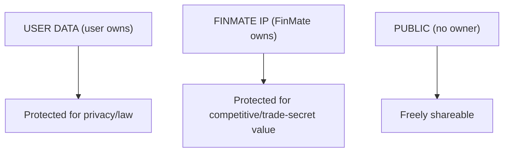
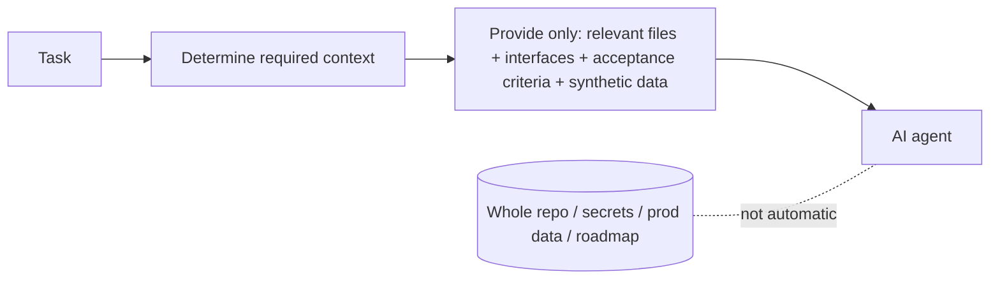
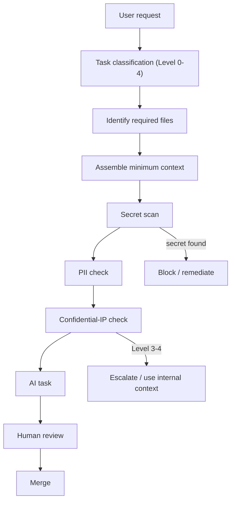
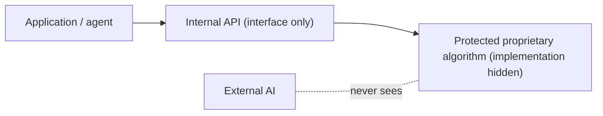
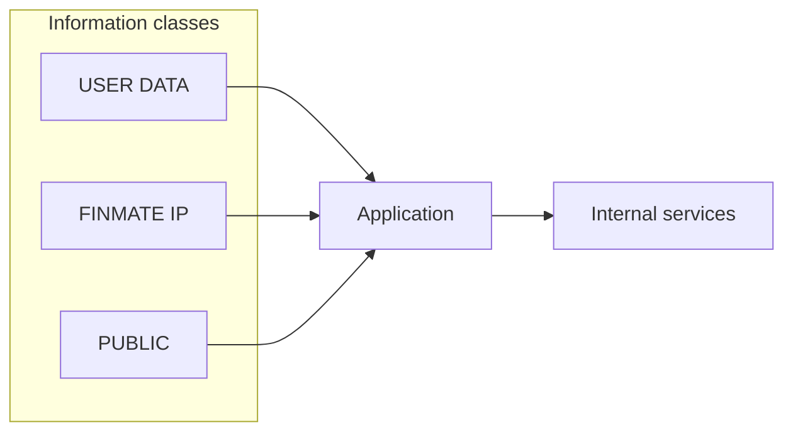
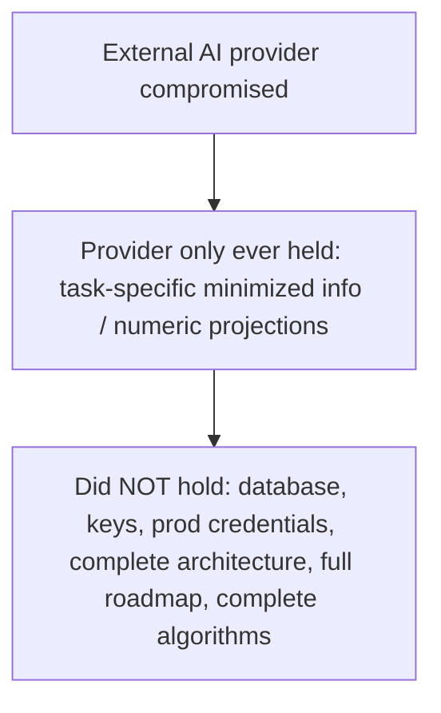
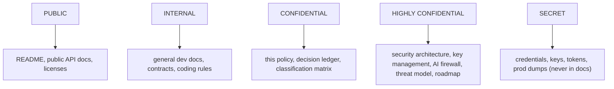
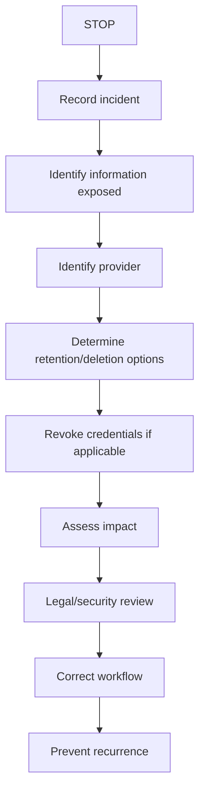
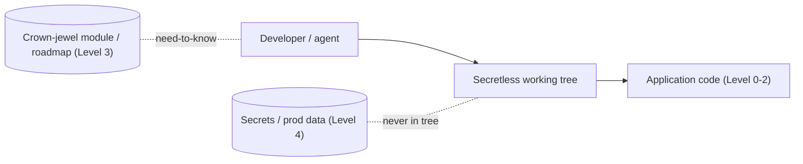

# FinMate — IP / AI Confidentiality Policy

**Classification of this document:** CONFIDENTIAL (it describes FinMate's IP-protection controls).
**Governing (frozen) sources:** [FINMATE_DECISION_LEDGER.md](FINMATE_DECISION_LEDGER.md) · [FINMATE_DATA_CLASSIFICATION_ENCRYPTION_MATRIX.md](FINMATE_DATA_CLASSIFICATION_ENCRYPTION_MATRIX.md) · [FINMATE_SECURITY_PRIVACY_ARCHITECTURE.md](FINMATE_SECURITY_PRIVACY_ARCHITECTURE.md) · [FINMATE_KEY_MANAGEMENT_ARCHITECTURE.md](FINMATE_KEY_MANAGEMENT_ARCHITECTURE.md) · [FINMATE_AI_DATA_ACCESS_PRIVACY_FIREWALL.md](FINMATE_AI_DATA_ACCESS_PRIVACY_FIREWALL.md)
**Nature:** Policy + governance + operational control. Authorises **no** code, schema, migration, API, encryption, AI-provider, or production change. No locked architecture decision is altered. Legal statements are general and marked **[COUNSEL]**; unselected tools are **[ENG-UNKNOWN / future engineering]**.
**Reading model:** each major concept is **Simple** first, then **Technical/operational**. Diagram IDs IP-01..IP-09 are local to this document. Grounded in ledger **IP-1, IP-2, GOV-5**, and risks **SEC-W1/W2/W3, OPS-1**.

> **The honest limit (IP-2), stated up front:** It is **not technically possible to guarantee** that an external AI system will never independently generate a similar product, idea, UI pattern, algorithm, or workflow. This policy does not claim otherwise. It **reduces the risk of exposing FinMate's _specific_ implementation, architecture, algorithms, business logic, security design, and roadmap.**

---

## 1. FinMate Confidentiality Explained in 5 Minutes

### Simple explanation

FinMate handles three kinds of information:

- **User data** — belongs to the _user_ (their money, mood, journal, photos). FinMate protects it _for_ them.
- **FinMate confidential information** — belongs to _FinMate_ (how the app works inside, its algorithms, its plans). FinMate protects it _from_ copying.
- **Public information** — safe to share (open-source libraries, public docs).

They must **not** be treated the same, because they're protected for **different reasons**: user data for privacy/law; FinMate IP for competitive/trade-secret value; public data needs no protection. A tool (like a coding AI) that needs to see one should not automatically see the others.

### Technical explanation

The confidentiality axis (USER / IP / PUBLIC) is **orthogonal** to the data-sensitivity zones (Z-1..3). A document can be low on the privacy axis but maximal on the IP axis (e.g., the threat model contains no user PII but is crown-jewel IP). Controls minimize what any external party — AI provider, coding agent, developer, contractor, vendor, analytics, support — receives, per **minimum necessary context**.

---

## 2. Data categories

**A. USER DATA** — financial records, health/wellbeing, mood, journal, photos, wardrobe, goals, contacts, investments, income, relationships, behavioural information. _(Protected by the privacy architecture, Documents #2–#5.)_

**B. FINMATE CONFIDENTIAL IP** — proprietary algorithms, business logic, application/security/encryption/AI-firewall/intelligence/recommendation/ranking/personalization design, product strategy, future roadmap, unreleased features, internal experiments, database architecture, threat model, internal security controls.

**C. PUBLIC INFORMATION** — public documentation, intentionally-exposed public APIs, open-source dependencies, public legal/standards information, public datasets, anything FinMate intentionally releases.

**IP-01 — Three information classes**

_Simple:_ three buckets, three reasons to (not) protect. _Technical:_ every artifact is tagged on both the privacy zone and this IP axis; egress controls consult both.

---

## 3. Critical distinction

**USER DATA ≠ FINMATE IP.**

- A user's expense record is **not** FinMate's IP (it's the user's personal data).
- FinMate's recommendation algorithm is **not** user data (it's FinMate's IP).
  Both need protection, but the reasons, owners, and legal frameworks differ. Confusing them leads to either over-sharing IP (treating it as "just app code") or mishandling user data (treating it as "our asset").

---

## 4. AI access principle — minimum necessary context

### Simple explanation

An AI helper gets **only what it needs for the job in front of it**, nothing more.

### Technical explanation (parallels the runtime firewall, Document #5)

Example — an agent fixing an Angular component:

- **ALLOW:** the relevant component, its related service, the required DTO/interface, the relevant test, the specific design requirement.
- **DO NOT automatically provide:** the production database, unrelated financial entities, security keys, the full roadmap, confidential algorithms, unrelated modules, user data, deployment credentials.

**IP-02 — AI context minimization**

---

## 5. Task-scoped AI context classification

| Level | Name                             | Examples                                                                                                                                  |
| ----- | -------------------------------- | ----------------------------------------------------------------------------------------------------------------------------------------- |
| **0** | PUBLIC                           | open-source usage, public docs, generic patterns                                                                                          |
| **1** | GENERAL PROJECT                  | routine components, DTOs, tests, non-sensitive business logic                                                                             |
| **2** | CONFIDENTIAL DEVELOPMENT         | internal service logic, module internals, non-crown-jewel algorithms                                                                      |
| **3** | HIGHLY CONFIDENTIAL ARCHITECTURE | security/key/AI-firewall design, threat model, crown-jewel algorithms, roadmap                                                            |
| **4** | **SECRET / NEVER PROVIDE**       | passwords, API keys, DB credentials, encryption keys, refresh/session tokens, production secrets, customer PII, production database dumps |

**[REQUIREMENT]** Level 4 must **never** be provided to any external AI or agent. Level 3 goes only to internal, controlled contexts and prefers interfaces over implementations (§12).

---

## 6. AI-safe development context (workflow)

**IP-03 — Development-agent workflow**

**[REQUIREMENT]** Do not provide the entire repository unless genuinely necessary. Secret scan + PII check + IP check gate the context before it reaches an agent.

---

## 7. Repository controls

Recommended (implementation choices marked **[ENG-UNKNOWN / future]** where no tool is selected):

- **Secret scanning** (e.g., gitleaks or trufflehog — options per SEC-W1; selection = future eng) — CI + pre-commit.
- **Dependency scanning** (SCA) — future eng.
- **Pre-commit checks** — secret/PII gates.
- **`.gitignore`** — keep `.env*`, logs, keys out of the repo (existing).
- **AI-ignore files** (`.cursorignore`/`.aiexclude`/Copilot content-exclusion) — best-effort per-tool; **not** the real boundary.
- **Environment separation** — dev/stage/prod isolation.
- **Secret-management system** — inject secrets at CI/deploy, never in the working tree (secretless working tree is the real boundary).
- **Branch protection** + required review.
- **Least-privilege developer access.**
- **Production-credential separation** (ties to OPS-1).
- **Audit logging** of privileged actions.
- **Restricted deployment access.**

**[REQUIREMENT]** No specific tool is mandated here; selections are future engineering decisions. The enforceable boundary is the **secretless environment + review**, not ignore-files (which cooperating tools honour but shell-capable agents can bypass).

---

## 8. Production data

**External AI agents must NEVER receive:** production database dumps, real customer financial records, real health information, private journals, private wardrobe photos, authentication credentials, encryption keys, production tokens, unnecessary PII.
**Use instead:** **synthetic data** or **minimized/anonymized** test data for development whenever possible. **[REQUIREMENT]** a synthetic/fixture dataset should exist so "just use real data to debug" is never necessary.

---

## 9. AI provider controls (VEN-1)

Before using any external provider (AI or otherwise), verify: business privacy terms, training policy, retention, deletion, data residency, sub-processors, security controls, contractual protections, enterprise/business controls, no-training/ZDR configuration where available. **Never assume "not used for training" means "not processed."** Record each in the processor register (VEN-1).

---

## 10. IP exposure model

| Level         | Example prompt                                                                                              | Handling                                                |
| ------------- | ----------------------------------------------------------------------------------------------------------- | ------------------------------------------------------- |
| **LOW**       | "Implement a date picker."                                                                                  | normal (Level 0/1)                                      |
| **MEDIUM**    | "Implement FinMate's expense categorization UI."                                                            | minimize context (Level 2)                              |
| **HIGH**      | "Explain FinMate's proprietary spending-prediction algorithm."                                              | abstract; interfaces not implementation (Level 3)       |
| **VERY HIGH** | "Provide the complete architecture and algorithm for FinMate's personalized financial intelligence engine." | **do not expose**; internal-only; crown-jewel isolation |

The higher the level → minimize context, prefer internal agents, abstract proprietary algorithms, expose **interfaces** rather than **implementations**.

---

## 11. Crown-jewel IP

### Simple explanation

A few of FinMate's algorithms are its "secret sauce." Those deserve extra walls so no outside tool ever sees how they actually work.

### Technical explanation

**Potential** crown-jewel candidates: proprietary recommendation/personalization/financial-intelligence/ranking algorithms, behavioural-adaptation logic, AI-orchestration logic, security/privacy-firewall logic.
**[PRODUCT/ENGINEERING REVIEW REQUIRED]** — this document does **not** decide which exact algorithms are crown jewels (ledger IP-1 says isolate only the 1–2 genuinely differentiating ones). Selection is a pending review.
**Control:** isolate a chosen crown-jewel algorithm behind an **internal API** so agents/tools can understand the _interface_ without the _implementation_ (§12). **[REQUIREMENT]** don't over-isolate — over-restriction kills development velocity (IP-1).

**IP-05 — Crown-jewel isolation**

---

## 12. Internal API boundary

### Simple explanation

Show tools the **door and its label**, not the **machine behind it**.

### Technical explanation

Preferred: `Application → Internal API → Protected proprietary algorithm`. Avoid: `External AI → complete proprietary algorithm source`. Agents work against a stable interface + acceptance criteria; the implementation stays in a restricted module/repo (IP-1). This lets normal development proceed while the differentiating logic remains unexposed.

---

## 13. Development agents (Claude / Codex / others / future)

**Agents SHOULD receive:** the task, required context, acceptance criteria, relevant files, synthetic test data.
**Agents SHOULD NOT automatically receive:** the entire repository, secrets, production data, unrelated confidential architecture, the future roadmap, or private user data.
**[REQUIREMENT]** Treat every coding agent as an **external collaborator with least-knowledge access**, regardless of provider trust tier.

---

## 14. AI agent permissions

| Permission            | Default                            | Escalation                                    |
| --------------------- | ---------------------------------- | --------------------------------------------- |
| **READ**              | required scope only                | broader read requires justification           |
| **WRITE**             | proposed diffs / branch            | merge requires human review                   |
| **EXECUTE**           | sandboxed/test only                | —                                             |
| **DEPLOY**            | **denied by default**              | explicit authorization                        |
| **PRODUCTION ACCESS** | **exceptional; denied by default** | explicit, time-boxed, audited (ties to ACC-1) |

**[REQUIREMENT]** Default = READ only for the required scope; higher permissions require explicit authorization; production access is exceptional. Cross-references: **OPS-1** (prod DB access is a live exposure), **SEC-W1/W2/W3** (secrets/tokens must not be in scope agents can read).

---

## 15. Audit logging

**Auditable:** who accessed production, who deployed, privileged actions, emergency (break-glass) access, sensitive repository operations (where practical), AI-provider usage (where practical).
**Do NOT log:** secrets, or raw sensitive user data unnecessarily (SEC-W2/W7). Audit records use safe metadata (actor, action, timestamp, reason), not payloads.

---

## 16. Information flow

**IP-04 — AI trust boundary / information flow**

| Destination           | USER DATA                                | FINMATE IP                            | PUBLIC  |
| --------------------- | ---------------------------------------- | ------------------------------------- | ------- |
| Application           | ALLOWED                                  | ALLOWED                               | ALLOWED |
| Internal services     | ALLOWED (purpose-limited)                | ALLOWED (need-to-know)                | ALLOWED |
| AI agents (dev)       | **DENIED**                               | CONDITIONAL (Level ≤2; interfaces)    | ALLOWED |
| External AI (runtime) | CONDITIONAL (projection+consent, Doc #5) | **DENIED** (except minimal necessary) | ALLOWED |
| Vendors               | CONDITIONAL (DPA, minimized)             | CONDITIONAL (NDA, minimized)          | ALLOWED |
| Developers            | CONDITIONAL (least-privilege)            | CONDITIONAL (need-to-know)            | ALLOWED |
| Production            | ALLOWED (controlled)                     | ALLOWED                               | ALLOWED |

---

## 17. AI provider compromise

**IP-07 — Provider compromise**

Because only **task-specific minimized information** (runtime: numeric projections; dev: scoped interfaces + synthetic data) crossed the boundary, a provider compromise cannot yield FinMate's database, keys, credentials, complete architecture, full roadmap, or complete proprietary algorithms.

---

## 18. IP reproduction limitation (IP-2)

**[REQUIREMENT — stated explicitly]** FinMate **cannot technically guarantee** that an external AI will never generate similar product ideas, UI patterns, algorithms, workflows, or business concepts. Models can reach adjacent designs with **zero** exposure to FinMate — this is not preventable by technical controls.

**What FinMate _can_ do (risk reduction, not prevention):** minimize context, provider/contractual controls, keep proprietary algorithms private, internal-API boundaries, access control, repository isolation, audit logging, IP/legal protections, trade-secret practices, employee/contractor confidentiality agreements.

**[COUNSEL]** legal protections and their scope require counsel; no legal claim is made here beyond general principles.

---

## 19. Trade-secret protection

### Simple explanation

Something counts as a "trade secret" **only while you actually keep it secret**. So the walls you build (restricted access, NDAs, logging) are also what make the legal protection real.

### Technical / operational

General principle: trade-secret protection typically depends on **reasonable measures to keep information secret**. Operational measures (no legal claim asserted): restricted access, confidentiality agreements, access logging, repository controls, need-to-know access, secret management, documentation classification (§21), vendor agreements. **[COUNSEL REQUIRED]** for jurisdiction-specific legal interpretation and whether specific measures suffice.

---

## 20. Roadmap confidentiality

Future features are **not** automatically exposed to development agents — including future investment intelligence, auction opportunities, property/car recommendations, future wellbeing/wardrobe features, and future marketplace integrations. Provide only the roadmap information necessary for the current task. Roadmap docs are classified HIGHLY CONFIDENTIAL (§21).

---

## 21. Document classification

**IP-09 — Document classification**

| Class               | Example FinMate documents                                                                                                        |
| ------------------- | -------------------------------------------------------------------------------------------------------------------------------- |
| PUBLIC              | README, public API/openapi (as intentionally exposed), licenses                                                                  |
| INTERNAL            | contributing/coding rules, general dev docs                                                                                      |
| CONFIDENTIAL        | this IP policy, Decision Ledger, Data Classification Matrix                                                                      |
| HIGHLY CONFIDENTIAL | Security & Privacy Architecture, Key Management, AI Firewall spec, **Threat Model**, product roadmap, crown-jewel algorithm docs |
| SECRET              | credentials/keys/tokens/prod data (never stored in documents)                                                                    |

**[REQUIREMENT]** The security architecture, key architecture, and threat model must **not** be treated as public documentation.

---

## 22. Incident response — confidential IP sent to external AI

**IP-08 — Confidentiality incident response**

**[REQUIREMENT]** Do not claim provider deletion is guaranteed unless contractually verified. **[COUNSEL]** impact/legal assessment.

---

## 23. User-data incident (exposed to an AI provider)

Immediately: stop processing → identify affected data → identify users/data categories → determine provider retention → request deletion where available → investigate access → assess legal obligations → document incident. **[COUNSEL REQUIRED]** for regulatory notification decisions (e.g., breach-notification timelines). Cross-reference the runtime firewall (Document #5) which is designed to make such exposure structurally unlikely (numeric projections only).

---

## 24. Diagram index

| ID    | Name                                 | Location |
| ----- | ------------------------------------ | -------- |
| IP-01 | Three information classes            | §2       |
| IP-02 | AI context minimization              | §4       |
| IP-03 | Development-agent workflow           | §6       |
| IP-04 | AI trust boundary / information flow | §16      |
| IP-05 | Crown-jewel isolation                | §11      |
| IP-06 | Repository access boundary           | below    |
| IP-07 | Provider compromise                  | §17      |
| IP-08 | Confidentiality incident response    | §22      |
| IP-09 | Document classification              | §21      |

**IP-06 — Repository access boundary**

_Simple:_ the working copy has no secrets and no crown jewels unless you specifically need them. _Technical:_ secrets injected at CI/deploy; crown-jewel + roadmap in restricted paths/repos; agents operate on a secretless checkout.

---

## 25. Backward compatibility

This policy must not break existing development workflows, CI/CD, application behaviour, or production deployments. **[REQUIREMENT]** introduce controls **incrementally**; do not require an immediate repository redesign unless a concrete security risk requires it. The one item that is both concrete and already accepted is **SEC-W1** (secret scanning + git-history purge) — a P0 workstream, not a redesign.

---

## 26. Reconciliation

Checked against Documents #1–#5:

- **No architecture decision changed** — this is policy layered on IP-1/IP-2/GOV-5; restates, does not alter.
- **No encryption decision changed.**
- **No AI-firewall decision changed** — consistent with Document #5 (runtime) and adds the development-agent (IP) dimension.
- **No GDPR compliance claim** — legal items marked [COUNSEL].
- **No guarantee that similar AI products are impossible** — explicitly disclaimed (§18, IP-2).
- **No user-data rights changed.**
- **Counsel items remain marked:** trade-secret interpretation (§19), IP legal protections (§18), incident legal/regulatory (§22/§23).
- **ENG-UNKNOWN remain marked:** specific tool selections (§7), crown-jewel selection (§11, PRODUCT/ENGINEERING REVIEW REQUIRED).
- **P0/P1 referenced:** SEC-W1 (secret scanning/history), SEC-W2/W3 (secrets/tokens out of agent scope), OPS-1 (prod access).
- **Backward compatibility preserved** — incremental controls; no forced redesign.
- **Contradictions:** **NONE** — no STOP-and-report condition; Documents #1–#5 not modified.

---

## DOCUMENT STATUS: **FROZEN** ✅

Complete IP / AI Confidentiality Policy, dual-leveled, 9 diagrams (IP-01..IP-09), consistent with the frozen architecture set and honest about the limits of preventing independent AI reproduction. No code, schema, migration, API, encryption, AI-provider, or production change was made.

_End of Document #6 (FROZEN). STOP — not proceeding to the Threat Model (Document #7) or the SRS._
