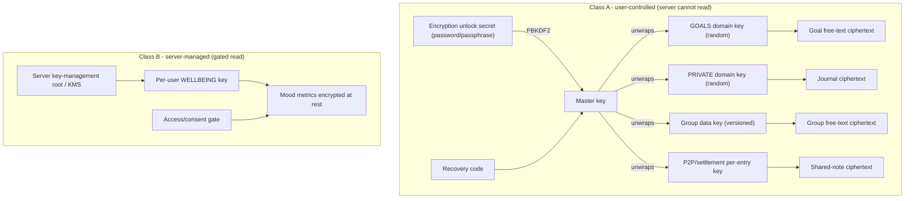
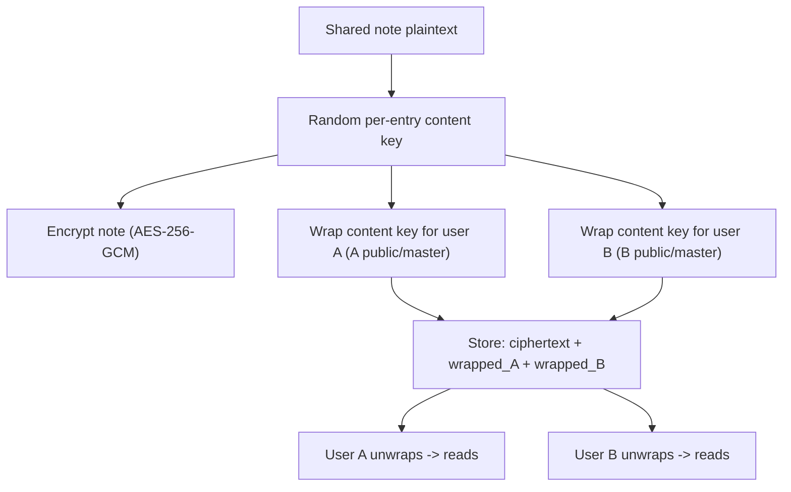
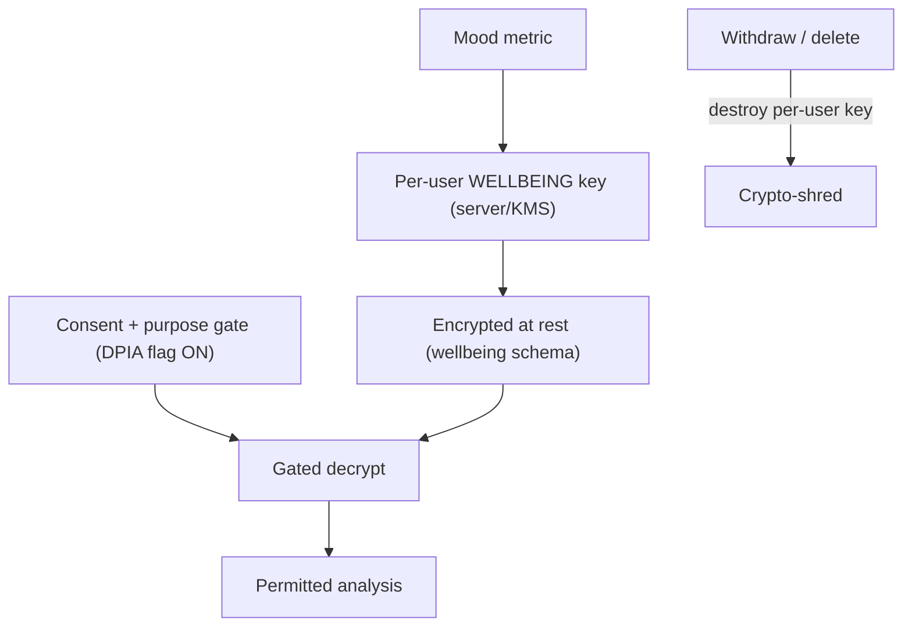
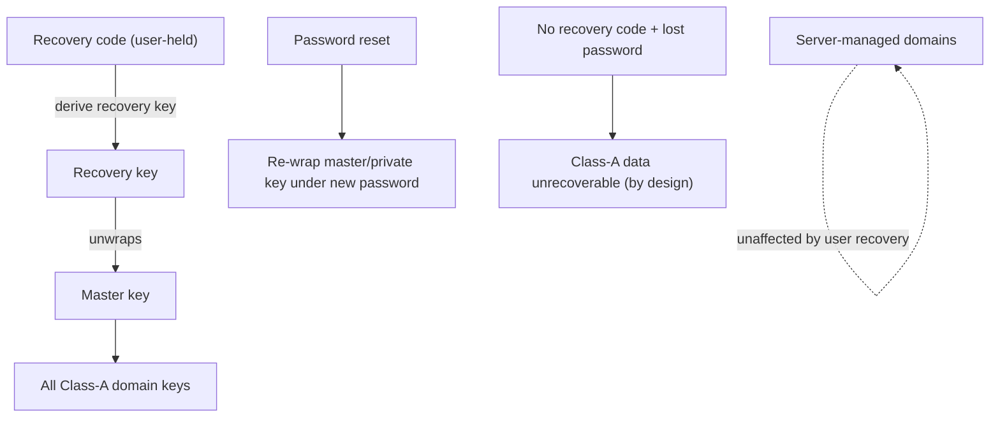
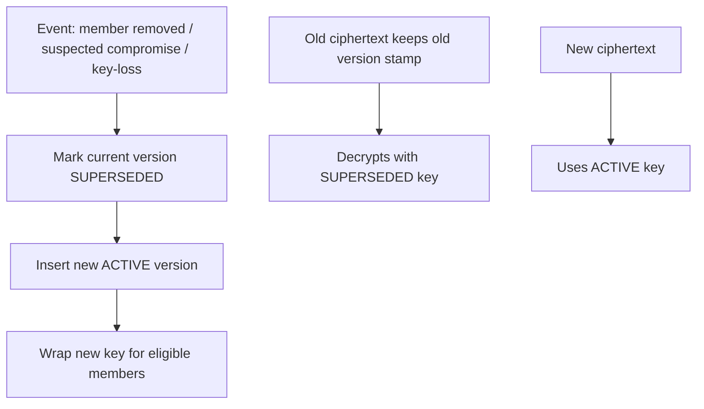
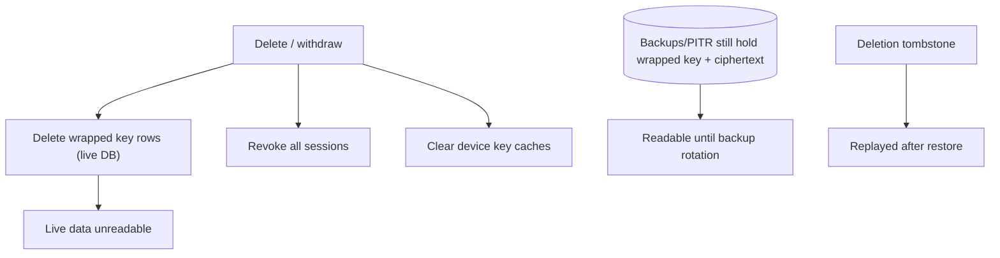
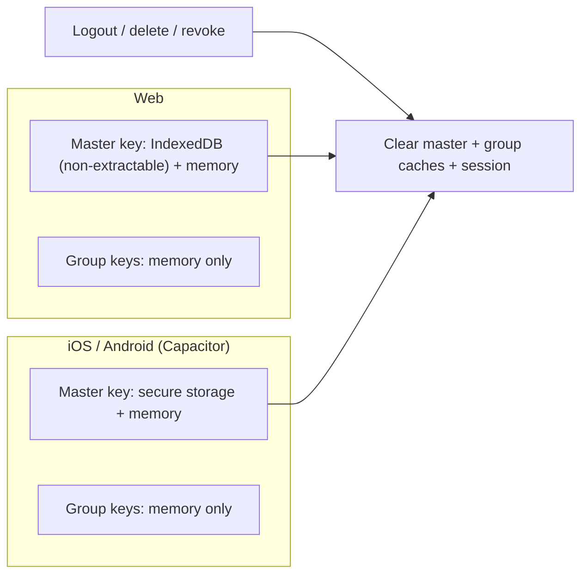
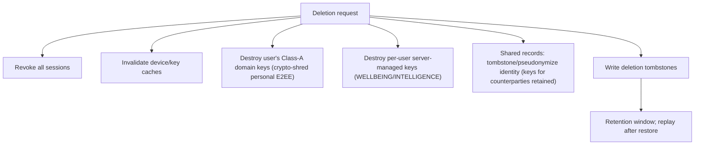
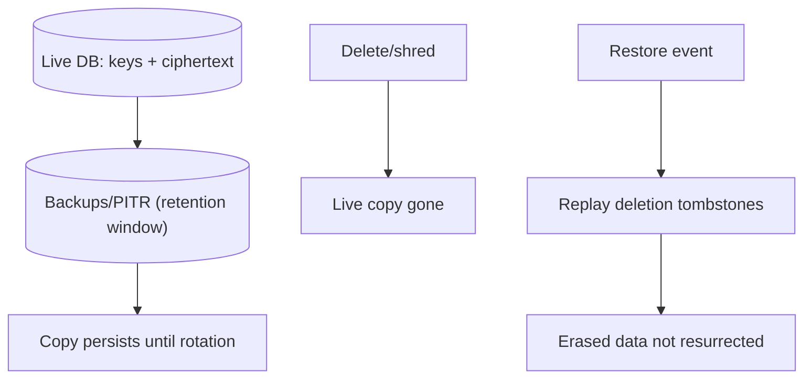
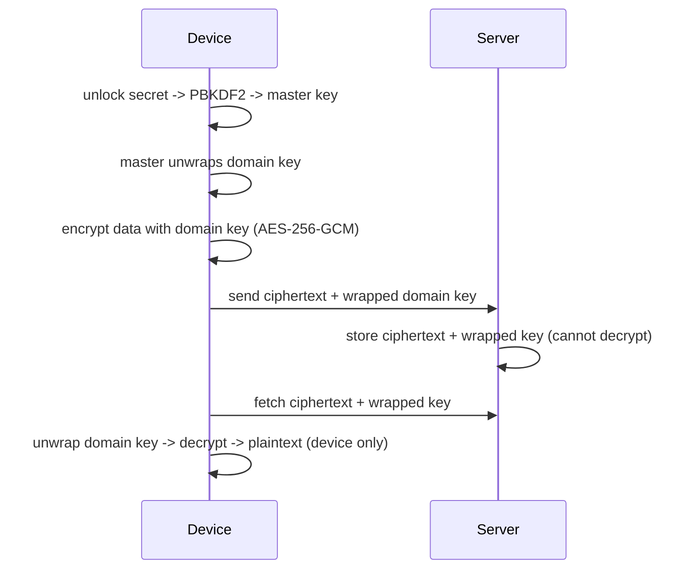

# FinMate — Key Management Architecture

**Governing (frozen) sources:** [FINMATE_DECISION_LEDGER.md](FINMATE_DECISION_LEDGER.md) · [FINMATE_DATA_CLASSIFICATION_ENCRYPTION_MATRIX.md](FINMATE_DATA_CLASSIFICATION_ENCRYPTION_MATRIX.md) · [FINMATE_SECURITY_PRIVACY_ARCHITECTURE.md](FINMATE_SECURITY_PRIVACY_ARCHITECTURE.md)
**Nature:** Documentation only — authorises **no** code, schema, migration, encryption, API, or production change. No locked decision is altered.
**Central question this document answers:** *"Who holds the key to unlock each type of FinMate data?"*
**Reading model:** every major concept appears twice — a **Simple** explanation (anyone can follow) then a **Technical** one (for engineers/reviewers). Diagram IDs KEY-01..KEY-10 are local to this document.

> **CURRENT vs TARGET.** CURRENT (in production): PBKDF2 master key, per-group versioned data keys, RSA-OAEP wrapping keys, direct-shared per-expense keys, server global key for 2FA/avatar. TARGET (not built): per-domain random keys for new domains (GOALS/PRIVATE/WELLBEING/WARDROBE/INTELLIGENCE), server-managed wellbeing key store, mandatory recovery, dual-transport session keys. Each section labels which.

---

## 1. Key classes

### Simple explanation
FinMate uses two kinds of keys. **Your keys** lock things so that only you can open them — FinMate's servers keep the locked boxes but never the real key. **FinMate's keys** lock things FinMate genuinely needs to read to help you (like analysing your mood) — still encrypted, but FinMate can open them under strict rules.

### Technical explanation (locked K-1/K-2)
| | **Class A — E2EE / user-controlled** | **Class B — Server-managed** |
|---|---|---|
| Who holds the key | user (device) | server / KMS |
| Server can decrypt? | **No** | Yes, gated by consent + purpose |
| Examples | journal, expense/note/goal/P2P/settlement/group free-text, photos, attachments | wellbeing mood metrics, intelligence derived data |
| Key material | **random** per-domain/per-entry AES-256-GCM, wrapped under master + recovery | per-user/per-domain key in server key store |
| Why different | server access is unnecessary → strongest privacy | server analysis is required → readable under control |

**[REQUIREMENT — K-1]** Domain keys are **random and wrapped**, never **HKDF-derived**. Deterministic HKDF keys cannot be crypto-shredded (they are always re-derivable from the master), which would defeat per-domain deletion. This document uses **random per-domain data keys + wrapped key material + master/recovery wrapping** everywhere.

---

## 2. Key hierarchy

**KEY-01 — Overall key hierarchy**

### Simple explanation
Your password opens your master key; your master key opens each area's own key; each area's key opens that area's locked data. A separate recovery code can also open your master key if you forget your password. FinMate's own server keys are a totally separate tree — they never touch your personal keys.

### Technical explanation
Class A is a two/three-tier wrap: `PBKDF2(unlock secret) → master key`; `master (and recovery) → random domain/entry key`; `domain key → AES-256-GCM data`. The server stores only ciphertext + wrapped key blobs. Class B is server-rooted: `KMS/server root → per-user domain key → at-rest ciphertext`, decryptable only through a consent/purpose gate. **The server has no path to Class-A keys.**

---

## 3. Domain key matrix

| Domain | Data examples | Key class | Who holds key | Who can decrypt | Wrapping | Rotation | Deletion | Crypto-shred | Recovery | AI access |
|---|---|---|---|---|---|---|---|---|---|---|
| **CORE** (CURRENT) | passwordHash (hash), 2FA secret, avatar, wrapping keys | hash + Class B(global) | server (global key) for 2FA/avatar; user for wrapping keys | server (2FA/avatar); user (private wrapping key) | 2FA/avatar under global `ENCRYPTION_KEY`; private wrapping key under master | n/a (global) | delete row | limited (global key shared) | recovery-wrapped private key | NO |
| **FINANCE** (CURRENT) | expense/note free-text (E2EE); amounts (Zone 2) | Class A (free-text); none (Zone 2) | user (free-text) | user (free-text); server (Zone 2, no key) | group data key / master; direct-shared per-entry | group key versioned (ROT-1) | row/soft-delete | via key destroy (free-text) | recovery-wrapped | numeric projection only |
| **FINANCE free-text (TARGET FLD-1/FLD-2/B-2)** | settlement.note, group.description, P2P note | Class A | user(s) | authorized users | per-entry/group key, wrapped master(+recovery)/RSA for both parties | with group/entry | delete row + drop wrapped keys | **yes** | recovery-wrapped | NO |
| **GOALS** (TARGET) | goal free-text | Class A | user | owner | random GOALS key, wrapped master+recovery | domain versioned | delete + shred | **yes** | recovery-wrapped | NO (numeric progress only) |
| **PRIVATE** (TARGET) | journal, private notes | Class A | user | owner | random PRIVATE key, wrapped master+recovery | domain versioned | delete + shred | **yes** | recovery-wrapped | NO (explicit workflow only) |
| **WELLBEING** (TARGET, A3) | mood metrics | **Class B** | server/KMS | server (gated) + owner | per-user WELLBEING key in server store | server-managed | delete + shred key | **yes** | n/a (server-held) | NO by default |
| **WARDROBE** (TARGET) | photos (Class A), inventory/style (Zone 3) | Class A (photos) | user | owner | random WARDROBE/file key, wrapped master+recovery | domain versioned | delete + shred | **yes** | recovery-wrapped | vision on-demand, approved provider |
| **OPPORTUNITIES** (TARGET) | public/scraped data | none (public) | n/a | anyone (public) | n/a | n/a | delete | n/a | n/a | yes (public) |
| **INTELLIGENCE** (TARGET) | derived facts, AI memory | **Class B** | server/KMS | server (gated) + owner | per-user INTELLIGENCE key | server-managed | delete + shred | **yes** | n/a | projection only |

**[TARGET]** rows are unimplemented. **[REQUIREMENT]** no domain key is HKDF-derived (K-1).

---

## 4. E2EE data (Class A) — from Document #2 (unchanged)

| Field | Status | Key domain |
|---|---|---|
| expense title/description | CURRENT E2EE | group data key / master (direct-shared per-entry) |
| note title/body | CURRENT E2EE | group data key / master |
| recurring title/description | CURRENT E2EE | group data key / master |
| attachment encryptedFileKey/encryptedOriginalName | CURRENT E2EE (roadmap upload) | scope key (personal/group/direct) |
| direct_ledger.note (P2P) | TARGET E2EE (B-2) | per-entry shared key |
| settlement.note (FLD-1) | TARGET E2EE | group/per-entry key |
| group.description (FLD-2) | TARGET E2EE | group data key |
| goal free-text (B-1) | TARGET E2EE | GOALS domain key |
| journal / private notes | TARGET E2EE | PRIVATE domain key |
| wardrobe photos | TARGET E2EE | WARDROBE/file key |

Classification is **unchanged** from Document #2. Non-E2EE (Zone 2 / plaintext-but-protected): amounts, dates, category, group.name (FLD-3), nickname (FLD-4), monthlyIncome (FLD-5), invitedEmail (FLD-7) — **no key**, protected by authorization + isolation.

---

## 5. Shared / P2P data

### Simple explanation
A note shared between two friends can't be locked with just one friend's key — the other friend couldn't read it. So FinMate makes a **separate key just for that note** and locks a copy of it for **each** friend. Both can open it; nobody else can.

### Technical explanation (locked B-2 / FLD-1)
**KEY-04 — Shared P2P key flow**

- **New records:** per-entry content key wrapped for both **registered** users (both have RSA public wrapping keys). Marker `direct_shared`.
- **Existing plaintext records:** retained via marker `legacy_plaintext`; readers branch; **client-side opportunistic backfill** on next key-holding session; **no destructive migration** (B-2).
- **User who never returns:** their legacy notes stay plaintext permanently (documented residual).
- **Counterparty access:** each party holds their own wrapped copy → survives the other party's account deletion / key destruction.
- **Deletion:** drop the entry + both wrapped keys (crypto-shred the note).
- **Export:** encrypted notes exported client-side (decrypt-in-browser, EXP-1); legacy plaintext exported as-is, labelled.

**[REQUIREMENT]** a single user's personal master key must **not** be used for shared content — the counterparty could not decrypt it. **[ENG-UNKNOWN]** if P2P ever extends to unregistered (contact) counterparties without a wrapping key, shared-note encryption for that pair is deferred.

---

## 6. Server-managed WELLBEING (locked A3 / K-2)

### Simple explanation
Some helpful mood insights need FinMate to actually read your mood scores. You can't lock those so only you can open them, or FinMate couldn't do the analysis. So they're locked with a **FinMate-held key**, kept encrypted, and only opened when you've turned wellbeing analysis on.

### Technical explanation
**KEY-03 — Server-managed key flow**

- **Why not E2EE:** server-side analysis (e.g., mood↔spending correlation) requires the server to read the values; true E2EE would make server analysis impossible.
- **Key:** per-user, per-domain, **server-managed in a new key store** (not the global `EncryptionService` — K-2, which cannot per-user shred).
- **Isolation:** WELLBEING schema + role; access gated by consent + purpose.
- **Revocation/deletion:** destroy the per-user WELLBEING key → crypto-shred.
- **Gating:** analysis stays flag-OFF until DPIA sign-off (INT-3/DPIA-1).

**[COUNSEL]** Server-readable mood is likely GDPR Art. 9 special-category and requires heightened controls + DPIA. **No compliance claim is made here.**

---

## 7. INTELLIGENCE key/access model (locked INT-1/2/4)

### Simple explanation
The "tips" brain never gets the keys to your rooms. It only receives small hints ("food up 18%"), where they came from, and how confident FinMate is — never the raw data or the keys.

### Technical explanation
- **INTELLIGENCE never receives raw domain encryption keys.** It cannot decrypt any domain.
- It receives **permitted derived signals** with: **provenance (source domain + opaque source IDs), confidence, date, reason, legal-basis/consent scope** — **no raw source data** (INT-2).
- Its own derived store uses a **Class-B per-user INTELLIGENCE key** (server-managed, crypto-shreddable).
- **Three independent states (RGT-1/INT-4):** override/suppression (permanent, stored independently of derived data so it survives deletion + re-consent), restriction (reversible pause), consent withdrawal (stop + invalidate derived + revoke key). A rejected inference must not silently regenerate.

**[REQUIREMENT]** Needing a signal never justifies raw domain access or a raw domain key.

---

## 8. Recovery (locked REC-1)

### Simple explanation
If you forget your password, a **recovery code** you saved can still unlock your master key. Without either your password or your recovery code, your end-to-end-encrypted data **cannot** be recovered — that's the price of true privacy, so FinMate makes you set up recovery before you store this kind of data.

### Technical explanation
**KEY-05 — Recovery flow**

- **Recovery code:** user-held; derives a recovery key that wraps the master (and every Class-A domain key).
- **Onboarding:** recovery setup **mandatory/strongly-gated before storing E2EE data** (REC-1).
- **Lost password (has recovery):** reset re-wraps the private key/master under the new password; Class-A data preserved (existing ZK reset flow).
- **Lost password + lost recovery:** Class-A data is **permanently unrecoverable** — never claim otherwise.
- **Lost device:** keys re-derived on a new device from password/recovery; no device-bound secret required for Class A.
- **Server-managed domains (Class B):** unaffected by user recovery (server holds those keys) — recovery flow must not assume all domains are client-wrapped.

**[REQUIREMENT]** Recovery must **not** weaken E2EE (no server-held plaintext master; recovery is a second user-held wrap, per the recovery-RSA-root invariant).

---

## 9. Key rotation (locked ROT-1)

### Simple explanation
Sometimes FinMate needs a fresh lock — for example when someone leaves a group. FinMate makes a new key version going forward. Old locked data keeps its old key version so it still opens; new data uses the new key.

### Technical explanation
**KEY-06 — Key rotation**

- **Why:** limit exposure after membership change or suspected compromise.
- **When (ROT-1):** event-driven only (no calendar rotation).
- **Old ciphertext:** keeps its version stamp; immutable version history (`group_key_versions` ACTIVE/SUPERSEDED/REVOKED).
- **Backward compatibility / old clients:** ciphertext + version stamp travel as a consistent pair; each member holds their wrapped copy per version.
- **Prerequisite:** fix the existing backend bug where `GET /keys/me?versionId=` is ignored and ACTIVE is always served (**SEC-KI1**) — otherwise rotated-history is undecryptable for new members / after logout.
- **History re-encryption:** **DEFERRED** — V1 does **not** re-encrypt existing ciphertext on rotation and does **not** claim retroactive revocation (a removed member may still read data they already decrypted/cached).

---

## 10. Crypto-shred (locked K-4)

### Simple explanation
"Delete the key, and the locked data becomes permanently unreadable." But old **backups** may still contain a copy of the locked key for a while, so deletion isn't truly instant — it completes after backups roll over.

### Technical explanation
**KEY-07 — Crypto-shred**

- Steps: delete wrapped key rows (Class A) or destroy per-user server key (Class B) + revoke sessions + clear device caches + write tombstones.
- **[REQUIREMENT]** Crypto-shred is **not** instantaneous while backups exist: wrapped keys persist in backups/PITR and may be cached on devices; true erasure completes after **device-cache clear + backup rotation** (ties to RET-1).
- **Never** describe crypto-shred as instant permanent deletion.

---

## 11. Device security (Web / iOS / Android)

### Simple explanation
Where the keys are kept differs by device, but the rule is the same: keys live only where the app can use them, and are wiped on logout, account deletion, or a lost-device revoke.

### Technical explanation
**KEY-09 — Web/iOS/Android key handling**

| Concern | Web/PWA (CURRENT) | iOS/Android (TARGET) |
|---|---|---|
| Master key | IndexedDB non-extractable CryptoKey + memory | secure storage + memory |
| Group keys | memory only (never persisted) | memory only |
| Offline (OFF-1) | personal-scope only; group keys never persisted | same |
| Session revocation | clears vault + memory on logout | clears secure storage + memory |
| Account deletion | destroy keys + revoke sessions across devices | same |
| Lost device | re-derive from password/recovery on new device; revoke sessions | same |

**[REQUIREMENT]** No platform API is assumed beyond the established set (Web Crypto, IndexedDB, Capacitor secure storage / Keychain / Keystore).

---

## 12. Authentication vs encryption unlock (locked AU-3)

### Simple explanation
Logging in and unlocking your locked data are **two different things**. Signing in proves who you are; it does **not** automatically hand over the keys to your end-to-end-encrypted data — those come from your encryption unlock secret.

### Technical explanation
- **Login credential** = password (+ optional passkey/2FA) → proves identity, issues session tokens.
- **Encryption unlock secret** = the password/passphrase feeding PBKDF2 → derives the master key. Kept conceptually separate.
- **Passkeys/biometrics (AU-3):** V1 = login/2FA convenience only; they **do not** derive the master key. Passwordless-E2EE decoupling is **deferred** (a future design where the encryption unlock secret is separated from the login credential entirely).
- **[REQUIREMENT]** A successful login does **not** by itself grant Class-A decryption; the unlock secret must still produce the master key.

---

## 13. Account deletion (locked DEL-1/2/3)

**KEY-08 — Account deletion (key view)**

- Personal-scope keys destroyed; shared per-entry keys survive for the **counterparty's** wrapped copy (they keep access to shared history).
- Shared financial/audit records tombstoned/pseudonymized in place (NOT-NULL FKs forbid row-delete).
- **[COUNSEL]** retention basis (DEL-1) and departed-user personal content in retained shared free-text (DEL-3).

---

## 14. Password reset (Class-A outcomes)

### Simple explanation
What happens to your locked data on a reset depends on what you still have:

| Situation | Class-A (E2EE) data outcome |
|---|---|
| Remembers password | fully accessible (normal) |
| Reset **with** recovery code | preserved — recovery re-wraps the master under the new password |
| Reset **without** recovery code | **not recoverable** — the new password can't derive the old master |
| Recovery code lost + password lost | **permanently unrecoverable** |

### Technical explanation
The existing ZK reset flow: the client uses the recovery-wrapped key to recover the master, re-wraps the private wrapping key under the new password, and uploads ciphertext; the server only swaps the hash and stores the re-wrapped blob (it never sees plaintext key material). Server-managed (Class B) domains are unaffected by a reset. **[REQUIREMENT]** never claim a reset can recover E2EE data without the required recovery material.

---

## 15. Backups (locked RET-1 / K-4 / DEL-2)

### Simple explanation
Backups are copies taken over time. They also contain the (locked-up) keys and locked data. So even after you delete something, a backup may still hold it until that backup expires. FinMate promises deletion within a set window that matches how long backups live.

### Technical explanation
- Backups/PITR/WAL contain **wrapped key material + ciphertext**; deleting live rows does not remove backup copies.
- Erasure SLA = the **backup window** (RET-1, parametric — ~30-day working figure, to be verified against real PostgreSQL/PITR/object-store/Redis/vendor/mobile-backup retention; **not hard-coded**).
- **Deletion/withdrawal tombstones** are **replayed after any restore** (DEL-2) so a restore cannot resurrect erased data.
- **KEY-10 — Backup/restore**

---

## 16. Existing production data — key compatibility

| Field | CURRENT | TARGET | Key compatibility | Migration | Rollback | Old-client behaviour |
|---|---|---|---|---|---|---|
| expense title/description | E2EE (master/group key) | **unchanged (K-3)** | same keys | none | n/a | works |
| note title/body | E2EE | unchanged | same keys | none | n/a | works |
| direct_ledger.note (P2P) | plaintext (prod data) | E2EE per-entry (B-2) | new per-entry key; marker | additive marker + client backfill | plaintext branch retained | old clients read plaintext branch |
| settlement.note (FLD-1) | plaintext (prod data) | E2EE group/per-entry | new key; marker | additive + client backfill | plaintext branch | read plaintext branch |
| group.description (FLD-2) | plaintext (prod data) | E2EE group key | group key; marker | additive + client backfill | plaintext branch | read plaintext branch; **[ENG-UNKNOWN]** pre-join display |
| attachments | E2EE file key (roadmap) | unchanged; drop plaintext name | same file-key model | stop plaintext originalName (FLD-6/SEC-W6c) | re-enable | roadmap |
| group keys | versioned, per-member wrapped | unchanged; fix versionId bug | same | fix SEC-KI1 | n/a | works |

**[REQUIREMENT]** No clean-slate. Every prod-data E2EE change uses additive marker + client backfill + permanent mixed-state (B-2 pattern).

---

## 17. Key access matrix

Can the actor obtain the **decryption key** for the domain? (Not the data — the key.)

| Actor | CORE | FINANCE (E2EE) | PRIVATE | GOALS | WELLBEING | WARDROBE | OPPORTUNITIES | INTELLIGENCE |
|---|---|---|---|---|---|---|---|---|
| **User** | YES (own) | YES | YES | YES | CONDITIONAL (via app, consented) | YES | n/a (public) | CONDITIONAL (own derived) |
| **Client (app)** | YES (holds master) | YES | YES | YES | CONDITIONAL | YES | n/a | CONDITIONAL |
| **Finance service** | NO | **NO (E2EE key)** | NO | NO | NO | NO | n/a | NO |
| **Domain service** | NO | NO | NO | own domain only (Class B server key if any) | WELLBEING key (gated) | NO (photo keys) | n/a | INTELLIGENCE key (gated) |
| **INTELLIGENCE** | NO | NO | NO | NO | NO | NO | n/a | own key only |
| **Admin/Support** | NO | NO | NO | NO | NO | NO | n/a | NO |
| **External AI** | NO | NO | NO | NO | NO | NO | n/a | NO |
| **DBA** | NO (ciphertext) | NO (ciphertext) | NO | NO | NO (server key in KMS) | NO | n/a | NO |

**Note:** Zone-2 finance data needs **no key** — the DBA/backend can read it as plaintext (OPS-1 residual); this matrix is about **keys** for encrypted data, where even the DBA sees only wrapped/ciphertext material.

---

## 18. Key-compromise scenarios

| Compromise | Exposed | Remains protected | Revoke | Rotate | Cannot recover |
|---|---|---|---|---|---|
| **Database stolen** | Zone-2 finance (plaintext); ciphertext + wrapped keys (useless without master) | all Class-A free-text/photos; server-managed keys (in KMS, not DB) | n/a | group keys forward | — |
| **Server (global/KMS) key stolen** | 2FA secrets, avatar, WELLBEING/INTELLIGENCE at-rest (if the per-user server keys are exposed) | Class-A user data (server never holds those keys) | rotate server keys | server-managed keys | — |
| **User device compromised** | that user's decrypted data while unlocked; keys usable in-session (non-extractable → not exportable) | other users; server-managed domains beyond this user | revoke sessions; account-level key destroy | user re-key on reset | data already exfiltrated in-session |
| **Refresh token stolen** | that session until revoked | all keys (tokens ≠ keys) | revoke session (Redis) | issue new tokens | — |
| **Admin credentials compromised** | Zone-2 finance (OPS-1); no Class-A keys | Class-A data; server keys if KMS-separated | disable admin; break-glass audit (ACC-1) | rotate creds | — |
| **External AI provider compromised** | only the numeric projections previously sent | raw DB, journal, contacts, keys | cut egress | new provider config | past projections already sent |
| **Backup compromised** | ciphertext + wrapped keys + Zone-2 finance as of backup | Class-A data without master/recovery | n/a | forward keys | backup contents until expiry |

---

## 19. Diagrams (index)

| ID | Name | Simple / Technical |
|---|---|---|
| KEY-01 | Overall key hierarchy | §2 |
| KEY-02 | E2EE key flow | §1/§2 (Class A path) — see below |
| KEY-03 | Server-managed key flow | §6 |
| KEY-04 | Shared P2P key flow | §5 |
| KEY-05 | Recovery flow | §8 |
| KEY-06 | Key rotation | §9 |
| KEY-07 | Crypto-shred | §10 |
| KEY-08 | Account deletion (key view) | §13 |
| KEY-09 | Web/iOS/Android key handling | §11 |
| KEY-10 | Backup/restore | §15 |

**KEY-02 — E2EE key flow (encrypt/decrypt round trip)**

*Simple:* your device does all the locking and unlocking; the server just holds the locked box. *Technical:* AES-256-GCM data key wrapped under the master; server persists ciphertext + wrapped blob with no decryption path.

---

## 20. Threat considerations (key-specific; full model = later Document #7)

| Threat | Mitigation |
|---|---|
| Key theft | keys non-extractable on device; server never holds Class-A keys; wrapped-only at rest |
| Key leakage | no plaintext keys in logs (SEC-W2); wrapped material only |
| Key reuse | random per-domain/per-entry keys (K-1); no shared derivation |
| Stale keys | event-driven rotation (ROT-1); version state machine |
| Forgotten key versions | immutable version history; fix versionId serving (SEC-KI1) |
| Cached keys | session-only group keys; clear on logout/delete (§11) |
| Backup resurrection | tombstone replay after restore (DEL-2); retention window (RET-1) |
| Recovery abuse | recovery is a second user-held wrap; reset revokes all sessions; audit |
| Shared-key access | per-entry key wrapped only for authorized participants |
| Compromised device | in-session exposure only; revoke + re-key; non-extractable keys |

Full analysis deferred to the Threat Model document.

---

## 21. Backward compatibility (summary)

| Change | Current | Target | Migration | Rollback | Old-client | User impact |
|---|---|---|---|---|---|---|
| P2P/settlement/group-desc free-text | plaintext | E2EE new + mixed-state | additive marker + client backfill | plaintext branch | reads plaintext branch | none for existing |
| Group-key rotation fix | versionId ignored | serve requested version | backend fix (SEC-KI1) | revert | works | fixes history decryption |
| Per-domain keys (new domains) | n/a | random wrapped keys | additive (new domains) | n/a | n/a | none |
| Recovery mandatory | optional | mandatory pre-E2EE-store | onboarding gate | n/a | n/a | small onboarding step |

**[REQUIREMENT]** never require a destructive rewrite where an incremental mixed-state migration achieves the same objective.

---

## 22. FinMate Key Security Explained in 5 Minutes

- **What a key is:** a secret that locks/unlocks information. Locked information without the key is just noise.
- **Why multiple keys:** different data needs different protection. One stolen key should never open everything.
- **Why some keys are yours:** your journal, private notes, and locked free-text are locked with **your** key — FinMate's servers hold the locked box but not the key, so even FinMate can't read them.
- **Why some keys are FinMate's:** for features that need FinMate to read data (like mood analysis), FinMate holds a key — but the data is still encrypted and only opened with your consent, for that purpose.
- **How shared notes work:** a shared note gets its **own** key, and a copy of that key is locked for each person who's allowed to see it.
- **What recovery means:** a recovery code can unlock your master key if you forget your password. Lose both and your locked data is gone for good — that's the trade-off of real privacy.
- **What happens if a key is deleted:** the data it locked becomes unreadable ("crypto-shred").
- **Why backups matter:** old backups may still hold the locked key and data for a while, so full deletion takes until backups roll over — not instantly.

---

## 23. Reconciliation

Checked against `FINMATE_DECISION_LEDGER.md` (incl. §16 addendum), `FINMATE_DATA_CLASSIFICATION_ENCRYPTION_MATRIX.md`, `FINMATE_SECURITY_PRIVACY_ARCHITECTURE.md`:

- **No decision changed.** All content restates K-1/K-2/K-3/K-4, REC-1, ROT-1, OFF-1, AU-3, DEL-1/2/3, RET-1, INT-1/2/4, A3, B-2, FLD-1/2, SEC-KI1, OPS-1.
- **No HKDF architecture introduced** — random per-domain wrapped keys throughout (K-1).
- **E2EE vs server-managed distinction preserved** (Class A vs Class B).
- **P2P shared-key model preserved** — per-entry key wrapped for both parties (§5).
- **Recovery model preserved** — recovery-wrapped master; mandatory pre-E2EE; no server plaintext (§8).
- **Crypto-shred preserved** — key destruction + backup-window honesty (§10, K-4).
- **Backward compatibility preserved** — additive mixed-state; old clients honoured (§16/§21).
- **ENG-UNKNOWN remain marked:** group.description pre-join display; unregistered-contact P2P key; attachment prod rows.
- **COUNSEL remain marked:** WELLBEING Art. 9; DEL-1 basis; DEL-3.
- **P0/P1 risks referenced where relevant:** SEC-KI1 (rotation), SEC-W6c (attachment name), SEC-W2 (key/token logging), OPS-1 (Zone-2 read), SEC-W3 (session tokens).
- **Contradictions:** **NONE** — no STOP-and-report condition; Documents #1–#3 not modified.

---

## DOCUMENT STATUS: **FROZEN** ✅

Implementation-ready key management architecture, dual-leveled, 10 diagrams (KEY-01..KEY-10), consistent with the frozen ledger/matrix/security-architecture. No code, schema, migration, encryption, API, or production change made.

*End of Document #4 (FROZEN). STOP — not proceeding to the Threat Model or the SRS.*
