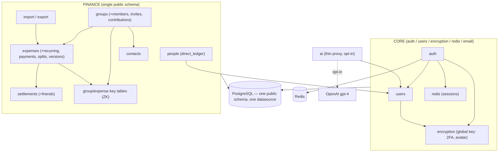
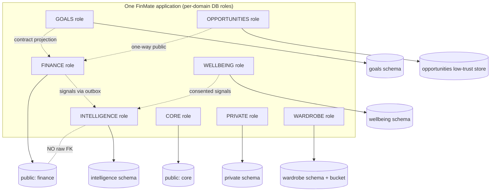
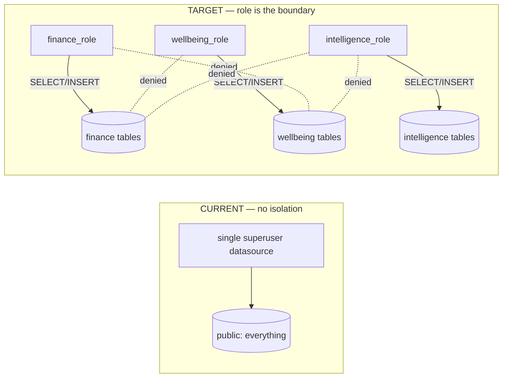
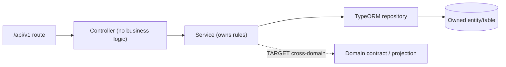
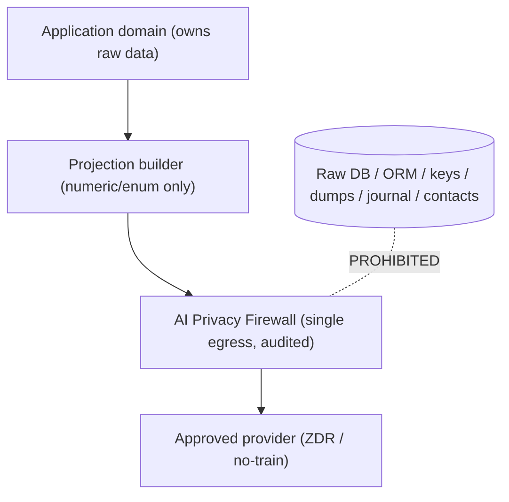

# FinMate — Module & Data Ownership Map

**Document #15.** **Nature:** discovery + architecture documentation only. Authorises **no** code, schema, migration, API, encryption, auth, frontend, mobile, config, or production change. No frozen decision is altered. **Read-only.**

**Governing (frozen) sources:** [FINMATE_CURRENT_SYSTEM_FUNCTIONALITY_BASELINE.md](FINMATE_CURRENT_SYSTEM_FUNCTIONALITY_BASELINE.md) · [FINMATE_SRS.md](FINMATE_SRS.md) · [FINMATE_DECISION_LEDGER.md](FINMATE_DECISION_LEDGER.md) · [FINMATE_DATA_CLASSIFICATION_ENCRYPTION_MATRIX.md](FINMATE_DATA_CLASSIFICATION_ENCRYPTION_MATRIX.md) · [FINMATE_SECURITY_PRIVACY_ARCHITECTURE.md](FINMATE_SECURITY_PRIVACY_ARCHITECTURE.md) · [FINMATE_KEY_MANAGEMENT_ARCHITECTURE.md](FINMATE_KEY_MANAGEMENT_ARCHITECTURE.md) · [FINMATE_AI_DATA_ACCESS_PRIVACY_FIREWALL.md](FINMATE_AI_DATA_ACCESS_PRIVACY_FIREWALL.md) · [FINMATE_THREAT_MODEL.md](FINMATE_THREAT_MODEL.md) · [ADR_INDEX.md](ADR_INDEX.md)

**Authority rule:** the **repository** is authoritative for CURRENT implementation; the **frozen SRS/architecture** are authoritative for TARGET behaviour. Where they disagree it is recorded, never silently reconciled (see *Reconciliation*).

**Status labels:** **CURRENT** (verified in repo) · **PARTIAL** (some implementation) · **PLACEHOLDER** (UI/schema exists, feature not functional) · **TARGET** (planned, not built) · **[ENG-UNKNOWN]** (insufficient evidence).

**Reading model (FinMate style):** each major section is written twice — a **Simple explanation** (anyone can follow) then a **Technical explanation** (the engineering rule). Diagrams are Mermaid.

> **The single most important rule of this document:** ownership was **not designed from scratch.** CURRENT ownership was read from the repository first; TARGET ownership is mapped from the frozen architecture. Nothing here invents a module, an entity, or a permission.

---

## How to read this map

```
CURRENT REPOSITORY  →  CURRENT MODULE OWNERSHIP  →  TARGET DOMAIN OWNERSHIP
        →  DATABASE OWNERSHIP  →  API OWNERSHIP  →  AI / INTELLIGENCE BOUNDARIES
        →  FUTURE IMPLEMENTATION BOUNDARY
```

| Part | Question it answers |
|---|---|
| 1 | What modules exist **today**? |
| 2 | Who owns each **entity/table** today? |
| 3 | What does the **current** architecture look like? |
| 4 | What are the **target domains**? |
| 5 | Who may **access what** across domains? |
| 6 | Why schema ≠ isolation; what real isolation means |
| 7 | Who owns each **API**? |
| 8 | How AI gets data (and what it never gets) |
| 9 | Who owns each **security operation** |
| 10 | Every CURRENT→TARGET ownership change + compatibility |
| 11 | The "who owns what?" table a student can read |
| 12 | Current ownership **red flags** (record, don't fix) |
| 13 | **What we may build now vs. what must wait** |

---

# PART 1 — Current Module Inventory (CURRENT)

### Simple explanation
Today FinMate is **one app, one server, one database**. It is split into folders ("modules") like *auth*, *expenses*, *groups*, *people*. Each folder does one job. A few folders described in the architecture (wellbeing, wardrobe, the AI firewall) **don't exist yet** — only empty tables or plans.

### Technical explanation
Nx monorepo: Angular (Web/PWA + Capacitor wrap) → NestJS REST (`/api/v1`) → PostgreSQL (single `public` schema) + Redis. **[CURRENT FACT]** All TypeORM entities live in a **shared library** `shared/data-models/src/lib/*` — both backend and (types) frontend depend on it; there is **one** ORM datasource (`backend/src/ormconfig.ts`).

## 1.1 Backend modules

Source root: `backend/src/app/`.

| Module | Path | Status | Responsibility | Controllers | Key services | Entities touched | Encryption | AuthZ |
|---|---|---|---|---|---|---|---|---|
| **auth** | `app/auth` | CURRENT | register/login/logout, refresh, 2FA, reset, verify | `auth.controller.ts` | `AuthService` | `users` (+Redis) | argon2 hash; server AES-GCM 2FA secret | public + `JwtAuthGuard`; `MfaGuard` |
| **users** | `app/users` | CURRENT | profile, avatar, lookup, recovery-key endpoints | `users.controller.ts` | `UsersService` | `users`, `profiles` | server AES-GCM avatar | `JwtAuthGuard` |
| **contacts** | `app/contacts` | CURRENT | non-user PII, claim flow | `contacts.controller.ts` | `ContactsService` | `contacts` | none | `JwtAuthGuard` |
| **expenses** | `app/expenses` | CURRENT | expenses, splits, payments, refunds, carry-forward, history | `expenses.controller.ts`, `recurring-expenses.controller.ts` | `ExpensesService` + `services/*` (crud, edit-policy, analytics, carry-forward, export-query, recurring) | `expenses`, `expense_splits`, `expense_payments`, `expense_versions`, `expense_split_versions`, `recurring_expenses`, `recurring_expense_splits`, `encrypted_expense_keys` | reads client E2EE title/desc (ciphertext) | `JwtAuthGuard` (+ group role via groups) |
| **groups** | `app/groups` | CURRENT | groups, members, invites, contributions, **group keys** | `groups.controller.ts`, `members.controller.ts`, `invite.controller.ts` | `GroupsService` + `services/*` (crud, membership, contributions, audit) | `groups`, `group_members`, `group_member_contributions`, `group_invites`, `encrypted_group_keys`, `member_wrapped_group_keys`, `group_key_versions` | stores wrapped keys (ZK) | `JwtAuthGuard` + `GroupRolesGuard` |
| **settlements** | `app/settlements` | CURRENT | settlements + friends (derived balances) | `settlements.controller.ts`, `friends.controller.ts` | `SettlementsService` | `settlements`, `settlement_versions` | `note` plaintext (CURRENT) | `JwtAuthGuard` (+ group role) |
| **people** | `app/people` | CURRENT | P2P lend/borrow/settle | `people.controller.ts` | `PersonLedgerService` | `direct_ledger_entries` | `note` plaintext (CURRENT) | `JwtAuthGuard` |
| **import** | `app/import` | CURRENT / Partial | spreadsheet import + export | `import.controller.ts`, `export.controller.ts` | `ImportService` (export via `expenses/services/expenses-export-query`) | `expenses` (+ related) | reads/writes E2EE fields | `JwtAuthGuard` + throttle |
| **ai** | `app/ai` | **PARTIAL** | thin opt-in proxy → OpenAI | `ai.controller.ts` | `AiService` | none | `redactUuids()` only | `JwtAuthGuard` + `aiOptIn` gate |
| **encryption** | `app/encryption` | CURRENT | server AES-256-GCM (2FA, avatar) | — | `EncryptionService` | 2FA secret, avatar | global `ENCRYPTION_KEY` | n/a |
| **email** | `app/email` | CURRENT | Resend transactional mail | — | `EmailService` | none | n/a | n/a |
| **redis** | `app/redis` | CURRENT | sessions, tokens, throttle counters | — | `RedisService` | Redis only | argon2 session hashes | n/a |
| **common / filters / interceptors / guards / throttler** | `app/*` | CURRENT | shared utils, error filter, logging + audit interceptor, throttle guards | — | interceptors, `ConditionalThrottleGuard`, `UserThrottlerGuard` | `audit_logs` | `ipHash` (SHA-256) | n/a |
| **app** | `app/` | CURRENT | health + root | `app.controller.ts` | `AppService` | none | none | public |

**Cross-module dependency reality (CURRENT):** `groups ↔ expenses ↔ settlements ↔ contacts ↔ keys`, all in one schema, one datasource. `auth → users, redis, encryption, email`. `people → users`. `ai → users (aiOptIn)`.

## 1.2 Frontend feature areas

Source root: `frontend/src/app/`.

| Area | Path | Status | Notes |
|---|---|---|---|
| auth | `features/auth` | CURRENT | login/register/reset/verify/2FA, crypto-recovery panel |
| dashboard | `features/dashboard` | CURRENT | aggregation + **AI chatbot**; `dashboard-goals` component = **PLACEHOLDER** (no goals API) |
| groups | `features/groups` | CURRENT | group detail, create-expense modal, history log |
| friends | `features/friends` | CURRENT | group-derived balances |
| people | `features/people` | CURRENT | P2P |
| core (crypto/auth) | `core/*` | CURRENT | `ZkKeyVaultService` (IndexedDB master key), `GroupKeyService`, `ExpenseDecryptionService`/coordinator, `crypto-recovery-*`, `AuthService`/`token-refresh.service` |

## 1.3 Placeholder / target modules (NOT built)

| Item | Status | Evidence |
|---|---|---|
| **Goals** | PLACEHOLDER | `goals` table (InitialSchema) + `dashboard-goals` UI; **no controller/service/API** |
| **Notes** | PLACEHOLDER / [ENG-UNKNOWN] | `notes` entity with E2EE fields; **no controller found**; UI unknown |
| **Attachments** | TARGET | `attachments`/`attachment_versions`/`receipt_versions` entities; **no storage service, no upload path** |
| **Notifications** | TARGET | no module, no table |
| **Wellbeing / Wardrobe / Opportunities / Intelligence** | TARGET | no module, no table |
| **AI Privacy Firewall / domain isolation / per-domain keys** | TARGET | single schema; thin proxy only |

---

# PART 2 — Data Ownership (per entity)

### Simple explanation
Every table has **one owner module** (who is allowed to create/change it), some **readers**, and a protection level. The rule: a module should touch its **own** tables, and reach another module's data only through that module's service — never by reading its raw tables directly.

### Technical explanation
Owner = the module whose service performs writes. Encryption class from the frozen Matrix: **E2EE (Zone 1a, Class A)** · **Server-managed (Class B)** · **plaintext-but-protected (Zone 2)** · **SECURITY_SECRET**. AI-access and cross-domain columns follow the frozen access matrices (Security §7, AI §4, Matrix §7/§11). Entities live in `shared/data-models/src/lib/*`.

| Entity | Owner (CURRENT) | Readers | Writers | Sensitivity | Encryption (CURRENT → TARGET) | AI access | Cross-domain | Deletion owner | Export owner |
|---|---|---|---|---|---|---|---|---|---|
| **users** | auth/users | all modules (id/FK) | auth, users | PERSONAL + SECURITY_SECRET | argon2 hash; 2FA server AES-GCM; wrapped keys E2EE | DENY (auth data) | CORE ids to all (narrow) | auth (tombstone-in-place) | users |
| **profiles** | users | users, finance (income/budget) | users | PERSONAL + SENSITIVE (income Zone 2) | plaintext-but-protected; avatar server AES-GCM | income: COND projection only (FLD-5); raw DENY | FINANCE reads income | users | users |
| **expenses** | expenses | expenses, groups, settlements(derived), import, dashboard | expenses | Zone 1a title/desc + Zone 2 amounts | title/desc **E2EE (unchanged, K-3)**; amounts plaintext-but-protected | amounts COND (numeric projection); title/desc DENY | FINANCE-internal | expenses (soft-delete) | expenses/import |
| **expense_payments** | expenses | expenses, settlements(derived) | expenses | Zone 2 (R) | plaintext-but-protected | COND (numeric) | FINANCE | expenses | expenses |
| **expense_splits** | expenses | expenses, settlements(derived) | expenses | Zone 2 (R) | plaintext-but-protected | COND (numeric) | FINANCE | expenses | expenses |
| **expense_versions / expense_split_versions** | expenses | expenses | expenses | inherits parent | inherits parent (ciphertext stays ciphertext) | as parent | FINANCE | expenses | expenses |
| **recurring_expenses (+ _splits)** | expenses (recurring) | expenses, scheduler | expenses | Zone 1a title/desc + Zone 2 | title/desc E2EE; amounts plaintext | as expenses | FINANCE | expenses | expenses |
| Refund data | expenses | expenses, settlements | expenses | as expenses (`transactionType='refund'`, negative) | as expenses | as expenses | FINANCE | expenses | expenses |
| **groups** | groups | groups, expenses, settlements, invites | groups | `name`/`description` free-text; else INTERNAL | name plaintext-but-protected (FLD-3); **description plaintext CURRENT → E2EE TARGET (FLD-2)** | name DENY-by-default; description DENY | FINANCE | groups (tombstone identity) | groups |
| **group_members** | groups | groups, expenses, settlements, contacts | groups | R + `nickname` PERSONAL | nickname plaintext-but-protected, group-scoped (FLD-4) | DENY default | FINANCE (group-scoped) | groups | groups |
| **group_member_contributions** | groups | groups, expenses (household) | groups | Zone 2 | plaintext-but-protected | COND (numeric) | FINANCE | groups | groups |
| **group_invites** | groups | groups, invite flow | groups | `invitedEmail` PERSONAL; `wrappedGroupKey` SECRET; token SECRET | invitedEmail plaintext-but-protected + retention (FLD-7); wrappedGroupKey E2EE | DENY | FINANCE | groups | none |
| **settlements** | settlements | settlements, friends, groups | settlements | Zone 2 amount + `note` free-text | **note plaintext CURRENT → E2EE TARGET (FLD-1)** | amount COND (numeric); note DENY | FINANCE | settlements (immutable; tombstone identity) | settlements |
| **settlement_versions** | settlements | settlements | settlements | inherits parent | inherits parent | as parent | FINANCE | settlements | settlements |
| **direct_ledger_entries (P2P)** | people | people | people | Zone 2 amount + `note` free-text | **note plaintext CURRENT → E2EE `direct_shared` TARGET (B-2)** | amount COND (numeric); note DENY | FINANCE/People | people (soft-delete; tombstone identity) | people |
| **contacts** | contacts | contacts, groups, people (claim) | contacts | PERSONAL (3rd-party) | plaintext; TARGET minimize (CNT-1) | **DENY (CNT-1)** | FINANCE/CONTACTS | contacts | contacts |
| **notes** | (none) PLACEHOLDER | [ENG-UNKNOWN] | [ENG-UNKNOWN] | Zone 1a | E2EE fields present | DENY | — | [ENG-UNKNOWN] | [ENG-UNKNOWN] |
| **goals** | (none) PLACEHOLDER | dashboard-goals UI | — | Zone 1a title + Zone 2 amounts | title plaintext(empty) **→ E2EE born (B-1)**; amounts Zone 2 | title DENY; progress COND (numeric) | GOALS→FINANCE (TARGET) | GOALS (TARGET) | GOALS (TARGET) |
| **attachments (+ _versions, receipt_versions)** | (none) TARGET | — | — | Zone 1a | `encryptedFileKey`/`encryptedOriginalName` E2EE; **`originalName` plaintext dup (SEC-W6c)** | DENY | — | TARGET | TARGET |
| **audit_logs** | interceptor/common | security ops | interceptor | INTERNAL + `metadataJson` PERSONAL (email, SEC-W7) | `ipHash` SHA-256; metadata plaintext | DENY | actorUser FK | retained (tombstone) | admin |
| **encrypted_group_keys / member_wrapped_group_keys / group_key_versions** | groups (key mgmt) | client (unwrap) | groups | SECURITY_SECRET | E2EE (ZK, versioned) | DENY | — | groups | none |
| **encrypted_expense_keys** | expenses (direct-shared) | client (unwrap) | expenses | SECURITY_SECRET | E2EE (per-participant) | DENY | — | expenses | none |
| Sessions (Redis) | auth/redis | auth | auth | SECURITY_SECRET | argon2 hash of refreshId | DENY | — | auth (`revokeAllSessions`) | none |
| Consent | **(none) — `users.aiOptIn` bool only (CURRENT)** | ai, users | users | INTERNAL (consent) | plaintext bool; TARGET consent ledger (CON-3) | n/a | all (gate) | users | users |

**[REQUIREMENT]** Version/history tables **inherit** the parent field's classification and protection (Matrix §5.19) — encrypted parent fields stay ciphertext in snapshots.

---

# PART 3 — Current Ownership Diagram (CURRENT)

### Simple explanation
Everything runs in one app and talks to one database. The money modules lean on each other, and one shared "key vault" area protects the locked words. There are **no walls** between modules at the database level yet — that's the big thing this map flags for the future.

### Technical explanation — **CURRENT FACT**


**What this diagram tells a student:** the boxes are just folders — under them there is **one** database with **one** login. Any module *could* read any table. Today the only real walls are the login check (`JwtAuthGuard`), the group-role check, and the fact that private words are **locked with your key** so even the server can't read them.

---

# PART 4 — Target Domain Model (TARGET)

### Simple explanation
In the future, FinMate is split into separate **rooms** that can't automatically see each other. Your wardrobe room can't reach your bank room. A "brain" room (INTELLIGENCE) that gives tips never gets a copy of your data — only tiny labelled hints.

### Technical explanation — **TARGET** (from Security §3, Matrix §10; nothing here is built)

| Domain | Purpose | Data owned | Allowed readers | Allowed writers | Forbidden readers | Enc class | DB schema | DB principal | API boundary | AI boundary | Deletion | Export |
|---|---|---|---|---|---|---|---|---|---|---|---|---|
| **CORE** | users, auth, settings, keys | users, profiles, sessions, consent ledger, key material | all domains (narrow ids) | CORE | — | SECURITY_SECRET + PERSONAL | `public` (stays) | existing | auth/users APIs | DENY (auth data) | account deletion owner | user export |
| **FINANCE** | expenses, groups, settlements, P2P, income, statements | (all current FINANCE entities) | FINANCE; **emits projections** | FINANCE | raw export to AI | Zone 2 + Zone 1a | `public` (stays) | existing | finance APIs | numeric/enum projections only | tombstone shared | user export |
| **GOALS** | goals, priorities, progress | goals-v2 | GOALS; reads FINANCE via **contract** | GOALS | raw cross-domain | Zone 1a + Zone 2 | **new schema** | **new role** | goals API (TARGET) | progress numeric only | crypto-shred key | user export |
| **PRIVATE** | journal, private notes | journal | user (client-only) | user (E2EE) | server plaintext | Zone 1a E2EE | **new schema** | **new role** | private API (TARGET) | **DENY external AI** | crypto-shred | user export |
| **WELLBEING** | mood, routines | mood metrics | user; gated analysis | WELLBEING | AI by default | **Zone 1b Class B** | **new schema** | **new role** | wellbeing API (TARGET) | COND (post-DPIA, numeric, consent) | crypto-shred per-user key | user export |
| **WARDROBE** | clothing, style, photos | inventory + photos | user; vision on demand | WARDROBE | finance/health | Zone 3 + Zone 1a photos | **new schema + object bucket** | **new role** | wardrobe API (TARGET) | approved-provider only, fail-closed | crypto-shred | user export |
| **OPPORTUNITIES** | public scraped/licensed data | public data | one-way → recommendations | OPPORTUNITIES | user raw data | PUBLIC | **separate low-trust store/service** | **new role** | opportunities API (TARGET) | egress allowlist (SCR-1) | n/a (public) | n/a |
| **INTELLIGENCE** | derived insights, personalization, AI memory | signals + provenance + derived facts | owner (own) | INTELLIGENCE | **raw copies / raw FKs** | derived-sensitive (Class B) | **new schema** | **new role** | intelligence API (TARGET) | COND projection | crypto-shred + suppression survives | user export |

**Locked invariant (ISO-2 / ADR-008):** INTELLIGENCE never holds raw copies or foreign keys into raw domain tables. It receives **small signals + provenance (domain + opaque source IDs) + confidence + date + legal-basis/consent scope** only.

**TARGET domain map**


---

# PART 5 — Cross-Domain Access (ALLOW / DENY / CONDITIONAL)

### Simple explanation
This is the "who is allowed into whose room" list. Most doors are **shut by default**. A few are open just a crack — and only through a proper doorway (a service/contract), never by climbing in a window (raw table read).

### Technical explanation
Every rule below is traced to a frozen source. **CONDITIONAL** = allowed only through a defined gate (contract/projection, consent, DPIA flag, break-glass). **Deny-by-default** is the baseline (ISO-1/2/3, ADR-007/008).

| From → To | Rule | Gate / Mechanism | Source |
|---|---|---|---|
| FINANCE → CORE ids (`users.id`) | **ALLOW** (narrow) | FK-only narrow grant, not blanket | ISO-1, Security §4 |
| GOALS → FINANCE data | **CONDITIONAL** | synchronous **projection-pull contract** (correctness-critical) | Matrix §12, ISO-3 |
| Any domain → another domain's **raw tables** | **DENY** | deny-by-default; cross-schema JOIN from restricted role prohibited | ISO-1/2, ADR-007 |
| FINANCE → INTELLIGENCE | **CONDITIONAL** | **small signals + provenance via durable outbox** (OUT-1); no raw rows/FK | ISO-2, ADR-008 |
| WELLBEING → INTELLIGENCE | **CONDITIONAL** | consented signals only; no raw mood | A3, INT, Matrix §12 |
| INTELLIGENCE → raw FINANCE tables | **DENY** | ISO-2 locked invariant (no raw FK/keys) | ADR-008 |
| INTELLIGENCE → domain encryption keys | **DENY** | never holds raw domain keys | Key doc §7, AI §9 |
| WARDROBE → FINANCE / WELLBEING (health) raw | **DENY** | domain isolation | Security §3 |
| PRIVATE (journal) → server plaintext | **DENY** | Zone 1a E2EE; server holds ciphertext only | Z-1, K-1 |
| PRIVATE / journal → external AI | **DENY** | E2EE free-text never egresses | AI §4 |
| OPPORTUNITIES → user raw data | **DENY** (one-way in only) | public data flows **in**; user data never flows out to it | SCR-1, Security §3 |
| Contacts PII → INTELLIGENCE / AI / personalization | **DENY** | CNT-1/CNT-2 | AI §16 |
| AI provider → database / ORM / keys / dumps | **DENY** | never crosses the firewall | AI §17, ADR-009 |
| AI provider → approved numeric/enum projection | **CONDITIONAL** | firewall + external-AI consent + ZDR provider | AI-1/2/5, ADR-009/010/011 |
| External AI → Zone-2 finance (amounts) | **CONDITIONAL** | numeric projection + consent | Security §7 |
| External AI → group.name (FLD-3) / nickname (FLD-4) | **DENY by default** | not sent unless specifically permitted | FLD-3/4 |
| External AI → WELLBEING mood | **DENY by default** | only internal, post-DPIA, consented | A3, INT-3/DPIA-1 |
| External AI → wardrobe image | **CONDITIONAL** | approved/ZDR provider **only**; fail-closed | WARD-1, ADR-012 |
| Analytics → Zone-2 finance | **CONDITIONAL** | aggregates only | Security §7 |
| DBA/backend → Zone-2 finance plaintext | **ALLOW (residual ⚠OPS-1)** | least-privilege + audit; recorded insider residual | OPS-1 |

**[REQUIREMENT]** Consent/legal-basis is checked at the **point of combination** of signals, not only at collection (ISO-4, AI §8).

---

# PART 6 — Database Isolation (CURRENT vs TARGET)

### Simple explanation
Putting files in different folders is **not** security. If one master key opens every folder, a thief who steals it opens everything. Real security gives each room its **own login** that can only open its own room.

### Technical explanation

**CURRENT FACT:** one TypeORM datasource, all ~27 tables in the `public` schema, one DB principal. No role isolation. Protection today = TLS + at-rest infra encryption + `JwtAuthGuard` + group-role guard + client E2EE for free-text. The residual **OPS-1** (DBA/backend can read Zone-2 finance plaintext) exists precisely because there is no role boundary.

**TARGET (ISO-1 / ADR-007, additive):**
- New sensitive domains use dedicated schemas **plus genuinely separate database principals** (per-domain datasources/pools, or carefully designed RLS). **A single superuser ORM connection would defeat isolation and is explicitly prohibited.**
- Existing **CORE/FINANCE stay in `public`** (backward compatibility — no risky reshuffle of live finance data).
- Cross-domain access happens only through **defined contracts/projections**, never cross-schema JOINs from a restricted role. CORE gets **narrow** grants where FKs require it (`users.id`), never blanket access.
- **INTELLIGENCE has no raw-domain FKs** (ISO-2).


> **"Different folders are not security."** The **role/principal boundary — not the schema name — is the control** (Security §4). The domain service must connect with the correct principal; cross-domain raw reads are denied.

---

# PART 7 — API Ownership (CURRENT → TARGET)

### Simple explanation
Each web address ("route") belongs to one controller, which calls one service, which owns some data. Below is who owns what today, and which routes are sensitive to change because live apps depend on their exact shape.

### Technical explanation — CURRENT controllers (~88 routes, all under `/api/v1`)

| API (base) | Controller | Service | Data | Status |
|---|---|---|---|---|
| `/auth` (12) | `auth.controller` | `AuthService` | users, Redis | CURRENT · **MIGRATION-SENSITIVE** (AU-1/2/4 response contract) |
| `/users` (10) | `users.controller` | `UsersService` | users, profiles | CURRENT |
| `/contacts` (4) | `contacts.controller` | `ContactsService` | contacts | CURRENT |
| `/expenses` (15) | `expenses.controller` | `ExpensesService` (+services) | expenses, splits, payments, versions | CURRENT |
| `/recurring-expenses` (6) | `recurring-expenses.controller` | `RecurringExpensesService` | recurring_expenses(+splits) | CURRENT (beta) |
| `/groups` (20) | `groups.controller` | `GroupsService` (+services) | groups, keys, contributions | CURRENT · `/groups/:id/keys/me` **MIGRATION-SENSITIVE** (SEC-KI1 versionId) |
| `/groups/:id/members` (4) | `members.controller` | `GroupsMembershipService` | group_members, contacts | CURRENT |
| `/invite-links` (1) | `invite.controller` | `GroupsService` | group_invites | CURRENT |
| `/groups/:groupId/settlements` (4) | `settlements.controller` | `SettlementsService` | settlements | CURRENT · TARGET note E2EE (FLD-1) |
| `/friends` (1) | `friends.controller` | `SettlementsService` | derived balances | CURRENT |
| `/people` (6) | `people.controller` | `PersonLedgerService` | direct_ledger_entries | CURRENT · TARGET note E2EE (B-2) |
| `/import` (1) | `import.controller` | `ImportService` | expenses | CURRENT/Partial |
| `/export` (1) | `export.controller` | export-query service | expenses | CURRENT/Partial |
| `/ai` (1: `POST /ai/proxy`) | `ai.controller` | `AiService` | none | **PARTIAL** · **MIGRATION-SENSITIVE** (TARGET firewall/intent supersedes) |
| `/` (2: health, root) | `app.controller` | `AppService` | none | CURRENT |

**TARGET APIs (not built):** goals, notifications, journal/private, wellbeing, wardrobe, opportunities, **AI firewall (`intent + params`, server-owned model/prompt — replaces `/ai/proxy`)**, intelligence. Each = new domain → new API boundary → service → repository under its own DB principal. **Do not change existing contracts** (flagged for the SRS/migration plan).



---

# PART 8 — AI Ownership & Boundaries

### Simple explanation
The AI is **never** given the database key. When you ask for AI help, FinMate takes out only what's needed, strips out anything unnecessary, and hands the AI **one sentence of maths** — never your raw transactions, journal, contacts, or photos.

### Technical explanation


**CURRENT (PARTIAL):** one opt-in `POST /ai/proxy` forwards a client-supplied prompt to OpenAI `gpt-4` with `redactUuids()` only. `aiOptIn` gate enforced. No projection, no firewall, no numeric-only enforcement. **The firewall does not exist.**

**TARGET boundary — AI MUST NOT directly access** (AI §17, ADR-009): database · ORM · encryption keys · production dumps · raw journal/free-text · contacts · credentials.

**INTELLIGENCE holds** (ADR-008, INT-2): signals · provenance (domain + opaque source IDs) · confidence · date · legal-basis/consent scope · derived facts.
**INTELLIGENCE must NOT hold:** raw domain databases · raw foreign keys · domain encryption keys.

**Firewall pipeline (AI-1, fail-closed):** `identity → purpose → legal-basis/consent → classification → minimization → projection → sensitive-data check → provider policy → call → validate response → return`. Any failed check → **fail closed** (nothing sent). `assistant_qa` is stateless; the user's question is **untrusted input** (AI-3).

---

# PART 9 — Ownership of Security Operations

### Simple explanation
Different jobs — logging in, locking data, remembering keys, deleting an account — each have **one team responsible**, one backup they lean on, and a known "what happens if it breaks."

### Technical explanation

| Operation | Owner (CURRENT) | Backup / dependency | Access level | Failure mode |
|---|---|---|---|---|
| Authentication | `auth` (`AuthService`) | Redis, encryption | argon2 + JWT | login blocked; no data exposure |
| Authorization | `JwtAuthGuard` + `GroupRolesGuard` | route metadata | per-route/role | over-deny (safe); IDOR coverage [ENG-UNKNOWN] (T-17) |
| Encryption (client E2EE) | frontend `ZkKeyVaultService` / `GroupKeyService` | Web Crypto, IndexedDB | user-only keys | key loss → data unreadable (recovery mitigates) |
| Encryption (server) | `EncryptionService` | global `ENCRYPTION_KEY` | 2FA + avatar only | narrow blast radius |
| Key management | `groups` (wrapped-key endpoints) + client | RSA-OAEP / TIK / recovery | ZK (server never holds plaintext) | **versionId honored (SEC-KI1 VERIFIED 2026-08-13)**; rotated history decrypts; residual GRP-007 display-only |
| Recovery | frontend crypto-recovery + `users` recovery endpoints | recovery-wrapped keys | user-held code | optional today (REC-1 → mandatory TARGET) |
| Sessions | `auth` + `redis` | Redis TTL + argon2 | server-side hashes | `revokeAllSessions` on reset/logout |
| Consent | `users.aiOptIn` bool (CURRENT) → consent ledger (TARGET CON-3) | — | per-feature gate | fail-closed for AI egress (TARGET) |
| Deletion | **TARGET** (DEL-1/ADR-019) — no dedicated service today | outbox, tombstones | personal erase + shared tombstone | NOT-NULL FKs forbid row-DELETE → anonymize-in-place |
| Export | `export.controller` + expenses export-query | E2EE round-trip | user-owned | none critical |
| Audit logging | logging/audit interceptor | `audit_logs` | `ipHash`; **email in metadata (SEC-W7)** | log leakage (SEC-W2/W7) |
| AI firewall | **TARGET** (ADR-009) — not built | projection builders | single egress | fail-closed |
| Provider selection | **TARGET** (VEN-1) | verified ZDR register | approved only | fail-closed |
| Domain isolation | **TARGET** (ISO-1/ADR-007) — single schema today | DB principals | per-domain role | isolation absent today (T-09) |
| Notification delivery | **TARGET** (NOT-1) — not built | — | content-free payloads | n/a |

---

# PART 10 — Backward Compatibility (CURRENT → TARGET ownership changes)

### Simple explanation
FinMate is already live. Nothing here is a "start over." New locks go on **new** records; old records and old apps keep working until people have had time to update.

### Technical explanation (each additive; from Security §19, Matrix §13, ADR-013/015/016)

| Change | CURRENT | TARGET | Why change | Compat impact | Migration | Rollback | User impact | Risk |
|---|---|---|---|---|---|---|---|---|
| **P2P note encryption** | `direct_ledger.note` plaintext (prod) | E2EE `direct_shared` + marker | server plaintext exposure (B-2) | readers branch on marker | additive marker + **client** backfill, permanent mixed-state | keep plaintext branch | none for existing | Med |
| **Settlement note encryption** | `settlement.note` plaintext (prod) | E2EE + marker (group key) | same (FLD-1) | reader branch | additive marker + client backfill | plaintext branch | none | Med |
| **Group description encryption** | `group.description` plaintext (prod) | E2EE + marker (group key) | same (FLD-2) | **pre-join display [ENG-UNKNOWN]** must degrade | additive marker + client backfill | plaintext branch | must not break member display | Med |
| **Auth refresh transport** | refresh token in **body** | HttpOnly Lax cookie (web) + Keychain/Keystore header (native) + CSRF | XSS token theft (SEC-W3/T-02) | **breaks on hard cutover** | dual-emit + min-version (AU-4/ADR-015) | re-enable body emit | none if phased | Med (only breaking edge) |
| **Database isolation** | single schema, one principal | schemas + per-domain roles | isolation absent (T-09/ISO-1) | additive (new domains only) | additive schemas/roles | revert grants | none | Med |
| **AI proxy → firewall** | thin `/ai/proxy` (client prompt/model) | intent + server prompt + projection firewall | AI over-exposure (T-08/T-13) | chatbot rework; flaggable off | additive, feature flag | old proxy off | chatbot behaviour change | Med |
| **Goals** | placeholder (empty table) | goals-v2 born-E2EE | new feature (B-1) | none (empty) | none (clean) | drop feature | none | Low |
| **Notifications** | none | in-app ranked V1; push deferred | new feature (NOT-1/ADR-021) | additive | additive | disable | none | Low |
| **Native mobile capabilities** | Capacitor wrap, body token | secure storage + push + deep links | native hardening (AU-1) | additive; capability-gated | additive | fall back to wrap | none | Low |
| **group.name / nickname / income / existing E2EE** | plaintext-but-protected / E2EE | **no migration** | stays functional/readable (FLD-3/4/5, K-3) | none | none | n/a | none | — |

**[REQUIREMENT]** Never assume clean-slate; every prod-data encryption uses additive marker + client backfill + **permanent mixed-state** (ADR-016).

---

# PART 11 — "Who Owns What?" (simple view)

### Simple explanation
If you remember nothing else, remember this table.

| Thing | Owner | Can read | Can change | Protected how |
|---|---|---|---|---|
| Your password | you (via login) | nobody (only a hash stored) | you | argon2 hash — never stored readable |
| Your expense **words** (title/notes) | you | **only you** | you | locked with your key (E2EE) — server can't read |
| Your expense **numbers** (amounts) | FINANCE (expenses) | you + FinMate's finance helper | you | login + role checks + encrypted storage (not field-locked, so maths works) |
| Group data key | groups + you | you (unwrap on device) | groups (rotation) | wrapped so the server holds only a locked copy |
| Who owes whom | settlements / people | you + the other person | the system (derived, not stored) | computed live from your entries |
| A friend's contact info | contacts | you (who added them) | you | kept minimal; **never** sent to AI |
| Your journal (future) | you (PRIVATE) | **only you** | you | E2EE; **never** to server plaintext or AI |
| Your mood (future) | WELLBEING | you + gated analysis | you | server-managed key; off by default; needs your yes |
| Tips about you (future) | INTELLIGENCE | you | the brain (from hints only) | gets labelled hints, never your database |
| What the AI sees | the firewall | AI sees a tiny number summary | — | one guarded door; raw data never crosses |

---

# PART 12 — Red Flags (CURRENT RISK — record, do NOT fix)

### Simple explanation
Here are the weak spots in **today's** ownership. This document only writes them down — it does not change anything.

### Technical explanation

| ID | Current risk | Severity | Evidence | Affected module | Target control | Related |
|---|---|---|---|---|---|---|
| **RF-1 (OPS-1)** | Single shared datasource/`public` schema — any module could read any table; DBA/backend read Zone-2 finance plaintext | High (residual) | one `ormconfig.ts` datasource; 27 tables in `public` | all | per-domain DB principals (ISO-1) | ADR-007, T-09 |
| **RF-2 (T-09)** | No cross-domain authorization boundary at the DB layer (schema-name ≠ isolation) | High | no roles/grants isolating modules | all | role boundary | ADR-007 |
| **RF-3 (SEC-KI1)** | ~~Group-key `versionId` ignored on `/keys/me` → rotated history undecryptable~~ → **RESOLVED/VERIFIED 2026-08-13**: versionId honored end-to-end (fixed 2026-07-17); canonical history decrypts after rotation. Residual **GRP-007** (history-log display placeholder only). See [FINMATE_SEC_KI1_VERIFICATION.md](FINMATE_SEC_KI1_VERIFICATION.md). | ~~Med~~ → Low (display-only residual) | Security §18, baseline §11 | groups (key mgmt) | serve requested versionId (done) | Key doc |
| **RF-4 (SEC-W3/T-02)** | Refresh token returned in body / stored client-side → XSS theft | **P0** | baseline §10/§17 | auth | HttpOnly cookie / secure storage | ADR-013/015 |
| **RF-5 (SEC-W2)** | Tokens/email/raw IP in request + proxy logs (query strings) | **P0** | `logging.interceptor.ts` logs full URL + raw IP | interceptors/common | redact query params; hash/drop IP | Threat T-29 |
| **RF-6 (SEC-W7)** | `audit_logs.metadataJson` stores plaintext email on login | P1 | Matrix §5.18 | audit/common | minimize PII in metadata | — |
| **RF-7 (CONFLICT-2 / FLD-1/2, B-2)** | `settlement.note`, `direct_ledger.note`, `group.description` plaintext — structurally identical to already-E2EE `expense.description` | Med | Matrix §5.6/5.7/5.9 | settlements, people, groups | E2EE + mixed-state | ADR-016 |
| **RF-8 (SEC-W6c)** | `attachment.originalName` plaintext **duplicates** `encryptedOriginalName` — plaintext defeats the encryption | P1 | Matrix §5.16 | attachments (target) | drop plaintext before GA | FLD-6 |
| **RF-9 (CONFLICT-3 / T-08/T-13)** | AI `/ai/proxy` accepts **client-controlled prompt + model**, non-ZDR endpoint, no projection/firewall | Med | `ai.controller.ts`; baseline §16 | ai | single egress firewall, server-owned prompt | ADR-009/010 |
| **RF-10** | Server `EncryptionService` uses **one global key** (SHA-256 of `ENCRYPTION_KEY`) — cannot per-user crypto-shred | Low (scoped to 2FA/avatar) | Matrix §9 | encryption | per-user Class-B store for new domains | K-2 |
| **RF-11 (SEC-W9)** | `trust proxy=true` unconditional → spoofable XFF weakens IP throttle/audit | P2 | Matrix §16 | throttler/common | condition on trusted proxy | — |
| **RF-12 (IDOR, T-17)** | Object-ownership/IDOR test coverage unverified | [ENG-UNKNOWN] | baseline §18 | all guarded routes | systematic ownership tests | — |
| **RF-13** | `avatarUrl` server-encrypted but **undocumented** (drift from spec) | Low (benign) | Matrix §5.2 | users/profiles | document the drift | — |

**These are recorded, not resolved.** None is fixed in this task.

---

# PART 13 — Implementation Boundary

### Simple explanation
This is the guard rail. It says clearly what a developer (or an AI agent) may build **now** without touching the live money app, and what must **wait** for a proper migration/security decision — so nobody accidentally builds the future early and breaks today.

### ✅ MAY implement now — additive, no redesign of existing functionality
- New **goals-v2** feature (empty table → born-encrypted, B-1) — clean, no migration.
- New domains as **new schemas + new DB roles + new key stores** (GOALS/PRIVATE/WELLBEING/WARDROBE/OPPORTUNITIES/INTELLIGENCE) that **do not touch `public`** (ISO-1, additive).
- **In-app notifications V1** (ranked, quiet default; push deferred — ADR-021).
- Additive **encryption markers** + **client-side** backfill for `direct_ledger.note` / `settlement.note` / `group.description` (mixed-state, ADR-016) — provided the plaintext reader path is retained.
- Log **redaction** (query params, IP), drop email from audit metadata (SEC-W2/W7) — additive.
- Fix group-key **`versionId`** handling (SEC-KI1) — backend-local fix.
- **Projection builders** + a single **AI firewall** behind a feature flag, leaving `/ai/proxy` flaggable off (ADR-009).
- Retention purge for `invitedEmail` (FLD-7); stop populating plaintext `attachment.originalName` for new uploads (FLD-6/SEC-W6c).

### ⛔ MUST wait — needs migration / ADR / security implementation / decision
- **Moving existing CORE/FINANCE tables** out of `public` — prohibited (ISO-1 keeps them in place).
- **Field-encrypting Zone-2 numbers** (amounts, splits, income) — computation depends on them (Z-2); would break finance.
- **Auth transport hard cutover** — requires dual-emit + minimum-supported-version sunset (AU-4/ADR-015) before removing the body token.
- **Sending any raw entity / free-text / contacts to AI** — prohibited (AI-2, CNT-1) until firewall + consent ledger exist.
- **INTELLIGENCE holding raw FKs/keys** — permanently prohibited (ISO-2/ADR-008), not a "later" — never.
- **Wellbeing analysis / profiling** — flag-OFF until DPIA sign-off (INT-3/DPIA-1).
- **Wardrobe vision** — only via approved/ZDR provider, fail-closed (WARD-1/ADR-012).
- **Attachments GA** — must resolve SEC-W6c first.
- **Account-deletion service** — needs tombstone/anonymize-in-place design (DEL-1/ADR-019) because NOT-NULL user FKs forbid row-DELETE.
- Any change to **existing API response contracts** for `/auth/login`, `/auth/refresh`, `/groups/:id/keys/me`, `/ai/proxy` — migration-sensitive.

> **Rule for agents:** if a task would move live finance data, field-encrypt a Zone-2 number, give a domain raw access to another domain's tables, or send raw data to AI — **STOP and escalate.** These require an approved migration/ADR, not an implementation.

---

# Reconciliation

Checked against the frozen sources (Baseline #11, SRS, Decision Ledger, Data Classification Matrix #2, Security & Privacy Architecture #3, Key Management #4, AI Firewall #5, Threat Model, ADR_INDEX + ADRs).

- **Invented ownership:** none. Every module, entity, domain, and permission traces to the repository (CURRENT) or a frozen decision (TARGET). Undefined items are marked **[ENG-UNKNOWN]**.
- **CURRENT/TARGET confusion:** none — every domain/table/role that is not in the repo today is labelled TARGET; CORE/FINANCE stay in `public` (ISO-1).
- **Missing modules:** none — all 17 shipped areas + goals/notes/attachments/notifications/new-domains represented (Part 1).
- **Incorrect dependencies:** cross-module deps match the baseline (groups↔expenses↔settlements↔contacts↔keys; auth→users/redis/encryption/email).
- **Cross-domain access violations:** Part 5 rules restate ISO-1/2/3/4, AI-1..5, INT, ADR-007/008/009/010 — no new permission introduced; INTELLIGENCE-no-raw-FK preserved.
- **Missing compatibility requirements:** Part 10 covers P2P/settlement/group-desc E2EE, auth transport, DB isolation, AI firewall, goals, notifications, native — matching Security §19 / Matrix §13.
- **Security contradictions:** none — this map restates, does not alter, the frozen classification/access matrices.
- **API ownership inconsistencies:** Part 7 matches the baseline route/controller counts (~88 across 15 controllers) and the migration-sensitive flags.

**Contradictions found requiring a STOP-and-report:** **NONE.** The six known CURRENT-vs-TARGET gaps (refresh-in-body; plaintext P2P/settlement/group-desc notes; thin AI proxy; single schema; goals placeholder; optional recovery) are the **already-tracked** CONFLICT-1..6 from the Baseline — intended future work, not errors. No frozen document was modified.

---

# Final Report

- **Current modules discovered:** 17 backend areas (auth, users, contacts, expenses[+recurring], groups[+members/invites/contributions/keys], settlements[+friends], people, import[+export], ai, encryption, email, redis, common/filters/interceptors/guards/throttler, app) + 5 frontend feature areas (auth, dashboard, groups, friends, people) + core crypto/auth services. Placeholders: goals, notes; targets: attachments, notifications, wellbeing, wardrobe, opportunities, intelligence, AI firewall, domain isolation.
- **Entities mapped:** 27 (in `shared/data-models/src/lib/*`), each with owner/readers/writers/sensitivity/encryption/AI/cross-domain/deletion/export (Part 2).
- **Target domains mapped:** 8 (CORE, FINANCE, GOALS, PRIVATE, WELLBEING, WARDROBE, OPPORTUNITIES, INTELLIGENCE) — Part 4.
- **Cross-domain boundaries:** 20+ ALLOW/DENY/CONDITIONAL rules, all traced (Part 5).
- **Current risks:** 13 red flags (RF-1..RF-13) incl. P0 SEC-W2/W3, P1 SEC-W6c/W7/OPS-1, plus KI-1, T-09, T-08/T-13 (Part 12).
- **Compatibility-sensitive boundaries:** P2P/settlement/group-desc note E2EE, auth refresh transport, DB isolation, AI proxy→firewall, goals, notifications, native (Part 10).
- **ENG-UNKNOWN items:** notes feature functional status; IDOR/ownership coverage; group.description pre-join display surface; version/recurring-split exact columns; attachment prod rows; consent-ledger (only `aiOptIn` bool today); structured AI-memory retention; investment-AI projection policy.
- **Contradictions:** none requiring a STOP-and-report (six known CURRENT↔TARGET gaps carried from the Baseline).
- **Document path:** `docs/architecture/FINMATE_MODULE_DATA_OWNERSHIP_MAP.md`.
- **Files changed:** 1 (this new document).
- **Files NOT changed:** all source (TypeScript/Angular/NestJS), entities, controllers, services, modules, migrations, database, routes, configuration, and every frozen architecture/SRS/ADR document.
- **Confirmation:** **NO CODE was changed.** This task was read-only discovery + documentation. No code, schema, migration, API, encryption, auth, frontend, mobile, deployment, config, or frozen decision was modified.

*End of Document #15 (Module & Data Ownership Map). STOP — not proceeding to API contracts, migrations, or implementation.*
