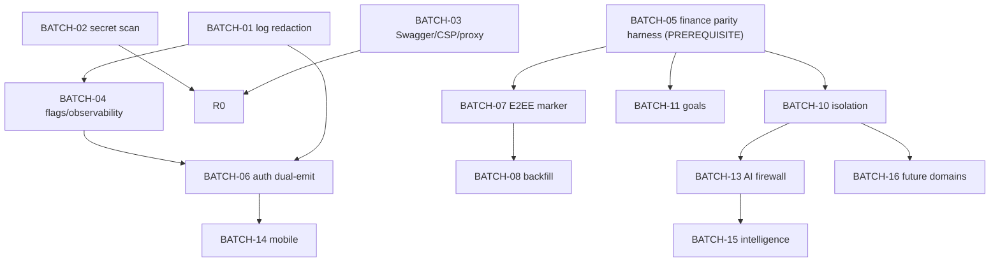

# FinMate — Pre-Implementation Execution Plan (Document #19)

**Nature:** pre-implementation **planning + repository verification** only. Authorises **no** source, entity, database, migration (create or execute), production, API-behaviour, encryption-format, package, frontend, or mobile change, and **no** commit/push/ticket. **Read-only inspection + plan.**

**Critical rule:** FinMate is a **live production application.** _"Secure the existing product without unnecessarily breaking the product."_ **SECURITY/LEGAL > EXISTING CRITICAL FUNCTIONALITY > BACKWARD COMPATIBILITY > NEW ARCHITECTURE > CONVENIENCE.** No clean-slate rewrite.

**Governing sources:** all frozen docs + Ownership Map (#15) · API Contracts (#16) · Migration Plan (#17) · Implementation Roadmap (#18) · SEC-KI1 Verification. **Authority rule:** the **repository** is authoritative for CURRENT; discrepancies with the roadmap are **reported, not silently rewritten** (§2, §13).

**Labels:** CURRENT · TRANSITION · TARGET · READY · READY-WITH-VERIFICATION · BLOCKED · ALREADY-IMPLEMENTED · PARTIALLY-IMPLEMENTED · OBSOLETE · UNKNOWN · [ENGINEERING PARAMETER] · [PRODUCT/SECURITY/LEGAL DECISION REQUIRED] · [OWNER TO ASSIGN].

**Companion:** [PRE_IMPLEMENTATION_EXECUTION_INDEX.md](PRE_IMPLEMENTATION_EXECUTION_INDEX.md).

> **SEC-KI1 = MITIGATED/VERIFIED · M-KEYVER = COMPLETE/VERIFY-ONLY — no migration, no historical re-encryption.** GRP-007, GRP-005, legacy NULL-`versionId`, REVOKED semantics remain **separate** and must not become a group-key rewrite.

---

# 1. FinMate Pre-Implementation in 5 Minutes

### Simple explanation

Before writing a single line of new code, we **look at the real app** and check what each planned job actually touches — which files, which tests, what could break. Then we sort the jobs into **small safe batches**, put **red-light gates** in front of the risky ones (money, locks, logins), and write down everything we **cannot** know just from the code (like the live server's settings). We change **nothing** yet — this is the checklist you read before you start.

### Simple explanation of what we found

The known security leaks are **still there in the code** (nothing was quietly fixed). The one exception is the group-key version bug — that one **is** fixed. The app has good finance unit tests but **not yet** a "same-answer-before-and-after" money safety net, so that net must be built before touching money code. The phone app still has **no** native powers yet.

### Technical explanation

This plan verifies every roadmap work item (W-SEC-_ … W-DOM-_) against the actual repository, classifies each READY/BLOCKED/etc., pins exact files, converts the roadmap into **16 small batches** behind **11 hard gates**, records the **actual** dependency order (which differs from the roadmap in one place — the finance parity harness must precede any finance-touching batch), and enumerates production-only unknowns. **No code, DB, migration, or production change is made.**

---

# 2. Current Code vs Roadmap — verification summary

### Simple explanation

Each planned job, judged against the real code: can we start, must we check something first, or are we blocked?

### Technical explanation (repository-verified this task + #15/#16/#17)

| Work item(s)                       | Repo evidence (files)                                                                                                                                                  | Classification                                                            |
| ---------------------------------- | ---------------------------------------------------------------------------------------------------------------------------------------------------------------------- | ------------------------------------------------------------------------- |
| W-SEC-01 secret scan/purge         | `.github/workflows/ci.yml` (no scanning); 4 encrypted-image blobs at repo root                                                                                         | **READY** (history purge = coordination/prod gate)                        |
| W-SEC-02 log redaction             | `interceptors/logging.interceptor.ts:39-44,63-74` logs full URL + raw IP                                                                                               | **READY**                                                                 |
| W-SEC-03 audit email               | `auth/auth.service.ts:82` `metadataJson: meta`                                                                                                                         | **READY-WITH-VERIFICATION** (confirm `meta` fields)                       |
| W-SEC-04 Swagger/CSP/SW            | `main.ts:20-31` CSP `unsafe-inline`; `main.ts:74` Swagger `/docs` **ungated**; SW cache = UNKNOWN                                                                      | **READY** (SW groups UNKNOWN)                                             |
| W-SEC-05 trust proxy               | `main.ts:45-49` `trust proxy` unconditional                                                                                                                            | **READY**                                                                 |
| W-PLAT-01/02 flags+observability   | none present                                                                                                                                                           | **READY** (greenfield additive)                                           |
| W-AUTH-01..04 auth transport       | `frontend/core/auth/auth.state.ts:56-58` tokens in **localStorage**; `auth.service.ts:37-40` body refresh; `main.ts:37-40` CORS `credentials:true`, **no cookie/CSRF** | **READY-WITH-VERIFICATION** (prod CORS; sunset = [ENGINEERING PARAMETER]) |
| W-ENC-01..08 E2EE migrations       | **no marker columns** on `direct-ledger-entry`/`settlement`/`group` entities; notes plaintext                                                                          | **BLOCKED** on parity harness (settlements), REC-1, prod-row verification |
| W-ISO-01..04 DB isolation          | `ormconfig.ts` single datasource; entities in `shared/data-models/src/lib/*`                                                                                           | **BLOCKED** (needs infra: schemas/principals; greenfield)                 |
| W-FIN-01 capture / W-FIN-02 parity | finance unit tests exist; **no golden-fixture parity harness**                                                                                                         | W-FIN-02 **READY (prerequisite)**; W-FIN-01 **BLOCKED** on W-FIN-02       |
| W-GOAL-\*                          | no goals controller/service (PLACEHOLDER)                                                                                                                              | **READY** (greenfield; born-E2EE)                                         |
| W-NOT-\*                           | none                                                                                                                                                                   | **READY** (greenfield)                                                    |
| W-AI-01..07 firewall               | `ai/ai.service.ts` thin proxy (client prompt+model; `redactUuids` only); no projection/consent-ledger/ZDR                                                              | **BLOCKED** (needs projection builders + consent ledger)                  |
| W-INT-_ / W-DOM-_                  | none                                                                                                                                                                   | **TARGET/BLOCKED** (V2/future)                                            |
| W-MOB-\*                           | only `@capacitor/core`+`cli`; no plugins; `capacitor.config.ts` no plugins                                                                                             | **BLOCKED** (native infra; after auth)                                    |
| **SEC-KI1 / M-KEYVER**             | `groups.service.ts:1439` honors versionId; unit-tested                                                                                                                 | **ALREADY-IMPLEMENTED / VERIFY-ONLY (no work)**                           |

**Discrepancy vs roadmap (reported, not silently changed):** the roadmap places the finance parity harness (W-FIN-02) in Phase 4, but repository evidence shows it is a **prerequisite** for any finance-touching batch (incl. the Phase-2 settlement-note E2EE). See §13. **The roadmap document is not modified.**

---

# 3. Phase 0 Execution Readiness (security prerequisites)

### Simple explanation

The known leaks, with the exact files and how to fix each safely. **None is fixed yet** (except SEC-KI1).

### Technical explanation

| ID          | Current code (exact files)                                                                           | Exact risk                     | Implementation approach                                                                 | Test approach                          | Rollback                                 | Prod dependency         | Status                                |
| ----------- | ---------------------------------------------------------------------------------------------------- | ------------------------------ | --------------------------------------------------------------------------------------- | -------------------------------------- | ---------------------------------------- | ----------------------- | ------------------------------------- |
| **SEC-W1**  | `ci.yml` (no scan); root blobs `eyJhbGc…jpg` ×4                                                      | secrets in history             | add SCA/secret-scan job; history purge + rotate                                         | scanner clean; verify history          | n/a (history op — **coordination gate**) | force-push coordination | **OPEN / READY**                      |
| **SEC-W2**  | `logging.interceptor.ts:39-44,63-74`; also `http-exception.filter.ts` IP on 429                      | tokens/email/IP in logs (T-29) | redact query string; hash/drop IP; field allowlist                                      | assert no token/PII/IP in log samples  | revert redaction                         | none                    | **OPEN / READY**                      |
| **SEC-W7**  | `auth.service.ts:82` `metadataJson: meta`                                                            | plaintext email in audit       | drop/minimize email in `meta`                                                           | assert new audit rows carry no email   | revert                                   | none                    | **OPEN / READY-WITH-VERIFICATION**    |
| **SEC-W3**  | `frontend/core/auth/auth.state.ts:56-58` localStorage tokens                                         | XSS token theft (T-02)         | move refresh to cookie/secure-storage (WS-AUTH)                                         | token absent from JS storage           | dual-emit body                           | ties to auth transition | **OPEN / BLOCKED-on-WS-AUTH**         |
| **SEC-W5**  | `main.ts:22-28` CSP `unsafe-inline`; `main.ts:74` Swagger ungated; `ngsw-config.json` groups UNKNOWN | XSS/cache/Swagger (T-21)       | gate Swagger by env; drop `unsafe-inline` (needs inline refactor); SW exclude sensitive | CSP blocks inline; Swagger 404 in prod | revert config                            | none                    | **OPEN / READY (SW UNKNOWN)**         |
| **SEC-W9**  | `main.ts:45-49` `trust proxy` unconditional                                                          | spoofable XFF                  | condition on known proxy/env                                                            | XFF trusted only behind proxy          | revert                                   | prod proxy topology     | **OPEN / READY**                      |
| **SEC-W6c** | `attachments` entity `originalName` + `encryptedOriginalName`; **upload path not implemented**       | filename leak                  | stop populating plaintext for new uploads (when built)                                  | new rows no plaintext name             | re-enable                                | attachments GA          | **OPEN / DEFERRED (feature unbuilt)** |
| **OPS-1**   | `ormconfig.ts` single superuser datasource                                                           | insider Zone-2 read            | least-priv creds + audit (WS-ISO)                                                       | access audited                         | revert grants                            | prod DB roles           | **OPEN / BLOCKED-on-WS-ISO**          |
| SEC-KI1     | `groups.service.ts:1439` honors versionId                                                            | ~~undecryptable~~              | **already done**                                                                        | unit-tested                            | n/a                                      | none                    | **VERIFIED — NOT active**             |

---

# 4. Auth Transition Readiness (WS-AUTH)

### Simple explanation

The login token lives in the browser's normal storage today (a script could steal it). We plan to move it to a locked cookie / phone vault — but old apps must keep working.

### Technical explanation (repository-verified)

| Aspect         | CURRENT (evidence)                                                                    | Must change                                              | Notes                   |
| -------------- | ------------------------------------------------------------------------------------- | -------------------------------------------------------- | ----------------------- |
| login          | `auth.controller`/`auth.service`; returns `{accessToken, refreshToken, user}` in body | dual-emit cookie(web)/header(native)                     | additive                |
| refresh        | `auth.service.ts:37-40` (FE) posts `{refreshToken}` in body                           | accept cookie(+CSRF)/header; keep body during transition | capability-detected     |
| access token   | FE memory + `localStorage['finmate_token']` (`auth.state.ts:56`)                      | keep in memory (stop persisting)                         | SEC-W3-adjacent         |
| refresh token  | **`localStorage['finmate_refresh_token']`** (`auth.state.ts:57`)                      | HttpOnly cookie (web) / Keychain-Keystore (native)       | **SEC-W3 root**         |
| Redis sessions | argon2 hashed, rotation (verified #16)                                                | unchanged                                                | retained                |
| CORS           | `main.ts:37-40` `credentials:true` + `CORS_ORIGINS`                                   | exact origin verified in prod                            | **prod CORS = UNKNOWN** |
| CSRF           | **none**                                                                              | double-submit on cookie refresh                          | new                     |
| native         | same body flow (Capacitor wrap)                                                       | header transport + secure storage                        | WS-MOB                  |
| telemetry      | none for version adoption                                                             | min-version + adoption metrics                           | gates sunset            |

**AUTH-005 sunset date = [ENGINEERING PARAMETER]** (not invented). Dual-emit rollback = re-enable body (Safe). **Do not implement here.**

---

# 5. Migration Readiness (E2EE mixed-state)

### Simple explanation

For each text field we plan to lock: which files write it, which read it, which key it uses, and whether any locking flag already exists (it doesn't).

### Technical explanation (repository-verified; **no marker columns exist yet**)

| Field                               | Entity                                                        | DTO/controller/service                        | FE write / read                          | Key dependency                              | Existing tests               | Prod-data risk            | Marker                       | Rollback         |
| ----------------------------------- | ------------------------------------------------------------- | --------------------------------------------- | ---------------------------------------- | ------------------------------------------- | ---------------------------- | ------------------------- | ---------------------------- | ---------------- |
| `direct_ledger.note` (B-2)          | `direct-ledger-entry.entity.ts:66` `note?` text               | `people.controller` / `person-ledger.service` | People modal / detail (plaintext today)  | per-entry `direct_shared` content key (K-1) | `person-ledger.service.spec` | **Yes (live)**            | add `encMarker` [PROPOSED]   | plaintext reader |
| `settlement.note` (FLD-1)           | `settlement.entity.ts` `note` text                            | `settlements.controller`/`.service`           | friends/group settle                     | group data key                              | `settlements.service.spec`   | Yes                       | marker                       | plaintext reader |
| `group.description` (FLD-2)         | `group.entity.ts` `description` text                          | `groups.controller`/`groups-crud`             | group detail; **pre-join display OQ-11** | group data key                              | groups specs                 | Yes                       | marker                       | plaintext reader |
| `attachment.originalName` (SEC-W6c) | `attachment.entity.ts` `originalName`+`encryptedOriginalName` | **upload path unbuilt**                       | —                                        | scope-wrapped                               | —                            | UNKNOWN (feature unbuilt) | stop plaintext for new       | re-enable        |
| `invitedEmail` (FLD-7)              | `group-invite.entity.ts` `invitedEmail`                       | invite flow                                   | invite                                   | none                                        | invite specs                 | Yes                       | retention purge (not marker) | disable purge    |

**Preconditions:** REC-1 (recovery mandatory before storing E2EE); production-row verification (§10); finance parity harness for any settlement-service change (§6). **No migration created.**

---

# 6. Financial Safety Baseline (WS-FIN)

### Simple explanation

The money code works and has tests — but there is **no single "same answer before and after" safety net yet.** That net must be built **before** touching any money code.

### Technical explanation — existing implementations (do not change):

- **multi-payer / `payments[]`** — `expenses/dto/create-expense.dto.ts:119-121`, `expense-payment.dto.ts`; sum-validation.
- **splits** — `expenses/dto/split-payload.validator.ts`, `expense-split.dto.ts`.
- **refunds** — `transactionType:'expense'|'refund'` (`create-expense.dto.ts:70-74`), signed-negative.
- **household / carry-forward** — `expenses/services/expenses-carry-forward.service.ts` (+spec).
- **spectator** — role exclusion (groups membership).
- **multi-currency** — per-entry `currency`; per-counterparty netting.
- **settlements** — `settlements.service.ts` (derived; +spec).
- **People/P2P** — `people/person-ledger.service.ts` (+spec).
- **recurring** — `expenses/services/recurring-expenses.service.ts` (+spec).

**Repository finding:** unit tests exist per area, but **no consolidated golden-fixture parity suite** (grep for golden/parity/fixture → none). **Test-plan structure only (design, not code):**

| Fixture group    | Inputs                      | Asserted invariant                      |
| ---------------- | --------------------------- | --------------------------------------- |
| GF-multipayer    | N payers summing to total   | balances/settlements identical pre/post |
| GF-splits        | equal/fixed/percent/share   | owed amounts identical                  |
| GF-refund        | expense + refund            | net signed result identical             |
| GF-household     | ledgerMonth + carry-forward | month-close/carry identical             |
| GF-spectator     | spectator present           | excluded identically                    |
| GF-multicurrency | mixed currencies            | per-currency netting, no FX             |
| GF-settlement    | derived balances            | settlement suggestions identical        |
| GF-p2p           | lend/borrow/settle          | direct netting identical                |
| GF-recurring     | scheduled occurrences       | generation identical                    |

**Invariant: SAME INPUT = SAME FINANCIAL RESULT.** **Any finance-touching batch is BLOCKED until the parity harness (W-FIN-02) exists** or a documented safe-exception is approved (**GATE-FIN**, §12).

---

# 7. DB Isolation Readiness (WS-ISO)

### Simple explanation

Everything shares one database login today. We must first **measure** who reads/writes what, then give **new** rooms their own logins — never touching the money rooms.

### Technical explanation (repository-verified)

- **CURRENT:** `backend/src/ormconfig.ts` — single TypeORM datasource; entities in `shared/data-models/src/lib/*` (shared package); repositories injected per-module; transactions via `dataSource.transaction(...)` (e.g. `groups.service`, `expenses.service`).
- **Cross-module reads:** services read each other's entities through the shared repository set (one connection) — the isolation boundary does not exist yet (ISO-1 target).
- **Raw SQL:** minimal (QueryBuilder used); verify no cross-domain raw joins before isolation.
- **Safest incremental approach:** (1) **measure** actual per-domain read/write (instrument, don't split); (2) new domains greenfield on new schemas + **new DB principals**; (3) CORE/FINANCE **stay in `public`**; (4) cross-domain via contracts (projection-pull/outbox). **Do not create schemas/credentials here.**
- **Must measure before change:** transaction boundaries that currently span would-be-domain tables; any query joining CORE↔FINANCE that a restricted role would break. **Preserve financial correctness (§6).**

---

# 8. AI Readiness (WS-AI)

### Simple explanation

Today a thin relay sends your typed prompt (and even the model choice) to OpenAI. The guarded "firewall" door doesn't exist yet and can't be built until we have the tiny-number-summary builders and a proper consent record.

### Technical explanation (repository-verified)

| Aspect              | CURRENT (evidence)                                                                |
| ------------------- | --------------------------------------------------------------------------------- |
| endpoint            | `POST /ai/proxy` (`ai.controller.ts`), `JwtAuthGuard` + `aiOptIn` gate            |
| callers             | dashboard chatbot (frontend)                                                      |
| DTO                 | client `prompt` + `systemInstruction?` + `model?`                                 |
| provider/model      | `ai.service.ts` OpenAI via **axios**, default `gpt-4`, `OPENAI_API_KEY` (non-ZDR) |
| prompt construction | client-controlled; server only `redactUuids()`                                    |
| data access         | none direct (client supplies content)                                             |
| rate limiting       | JwtAuthGuard + opt-in; **no dedicated AI throttle profile**                       |
| response handling   | returns `{text}` verbatim; **no validation**                                      |
| tests               | ai controller/service specs (proxy behaviour)                                     |

**What prevents direct firewall implementation:** (a) **no projection builders** (numeric/enum) — must be built per domain (finance first); (b) **no consent ledger** — only `users.aiOptIn` bool exists (AI-5 needs separate external-AI consent scope); (c) **no ZDR/no-train provider config** (VEN-1); (d) **no intent model** (client sends prompt/model, not intent). Firewall is **greenfield behind a flag**; the proxy is retained until retired. **Do not implement.** **Invariant:** firewall must not grant AI more data than the proxy without explicit requirement + security review.

---

# 9. Mobile Readiness (WS-MOB)

### Simple explanation

The phone app is the website in a shell. It has **no** native powers yet — we must not pretend it does.

### Technical explanation (repository-verified)

| Concern                           | Status              | Evidence                                                                                      |
| --------------------------------- | ------------------- | --------------------------------------------------------------------------------------------- |
| Capacitor config                  | CURRENT (minimal)   | `capacitor.config.ts` — `appId/appName/webDir` only, **no plugins**                           |
| Plugins                           | **none**            | `package.json` has only `@capacitor/core`+`@capacitor/cli` (no secure-storage/push/deep-link) |
| FE auth storage                   | localStorage tokens | `auth.state.ts:56-58`                                                                         |
| Deep links                        | **TARGET**          | not configured                                                                                |
| Push                              | **TARGET**          | not configured                                                                                |
| Native project (ios/android dirs) | UNKNOWN             | not verified this pass                                                                        |

All native hardening = **TARGET/BLOCKED** (secure storage, push, universal/app links, snapshot protection, min-version). Depends on WS-AUTH. **Do not claim native capabilities exist.**

---

# 10. Unknown / Production Verification (cannot be answered from code)

### Simple explanation

Things only the live server or product can tell us. We don't guess.

### Technical explanation

| Unknown                                | Why unknown                                                                 | How to verify                                | Who/what needed | Blocks                               |
| -------------------------------------- | --------------------------------------------------------------------------- | -------------------------------------------- | --------------- | ------------------------------------ |
| Production `CORS_ORIGINS`              | env-driven (`main.ts:34`)                                                   | inspect prod env                             | ops             | WS-AUTH (AU-2a)                      |
| Deployed refresh-token storage         | code shows `localStorage` (`auth.state.ts:57`); deployed build assumed same | inspect deployed FE bundle                   | eng             | SEC-W3 blast radius                  |
| Prod rows: attachments/notes/recurring | schema only; no counts                                                      | prod DB counts (no data read)                | eng/DBA         | M-ATTACH scope; notes feature status |
| Legacy NULL `groupKeyVersionId` rows   | pre-versioning possibility                                                  | prod query for NULL versionId group expenses | eng/DBA         | E2EE/decrypt edge (SEC-KI1 residual) |
| SW cache groups                        | `ngsw-config.json` not read this pass                                       | read ngsw-config; test SW                    | eng             | SEC-W5                               |
| IDOR/ownership coverage                | partial specs exist; no systematic suite                                    | authz test audit (SEC-010/T-17)              | eng/sec         | GATE-AUTHZ                           |
| Exact prod configuration               | env-driven                                                                  | inspect prod env                             | ops             | multiple                             |
| Performance baselines                  | none defined                                                                | load test                                    | eng             | release gates                        |

**None is answered by assumption.**

---

# 11. Work Batches

### Simple explanation

The roadmap's jobs, grouped into small changes a developer can understand and review on their own.

### Technical explanation (each small, independently reviewable/testable; **no tickets created**)

| Batch        | Work items           | Goal                                                          | Key files                                                                  | Preconditions                          | Gates                         | Rollback          | Status                        |
| ------------ | -------------------- | ------------------------------------------------------------- | -------------------------------------------------------------------------- | -------------------------------------- | ----------------------------- | ----------------- | ----------------------------- |
| **BATCH-01** | W-SEC-02, W-SEC-03   | redact logs; drop audit email                                 | `logging.interceptor.ts`, `http-exception.filter.ts`, `auth.service.ts`    | none                                   | GATE-SEC                      | revert            | READY                         |
| **BATCH-02** | W-SEC-01             | secret scan + history purge + rotate                          | `ci.yml`, git history                                                      | coordination                           | GATE-SEC, GATE-PROD           | n/a (history)     | READY                         |
| **BATCH-03** | W-SEC-04, W-SEC-05   | gate Swagger; harden CSP; condition trust-proxy; SW cache     | `main.ts`, `ngsw-config.json`                                              | SW groups verify                       | GATE-SEC                      | revert config     | READY                         |
| **BATCH-04** | W-PLAT-01, W-PLAT-02 | feature-flag framework + observability                        | new module                                                                 | none                                   | GATE-SEC                      | remove            | READY                         |
| **BATCH-05** | W-FIN-02             | golden-fixture parity harness                                 | new `*.spec` fixtures                                                      | none                                   | GATE-FIN (self)               | n/a (tests)       | **READY — PREREQUISITE**      |
| **BATCH-06** | W-AUTH-01..04        | dual-emit cookie/header + CSRF + telemetry                    | `auth.controller/service`, `main.ts` CORS, FE `auth.state`/`token-refresh` | prod CORS verify                       | GATE-AUTH, GATE-SEC           | re-enable body    | READY-WITH-VERIFICATION       |
| **BATCH-07** | W-ENC-01, W-ENC-02   | add E2EE marker + dual-read                                   | note/desc entities, services, FE read                                      | REC-1; BATCH-05 (settlement)           | GATE-E2EE, GATE-MIG, GATE-FIN | plaintext reader  | BLOCKED-on-05                 |
| **BATCH-08** | W-ENC-03/04/05/06    | client backfill P2P/settlement/group-desc + parity            | FE crypto, services                                                        | BATCH-07; prod-row verify              | GATE-E2EE, GATE-MIG           | plaintext reader  | BLOCKED-on-07                 |
| **BATCH-09** | W-ENC-07, W-ENC-08   | attachment plaintext stop; invited-email retention            | attachment/invite services                                                 | attachments GA (07 for attach)         | GATE-MIG, GATE-DEL            | re-enable/disable | PARTIAL (attach deferred)     |
| **BATCH-10** | W-ISO-01..04         | new-domain schemas + principals + contracts + tests           | infra, ormconfig, contracts                                                | measure reads/writes; OPS-1 plan       | GATE-PROD, GATE-FIN           | revert grants     | BLOCKED (infra)               |
| **BATCH-11** | W-GOAL-01/02/03      | goals-v2 born-E2EE + priority + projection                    | new goals module                                                           | BATCH-07 (key model), BATCH-05         | GATE-E2EE, GATE-FIN           | drop feature      | READY (greenfield)            |
| **BATCH-12** | W-NOT-01             | in-app ranked notifications                                   | new notifications module                                                   | BATCH-04                               | GATE-SEC                      | disable           | READY (greenfield)            |
| **BATCH-13** | W-AI-01..07          | projection builders + firewall + consent + ZDR + retire proxy | `ai/*`, new projection/consent                                             | consent ledger; VEN-1; security review | GATE-AI, GATE-SEC             | flag off / proxy  | BLOCKED (projections+consent) |
| **BATCH-14** | W-MOB-01..04         | secure storage, push, deep links, min-version                 | capacitor, native, FE                                                      | BATCH-06; native infra                 | GATE-MOBILE, GATE-AUTH        | fall back to wrap | BLOCKED (native)              |
| **BATCH-15** | W-INT-01..04         | signals+provenance, outbox, three-state, memory               | new intelligence domain                                                    | BATCH-10, BATCH-13; consent            | GATE-AI, GATE-SEC             | drop              | BLOCKED (V2)                  |
| **BATCH-16** | W-DOM-01..04         | PRIVATE/WELLBEING/WARDROBE/OPPORTUNITIES                      | new domains                                                                | BATCH-10; DPIA (wellbeing)             | GATE-SEC, GATE-AI             | drop              | BLOCKED (future)              |

---

# 12. Hard Gates

### Simple explanation

Checkpoints no batch may skip.

### Technical explanation

| Gate            | Requirement                                                         | Applies to                                  |
| --------------- | ------------------------------------------------------------------- | ------------------------------------------- |
| **GATE-FIN**    | golden-fixture parity passes before & after                         | any finance-touching batch (05,07,08,10,11) |
| **GATE-SEC**    | no security regression; no secrets in logs (SEC-W2/W7)              | all                                         |
| **GATE-E2EE**   | encrypt/decrypt round-trip; ciphertext opacity; no plaintext leak   | 07,08,11                                    |
| **GATE-AUTH**   | old-client compatibility (dual-emit; min-version)                   | 06,14                                       |
| **GATE-AUTHZ**  | IDOR/access-control tests pass (cross-user, P2P counterparty)       | all API-touching                            |
| **GATE-AI**     | firewall projection-only, fail-closed, consent-gated, no extra data | 13,15,16                                    |
| **GATE-MIG**    | marker branch correct; backfill idempotent; state counts reconcile  | 07,08,09                                    |
| **GATE-DEL**    | deletion/retention correct; tombstone replay; no resurrection       | 09,16                                       |
| **GATE-MOBILE** | web/iOS/Android compatibility; old apps work                        | 14                                          |
| **GATE-PROD**   | backup + rollback proven in staging; production verification done   | 02,10, any prod-touching                    |

**No batch bypasses an applicable gate.**

---

# 13. Implementation Order — roadmap vs actual dependency

### Simple explanation

The roadmap's order is mostly right, but the money safety net must come earlier than the roadmap lists it.

### Technical explanation

| Roadmap order (#18)                    | Actual dependency (repo)                                                     | Recommended order                                                             | Reason                                                           |
| -------------------------------------- | ---------------------------------------------------------------------------- | ----------------------------------------------------------------------------- | ---------------------------------------------------------------- |
| W-FIN-02 parity harness in **Phase 4** | GATE-FIN blocks Phase-2 settlement-note E2EE (touches `settlements.service`) | **Move W-FIN-02 (BATCH-05) to Phase 0/1** — before any finance-touching batch | parity net must exist before any change near finance code        |
| SEC-W3 (Phase 0)                       | rooted in FE localStorage; fixed **by** auth transition (WS-AUTH, Phase 1)   | keep SEC-W3 tracked, resolve within BATCH-06                                  | SEC-W3 is not independently fixable without the transport change |
| OPS-1 (Phase 0)                        | needs DB principals (WS-ISO, Phase 3)                                        | least-privilege lands with BATCH-10                                           | residual until isolation                                         |
| Everything else                        | matches                                                                      | unchanged                                                                     | —                                                                |

**The roadmap document is NOT modified** — this is a recommended execution order, reported per instruction.

---

# 14. Stop Conditions

Implementation MUST STOP if: financial parity changes · E2EE data cannot decrypt · old mobile breaks · auth tokens leak · secrets appear in logs · cross-domain raw reads succeed · AI firewall can be bypassed · consent is bypassed · migration modifies unexpected rows · rollback cannot restore the previous state · production data changes unexpectedly. (Same set as Roadmap #18 §20 — a developer must not push through any.)

---

# 15. ADR / SRS Traceability (per batch)

| Batch | Work ID       | SRS                  | ADR             | Ledger      | Threat       | Contract (#16)          | Migration (#17)     | Test            |
| ----- | ------------- | -------------------- | --------------- | ----------- | ------------ | ----------------------- | ------------------- | --------------- |
| 01    | W-SEC-02/03   | SEC-002              | —               | SEC-W2/W7   | T-29         | CT-X-ERR                | —                   | log-sample      |
| 02    | W-SEC-01      | SEC-001              | —               | SEC-W1      | —            | —                       | —                   | scan clean      |
| 03    | W-SEC-04/05   | SEC-007/008          | —               | SEC-W5/W9   | T-21         | —                       | —                   | CSP/Swagger     |
| 04    | W-PLAT-01/02  | —                    | —               | GOV-2       | —            | —                       | —                   | flag/metric     |
| 05    | W-FIN-02      | FIN-002              | 017             | Z-2         | —            | CT-EXP/SET/P2P          | (gate)              | golden fixtures |
| 06    | W-AUTH-01..04 | AUTH-002/003/004/005 | 013/014/015     | AU-1/2/4    | T-02         | CT-AUTH-02              | M-AUTH              | auth/e2e        |
| 07-08 | W-ENC-01..06  | MIG-001/002/003/008  | 016             | B-2/FLD-1/2 | T-DB         | CT-P2P-04/SET-02/GRP-02 | M-NOTE-\*/M-DESC    | e2ee/mig        |
| 09    | W-ENC-07/08   | MIG-008              | 016/019         | FLD-6/7     | —            | CT-GRP-04               | M-ATTACH/M-INVEMAIL | mig/del         |
| 10    | W-ISO-01..04  | SEC-ISO-001/002      | 007             | ISO-1/2     | T-09         | CT-X-AUTHZ              | M-DBISO             | isolation       |
| 11    | W-GOAL-01..03 | FUT-001              | 003             | B-1         | —            | CT-GOAL-01              | M-GOALS             | e2ee/goal       |
| 12    | W-NOT-01      | NOT-001..007         | 021             | NOT-1       | —            | CT-NOT-01               | M-NOTIF             | notif           |
| 13    | W-AI-01..07   | AI-001..009          | 009/010/011/023 | AI-1..5     | T-08/T-13    | CT-AI-02                | M-AI                | firewall        |
| 14    | W-MOB-01..04  | AUTH-002/004         | 013/015         | AU-1        | —            | CT-X-MOBILE             | M-MOBILE            | mobile          |
| 15    | W-INT-01..04  | INT-001..005         | 008/018         | ISO-2       | cross-domain | CT-INT-01               | M-INTEL             | intel           |
| 16    | W-DOM-01..04  | FUT-002              | 012             | ISO-1       | T-15         | CT-PRIV/WELL/WARD/OPP   | M-DOMAINS           | domain          |

**[TRACEABILITY GAP]:** none introduced. SEC-KI1/SEC-009 = VERIFIED (no batch). GRP-007/GRP-005 have no batch (separate decisions, §22 of #18).

---

# 16. Final Adversarial Review

| #    | Attack                                            | Stopped by                                      | Clause     |
| ---- | ------------------------------------------------- | ----------------------------------------------- | ---------- |
| A-1  | Batches out of order (E2EE before parity harness) | BATCH-07 BLOCKED-on-05; GATE-FIN                | §11/§13    |
| A-2  | Change finance calc "while refactoring"           | GATE-FIN parity before/after; STOP              | §6/§12/§14 |
| A-3  | Forget old mobile                                 | GATE-AUTH dual-emit; BATCH-06                   | §4/§12     |
| A-4  | Skip compatibility                                | dual-read/marker required; GATE-MIG             | §5/§12     |
| A-5  | Encrypt without mixed-state                       | BATCH-07 requires marker+dual-read first        | §5/§11     |
| A-6  | Migrate without prod verification                 | GATE-PROD; §10 unknowns block                   | §10/§12    |
| A-7  | "SEC-KI1 still needs fixing"                      | ALREADY-IMPLEMENTED; no batch                   | §2/§3      |
| A-8  | Treat TARGET as CURRENT (ship goals/firewall)     | classifications + flags OFF; PLACEHOLDER noted  | §2         |
| A-9  | Bypass AI firewall / send raw                     | GATE-AI projection-only, fail-closed            | §8/§12     |
| A-10 | Cross-domain raw DB read                          | GATE-AUTHZ/isolation tests; BATCH-10 principals | §7/§12     |
| A-11 | Log secrets                                       | GATE-SEC; BATCH-01 redaction first              | §3/§12     |
| A-12 | Deploy without rollback                           | GATE-PROD; every batch has rollback             | §11/§12    |
| A-13 | Clean-slate rewrite                               | protected baseline; additive-only               | §1/§6      |
| A-14 | Give AI more data than proxy                      | explicit-requirement + security-review gate     | §8         |

**Findings requiring a new decision:** **none new** — all gaps are tracked [ENGINEERING/PRODUCT/SECURITY/LEGAL/VERIFICATION] items (§10, §22 of #18). **No STOP-and-report triggered.** Plan hardened on A-1 (parity-first ordering), A-5, A-14.

---

# 17. Final Reconciliation

- **No SRS/ADR/migration omitted;** every batch traces (§15).
- **No security risk silently closed:** SEC-W1/W2/W3/W6c/W7/W5/W9/OPS-1 remain OPEN (repository-confirmed); only SEC-KI1 VERIFIED.
- **No current functionality redesigned; no financial regression; no encryption downgrade** (parity gate; K-3; additive mixed-state).
- **No AI privacy bypass; no mobile break; no compliance claim** ([COUNSEL] preserved).
- **One reported discrepancy** (parity-harness ordering, §13) — roadmap **not** modified.
- **Contradictions:** none. No frozen/roadmap document modified.

---

# Final Report

- **Repository verification:** confirmed exact files/state for SEC-W1/W2/W3/W5/W7/W9/OPS-1, auth (localStorage tokens, body refresh, CORS credentials, no CSRF), migrations (no marker columns; notes plaintext), finance (unit tests but no parity harness), isolation (single datasource), AI (thin proxy, client prompt+model, no projection/consent/ZDR), mobile (no native plugins).
- **Ready work:** BATCH-01/02/03/04/05, BATCH-11/12 (greenfield), W-SEC-02/04/05, W-FIN-02.
- **Blocked work:** BATCH-07/08 (parity+REC-1+prod-rows), BATCH-10 (infra), BATCH-13 (projections+consent), BATCH-14/15/16 (native/V2/future), OPS-1 (isolation), SEC-W3 (auth transport).
- **Already implemented:** SEC-KI1 group-key versionId (verified) → no work.
- **Obsolete:** M-KEYVER as a migration (VERIFY-ONLY/complete).
- **Unknown production dependencies:** prod CORS, deployed refresh storage, prod row counts (attachments/notes/recurring), legacy NULL-versionId, SW cache groups, IDOR coverage, prod config, perf baselines.
- **Implementation batches:** 16 (BATCH-01…16).
- **Hard gates:** 11 (GATE-FIN/SEC/E2EE/AUTH/AUTHZ/AI/MIG/DEL/MOBILE/PROD).
- **Dependency order:** parity harness (BATCH-05) moved earlier than roadmap (reported §13); roadmap unchanged.
- **Security prerequisites:** SEC-W1/W2/W7 (BATCH-01/02), Swagger/CSP/proxy (BATCH-03); all OPEN.
- **Compatibility-sensitive:** auth transport, E2EE mixed-state, AI proxy→firewall, mobile.
- **Migration-sensitive:** P2P/settlement/group-desc notes, attachment name, invited-email.
- **SEC-KI1:** MITIGATED/VERIFIED; M-KEYVER COMPLETE/VERIFY-ONLY; GRP-007/GRP-005/NULL-versionId/REVOKED kept separate.
- **Unresolved decisions:** AUTH-005 sunset, RET-1, OQ-11, CNT-1/DEL-3/VEN-1/DPIA-1, AI-memory retention, investment-AI, REVOKED, GRP-005, legacy NULL-versionId, bank aggregation.
- **Adversarial findings:** 14 probes; all stopped by a gate/classification; no new decision.
- **Contradictions:** none.
- **Files created:** `docs/architecture/FINMATE_PRE_IMPLEMENTATION_EXECUTION_PLAN.md`, `docs/architecture/PRE_IMPLEMENTATION_EXECUTION_INDEX.md`.
- **Files modified:** `FinMate_Project_Specification.md` (Progress Log entry only).

**Explicit confirmation:** **NO CODE CHANGED · NO DATABASE CHANGED · NO MIGRATION CREATED · NO MIGRATION EXECUTED · NO PRODUCTION CHANGED · NO PACKAGES INSTALLED · NO TICKETS CREATED · NO COMMIT CREATED · NO PUSH.**

_End of Document #19 (Pre-Implementation Execution Plan). STOP._
