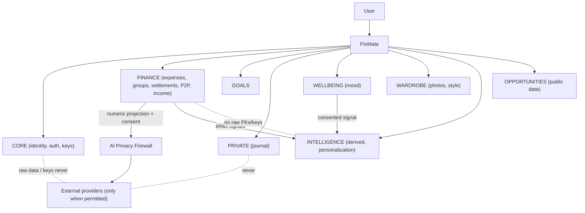

# FinMate — Processing Activities Register

**Classification:** CONFIDENTIAL (contains a full map of personal-data processing).
**Type:** Supporting artifact (GDPR Art. 30 / RoPA-style + DPIA input), **derived from** the frozen stack — it introduces **no new decisions**; it re-expresses Documents #1–#7 as a per-activity register.
**Governing (frozen) sources:** Decision Ledger · Data Classification Matrix · Security & Privacy Architecture · Key Management · AI Firewall · IP/AI Confidentiality Policy · Threat Model.
**Nature:** Documentation only. No code, schema, migration, API, encryption, or production change. **Legal-basis entries are proposed and marked [COUNSEL]** — this document asserts no legal determination.

---

## 1. What this document is

### Simple explanation
This is FinMate's "who-holds-what and why" list. For every kind of information FinMate handles, it answers: **what** we collect, **why**, **on what legal footing** (to be confirmed by lawyers), **who** can see it, **where** it lives, whether **AI** is involved, **how long** it's kept, what **rights** the user has, what happens when they **say no**, and what could **go wrong**.

### Technical explanation
A Records-of-Processing register: each processing activity is described by purpose, proposed lawful basis [COUNSEL], data categories, recipients/access, storage location + zone, AI involvement, retention, data-subject rights, withdrawal effects, and residual risk (linked to Threat Model IDs). CURRENT (in production) is separated from TARGET (unbuilt domains).

---

## 2. FinMate data flow

### Simple explanation
Your information goes into FinMate, is sorted into separate areas, and only leaves to an outside provider (like an AI or email service) when you've allowed it — and even then only a tiny, safe piece.

### Technical explanation

Only permitted, minimized data crosses to external providers (AI firewall, Documents #5). INTELLIGENCE receives signals + provenance only (ISO-2). E2EE domains never leave in plaintext.

---

## 3. Current production processing

Uniform rights/withdrawal/retention answers are in §5/§7; per-row overrides noted. Legal basis = **[COUNSEL] proposed**.

| Activity / Data | Purpose | Basis [COUNSEL] | Access | Storage / zone | AI | Risks |
|---|---|---|---|---|---|---|
| Email, username, phone, displayName | account, login, invites | Contract | user, auth svc, DBA | CORE `public`, plaintext | No | T-29 (SEC-W2/W7) |
| passwordHash | authentication | Contract + security LI | auth svc (verify) | CORE, argon2 hash | No | T-01/T-02 |
| 2FA secret | MFA | Contract + security LI | auth svc (decrypt) | CORE, server AES-GCM (global key) | No | T-08 |
| Wrapping / recovery keys (wrapped) | E2EE key custody | Contract | **user only** | CORE, ciphertext | No | protected on DB theft |
| Expense amounts/date/category/currency/splits | tracking, balances | Contract | user, FINANCE, DBA | FINANCE `public`, Zone 2 | Projection + consent | T-10, **T-19/OPS-1** |
| Expense title / description | expense detail | Contract | **user only (E2EE)** | Zone 1a ciphertext | **No** | protected |
| Group name (FLD-3) | UI/navigation/identifier | Contract | user, group svc, DBA | Zone 2 plaintext | No default | context-sensitive names |
| Group description (FLD-2) | group detail | Contract | **users (E2EE target)** | plaintext now → Zone 1a target | **No** | plaintext now (migration) |
| Settlement amounts | settle debts | Contract | user, FINANCE, DBA | Zone 2 | Projection | T-16 |
| Settlement note (FLD-1) | settlement detail | Contract | **users (E2EE target)** | plaintext now → Zone 1a target | **No** | plaintext now |
| People/P2P amounts + counterparty | lending balances | Contract | both users, FINANCE, DBA | Zone 2 | Projection | relationship graph metadata (T-26) |
| P2P note (B-2) | P2P detail | Contract | **both users (E2EE target)** | plaintext now → Zone 1a target | **No** | mixed-state migration |
| monthlyIncome / budget (FLD-5) | budgeting, personalization | Contract / Consent (personalization) | user, FINANCE (strict) | Profile, Zone 2 | **Raw never; derived projection** | T-19/OPS-1 |
| Goal progress numbers | savings tracking | Contract | user, GOALS | Zone 2 | Projection | — |
| Contacts (email/phone/name of **non-users**) | shared-expense identity | **Legitimate interest** | user, FINANCE/CONTACTS, DBA | plaintext, 3rd-party PII | **Excluded (CNT-1)** | **3rd-party rights [COUNSEL]**, T-30 |
| Invite email (FLD-7) | send invites | LI / Contract | invite flow (strict) | Zone 2 | **No** | retention-limited (purge) |
| Sessions / refresh tokens | keep logged in | Contract | auth svc, Redis | Redis, argon2 hash | No | **T-02 (SEC-W3)** |
| Verify / reset tokens | verify, reset | Contract | auth svc, Redis | Redis, TTL'd | No | **T-29 (SEC-W2)** |
| Audit logs | security, accountability | LI / legal obligation | security/admin | ipHash hashed; **email plaintext = SEC-W7** | No | T-29/SEC-W7 |
| Attachments (file + filename) | receipts | Contract | **user (E2EE)**; storageKey plaintext | Zone 1a (roadmap) | vision on-demand (future) | **SEC-W6c** dup |
| avatarUrl | profile display | Contract | users svc (server AES-GCM) | CORE, server-encrypted | No | undocumented drift (benign) |

---

## 4. Future processing (TARGET — unbuilt; controls are requirements)

| Activity / Data | Purpose | Basis [COUNSEL] | Access | Storage / zone | AI | Risks |
|---|---|---|---|---|---|---|
| Journal / private notes | private writing | Contract (feature) | **user only (E2EE)** | PRIVATE schema, Zone 1a | **No** (explicit workflow only) | protected by E2EE |
| Wellbeing mood metrics | wellbeing insights | **Explicit consent (Art. 9)** | user; WELLBEING svc (gated) | WELLBEING schema, **Class-B**, Zone 1b | Internal, consent + DPIA; **no external default** | **T-08/T-15, DPIA-1**, Art. 9 |
| Wardrobe photos + style | outfit suggestions | Explicit consent | **user (E2EE)**; vision on-demand | WARDROBE schema + object bucket | **Approved provider only, fail-closed (WARD-1)** | T-15 (biometric/face) |
| Derived intelligence / behavioural profile | personalization; "what we know" | **Explicit consent (profiling)** | user; INTELLIGENCE svc | INTELLIGENCE, **Class-B** | Projection only, provenance-free | **T-11 laundering, T-12 suppression** |
| Structured AI memory | better tips | Explicit consent | user; INTELLIGENCE | INTELLIGENCE, Class-B | governed, user-controllable | RGT-3; retention [ENG-UNKNOWN] |
| Card metadata (last4/issuer/type) | payment tracking | Contract | user, FINANCE | Zone 2; **never CVV/PIN/PAN** | minimal projection | CARD-1 |
| Uploaded statements (raw) | transaction extraction | Contract / consent | user; extraction (transient) | **E2EE; delete original by default** | **No raw**; extracted → finance rules | T-18 (PDF/OCR vendor) |
| Investments | investment tracking | Contract | user, FINANCE | Zone 2/1a (TBD) | **[ENG-UNKNOWN]** projection policy | undefined AI policy |
| Opportunities (public/scraped) | deal discovery | LI / public data | user, OPPORTUNITIES svc | separate low-trust store | yes (public) | SCR-1 scraping legality [COUNSEL] |
| Consent records | prove/withdraw consent | Legal obligation / LI | user, consent svc | consent ledger | No | integrity of ledger |

---

## 5. User rights

| Right | Behaviour | Source |
|---|---|---|
| **Delete** | personal-scope data erased; **shared financial records anonymized/tombstoned in place** (NOT-NULL FKs forbid row-delete); domain keys crypto-shredded; sessions revoked; backup tombstone replay | DEL-1/2/3, K-4 |
| **Export** | one export, **provided vs derived/inferred** labelled; requester-scoped in shared groups; re-auth + expiring signed link; **E2EE domains decrypted client-side** (server can't export plaintext) | EXP-1 |
| **Correct (rectify)** | edit personal data; correct/reject a derived inference (creates a **persistent suppression** that survives recompute) | RGT-1, INT-4 |
| **Restrict** | reversible "pause processing" flag — **distinct** from withdrawal and from suppression | RGT-1 |
| **Withdraw consent** | stop future processing → invalidate/recompute dependent derived data → revoke analysis-key access → **retain raw** unless deletion also requested → record in ledger | CON-1 |
| **Transparency** | "What FinMate knows about me": each learned fact with source/confidence/date/reason; delete/reset/disable | RGT-2 |

**[COUNSEL]** Non-user (Contacts) rights-request handling; whether inferred data is Art. 20-portable (labelled, not claimed).

---

## 6. AI processing — what AI can and cannot receive

### Simple explanation
The AI never gets FinMate's database. It gets a tiny number summary, only for one task, only if you agreed.

### Technical explanation (AI firewall, Document #5)
**AI CAN receive (via firewall, numeric/enum, consent, ZDR):** expense amounts, controlled-enum categories, income/budget as **derived projections**, goal progress numbers, statement-derived transactions, card metadata, derived intelligence projections.
**AI CANNOT receive:** any E2EE free-text (expense/note/goal/journal descriptions, settlement/P2P notes, group.description), merchant names, group.name (external, by default), journal, contacts/non-users, authentication data, CVV/PIN/PAN, raw statements, raw income/financial records, encryption keys, secrets.
**Conditional:** wardrobe images (approved provider only, fail-closed); mood/wellbeing (post-DPIA, consent, no external by default).
**assistant_qa:** stateless; question is untrusted input; fixed capped projection; no raw/keys/secrets reachable.

---

## 7. Retention

| Data | Current | Target | Basis |
|---|---|---|---|
| Account & core records | account lifetime | + erasure on deletion | RET-1 |
| Access token | 15 min | unchanged | AU-1 |
| Refresh session | 7 days | unchanged | AU-1 |
| Verify / reset tokens | 24h / 1h TTL | unchanged | auth |
| Invite email (FLD-7) | account lifetime | **purge on accepted/expired** | FLD-7 |
| Uploaded statement original | n/a | **delete after extraction by default** | CARD-1 |
| Audit logs | retained | minimized; retained where justified | LI/legal [COUNSEL] |
| Derived intelligence / AI memory | n/a | governed; user-deletable; period **[ENG-UNKNOWN]** | RGT-3 |
| **Erasure SLA (all)** | n/a | **RET-1 parametric (~30-day working figure, not hard-coded)** — verify vs PostgreSQL/PITR/WAL/Redis/object-store/vendor/mobile-backup retention | RET-1, K-4, DEL-2 |

**[REQUIREMENT]** No retention number is hard-coded until infrastructure/vendor retention is mapped (RET-1). Deletion/withdrawal tombstones replayed after restore (DEL-2).

---

## 8. Security controls (per protection class)

| Class | Mechanism | Applies to |
|---|---|---|
| **E2EE (Class A)** | random per-domain/entry keys, wrapped master + recovery; server cannot read; **no HKDF** | journal, expense/note/goal/P2P/settlement/group free-text, photos, attachments |
| **Server-managed (Class B)** | per-user server/KMS key; encrypted at rest; gated decrypt | wellbeing metrics, intelligence derived |
| **Plaintext-but-protected (Zone 2)** | authz + least-privilege roles + TLS + encrypted storage + audit (no field encryption) | amounts, dates, category, balances, group.name, nickname, income, invitedEmail |
| **Hashed / server-key** | argon2 (passwords); server AES-GCM global key | passwordHash; 2FA secret, avatar |
| **Minimize / don't-store** | never persist; internal identifiers | CVV/PIN/PAN (never); attachment plaintext filename (deprecate); statement originals (delete) |

Isolation: per-domain DB principals (ISO-1); INTELLIGENCE no raw FKs (ISO-2); single AI egress firewall (AI-1). Principle: **least protective mechanism that safely satisfies the requirement (PRIN-1)**.

---

## 9. DPIA triggers

**[COUNSEL]** A DPIA is likely required (Art. 35) before the following go live; each combines high-risk factors:
- **Wellbeing / mood** — Art. 9 special-category, systematic.
- **Behavioural profiling / personalization** — systematic evaluation, automated (Art. 22 considerations).
- **AI processing of personal data** — even minimized projections at scale.
- **Wardrobe photos** — potential biometric/appearance; vision provider egress.
- **Large-scale financial + cross-domain correlation** — combination of finance, wellbeing, behaviour.

**[REQUIREMENT]** INTELLIGENCE cross-domain/profiling stays **flag-OFF until DPIA sign-off** (INT-3/DPIA-1). Scope the DPIA to cover **financial profiling + AI egress + wellbeing** (staged), not wellbeing alone.

---

## 10. Counsel-required questions

1. Lawful basis per activity (Contract / LI / explicit consent / legal obligation) — all bases above are proposals.
2. Art. 9 treatment of wellbeing/mood (and any sensitive-trait inference).
3. Legal basis + rights process for **non-user Contacts** PII (CNT-1).
4. Retention basis for **anonymize-in-place** shared financial records (DEL-1) and departed-user content in retained shared free-text (DEL-3).
5. Whether inferred/derived data is Art. 20-portable (labelled, not claimed) (L-1).
6. International transfers for OpenAI/Resend and any future OCR/vision vendor (VEN-1/CARD-1/WARD-1).
7. Scraping legality for OPPORTUNITIES (ToS / EU database rights) (SCR-1).
8. DPIA scope, timing, and reviewer.
9. Breach-notification obligations/timelines (incident response).
10. Whether Level-1 finance aggregates qualify for legitimate interest (LIA).

---

## 11. Engineering unknowns

1. Exact columns of `*_versions` and `recurring_expense_splits` tables.
2. Whether `notes` / `recurring_expenses` / `attachments` have production rows.
3. Whether `group.description` appears in any pre-join/invite-preview surface (FLD-2).
4. Prod `CORS_ORIGINS` value vs `https://finmate.prvnsahni.com` (AU-2a).
5. Deployed refresh-token storage today (localStorage vs memory) — SEC-W3 blast radius.
6. `ngsw-config.json` data-cache groups (SW caching of sensitive endpoints).
7. Investment-domain AI projection policy.
8. Structured AI-memory retention period.
9. Statement/OCR feature + vendor (unbuilt).
10. Supply-chain tool selection (scanning/provenance).

---

## 12. Risks (linked to Threat Model)

| Area | Risk | Sev | Ref |
|---|---|---|---|
| Auth | refresh token in body (XSS exfil) | **P0** | T-02 / SEC-W3 |
| Logging | tokens/email/IP in logs | **P0** | T-29 / SEC-W2 |
| IP | git-history blobs + no secret scanning | **P0** | T-27 / SEC-W1 |
| Isolation | single-datasource bypass | P1 | T-09 |
| Insider | Zone-2 finance plaintext read | P1 | T-19 / OPS-1 |
| Privacy | consent laundering / suppression resurrection | P1 | T-11 / T-12 |
| Wellbeing | server-key exposure / Art. 9 | P1 | T-08 |
| Wardrobe | fail-open image egress | P1 | T-15 |
| Deletion | incompleteness / backup resurrection | P1 | T-23 / T-24 |
| Contacts | third-party PII, rights process | P2 | T-30 |
| Audit | email in metadata | P1 | SEC-W7 |
| Attachments | plaintext filename dup | P1 | SEC-W6c |
| Web | Swagger/CSP; subdomain under same-site cookie | P1/P2 | T-21 / SEC-W5 |
| Rotation | group-key versionId bug | P2 | SEC-KI1 → **MITIGATED 2026-08-13** (see note) |

All existing SEC/OPS items remain **OPEN** until fixed and verified.

> **⟳ SEC-KI1 STATUS CORRECTION — 2026-08-13 (additive; row above preserved as historical).** Repository verification ([FINMATE_SEC_KI1_VERIFICATION.md](FINMATE_SEC_KI1_VERIFICATION.md)): the group-key `versionId` path is honored end-to-end (verified fix landed 2026-07-17) → **MITIGATED/VERIFIED** (was P2 OPEN). Historical canonical expenses decrypt after normal rotation. **M-KEYVER = VERIFY-ONLY, no migration.** Residual: **GRP-007** (history-log display placeholder, not data loss). Open: GRP-005, legacy NULL-`versionId`, REVOKED semantics — [PRODUCT/SECURITY DECISION REQUIRED].

---

## 13. Reconciliation against Documents #1–#7

- **No decision changed.** Every entry is a re-expression of the frozen ledger/matrix/architecture/key/AI/IP/threat documents.
- **No new legal or compliance claim** — all legal bases and Art. 9/transfer/DPIA points marked **[COUNSEL]**.
- **Field classifications match Document #2** (incl. FLD-1..7).
- **AI allow/deny matches Document #5.**
- **Retention/deletion match RET-1, DEL-1/2/3, K-4.**
- **Rights match RGT-1/2/3, EXP-1, CON-1.**
- **Risks match Document #7** (threat IDs preserved) and remain OPEN.
- **ENG-UNKNOWN and COUNSEL items preserved** (§10/§11).
- **Contradictions:** **NONE** — no STOP-and-report condition; Documents #1–#7 not modified.

---

## DOCUMENT STATUS: **FROZEN** ✅

Complete Processing Activities Register (RoPA / DPIA input), dual-leveled where useful, one data-flow diagram, current + future registers, rights/AI/retention/security/DPIA sections, and full reconciliation. Supporting artifact derived from the frozen stack; introduces no new decisions. No code, schema, migration, API, encryption, or production change was made.

*End of Processing Activities Register (FROZEN). The next document in the locked order remains the SRS.*
