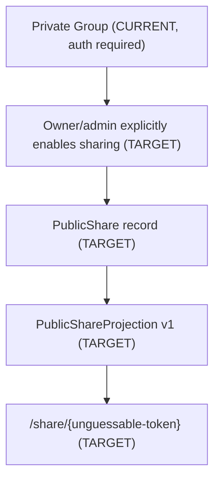
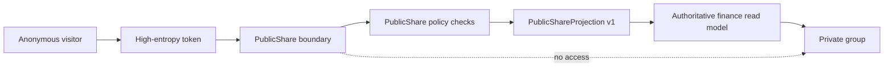
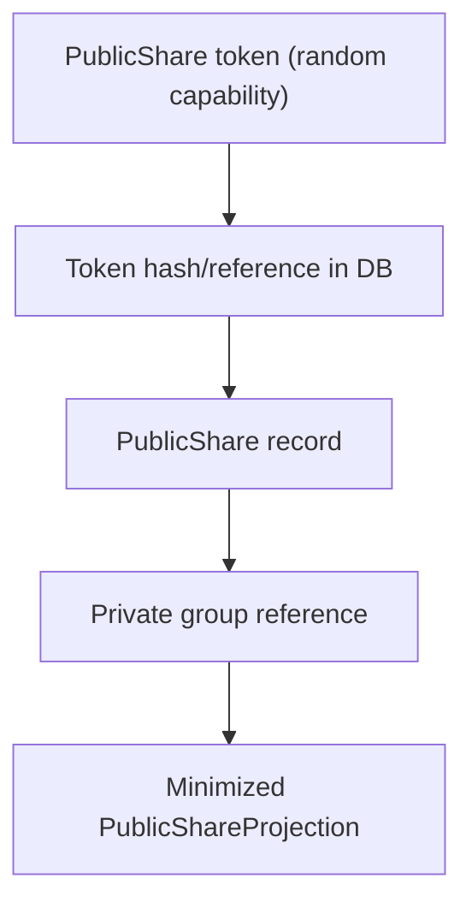
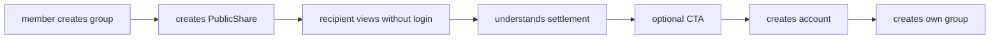

# FinMate - Public Read-Only Expense Sharing (FUTURE)

**Status:** FUTURE architecture proposal only.
**Nature:** Documentation only. This file authorizes no code, schema, migration,
API contract, encryption change, feature flag, package, deployment, or production
change. It does not modify the frozen SRS, Decision Ledger, ADRs, OpenAPI, data
classification matrix, key management model, AI firewall, Goal Engine, or
Document Intelligence workstream.

**Feature concept:** Public Read-Only Expense Sharing creates a separate,
minimized public projection of a private group so a non-member visitor can see a
limited settlement summary without logging in. The private group remains private
and authenticated members continue to use the normal private group experience.



## 1. Repository Reconciliation

This proposal was written after inspecting the current repository and frozen
architecture. Facts below are **CURRENT** only where verified.

| Area                  | CURRENT verified reality                                                                                                                                                                                       | PublicShare implication                                                                                                                                                    |
| --------------------- | -------------------------------------------------------------------------------------------------------------------------------------------------------------------------------------------------------------- | -------------------------------------------------------------------------------------------------------------------------------------------------------------------------- |
| Groups                | `Group` has `name`, `description`, `visibility`, `currency`, `groupType`, `ownerUser`, `inviteToken`, `isArchived`, `version`; group endpoints are under `@UseGuards(JwtAuthGuard)`                            | Do not expose existing group endpoints publicly. Do not rely on `Group.visibility = public_readonly` as the sharing mechanism.                                             |
| Membership            | `GroupMember.role` supports `owner`, `admin`, `member`, `viewer`, `spectator`; active membership gates group access                                                                                            | Creation/revocation should require owner/admin authorization. Ordinary members should not publish by default.                                                              |
| Existing authz        | group, expense, settlement, key, and document-intelligence routes are authenticated/guarded                                                                                                                    | PublicShare needs a separate unauthenticated read boundary, not disabled auth on current controllers.                                                                      |
| E2EE/key model        | group keys are versioned Class-A material; `GET /groups/:id/keys/me?versionId=` returns caller-specific wrapped keys; server must not expose Class-A keys                                                      | Public visitors must never receive keys, wrapped keys, ciphertext requiring private group keys, or key metadata beyond safe policy/version fields.                         |
| Finance calculations  | `SettlementsService.calculateGroupBalances` computes balances and suggested settlements from posted expenses, payments, splits, confirmed settlements, and the shared debt simplifier; FIN-002 requires parity | PublicShare must consume authoritative finance results/read models and must never introduce a second settlement calculator.                                                |
| Data classification   | amounts, categories, dates, splits, balances are Zone 2 server-readable but protected; titles/descriptions/private free-text are E2EE or target E2EE                                                           | PublicShare may include only explicit allowlist fields. Server-readable does not mean public.                                                                              |
| Document Intelligence | DOC intake/extraction/review work exists, but taxonomy/OCR expansion is separately gated; raw OCR/document content is sensitive                                                                                | PublicShare must not expose OCR raw output, receipt contents, line items, classification metadata, or document-derived details except through a future explicit allowlist. |
| Observability         | `ObservabilityService` emits sanitized structured logs; analytics backend is not a product analytics platform                                                                                                  | Safe product analytics may be proposed conceptually, separated from financial data.                                                                                        |
| Feature flags         | current registry includes flags such as `document.intelligence`; no `public.groupShare` flag exists                                                                                                            | Recommend a future default-OFF flag; do not add it here.                                                                                                                   |
| OpenAPI               | no `public-shares` path exists in `openapi.yaml`                                                                                                                                                               | API paths in this document are TARGET/FUTURE examples only; OpenAPI remains unchanged.                                                                                     |
| Frozen docs/ADRs      | SRS v1.0, Decision Ledger, ADRs, Data Matrix, Security, Key Management, FIN-002/ADR-017 are frozen                                                                                                             | This proposal must remain additive and future-scoped.                                                                                                                      |

## 2. Product Purpose (TARGET)

Public Read-Only Expense Sharing gives members a low-friction way to share
expense results with people who need the outcome but should not have to create
an account.

**TARGET product outcomes:**

- Recipients can understand who owes whom without logging in.
- A trip, household, event, or temporary expense settlement can be shared as a
  link.
- The recipient sees a deliberately limited summary, not the private group.
- FinMate can show a lightweight CTA for organic discovery and optional
  conversion.

**Example visitor page (TARGET):**

```text
Goa Trip
Total spent: INR 42,300

Paid amounts:
Rahul: INR 24,000
Amit:  INR 11,500
Priya: INR  6,800

Simplified settlement:
Amit -> Rahul INR 2,700
Priya -> Rahul INR 800

CTA: Track your next trip with FinMate
```

## 3. PublicShare vs Public Group

**CURRENT:** FinMate groups are protected by authentication and group
membership. The `groups.visibility` column contains values including
`public_readonly`, but existing group APIs remain authenticated and membership
scoped.

**TARGET:** do **not** create a truly public group. PublicShare is a dedicated
boundary that publishes only a controlled read-only projection.

**Why not a public group:**

- A group contains private membership context, expenses, keys, history, invites,
  audit relationships, documents, and potentially E2EE ciphertext.
- Public group access would pressure existing group endpoints to support
  anonymous callers and would increase IDOR/enumeration risk.
- Disabling authentication on `GET /groups/:id` or similar endpoints would reuse
  private DTOs and risk accidental field exposure.
- A public group model conflicts with the protected-baseline principle in
  ADR-001/GOV-1.

**Required design distinction:**

```text
Do not build: GET /groups/:id/public
Do not build: unauthenticated existing group/expense/settlement endpoints
Do build:    a PublicShare boundary with a stable PublicShareView DTO
```

## 4. Conceptual Architecture (TARGET)



**TARGET components:**

- `PublicShare`: share record and lifecycle boundary.
- `PublicShareProjection`: versioned allowlisted projection policy.
- `PublicShareView`: public visitor DTO, distinct from private `Group` DTO.
- Public share renderer/page: anonymous read-only display.
- Admin/member UI: create, copy, revoke, inspect status.

**CURRENT private-group experience remains unchanged:** authenticated members use
existing groups, expenses, settlements, keys, and document flows.

## 5. Public Data Allowlist

Everything public must be opt-in by DTO and projection version. Fields below are
**TARGET candidates**, not approvals to expose today.

| Field                             | Status                     | Notes                                                                                          |
| --------------------------------- | -------------------------- | ---------------------------------------------------------------------------------------------- |
| group display name                | TARGET allowlist candidate | `group.name` is plaintext-protected, but publication still requires explicit share enablement. |
| member display names              | TARGET allowlist candidate | Carefully controlled display labels only; no emails/phones/internal IDs.                       |
| aggregate total spent             | TARGET allowlist candidate | From authoritative finance read model.                                                         |
| paid totals by display name       | TARGET allowlist candidate | Aggregate only.                                                                                |
| simplified settlement obligations | TARGET allowlist candidate | From authoritative settlement suggestion/read model.                                           |
| settlement status                 | TARGET allowlist candidate | Only if deliberately included.                                                                 |
| limited dates                     | TARGET allowlist candidate | Examples: trip date range or settlement date range, if appropriate.                            |
| expense/category summaries        | FUTURE optional            | Explicitly enabled per share policy/version; no raw notes/descriptions.                        |

**[PRODUCT DECISION REQUIRED]** exact default display name format for contacts,
pending members, departed users, and duplicate names.

**[COUNSEL]** public exposure of display names and financial relationship
summaries requires privacy review, especially where non-users/contacts appear.

## 6. Strict Prohibited Fields

The public visitor response must never include anything outside
`PublicShareView`. Explicitly prohibited:

- encryption keys
- wrapped group keys, recovery keys, private wrapping keys, public key
  fingerprints where not needed
- E2EE ciphertext that is not the public projection itself
- private notes
- expense titles or descriptions unless a future projection explicitly creates
  a public-safe summary
- group descriptions unless separately approved
- receipt images, PDFs, attachments, object-storage keys
- OCR raw output, extracted line items, document text
- taxonomy/classification metadata that can reveal sensitive purchases
- bank, credit-card, account, statement, or payment-card information
- email addresses, phone numbers, invite identifiers
- internal UUIDs, group IDs, member IDs, contact IDs, user IDs
- authentication/session data
- audit logs, audit metadata, IP hashes, request IDs
- key-version metadata beyond a safe projection policy version if needed
- sensitive metadata, deleted/archived/private history, version snapshots
- anything not explicitly included in the versioned `PublicShareView` DTO

## 7. Privacy Model

**TARGET privacy requirements:**

- default OFF
- explicit owner/admin action required
- revocable
- optionally expiring
- no discoverability by group ID
- no group enumeration
- no access to existing private group endpoints
- no public API that accepts a group ID as the capability
- rate limited and abuse protected
- no search indexing by default
- capability-token based access

**Revocation behavior (TARGET):**

- Revoking the share must immediately stop future public access.
- Revocation must not alter the private group, expenses, splits, balances, or
  settlements.
- Existing screenshots or forwarded copies cannot be technically recalled; the
  UI should make this limitation clear before publishing. **[PRODUCT DECISION
  REQUIRED]**

## 8. Share Token Model

**TARGET:** use a high-entropy, unguessable capability token. Do not expose a
database ID as the public token. Do not encode sensitive data in the token.



**Engineering guidance:**

- Generate at least 128 bits of cryptographic randomness; 192-256 bits preferred
  as an **[ENGINEERING PARAMETER]**.
- Store only a token hash/reference, not the raw token.
- Token comparison should use constant-time comparison where practical.
- Tokens must be non-sequential, non-derivable, and not JWTs containing group
  data.
- Logs must redact tokens and full share URLs.
- Token rotation/regeneration should create a new capability and invalidate the
  old one.

## 9. Live vs Snapshot Sharing

| Mode           | Description                                                 | Pros                                                   | Risks                                                                 |
| -------------- | ----------------------------------------------------------- | ------------------------------------------------------ | --------------------------------------------------------------------- |
| Live share     | View always reflects current authoritative group settlement | Simple mental model for active trips; no stale numbers | Public view changes after forwarding; more cache complexity           |
| Snapshot share | View freezes the state at creation time                     | Stable evidence; safer for finalized events            | Requires snapshot metadata/versioning; can diverge from current group |

**V1 recommendation (TARGET):** start with **live share** using the authoritative
finance read model, with clear "last updated" metadata. Mark this as a
**[PRODUCT DECISION REQUIRED]** and **[ENGINEERING PARAMETER]** until accepted.

**FUTURE:** add snapshot shares for finalized trips/events where stable records
matter.

## 10. Permission Model

**TARGET default:** only group `owner` and `admin` can create or revoke a
PublicShare.

**Rationale:** current repository patterns already restrict group settings,
invite links, contribution settings, key inspection, and key rotation to
owner/admin where relevant. Publishing a public financial summary is at least as
sensitive as inviting or managing members.

**Do not assume:** ordinary `member`, `viewer`, or `spectator` can publish.

**[PRODUCT DECISION REQUIRED]:**

- whether owners can restrict admins from publishing
- whether a group policy can require owner-only publishing
- whether all active members should be notified when a share is created
- whether contacts/pending members have any consent/notice requirement

## 11. E2EE Boundary

PublicShare must not become an E2EE bypass.

**TARGET invariants:**

- The server exposes only approved public projection fields.
- Public projection generation must not require decrypting Class-A private
  fields.
- No group key, wrapped key, E2EE ciphertext, encrypted description, private
  note, receipt content, or attachment metadata is included.
- If a future product needs data currently stored as E2EE, that is a future
  architectural/security decision, not a PublicShare implementation detail.

**CURRENT-compatible stance:** group names, member nicknames/display names,
amounts, categories, dates, splits, and settlements may be server-readable under
Zone 2 or plaintext-protected classifications, but that does not make them
public. Public exposure still requires explicit PublicShare allowlisting.

## 12. Document Intelligence Interaction

**CURRENT/TARGET context:** Document Intelligence has a guarded intake boundary
and extraction/review work, but OCR/taxonomy/statement import remains separate
from this proposal.

PublicShare must not accidentally expose:

- OCR raw output
- document text
- receipt images or PDFs
- extracted sensitive line items
- merchant/card/bank data
- classification/taxonomy metadata
- model confidence/provenance that reveals sensitive purchases

**FUTURE allowlist rule:** taxonomy or document-intelligence fields may appear
only through a new `PublicShareProjection` version with explicit product,
engineering, security, and **[COUNSEL]** approval.

## 13. Finance Correctness and FIN-002

**CURRENT:** FIN-002 and ADR-017 require financial parity. The finance golden
gate states: same input equals same financial result. The current settlement
read model calculates balances from posted expenses, payment rows, splits,
confirmed settlements, refunds, household carry-forward, and the shared debt
simplifier.

**TARGET PublicShare rule:** PublicShare is read-only and must never modify:

- expenses
- payers
- splits
- refunds
- settlements
- balances
- carry-forward entries
- group contributions

**FIN-002 requirement:** PublicShare must consume the existing authoritative
finance results/read model. It must never calculate a competing settlement
result, use a parallel debt simplifier, or apply different rounding/netting
rules.

**Verification expectation:** any future implementation that touches the
projection builder must run the finance golden gate and add projection tests
that prove the DTO is a transformation of authoritative results, not a new
calculator.

## 14. Safe Product Analytics

**TARGET safe aggregate analytics candidates:**

- share created
- share revoked
- share expired
- share opened
- approximate unique view count
- CTA clicked
- signup after share
- group created after share

**Do not collect:**

- visitor financial data
- visitor behavioral profiles
- per-recipient debt analysis
- raw share payload contents
- email/phone identity of anonymous visitors
- detailed financial event replay

**Separation rule:** product analytics measure product loop health. They are
not financial data processing, credit profiling, advertising targeting, or
behavioral profiling.

**[COUNSEL]:** review lawful basis, cookie/device identifier rules, retention,
and cross-device attribution before adding analytics.

## 15. Viral/Product Loop



The loop must stay privacy-first. The CTA should not imply the visitor can edit,
join, view receipts, or see private details from the shared group.

## 16. QR and Sharing Channels

**FUTURE, not implemented here:**

- copy link
- QR code
- messaging/social share sheet
- printable event summary
- branded share page

QR codes are just a representation of the same capability URL; they do not
weaken or replace token security requirements.

## 17. Threat Analysis

| Threat                              | TARGET mitigation                                                                                                        |
| ----------------------------------- | ------------------------------------------------------------------------------------------------------------------------ |
| Token guessing                      | high-entropy random token, rate limiting, no sequential IDs                                                              |
| Token leakage                       | redact URLs/tokens from logs; user education; easy revoke/regenerate                                                     |
| Screenshots/link forwarding         | make sharing implications clear; allow expiry/revocation; cannot recall screenshots                                      |
| Scraping                            | throttle, bot/abuse controls, payload minimization, optional proof-of-work/CAPTCHA as future **[ENGINEERING PARAMETER]** |
| Enumeration                         | no group IDs, no discoverable paths, uniform 404 for invalid/revoked/expired where appropriate                           |
| Excessive request rates             | per-token/IP/user-agent rate limits and anomaly alerts                                                                   |
| Stale/revoked links                 | `revokedAt`, `expiresAt`, cache controls, immediate policy check                                                         |
| Accidental sensitive-field addition | stable `PublicShareView` DTO, projection versioning, allowlist tests                                                     |
| Authorization bypass                | separate controller/service, no reuse of private DTOs/endpoints                                                          |
| Cache leakage                       | no-store/private cache guidance for sensitive public financial summaries                                                 |
| Search indexing                     | `noindex`, no sitemap, robots guidance, token URLs not linked publicly                                                   |
| Referrer leakage                    | use `Referrer-Policy: no-referrer` or strict policy **[ENGINEERING PARAMETER]**                                          |
| Analytics overreach                 | aggregate-only product analytics, no visitor financial profiling                                                         |

## 18. Caching and Indexing

**TARGET security guidance:**

- Prefer `Cache-Control: no-store` for V1 unless a later performance/security
  review approves controlled caching.
- Include `X-Robots-Tag: noindex, nofollow` or equivalent page metadata.
- Do not include PublicShare URLs in sitemaps.
- Avoid service-worker caching of share payloads.
- Redact share tokens in logs and observability.

**[ENGINEERING PARAMETER]:** exact cache header policy, CDN behavior, and browser
history/referrer behavior require implementation review.

## 19. API Boundary (TARGET/FUTURE Examples Only)

Do not modify OpenAPI as part of this proposal.

Conceptual future API shape:

```text
POST   /public-shares              (authenticated owner/admin)
GET    /public-shares/:token       (anonymous capability read)
DELETE /public-shares/:id          (authenticated owner/admin revoke)
```

Alternative route shape for page rendering:

```text
GET /share/:token
```

**Boundary rules:**

- `GET /groups/:id/public` is explicitly rejected.
- Existing group/expense/settlement DTOs must not be reused.
- Private endpoints remain authenticated.
- `DELETE /public-shares/:id` uses authenticated internal ID; anonymous access
  uses only token.

## 20. Conceptual Data Model (TARGET)

No entity or migration is created by this document.

Future `PublicShare` entity concept:

| Field                         | Purpose                                            |
| ----------------------------- | -------------------------------------------------- |
| `id`                          | internal database ID, never public token           |
| `groupId` / group reference   | private group source                               |
| `tokenHash` / token reference | hash of capability token                           |
| `createdByUserId`             | publishing actor                                   |
| `createdAt`                   | lifecycle metadata                                 |
| `expiresAt`                   | optional expiry                                    |
| `revokedAt`                   | revocation timestamp                               |
| `mode`                        | `live` or `snapshot`                               |
| `projectionPolicyVersion`     | stable allowlist version                           |
| `snapshotMetadata`            | if snapshot mode is introduced                     |
| `lastProjectedAt`             | live/snapshot freshness                            |
| `createdReason` / label       | optional admin-facing label, not public by default |

**[ENGINEERING PARAMETER]:** whether projection data is computed on read, cached
in a separate table, or materialized as snapshot JSON.

## 21. Projection Versioning

Projection versioning is mandatory.

**TARGET schema concept:**

```text
PublicShareProjection v1
  groupDisplayName
  currency
  totalSpent
  members[]
    displayName
    paidTotal
  suggestedSettlements[]
    fromDisplayName
    toDisplayName
    amount
    currency
  settlementStatusSummary
  dateRange
  lastUpdatedAt
```

**Rules:**

- New private fields must never become public by object spreading or DTO reuse.
- Adding a public field requires a new projection version or an explicit
  versioned policy change.
- Projection builders must use positive allowlists.
- Tests must fail if prohibited fields appear.
- Historical snapshot shares should retain their projection version.

## 22. Stable DTO Boundary

Public visitors receive only a dedicated `PublicShareView` DTO.

**Never reuse:**

- private `Group` DTO
- private expense DTO
- settlement entity snapshots
- audit/version snapshots
- attachment/document DTOs
- key DTOs

**TARGET DTO principles:**

- display names, not IDs
- summarized amounts, not raw ledger rows unless explicitly versioned
- no nullable accidental relation objects
- no ORM entities serialized directly
- no nested private objects

## 23. Feature Flag

Recommend a future feature flag:

```text
public.groupShare
```

Default: OFF.

Do not add it now. If implemented later, all create/read/revoke routes and UI
entry points should fail closed while the flag is OFF.

## 24. Future Enhancements (Parked)

Parked, not implemented:

- richer sharing controls
- snapshot shares
- expiry controls
- QR sharing
- branded share pages
- optional category summaries
- optional settlement confirmation display
- multiple share policies
- owner-only publishing mode
- password/PIN-protected shares **[PRODUCT DECISION REQUIRED]**
- per-member anonymization controls **[COUNSEL]**

## 25. Explicit Non-Goals

This proposal does not include:

- public editing
- public joining
- public expense creation
- public comments
- public settlement confirmation
- public access to private group details
- public access to receipts or attachments
- public E2EE decryption
- public group endpoints
- advertising based on financial data
- behavioral profiling of visitors
- OCR/taxonomy/document-intelligence expansion
- DOC-3/OCR/taxonomy work
- a new implementation batch

## 26. Relationship With Current Architecture

| Existing architecture item       | Relationship                                                                                                  |
| -------------------------------- | ------------------------------------------------------------------------------------------------------------- |
| E2EE                             | Preserved. PublicShare exposes no keys/ciphertext/private free-text.                                          |
| REC-1                            | Preserved. Sharing does not change recovery or key setup.                                                     |
| SEC-KI1                          | Preserved. Group key version serving remains private-member-only; public visitors never receive wrapped keys. |
| FIN-002                          | Preserved. PublicShare consumes authoritative finance results only.                                           |
| Goal Engine                      | Unchanged. No goal data or goal projection is introduced.                                                     |
| Document Intelligence            | Unchanged. No OCR/taxonomy/document fields exposed except future explicit allowlist.                          |
| Existing group authorization     | Preserved. Existing endpoints remain authenticated/member-scoped.                                             |
| Existing settlement calculations | Preserved. No second calculator.                                                                              |
| OpenAPI                          | Unchanged. Conceptual endpoints are FUTURE examples.                                                          |
| Frozen SRS/Ledger/ADRs           | Unchanged. This is a future proposal, not a frozen-doc revision.                                              |

## 27. Decision Register

| Topic                                        | Classification                                                                |
| -------------------------------------------- | ----------------------------------------------------------------------------- |
| PublicShare boundary instead of public group | TARGET recommendation                                                         |
| Default OFF                                  | TARGET requirement                                                            |
| Owner/admin create/revoke                    | TARGET recommendation, **[PRODUCT DECISION REQUIRED]** for exact admin policy |
| Live share V1                                | TARGET recommendation, **[PRODUCT DECISION REQUIRED]**                        |
| Token entropy length                         | **[ENGINEERING PARAMETER]**                                                   |
| Expiry default                               | **[PRODUCT DECISION REQUIRED]**                                               |
| Public display names for non-users/contacts  | **[PRODUCT DECISION REQUIRED]**, **[COUNSEL]**                                |
| Analytics attribution                        | **[COUNSEL]**, **[ENGINEERING PARAMETER]**                                    |
| Cache headers/CDN behavior                   | **[ENGINEERING PARAMETER]**                                                   |
| Category/document/taxonomy summaries         | FUTURE, explicit allowlist only                                               |

## 28. Final Reconciliation

- **CURRENT:** private group APIs are authenticated; group membership/roles
  govern access; finance calculations are authoritative in existing services;
  E2EE/key material is separate and private; Document Intelligence is guarded
  and must not be conflated with public sharing; no PublicShare API exists.
- **TARGET:** a future PublicShare boundary may publish an explicitly
  allowlisted, versioned, read-only projection behind an unguessable capability
  token.
- **FUTURE:** snapshot shares, QR sharing, category summaries, branded share
  pages, richer controls, and analytics tuning.
- **Not changed:** code, schemas, migrations, OpenAPI, frozen SRS, Decision
  Ledger, ADRs, E2EE/security model, FIN-002, Goal Engine, Document
  Intelligence implementation, production.

**One-line status:** Future architecture proposal only; no implementation
authorized.
