# FinMate — Security & Privacy Architecture

**Governing (frozen) sources:** [FINMATE_DECISION_LEDGER.md](FINMATE_DECISION_LEDGER.md) · [FINMATE_DATA_CLASSIFICATION_ENCRYPTION_MATRIX.md](FINMATE_DATA_CLASSIFICATION_ENCRYPTION_MATRIX.md)
**Nature:** Architecture + documentation only. Authorises **no** code, schema, migration, encryption, API, or production change. No locked decision or field classification is altered here.
**Reading model:** Every major concept is written twice — a **Simple explanation** (plain language, anyone can follow) then a **Technical explanation** (how it is actually implemented). Diagrams use Mermaid; each important one has both explanations.

> **Status of features:** Much of this architecture is **TARGET** (journal, wellbeing, wardrobe, opportunities, intelligence, per-domain keys, the AI firewall, domain isolation, deletion/consent machinery are **not built yet**). Only the **CURRENT** parts (auth, expenses, groups, settlements, People/P2P, existing E2EE for expense/note free-text, group-key versioning) exist in production today. Each section labels which is which.

---

## System overview

### Simple explanation
FinMate is one app with many rooms (finance, goals, private journal, wellbeing, wardrobe). Each room has its own lock. The most private rooms (journal, photos) are locked so that **only you** hold the key — FinMate's servers keep the locked box but can't open it. Other rooms (like your expense amounts) FinMate *can* read, because it needs the numbers to do maths for you — but they're still kept behind strong doors, and only the parts of FinMate that need them can get in.

### Technical explanation
FinMate is a single Nx monorepo application (Angular Web/PWA + Capacitor native; NestJS + TypeORM + PostgreSQL + Redis). Security is layered: (1) **client-side E2EE** for opaque free-text/blobs, (2) **server-managed encryption** for data needing server analysis, (3) **plaintext-but-protected** (Zone 2) for values the server must compute on, all under (4) domain isolation, least-privilege DB principals, TLS, authorization, audit, and a single AI egress firewall.

**SEC-ARCH-01 — Current system architecture (CURRENT FACT)**
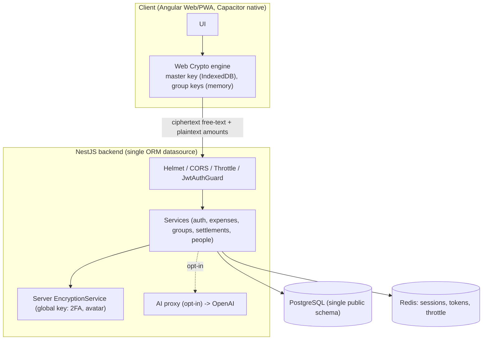

**SEC-ARCH-02 — Target security architecture (TARGET)**
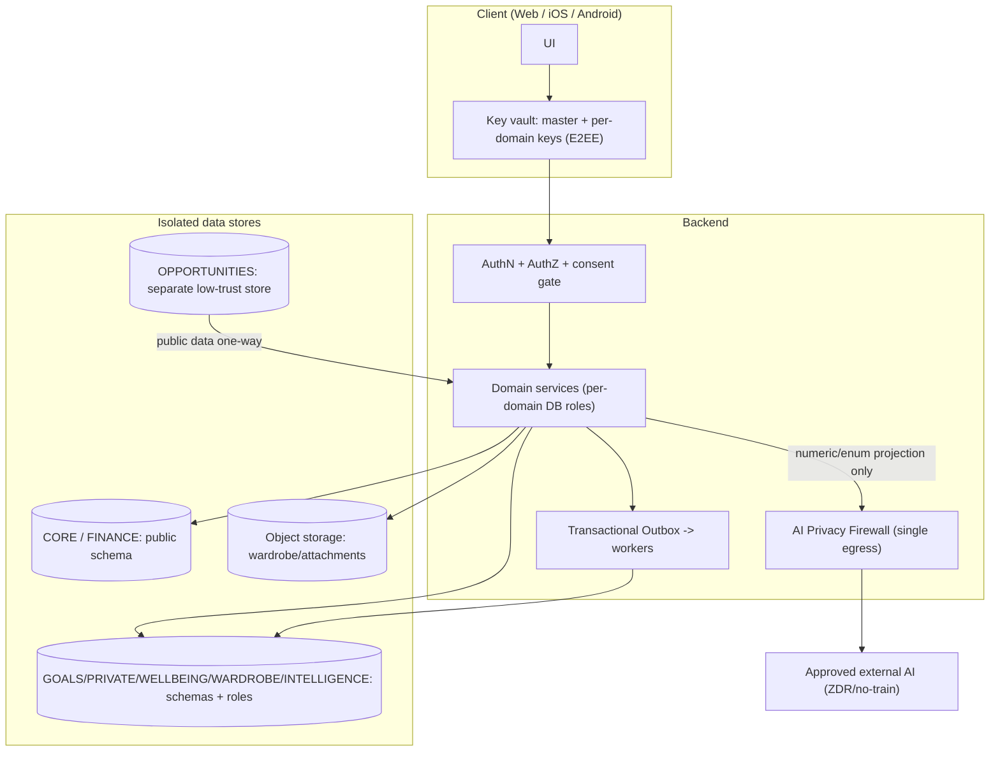

---

## 1. Security principles

**Distinction used throughout:** a **PRINCIPLE** is a rule of thought; an **IMPLEMENTATION REQUIREMENT** is a concrete thing the system must do.

| # | Principle (why) | Implementation requirement (what) | Ledger |
|---|---|---|---|
| P1 | **Secure the existing product without unnecessarily breaking it** | Additive changes + compatibility layers; never assume clean-slate | GOV-1/GOV-3 |
| P2 | **Least-Protective-Mechanism (PRIN-1)** — use the weakest protection that *safely* meets the need, not the strongest | E2EE where server access is unnecessary; server-managed enc where analysis needed; plaintext-but-protected where computation needs it; hash secrets; minimize/don't-store where possible | PRIN-1 |
| P3 | **Data minimization** | Store only what a feature needs; minimize before any egress | GOV-5, AI-2 |
| P4 | **Purpose limitation** | Data used only for its declared purpose; cross-purpose needs a contract/consent | ISO-3/4, CON-3 |
| P5 | **Need-to-know / least privilege** | Per-domain DB roles; no superuser-across-domains | ISO-1 |
| P6 | **Domain isolation** | Bounded domains; deny-by-default cross-module | ISO-1/2/3 |
| P7 | **Defense in depth** | Assume one layer fails; multiple independent boundaries | GOV-2, threat model |
| P8 | **"User data ≠ AI data"** | Possessing data never implies AI/analytics/cross-module use | GOV-5 |
| P9 | **Backward compatibility, no clean-slate** | Mixed-state migrations; honour old clients until min-version | GOV-1, B-2, AU-4 |
| P10 | **User control & transparency** | Export, rectify, restrict, withdraw, "what we know", delete | RGT-1/2/3, EXP-1, CON-1 |

---

## 2. Security zones

### Simple explanation
FinMate sorts data by how private it is. Some things are locked so only you can open them. Some things FinMate can read but keeps carefully guarded. Some numbers FinMate must read to do maths.

### Technical explanation (locked Z-1)
| Zone | Meaning | Who can read plaintext | Example data |
|---|---|---|---|
| **1a** | Opaque, end-to-end encrypted free-text/blobs | **User only** | journal, expense/note/goal/P2P free-text, settlement.note (FLD-1), group.description (FLD-2), wardrobe photos, attachments |
| **1b** | Sensitive but server-readable (needs analysis) | Server, gated by consent | WELLBEING mood metrics |
| **2** | Protected plaintext for computation | Server + owner | amounts, dates, category, balances, splits, settlements, P2P amounts, goal progress, group.name (FLD-3), nickname (FLD-4), monthlyIncome (FLD-5), invitedEmail (FLD-7) |
| **3** | Isolated module data | Owning module only | wardrobe inventory/style, opportunities/public data |
| **(CORE secret)** | Credentials/keys | Hashed/encrypted; never plaintext to anyone | passwordHash, 2FA secret, wrapped key material |

**[REQUIREMENT]** Zone-2 numbers are **not** field-encrypted (computation needs them) but are protected by TLS, encrypted storage, authorization, least privilege, audit — "not encrypted" ≠ "unprotected" (Z-2).

---

## 3. Domain architecture

### Simple explanation
FinMate is split into separate areas that don't automatically see each other. Your wardrobe area can't reach into your bank data. A special "brain" area (INTELLIGENCE) that gives you tips never gets a copy of your whole database — it only receives tiny hints.

### Technical explanation
| Domain | Purpose | Sensitivity | Location (TARGET) | DB principal | Allowed in | Prohibited |
|---|---|---|---|---|---|---|
| **CORE** | users, auth, settings, keys | secret/personal | `public` (stays) | existing | self | — |
| **FINANCE** | expenses, groups, settlements, P2P, income, statements | Zone 2 + 1a | `public` (stays) | existing | self; gives projections | raw export to AI |
| **GOALS** | goals, priorities, progress | 1a + 2 | new schema | new role | reads FINANCE via contract | raw cross-domain |
| **PRIVATE** | journal, private notes | 1a (E2EE) | new schema | new role | self (client-only) | server plaintext |
| **WELLBEING** | mood, routines | 1b (server-managed) | new schema | new role | self, gated analysis | AI by default |
| **WARDROBE** | clothing, style, photos | 3 + 1a photos | new schema + object bucket | new role | self; vision on demand | finance/health |
| **OPPORTUNITIES** | public scraped/licensed data | public | separate low-trust store/service | new role | one-way to recommendations | user raw data |
| **INTELLIGENCE** | derived insights, personalization, AI memory | derived-sensitive | new schema | new role | signals + provenance | **raw copies / raw FKs** |

**Locked invariant (ISO-2):** INTELLIGENCE never holds raw copies or foreign keys into raw domain tables. It receives **small signals + provenance (domain + opaque source IDs) + confidence + date + legal-basis/consent scope**.

**DATA-01 — Current data/domain architecture (CURRENT FACT)**
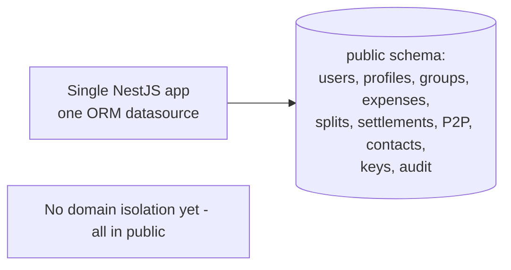

**DOMAIN-01 — Future domain isolation architecture (TARGET)**
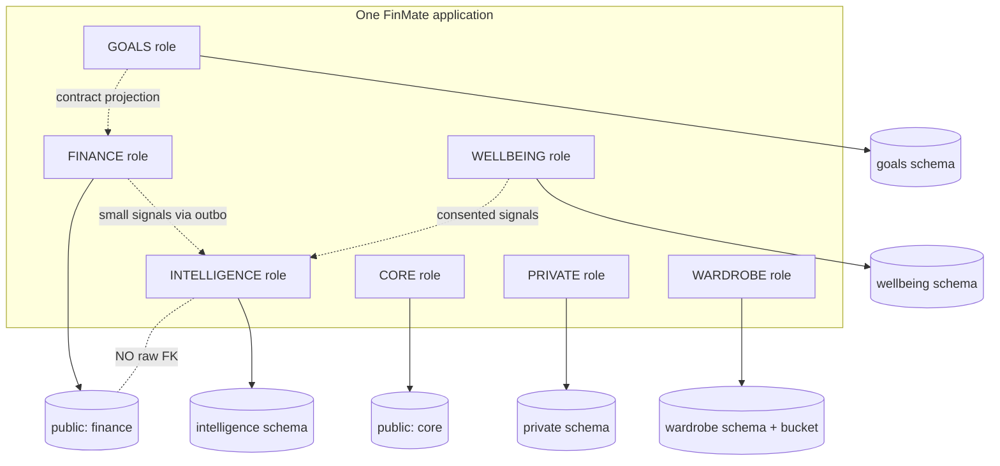

---

## 4. Database isolation

### Simple explanation
Putting data in different folders is **not** security — if one master key opens every folder, a thief who steals it opens everything. Real security means each area has its **own** login that can only touch its own area.

### Technical explanation (locked ISO-1 / D-II)
- **[REQUIREMENT]** New sensitive domains use dedicated schemas **plus genuinely separate database principals** (per-domain datasources/pools, or carefully designed RLS). A single superuser ORM connection would defeat isolation — that is explicitly prohibited.
- Existing CORE/FINANCE tables **stay in `public`** (backward compatibility; no risky reshuffle of live finance data).
- Cross-domain access happens only through **defined contracts/projections**, never cross-schema JOINs from a restricted role. CORE gets only **narrow** grants where FKs require it (e.g., `users.id`), not blanket access.

**DBISO-01 — Database / domain isolation (TARGET)**
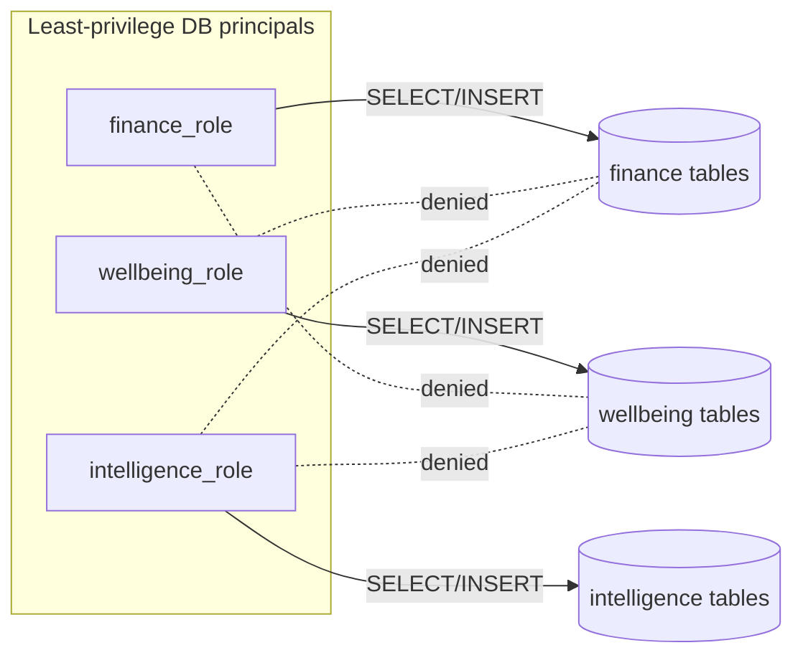
> **"Different folders are not security."** The role boundary — not the schema name — is the control.

---

## 5. Encryption architecture

**ENC-01 — Two encryption classes (locked K-1/K-2)**
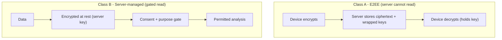

### Class A — E2EE
**Simple:** Your device locks the information before sending it. FinMate stores the locked box and the locked-up key, but never the real key. Only your device can unlock it.
**Technical:** Web Crypto AES-256-GCM; the data key is wrapped under the user's master key (and recovery key). Backend stores ciphertext + wrapped key material only; it has **no** decryption path. Applies to **PRIVATE/journal, expense/note/goal/P2P free-text, settlement.note (FLD-1), group.description (FLD-2), wardrobe photos, attachments**.

### Class B — Server-managed encryption
**Simple:** Some helpful features (like spotting that your mood dips after late-night spending) need FinMate to actually read the data. That data is still encrypted when stored, and FinMate can only unlock it when you've said yes and only for that purpose.
**Technical:** Per-user/per-domain server-managed keys (new key store, **not** the global `EncryptionService`); encrypted at rest; decryption gated by consent + purpose. Applies to **WELLBEING mood metrics, INTELLIGENCE derived data**. **[REQUIREMENT]** never classify server-readable wellbeing as E2EE.

**Not encrypted at field level (by design, PRIN-1):** Zone-2 numbers, group.name, nickname, income, invitedEmail — server functionality genuinely needs to read them; protection is authorization + isolation + infra encryption.

---

## 6. Key management

### Simple explanation
Think of nested boxes. Your **password** opens your **master key**. Your master key opens each area's **own key**. If you ever lose your password, a **recovery code** can still open the master key. If FinMate needs to permanently delete an area, it **destroys that area's key** — the locked data then becomes permanently unreadable ("crypto-shred").

### Technical explanation (locked K-1/K-2/K-3/K-4)
- **Master key:** PBKDF2 from password (existing); cached non-extractable in IndexedDB + memory.
- **Domain keys (Class A):** **random** per-domain/per-entry AES-256-GCM keys, **wrapped under master + recovery**. **[REQUIREMENT] Not HKDF-derived** — deterministic keys can't be crypto-shredded.
- **Recovery key:** wraps every domain key so a password reset never orphans data; **recovery setup mandatory before storing E2EE data** (REC-1).
- **Shared P2P entry key:** per-entry content key wrapped for **both** registered users (FLD-1 settlement/B-2 P2P).
- **Server-managed domain key (Class B):** per-user, in a new server/KMS store; destroyable for crypto-shred.
- **Rotation (ROT-1):** event-driven; immutable version history; no retroactive-revocation claim. Existing group-key `versionId` bug (SEC-KI1) must be fixed first.
- **Crypto-shred:** destroy the key → ciphertext unreadable.

**[REQUIREMENT — honesty, K-4]** Crypto-shred is **not** sub-backup-window instant: wrapped keys also live in backups and may be cached on devices. True erasure completes only after device-cache clear **and** backup rotation.

**KEY-01 — E2EE key architecture (Class A)**
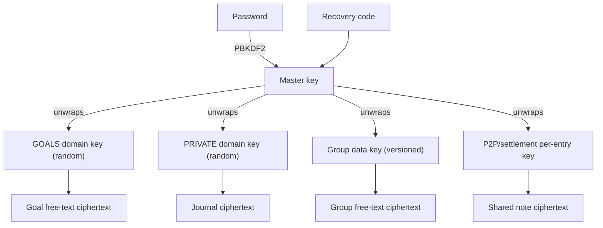

**KEY-02 — Server-managed encryption (Class B)**
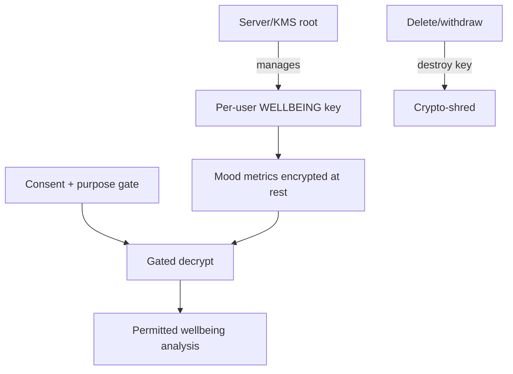

---

## 7. Data access

### Simple explanation
Different helpers inside FinMate can see different things. Your locked journal? Nobody but you. Your expense amounts? FinMate's finance helper, yes; the AI, only as a summary; adverts/analytics, no.

### Technical explanation (from the frozen matrix — no new access invented)
| Data | User | Backend | DBA | Domain svc | INTELLIGENCE | Analytics | External AI | Support/Admin |
|---|---|---|---|---|---|---|---|---|
| E2EE free-text (Zone 1a) | YES | **NO** | NO | NO | NO | NO | NO | NO |
| Wrapped key material | YES | NO | NO | NO | NO | NO | NO | NO |
| Amounts/splits (Zone 2) | YES | YES | YES ⚠OPS-1 | YES(own) | COND (projection) | COND (aggregates) | COND (numeric+consent) | COND (break-glass) |
| monthlyIncome (FLD-5) | YES | YES | YES ⚠ | FINANCE | COND (projection) | NO | COND (projection) | COND |
| group.name/nickname (FLD-3/4) | YES | YES | YES | group-scoped | NO default | NO | NO default | COND |
| WELLBEING mood (1b) | YES | COND (gated) | NO | WELLBEING | COND (consent) | NO | NO default | COND |
| Contacts PII (CNT-1) | YES(own) | YES | YES | FIN/CONTACTS | **NO** | NO | **NO** | COND |
| Derived/INTELLIGENCE | YES(own) | COND | NO | no cross-domain | YES(owner) | NO | COND (projection) | COND |

**CONDITIONAL gates:** projection/firewall (AI-1/2), consent (CON-3/AI-5), DPIA flag (INT-3/DPIA-1), break-glass (ACC-1). **⚠OPS-1:** DBA/backend plaintext read of Zone-2 finance is the recorded insider residual.

---

## 8. AI privacy firewall

### Simple explanation
**External AI never gets FinMate's database.** When you ask the AI a question, FinMate first works out what the task needs, checks you've agreed, then hands the AI a tiny summary of numbers — never your raw transactions, journal, or contacts. The AI answers; FinMate shows you.

### Technical explanation (locked AI-1..5, INT-1..4, DER-1, OUT-1, VEN-1)
- **AI-1:** all external AI (and any future self-hosted) passes one egress firewall — the only audit/enforcement point.
- **AI-2:** V1 projections are **numeric/enum/aggregate only** — no stored user free-text.
- **AI-3:** server owns model + system prompt; `assistant_qa` receives a fixed capped projection + the user's question as **untrusted input**; **stateless** (no transcript retention).
- **AI-4:** custom categories mapped to controlled enums before egress; merchant-level insights out of V1.
- **AI-5 / VEN-1:** explicit external-AI consent; verified ZDR/no-training provider config.

**AI-01 — AI data flow / privacy firewall**
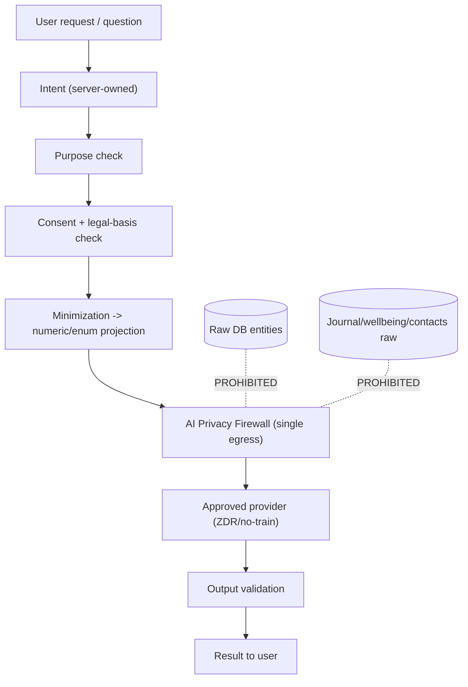

**AIBND-01 — External AI privacy boundary**
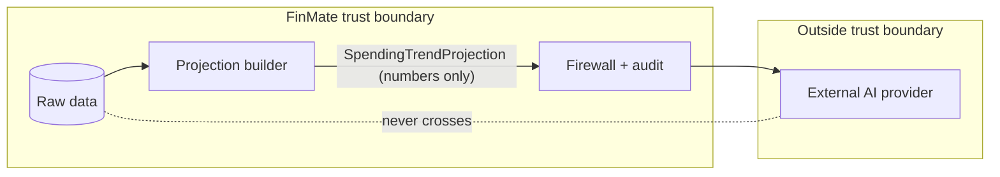

---

## 9. Wardrobe AI (locked WARD-1)

### Simple explanation
For outfit tips, FinMate may send a clothing photo to an approved AI. FinMate never tries to recognise faces or people. It tries to crop out faces/backgrounds first — but that cropping is a *bonus*, not the thing that decides where the photo can go. If FinMate can't send it safely, it simply **doesn't send it**.

### Technical explanation (with the locked correction)
- **Baseline:** route **all** wardrobe vision through an **approved/ZDR provider config** appropriate to the sensitivity.
- **Additional protection:** best-effort face/background minimization — **but it must NOT be the condition that decides whether an *unapproved* provider may receive the image** (face detection can false-negative → fail-open). Minimization is additive, never the gate.
- **Fail-closed:** if neither reliable minimization nor an approved path is available, the operation **does not proceed**.
- **Hard prohibitions:** no facial recognition, identity recognition, biometric profiling, sensitive-trait inference, or intentional face/background use.

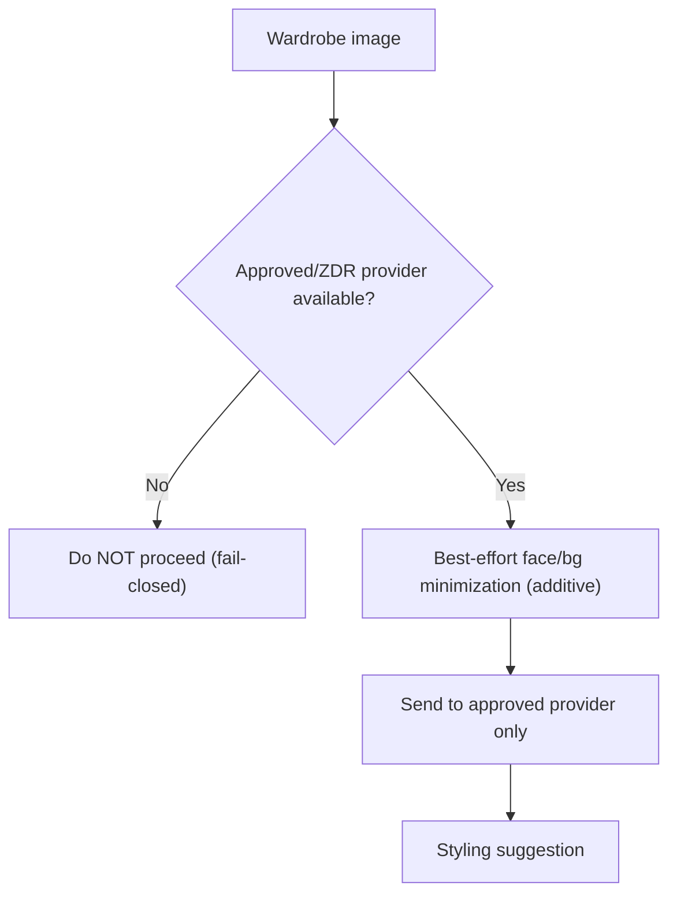

---

## 10. Wellbeing (locked A3 / K-2)

### Simple explanation
Mood is private and sensitive. FinMate only collects a simple mood score, and only analyses it if **you turn wellbeing analysis on**. Your written feelings (journal) stay locked so even FinMate can't read them. Detailed medical data isn't collected yet.

### Technical explanation
| Stage | Behaviour |
|---|---|
| Collection | mood metric (numeric) only in V1; journal/free-text = E2EE (Class A); detailed health **deferred** |
| Storage | Class B — encrypted at rest under a **per-user WELLBEING key** (server-managed) |
| Analysis | only through explicit consent + purpose gate; off by default |
| Consent | explicit (special-category); tiered ledger (CON-3) |
| Withdrawal | stop processing + invalidate derived + revoke analysis-key access (CON-1) |
| Derived | signals to INTELLIGENCE with provenance; no raw mood to INTELLIGENCE/AI |
| Deletion | crypto-shred the per-user WELLBEING key |
| Gating | profiling stays flag-OFF until DPIA sign-off (INT-3/DPIA-1) |

**[COUNSEL]** Any server-readable mood data is likely GDPR Art. 9 special-category; DPIA required before wellbeing analysis goes live.

---

## 11. Intelligence — three independent states (locked RGT-1, INT-4)

### Simple explanation
Three different "off switches" that are **not** the same thing:
1. **Override/suppression** — "That guess about me is wrong." FinMate must never quietly bring it back.
2. **Restriction** — "Pause using this for now" (reversible).
3. **Consent withdrawal** — "Stop this kind of processing" (and throw away what was derived).

### Technical explanation
| State | Meaning | Persistence | Reversible? |
|---|---|---|---|
| Override/suppression (RGT-1/INT-4) | reject a specific derived fact | **stored independently of the derived data** so a withdraw→re-consent cycle can't resurrect it | no (per-fact) |
| Restriction (RGT-1) | temporary pause of processing | reversible flag, distinct from withdrawal | yes |
| Consent withdrawal (CON-1) | stop processing + invalidate derived + revoke key | records withdrawal; retains raw | yes (re-consent) |

**Critical invariant (INT-4):** a rejected inference must **not** silently regenerate after recomputation; suppression survives derived-data deletion and re-consent.

**Provenance (INT-2):** domain + opaque source IDs + confidence + date + reason — **no raw source data**.

---

## 12. Data lifecycle

### Simple explanation
Data is collected, sorted by how private it is, stored in the right locked area, used only for its purpose, sometimes turned into a helpful summary, always under your control, and finally exportable or deletable.

### Technical explanation
**LIFE-01 — Data lifecycle**
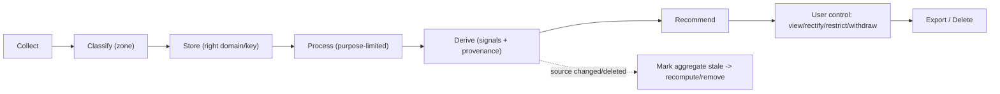
**[REQUIREMENT DER-1]** For aggregate-derived facts: **mark-stale → recompute**, never per-record deletion from an aggregate. Delete/invalidate events travel on the **durable outbox (OUT-1)**.

**FLOW-01 — User data flow (finance example)**
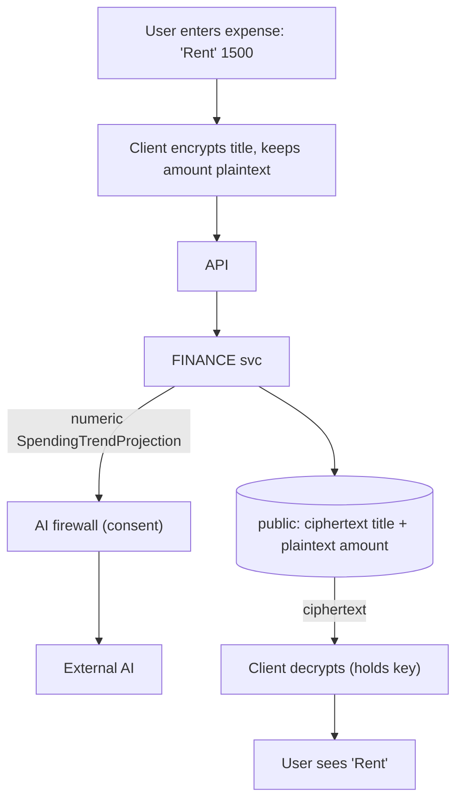

---

## 13. Consent (locked CON-1/2/3)

### Simple explanation
**Turning a feature off is not the same as deleting your data.** If you switch off wellbeing personalization, FinMate stops using it and throws away the conclusions it made — but your original entries stay unless you also ask to delete them.

### Technical explanation
- **Consent ledger:** scope + policy version + timestamp + withdrawal state.
- **Legal basis:** legitimate interest for Level-1 single-domain finance aggregates (with opt-out); **explicit consent** for wellbeing, cross-domain correlation, external-AI egress. Legitimate interest **cannot** cover Art. 9. **[COUNSEL]**
- **First-party display exception (CON-2):** showing you your own single-domain data is not "personalization" and is not consent-gated (protects the existing dashboard).

**CONSENT-01 — Consent withdrawal flow**
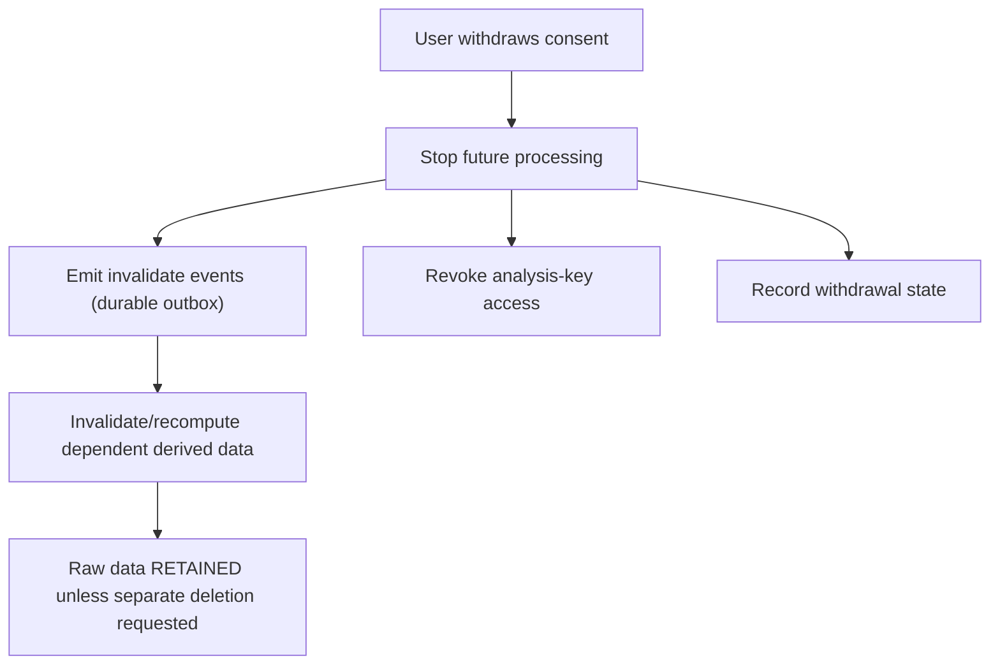

---

## 14. Account deletion (locked DEL-1/2/3)

### Simple explanation
If you delete your account, FinMate erases your personal data — but it can't erase shared money records that *other* people legitimately rely on (a debt you shared with a friend). Instead, your name is removed/blanked from those shared records while the numbers others need stay.

### Technical explanation
- **Personal-scope data:** erased.
- **Shared financial records + audit:** retained where legally justified, with the **departed identity tombstoned/pseudonymized in place** — because existing NOT-NULL user FKs (`expenses.ownerUser`, `direct_ledger_entries.from/toUser`, `settlements`, `audit_logs.actorUser`) make row-DELETE impossible without corrupting others' ledgers.
- **[COUNSEL]** retention basis; and whether a departed user's personal content inside retained shared free-text (settlement/P2P notes) needs redaction (DEL-3).

**DEL-01 — Deletion flow**
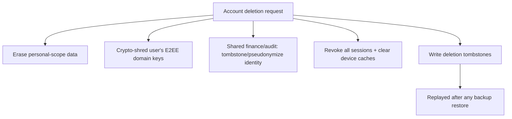

---

## 15. Crypto-shred + backups (locked K-4, DEL-2, RET-1)

### Simple explanation
Deleting a row from the live database doesn't instantly wipe the old **backups**. So FinMate promises deletion within a set window, after which backups have rolled over. Destroying a key ("crypto-shred") helps, but the old key can still sit in a backup until that backup expires.

### Technical explanation
- Deletion = revoke sessions + clear device caches + destroy domain key + delete rows + write **tombstones replayed after restore** (DEL-2).
- Backups/PITR/WAL still contain data (and wrapped keys) until rotation → erasure SLA is the **backup window** (RET-1, parametric — ~30 days working figure, to be verified against real infra/vendor retention; **not** hard-coded yet).
- **[REQUIREMENT]** do not market "instant" crypto-shred (K-4).

---

## 16. Authentication (locked AU-1/AU-2/AU-2a/AU-4)

### Simple explanation
FinMate keeps you logged in with two tokens. The short one lives only in memory. The "keep me logged in" token is stored in a locked browser cookie the page's own code can't read (so a script attack can't steal it). On phones it's kept in the device's secure vault instead, because phone apps handle cookies differently.

### Technical explanation
**Production topology (resolved AU-2):** FE `https://finmate.prvnsahni.com`, API `https://finmate-api.prvnsahni.com/api/v1/` → same registrable domain `prvnsahni.com` → **schemefully same-site, cross-origin** → **SameSite=Lax is correct**.

**Web (AU-2a):** access token in memory; refresh token in **HttpOnly + Secure + SameSite=Lax** cookie, **host-only** to the API host, **path-scoped** to `/api/v1/auth/refresh`; **exact CORS** (`https://finmate.prvnsahni.com`, credentials, never `*`); **CSRF** double-submit on the cookie-authed refresh; FE CSP `connect-src` allows the API host.
**Native:** refresh token in iOS Keychain / Android Keystore; sent by **header**; no reliance on WebView cookies.
**Backend:** distinguishes transports by capability (never `if(iOS)`); cookie-presented refresh **always** requires CSRF; the header path is **never** satisfiable by an ambient cookie. Rotation + Redis session hashing retained.
**Old clients (AU-4):** dual-emit body token retained until a **minimum-supported-version** policy sunsets old web **and** old mobile installs.

**AUTH-01 — Authentication flow (web)**
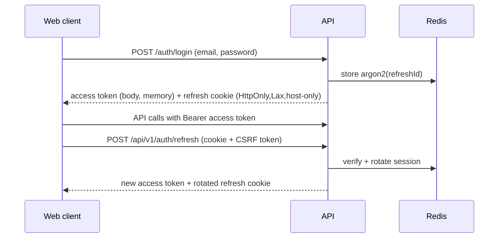

---

## 17. Web / iOS / Android

### Simple explanation
The rules are the same everywhere (same locks, same keys), but the *storage spot* differs: browsers use a locked cookie; phones use the device's secure vault. No security feature is allowed to work in browsers only.

### Technical explanation
| Concern | Web/PWA | iOS/Android (Capacitor) |
|---|---|---|
| Access token | memory | memory |
| Refresh token | HttpOnly Lax cookie | Keychain/Keystore, header transport |
| E2EE keys | IndexedDB (non-extractable) + memory | secure storage + memory |
| Cookie same-site | works (same registrable domain) | WebView origin is cross-site → **must** use header transport |
| Sensitive caching | exclude from service-worker cache (SEC-W5) | secure local storage; screenshot/snapshot + deep-link (Universal/App Links) hardening |

**AUTH-02 — Web vs Native authentication**
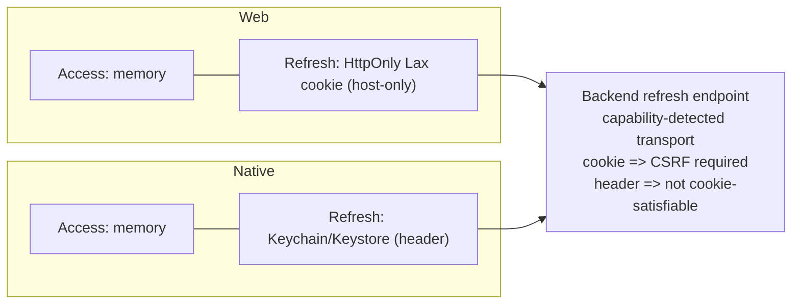

---

## 18. Logging / cache / telemetry (requirements & risks, not fixes)

### Simple explanation
FinMate must be careful that private details don't leak into places people forget about — logs, browser storage, notifications. Several such leaks are known and tracked; this document records them, it does not fix them here.

### Technical explanation (from the matrix; cross-referenced)
| Location | Risk | Requirement | Ref |
|---|---|---|---|
| App + proxy logs | tokens/email in query strings; raw IP | redact query params; hash/drop IP; allowlist logging | **SEC-W2** |
| audit_logs.metadataJson | plaintext email | minimize PII | **SEC-W7** |
| Git history | committed encrypted-image blobs; no scanning | secret scan + history purge + rotate | **SEC-W1** |
| Browser localStorage | refresh token (current) | move to HttpOnly cookie | **SEC-W3** |
| Service worker / PWA cache | may cache finance responses | exclude sensitive endpoints | **SEC-W5** |
| IndexedDB vault | master key usable under XSS | harden CSP; gate Swagger | **SEC-W5** |
| attachment.originalName | plaintext + encrypted duplication | drop plaintext / never log | **SEC-W6c**, FLD-6 |
| trust proxy | spoofable XFF | condition on trusted proxy | **SEC-W9** |
| group-key rotation | versionId ignored → history undecryptable | fix backend param | **SEC-KI1** |
| DB access | DBA/backend plaintext read of Zone-2 finance | least-privilege creds + audit (residual) | **OPS-1** |
| Notifications | none yet | content-free payloads | NOT-1 |

---

> **⟳ SEC-KI1 STATUS CORRECTION — 2026-08-13 (additive; the §18 row "group-key rotation … versionId ignored → history undecryptable … SEC-KI1" and the §5 ROT-1 prerequisite note are preserved as historical).** Repository verification ([FINMATE_SEC_KI1_VERIFICATION.md](FINMATE_SEC_KI1_VERIFICATION.md)) established that `GET /groups/:id/keys/me?versionId=` **honors the requested version** (fixed 2026-07-17): SUPERSEDED versions remain available, REVOKED is rejected, caller-specific wrapped keys are returned, and the write path stamps the client-declared version. **Historical canonical expenses remain decryptable after normal rotation** → **MITIGATED/VERIFIED** (was P2 OPEN at discovery); the ROT-1 "fix versionId first" prerequisite is **satisfied**. **M-KEYVER = VERIFY-ONLY — no migration, no re-encryption, no production change.** Residual (display-only, not data loss): **GRP-007** history-log ciphertext-title placeholder. Separate open items: GRP-005, legacy NULL-`versionId` (needs prod verification), REVOKED semantics — [PRODUCT/SECURITY DECISION REQUIRED].

## 19. Existing production compatibility (mandatory)

### Simple explanation
FinMate is already live. Nothing here is a "start over." New locks are added to **new** records; old records keep working, and old apps keep working until people have had time to update.

### Technical explanation
| Item | CURRENT | TARGET | Compatibility risk | Migration | Rollback | User impact |
|---|---|---|---|---|---|---|
| **direct_ledger.note** (B-2) | plaintext (prod data) | E2EE new + mixed-state | readers must branch on marker | additive marker + client backfill | plaintext branch retained | none for existing |
| **settlement.note** (FLD-1) | plaintext (prod data) | E2EE new + mixed-state | same | additive marker + client backfill | plaintext branch | none |
| **group.description** (FLD-2) | plaintext (prod data) | E2EE new + mixed-state | pre-join display **[ENG-UNKNOWN]** | additive marker + client backfill | plaintext branch | must not break member display |
| **attachment.originalName** (FLD-6) | plaintext (+encrypted dup) | minimize; internal id | existing must stay readable | stop plaintext for new; resolve SEC-W6c | re-enable plaintext | none visible |
| **invitedEmail** (FLD-7) | plaintext (prod data) | plaintext-but-protected + retention | none | additive retention purge | disable purge | none |
| **auth transition** (AU-1/AU-4) | refresh in body | cookie/header dual-transport | **breaks on hard cutover** | dual-emit + min-version | re-enable body emit | none if phased |
| **old mobile clients** (AU-4) | read token from body | header transport | breaks un-updatable installs | keep body until min-version | extend window | none until sunset |

**[REQUIREMENT]** Never assume clean-slate; every prod-data encryption uses additive marker + client backfill + **permanent mixed-state**. group.name/nickname/income stay readable (no migration).

---

## 20. Threat model summary (full model = later document)

### Simple explanation
Here's how the design holds up if something goes wrong — a stolen database, a hacked AI provider, a bad script in the browser, a lost phone.

### Technical explanation (defenses; full model deferred to the Threat Model doc)
| Threat | Primary defense | Residual |
|---|---|---|
| Database compromise | E2EE (1a) unreadable; keys wrapped | Zone-2 finance readable (OPS-1) |
| Stolen credentials/session | rotation, Redis hashing, revoke-all, short access TTL | — |
| Malicious insider | least-privilege roles, break-glass + audit (ACC-1) | Zone-2 plaintext read (OPS-1) |
| Compromised AI provider | only numeric projections cross firewall; ZDR | consented projection exposure |
| XSS | non-extractable keys; CSP hardening (SEC-W5) | runtime use of keys in-session |
| CSRF | SameSite=Lax + double-submit token (AU-2a) | — |
| Leaked logs | redaction requirements (SEC-W2/W7) | until implemented |
| Compromised device | secure storage; session/key clear on logout; app-lock (roadmap) | cached data pre-lock |
| Backup restore | tombstone replay (DEL-2) | window until rotation |
| Cross-domain access | deny-by-default + DB roles (ISO-1/2) | needs real principals |
| Prompt injection | numeric-only projections; untrusted question; server prompt | system prompt exposure |
| Malicious external input (scraping) | isolated OPPORTUNITIES + egress allowlist (SCR-1) | future |

**THREAT-01 — Security boundaries**
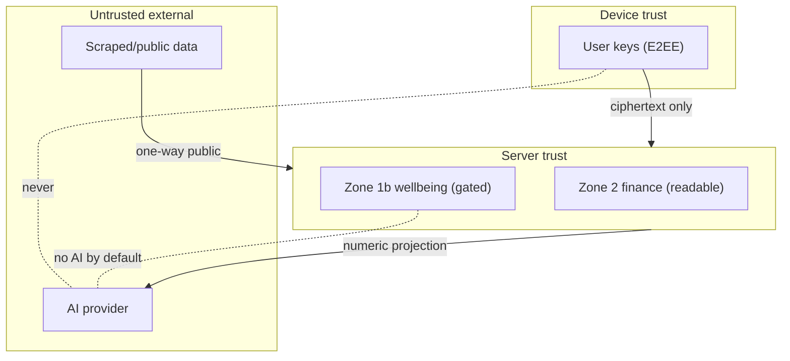

---

## 21. FinMate Security Explained in 5 Minutes

- **What FinMate knows:** your expense amounts, dates, categories, balances, who owes whom, your budget/income, group names — the numbers it needs to help with money.
- **What FinMate does NOT know:** your journal, your private notes, your locked expense/goal/settlement/group descriptions, your wardrobe photos — these are **locked with your key**; the server only holds the locked box.
- **What the AI can see:** only tiny number summaries (like "food +18%") and only if you agree — never your raw transactions, journal, contacts, or photos.
- **What is encrypted:** the private free-text and photos are end-to-end encrypted (only you). Mood data (if you turn it on) is encrypted but FinMate can read it under strict rules. Passwords are hashed; keys are wrapped.
- **Who can decrypt:** **you** for the locked stuff. FinMate's finance helper for the money numbers. The AI, never — it only gets summaries.
- **When you delete data:** personal data is erased and your keys destroyed; shared money records keep the numbers others need but blank your identity; backups roll off within a set window.
- **If FinMate's database is stolen:** the thief gets locked boxes for journals/photos/private notes (unreadable) and can see finance numbers (which is why access is tightly controlled and audited).
- **If an AI provider is compromised:** it only ever held tiny number summaries you consented to — not your database.

---

## 22. Diagram index

| ID | Name | Purpose | Audience |
|---|---|---|---|
| SEC-ARCH-01 | Current system architecture | show what exists today | all |
| SEC-ARCH-02 | Target security architecture | show the end-state | all |
| DATA-01 | Current data/domain architecture | show single-schema reality | eng |
| DOMAIN-01 | Future domain isolation | show bounded domains + signals | eng |
| DBISO-01 | Database/domain isolation | roles as the boundary | eng |
| ENC-01 | Two encryption classes | E2EE vs server-managed | all |
| KEY-01 | E2EE key architecture | key wrapping hierarchy | eng |
| KEY-02 | Server-managed encryption | gated decrypt + shred | eng |
| AI-01 | AI data flow / firewall | minimization pipeline | all |
| AIBND-01 | External AI privacy boundary | what never crosses | all |
| LIFE-01 | Data lifecycle | collect→delete | all |
| FLOW-01 | User data flow (finance) | concrete example | all |
| CONSENT-01 | Consent withdrawal | withdrawal ≠ deletion | all |
| DEL-01 | Deletion flow | shared-ledger deletion | all/eng |
| AUTH-01 | Authentication flow (web) | token flow | eng |
| AUTH-02 | Web vs native auth | platform difference | eng |
| THREAT-01 | Security boundaries | trust zones | all |

---

## 23. Final reconciliation

Checked against `FINMATE_DECISION_LEDGER.md` (incl. §16 addendum) and `FINMATE_DATA_CLASSIFICATION_ENCRYPTION_MATRIX.md`:

- **No locked decision changed.** All content restates Z-1/Z-2/Z-3, PRIN-1, K-1..4, ISO-1/2/3/4, AI-1..5, INT-1..4, DER-1, OUT-1, VEN-1, CON-1..3, DEL-1..3, AU-1/2/2a/4, ROT-1, REC-1, OFF-1, EXP-1, NOT-1, WARD-1, A3/K-2, RGT-1..3, CNT-1/2, FLD-1..7, ACC-1, DPIA-1, RET-1, GOV-1..5.
- **No field classification changed.** FLD-1..7 and all zone assignments match Document #2 exactly.
- **No encryption decision silently changed.** E2EE vs server-managed vs plaintext-but-protected assignments match; HKDF explicitly excluded (K-1).
- **No new product decision invented.** Where this doc adds detail (diagrams/explanations) it derives from locked items; nothing new is decided.
- **No existing functionality unnecessarily redesigned.** CORE/FINANCE stay in `public`; existing E2EE preserved; migrations are additive/mixed-state.
- **All P0/P1 risks represented:** P0 SEC-W1/W2/W3; P1 SEC-W6c/W7/OPS-1; P2 SEC-W5/W9/KI-1 (§18, §20).
- **All counsel items remain [COUNSEL]:** DEL-1 basis, DEL-3, CON-3 bases, VEN-1 transfers, DPIA-1, CNT-1, FLD-1/2/3/4/5/7 legal classification, wellbeing Art. 9.
- **All ENG-UNKNOWN remain marked:** FLD-2 pre-join display, FLD-6 prod rows, version/recurring-split columns, SW cache groups, prod CORS, deployed refresh storage.
- **Backward compatibility represented:** §19 + AU-4 + mixed-state throughout.
- **Contradictions found:** **NONE** — no STOP-and-report condition triggered; Documents #1 and #2 were not modified.

---

## DOCUMENT STATUS: **FROZEN** ✅

This Security & Privacy Architecture is consistent with the frozen ledger and matrix, dual-leveled (simple + technical), and diagram-complete (17 diagrams). No code, schema, migration, encryption, API, or production change was made.

*End of Document #3 (FROZEN). STOP — not proceeding to Document #4 (Key Management), the Threat Model, or the SRS.*
