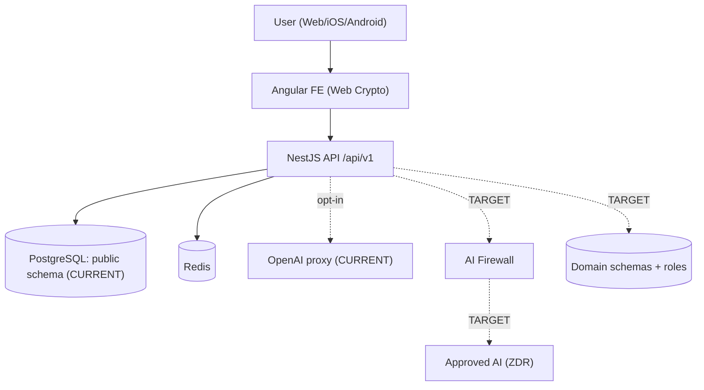
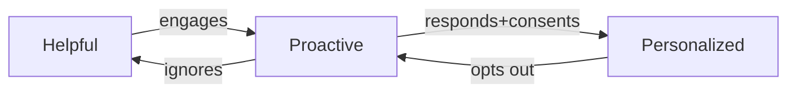
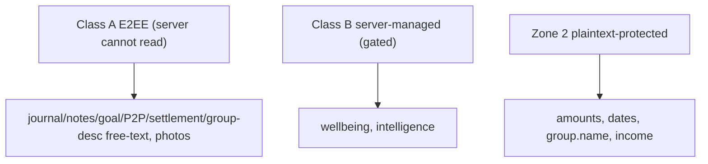
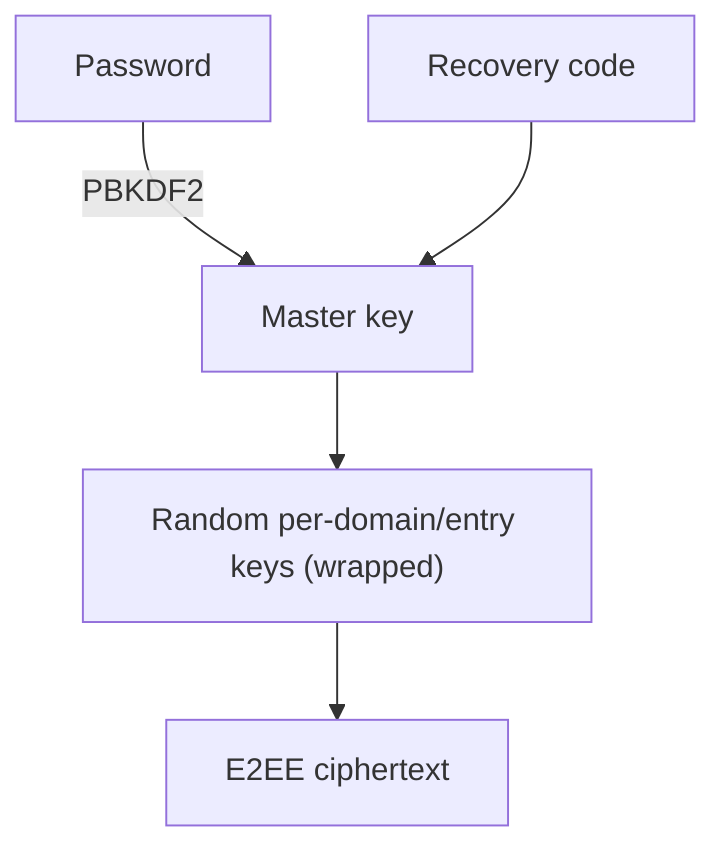
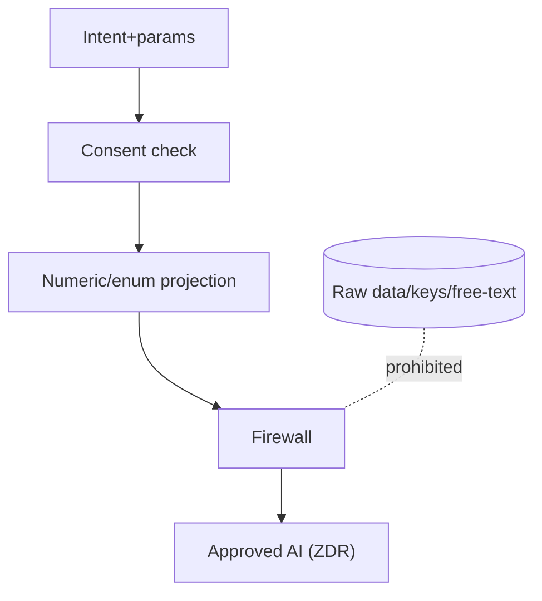
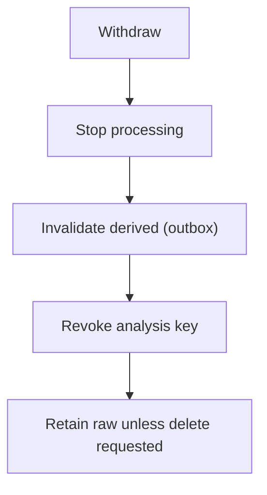
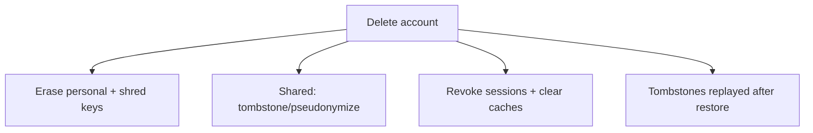
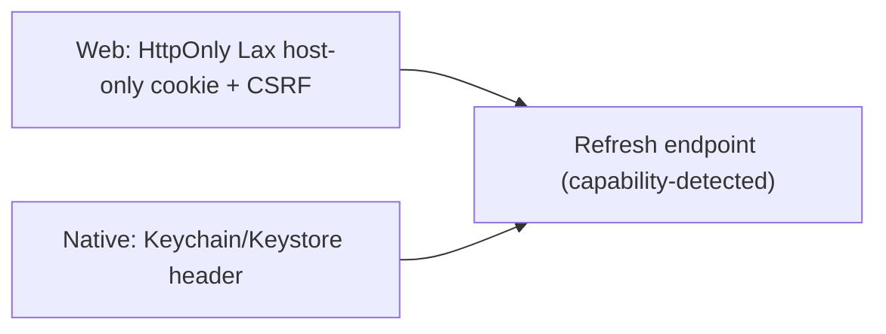
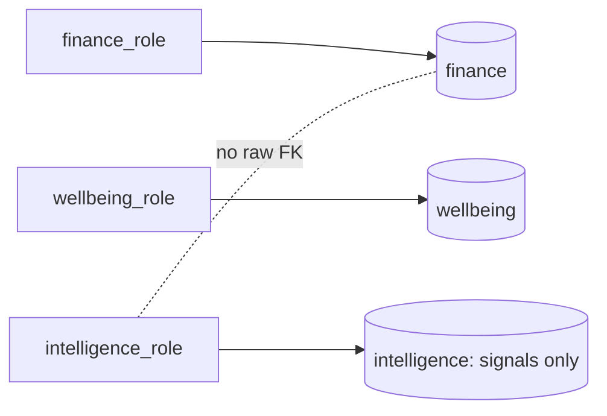
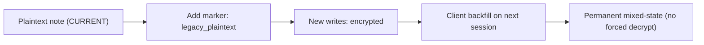

# FinMate — Software Requirements Specification (SRS)

**Classification:** HIGHLY CONFIDENTIAL. **Type:** Master product + engineering requirements (specification, **not** an implementation plan).
**Nature:** Documentation only. No code, DB, migration, API, auth, encryption, frontend, mobile, deployment, config, or any prior document (#1–#12) changed. No new architectural decision is invented; unsupported items are marked `[OPEN QUESTION]`, `[ENGINEERING PARAMETER]`, or `[PRODUCT DECISION REQUIRED]`.
**Governing principle:** *"Secure the existing product without unnecessarily breaking the product."* Existing production functionality is a **protected baseline**.
**Compliance stance:** never claims GDPR/ISO/SOC 2 compliance — only "intended to support GDPR-aligned design" with `[COUNSEL / COMPLIANCE VALIDATION REQUIRED]` where relevant.

**Requirement format (every row):** `ID · M (MUST/SHOULD/MAY) · Pri (P0–P3) · Scope (CUR=current/protected, V1C, V1O, V2, FUT) · Requirement · Reason (threat/decision) · Src · Compatibility · Acceptance`.
**Priority order:** 1 Security/legal → 2 Existing critical functionality → 3 Backward compatibility → 4 New architecture → 5 Convenience. Every SEC requirement names its concrete threat.

## §0. Revision history

**Version 1.0 — FROZEN 2026-08-12.** Final SRS freeze review passed; all 18 freeze conditions met (see §37). Supersedes the R1 working draft; the R1 corrections and history below are retained unchanged. Change control: any post-freeze change requires a new dated revision entry here (R2+) — no silent edits.

**R1 — 2026-08-12 — Adversarial-review corrections (F-01…F-18).** Applied the approved findings from the SRS adversarial review. No requirement ID was deleted; strengthened requirements keep their IDs; one split (UX-005 → UX-005 + new UX-005b); added requirements (IMP-001, EXP-001, FIN-013, FIN-014, SEC-013, AUTH-007, OBS-006, AI-013, UX-005b) and open questions (OQ-15, OQ-16). No frozen decision changed; no code/DB/migration touched.

**PO decisions applied:** F-02 (auth sunset condition + parameterized date), F-06 (Personalized → V2), F-07 (V1 notifications in-app; OS push TARGET/gated).

**R1 backward-compatibility notes (corrections touching existing features):**
| Correction | Current | Target | Compat | Migration | Rollback | User | Risk |
|---|---|---|---|---|---|---|---|
| F-01 FIN-002/007 | calc engine + manual entry | parity-tested + confirmable quick-add defaults | none (protective) | none | keep manual entry | faster entry, no silent change | LOW (protective) |
| F-02 AUTH-005/SEC-003 | refresh token in body | cookie/header + sunset removal | HIGH | dual-emit; parameterized sunset date | re-enable body | none if phased | HIGH |
| F-09 MIG-001/002/003 | plaintext notes/desc | E2EE + defined backfill actor/key | MEDIUM | additive marker + client backfill | plaintext branch | none | MEDIUM |
| F-10 IMP/EXP | import/export working | preserved + round-trip test | none | none | n/a | none | LOW |
| F-14 GRP-003/006 | existing plaintext fields | field CUR + new behaviour additive | none | additive (invitedEmail purge) | disable purge | none | LOW |
| F-17 SEC-013/AUTH-007/OBS-006/FIN-013/014 | throttler, email, audit, month-lock, spectator all exist | preservation + tests | none (protective) | none | n/a | none | LOW |

---

# FinMate in 5 minutes

### Simple explanation
FinMate is a money app that helps you *understand* and *decide*, not just record. You add expenses, split them with friends, and see who owes whom. FinMate shows the few things that matter, explains what changed, and — over time, only if you want it — offers useful suggestions. Your private words are locked so even FinMate can't read them; your data isn't sold; and you can see, fix, or delete anything FinMate has learned. It never moves your money by itself.

### Technical explanation
FinMate is an Angular (Web/PWA + Capacitor) + NestJS + PostgreSQL + Redis application. Today it ships a full finance core (expenses/groups/settlements/People-P2P/recurring) with client-side E2EE for free-text fields and a thin opt-in AI proxy. This SRS specifies: (a) **preservation** of that core, (b) **additive** V1 improvements (low-friction capture, decision dashboard, goals, ranked notifications), (c) **target** security/privacy hardening (auth transport, domain isolation, AI privacy firewall, per-domain keys), and (d) **future** domains (wellbeing/wardrobe/opportunities), each traceable to the frozen architecture and threat model.

**Glossary:** E2EE = end-to-end encrypted (server can't read) · Zone 2 = server-readable, protected · ZK = zero-knowledge · Class A/B = user-held vs server-managed keys · projection = minimized numeric/enum data sent to AI · tombstone = deletion marker replayed after restore.

---

## §1. Document map

| Document | Provides |
|---|---|
| #1 Decision Ledger | approved decisions (IDs) |
| #2 Data Classification Matrix | field classification |
| #3 Security & Privacy Architecture | security structure |
| #4 Key Management | encryption/key behaviour |
| #5 AI Firewall | AI data boundaries |
| #6 IP/AI Confidentiality | IP protection |
| #7 Threat Model | threats (T-IDs, SEC-IDs) |
| Processing Register | processing activities |
| Competitive Lessons / Product Principles | product direction |
| Current Baseline (#11) | existing functionality (CURRENT/TARGET) |
| UX Spec (#12) | user experience |
| **SRS (this)** | **consolidated testable requirements** |

## §2. Product vision, user, principles

### Simple
FinMate helps ordinary people see where their money and key decisions are going, decide better, and improve — starting with money, later broader life context.

### Technical
**Core loop:** Capture → Understand → Prioritize → Decide → Act → Learn → Improve. **Evolution:** Helpful → Proactive → Personalized (earned). **Primary user:** young professionals / capable-but-not-expert people; multiple behaviour patterns (Recorder, Drifter, Skeptic, Goal-seeker, Overwhelmed, Curious). **Principles** (from #10): help decide not just record; low-effort recording; explain before advising; never shame; reason to return not obligation; privacy as a product feature; personalization is earned; user in control; notifications earn attention; outcomes over screen time; coherent modules; secure existing product; no unnecessary data collection.

## §3. Scope

| Scope | Contents |
|---|---|
| **V1 CORE** | existing finance core (protected) + low-friction capture + decision dashboard + goals + goal priority ordering + ranked notifications + useful first session + privacy/security foundations + compatibility-safe improvements |
| **V1 OPTIONAL** | "while you were away"; statement import (if dependencies safe) |
| **V2** | unknown-charge detection; subscription analysis; cashback/reward verification; bounded advisory AI; earned personalization |
| **FUTURE/RESEARCH** | wellbeing; wardrobe; opportunities; investment support |
| **DO NOT BUILD** | payment gateway; bank; autonomous trading/purchasing; therapist/medical; social network; ad/data-selling; addictive gamification; generic chatbot; unrestricted everything-app |

## §4. Non-goals (FinMate is NOT)
A payment gateway, a bank, an autonomous trading/purchasing platform, a therapist, a medical system, a social network, an advertising/data-selling platform, an addictive gamification product, a generic chatbot, or an unrestricted everything-app.

## §5. Existing system baseline (CURRENT / protected)
Per #11: **CURRENT (protected):** authentication (Argon2, JWT, 2FA, ZK reset, rotation), expenses (multi-payer, splits, refunds, household + carry-forward, version history, soft-delete, E2EE title/desc), groups (+members/roles/invites, key versioning), settlements (derived balances), People/P2P, recurring expenses, import/export, client E2EE + group-key management. **PARTIAL:** AI (thin opt-in proxy). **PLACEHOLDER:** goals (empty table), notes (schema-only). **TARGET (not built):** notifications, attachments upload, wellbeing, wardrobe, opportunities, intelligence, AI firewall, domain isolation, per-domain keys, native mobile hardening.

---

# FUNCTIONAL REQUIREMENTS

## §6. Finance (FIN) — preserve financial correctness

| ID | M | Pri | Scope | Requirement | Reason | Src | Compat | Acceptance |
|---|---|---|---|---|---|---|---|---|
| FIN-001 | MUST | P0 | CUR | Preserve expense create/edit/delete semantics | protected core | #11 | none | existing flows pass unchanged |
| FIN-002 | MUST | P0 | CUR | Preserve total/share/payer/multi-payer/refund/carry-forward/settlement calculations exactly | financial correctness | #11 | none (protected) | **[F-01] A golden-fixture financial parity suite MUST reproduce current production results for: multi-payer, all split types (equal/fixed/percent/share), refunds, household expenses, carry-forward, spectator exclusion, multi-currency, settlements, and P2P where applicable. Current production behaviour is the baseline.** |
| FIN-003 | MUST | P0 | CUR | Amounts remain server-readable (Zone 2), not field-encrypted | computation | Z-2 | none | balances computed server-side |
| FIN-004 | MUST | P0 | CUR | Expense title/description remain E2EE | privacy (T-10) | Z-3 | none | server returns ciphertext only |
| FIN-005 | MUST | P0 | CUR | Optimistic locking (@VersionColumn) on concurrent edits | data integrity | #11 | none | stale edit → CON_VERSION_CONFLICT |
| FIN-006 | MUST | P0 | CUR | Soft-delete + restore window preserved | ledger history | #11 | none | deleted expense restorable in window |
| FIN-007 | MUST | P1 | V1C | Quick-add: create an expense with ≤3 required fields + smart defaults | entry effort (churn) | #10/#12 | additive | expense added in ≤10s; **[F-01] smart defaults are UI pre-fills only and MUST NOT silently modify computed payer/split values; user confirmation required before persistence where a default affects financial semantics** |
| FIN-008 | SHOULD | P1 | V1C | Recent/contextual category suggestions | entry effort | #12 | additive | last-used categories offered |
| FIN-009 | MUST | P1 | V1C | Confirmation before irreversible actions (delete, settle) | error prevention | #12 | additive | destructive action prompts confirm |
| FIN-010 | MUST | P2 | V1C | Refunds continue to behave as negative expenses (inverted balance impact) | protected | #11 | none | refund nets correctly vs prior |
| FIN-011 | SHOULD | P2 | V2 | Payment-method insight only where it yields useful insight | minimization | #10 | additive | no method data without insight surfaced |
| FIN-012 | MAY | P3 | V2 | Optional voice/image capture | effort | #12 | additive | opt-in; not required |
| FIN-013 | MUST | P0 | CUR | **[F-17]** Preserve household month-lock (previous months read-only after lock day) | protected | #11 | none | **test: locked-month expense edit/delete rejected** |
| FIN-014 | MUST | P0 | CUR | **[F-17]** Preserve spectator role never included in splits/settlements | protected | #11 | none | **test: spectator excluded from split & settlement math** |
| IMP-001 | MUST | P1 | CUR | **[F-10]** Preserve spreadsheet import incl. validation + transactional rollback on error | protected | #11 | none | invalid import rolls back atomically |
| EXP-001 | MUST | P1 | CUR | **[F-10]** Preserve export incl. **client-side decryption of E2EE fields** and round-trip fidelity | protected | #11 | none | **export→re-import round-trip preserves data; E2EE decrypted client-side; server never exports plaintext** |

## §7. Groups (GRP)

| ID | M | Pri | Scope | Requirement | Reason | Src | Compat | Acceptance |
|---|---|---|---|---|---|---|---|---|
| GRP-001 | MUST | P0 | CUR | Preserve group create/membership/roles/invites/balances/settlements | protected | #11 | none | existing group flows unchanged |
| GRP-002 | MUST | P0 | CUR | Preserve group-key versioning + per-member wrapping | ZK model | #4 | none | rotation history model intact |
| GRP-003 | MUST | P1 | CUR | **[F-14]** `group.name` (**existing field**) remains plaintext-but-protected (authz + scoping); **new behaviour**: not sent to external AI by default | functional identifier | FLD-3 | none | name usable in UI/search; not in AI egress |
| GRP-004 | MUST | P1 | CUR | `group_member.nickname` plaintext-but-protected, group-scoped | display | FLD-4 | none | not exposed outside group |
| GRP-005 | MUST | P1 | V1C→V2 | `group.description` new writes E2EE; legacy plaintext via marker (mixed-state) | privacy | FLD-2/B-2 | **backfill** | new desc ciphertext; legacy readable |
| GRP-006 | MUST | P1 | CUR | **[F-14]** `invitedEmail` (**existing field**) plaintext-but-protected; **new behaviour**: retention-limited, no AI | 3rd-party PII | FLD-7 | additive (purge) | purge on accepted/expired invite |

## §8. People / P2P (P2P)

| ID | M | Pri | Scope | Requirement | Reason | Src | Compat | Acceptance |
|---|---|---|---|---|---|---|---|---|
| P2P-001 | MUST | P0 | CUR | Preserve direct-ledger lend/borrow/settle + derived balances | protected | #11 | none | balances unchanged vs prior |
| P2P-002 | MUST | P0 | CUR | P2P entries immutable (edits/voids soft-delete, never mutate) | audit integrity | #11 | none | amount never mutated in place |
| P2P-003 | MUST | P1 | V2 | `direct_ledger.note` new writes E2EE (per-entry shared key, both users); legacy plaintext via marker | privacy | B-2/FLD-1 | **backfill** | new note ciphertext; legacy readable; both users decrypt |
| P2P-004 | MUST | P0 | V2 | No server-side forced decryption/backfill of notes | ZK | B-2 | client-only | backfill runs client-side only |
| P2P-005 | MUST | P2 | CUR | Counterparty retains access to shared history after other party deletion | shared records | DEL-1 | none | deletion tombstones payer, keeps note for counterparty |

## §9. Settlements (SET)

| ID | M | Pri | Scope | Requirement | Reason | Src | Compat | Acceptance |
|---|---|---|---|---|---|---|---|---|
| SET-001 | MUST | P0 | CUR | Preserve settlement creation/amounts/status + group balance effects | protected | #11 | none | settlement math unchanged |
| SET-002 | MUST | P1 | V2 | `settlement.note` new writes E2EE (group-scoped key); legacy via marker | privacy | FLD-1 | **backfill** | new note ciphertext; legacy readable |
| SET-003 | MUST | P0 | CUR | Currency consistency guard preserved | ledger integrity | #11 | none | mismatched-currency settlement blocked |

## §10. Recurring expenses (FUN-REC)
| ID | M | Pri | Scope | Requirement | Reason | Src | Compat | Acceptance |
|---|---|---|---|---|---|---|---|---|
| FUN-REC-001 | MUST | P0 | CUR | Preserve recurring templates, scheduler, first-occurrence behaviour, E2EE title/desc | protected | #11 | none | recurring generation unchanged |
| FUN-REC-002 | SHOULD | P2 | V2 | Surface upcoming recurring obligations in "while away"/dashboard | usefulness | #12 | additive | upcoming obligation shown ranked |

## §11. Goals (GOAL) — V1 target

| ID | M | Pri | Scope | Requirement | Reason | Src | Compat | Acceptance |
|---|---|---|---|---|---|---|---|---|
| GOAL-001 | MUST | P1 | V1C | Create/edit/archive/delete goals (target amount, target date, category, status) | goals feature | #10/#12 | new (empty table) | goal CRUD works |
| GOAL-002 | MUST | P1 | V1C | Goal free-text (title/reason/obstacles) E2EE from first implementation | privacy | B-1 | none (empty) | goal text ciphertext; column widened to text |
| GOAL-003 | MUST | P1 | V1C | Structured goal fields (amount/date/progress/priority/status) server-readable for calculation | computation | B-1 | none | progress computed |
| GOAL-004 | MUST | P1 | V1C | User sets priority by moving goal cards up/down; FinMate never auto-changes priority | user control | #10/#12 | new | drag reorders; no auto-reorder |
| GOAL-005 | MUST | P1 | V1C | Creating a goal lands the user on the goal list | priority awareness | #12 | new | post-create navigates to list |
| GOAL-006 | SHOULD | P2 | V1C | Explain how spending affects a goal | decision help | #10 | additive | goal shows spending impact |
| GOAL-007 | SHOULD | P2 | V1C | Periodically ask whether a goal still matters | avoid stale optimization | #10 | additive | prompt after inactivity; **[F-15] frequency = `[PRODUCT DECISION REQUIRED]` (OQ-15)** |
| GOAL-008 | MUST | P2 | V1C | Goals appear prominently on dashboard (near top) | visibility | vision | additive | goals in top section |

## §12. Dashboard & interaction (UX)

| ID | M | Pri | Scope | Requirement | Reason | Src | Compat | Acceptance |
|---|---|---|---|---|---|---|---|---|
| UX-001 | MUST | P0 | V1C | First-session value with **no** mandatory setup wall | onboarding churn | #10/#12 | additive | user sees a real number <5 min, no bank/goal required |
| UX-002 | MUST | P0 | V1C | Dashboard is a ranked decision surface; each card carries an action/answer | decide>record | #12 | additive | **[F-13] design-review checklist: reviewer confirms each shipped card has an attached action/answer (not a binary automated test)** |
| UX-003 | MUST | P0 | V1C | Non-judgmental language; no red "over budget" failure states; ranges not hard caps | guilt→churn | #10/#12 | additive | **[F-13] design-review checklist: no shame/red-failure copy; ranges not caps (manual review)** |
| UX-004 | SHOULD | P1 | V1C | Dashboard customization of what matters | control | #12 | additive | user can reorder/hide cards |
| UX-005 | MUST | P1 | V1C | **[F-06]** **Helpful + Proactive** progression earned by demonstrated response (Personalized stage split to UX-005b) | recommendation fatigue | #10/#12 | additive | ignored suggestions → fewer, not more |
| UX-005b | MUST | P1 | **V2** | **[F-06]** **Personalized** stage: tailored recommendations requiring INTELLIGENCE architecture + applicable DPIA/privacy gates | #10 (V2 scope) | #10/INT/DPIA-1 | additive, gated | not shipped in V1; gated on INTELLIGENCE + DPIA |
| UX-006 | MUST | P1 | V1C | User can stay at Helpful / opt out of proactivity/personalization anytime | control | CON-3 | additive | opt-out honored immediately |
| UX-007 | SHOULD | P1 | V1O | "While you were away" concise ranked summary on return (pull, not push) | passive usefulness | #12 | additive | ranked meaningful items; **[F-15] item cap = `[PRODUCT DECISION REQUIRED]` (OQ-16)** |
| UX-008 | MUST | P1 | V1C | **[F-13]** FinMate MUST NOT implement streaks, badges, leaderboards, or artificial engagement mechanics; success measured by outcomes | anti-addiction | #10 | n/a | **verifiable: absence of streak/badge/leaderboard/engagement-loop mechanics in the product** |

## §13. Notifications (NOT)

| ID | M | Pri | Scope | Requirement | Reason | Src | Compat | Acceptance |
|---|---|---|---|---|---|---|---|---|
| NOT-001 | MUST | P1 | V1C | Internal importance ranking L1(critical)–L5(optional) | fatigue | #10/#12 | additive | events ranked L1–L5 |
| NOT-002 | MUST | P1 | V1C | **[F-07]** V1 notifications are **in-app/ranked**; only L1/L2 are eligible for OS push, and **OS push is TARGET gated on native push infrastructure** | fatigue (60% disable) | #12 | additive | V1 delivers in-app ranked; no OS push until push infra ships |
| NOT-003 | MUST | P1 | V1C | Ranking uses importance, urgency, confidence, preference, already-seen, already-acted | relevance | #12 | additive | seen/acted items suppressed |
| NOT-004 | MUST | P1 | V1C | User control = simple quieter/standard/off (not per-field config) | usability | #12 | additive | 3-way control present |
| NOT-005 | MUST | P0 | TARGET | **[F-07]** Whenever OS push is introduced, payloads are content-free; sensitive detail fetched after auth | payload leakage | NOT-1 | additive | no amounts/health/notes in any push payload |
| NOT-006 | MUST | P1 | V1C | Critical security/life-impacting events may push more assertively but still content-free | safety | NOT-1 | additive | security event pushes, no content |
| NOT-007 | MUST | P0 | V1C | Never send marketing pushes or daily nags | anti-spam | #10 | additive | no promotional push |

## §14. AI (AI) — authoritative source #5; firewall is TARGET

| ID | M | Pri | Scope | Requirement | Reason | Src | Compat | Acceptance |
|---|---|---|---|---|---|---|---|---|
| AI-001 | MUST | P1 | TARGET | All external AI passes a single egress firewall (incl. future self-hosted) | T-08/T-13 | AI-1/F-2 | reworks proxy | no module egresses outside firewall |
| AI-002 | MUST | P1 | TARGET | V1 projections = numeric/enum/aggregate only; **no** stored user free-text | leakage | AI-2 | additive | free-text never in egress payload |
| AI-003 | MUST | P1 | TARGET | Server owns model + system prompt; client sends intent+params | injection/IP | AI-3/G-1 | reworks proxy | client cannot set model/prompt |
| AI-004 | MUST | P1 | TARGET | **[F-04]** Category projection MUST use a **fixed, finite, server-defined enum**; user-controlled text MUST never become an enum value; unknown/custom → OTHER | leakage | AI-4 | additive | **egress fuzz test proves no arbitrary user string reaches external AI via category projection** |
| AI-005 | MUST | P0 | CUR | External-AI processing requires explicit consent (server-enforced) | consent | AI-5 | preserves aiOptIn | no egress without aiOptIn |
| AI-006 | MUST | P1 | TARGET | AI never receives raw DB, E2EE content, secrets, credentials, contacts, journal, raw financial records | GOV-5 | #5 | additive | prohibited data absent from egress |
| AI-007 | MUST | P1 | TARGET | `assistant_qa` stateless; question is untrusted; no raw/keys/secrets reachable | injection | AI-3 | additive | injection yields ≤ projection+prompt |
| AI-008 | MUST | P1 | TARGET | Verified ZDR/no-training provider config before egress | provider | VEN-1 | additive | non-ZDR endpoint rejected |
| AI-009 | MUST | P1 | TARGET | Fail-closed on missing consent/provider/minimization/classification | safety | #5 §21 | additive | any failure → no send |
| AI-010 | MUST | P1 | TARGET | AI advisory only; explains reason + shows underlying user numbers; no autonomous actions | trust | AI/§23 | additive | every suggestion cites numbers; no money movement |
| AI-011 | MUST | P1 | TARGET | Structured AI memory only; user inspect/delete/disable; no transcript retention | control | RGT-3 | additive | memory viewable/deletable |
| AI-012 | MUST | P2 | TARGET | Dedicated AI rate limit / cost guard | DoS (T-25) | ai-audit | additive | AI throttle distinct from default |
| AI-013 | MUST | P1 | TARGET | **[F-05]** Consent withdrawal MUST invalidate cached AI projections and cancel/deny pending or queued egress at the **final egress gate** (not only at projection-build time) | consent bypass | CON-1/AI-5 | additive | post-withdrawal egress blocked even for pre-built projections |

## §15. Privacy & user rights (PRIV)

| ID | M | Pri | Scope | Requirement | Reason | Src | Compat | Acceptance |
|---|---|---|---|---|---|---|---|---|
| PRIV-001 | MUST | P1 | TARGET | "What FinMate knows about me": fact + provenance + confidence + date + reason + correct + delete/reset + disable | transparency | RGT-2 | additive | each fact editable/deletable; no raw DB shown |
| PRIV-002 | MUST | P1 | TARGET | Rectification: correcting a derived fact writes persistent suppression surviving recompute + re-consent | Art.16 | RGT-1/INT-4 | additive | rejected inference does not regenerate |
| PRIV-003 | MUST | P1 | TARGET | Restriction = reversible pause, distinct from withdrawal and suppression | Art.18 | RGT-1 | additive | three states behave distinctly |
| PRIV-004 | MUST | P1 | TARGET | Consent withdrawal stops processing + invalidates derived + revokes analysis key; retains raw unless deletion requested; **[F-12] MUST NOT delete durable override/suppression/"do-not-infer" preferences** | CON-1 | CON-1 | additive | **acceptance: withdraw → re-consent → recompute preserves rejected-inference suppression** |
| PRIV-005 | MUST | P1 | TARGET | First-party single-domain display is NOT consent-gated | protect dashboard | CON-2 | none | dashboard shows own data without consent wall |
| PRIV-006 | MUST | P1 | TARGET | Tiered consent + consent ledger (scope/version/timestamp/withdrawal). **[F-18] Legal basis for Level-1 finance aggregates (e.g., legitimate interest) is `[COUNSEL REQUIRED]`, not treated as settled** | accountability | CON-3 | additive | consent recorded + revocable |
| PRIV-007 | MUST | P1 | TARGET | Data minimization + purpose limitation across modules | GOV-5 | #3 | additive | no cross-purpose use without contract |
| PRIV-008 | MUST | P1 | TARGET | Export: one experience, provided vs derived labelled, requester-scoped, re-auth, expiring signed; E2EE exported client-side | Art.15/20 | EXP-1 | additive | export excludes others' PII; E2EE decrypted client-side |
| PRIV-009 | MUST | P1 | TARGET | Contacts/non-users minimized, excluded from AI/personalization/intelligence; non-user rights process | 3rd-party PII | CNT-1/2 | additive | contacts absent from AI/intelligence |
| PRIV-010 | MUST | P1 | TARGET | Contact→user conversion does not retroactively ingest pre-consent PII | CNT-2 | CNT-2 | additive | no historical contact data in intelligence |

## §16. Data classification (DATA)
Respects #2; no new classification invented.
| ID | M | Pri | Scope | Requirement | Src |
|---|---|---|---|---|---|
| DATA-001 | MUST | P0 | CUR/TARGET | Maintain zones: E2EE (Class A), server-managed (Class B), plaintext-protected (Zone 2), hashed secrets, minimized | #2 |
| DATA-002 | MUST | P0 | — | expense title/desc, notes, goal/journal/P2P/settlement/group-desc free-text, photos, attachments → E2EE | #2 |
| DATA-003 | MUST | P0 | — | amounts/date/category/balances/group.name/nickname/income/invitedEmail → plaintext-but-protected | #2 |
| DATA-004 | MUST | P0 | — | passwordHash → argon2; 2FA/avatar → server global key; wrapped keys → ciphertext | #2 |
| DATA-005 | MUST | P1 | TARGET | mood metrics → server-managed (Class B); intelligence derived → Class B | A3/K-2 |

## §17. Encryption & key management (ENC/KEY)
Authoritative source #4; **no HKDF-derived domain keys**.
| ID | M | Pri | Scope | Requirement | Reason | Src | Compat | Acceptance |
|---|---|---|---|---|---|---|---|---|
| ENC-001 | MUST | P0 | CUR | Preserve existing E2EE (expense/note/recurring free-text) unchanged | protected | K-3 | none | existing ciphertext decrypts |
| KEY-001 | MUST | P1 | TARGET | Class-A domain keys are random, wrapped under master + recovery (no HKDF) | crypto-shred | K-1 | additive | key deletion renders data unreadable |
| KEY-002 | MUST | P1 | TARGET | **[F-08]** Class-B keys held **separately from the protected data** in an independently protected key store, with **authorization separate from data access** (not the global EncryptionService) | per-user shred + compromise isolation | K-2 | additive | **a database dump MUST NOT contain usable Class-B keys**; per-user key destroyable |
| KEY-003 | MUST | P1 | TARGET | Shared P2P/settlement content key wrapped for both registered users | shared read | B-2/FLD-1 | additive | both parties decrypt; no unauthorized decrypt |
| KEY-004 | MUST | P1 | TARGET | Recovery mandatory/strongly-gated before storing E2EE data | data-loss | REC-1 | onboarding | E2EE store blocked without recovery setup |
| KEY-005 | MUST | P2 | TARGET | Event-driven rotation; immutable version history; no retroactive-revocation claim; fix versionId serving | rotation | ROT-1/SEC-KI1 | additive | requested version served (SEC-KI1 fixed) |
| KEY-006 | MUST | P1 | TARGET | Crypto-shred = destroy key + revoke sessions + clear device caches + tombstones; **not** claimed instant while backups exist | honest erasure | K-4 | additive | deletion completes after cache clear + backup rotation |

## §18. Authentication (AUTH)
| ID | M | Pri | Scope | Requirement | Reason | Src | Compat | Acceptance |
|---|---|---|---|---|---|---|---|---|
| AUTH-001 | MUST | P0 | CUR | Preserve Argon2, JWT, 2FA TOTP, ZK reset, rotation, Redis argon2 sessions, revoke-all | protected | #11 | none | existing auth unchanged |
| AUTH-002 | MUST | P0 | TARGET | Web refresh token → HttpOnly+Secure+SameSite=Lax, host-only, path-scoped `/api/v1/auth/refresh`; remove from body | T-02/SEC-W3 | AU-1/2a | **dual-emit** | XSS cannot read refresh token |
| AUTH-003 | MUST | P0 | TARGET | Exact CORS origin `https://finmate.prvnsahni.com` + credentials (never `*`); CSRF double-submit on cookie refresh | cross-origin | AU-2a | additive | wildcard CORS rejected; refresh needs CSRF |
| AUTH-004 | MUST | P0 | TARGET | Native refresh via Keychain/Keystore header; backend capability-detects transport; header path never satisfiable by ambient cookie | T-N5 | AU-1 | additive | header path rejects cookie-only auth |
| AUTH-005 | MUST | P1 | TARGET | **[F-02]** Old refresh-token body path retained until **all** hold: web cookie refresh works, native secure-storage header refresh works, minimum-supported mobile version enforced, compatibility telemetry confirms the old path is unused, and the sunset condition is met. **Sunset calendar date = `[ENGINEERING PARAMETER]` finalized in implementation planning** | compatibility (F-02) | AU-4 | **transitional** | old client works until sunset conditions met |
| AUTH-006 | MUST | P1 | TARGET | Passkeys/biometrics = login/2FA only, not master-key derivation | ZK | AU-3 | additive | login passwordless ≠ E2EE unlock |
| AUTH-007 | MUST | P1 | CUR | **[F-17]** Preserve transactional email provider dependency for verification/reset (best-effort send never blocks core auth) | protected | #11 | none | verify/reset emails send; failure doesn't block register/login |

## §19. Domain isolation & intelligence (SEC/INT) — TARGET
| ID | M | Pri | Scope | Requirement | Reason | Src | Compat | Acceptance |
|---|---|---|---|---|---|---|---|---|
| SEC-ISO-001 | MUST | P1 | TARGET | **[F-16]** New sensitive domains use dedicated schemas + **actual per-domain database principals/credentials** (or an equivalently strong, architecture-approved mechanism); no superuser-across-schemas | T-09 | ISO-1 | additive | **test: a domain principal is denied cross-domain raw reads**; one-service compromise cannot read another domain |
| SEC-ISO-002 | MUST | P1 | TARGET | INTELLIGENCE holds no raw FKs into raw domains; signals + provenance only | ISO-2 | ISO-2 | additive | no cross-domain raw FK exists |
| INT-001 | MUST | P1 | TARGET | Cross-module: correctness-critical = sync projection-pull; personalization = async signals via durable outbox | E-1/OUT-1 | #3 | additive | goal progress uses live finance; signals durable |
| INT-002 | MUST | P1 | TARGET | Consent/legal-basis travels with each signal; enforced at point of combination | laundering (T-11) | ISO-4 | additive | cross-domain combine blocked without scope |
| INT-003 | MUST | P1 | TARGET | Signals carry provenance (domain + opaque IDs), confidence, date, reason; no raw source data | INT-2 | INT-2 | additive | no raw source stored in intelligence |
| INT-004 | MUST | P1 | TARGET | Suppression/restriction/withdrawal are three distinct states; rejected inference cannot regenerate | INT-4 | INT-4 | additive | reject→delete→re-consent→recompute keeps suppression |
| INT-005 | MUST | P1 | TARGET | Profiling/cross-domain processing flag-OFF until DPIA sign-off | high-risk | INT-3/DPIA-1 | additive | profiling disabled pre-DPIA |

## §20. Security requirements (SEC) — threat-linked; existing risks remain OPEN
| ID | M | Pri | Scope | Requirement | Threat | Status | Acceptance |
|---|---|---|---|---|---|---|---|
| SEC-001 | MUST | P0 | workstream | Secret scanning (CI + pre-commit) + git-history purge of blobs + rotate | SEC-W1/T-27 | **OPEN** | scanner blocks secrets; blobs purged |
| SEC-002 | MUST | P0 | workstream | Redact tokens/email from query-string logs; hash/drop IP; allowlist logging | SEC-W2/T-29 | **OPEN** | no token/email/raw-IP in logs |
| SEC-003 | MUST | P0 | workstream | **[F-02]** Remove refresh token from response body — **satisfied only when the AUTH-005 sunset conditions are met** (web cookie + native header + min-version + telemetry) | SEC-W3/T-02 | **OPEN** | body token removed at sunset; not before native path exists |
| SEC-004 | MUST | P1 | workstream | Remove plaintext email from audit `metadataJson` | SEC-W7 | **OPEN** | audit metadata has no plaintext email |
| SEC-005 | MUST | P1 | workstream | Resolve attachment.originalName plaintext/encrypted duplication before attachments GA | SEC-W6c | **OPEN** | no plaintext filename for new uploads |
| SEC-006 | MUST | P1 | workstream | Least-privilege prod DB credentials + prod-access audit; no routine access | OPS-1/T-19 | **OPEN** | prod access audited; policy + technical control |
| SEC-007 | MUST | P2 | workstream | Gate/remove Swagger in prod; harden CSP (drop unsafe-inline); exclude sensitive endpoints from SW cache | SEC-W5/T-21 | **OPEN** | Swagger gated; CSP blocks inline |
| SEC-008 | MUST | P2 | workstream | Condition `trust proxy` on a known proxy | SEC-W9 | **OPEN** | XFF trusted only behind proxy |
| SEC-009 | MUST | P2 | workstream | Fix group-key versionId serving | SEC-KI1/T-28 | **OPEN** | rotated-history decrypts for new members |
| SEC-010 | MUST | P1 | TARGET | Systematic per-resource ownership/authorization checks (IDOR) | T-17 | design | cross-user access denied in tests |
| SEC-011 | SHOULD | P1 | TARGET | Dependency/supply-chain scanning + provenance | T-20 | `[ENGINEERING PARAMETER]` | SCA in CI (tool TBD) |
| SEC-012 | MUST | P1 | TARGET | Security failures fail closed; errors never expose secrets/keys/sensitive data | threat model | design | error responses leak nothing |
| SEC-013 | MUST | P1 | CUR | **[F-17]** Preserve existing request throttling/rate limiting (Redis-backed) | brute-force/DoS (T-01/T-25) | CURRENT | none | rate limits enforced as today |

## §21. Data lifecycle, deletion, consent (DATA/DEL)
| ID | M | Pri | Scope | Requirement | Reason | Src | Acceptance |
|---|---|---|---|---|---|---|---|
| DEL-001 | MUST | P1 | TARGET | Account deletion = erase personal-scope + **anonymize-in-place** shared finance/audit (NOT-NULL FKs forbid row-delete) | Art.17 + integrity | DEL-1 | **[F-03] personal-scope data erased AND applicable personal domain keys crypto-shredded; shared records remain usable for other users via tombstone/pseudonymization; identity tombstoned** |
| DEL-002 | MUST | P1 | TARGET | Deletion revokes all sessions + clears device caches + destroys user Class-A/B keys | crypto-shred | DEL-1/K-6 | sessions revoked; keys destroyed |
| DEL-003 | MUST | P1 | TARGET | Deletion/withdrawal tombstones replayed after any backup restore | resurrection (T-23) | DEL-2 | restore does not resurrect erased data |
| DEL-004 | MUST | P1 | TARGET | Aggregate-derived deletion = mark-stale→recompute (never per-record delete from aggregate) | DER-1 | DER-1 | source delete invalidates dependent aggregate |
| DEL-005 | MUST | P2 | TARGET | Purge Redis sessions/tokens on account deletion | completeness | #11 | no residual session keys |
| DEL-006 | — | — | `[COUNSEL]` | Departed-user personal content in retained shared free-text — redaction TBD | DEL-3 | DEL-3 | counsel decision |

## §22. Backward-compatible migrations (MIG)
Additive-only; no clean-slate. Full current→target→migration→rollback→user→risk in each row's linked decision.
| ID | M | Pri | Requirement | Pattern | Compat |
|---|---|---|---|---|---|
| MIG-001 | MUST | P1 | **[F-09]** direct_ledger.note → E2EE (per-entry content key wrapped for **both registered users**; backfilled client-side by the **entry author**) | marker + client backfill, mixed-state; **no forced server-side decryption** | backfill; plaintext branch rollback |
| MIG-002 | MUST | P1 | **[F-09]** settlement.note → E2EE (**group-scoped key**; backfilled client-side by the **settlement author**) | marker + client backfill, mixed-state; no forced decryption | backfill |
| MIG-003 | MUST | P1 | **[F-09]** group.description → E2EE (**group data key**; backfilled client-side by an **active group member**) | marker + client backfill, mixed-state; **GATED until pre-join/invite display behaviour verified (OQ-11)** | backfill; `[ENG-UNKNOWN]` pre-join |
| MIG-004 | MUST | P1 | attachment.originalName → minimize | stop plaintext for new uploads | possible; existing readable |
| MIG-005 | MUST | P1 | invitedEmail → retention purge | additive purge job | possible; disable to rollback |
| MIG-006 | MUST | P0 | auth transport → cookie/secure-storage | dual-emit + min-version | transitional; re-enable body to rollback |
| MIG-007 | MUST | P1 | goal.title column varchar(160)→text | additive (empty table) | none |
| MIG-008 | MUST | P0 | No forced server-side decryption of any E2EE data | client-only backfill | invariant |

## §23. Compatibility (COMP)
| ID | M | Pri | Requirement | Src |
|---|---|---|---|---|
| COMP-001 | MUST | P0 | No security/architecture change alters existing financial calculation semantics unless explicitly approved | #11 |
| COMP-002 | MUST | P0 | All new features additive; existing APIs/contracts not broken without a migration + rollback | GOV-1 |
| COMP-003 | MUST | P1 | High-compatibility-risk + low-security-benefit changes → `[PRODUCT DECISION REQUIRED]`, not auto-implemented | GOV-2 |
| COMP-004 | MUST | P0 | Never assume clean-slate migration | GOV-1 |

## §24. Web / Mobile / Offline (WEB/MOB/OFF)
| ID | M | Pri | Scope | Requirement | Src | Acceptance |
|---|---|---|---|---|---|---|
| WEB-001 | MUST | P1 | TARGET | Web CSP hardened; Swagger gated; sensitive endpoints excluded from SW cache | SEC-W5 | inline blocked; no sensitive SW cache |
| MOB-001 | MUST | P1 | CUR→TARGET | Document current mobile = web-wrapped (no native plugins); target adds secure storage/push/deep-links | #11 | no false "native exists" claim |
| MOB-002 | MUST | P1 | TARGET | Native secure storage (Keychain/Keystore); Universal/App Links; snapshot/screenshot hardening | AU-1/T-22 | tokens in secure storage; app-links verified |
| OFF-001 | MUST | P2 | TARGET | Offline = personal-scope only; group keys never persisted; group writes require online | OFF-1 | group write blocked offline |
| OFF-002 | MUST | P2 | TARGET | Offline capture queued encrypted; sync + conflict (optimistic lock) UX; retry on failure | #12 | conflict modal on stale sync |

## §25. Performance (PERF) — parameters to be baselined (no guesses)
| ID | M | Pri | Requirement | Note |
|---|---|---|---|---|
| PERF-001 | SHOULD | P2 | API responsiveness target | `[PERFORMANCE PARAMETER — TO BE BASELINED]` |
| PERF-002 | SHOULD | P2 | Dashboard load target | `[PERFORMANCE PARAMETER — TO BE BASELINED]` |
| PERF-003 | MUST | P1 | Expense save perceived-instant with optimistic UI | measured vs baseline once set |
| PERF-004 | SHOULD | P2 | Client encryption ops not perceptibly blocking | `[PERFORMANCE PARAMETER — TO BE BASELINED]` |
| PERF-005 | SHOULD | P2 | AI response handling with timeout + graceful failure | fail-closed on timeout |
| PERF-006 | SHOULD | P2 | Large-dataset handling (virtual scroll for big lists) | `[ENGINEERING PARAMETER]` |

## §26. Reliability (REL)
| ID | M | Pri | Requirement | Src |
|---|---|---|---|---|
| REL-001 | MUST | P0 | No loss of financial records | #11 |
| REL-002 | MUST | P0 | Critical write operations idempotent; safe retries | #7 |
| REL-003 | MUST | P0 | Optimistic locking preserved; consistent balances | #11 |
| REL-004 | MUST | P1 | Backup + restore + deletion-tombstone replay | DEL-2 |
| REL-005 | MUST | P1 | Migration rollback defined for every compatibility-sensitive change | §22 |
| REL-006 | MUST | P0 | Financial correctness prioritized over convenience | GOV-2 |

## §27. Observability (OBS)
| ID | M | Pri | Requirement | Src |
|---|---|---|---|---|
| OBS-001 | MUST | P0 | Never log passwords, tokens, secrets, E2EE plaintext, unnecessary PII, financial free-text | SEC-W2 |
| OBS-002 | MUST | P1 | Structured logs + immutable audit for privileged/security events | #3 |
| OBS-003 | MUST | P1 | AI logging follows firewall (no prompt/response content) | AI-19 |
| OBS-004 | SHOULD | P2 | Metrics + alerts for security/reliability events | #7 |
| OBS-005 | MUST | P1 | Audit prod access, deploys, break-glass | ACC-1/OPS-1 |
| OBS-006 | MUST | P1 | **[F-17]** Preserve immutable audit_logs capability (ipHash, action, actor) | #11 |

## §28. Accessibility (ACC)
| ID | M | Pri | Requirement |
|---|---|---|---|
| ACC-001 | MUST | P1 | Keyboard navigable (web); screen-reader support |
| ACC-002 | MUST | P1 | WCAG AA contrast; non-color-only meaning (also avoids guilt red/green) |
| ACC-003 | MUST | P1 | Touch-friendly targets; clear, specific, non-judgmental error messages |
| ACC-004 | SHOULD | P2 | Localization-ready text; understandable financial terminology with definitions |

## §29. Future capabilities (FUT) — gated
| ID | M | Pri | Scope | Requirement | Src |
|---|---|---|---|---|---|
| FUT-001 | MUST | — | FUTURE | Wellbeing: **[F-11] journal remains E2EE (server cannot read); journal analysis, if ever provided, is client-side unless a future explicitly-approved architecture changes this; only numeric mood metrics use the Class-B server-readable model.** Explicit consent + DPIA before activation; no therapist/medical claims; withdrawal cascade | A3/DPIA-1 |
| FUT-002 | MUST | — | FUTURE | Wardrobe: approved-provider baseline + fail-closed; no facial recognition/biometric/sensitive-trait inference; not a shopping/payment system | WARD-1 |
| FUT-003 | MUST | — | FUTURE | Opportunities: inform→compare→explain→highlight-risk→user-decides; no autonomous trading/purchasing; scraping per `[COUNSEL]` (licensed/official) | SCR-1 |
| FUT-004 | MUST | — | V2/FUTURE | Statement/card: never store CVV/PIN/PAN; extract→delete-original-default; OCR vendor review; "possible discrepancy" language (no accusations) | CARD-1 |
| FUT-005 | MUST | — | V2 | Unknown/duplicate-charge detection ranked important, low false positives | #10 |
| FUT-006 | MUST | — | V2 | Cashback/reward verification shows calculation; never accuses bank | #10 |
| FUT-007 | — | — | `[PRODUCT DECISION REQUIRED]` | Investment-AI projection policy undefined | #5 |

---

## §30. Testing matrix (verification methods)
| Category | Example tests |
|---|---|
| Unit | balance/split/refund math; projection builders |
| Integration | expense→settlement→balance; consent→derived cascade |
| E2E | first-session; add-expense; settle; goal create/reorder |
| Security | fail-closed AI; CSRF-required refresh; secret-scan gate |
| Privacy | export excludes others' PII; withdrawal invalidates derived |
| Encryption | server never returns E2EE plaintext; ciphertext round-trip |
| Key mgmt | crypto-shred removes access; recovery restores; no HKDF re-derivation; SEC-KI1 |
| Auth | dual-transport; rotation; revoke-all; cookie vs header |
| Authorization | IDOR per resource; group-role guard |
| Financial correctness | **same inputs → same balances as production** (FIN-002) |
| P2P / Groups / Settlement | shared-note decrypt by both only; mixed-state read; derived balances |
| Migration / Backward-compat | marker defaults; client backfill; old-client works |
| AI firewall | no raw/free-text egress; assistant_qa injection-resistant |
| Consent / Deletion | suppression survives re-consent; tombstone replay |
| Backup/restore | no resurrection |
| Web / iOS / Android | CSP; Swagger gated; secure storage; app-links |
| Offline | group blocked; conflict modal |
| Accessibility | AXE pass; keyboard; contrast |
| Performance | vs baselined parameters |
| Supply chain | secret/dependency scan |

## §31. Acceptance-criteria principle
Critical requirements use measurable criteria. **Example (FIN-002):** *"Given the same payer, participants, split configuration and refund state as current production, the target implementation MUST produce the same balance result."* Each requirement row above carries a testable acceptance column.

## §32. Traceability matrix (representative — full matrix maintained per requirement)
| SRS req | Source | Decision ID | Threat ID | Cur/Target | Pri | Verification |
|---|---|---|---|---|---|---|
| FIN-002 | #11 | Z-2 | — | CURRENT | P0 | parity test |
| FIN-004 | #2 | Z-3 | T-10 | CURRENT | P0 | ciphertext check |
| AUTH-002 | #3 | AU-1/SEC-W3 | T-02 | TARGET | P0 | XSS/token test |
| AI-002 | #5 | AI-2 | T-13 | TARGET | P1 | egress payload test |
| INT-004 | #3 | INT-4 | T-12 | TARGET | P1 | suppression test |
| SEC-001 | #7 | SEC-W1 | T-27 | OPEN | P0 | scanner test |
| SEC-006 | #7 | OPS-1 | T-19 | OPEN | P1 | access-audit test |
| DEL-001 | #3 | DEL-1 | — | TARGET | P1 | anonymize test |
| GOAL-004 | #10/#12 | — | — | V1 | P1 | reorder test |
| MIG-001 | #2 | B-2 | — | TARGET | P1 | mixed-state test |
| SEC-ISO-001 | #3 | ISO-1 | T-09 | TARGET | P1 | isolation test |
| KEY-001 | #4 | K-1 | — | TARGET | P1 | crypto-shred test |

*(Every requirement ID above traces to a source document + decision/threat ID; this table shows the pattern for the highest-priority items.)*

## §33. Diagrams

**D1 — Overall system (CURRENT solid / TARGET dashed)**

**D2 — Helpful→Proactive→Personalized (TARGET)**

**D3 — Encryption classes**

**D4 — Key hierarchy (Class A)**

**D5 — AI firewall (TARGET)**

**D6 — Consent withdrawal**

**D7 — Deletion**

**D8 — Authentication web vs native (TARGET)**

**D9 — Domain isolation (TARGET)**

**D10 — Current→Target migration (mixed-state)**

Finance flow, group/P2P, goal, notification-ranking, and data-classification diagrams are specified in #3/#11/#12 and referenced here to avoid duplication; all carry CURRENT/TARGET labels there.

## §34. Open questions (OQ)
| ID | Question | Why it matters | Affected req | Decider | Impact if unresolved |
|---|---|---|---|---|---|
| OQ-01 | RET-1 exact retention period | erasure SLA | DEL-003, PRIV | PO + infra/counsel | can't publish deletion promise |
| OQ-02 | DPIA approval + scope | high-risk processing | INT-005, FUT-001 | Counsel | wellbeing/profiling blocked |
| OQ-03 | Vendor transfer decisions (OpenAI/Resend/OCR) | Art.44-46 | AI-008, FUT-004 | Counsel | AI/statement features blocked |
| OQ-04 | Investment-AI projection policy | AI scope | FUT-007 | PO+eng | investment AI undefined |
| OQ-05 | Structured AI-memory retention period | privacy | AI-011 | PO | memory retention unset |
| OQ-06 | Exact notification thresholds per level | UX | NOT-003 | PO/design | tuning unset |
| OQ-07 | Exact proactivity confidence/engagement thresholds | UX | UX-005 | PO/design | progression unset |
| OQ-08 | Exact dashboard card ordering/customization | UX | UX-002/004 | design | layout unset |
| OQ-09 | Bank aggregation in V1? | capture friction vs privacy | FIN-007 | PO | capture strategy |
| OQ-10 | Performance baselines | targets | PERF-* | eng | perf unmeasured |
| OQ-11 | group.description pre-join display | migration | MIG-003 | eng | `[ENG-UNKNOWN]` |
| OQ-12 | Remaining ENG-UNKNOWN (notes feature, SW cache, prod CORS, IDOR coverage, version columns) | baseline gaps | multiple | eng | verification pending |
| OQ-13 | Non-user (contacts) rights process + legal basis | 3rd-party PII | PRIV-009 | Counsel | contacts handling |
| OQ-14 | Departed-user shared free-text redaction | deletion | DEL-006 | Counsel | erasure completeness |
| OQ-15 | Goal "still matters?" prompt frequency | avoid nagging vs staleness | GOAL-007 | PO/design | frequency unset |
| OQ-16 | "While you were away" item cap | fatigue vs completeness | UX-007 | PO/design | cap unset |
| OQ-17 | AUTH-005 sunset calendar date | when to remove body token | AUTH-005/SEC-003 | PO/eng (impl planning) | `[ENGINEERING PARAMETER]` |

## §35. Requirement counts (not inflated)
- **Total requirements:** ~160 after R1 (added FIN-013/014, IMP-001, EXP-001, SEC-013, AUTH-007, OBS-006, AI-013, UX-005b; strengthened acceptance on ~15 existing IDs; open questions OQ-15/16/17).
- **By priority:** P0 ≈ 30 · P1 ≈ 80 · P2 ≈ 35 · P3 ≈ 5.
- **By scope:** V1 (CORE+OPT) ≈ 70 (incl. protected CURRENT) · V2 ≈ 20 · FUTURE ≈ 12 · cross-cutting TARGET security ≈ rest.
- **Security requirements:** SEC-001..012 + SEC-ISO + AUTH + KEY (≈ 30).
- **Privacy requirements:** PRIV-001..010 + DATA + DEL + consent (≈ 25).
- **AI requirements:** AI-001..012 (12).
- **Migration requirements:** MIG-001..008 (8).
- **Compatibility-sensitive requirements:** ≈ 15 (auth transport, note-encryption backfills, isolation, AI rework, CSP).
- **Testing:** 21 categories (§30).
- **Open questions:** 14 (§34).

## §36. Final reconciliation (vs Documents #1–#12)
- **No locked decision changed;** every requirement traces to a source decision/threat ID.
- **No security requirement contradicts the Decision Ledger;** existing SEC/OPS risks remain **OPEN** (SEC-001..009).
- **No UX requirement breaks protected functionality;** all UX/finance changes are **additive** (COMP-001/002).
- **No target feature described as CURRENT:** goals/notifications/firewall/isolation/wellbeing/wardrobe/native-mobile are labelled TARGET; mobile labelled web-wrapped.
- **No existing functionality silently removed.**
- **No migration assumes clean slate** (MIG-*, mixed-state, no forced decryption).
- **No legal conclusion stated as fact;** no compliance claim; `[COUNSEL]` preserved.
- **No AI provider receives prohibited data** (AI-006); **no encryption architecture changed** (ENC-001, no HKDF); **no new architectural decision invented** (unsupported → OQ/ENGINEERING PARAMETER/PRODUCT DECISION).
- **Contradictions found:** **NONE** — no STOP-and-report condition; Documents #1–#12 unmodified.
- **R1 status:** adversarial findings F-01…F-18 all addressed (see §0 Revision history); no requirement ID deleted; UX-005 split (Personalized→V2, UX-005b); no frozen decision changed.

---

**Confirmation:** This SRS is a specification. Nothing was implemented or modified — no code, database, migration, schema, production, API, authentication, encryption, AI configuration, package, mobile config, or any prior document (#1–#12). No ADRs, API contracts, migration scripts, or tickets were created.

## §37. Final freeze reconciliation (v1.0 — 2026-08-12)

Verified against Documents #1–#12 and the current-system baseline. All freeze conditions met:
- **F-01…F-18 addressed** and verified in-place (FIN-002 parity suite; FIN-007 pre-fill-only; AUTH-005/SEC-003 sunset-gated; DEL-001 personal-scope erasure + key shred; AI-004 fixed enum + fuzz test; AI-013 cached/pending egress invalidation; PRIV-004 suppression preserved; KEY-002 Class-B key isolation + no-usable-keys-in-dump; SEC-ISO-001 per-domain principals + cross-domain denial test; MIG-001/002/003 backfill actor/key + OQ-11 gate; IMP-001/EXP-001 import/export; FIN-013/014 month-lock + spectator; SEC-013/AUTH-007/OBS-006 throttler/email/audit; FUT-001 journal-stays-E2EE; UX-005b Personalized→V2; NOT-002/005 OS push TARGET-gated; PRIV-006 counsel-flagged).
- **No contradiction with frozen Documents #1–#12;** no locked decision changed.
- **No current/target confusion:** goals/notifications = V1-to-build; intelligence/wellbeing/wardrobe/opportunities = FUTURE; native push/secure-storage, domain isolation, AI firewall, statement processing, attachments = TARGET; notes = placeholder. None described as shipped.
- **No unresolved P0/P1 SRS defect.** (The SEC-001..009 workstream items are correctly represented as **OPEN production risks**, not SRS defects.)
- **Financial parity explicit** (FIN-002); **auth transition sequenced** (AUTH-002/004/005 + SEC-003, sunset = OQ-17 `[ENGINEERING PARAMETER]`); **migration actors/keys defined** (MIG-001/002/003); **AI firewall fail-closed** (AI-009); **deletion complete** (DEL-001..005); **Class-B isolation explicit** (KEY-002); **DB isolation enforceable** (SEC-ISO-001); **import/export + throttler/email/audit preserved** (IMP/EXP/SEC-013/AUTH-007/OBS-006).
- **V1/V2 scope consistent** with Product Principles (#10) and UX (#12): V1 = finance core + capture + dashboard + goals + in-app ranked notifications + Helpful/Proactive; V2 = Personalized + intelligence + advisory AI; FUTURE = OS push + wellbeing + wardrobe + opportunities + investment.
- **All hidden decisions marked** `[PRODUCT DECISION REQUIRED]`; **counsel items** `[COUNSEL REQUIRED]`; **engineering unknowns** `[ENGINEERING PARAMETER]` / OQ.
- **Backward compatibility preserved** — every existing-functionality-touching change is additive with migration + rollback (§0 R1 compat table).

**FreezE result:** clean — SRS v1.0 is **FROZEN**. Change control active (R2+ requires a dated revision entry).

---

*End of FinMate SRS v1.0 (Document #13) — FROZEN 2026-08-12. No ADRs, API contracts, migration scripts, or implementation created. Decision Ledger and Documents #2–#12 unmodified.*
