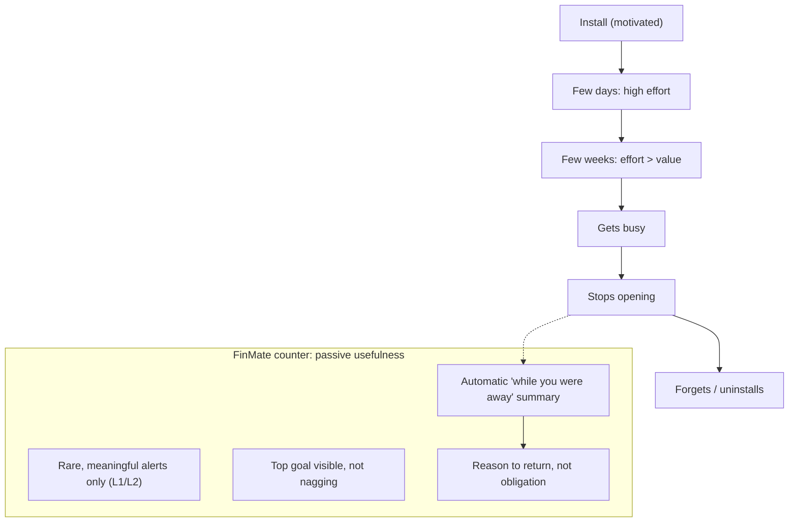

# FinMate — Competitive Lessons & Product Failure Analysis

**Type:** External product research & analysis (not architecture). **Classification:** CONFIDENTIAL (internal product analysis).
**Nature:** Research only. Changes **no** code, database, migration, API, or existing architecture document (Decision Ledger, Security/Privacy, Key Management, AI Firewall, IP Policy, Threat Model, Processing Activities Register are untouched).
**FinMate context used (minimal, per §10):** target = young professionals / capable-but-not-expert users; core loop = Record → Understand → Decide → Act → Learn → Improve; evolution = Helpful → Proactive → Personalized; FinMate already ships expenses/groups/settlements/People-P2P; plans statements, wellbeing, wardrobe. **No** proprietary algorithms, security internals, or crown-jewel details are included.

**Evidence discipline:** **[EVIDENCE]** = supported by a cited source/reviews/user discussion · **[INFERENCE]** = reasonable interpretation across observations · **[REC]** = proposed FinMate direction. Repeated complaints are weighted above isolated reviews.

---

## 0. FinMate lessons explained in 5 minutes

Most money apps fail the same way: people download them motivated, the app makes them do a lot of typing and setup, it shows colourful charts but never says *what to do*, it nags them, and within a month they quit. **[EVIDENCE]** ~67% of people who tried a budgeting app in the past year rated it "not helpful" or "too much effort," and most are abandoned within 3–4 weeks ([Strategia-X](https://www.strategia-x.com/blog/2026-04-12-why-budgeting-apps-fail-30-days-fintech-ux-data/), [Financial Fitness Passport](https://www.financialfitnesspassport.com/learn/why-budgeting-apps-fail-most-people)).

The four biggest killers:
1. **Effort** — manual entry and constant re-connecting banks feels like a chore ([budget app abandonment](https://www.onething.design/post/budget-app-design)).
2. **No decision help** — apps show *what happened*, not *what to do next*.
3. **Guilt** — red "over budget" dashboards make people feel bad and quit ([Strategia-X](https://www.strategia-x.com/blog/2026-04-12-why-budgeting-apps-fail-30-days-fintech-ux-data/)).
4. **Nagging** — too many notifications; ~60% of users turn push off entirely ([notification fatigue](https://www.courier.com/blog/how-to-reduce-notification-fatigue-7-proven-product-strategies-for-saas)).

**The FinMate opportunity:** be *useful without being needy* — reduce effort, tell people the one thing worth doing, never shame them, speak rarely but meaningfully, and let each new area (wellbeing, wardrobe) feel like a natural part of the same helpful assistant, not a random bolt-on.

---

## 1. Research scope & method

Products studied as **learning sources** (not all competitors): YNAB, Monarch, Rocket Money, Copilot Money, Empower, PocketGuard, Goodbudget, Spendee, Splitwise, Revolut, and the defunct **Mint**. Sources prioritized: reviews, community/Reddit discussion, reputable finance/UX writeups, and current (2025–2026) analyses. Full source list at the end.

---

## 2. The eight-question analysis of the major failures

For each recurring problem: (1) user goal · (2) what's hard · (3) what products do · (4) what works · (5) what fails · (6) why · (7) FinMate should learn · (8) FinMate should NOT do.

### P1 — Data entry effort (the #1 churn driver)
1. Track spending without it becoming a chore. 2. Manual typing + fixing wrong categories. 3. Manual entry (YNAB, Goodbudget) vs bank auto-sync (Mint, Monarch, Copilot). 4. Auto-sync removes typing. 5. **[EVIDENCE]** manual-entry apps lose users at ~3x the rate of auto-sync; miscategorization forces cleanup and drives abandonment ([budget app design](https://www.onething.design/post/budget-app-design), [Financial Fitness Passport](https://www.financialfitnesspassport.com/why-personal-finance-apps-fail-user-retention)). 6. Effort exceeds perceived value within weeks. 7. **[REC]** minimize entry: fast quick-add, strong recurring-expense support, statement import, good default categorization. 8. **[REC]** do NOT require 15–20 min/day of manual upkeep. **[COMPATIBILITY IMPACT]** FinMate already has manual entry + recurring; statement import is additive (no change to existing calc).

### P1 — Bank sync is unreliable and over-broad
1. Effortless, always-current data. 2. Connections break; constant "reconnect" prompts; aggregators pull *more* than transactions. 3. Plaid/aggregator links. 4. When it works, zero effort. 5. **[EVIDENCE]** connections break on bank back-end changes, "reconnect your account" becomes a recurring maintenance chore that defeats the purpose, and Plaid links can expose identity/account numbers/holdings/loans beyond transactions ([Plaid troubleshooting](https://www.rentastic.io/blog/how-to-fix-plaid-bank-linking-errors), [budgetpeer](https://www.budgetpeer.com/blog/why-people-stop-connecting-their-bank-to-budget-apps-(and-what-they-do-instead))). 6. Fragile third-party pipes + broad scopes. 7. **[REC]** FinMate's **statement-upload + manual** model sidesteps broken-connection fatigue and over-broad access — a genuine **privacy differentiator**. 8. **[REC]** do NOT make bank connection mandatory for value; if aggregation is ever added, request minimum scope and make it optional. **[INFERENCE]** statement-based is more private but higher-friction — invest in making upload/extraction painless.

### P1 — Dashboards show data but don't help decisions
1. Understand money and know what to do. 2. Charts require interpretation. 3. Category pie charts, trend lines, net-worth, "financial scores." 4. Good visuals build awareness. 5. **[EVIDENCE]** a top abandonment reason is "the app shows what happened but not what to do next" and categories that "never match how the user thinks" ([Financial Fitness Passport](https://www.financialfitnesspassport.com/why-personal-finance-apps-fail-user-retention)). 6. Information ≠ decision. 7. **[REC]** every dashboard card should answer "so what / now what," not just display a number — this is FinMate's Understand→Decide bridge. 8. **[REC]** do NOT ship vanity "financial score" gauges with no action attached.

### P0 — Guilt-based budgeting drives people away
1. Spend within means without feeling judged. 2. Rigid budgets + red/green shame. 3. Envelope/zero-based (YNAB), category caps. 4. Structure helps some. 5. **[EVIDENCE]** "green under / red over" creates a **guilt cycle**; 2–3 months of red dashboards make users self-label "bad at budgeting" and disengage; rigid/unrealistic budgets and confusing category setup are top complaints ([Strategia-X](https://www.strategia-x.com/blog/2026-04-12-why-budgeting-apps-fail-30-days-fintech-ux-data/)). 6. Negative emotion → avoidance. 7. **[REC]** neutral, forward-looking framing ("you're trending ₹1,500 above your usual — want to see why?") instead of red failure states; flexible ranges not hard caps. 8. **[REC]** do NOT use shame, hard red "over budget" states, or complex mandatory budget setup up front.

### P0 — Onboarding asks too much, too early
1. Get quick value. 2. Setup wall: connect bank, categorize, set goals, configure budgets before any value. 3. Long multi-step onboarding. 4. Thorough setup for power users. 5. **[EVIDENCE]** heavy upfront setup creates "immediate friction… anxiety and decision fatigue," a top abandonment trigger ([Financial Fitness Passport](https://www.financialfitnesspassport.com/why-personal-finance-apps-fail-user-retention)). 6. Value comes after effort, not before. 7. **[REC]** deliver value in the first session with near-zero setup; defer goals/budgets until the user has a reason to care. 8. **[REC]** do NOT gate first value behind bank connection or full configuration.

### P1 — Notification overload
1. Be told what matters, when it matters. 2. Too many low-value alerts. 3. Balance/overspend/marketing pushes. 4. Timely critical alerts (fraud, big charge). 5. **[EVIDENCE]** ~60% of users disable push due to irrelevant alerts; ~3–5/day is the practical ceiling before opt-outs; when routine and important alerts look alike, the important ones get ignored ([Courier](https://www.courier.com/blog/how-to-reduce-notification-fatigue-7-proven-product-strategies-for-saas), [Verbat](https://www.verbat.com/blog/7909-2/)). 6. Volume destroys signal. 7. **[REC]** default-quiet; send rarely; make each notification earn its place. 8. **[REC]** do NOT send routine/marketing pushes or daily nags.

### P1 — Subscription "management" that itself is a dark pattern
1. Find and cancel forgotten subscriptions easily. 2. Cancellation often needs steps outside the app; the manager can be hard to cancel itself. 3. Rocket Money-style detection + "we cancel for you." 4. Detection surfaces forgotten charges. 5. **[EVIDENCE]** users report "cancelled" services still charging, some subs Rocket "can't" cancel, and complaints that cancelling **Rocket Money itself** is deliberately hard ([Rocket Money help](https://help.rocketmoney.com/en/articles/13908897-why-can-t-rocket-money-cancel-this), [BBB complaints](https://www.bbb.org/us/md/silver-spring/profile/billing-services/rocket-money-inc-0241-236043013/complaints)). 6. Over-promising + retention dark patterns erode trust. 7. **[REC]** detect recurring charges and *show* them clearly; be honest about what FinMate can/can't cancel; make FinMate itself trivially cancellable. 8. **[REC]** do NOT claim automated cancellation FinMate can't guarantee; no dark patterns.

### P1 — AI that hallucinates or over-automates
1. Get help understanding money. 2. AI can be confidently wrong. 3. AI chat assistants/insights. 4. Good for explanation/summarization. 5. **[EVIDENCE]** AI finance advice can hallucinate sources, be inaccurate/biased, is "sycophantic" (tells you what you want to hear), and owes no fiduciary duty — experts say use it as a *starting point, not final authority*; yet ~40% already use AI for finances ([CNBC](https://www.cnbc.com/2026/07/07/ai-personal-finance-advice.html), [NPR](https://www.npr.org/2026-08-12/ai-chatbots-are-offering-financial-advice-should-you-trust-them)). 6. Fluent ≠ correct. 7. **[REC]** AI must **explain and cite the user's own numbers** behind any suggestion, stay advisory, and never auto-act — this matches FinMate's projection-based, no-raw-data firewall. 8. **[REC]** do NOT let AI give confident prescriptive advice, auto-execute anything, or hide its reasoning.

### P1 — Privacy/trust failures
1. Use a money app without fear of being sold out. 2. Bank access, data collection, ads, unclear deletion. 3. Free ad/data-monetized apps (Mint). 4. "Free" attracts installs. 5. **[EVIDENCE]** **Mint** shut down (Mar 2024) after 17 years — its free, ad/partner-recommendation model collapsed with privacy changes; users lost budgets/categories/goals in the forced migration, exposing "the peril of relying on free services" and the need for data portability ([CNBC](https://www.cnbc.com/2023/11/07/budgeting-app-mint-is-shutting-down-users-are-disappointed.html), [Monarch](https://www.monarch.com/blog/mint-shutting-down)). 6. Ad-funded finance = misaligned incentives + fragility. 7. **[REC]** FinMate's privacy-by-design + no-data-selling + export is a **trust differentiator** — market it plainly ("your data isn't the product"). 8. **[REC]** do NOT adopt ad/data-selling monetization or make deletion/export unclear.

### P2 — Goals that get abandoned
1. Save toward something and stay motivated. 2. Goals set once, then forgotten. 3. Savings-goal trackers, progress bars. 4. Visible progress motivates initially. 5. **[INFERENCE]** goals decay like budgets when they're static and disconnected from daily behaviour (same abandonment pattern). 6. No ongoing relevance. 7. **[REC]** FinMate's manual **goal reordering = priority** is useful *if* priority actually changes what FinMate surfaces (top goal appears prominently, informs suggestions) and FinMate periodically asks "does this still matter?" 8. **[REC]** do NOT keep optimizing a stale goal forever or bury goals where they're never seen.

### P2 — Cashback / reward reconciliation (future)
1. Get the rewards they're owed. 2. Opaque bank reward rules. 3. Few apps do this well. 4. Surfacing "expected vs received" is genuinely valuable. 5. **[INFERENCE]** high-value but risky if presented as "your bank cheated you." 6. Reward rules are complex/conditional. 7. **[REC]** present as *"this looks lower than the card's stated rate — worth checking"* with the calculation shown; never accuse the bank. 8. **[REC]** do NOT assert the bank is wrong or auto-file disputes.

### P2 — Unknown-charge / duplicate detection (future)
1. Catch fraud/errors/duplicates. 2. Hard to spot in long lists. 3. Anomaly/merchant-recognition (varies). 4. Flagging unusual/duplicate charges is high-trust value. 5. **[INFERENCE]** false positives annoy; over-alerting = notification fatigue. 6. Balancing sensitivity vs noise. 7. **[REC]** surface "does this look right?" for genuinely unusual/duplicate charges, ranked as important — pairs with statement reconciliation. 8. **[REC]** do NOT flag routine spending as "suspicious."

---

## 3. Notification importance-ranking evaluation (FinMate's L1–L5 idea)

**[EVIDENCE]** supports *fewer, ranked* notifications (60% disable; 3–5/day ceiling). A 5-level importance model (L1 critical → L5 optional) is **sound in principle** — but **[INFERENCE]** two risks: (a) users won't manually configure five levels; (b) engineering may over-scope the taxonomy.
**[REC]:** keep the internal 5-level ranking for the engine, but **default to sending only L1 (critical) and L2 (important)**; L3+ are pull-only (shown in-app, not pushed). The *system* decides importance from behaviour; the user gets a simple "quieter / standard / off," not a 5-way config. Never push L4/L5.

---

## 4. Personalization evolution evaluation (Helpful → Proactive → Personalized)

**[EVIDENCE]** generic advice is ignored; over-intervention causes recommendation fatigue; AI that pushes prescriptive advice loses trust ([CNBC](https://www.cnbc.com/2026/07/07/ai-personal-finance-advice.html)). **[REC]** the staged model is well-supported: **earn the right to be proactive** by first proving usefulness and *learning whether the user acts on suggestions* before escalating. Key guardrail: a user who ignores suggestions should get *fewer*, not more. This is a real differentiator vs apps that intervene from day one.

---

## 5. Gamification — an evidence-vs-philosophy tension to resolve

**[EVIDENCE]** gamification *works* for retention/savings: streak-based commitment raised savings contributions ~41% over 6 months (more than equivalent cash incentives); a gamified budgeting RCT saw 78% vs 31% retention and 27% more saved; but it works only when mechanics tie to **real financial events**, not vanity metrics ([Wiley/Financial Planning Review](https://onlinelibrary.wiley.com/doi/full/10.1002/cfp2.70016), [ScienceDirect review](https://www.sciencedirect.com/science/article/pii/S0001691826005810)).
**Tension:** FinMate's stated philosophy explicitly rejects streaks/guilt/engagement-maximization. **[REC — resolve deliberately]:** adopt the *outcome* the evidence rewards (progress feedback, momentum toward real goals) **without** the addictive shell — i.e. **outcome-linked progress, not streaks/badges/leaderboards/loss-aversion**. Do NOT add guilt-inducing streaks the user is afraid to break. This keeps the retention benefit while honouring "reason to return, not obligation."

---

## 6. All-in-one / "everything app" risk

**[EVIDENCE]** super-apps have largely **failed in Western markets**: strong best-in-class single-purpose incumbents, app fatigue, high privacy expectations (GDPR), antitrust pressure, and the "is it better than what I already use?" test — plus the scary failure mode where "one breach and your whole digital life is fragile" ([INSEAD](https://knowledge.insead.edu/strategy/super-apps-asia-everything-app-us), [Medium/Crouch](https://gilescrouch.medium.com/why-superapps-wont-work-in-the-west-6eb7aad2ef77), [ProCreator](https://procreator.design/blog/super-app-fintech-model-fail-how-to-avoid/)). FinMate's ambition (finance + wellbeing + wardrobe + opportunities…) is squarely in this risk zone.
**[REC] test every module against:** *does it help the user make a better decision, improve their financial position, improve wellbeing, or meaningfully reduce effort?* A module belongs only if it (a) shares the **same core loop** (Record→Improve) and (b) is **connected to the user's real context** (e.g., wardrobe shopping respects a real budget). Otherwise it's an unrelated mini-app → **Do not add.** FinMate's privacy-by-design is also the direct answer to the super-app privacy fear — but only if isolation actually holds (Threat Model T-09).

---

## 7. Competitor comparison (learning table, not a ranking)

E=Evidence, I=Inference. Cells are learning-oriented, not scores.

| Product | Primary purpose | Strengths | Common complaints | Data-entry friction | Dashboard | Budgeting | Goals | Notifications | AI | Privacy/trust | Retention approach | Key lesson for FinMate |
|---|---|---|---|---|---|---|---|---|---|---|---|---|
| **Mint (defunct)** | free all-in-one | huge reach, free | ads, then shutdown | low (sync) | broad | basic | basic | many | none | ad/data model | free reach | Free/ad model is fragile & misaligned (E) |
| **YNAB** | proactive budgeting | method changes behaviour | steep learning, $109/yr, work | med–high (E) | method-centric | rigid/zero-based | strong | moderate | minimal | paid, trusted | teach a method | Method works but effort/curve = churn (E) |
| **Monarch** | Mint successor, holistic | polished, couples | paid; sync issues (I) | low–med | strong | flexible | good | tunable | growing | paid | premium value | Charge fairly, stay flexible (E) |
| **Rocket Money** | subs + budgeting | finds subscriptions | cancellation gaps, hard to cancel itself (E) | low (sync) | ok | basic | basic | pushy (I) | some | mixed | subscription hook | Don't over-promise/dark-pattern (E) |
| **Copilot** | premium tracking | design, categorization | Apple-first, paid (I) | low | excellent | flexible | good | restrained (I) | AI categorization | paid | craft/quality | Quality UX retains (I) |
| **Empower** | net worth/investing | free net-worth | advisor upsell calls (I) | low | investing-heavy | light | light | advisor nudges | none | lead-gen | free tool → advisory | Upsell pressure erodes trust (I) |
| **PocketGuard** | "in my pocket" simplicity | simple overspend guard | limited depth (I) | low–med | simple | simplified | basic | some | none | freemium | simplicity | Simplicity aids retention (I) |
| **Goodbudget** | envelope, manual | intentional, private | manual entry (E) | high (E) | simple | envelope | good | few | none | manual/private | deliberate users | Manual = niche; privacy has fans (E) |
| **Splitwise** | shared expenses | ubiquitous for splitting | paywalled free tier, daily limits, add-delays (E) | med | list | n/a | n/a | few | none | freemium | network effects | Don't cripple core free P2P (E) |
| **Revolut** | fintech super-app | many services | breadth vs depth, trust (I) | low | broad | light | light | many | some | regulated fintech | super-app breadth | Breadth risks depth/trust (E/I) |

---

## 8. Retention analysis (the core problem)

**The reality:** install → few days → few weeks → busy → stops paying attention → forgets. **[EVIDENCE]** most abandonment happens in weeks 3–4; the app "feels like a chore once setup is done" ([Financial Fitness Passport](https://www.financialfitnesspassport.com/learn/why-budgeting-apps-fail-most-people)).

**FLOW — retention decay & FinMate's counter**

**"What can FinMate do WITHOUT being annoying?"** **[REC]** — passive usefulness over engagement tricks:
- **Automatic summaries** the user reads in seconds ("while you were away").
- **Meaningful alerts only** (unusual charge, goal at risk, reward looks off) — L1/L2, rare.
- **Low-effort interactions** (quick-add, statement import, recurring auto-fill).
- **Periodic reviews** the user *pulls* (monthly), not pushed daily.
- **Progress feedback tied to real goals** (not streaks).
- **Sometimes tell the user to leave** ("you've planned enough — enjoy the weekend").
**Do NOT:** streaks-you're-afraid-to-break, guilt, daily nags, artificial "open the app" hooks, endless content.

---

## 9. Core principle evaluation

- **"Give users a reason to return, not an obligation to return."** — **Evidence SUPPORTS.** Obligation-based engagement (nags, guilt, streaks) is exactly what drives disabling/uninstalling; usefulness-based return aligns with why successful tools retain. Keep it.
- **"Help users make better decisions, not merely record what they already did."** — **Evidence STRONGLY SUPPORTS.** "Shows what happened but not what to do next" is a named top abandonment reason. This is arguably FinMate's single most important differentiator. **[REC — modification]:** add a corollary — *recording must still be nearly effortless*, because a decision engine with no data starves; reduce entry friction so the "understand→decide" layer has fuel.

---

## 10. FinMate opportunity map

**A. Should probably do:** effortless capture (quick-add, recurring, statement import); decision-oriented dashboard cards; neutral/forward-looking language; default-quiet ranked notifications; "while you were away" summaries; honest recurring-charge surfacing; privacy-as-trust messaging; goal reordering that actually changes what's surfaced; AI that explains + cites the user's numbers.
**B. Investigate later:** cashback "expected vs received" reconciliation; unknown/duplicate-charge detection; wellbeing correlations (post-DPIA); wardrobe styling; opportunities (licensed data only).
**C. Deliberately avoid:** ad/data-selling model; guilt/red-failure budgeting; mandatory bank connection for value; notification spam; streak/badge addiction loops; over-promised auto-cancellation; AI auto-acting or giving confident prescriptive advice; crippling core free P2P.
**D. Learn from competitors:** YNAB's behaviour-change intent (without the effort/curve); Copilot/Monarch craft & flexibility; Splitwise's frictionless splitting (don't nerf it); Rocket Money's subscription *surfacing* (without the dark patterns).
**E. Potential differentiators:** privacy-by-design (no bank-sync fragility, no data selling); decision-help over dashboards; earn-the-right-to-be-proactive personalization; anti-addiction retention; integrated-but-coherent modules.
**F. Risks of repeating mistakes:** super-app bloat (§6); notification fatigue (§3); onboarding wall (§2 P0); guilt framing; AI over-trust; monetization backlash (Splitwise/Rocket).

---

## 11. WHAT FINMATE SHOULD LEARN

**P0 — foundational product principles**
1. Deliver value in the first session; no setup wall. [E]
2. Recording must be near-effortless or people quit in weeks. [E]
3. Help decide, don't just display ("so what / now what" on every card). [E]
4. Never use guilt/red-failure framing; use neutral, forward-looking language. [E]
5. Default-quiet notifications; only critical/important get pushed. [E]
6. "Reason to return, not obligation"; sometimes tell users to leave the app. [E/REC]
7. Privacy-by-design is a trust *product feature*, not just compliance. [E]
8. Earn the right to be proactive; learn whether the user acts before escalating. [E/REC]

**P1 — important opportunities**
9. Statement-import + effortless capture as the low-friction, privacy-friendly alternative to fragile bank sync. [E]
10. Passive usefulness: automatic "while you were away" summaries. [REC]
11. AI explains and cites the user's own numbers; advisory only, never auto-acts. [E]
12. Honest recurring-charge/subscription surfacing (no dark patterns; FinMate itself trivially cancellable). [E]
13. Outcome-linked progress feedback instead of streaks/badges. [E/REC]
14. Goal priority (reordering) must actually change what FinMate surfaces + periodic "still matters?" checks. [REC]
15. Sustainable, non-ad monetization; be transparent; don't cripple core free P2P. [E]
16. Ranked notification *engine* internally, simple "quieter/standard/off" for users. [E/REC]

**P2 — future opportunities**
17. Cashback "expected vs received," shown transparently, never accusing the bank. [I]
18. Unknown/duplicate-charge detection ranked as important, low false positives. [I]
19. Wellbeing correlations — opt-in, post-DPIA, explained. [E/REC]
20. Wardrobe/shopping that respects a real budget (module coherence). [REC]

**AVOID**
21. Ad/data-selling business model (Mint's fatal flaw). [E]
22. Mandatory bank connection or over-broad account access. [E]
23. Notification spam / daily nags / marketing pushes. [E]
24. Streaks-you're-afraid-to-break, guilt loops, engagement-maximization. [E/REC]
25. AI that auto-acts, hides reasoning, or gives confident prescriptive advice. [E]
26. Feature-creep mini-apps that don't share the core loop (super-app bloat). [E]

---

## 12. WHAT WE SHOULD CHANGE IN THE FUTURE SRS

Only items with strong evidence or a clearly-justified recommendation. Each is a *product-requirement candidate* for the SRS — none changes existing frozen architecture.

- **SRS-P1:** First-session value with zero mandatory setup; onboarding must not gate value behind bank/goal/budget configuration. [E]
- **SRS-P2:** Low-friction capture as a first-class requirement: quick-add, recurring auto-fill, statement import. **[COMPATIBILITY IMPACT]** additive to existing manual expense entry; no change to calculations/settlements.
- **SRS-P3:** Dashboard cards must be decision-oriented (action/answer attached), not display-only. [E]
- **SRS-P4:** Non-judgmental language & flexible ranges; no red "over budget" failure states. [E]
- **SRS-P5:** Notification engine = internal importance ranking (L1–L5); **only L1/L2 pushed by default**; user control limited to quieter/standard/off. [E]
- **SRS-P6:** "While you were away" automatic summary on return. [REC]
- **SRS-P7:** AI insights must show the underlying user numbers and stay advisory (no auto-action) — consistent with the AI firewall. [E]
- **SRS-P8:** Personalization escalation gated on demonstrated user responsiveness (Helpful→Proactive→Personalized). [E/REC]
- **SRS-P9:** Goal priority ordering influences surfacing + periodic relevance check. [REC]
- **SRS-P10:** Progress feedback tied to real outcomes; **no** streaks/badges/leaderboards. [E/REC]
- **SRS-P11:** Every new module must pass the "better decision / position / wellbeing / less effort" test and share the core loop, or be excluded. [E]
- **SRS-P12:** Trivial account/subscription cancellation + clear export/delete (anti-dark-pattern; already supported by EXP-1/DEL-1). [E]

---

## 13. Reconciliation & compatibility

- **No architecture/decision document was read for editing or modified** — this is product research; the frozen stack (Ledger, Security, Key, AI, IP, Threat Model, Processing Register) is untouched.
- **Backward compatibility:** the only recommendation touching existing functionality is low-friction capture (SRS-P2), flagged **[COMPATIBILITY IMPACT]** as **additive** to existing manual entry/recurring — no change to expense calculations, settlements, groups, People/P2P, auth, or Web/iOS/Android behaviour. Current behaviour unchanged → proposed adds quick-add/import → migration: none (additive) → rollback: feature-flag off → user impact: less typing → risk: low.
- **No feature-creep:** low-value competitor features (aggressive gamification, ad model, auto-cancellation, mandatory bank sync) are explicitly classified **Do not add**.
- **Confidentiality preserved:** no FinMate proprietary algorithm, security internal, database design, roadmap detail, or user data appears here; only the minimum product context needed for research.
- **Contradictions with frozen docs:** **NONE.** Where evidence favours gamification (retention), the recommendation deliberately keeps FinMate's anti-addiction stance — a resolved tension, not a contradiction.

---

## Sources

- [Strategia-X — why 67% quit budgeting apps in 30 days](https://www.strategia-x.com/blog/2026-04-12-why-budgeting-apps-fail-30-days-fintech-ux-data/)
- [Financial Fitness Passport — why finance apps fail retention](https://www.financialfitnesspassport.com/why-personal-finance-apps-fail-user-retention) · [why budgeting apps fail most people](https://www.financialfitnesspassport.com/learn/why-budgeting-apps-fail-most-people)
- [OneThing — budget app design & retention](https://www.onething.design/post/budget-app-design)
- [CNBC — Mint shutting down, users disappointed](https://www.cnbc.com/2023/11/07/budgeting-app-mint-is-shutting-down-users-are-disappointed.html) · [Monarch — Mint shutting down](https://www.monarch.com/blog/mint-shutting-down)
- [Productive with Chris — YNAB review 2025](https://productivewithchris.com/app-reviews/ynab-review-2025/) · [Fortune — YNAB pros and cons](https://fortune.com/article/ynab-pros-and-cons)
- [Rocket Money — why can't Rocket cancel this](https://help.rocketmoney.com/en/articles/13908897-why-can-t-rocket-money-cancel-this) · [BBB — Rocket Money complaints](https://www.bbb.org/us/md/silver-spring/profile/billing-services/rocket-money-inc-0241-236043013/complaints)
- [Splitwise paywall backlash (X thread)](https://x.com/ArtemR/status/1740150704268849568?lang=en)
- [CNBC — don't rely on AI for personal finance](https://www.cnbc.com/2026/07/07/ai-personal-finance-advice.html) · [NPR — AI chatbots financial advice, should you trust](https://www.wvik.org/npr-top-stories/2026-08-12/ai-chatbots-are-offering-financial-advice-should-you-trust-them)
- [Courier — reduce notification fatigue](https://www.courier.com/blog/how-to-reduce-notification-fatigue-7-proven-product-strategies-for-saas) · [Verbat — notification fatigue in mobile apps](https://www.verbat.com/blog/7909-2/)
- [Wiley/Financial Planning Review — gamification on financial conduct](https://onlinelibrary.wiley.com/doi/full/10.1002/cfp2.70016) · [ScienceDirect — gamification systematic review](https://www.sciencedirect.com/science/article/pii/S0001691826005810)
- [Rentastic — Plaid bank-linking errors](https://www.rentastic.io/blog/how-to-fix-plaid-bank-linking-errors) · [BudgetPeer — why people stop connecting banks](https://www.budgetpeer.com/blog/why-people-stop-connecting-their-bank-to-budget-apps-(and-what-they-do-instead))
- [INSEAD — super apps Asia vs everything app US](https://knowledge.insead.edu/strategy/super-apps-asia-everything-app-us) · [Medium/Crouch — why superapps won't work in the West](https://gilescrouch.medium.com/why-superapps-wont-work-in-the-west-6eb7aad2ef77) · [ProCreator — why super-app fintech models fail](https://procreator.design/blog/super-app-fintech-model-fail-how-to-avoid/)

*End of document. Research only — no code, database, migration, production, or existing architecture document was changed.*
