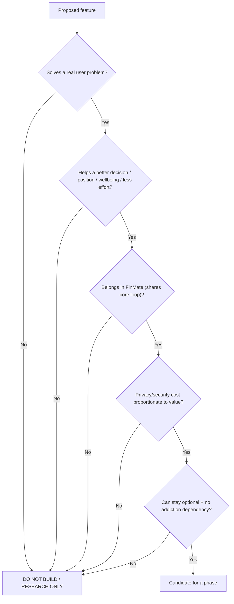

# FinMate — Product Principles & Differentiators

**Type:** Product decision document (not architecture). **Classification:** CONFIDENTIAL (internal product strategy).
**Sources of truth:** [FINMATE_COMPETITIVE_LESSONS_PRODUCT_FAILURE_ANALYSIS.md](FINMATE_COMPETITIVE_LESSONS_PRODUCT_FAILURE_ANALYSIS.md) + the FinMate product vision discussed in this workstream. **No new architecture or security decision is created here.**
**Nature:** Turns competitive lessons into FinMate-specific principles and priorities. Changes **no** code, database, migration, API, application behaviour, or frozen document (#1–#9).
**Label discipline:** **[EVIDENCE]** = from the research (cited there) · **[INFERENCE]** = reasoned interpretation · **[FINMATE DECISION]** = a product choice we are making · **[OPEN QUESTION]** = needs product-owner input. Competitor observations are never stated as facts about FinMate users.

**Reading model:** each major concept is **Simple** first, then **Detailed**.

---

## FinMate in 5 minutes

**Simple:** Most money apps make you do lots of typing, show you colourful charts, nag you, and make you feel bad — so people quit within a month. FinMate is different: it makes recording almost effortless, tells you the *one thing worth knowing or doing*, never shames you, speaks rarely but meaningfully, and only gets more "hands-on" once it has learned that you actually want that. Over time it can help beyond money — goals, wellbeing, even wardrobe — but only when that genuinely helps a decision, never as a random extra app.

**Detailed:** FinMate's job is to move the user along **Record → Understand → Decide → Act → Learn → Improve**, being **Helpful first, Proactive later, Personalized only after it has earned confidence.** It optimizes for a *better life*, not more screen time. Everything below formalizes that into principles, priorities, and differentiators grounded in the competitive research.

---

## 1. Product vision (who and why)

**[FINMATE DECISION]** Primary user: **young professionals / capable-but-not-expert** people who should benefit **without needing to be experts** in finance, investing, planning, or health. The long-term aim: help them understand where their life is heading, make better decisions, and gradually improve their financial position, wellbeing, habits, planning, and opportunities. **[FINMATE DECISION]** FinMate must **not assume every user wants intervention** — it learns from how each user responds to suggestions.

---

## 2. Formalized product philosophy (13 principles)

Each principle, with the strongest supporting basis from the research.

| # | Principle | Basis |
|---|---|---|
| 1 | Give a **reason to return, not an obligation** to return | [EVIDENCE] obligation-based nagging/guilt drives disabling & uninstalls |
| 2 | **Help decide, don't just record** what already happened | [EVIDENCE] "shows what happened, not what to do next" is a top abandonment reason |
| 3 | **Explain before advising** | [EVIDENCE] AI that hides reasoning / gives confident prescriptive advice loses trust |
| 4 | **Never shame the user** | [EVIDENCE] red/green guilt cycle → disengagement |
| 5 | **Minimize repetitive manual work** | [EVIDENCE] manual entry churns ~3× faster |
| 6 | **Notifications must earn attention** | [EVIDENCE] ~60% disable push; 3–5/day ceiling |
| 7 | **AI must solve a real problem**, not exist because AI is available | [EVIDENCE] AI added without value + hallucination erodes trust |
| 8 | **Personalization is earned** through interaction/confidence | [EVIDENCE] over-intervention → recommendation fatigue |
| 9 | **Important decisions stay under user control** | [EVIDENCE] AI has no fiduciary duty; users distrust automation |
| 10 | **Reduce unnecessary in-app time**, don't maximize it | [FINMATE DECISION] anti-addiction stance; [EVIDENCE] super-app/engagement backlash |
| 11 | **A feature must earn its place** | [EVIDENCE] super-app bloat fails in the West |
| 12 | **Secure the existing product without unnecessarily breaking it** | [FINMATE DECISION] (governance) |
| 13 | **New modules must not destabilize the finance core** | [FINMATE DECISION] (governance) |

---

## 3. What FinMate is trying to become (vision, then priority)

**Simple:** FinMate could one day touch many parts of life — but not all at once, and only where it truly helps.

**Detailed — vision areas (classified in §5, not all V1):**
- **FINANCE:** expenses, spending analysis, budgeting, savings, goals, payment-method analysis, unknown-charge detection, statement analysis, cashback verification, subscription analysis, decision support.
- **WEALTH:** investment decision support, opportunity research (property/car/auction), comparison + risk explanation.
- **PLANNING:** goals, priorities, personal planning, reminders, important events.
- **WELLBEING:** mood awareness, journaling, routines, healthy habits, encouraging breaks, motivation.
- **WARDROBE/STYLE:** upload clothing photo → suitability suggestion → organization → occasion/travel planning.

**[FINMATE DECISION]** These are a **vision, not a V1 backlog.** Priority follows in §5.

---

## 4. Feature priority model

**[FINMATE DECISION]** Be conservative; don't force ideas into V1. E=Evidence, I=Inference, D=Decision.

| Feature / Capability | Why it matters | Problem solved | Evidence | Priority | Dependencies | Risk | Compatibility impact | Phase |
|---|---|---|---|---|---|---|---|---|
| Expenses, groups, settlements, People/P2P | core value; already shipped | track & split money | shipped | **V1 CORE** | existing | low | **none (existing)** | now |
| Recurring expenses | reduce repeat entry | effortless capture | shipped (beta) | **V1 CORE** | existing | low | none | now |
| Low-friction capture (quick-add, better categorization) | entry effort = #1 churn | fast recording | [E] | **V1 CORE** | existing entry | low | **additive** to manual entry | V1 |
| Decision-oriented dashboard cards | "so what/now what" | understand→decide | [E] | **V1 CORE** | expense data | med (design) | additive UI | V1 |
| Goals + manual priority ordering | motivation, priorities | reach goals | [I] | **V1 CORE** | goals build | low | new (empty table) | V1 |
| Neutral, ranked, quiet notifications | avoid fatigue | right info, right time | [E] | **V1 CORE** | notif engine | med | additive | V1 |
| "While you were away" summary | retention w/o nagging | passive usefulness | [REC] | **V1 OPTIONAL** | activity data | low | additive | V1/V2 |
| Statement import + reconciliation | privacy-friendly low friction | avoid bank-sync fragility | [E] | **V1 OPTIONAL** | statement pipeline; OCR vendor review | med (vendor) | additive | V1/V2 |
| Subscription/recurring-charge surfacing | forgotten charges | see what recurs | [E] | **V2** | recurring detection | med (over-promise) | additive | V2 |
| Unknown/duplicate-charge detection | fraud/error catch | trust | [I] | **V2** | statement data | med (false positives) | additive | V2 |
| Cashback/reward verification | reclaim rewards | fairness | [I] | **V2** | statement + rules | med (accusation) | additive | V2 |
| AI assistant (bounded, advisory) | explanation help | understand | [E] | **V2** | AI firewall (frozen) | med (trust) | additive, opt-in | V2 |
| Earned personalization engine | better suggestions | relevance | [E] | **V2** | intelligence + DPIA | high (privacy) | additive, gated | V2 |
| Wellbeing (mood/journal/routines) | live better | wellbeing | [I] | **FUTURE/RESEARCH** | wellbeing arch (frozen) + DPIA | high | new isolated domain | Future |
| Wardrobe/style | outfit help | decisions | [I] | **FUTURE/RESEARCH** | wardrobe arch (frozen) | med | new isolated domain | Future |
| Opportunities (property/car/auction) | wealth discovery | opportunity | [I] | **FUTURE/RESEARCH** | licensed data; legal | high (legal) | separate low-trust svc | Future |
| Investment decision support | wealth | decisions | [I] | **FUTURE/RESEARCH** | data + risk explanation | high | additive | Future |
| Bank aggregation (direct sync) | lower friction | auto data | [E] both ways | **DO NOT BUILD (V1)** — see OQ-1 | aggregator, VEN-1 | high (fragility/privacy) | would change data model | see §19 |
| Auto-cancellation of subscriptions | convenience | cancel subs | [E] fails | **DO NOT BUILD** | — | high (can't guarantee) | — | — |
| Streaks/badges/leaderboards | engagement | — | [E] anti-philosophy | **DO NOT BUILD** | — | high (addiction) | — | — |
| Automated trading/purchasing | wealth | — | [E]/[D] | **DO NOT BUILD** | — | critical | — | — |
| Ad / data-selling monetization | revenue | — | [E] Mint failure | **DO NOT BUILD** | — | critical (trust) | — | — |

---

## 5. FinMate differentiators (evaluated)

**Simple:** "Has AI" or "has many features" is **not** a differentiator. What actually sets FinMate apart is *how* it helps and *how* it treats the user.

**Detailed — evaluating the candidates (A–G):**
- **A. Decision-oriented finance** — [EVIDENCE-backed] the single biggest gap in the market ("shows what happened, not what to do"). **Strong differentiator.**
- **B. Contextual financial decisions** (a purchase understood vs income/normal spend/goals/obligations) — [INFERENCE] high value; **strong** once data exists.
- **C. Helpful→Proactive→Personalized (earned)** — [EVIDENCE] most apps intervene from day one and fatigue users. **Strong differentiator.**
- **D. "What FinMate knows about me"** (facts, provenance, confidence, controls) — [FINMATE DECISION, already in architecture] rare and trust-building. **Strong.**
- **E. Life-context decision support** (finance ↔ goals/planning/wellbeing/wardrobe) — [INFERENCE] powerful **only when it improves a decision**; otherwise bloat. **Conditional differentiator.**
- **F. Privacy as a product feature** (E2EE, no data selling, no fragile bank sync, user control) — [EVIDENCE] direct answer to the distrust that killed Mint and fuels super-app fear. **Strong differentiator.**
- **G. Low-effort management** (no constant maintenance) — [EVIDENCE] effort is the #1 churn driver. **Strong.**

**→ True differentiators (max 5–8), consolidated in the final section.**

---

## 6. The Module-Coherence Test (formal gate for future features)

**Simple:** before adding anything, FinMate asks: "does this really help, and does it belong here?"

**Detailed — a feature must answer YES to the value questions and pass the guardrails:**

The 10 questions: (1) problem solved? (2) better decision? (3) improves position/wellbeing/planning/outcome? (4) reduces effort/uncertainty? (5) why inside FinMate? (6) needs unrelated data? (7) privacy/security cost vs value? (8) distracts from core purpose? (9) can remain optional? (10) value without screen-time dependency? **Fail → DO NOT BUILD / RESEARCH ONLY.**

---

## 7. Retention without addiction

**Simple:** people get busy and drift away — that's normal. FinMate should still be worth coming back to, without tricks.

**Detailed — [FINMATE DECISION] passive usefulness, not engagement loops:**
- **Do:** "while you were away" summary; important changes; goal progress; unusual transactions; meaningful opportunities; upcoming obligations; periodic (pull) reviews; low-effort check-ins; occasionally tell the user to *leave* ("you've planned enough — enjoy the event").
- **Don't:** addictive streaks; artificial urgency; manipulative or fear-based notifications; endless scrolling; unnecessary engagement loops.
- **Resolved tension** [EVIDENCE]: gamification *does* boost retention/savings — but FinMate takes only the **outcome-linked progress**, not streaks/badges/loss-aversion. Goal: **better life, not more usage.**

---

## 8. User interaction model (three stages)

**Simple:** FinMate starts by just being helpful. If it sees you actually use its help, it gently offers more. If you ignore suggestions, it backs off.

**Detailed:**
| Stage | Example | Trigger to advance | User control |
|---|---|---|---|
| **1 Helpful** | "Food spending increased 18% this month." | default | always available |
| **2 Proactive** | "You usually spend ₹4,000–5,000 on food delivery; you're at ₹5,200 — want to see why?" | enough data **and** signs the user engages with insights | can stay at Helpful; "quieter" setting |
| **3 Personalized** | "3 months higher on delivery; cutting ₹1,500/mo could reach your ₹3L goal sooner." | demonstrated responsiveness + confidence + consent | opt-out anytime; suppress specific inferences |

**[FINMATE DECISION]** Progression is **earned by the user's demonstrated response**, not by time alone. A user who ignores suggestions gets **fewer**, not more. **[OPEN QUESTION OQ-2]** what concrete signals count as "the user acts on suggestions" (tap-through, follow-through, dismissal)? — product-owner input needed.

---

## 9. Dashboard philosophy (principles, not pixels)

**Simple:** the home screen is like a smart notice-board — the most important thing for *you* is at the top, and tapping a card takes you where you can act.

**Detailed — [FINMATE DECISION] principles (layout not locked):**
- Rank by importance/relevance, not chart count.
- Each card is **decision-oriented** ("so what / now what").
- User can customize what matters; important items near the top.
- **Goal cards support manual priority ordering** → reordering changes priority → dashboard reflects it → priority informs what's surfaced.
- Adding a goal takes the user to the **goal list** so they see their priorities.
- Show the **minimum useful** information, not everything.

---

## 10. Notification philosophy

**Simple:** FinMate speaks rarely, and only when it's worth it.

**Detailed — [FINMATE DECISION] importance model (engine) + simple user control:**
| Level | Meaning | Default delivery |
|---|---|---|
| L1 | Critical (fraud, unknown large charge) | **push** |
| L2 | Important (goal at risk, reward looks off) | **push** |
| L3 | Useful | in-app only (pull) |
| L4 | Low importance | in-app only |
| L5 | Optional/other | in-app only |

Ranking depends on **importance, urgency, confidence, user preference, and whether the user already saw/acted** on it. Users configure categories via a **simple "quieter / standard / off"**, not a 5-way manual config. **[FINMATE DECISION]** never push L3–L5; no notification spam.

---

## 11. Financial trust features (future, evaluated)

| Feature | Product value | Guardrail |
|---|---|---|
| **A. Unknown-charge detection** | catch fraud/errors/duplicates → high trust | ranked important; low false positives; "does this look right?" not "suspicious" |
| **B. Cashback/reward verification** | reclaim owed rewards | **"possible discrepancy — worth checking,"** show the calculation; **never accuse the bank/company** |
| **C. Statement analysis** | extract useful data | minimize/delete raw docs by default; OCR vendor review (governed by frozen VEN-1/CARD-1) |
| **D. Payment-method analysis** | insight from cash/credit/debit/UPI patterns | use only where it creates useful insight; not surveillance |

All are **V2/Future**, additive, and governed by the already-frozen security/AI decisions.

---

## 12. Wealth / opportunity features (future)

**Simple:** FinMate can help you *think* about a property, car, or deal — compare, explain risks — but never buys or trades for you.

**Detailed — [FINMATE DECISION] Inform → compare → explain → highlight risks → user decides.** No automated trading/purchasing. Any web data collection stays within the **already-documented** legal/security constraints (frozen SCR-1: licensed/official sources, no broad scraping). **FUTURE/RESEARCH.**

---

## 13. Wellbeing (future)

**Simple:** FinMate can help you notice your mood, keep a private journal, build good routines, and take breaks — but it is **not a therapist** and makes **no medical claims**.

**Detailed — [FINMATE DECISION]** value = help the user *live better*, not engage more. Journaling is private; mood is opt-in; encourage offline activity. **No new health/security architecture is decided here** — it's already governed by the frozen wellbeing decisions (A3, Class-B keys, consent, DPIA gate). **FUTURE/RESEARCH.**

---

## 14. Wardrobe / style (future)

**Simple:** upload a clothing photo, get a suggestion on whether it suits you and how to plan outfits — never face/identity analysis, never a shopping checkout.

**Detailed — [FINMATE DECISION]** product value = clothing/style suitability + organization + occasion/travel planning. Hard boundaries already exist (frozen WARD-1: clothing-only, no biometric/face/identity, approved-provider baseline, fail-closed). **No additional biometric functionality; not a shopping/payment system.** The question here is **coherence** — wardrobe belongs only if it shares the loop (e.g., shopping respects a real budget). **FUTURE/RESEARCH.**

---

## 15. What FinMate should NOT become (anti-patterns)

| Anti-pattern | Why undesirable |
|---|---|
| Generic expense tracker | records without helping decide (the market's failure) |
| Spreadsheet replacement | effort-heavy, no decision value |
| Guilt-based budgeting app | shame → disengagement (evidence) |
| Notification machine | fatigue → disabling/uninstall |
| Generic AI chatbot | AI without real value; trust risk |
| Automated financial decision-maker | no fiduciary duty; users want control |
| Addictive gamification app | contradicts anti-addiction philosophy |
| Advertising / data-selling platform | misaligned incentives; Mint's fatal flaw |
| Everything-app with unrelated features | super-app bloat fails in the West |
| Social network | scope creep; privacy blast radius |
| Therapist | unqualified; medical-claim risk |
| Bank / payment gateway | regulatory scope; not the mission |
| Autonomous investment/trading system | unacceptable financial risk |

---

## 16. Existing-product compatibility

**[FINMATE DECISION]** Current functionality is **protected**: expense calculations, settlements, groups, People/P2P, authentication, existing Web/mobile behaviour are **not** redesigned or replaced. Prefer **additive** changes.
The only V1 principle touching existing behaviour is **low-friction capture** (SRS-P2 in the research doc):
- **Current:** manual expense entry + recurring.
- **Proposed future:** quick-add, better default categorization, optional statement import.
- **Why:** entry effort is the #1 churn driver.
- **Compatibility impact:** **additive** — no change to calculations/settlements/P2P.
- **Migration:** none (additive). **Rollback:** feature-flag off. **User impact:** less typing. **Risk:** low.

---

## 17. Conflicts / questions vs frozen documents (#1–#9)

No product principle here **contradicts** a locked decision. Items needing product-owner input are raised as questions, **not** changes:

- **OQ-1 — Bank aggregation (direct sync).** *Why it matters:* auto-sync is the biggest friction-reducer [EVIDENCE], but also the biggest source of broken-connection fatigue, over-broad data access, and privacy distrust [EVIDENCE]; FinMate's current direction favours statement-upload as a privacy differentiator. *Affected:* Data Classification, Processing Register, Threat Model (new aggregator processor + data). *Options:* (a) never add bank sync (privacy differentiator, more friction); (b) offer it strictly optional, minimum-scope, via a reviewed aggregator (VEN-1). *Compatibility:* additive if optional. *Recommendation:* **(a) for V1; revisit (b) only with a DPIA + VEN-1 review.** *Needs product-owner decision?* **YES.**
- **OQ-2 — Proactivity signals.** What concrete user behaviours count as "acts on suggestions" to advance Helpful→Proactive→Personalized. *Needs product-owner decision?* **YES** (design-time).
- **No genuine architectural conflict found** → no STOP condition; frozen documents untouched.

---

## 18. Final sections

### FinMate's core product principles (ranked)
1. Help decide, don't just record. **[E]**
2. Recording must be near-effortless. **[E]**
3. Never shame the user. **[E]**
4. Reason to return, not obligation. **[E/D]**
5. Notifications must earn attention (quiet by default). **[E]**
6. Privacy is a product feature. **[E/D]**
7. Personalization is earned by demonstrated response. **[E/D]**
8. Explain before advising; keep decisions with the user. **[E]**
9. AI must solve a real problem, advisory only. **[E]**
10. Deliver value in the first session; no setup wall. **[E]**
11. Reduce unnecessary screen time; better life over more usage. **[D]**
12. A feature must earn its place (Module-Coherence Test). **[E]**
13. Life-context connections only when they improve a decision. **[I]**
14. Show the minimum useful information. **[E]**
15. Progress feedback tied to real outcomes, not streaks. **[E/D]**
16. Secure the existing product without breaking it. **[D]**
17. New modules never destabilize the finance core. **[D]**
18. Be honest about what FinMate can/can't do (no dark patterns). **[E]**
19. Periodically ask whether a goal still matters. **[I]**
20. Sustainable, non-ad monetization; core P2P stays usable. **[E]**

### FinMate's true differentiators (5–8)
1. **Decision-oriented finance** — tells you what changed, why, and what it means.
2. **Privacy as a product feature** — E2EE, no data selling, no fragile bank sync, visible user control.
3. **Earned proactivity** — Helpful→Proactive→Personalized that learns whether you want it.
4. **"What FinMate knows about me"** — transparent, correctable, deletable understanding.
5. **Low-effort management** — useful without constant maintenance.
6. **Retention without addiction** — worth returning to, never needy or manipulative.
7. **Coherent life-context** — finance connects to goals/wellbeing/wardrobe *only when it improves a decision*.

### V1 product focus
Protect and polish the **finance core** (expenses/groups/settlements/People-P2P/recurring); add **low-friction capture**, **decision-oriented dashboard cards**, **goals with priority ordering**, and **neutral, quiet, ranked notifications**; deliver **first-session value with no setup wall**; optionally begin **"while you were away" summaries** and **statement import**.

### Later (V2 / Future / Research)
V2: subscription/recurring-charge surfacing, unknown/duplicate-charge detection, cashback verification, bounded advisory AI assistant, earned personalization (DPIA-gated). Future/Research: wellbeing, wardrobe, opportunities/investment support.

### Do not build
Bank aggregation in V1 (OQ-1), auto-cancellation FinMate can't guarantee, streaks/badges/leaderboards, automated trading/purchasing, ad/data-selling monetization, social features, therapist/medical claims, payment-gateway scope.

### SRS requirements candidates
Extends the research doc's SRS-P1..P12 (kept) with product-principle candidates. E=Evidence, I=Inference, D=Decision.

| ID | Requirement | Reason | Basis | Priority | Dependencies | Compatibility |
|---|---|---|---|---|---|---|
| PR-01 | First-session value; no mandatory setup wall | onboarding friction churns | E | V1 | onboarding | additive |
| PR-02 | Low-friction capture (quick-add, categorization, optional import) | entry effort #1 churn | E | V1 | existing entry | **additive** |
| PR-03 | Decision-oriented dashboard cards (action attached) | decide > record | E | V1 | expense data | additive |
| PR-04 | Non-judgmental language; flexible ranges; no red-fail states | guilt → churn | E | V1 | dashboard | additive |
| PR-05 | Notification engine L1–L5; push only L1/L2; simple user control | fatigue | E | V1 | notif system | additive |
| PR-06 | Goal priority ordering influences surfacing + periodic relevance check | goal abandonment | I | V1 | goals build | new (empty) |
| PR-07 | "While you were away" summary on return | passive usefulness | REC | V1/V2 | activity data | additive |
| PR-08 | Earned personalization gated on demonstrated responsiveness | over-intervention fatigue | E | V2 | intelligence, DPIA | additive/gated |
| PR-09 | AI advisory only, shows underlying numbers, never auto-acts | trust/hallucination | E | V2 | AI firewall (frozen) | additive/opt-in |
| PR-10 | Outcome-linked progress feedback; no streaks/badges | anti-addiction + evidence | E/D | V1/V2 | goals | additive |
| PR-11 | Module-Coherence Test gate for every new module | super-app bloat | E | ongoing | governance | n/a |
| PR-12 | Trivial cancel + clear export/delete (anti-dark-pattern) | trust | E | V1 | EXP-1/DEL-1 (frozen) | additive |
| PR-13 | Honest recurring-charge/subscription surfacing (no over-promise) | Rocket-Money lesson | E | V2 | recurring detection | additive |
| PR-14 | Financial-trust features present discrepancies, never accuse | reward/charge lessons | I | V2 | statement data | additive |
| PR-15 | Sustainable non-ad monetization; core P2P stays usable | Mint/Splitwise lessons | E | strategy | business model | n/a |

---

## Reconciliation & confirmation
- **Sources honoured:** only the Competitive Lessons doc + product vision; evidence preserved as evidence; competitor observations not stated as FinMate-user facts.
- **No new architecture/security decision** created; frozen docs #1–#9 untouched and unmodified.
- **No contradiction** with locked decisions; two open **product** questions raised (OQ-1 bank aggregation, OQ-2 proactivity signals) for product-owner input.
- **Backward compatibility:** only PR-02 touches existing behaviour, flagged **additive**.

*End of Document #10. Product decision phase only — no code, database, migration, production, or frozen document was changed.*
