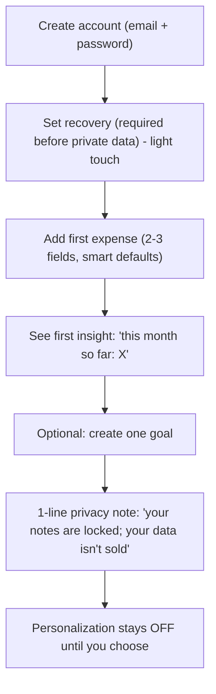
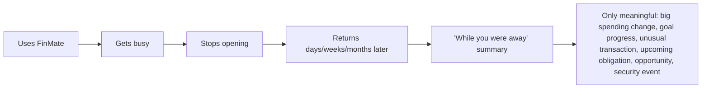
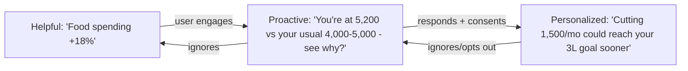
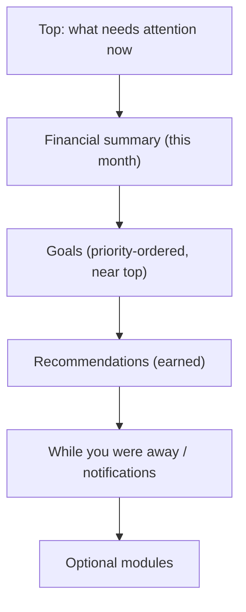
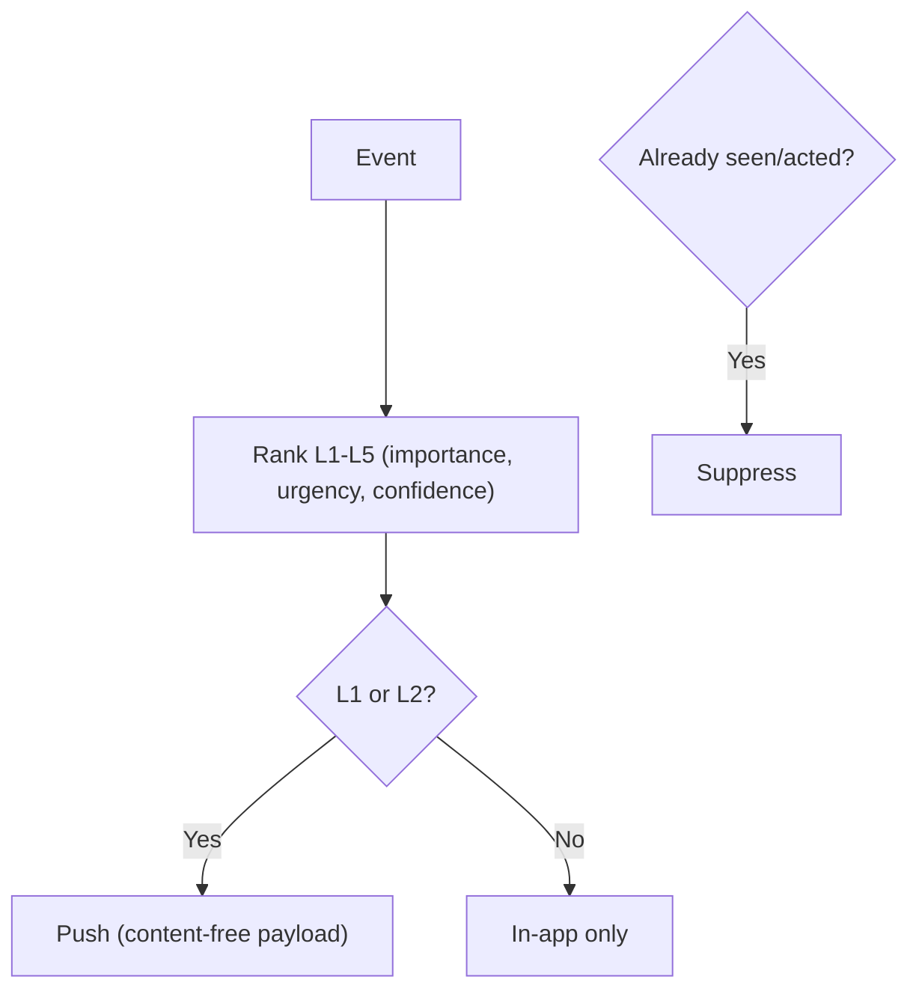
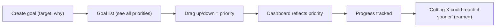
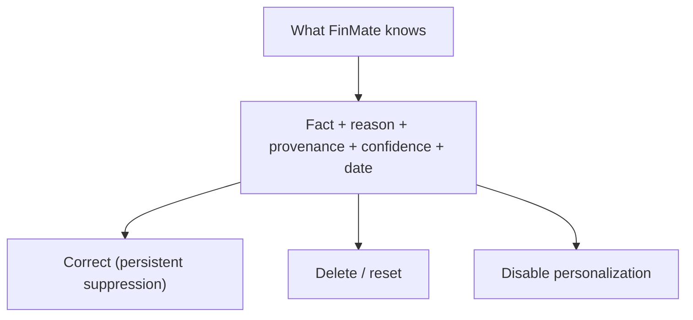
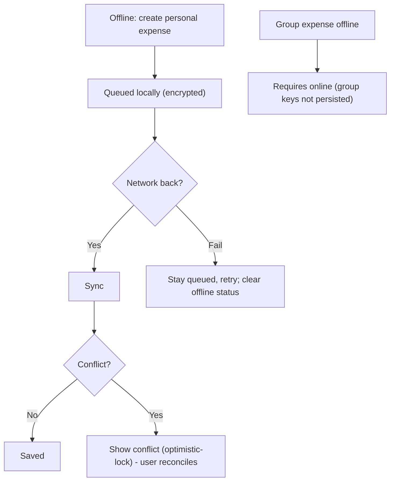
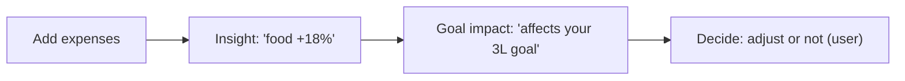

# FinMate — User Experience & User Journey Specification

**Type:** Product/UX specification (not architecture, not pixel design). **Classification:** CONFIDENTIAL (internal product).
**Bridges:** Current System Baseline (#11) + Product Principles (#10) + Security/Privacy architecture (#3–#7) + the future SRS.
**Nature:** Documentation only. No code, DB, migration, API, auth, encryption, production, or frozen document (#1–#11) changed.
**Rule:** never override a frozen decision; if a UX idea conflicts with security/privacy, it is **recorded** (§29), not silently resolved.
**Labels:** **CURRENT** (exists today per #11) · **TARGET** (planned). UX ideas map to security via IDs (E2EE, AI-1..5, RGT-1..3, CON-1, DEL-1, EXP-1, AU-1/AU-4, OFF-1, WARD-1, A3).
**Final principle:** _design around the user's life, not around making them spend more time inside FinMate._

**Reading model:** each major section is **Simple** first, then **Detailed**.

---

## 3. FinMate in 5 minutes (for the user)

### Simple explanation

You open FinMate and it shows the few money things that actually matter to you right now — not a wall of charts. You add expenses quickly, split them with friends, and see who owes whom. FinMate **automatically** notices meaningful changes ("your food spending jumped this month") and, over time, gently offers useful suggestions — but only if you seem to want them. It does **not** automatically move your money, trade, buy things, or nag you. Your private notes are locked so even FinMate can't read them, and you can always see, correct, or delete what FinMate has learned. You can trust it because _your data isn't the product_.

### Detailed UX model

FinMate is a **ranked decision surface**, not a dashboard of charts. It runs the loop **Capture → Understand → Prioritize → Decide → Act → Learn → Improve**, and evolves **Helpful → Proactive → Personalized** only as it earns confidence. Every insight is explainable and reversible; every sensitive processing step is consented and controllable.

---

## 4. User persona (behaviour patterns, not stereotypes)

Primary: a **reasonably capable young professional / average person** who earns and spends across many places, forgets where money went, has vague goals, knows they _should_ invest but lacks confidence, struggles to keep records, gets busy and drops apps, and doesn't know financial jargon or which info matters.

**Behaviour patterns (any user may shift between these):**
| Pattern | Trait | UX response |
|---|---|---|
| **The Recorder** | logs diligently for a while | reward with clear insight, then reduce effort |
| **The Drifter** | starts strong, goes quiet | "while you were away," passive usefulness |
| **The Skeptic** | distrusts apps/AI | privacy-forward, no forced AI, explainable |
| **The Goal-seeker** | motivated by a target | goal visibility, progress tied to real spending |
| **The Overwhelmed** | over budget, anxious | non-judgmental, one thing at a time |
| **The Curious** | wants to understand | "why" behind every number |

**[REC]** Don't assume a single persona; adapt to demonstrated behaviour (ties to earned proactivity).

---

## 5. The core experience loop

### Simple

Write it down → see what it means → know what matters → decide → do it → FinMate learns → things improve.

### Detailed — mapping to the **current** finance product

| Stage          | Meaning                    | Maps to today (CURRENT) | Grows into (TARGET)              |
| -------------- | -------------------------- | ----------------------- | -------------------------------- |
| **Capture**    | record with minimal effort | expense/group/P2P entry | quick-add, statement import      |
| **Understand** | what changed & why         | dashboard aggregation   | decision-oriented cards          |
| **Prioritize** | what matters most          | (implicit)              | ranked surface + goal priority   |
| **Decide**     | choose a next step         | user-driven             | proactive suggestions (earned)   |
| **Act**        | do it                      | edit/settle             | guided actions (user-controlled) |
| **Learn**      | FinMate adapts             | none                    | intelligence (consented)         |
| **Improve**    | better outcomes            | —                       | personalization                  |

---

## 6. First 5 minutes

### Simple

Sign up, and within a minute you've added one expense and seen one useful thing — no long setup.

### Detailed — **conceptual** first session (no setup wall)

**[REC]** No mandatory bank/goal/budget configuration. Recovery setup is required _before storing E2EE private data_ (REC-1) but framed lightly. First value = a real number from the user's own first entry. **[SECURITY DEPENDENCY]** recovery (REC-1), E2EE free-text.

---

## 7. First week

### Simple

Add expenses when convenient; FinMate quietly builds a picture and shows one genuinely useful insight — without demanding daily use.

### Detailed

- Recording gets faster (recent categories, smart defaults).
- Dashboard shifts from "empty" to "here's your shape."
- First **Helpful** insight appears once there's enough data ("food is your biggest category this week").
- Goals (if set) show early progress.
- FinMate learns _preferences by observation_ (which cards the user opens), **not** by interrogation.
- **[REC]** assume the user will **not** interact daily; value must survive gaps.

---

## 8. User disappears → "While You Were Away"

### Simple

You come back after weeks and FinMate greets you with a short, honest summary of what actually changed — not 40 notifications.

### Detailed

**[REC]** The summary is **pull** (shown on return), concise, ranked, and capped. It never becomes a stream of pushes. **[SECURITY DEPENDENCY]** security events (e.g., new device) surfaced clearly but with **content-free** push payloads (NOT-1).

---

## 9. Helpful → Proactive → Personalized

### Simple

FinMate starts by just pointing things out. If you engage, it offers gentle suggestions. If you act on them, it tailors advice to your goals. If you ignore it, it goes quiet.

### Detailed

| Stage        | Evidence required                             | User control                                  |
| ------------ | --------------------------------------------- | --------------------------------------------- |
| Helpful      | enough data                                   | default; always available                     |
| Proactive    | data + engagement signals + confidence        | "quieter" setting; can stay Helpful           |
| Personalized | demonstrated responsiveness + consent (CON-3) | opt-out; suppress specific inferences (RGT-1) |

**[REC]** Progression is **earned by response, not time**; a user who ignores suggestions gets **fewer**. **[OPEN QUESTION]** exact engagement/confidence thresholds (§28).

---

## 10. Dashboard experience

### Simple

The home screen is a smart notice-board: your most important thing is at the top, and tapping a card takes you where you can act.

### Detailed — principles (not pixels)

- Ranked by importance/relevance; **decision-oriented** cards ("so what / now what").
- Sections (order is illustrative, customizable): **financial summary → important changes → goals (near top) → recommendations → notifications/"while away" → optional modules**.
- **Goal cards:** user drags up/down → **priority changes → dashboard ordering + surfacing reflect it**.
- **New goal:** create → **land on the goal list** → user sees/adjusts priorities.
- Show the **minimum useful** info. **[FROZEN alignment]** goals prominent (2nd/3rd position) per vision.

---

## 11. Notification experience

### Simple

FinMate speaks rarely and only when it's worth it. Only truly important things ever buzz your phone.

### Detailed — importance model (engine internal) + simple user control

| Level | Meaning                                                | Default delivery |
| ----- | ------------------------------------------------------ | ---------------- |
| L1    | Critical (fraud, unknown large charge, security event) | **push**         |
| L2    | Important (goal at risk, reward looks off)             | **push**         |
| L3    | Useful                                                 | in-app only      |
| L4    | Low                                                    | in-app only      |
| L5    | Optional                                               | in-app only      |

Ranking uses importance, urgency, confidence, user preference, **whether already visible**, and **whether the user already acted**. Group related items; never push L3–L5. Users configure via simple **quieter / standard / off**.
**Security-critical vs ordinary:** security/critical events may push more assertively but **payloads stay content-free** (NOT-1); ordinary financial suggestions default quiet.

---

## 12. Expense entry experience

### Simple

Adding an expense should take seconds.

### Detailed — **additive** UX (existing calculations untouched)

- Fewer required fields; smart defaults (last category, current currency, today's date).
- Recent/contextual category suggestions.
- Quick-add path; confirmation before important/irreversible actions (delete, settle).
- **[TARGET]** optional voice/image/statement capture where appropriate.
- **[PROTECTED]** do **not** change total/share/payer/refund/settlement/balance calculations (all server-side, Zone 2). E2EE title/description preserved. **[COMPATIBILITY]** additive only.

---

## 13. Group / P2P experience

### Simple

Splitting with friends and tracking who owes whom keeps working exactly as it does now — just smoother over time.

### Detailed

**Preserved (CURRENT):** groups, splits, settlements, People/P2P lend/borrow/settle, refunds, household ledger + carry-forward, derived balances. **Future UX (additive):** clearer balance summaries, easier settle-up, gentle nudges when a balance is stale (L2/L3). **[PROTECTED]** no change to financial logic. **[TARGET]** P2P/settlement notes become E2EE (B-2/FLD-1) — UX unchanged (user still types a note; it's just locked).

---

## 14. Goals experience

### Simple

Make a goal, drag it to show how much it matters, and watch how your spending affects it.

### Detailed

**[REC]** FinMate explains how spending affects goals; **never auto-changes priority** (user controls ordering); periodically asks "does this still matter?" **[STATUS]** goals = TARGET (currently placeholder, empty table). **[SECURITY DEPENDENCY]** goal free-text E2EE (B-1); progress numbers Zone 2.

---

## 15. "What FinMate knows about me"

### Simple

A page listing everything FinMate has figured out about you — with a reason, and buttons to fix or delete each one.

### Detailed

For each learned fact: **fact · why FinMate thinks it · source/provenance · confidence · date · correct · delete/reset · disable personalization**.

**[SECURITY DEPENDENCY]** RGT-2/RGT-1/INT-2/INT-4 — shows provenance (domain + opaque IDs), **never raw internal databases**; correcting a fact creates a **persistent suppression** that survives recompute + re-consent. **[REC]** no UI that exposes raw data or keys.

---

## 16. AI experience

### Simple

FinMate's AI is a helper, not a boss. It explains its thinking using _your own numbers_, and never moves your money.

### Detailed

- **When it helps:** explaining a change, summarizing, answering a bounded question.
- **What it sees:** only minimized numeric/enum projections (AI-2), with your external-AI consent (AI-5).
- **What it cannot see:** your journal, raw transactions, contacts, notes, keys (frozen firewall).
- **How it explains:** shows the numbers behind any suggestion; states confidence; advisory only.
- **AI must NOT** (unless a future approved decision changes it): move money, trade, purchase, cancel services, make medical claims, or make irreversible financial decisions.
  **[SECURITY DEPENDENCY]** AI-1..5 firewall (TARGET; current `/ai/proxy` is a thin proxy — this UX describes the target). **[REC]** AI is opt-in; user can turn it off entirely.

---

## 17. Privacy experience

### Simple

FinMate shows you, in plain words, what it keeps, what's locked, what AI can touch, and gives you simple switches to control it.

### Detailed — conceptual UX (plain language first, legal detail on demand)

| Control            | Plain-language UX                                                   | Backed by           |
| ------------------ | ------------------------------------------------------------------- | ------------------- |
| What's stored      | "Here's what FinMate keeps"                                         | Processing Register |
| What's encrypted   | "These are locked to you"                                           | E2EE / Class-A      |
| What AI can access | "AI only sees summaries, with your OK"                              | AI-2/AI-5           |
| Consent            | simple toggles (finance-insights, wellbeing, external-AI, wardrobe) | CON-3               |
| Withdraw           | "stop using this" (keeps raw unless you delete)                     | CON-1               |
| Delete             | "delete my data" (shared records anonymized)                        | DEL-1               |
| Export             | "download my data"                                                  | EXP-1               |
| Restrict           | "pause using this"                                                  | RGT-1               |
| Correct            | "this is wrong"                                                     | RGT-1               |

**[REC]** avoid legal jargon in primary UX; link to detail. **[COUNSEL]** exact legal wording.

---

## 18. Web / iOS / Android

### Simple

It works the same everywhere, but the phone apps will get extra native protections later.

### Detailed — **CURRENT vs TARGET** (per #11)

| Concern        | Web (CURRENT)                                    | iOS/Android (CURRENT)                                | iOS/Android (TARGET)                   |
| -------------- | ------------------------------------------------ | ---------------------------------------------------- | -------------------------------------- |
| App type       | browser + PWA                                    | **web build wrapped (Capacitor, no native plugins)** | native-hardened                        |
| Auth           | body token today (SEC-W3) → cookie (AU-1 TARGET) | **same body token as web**                           | Keychain/Keystore + header (AU-1/AU-4) |
| Notifications  | web push (TARGET)                                | none yet                                             | native push, content-free (NOT-1)      |
| Deep links     | URLs                                             | basic                                                | Universal/App Links (TARGET)           |
| Offline        | limited                                          | limited                                              | personal-only (OFF-1)                  |
| Secure storage | IndexedDB (master key)                           | wrapped web storage                                  | secure device storage (TARGET)         |

**[REQUIREMENT]** do **not** claim native functionality that isn't built; today mobile ≈ wrapped web.

---

## 19. Offline experience (OFF-1)

### Simple

You can add your _own_ expenses offline; they sync when you're back. Group expenses need a connection.

### Detailed

**[FROZEN]** personal-only offline; group keys never persisted (OFF-1). Conflict UX uses the existing optimistic-lock reconciliation.

---

## 20. Error / failure experience

### Simple

When something breaks, FinMate stays safe and explains gently — it never leaks secrets.

### Detailed

| Failure                      | UX behaviour                                                                                        |
| ---------------------------- | --------------------------------------------------------------------------------------------------- |
| API unavailable              | friendly retry; queue where safe                                                                    |
| AI unavailable               | "AI is unavailable right now" — no fallback to unapproved provider (fail-closed)                    |
| Encryption / key unavailable | show `DECRYPTION_FAILED_PLACEHOLDER` ("Unable to display this item"); preserve ciphertext for retry |
| Notification failure         | silent retry; never duplicate-spam                                                                  |
| Sync failure                 | keep local, retry, clear status                                                                     |
| Invalid input                | inline, specific, non-judgmental                                                                    |
| Stale data                   | conflict modal (optimistic lock)                                                                    |
| Permission denied            | clear, no data leak                                                                                 |

**[SECURITY]** security failures **fail closed**; errors never expose secrets, tokens, keys, or sensitive data (aligns with threat model + no-sensitive-logging).

---

## 21. User control

### Simple

You're in charge of everything important.

### Detailed

User controls: goals, priorities, notification preferences, personalization, AI consent, wellbeing processing, deletion, export, correction, restriction, AI memory, optional modules. **[REC]** FinMate **recommends, never manipulates**; every automated behaviour has an off switch; important actions require confirmation.

---

## 22. Retention without addiction

### Simple

FinMate wins when your life gets better, not when you stare at the app.

### Detailed — success metrics (outcomes, not engagement)

**Measure:** better financial awareness, goal progress, reduced unnecessary spending, better decisions, reduced uncertainty. **Do NOT optimize for:** opens, time-in-app, streak length, notifications clicked. **UX consequence:** passive usefulness, "while you were away," occasional "you've done enough — enjoy your day"; **no** streaks/badges/fake urgency/endless scroll.

---

## 23. User-journey diagrams (index)

First-5-min (§6), While-away (§8), Helpful→Personalized (§9), Dashboard (§10), Notification ranking (§11), Goals: Expense→Insight→Goal (§14), What-FinMate-knows (§15), Privacy control (§17), Web-vs-mobile (§18), Offline (§19).

**Expense → Insight → Goal (simple)**

---

## 24. UX anti-patterns (prohibited)

Guilt messages · fear manipulation · notification spam · dark patterns · forced personalization · forced AI · endless setup · unnecessary data collection · addictive streaks · fake urgency · hidden deletion/export · automatic financial decisions. **[EVIDENCE]** each is tied to churn/distrust in the Competitive Lessons doc.

---

## 25. Accessibility (baseline requirements)

Readable typography; sufficient contrast (WCAG AA per existing standards); screen-reader support; keyboard navigation on web; touch-friendly controls; clear error messages; **non-color-only meaning** (critical — avoids the red/green guilt _and_ aids color-blind users); localization-ready text; plain-language financial terminology with optional definitions. **[STATUS]** aligns with existing AGENT_RULES accessibility requirement (WCAG AA, AXE). Do not freeze UI tech beyond what exists (Angular + Tailwind).

---

## 26. Current vs Target UX

| Capability      | Current experience | Target experience                | Status                     | Compatibility    | Migration?       |
| --------------- | ------------------ | -------------------------------- | -------------------------- | ---------------- | ---------------- |
| Expenses        | functional entry   | faster/quick-add, decision cards | CURRENT→enhance            | additive         | No               |
| Groups          | full               | smoother balances/settle-up      | CURRENT→enhance            | additive         | No               |
| P2P             | full               | + locked notes                   | CURRENT→enhance            | additive         | backfill (notes) |
| Settlements     | full               | clearer settle-up                | CURRENT→enhance            | additive         | backfill (notes) |
| Dashboard       | aggregation        | ranked decision surface          | CURRENT→redesign(additive) | additive         | No               |
| Goals           | **placeholder**    | create/prioritize/progress       | TARGET                     | new              | none (empty)     |
| Notifications   | **none**           | ranked, quiet, L1/L2 push        | TARGET                     | additive         | No               |
| AI              | thin proxy chat    | explainable firewall assistant   | PARTIAL→TARGET             | additive, opt-in | No               |
| Privacy         | basic settings     | full transparency + controls     | CURRENT→enhance            | additive         | No               |
| Mobile          | **web wrapped**    | native-hardened                  | CURRENT→TARGET             | additive         | No               |
| Offline         | limited            | personal-only, clear sync        | CURRENT→TARGET             | additive         | No               |
| Personalization | none               | earned, controllable             | TARGET                     | additive, gated  | No               |
| Wellbeing       | none               | opt-in, gentle                   | TARGET                     | new domain       | No               |
| Wardrobe        | none               | suitability suggestions          | TARGET                     | new domain       | No               |
| Opportunities   | none               | inform/compare/explain           | TARGET                     | new service      | No               |

---

## 27. UX SRS candidates

| UX-ID | Requirement                                          | Priority | Reason              | Current/Target     | Compatibility    | Security dep          | Acceptance idea                            |
| ----- | ---------------------------------------------------- | -------- | ------------------- | ------------------ | ---------------- | --------------------- | ------------------------------------------ |
| UX-01 | First-session value, no setup wall                   | P0       | onboarding friction | Target             | additive         | REC-1                 | user sees a real number in <5 min          |
| UX-02 | Quick-add expense (2–3 fields, smart defaults)       | P0       | entry effort        | Enhance            | additive         | E2EE                  | expense added in <10s                      |
| UX-03 | Decision-oriented dashboard cards                    | P0       | decide>record       | Redesign(additive) | additive         | —                     | each card has an action/answer             |
| UX-04 | Non-judgmental language; no red-fail states          | P0       | guilt→churn         | Enhance            | additive         | —                     | no shame copy; ranges not caps             |
| UX-05 | Ranked notifications; push only L1/L2; quiet default | P0       | fatigue             | Target             | additive         | NOT-1                 | ≤ few pushes/wk; simple control            |
| UX-06 | "While you were away" summary                        | P1       | passive usefulness  | Target             | additive         | NOT-1                 | concise ranked summary on return           |
| UX-07 | Goals: create→list→priority→progress                 | P1       | goal engagement     | Target             | new              | B-1                   | drag reorders; affects surfacing           |
| UX-08 | "What FinMate knows" transparency + controls         | P1       | trust               | Target             | additive         | RGT-2/1, INT-2/4      | fact editable/deletable; no raw data       |
| UX-09 | AI shows underlying numbers; advisory only           | P1       | AI trust            | Target             | additive, opt-in | AI-1..5               | every suggestion cites numbers             |
| UX-10 | Privacy controls in plain language                   | P1       | trust               | Enhance            | additive         | CON-1/3, DEL-1, EXP-1 | toggles for consent/withdraw/delete/export |
| UX-11 | Fail-closed, secret-safe error UX                    | P1       | security            | Enhance            | additive         | threat model          | AI-unavailable never falls back; no leaks  |
| UX-12 | Offline personal-only with clear sync/conflict       | P2       | reliability         | Target             | additive         | OFF-1                 | group blocked offline; conflict modal      |
| UX-13 | Native mobile hardening UX (secure storage, push)    | P2       | mobile security     | Target             | additive         | AU-1/AU-4             | Keychain/Keystore; content-free push       |
| UX-14 | Outcome-based success metrics (not engagement)       | P1       | anti-addiction      | Principle          | n/a              | —                     | no streaks; measure outcomes               |

---

## 28. Open product questions (unresolved — not solved here)

- OQ-UX-1: exact dashboard card ordering & customization model.
- OQ-UX-2: precise notification thresholds per level.
- OQ-UX-3: first-session onboarding length (how light is "light"?).
- OQ-UX-4: exact proactivity confidence/engagement thresholds (ties to OQ-2 from #10).
- OQ-UX-5: exact offline scope/conflict UX details.
- OQ-UX-6: AI explanation format (how numbers are shown).
- OQ-UX-7: recovery-setup UX friction vs data-loss protection balance.
- OQ-UX-8 (carried): bank aggregation (OQ-1 from #10) — affects capture UX.

---

## 29. Final reconciliation

- **Current UX capabilities:** expense/group/P2P/settlement entry, dashboard aggregation, auth flows, opt-in AI chat, export — all CURRENT and **protected**.
- **Target UX capabilities:** decision-oriented dashboard, goals, ranked-quiet notifications, "while you were away," "what FinMate knows," explainable AI, privacy controls, native mobile hardening, personalization.
- **Protected existing flows:** all finance calculations, splits, settlements, P2P, refunds, household, auth, E2EE free-text — unchanged; UX changes are **additive**.
- **Major UX opportunities:** decision-help over charts; earned proactivity; transparency/trust; passive usefulness; low-effort capture.
- **Compatibility risks:** only mobile-auth transport (AU-1/AU-4) carries a breaking edge (dual-emit mitigates); everything else additive.
- **Security/privacy dependencies:** E2EE, AI-1..5, CON-1/3, RGT-1/2/3, INT-2/4, DEL-1, EXP-1, NOT-1, OFF-1, REC-1, AU-1/4, WARD-1, A3 — all **honoured, none overridden**.
- **Unresolved questions:** 8 (§28).
- **SRS candidates:** UX-01..UX-14.
- **Contradictions with Documents #1–#11:** **NONE.** Every UX idea maps to a frozen decision; where UX needs a capability that isn't built (goals, notifications, firewall, native mobile), it is labelled **TARGET**, not claimed as current. No frozen document changed.

_End of Document #12. UX specification only — no code, database, migration, API, auth, encryption, production, or frozen document was changed. Designed around the user's life, not screen time._
